# 计划：Community 通用化改造 + 元数据双写

## 一、核心设计决策

### 1.1 通用化字段映射

| 旧字段（Neo4j / DO） | 新字段 | 说明 |
|---|---|---|
| `legal_domain` | `domain_type` | 领域类型 |
| `jurisdiction` | `region` | 区域/管辖区 |
| `practice_type` | `scenario_type` | 场景类型 |
| `legal_process` | `process_type` | 业务流程类型（Episode） |
| `court_level` | `stage_level` | 阶段级别（Episode） |
| `is_trial_stage` | `is_review_stage` | 是否审查阶段（Episode） |

元数据表 `ont_community_type` 的 `category` 字段值同步更新：`jurisdiction` → `region`，`practice` → `scenario`

### 1.2 多领域分类体系

```
DOMAIN_ROOT（顶层）
├── DOMAIN_LEGAL（法律）
│   ├── DOMAIN_CIVIL / CRIMINAL / ADMIN / IP / LABOR
├── DOMAIN_FINANCE（金融）
│   ├── DOMAIN_BANKING / SECURITIES / INSURANCE / RISK
├── DOMAIN_ENTERPRISE（企业管理）
├── DOMAIN_MEDICAL（医疗）
└── DOMAIN_SOCIAL_GOV（社会治理）— 200+ 二级分类
    ├── 婚恋家庭纠纷（12 项）
    ├── 劳动人事争议（9 项）
    ├── 侵权责任纠纷（25 项）
    ├── 消费服务纠纷（19 项）
    └── ...（行政纠纷50+、经济金融23+ 等）
```

### 1.3 图数据库 ↔ 元数据表双写策略

- **映射关系**：`typeCode` 作为分类维度，一个 typeCode 对应多个 Community 实例；元数据表存类型模板，Neo4j 存实例数据
- **graphId → definitionId**：通过 `OntDefinitionMapper.selectByGraphId(graphId)` 解析
- **跨库事务**：MySQL 用 `@Transactional`，Neo4j 失败时抛 `CommunityMetadataCompensationException` 触发 MySQL 回滚

---

## 二、任务分解

### T1. 数据库 Schema 改造

**文件**：
- `sql/postgresql/schema-v3.sql` — PostgreSQL DDL
- `sql/mysql/schema-v3.sql` — MySQL DDL（如有）

**内容**：

#### T1a. ont_episode_type 字段重命名

```sql
ALTER TABLE ont_episode_type
  RENAME COLUMN legal_process TO process_type;
ALTER TABLE ont_episode_type
  RENAME COLUMN court_level TO stage_level;
ALTER TABLE ont_episode_type
  RENAME COLUMN is_trial_stage TO is_review_stage;
COMMENT ON COLUMN ont_episode_type.process_type IS
  '业务流程类型：business_process|lifecycle|workflow';
```

#### T1b. ont_community_type 新增字段（用于实例级关联）

```sql
ALTER TABLE ont_community_type
    ADD COLUMN IF NOT EXISTS community_uuid VARCHAR(64),
    ADD COLUMN IF NOT EXISTS graph_id VARCHAR(64),
    ADD COLUMN IF NOT EXISTS jurisdiction VARCHAR(32)  -- 软兼容：新数据写入 region 列，旧数据保留 jurisdiction
    ADD COLUMN IF NOT EXISTS practice_type VARCHAR(32) -- 软兼容：新数据写入 scenario_type 列
    ADD COLUMN IF NOT EXISTS region VARCHAR(32),
    ADD COLUMN IF NOT EXISTS scenario_type VARCHAR(32);
```

#### T1c. 初始数据

参照 `community-generic-design.md` 第 4 节，插入五领域 + 社会治理 200+ 分类数据。

---

### T2. Neo4j 迁移脚本

**文件**：`sql/migrations/v004_community_generic_rename.cypher`

```cypher
// Community 节点属性重命名
MATCH (c:Community)
WHERE c.legal_domain IS NOT NULL
SET c.domain_type = c.legal_domain REMOVE c.legal_domain
SET c.region = COALESCE(c.jurisdiction, 'REGION_ROOT') REMOVE c.jurisdiction
SET c.scenario_type = COALESCE(c.practice_type, 'SCENARIO_ROOT') REMOVE c.practice_type;

// Episode 节点属性重命名
MATCH (e:Episode)
WHERE e.legal_process IS NOT NULL
SET e.process_type = e.legal_process REMOVE e.legal_process
SET e.stage_level = COALESCE(e.court_level, null) REMOVE e.court_level
SET e.is_review_stage = COALESCE(e.is_trial_stage, false) REMOVE e.is_trial_stage;

// 验证
MATCH (c:Community) RETURN count(c) as total, count(c.domain_type) as with_domain;
MATCH (e:Episode) RETURN count(e) as total, count(e.process_type) as with_process;
```

---

### T3. 异常类

**文件**：`graphiti-module-core/src/main/java/com/graphiti/module/graphiti/exception/CommunityMetadataCompensationException.java`

```java
public class CommunityMetadataCompensationException extends RuntimeException {
    private final String graphId;
    private final String communityUuid;
    public CommunityMetadataCompensationException(String message, String graphId, String communityUuid) { ... }
}
```

用途：Neo4j 写入失败时抛出，触发 Spring `@Transactional` 回滚 MySQL。

---

### T4. DO/VO 扩展

#### T4a. OntCommunityTypeDO — 新增字段 + 通用化注释

**文件**：`graphiti-module-core/src/main/java/com/graphiti/module/graphiti/dal/dataobject/metadata/OntCommunityTypeDO.java`

```java
// 表注释改为：定义知识图谱中社区的分类体系，支持多领域通用分类

@TableField("community_uuid")
private String communityUuid;   // 关联图数据库节点 uuid

@TableField("graph_id")
private String graphId;        // 图谱 ID

@TableField("region")
private String region;          // 区域（原 jurisdiction）

@TableField("scenario_type")
private String scenarioType;    // 场景类型（原 practice_type）
```

#### T4b. OntCommunityTypeReqVO — 新增字段

**文件**：`graphiti-module-core/src/main/java/com/graphiti/module/graphiti/vo/metadata/OntCommunityTypeReqVO.java`

新增：`communityUuid`、`graphId`、`region`、`scenarioType`、`domainType`（对应 `category=domain` 时的 typeCode）

#### T4c. OntCommunityTypeRespVO — 新增字段

与 DO 对齐。

#### T4d. OntEpisodeTypeDO / ReqVO / RespVO — 字段重命名

`legal_process` → `process_type`，`court_level` → `stage_level`，`is_trial_stage` → `is_review_stage`

---

### T5. Mapper 扩展

#### T5a. CommunityMetadataMapper（新接口）

**文件**：`graphiti-module-core/src/main/java/com/graphiti/module/graphiti/dal/mysql/metadata/CommunityMetadataMapper.java`

```java
@Mapper
public interface CommunityMetadataMapper {

    // 1. 按 definitionId + typeCode 查找一条记录（用于判断是否存在）
    @Select("SELECT * FROM ont_community_type WHERE definition_id = #{definitionId} AND type_code = #{typeCode} LIMIT 1")
    OntCommunityTypeDO findByCode(@Param("definitionId") Long definitionId, @Param("typeCode") String typeCode);

    // 2. upsert：若不存在则插入（createCommunity 调用）
    @Insert("INSERT INTO ont_community_type (definition_id, type_code, type_name, category, parent_type_code, region, scenario_type, status, graph_id) " +
            "VALUES (#{d.definitionId}, #{d.typeCode}, #{d.typeName}, #{d.category}, #{d.parentTypeCode}, #{d.region}, #{d.scenarioType}, 'ACTIVE', #{d.graphId}) " +
            "ON DUPLICATE KEY UPDATE type_name = #{d.typeName}, region = #{d.region}, scenario_type = #{d.scenarioType}")
    void upsertIfAbsent(@Param("d") OntCommunityTypeDO d);

    // 3. 按 typeCode 更新元数据（updateCommunity 调用）
    @Update("UPDATE ont_community_type SET type_name = #{d.typeName}, region = #{d.region}, scenario_type = #{d.scenarioType}, updated_at = NOW() " +
            "WHERE definition_id = #{d.definitionId} AND type_code = #{d.typeCode}")
    void updateByCode(@Param("d") OntCommunityTypeDO d);

    // 4. 软删除（deleteCommunity 中无其他社区引用时调用）
    @Update("UPDATE ont_community_type SET status = 'INACTIVE', updated_at = NOW() " +
            "WHERE definition_id = #{definitionId} AND type_code = #{typeCode} AND community_uuid IS NOT NULL")
    void softDeleteByCode(@Param("definitionId") Long definitionId, @Param("typeCode") String typeCode);

    // 5. 统计某类型在 Neo4j 中的剩余社区数量（用于判断是否可软删除元数据）
    // 注：此方法需要注入 Neo4j Driver，在 Service 层用 Cypher 查询实现
}
```

#### T5b. OntCommunityTypeMapper 补充方法

**文件**：`graphiti-module-core/src/main/java/com/graphiti/module/graphiti/dal/mysql/metadata/OntCommunityTypeMapper.java`

补充 `selectActiveByDefinitionId`，用于 `getCommunityTypeTree`（前端下拉数据源）。

---

### T6. DomainInferenceService（新增）

**文件**：`graphiti-module-core/src/main/java/com/graphiti/module/graphiti/service/DomainInferenceService.java`

```java
public interface DomainInferenceService {
    /**
     * 两阶段领域推断（通用）
     * @param communityName 社区名称
     * @param memberContents 成员内容摘要（用于上下文）
     * @param availableTypes 从 ont_community_type 加载的可选类型
     * @return 推断结果含置信度和用户覆盖字段
     */
    DomainInferenceResult infer(String communityName,
                                List<String> memberContents,
                                List<OntCommunityTypeDO> availableTypes);
}

public class DomainInferenceResult {
    private String domainType;       // 顶层领域
    private String subDomainType;    // 子领域（可选）
    private String region;           // 区域
    private String scenarioType;     // 场景
    private Double confidence;        // 置信度 0.0~1.0
    private String reasoning;       // 推断理由
    private boolean userOverridden;  // 用户是否手动覆盖
}
```

推断策略：LLM 两阶段推断（顶层领域 → 子类型），置信度 < 0.7 时强制用户确认。

---

### T7. CommunityServiceImpl 核心改造

**文件**：`graphiti-module-core/src/main/java/com/graphiti/module/graphiti/service/impl/CommunityServiceImpl.java`

注入新依赖：
- `OntDefinitionMapper`（graphId → definitionId）
- `OntCommunityTypeMapper`（元数据 Mapper）
- `CommunityMetadataMapper`（新增扩展 Mapper）
- `DomainInferenceService`（LLM 领域推断）

#### T7a. 删除硬编码推断方法

删除 `resolveCommunityType()` 和 `resolveLegalDomain()`，替换为从参数或 LLM 推断获取。

#### T7b. createCommunity — 双写

```java
@Transactional(rollbackFor = Exception.class)
public Map<String, Object> createCommunity(String graphId, Map<String, Object> body) {
    // 1. graphId → definitionId
    Long definitionId = resolveDefinitionId(graphId);

    // 2. LLM 推断 + 用户覆盖（domainType / region / scenarioType）
    DomainInferenceResult inference = inferIfNeeded(graphId, body);

    // 3. 元数据 upsert（definitionId + typeCode 不存在则插入）
    upsertCommunityTypeMetadata(definitionId, graphId, body, inference);

    // 4. 写 Neo4j Community 节点
    Map<String, Object> neo4jResult = writeNeo4jCommunityNode(graphId, body, inference);

    // 5. Neo4j 失败则抛 CommunityMetadataCompensationException 触发 MySQL 回滚
    return neo4jResult;
}
```

#### T7c. updateCommunity — 双写

```java
@Transactional(rollbackFor = Exception.class)
public Map<String, Object> updateCommunity(String graphId, String communityUuid, Map<String, Object> body) {
    // 1. 更新 Neo4j（现有逻辑）
    Map<String, Object> result = writeNeo4jUpdate(graphId, communityUuid, body);

    // 2. 同步元数据表
    Long definitionId = resolveDefinitionId(graphId);
    syncMetadataOnUpdate(definitionId, graphId, body);

    return result;
}
```

#### T7d. deleteCommunity — 双写 + 引用计数

```java
@Transactional(rollbackFor = Exception.class)
public void deleteCommunity(String graphId, String communityUuid) {
    // 1. 读取 typeCode 备用
    String typeCode = resolveTypeCodeFromNeo4j(graphId, communityUuid);

    // 2. 删除 Neo4j 节点
    deleteNeo4jCommunityNode(graphId, communityUuid);

    // 3. 检查该 typeCode 在 Neo4j 中剩余数量
    int remaining = countNeo4jCommunitiesByType(graphId, typeCode);
    if (remaining == 0) {
        // 无其他社区引用，软删除元数据
        Long definitionId = resolveDefinitionId(graphId);
        communityMetadataMapper.softDeleteByCode(definitionId, typeCode);
    }
}
```

#### T7e. listCommunities — 联合查询

```java
public List<Map<String, Object>> listCommunities(String graphId) {
    // 1. 从 ont_community_type 加载元数据（按 definitionId）
    Long definitionId = resolveDefinitionId(graphId);
    List<OntCommunityTypeDO> metaTypes = communityTypeMapper.selectActiveByDefinitionId(definitionId)
            .stream().collect(Collectors.toMap(OntCommunityTypeDO::getTypeCode, Function.identity()));

    // 2. 从 Neo4j 查询社区实例
    List<Map<String, Object>> communities = queryNeo4jCommunities(graphId);

    // 3. join 元数据，补全 typeName / description / metadata（色彩等）
    for (Map<String, Object> c : communities) {
        String typeCode = (String) c.get("communityType");
        OntCommunityTypeDO meta = metaTypes.get(typeCode);
        if (meta != null) {
            c.put("typeName", meta.getTypeName());
            c.put("region", meta.getRegion());
            c.put("scenarioType", meta.getScenarioType());
            c.put("metadata", meta.getMetadata());
        }
    }
    return communities;
}
```

#### T7f. getCommunityHierarchy — 联合查询

```java
public List<Map<String, Object>> getCommunityHierarchy(String graphId, String dimension) {
    // 1. 从元数据表获取 domain / region / scenario 三维分类树
    Long definitionId = resolveDefinitionId(graphId);
    List<OntCommunityTypeDO> allTypes = communityTypeMapper.selectActiveByDefinitionId(definitionId);

    // 2. 从 Neo4j 统计各 typeCode 的实例数量
    Map<String, Long> typeCountMap = countNeo4jCommunitiesByType(graphId);

    // 3. 组装：domain → subDomain → type 三级树
    // 按 dimension 参数过滤：domain|jurisdiction|region|practice|scenario
    return buildHierarchyTree(allTypes, typeCountMap, dimension);
}
```

#### T7g. removeCommunities

```java
@Transactional(rollbackFor = Exception.class)
public void removeCommunities(String graphId) {
    // 1. 删除 Neo4j 所有社区节点（现有逻辑）
    deleteAllNeo4jCommunities(graphId);

    // 2. 软删除所有相关元数据记录
    Long definitionId = resolveDefinitionId(graphId);
    List<String> affectedTypeCodes = listAffectedTypeCodes(graphId);
    for (String code : affectedTypeCodes) {
        communityMetadataMapper.softDeleteByCode(definitionId, code);
    }
}
```

#### T7h. buildCommunities（不变）

标签传播自动发现的社区，不写元数据表（预定义类型的概念不适用于自动发现），保持现有逻辑不变。

---

### T8. 前端改造

**文件**：`graphiti-web/src/views/data/community-episode.vue`

1. 下拉选项从 `ont_community_type` API 实时拉取（按 `category` 过滤 domain / region / scenario）
2. TypeScript 类型：`legalDomain` → `domainType`，`jurisdiction` → `region`，`practiceType` → `scenarioType`
3. 色彩从 `ont_community_type.metadata.color` 读取，不再硬编码

---

### T9. 文档更新

- `docs/legal_graph.md` — 通用化描述
- `docs/ontology.md` — 更新字段说明

---

## 三、数据流图

```mermaid
flowchart TB
    subgraph "MySQL (ont_community_type)"
        M[元数据表]
    end
    subgraph "Neo4j (Community 节点)"
        G[图数据库]
    end

    subgraph "createCommunity"
        A0[LLM 两阶段推断 domainType / region / scenarioType] --> A1[元数据 upsert\nupsertCommunityTypeMetadata]
        A1 --> A2[写 Neo4j 节点\nwriteNeo4jCommunityNode]
        A2 -. 失败 .-> A3[CommunityMetadataCompensationException\n→ MySQL 回滚]
    end

    subgraph "deleteCommunity"
        B1[读取 typeCode] --> B2[删除 Neo4j 节点]
        B2 --> B3{Neo4j 同类型剩余数量}
        B3 -- 0 --> B4[软删除元数据记录]
        B3 -- >0 --> B5[保留元数据]
    end

    subgraph "listCommunities / getCommunityHierarchy"
        C1[查 MySQL 元数据表\nOntCommunityTypeMapper] --> C2[查 Neo4j 实例列表]
        C2 --> C3[join 组装\n补全 typeName / 色彩等]
    end
```



---

## 四、实施顺序

```
Phase 1: 数据库层
  T1 (DDL) → T2 (Neo4j 迁移脚本) → 验证

Phase 2: Java 后端骨架
  T3 (异常类) → T4 (DO/VO) → T5 (Mapper)

Phase 3: 核心业务逻辑
  T6 (DomainInferenceService) → T7 (ServiceImpl 6 个方法)

Phase 4: 前端
  T8 (下拉 + 类型)

Phase 5: 收尾
  T9 (文档)
```

---

## 五、关键文件清单

| 文件 | 状态 |
|---|---|
| `sql/postgresql/schema-v3.sql` | 修改 |
| `sql/migrations/v004_community_generic_rename.cypher` | 新增 |
| `exception/CommunityMetadataCompensationException.java` | 新增 |
| `dal/dataobject/metadata/OntCommunityTypeDO.java` | 修改 |
| `vo/metadata/OntCommunityTypeReqVO.java` | 修改 |
| `vo/metadata/OntCommunityTypeRespVO.java` | 修改 |
| `dal/dataobject/metadata/OntEpisodeTypeDO.java` | 修改 |
| `vo/metadata/OntEpisodeTypeReqVO.java` | 修改 |
| `vo/metadata/OntEpisodeTypeRespVO.java` | 修改 |
| `dal/mysql/metadata/CommunityMetadataMapper.java` | 新增 |
| `dal/mysql/metadata/OntCommunityTypeMapper.java` | 修改 |
| `service/DomainInferenceService.java` | 新增 |
| `service/impl/DomainInferenceServiceImpl.java` | 新增 |
| `service/impl/CommunityServiceImpl.java` | 修改 |
| `graphiti-web/src/views/data/community-episode.vue` | 修改 |
| `docs/legal_graph.md` | 修改 |
| `docs/ontology.md` | 修改 |
