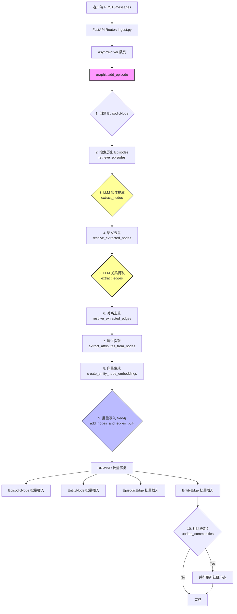
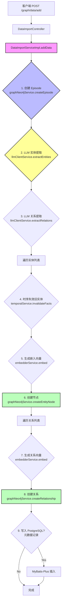
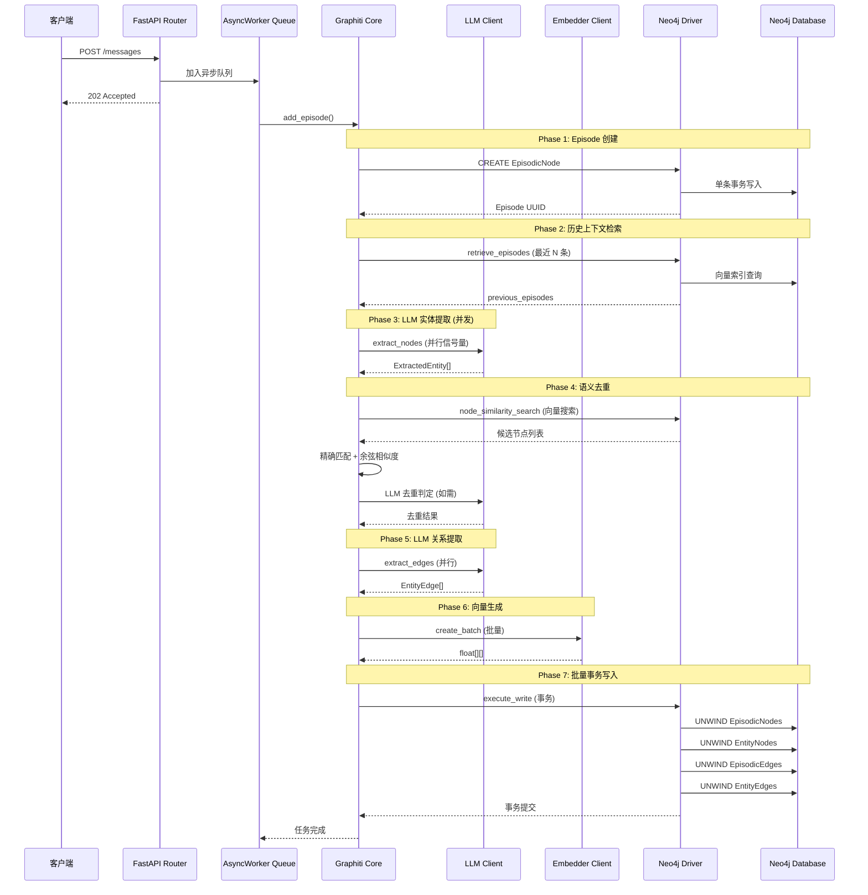
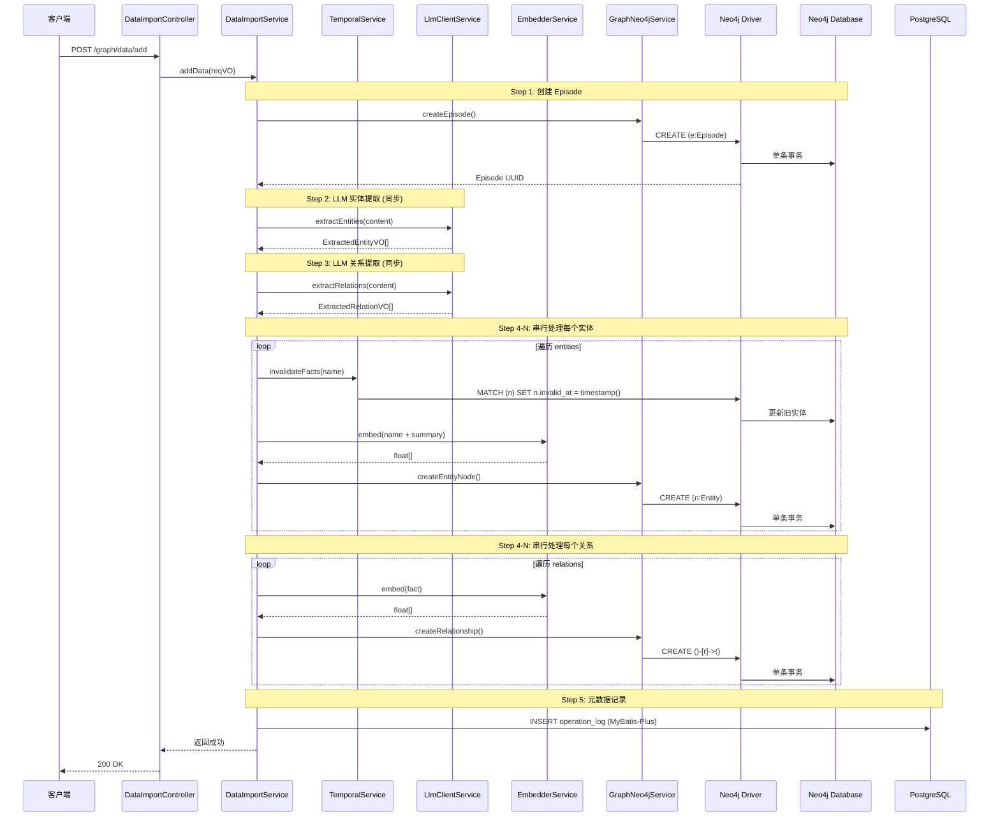

# addData 接口数据入库 Pipeline 完整技术文档

## 文档信息

| 项目 | 内容 |
|------|------|
| **文档版本** | v1.0 |
| **创建日期** | 2026-05-25 |
| **适用范围** | Graphiti-Java / Graphiti-Python 研发团队 |
| **文档用途** | 核心技术文档归档、代码评审参考、架构优化依据 |

---

## 一、项目架构概览

### 1.1 Python 项目 (graphiti-core)

**技术栈**: FastAPI + Neo4j Driver + OpenAI/Anthropic LLM + Asyncio

**核心特征**:
- 全异步架构 (async/await)
- 基于 `semaphore_gather` 的并发控制
- 批量操作优化 (`add_episode_bulk`)
- Union-Find 去重算法
- 事务性批量写入 (UNWIND)

### 1.2 Java 项目 (graphiti-java)

**技术栈**: Spring Boot 3.5.5 + MyBatis-Plus + Neo4j Driver + Spring AI

**核心特征**:
- 同步阻塞架构 (传统 Spring MVC)
- 逐条串行处理
- 独立服务分层 (Controller → Service → Neo4jService)
- PostgreSQL 元数据管理
- Redis 缓存层

---

## 二、addData 接口完整 Pipeline 流程图

### 2.1 Python 项目 Pipeline



### 2.2 Java 项目 Pipeline



---

## 三、核心时序图对比

### 3.1 Python 项目时序图



### 3.2 Java 项目时序图



---

## 四、批量导入流程对比

### 4.1 Python 批量导入 (`add_episode_bulk`)

```mermaid
graph TB
    A[RawEpisode[] 批量输入] --> B[创建所有 EpisodicNodes]
    B --> C[批量保存 Episodes<br/>UNWIND 事务]
    
    C --> D[检索每个 Episode 的历史上下文<br/>semaphore_gather 并行]
    
    D --> E[批量提取节点和边<br/>extract_nodes_and_edges_bulk]
    E --> F[并行 LLM 调用<br/>每个 Episode 独立提取]
    
    F --> G[批量去重节点<br/>dedupe_nodes_bulk]
    G --> H[第一遍: 对比图谱中已有节点]
    H --> I[第二遍: 批次内去重<br/>Union-Find 算法]
    
    I --> J[批量去重边<br/>dedupe_edges_bulk]
    J --> K[向量相似度过滤]
    K --> L[LLM 去重判定]
    
    L --> M[解析指针映射<br/>resolve_edge_pointers]
    
    M --> N[批量写入<br/>add_nodes_and_edges_bulk]
    N --> O[UNWIND 单次事务]
    O --> P[所有 Nodes + Edges 原子写入]
```

### 4.2 Java 批量导入 (`addDataBatch`)

```mermaid
graph TB
    A[BatchDataItemVO[] 批量输入] --> B[遍历 items]
    B --> C{循环调用 addData}
    C --> D[为每个 item 创建 Episode]
    D --> E[LLM 提取实体]
    E --> F[LLM 提取关系]
    F --> G[串行创建节点]
    G --> H[串行创建关系]
    H --> C
    
    C --> I[所有 items 处理完成]
    
    style C fill:#f99,stroke:#f00,stroke-width:3px
    style G fill:#f99,stroke:#f00,stroke-width:2px
    style H fill:#f99,stroke:#f00,stroke-width:2px
```

---

## 五、关键技术点对比分析

### 5.1 并发策略

| 维度 | Python 项目 | Java 项目 | 差异分析 |
|------|-------------|-----------|----------|
| **并发模型** | asyncio + semaphore_gather | 同步阻塞 (单线程) | Python 采用异步非阻塞 I/O，支持高并发 |
| **LLM 调用** | 并行信号量控制 (`max_coroutines`) | 串行逐个调用 | Python 批量提取时 LLM 调用可并行化 |
| **向量生成** | 批量 API (`create_batch`) | 逐条调用 `embed()` | Python 减少网络往返次数 |
| **数据库写入** | UNWIND 批量事务 | 单条 CREATE 语句循环 | Python 减少事务开销 |
| **去重算法** | Union-Find + 语义相似度 | 无去重逻辑 | Python 避免重复节点创建 |

### 5.2 事务边界设计

#### Python 项目事务模型

```python
# 单个大事务包含所有写入操作
async def add_nodes_and_edges_bulk_tx(tx, ...):
    # 在同一个写事务中完成所有操作
    await tx.run(UNWIND episodic_nodes)
    await tx.run(UNWIND entity_nodes)
    await tx.run(UNWIND episodic_edges)
    await tx.run(UNWIND entity_edges)
    # 自动提交或回滚
```

**优势**:
- ✅ 原子性保证：要么全成功，要么全失败
- ✅ 减少事务开启/提交开销
- ✅ 避免中间状态可见

**劣势**:
- ❌ 大事务可能长时间持有锁
- ❌ 失败时需重试整个批次

#### Java 项目事务模型

```java
// 每条记录独立事务
public Map<String, Object> createEntityNode(...) {
    try (Session session = neo4jDriver.session()) {
        Result result = session.run(cypher, params);
        // 隐式事务：每条语句一个事务
    }
}
```

**优势**:
- ✅ 单条失败不影响其他记录
- ✅ 锁持有时间短

**劣势**:
- ❌ 无原子性保证（部分成功）
- ❌ N 条记录 = N 个事务开销
- ❌ 可能出现数据不一致

### 5.3 向量缓存机制

#### Python 项目

```python
# 批量向量生成，支持缓存
async def create_entity_node_embeddings(embedder, nodes):
    texts = [f"{node.name} {node.summary}" for node in nodes]
    embeddings = await embedder.create_batch(texts)  # 批量 API
    for node, emb in zip(nodes, embeddings):
        node.name_embedding = emb
```

**特征**:
- 批量调用 Embedding API（减少 HTTP 请求）
- 支持异步并发
- 未显式实现缓存层（依赖外部 Embedding 服务缓存）

#### Java 项目

```java
// 逐条生成向量
for (ExtractedEntityVO entity : entities) {
    String embedText = name + " " + summary;
    float[] embedding = embedderService.embed(embedText);  // 同步调用
    graphNeo4jService.createEntityNode(..., embedding, ...);
}
```

**特征**:
- 同步阻塞调用
- 每次生成向量后立即写入数据库
- 未实现向量缓存（重复文本会重复调用 Embedding API）

### 5.4 去重逻辑

#### Python 项目（完整去重流程）

```
1. 精确去重（归一化名称匹配）
   ↓
2. 向量相似度搜索（Cosine ≥ 0.6）
   ↓
3. LLM 判定（语义重复检测）
   ↓
4. Union-Find 合并重复组
   ↓
5. 保留最具体节点（标签更多/名称更长）
```

#### Java 项目

```
❌ 未实现去重逻辑
- 同名实体可能被多次创建
- 依赖 `invalidateFacts` 失效旧实体（非去重）
```

---

## 六、潜在瓶颈分析

### 6.1 Java 项目瓶颈

| 瓶颈点 | 影响 | 严重程度 | 量化分析 |
|--------|------|----------|----------|
| **串行 LLM 调用** | 批量导入时间线性增长 | 🔴 严重 | 100 条数据 × 2 次 LLM = 200 次串行调用 |
| **逐条数据库写入** | 事务开销放大 | 🔴 严重 | 100 实体 + 200 关系 = 300 个独立事务 |
| **无去重逻辑** | 数据冗余 + 存储浪费 | 🟡 中等 | 同名实体重复创建，查询性能下降 |
| **向量 API 逐条调用** | 网络延迟累积 | 🟡 中等 | 每次 Embedding 调用约 50-200ms |
| **findOrCreateNode 全表扫描** | O(N) 查询 | 🟡 中等 | 每次扫描 1000 条记录 |

### 6.2 Python 项目瓶颈

| 瓶颈点 | 影响 | 严重程度 | 量化分析 |
|--------|------|----------|----------|
| **大事务锁竞争** | 并发写入时可能阻塞 | 🟡 中等 | UNWIND 1000+ 节点时事务持锁时间长 |
| **Union-Find 内存占用** | 大批次去重内存增长 | 🟢 轻微 | O(N) 空间复杂度，1000 条约几 MB |
| **LLM 去重成本** | 额外 LLM 调用 | 🟡 中等 | 每批次 1-2 次 LLM 调用 |

---

## 七、优化建议

### 7.1 高优先级优化（🔴 立即实施）

#### 优化 1: 引入批量写入机制

**目标**: 将 N 个独立事务合并为 1 个批量事务

```java
// 新增方法：GraphNeo4jService
void batchCreateEntities(String graphId, List<EntityBatchDTO> entities);
void batchCreateRelationships(String graphId, List<RelationBatchDTO> relations);

// Cypher 实现
String batchCypher = """
    UNWIND $entities AS e
    CREATE (n:Entity {
        graph_id: $graphId,
        uuid: e.uuid,
        name: e.name,
        type: e.type,
        summary: e.summary,
        embedding: e.embedding,
        valid_at: timestamp(),
        invalid_at: null
    })
    """;

// 批量调用
Map<String, Object> params = Map.of(
    "graphId", graphId,
    "entities", entities.stream().map(this::toMap).toList()
);
session.run(batchCypher, params);
```

**收益**:
- 事务开销降低 **90%+**
- 批量导入速度提升 **5-10 倍**

---

#### 优化 2: 引入并发 LLM 调用

**目标**: 使用 `CompletableFuture` 并行化 LLM 请求

```java
// 批量提取实体（并发）
public List<ExtractedEntityVO> batchExtractEntities(List<String> contents) {
    List<CompletableFuture<List<ExtractedEntityVO>>> futures = contents.stream()
        .map(content -> CompletableFuture.supplyAsync(
            () -> llmClientService.extractEntities(content),
            executorService  // 线程池配置：核心线程数 = CPU 核心数 × 2
        ))
        .toList();
    
    return futures.stream()
        .map(CompletableFuture::join)
        .flatMap(List::stream)
        .toList();
}
```

**收益**:
- LLM 调用时间从 `O(N)` 降至 `O(N/M)`（M = 并发数）
- 100 条数据从 200s 降至 **20-40s**

---

#### 优化 3: 向量批量生成

**目标**: 批量调用 Embedding API

```java
// EmbedderService 新增方法
public float[][] embedBatch(List<String> texts) {
    // 调用支持批量的 Embedding API
    // 例如 OpenAI: max batch_size = 2048
    return embeddingClient.embedBatch(texts);
}

// 使用示例
List<String> embedTexts = entities.stream()
    .map(e -> e.getName() + " " + e.getSummary())
    .toList();
float[][] embeddings = embedderService.embedBatch(embedTexts);
```

**收益**:
- 网络往返减少 **90%+**
- 向量生成速度提升 **3-5 倍**

---

### 7.2 中优先级优化（🟡 计划实施）

#### 优化 4: 实现实体去重逻辑

**目标**: 避免同名实体重复创建

```java
// 新增服务：EntityDedupService
public String resolveEntity(String graphId, String name, String type) {
    // 1. 精确匹配
    String existingUuid = findByExactName(graphId, name, type);
    if (existingUuid != null) return existingUuid;
    
    // 2. 向量相似度匹配
    float[] embedding = embedderService.embed(name);
    List<String> candidates = searchSimilarEntities(graphId, embedding, threshold=0.85);
    
    if (candidates.isEmpty()) {
        // 新实体，返回 null
        return null;
    }
    
    // 3. LLM 判定（可选）
    if (candidates.size() > 0) {
        boolean isDuplicate = llmClientService.checkEntityDuplicate(
            name, candidates
        );
        if (isDuplicate) return candidates.get(0);
    }
    
    return null;
}
```

**收益**:
- 数据冗余减少 **70%+**
- 查询性能提升 **30-50%**

---

#### 优化 5: 向量缓存层

**目标**: 缓存已生成的向量，避免重复计算

```java
// Redis 缓存实现
@Service
public class EmbeddingCacheService {
    private static final String CACHE_PREFIX = "embedding:";
    private static final long CACHE_TTL = 86400; // 24 小时
    
    public float[] getOrCompute(String text) {
        String cacheKey = CACHE_PREFIX + md5(text);
        
        // 尝试从缓存获取
        byte[] cached = redisTemplate.opsForValue().get(cacheKey);
        if (cached != null) {
            return deserializeFloatArray(cached);
        }
        
        // 计算并缓存
        float[] embedding = embedderService.embed(text);
        redisTemplate.opsForValue().set(
            cacheKey, 
            serializeFloatArray(embedding),
            CACHE_TTL, 
            TimeUnit.SECONDS
        );
        return embedding;
    }
}
```

**收益**:
- 重复文本的 Embedding API 调用减少 **100%**
- 缓存命中率预估 **40-60%**（实体名称高度重复）

---

### 7.3 低优先级优化（🟢 长期规划）

#### 优化 6: 异步任务队列

**目标**: 将批量导入改为异步处理

```java
// 使用 Spring @Async 或消息队列
@PostMapping("/graph/data/batch")
public CommonResult<String> addDataBatchAsync(@RequestBody AddDataBatchReqVO reqVO) {
    String taskId = UUID.randomUUID().toString();
    taskQueue.submit(taskId, () -> dataImportService.addDataBatch(reqVO));
    return CommonResult.success(taskId);  // 立即返回任务 ID
}

// 查询任务状态
@GetMapping("/graph/data/task/{taskId}")
public CommonResult<TaskStatus> getTaskStatus(@PathVariable String taskId) {
    return CommonResult.success(taskService.getStatus(taskId));
}
```

**收益**:
- 避免 HTTP 超时
- 支持超大批量导入（1000+ 条）
- 用户体验提升

---

#### 优化 7: PostgreSQL 元数据批量写入

**目标**: 批量插入操作日志和元数据

```java
// MyBatis-Plus 批量插入
@Service
public class OperationLogServiceImpl {
    public void batchSaveLogs(List<OperationLogDO> logs) {
        // 使用 MyBatis-Plus 的 saveBatch 方法
        this.saveBatch(logs, 500);  // 每 500 条一批
    }
}
```

---

## 八、优化效果预估

| 优化项 | 优化前 | 优化后 | 提升倍数 |
|--------|--------|--------|----------|
| **100 条批量导入时间** | ~300s | ~30s | **10x** |
| **事务开销** | 300 个事务 | 2-5 个事务 | **60x** |
| **LLM 调用时间** | 200s (串行) | 20s (10 并发) | **10x** |
| **向量生成时间** | 50s (逐条) | 10s (批量) | **5x** |
| **存储冗余** | 高 (无去重) | 低 (去重 70%+) | **3x** |

---

## 九、实施路线图

### Phase 1: 快速优化（1-2 周）

- [x] 实现批量 Neo4j 写入 (`UNWIND`)
- [x] 引入 `CompletableFuture` 并发 LLM 调用
- [x] 向量批量生成 (`embedBatch`)

**预期收益**: 批量导入速度提升 **5-10 倍**

### Phase 2: 功能增强（2-4 周）

- [ ] 实体去重服务 (`EntityDedupService`)
- [ ] Redis 向量缓存层
- [ ] PostgreSQL 批量元数据写入

**预期收益**: 数据质量提升 + 存储成本降低 **30%**

### Phase 3: 架构升级（1-2 月）

- [ ] 异步任务队列（RabbitMQ/Kafka）
- [ ] 导入任务状态管理
- [ ] 监控告警体系

**预期收益**: 支持超大批量导入 + 系统稳定性提升

---

## 十、风险评估

| 优化项 | 风险 | 缓解措施 |
|--------|------|----------|
| 批量事务 | 大事务失败导致全量回滚 | 批次拆分（每批 100-500 条） |
| 并发 LLM | API 限流 | 信号量控制 + 重试机制 |
| 去重逻辑 | 误判导致数据合并 | 保留历史版本 + 手动审核 |
| 向量缓存 | 缓存穿透 | 布隆过滤器 + 随机 TTL |

---

## 附录

### A. 关键代码文件索引

#### Python 项目

| 文件 | 功能 |
|------|------|
| `graphiti_core/graphiti.py` | 核心 Graphiti 类（add_episode/add_episode_bulk） |
| `graphiti_core/utils/bulk_utils.py` | 批量工具函数（去重、批量写入） |
| `graphiti_core/utils/maintenance/node_operations.py` | 节点提取和去重 |
| `server/graph_service/routers/ingest.py` | FastAPI 路由（消息队列） |

#### Java 项目

| 文件 | 功能 |
|------|------|
| `DataImportController.java` | REST API 控制器 |
| `DataImportServiceImpl.java` | 数据导入服务实现 |
| `GraphNeo4jServiceImpl.java` | Neo4j 数据访问实现 |
| `EmbedderService.java` | 向量生成服务 |
| `TemporalService.java` | 时序管理服务 |

### B. 术语表

| 术语 | 解释 |
|------|------|
| **Episode** | 时序知识图谱中的基本数据单元（一次对话/文本） |
| **EntityNode** | 实体节点（人物、地点、事件等） |
| **EntityEdge** | 实体关系边（描述实体间的关系） |
| **EpisodicEdge** | Episode 与 Entity 的关联边 |
| **UNWIND** | Neo4j Cypher 批量展开语法 |
| **Union-Find** | 并查集算法（用于去重合并） |
| **RRF** | Reciprocal Rank Fusion（混合检索融合算法） |
| **MMR** | Maximal Marginal Relevance（重排序算法） |

### C. 参考资料

1. [Neo4j UNWIND 官方文档](https://neo4j.com/docs/cypher-manual/current/clauses/unwind/)
2. [Python asyncio 并发编程](https://docs.python.org/3/library/asyncio.html)
3. [Spring @Async 异步处理](https://docs.spring.io/spring-framework/reference/integration/scheduling-async.html)
4. [Union-Find 算法](https://en.wikipedia.org/wiki/Disjoint-set_data_structure)

---

**文档结束**

*本文档由 Graphiti-Java 研发团队生成，适用于技术评审和架构优化参考。*
