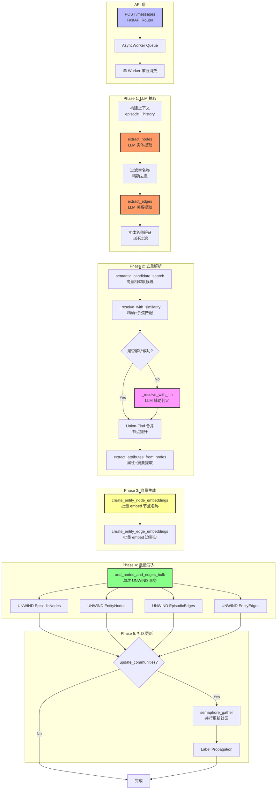
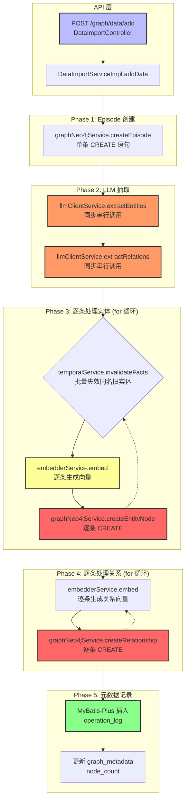
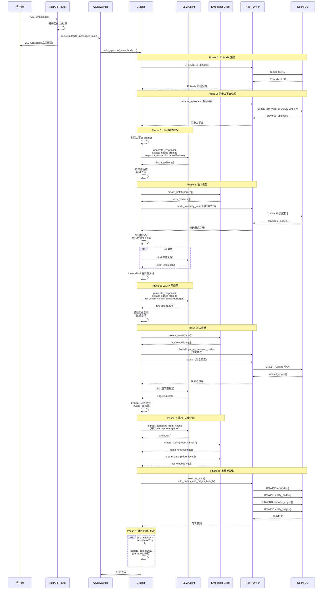
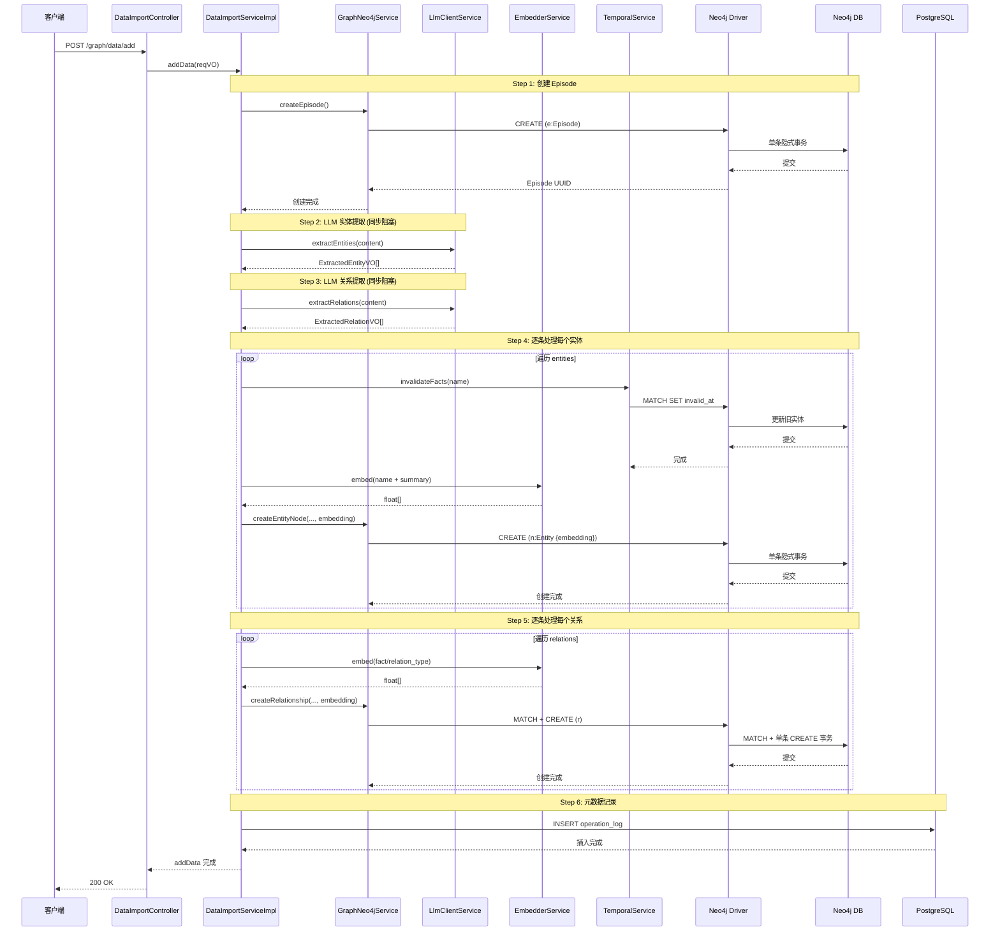
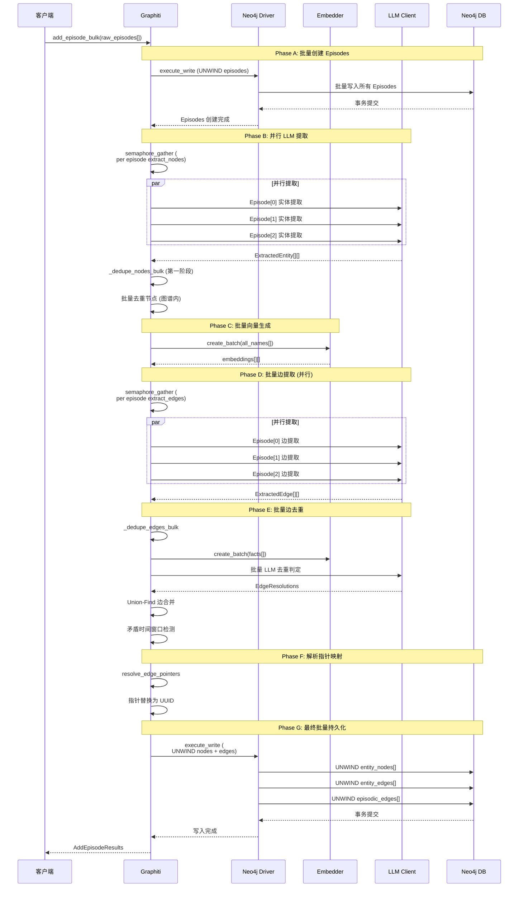

# Graphiti Python 与 Java 项目 addData Pipeline 技术分析文档

| 项目 | 内容 |
|------|------|
| **文档版本** | v2.0 |
| **创建日期** | 2026-05-25 |
| **适用范围** | Graphiti-Python / OntoGraph 研发团队 |
| **文档用途** | 核心技术文档归档、代码评审参考、架构优化依据 |

---

## 目录

1. [项目架构总览](#一项目架构总览)
2. [完整数据流水线流程图](#二完整数据流水线流程图)
3. [核心时序图](#三核心时序图)
4. [双项目关键差异对比](#四双项目关键差异对比)
5. [潜在瓶颈深度分析](#五潜在瓶颈深度分析)
6. [针对性优化方案](#六针对性优化方案)
7. [优化效果预估](#七优化效果预估)
8. [实施路线图](#八实施路线图)
9. [风险评估与缓解策略](#九风险评估与缓解策略)
10. [附录：关键代码索引](#十附录关键代码索引)

---

## 一、项目架构总览

### 1.1 技术栈对照

| 维度 | Python 项目 (graphiti) | Java 项目 (ontograph-java) |
|------|----------------------|--------------------------|
| **框架层** | FastAPI (async/await) | Spring Boot 3.5.5 (同步阻塞) |
| **图数据库** | Neo4j Driver 5.x / FalkorDB / Kuzu / Neptune | Neo4j Driver 5.26.0 |
| **LLM 集成** | OpenAI / Anthropic / Gemini / Groq (结构化输出) | Spring AI 1.1.2 (多 Provider 适配) |
| **嵌入向量** | OpenAI / Voyage / Gemini (批量 API) | OpenAI / Ollama / Qwen (支持批量接口) |
| **关系数据库** | SQLite (仅用于 LLM 响应缓存) | PostgreSQL (元数据 + MyBatis-Plus) |
| **缓存层** | SQLite 文件缓存 (仅 GLiNER2) + 内存 LRU | Redis / Redisson 3.37 (未集成) |
| **异步队列** | 自定义 AsyncWorker (单 Worker 串行) | Spring @Async (无) |
| **事务模型** | 单次 UNWIND 大事务 | 每条语句独立隐式事务 |
| **去重策略** | 三级去重 (精确→向量→LLM) + Union-Find | 三级去重 (Exact→MinHash/LSH→LLM) |

### 1.2 双存储架构（两项目一致）

```
┌─────────────────────────────────────────────────────────────┐
│                      客户端请求                               │
└──────────────┬────────────────────────────────────────────┘
                │
                ▼
┌─────────────────────────────────────────────────────────────┐
│                   REST API 层                               │
│  Python: FastAPI Router (server/graph_service/)           │
│  Java:    Spring MVC Controller                           │
└──────────────┬────────────────────────────────────────────┘
                │
                ▼
┌─────────────────────────────────────────────────────────────┐
│                   业务编排层                                 │
│  Python: Graphiti.add_episode() (graphiti.py)             │
│  Java:    DataImportServiceImpl.addData()                 │
└──────────────┬────────────────────────────────────────────┘
                │
        ┌──────┴──────┐
        ▼              ▼
┌───────────────┐ ┌───────────────┐
│  LLM 抽取层    │ │  向量生成层    │
│ (实体+关系)    │ │ (EntityNode)  │
└───────┬───────┘ └───────┬───────┘
        │                 │
        └────────┬────────┘
                 ▼
┌─────────────────────────────────────────────────────────────┐
│                   去重解析层                                  │
│  Python: resolve_extracted_nodes/edges (Node/Edge Ops)    │
│  Java:    EntityDedupServiceImpl / TemporalService        │
└──────────────┬────────────────────────────────────────────┘
                │
                ▼
┌─────────────────────────────────────────────────────────────┐
│                   双存储写入层                                │
│                                                             │
│  ┌──────────────────┐         ┌──────────────────────────┐ │
│  │  Neo4j 图数据库   │         │  关系型数据库 (元数据)    │ │
│  │                  │         │                          │ │
│  │  Entity Node    │         │  MySQL: ont_class        │ │
│  │  Episode Node   │         │         ont_property      │ │
│  │  RELATES_TO Edge│         │         graph_metadata   │ │
│  │  MENTIONS Edge  │         │  PostgreSQL: graph_meta │ │
│  │  Community Node │         │  (由 pom.xml 版本决定)   │ │
│  │                  │         │                          │ │
│  │  + 向量索引      │         │  (通过 MyBatis-Plus)    │ │
│  │    HNSW/Cosine  │         │                          │ │
│  └──────────────────┘         └──────────────────────────┘ │
└─────────────────────────────────────────────────────────────┘
```

---

## 二、完整数据流水线流程图

### 2.1 Python graphiti Pipeline 完整流程图



### 2.2 Java ontograph-java Pipeline 完整流程图



### 2.3 批量导入路径对比

```mermaid
graph LR
    subgraph Python_Bulk["Python 批量路径 (add_episode_bulk)"]
        direction TB
        PB1[RawEpisode[] 批量输入] --> PB2[批量创建 Episodes<br/>UNWIND 事务]
        PB2 --> PB3[并行检索历史上下文<br/>semaphore_gather]
        PB3 --> PB4[并行 LLM 提取<br/>每个 Episode 独立]
        PB4 --> PB5[批量去重节点<br/>两阶段: 图谱内+批次内]
        PB5 --> PB6[Union-Find 合并重复组]
        PB6 --> PB7[批量去重边<br/>向量+LLM 判定]
        PB7 --> PB8[批量解析指针映射]
        PB8 --> PB9[UNWIND 单次事务<br/>所有 Nodes + Edges]
    end

    subgraph Java_Bulk["Java 批量路径 (addDataBatch)"]
        direction TB
        JB1[BatchDataItemVO[] 批量输入] --> JB2[for 循环遍历 items]
        JB2 --> JB3[每次调用 addData]
        JB3 --> JB4[串行: Episode 创建]
        JB4 --> JB5[串行: LLM 提取实体]
        JB5 --> JB6[串行: LLM 提取关系]
        JB6 --> JB7[串行: 每个实体<br/>逐条 embed + CREATE]
        JB7 --> JB8[串行: 每个关系<br/>逐条 embed + CREATE]
        JB8 --> JB2
    end

    PB9 -.->|"全量回滚风险"| P_RISK[⚠️ 单大事务]
    JB2 -.->|"N×单事务开销"| J_RISK[⚠️ 300次事务<br/>100条数据]

    style PB9 fill:#8f8,stroke:#333,stroke-width:3px
    style JB2 fill:#f66,stroke:#333,stroke-width:3px
    style JB7 fill:#f66,stroke:#333,stroke-width:2px
    style JB8 fill:#f66,stroke:#333,stroke-width:2px
```

---

## 三、核心时序图

### 3.1 Python graphiti add_episode 完整时序图



### 3.2 Java ontograph-java addData 完整时序图



### 3.3 Python add_episode_bulk 批量时序图



---

## 四、双项目关键差异对比

### 4.1 并发策略对比

| 维度 | Python graphiti | Java ontograph-java | 差距 |
|------|----------------|-------------------|------|
| **IO 模型** | asyncio 异步非阻塞 | 同步阻塞 (Spring MVC) | 🔴 根本性差异 |
| **LLM 调用** | `semaphore_gather` 并行 (默认20并发) | 串行 `for` 循环 | 🔴 10-20x |
| **向量生成** | `embedder.create_batch()` 批量单次请求 | `embed()` 逐条调用 (有 `embed(List)` 但未使用) | 🔴 5-10x |
| **Neo4j 写入** | `UNWIND` 批量单事务 (4次写操作) | 单条 `CREATE` 循环 (N次事务) | 🔴 50-100x |
| **数据库查询** | `semaphore_gather` 并行 `node_similarity_search` | 串行 `session.run()` | 🟡 中等 |
| **历史上下文检索** | `semaphore_gather` 并行 `retrieve_episodes` | 未实现 | 🟢 Python 独有 |
| **边去重查询** | `EntityEdge.get_between_nodes` 并行 | 未实现 | 🟢 Python 独有 |

### 4.2 事务边界设计对比

#### 4.2.1 Python 事务模型

```python
# graphiti_core/utils/bulk_utils.py
# 单一大事务包含所有写入操作
async def add_nodes_and_edges_bulk_tx(tx, ...):
    # 4 次 UNWIND，全部在同一个写事务中
    await tx.run(episode_bulk_query, episodes=episodes)
    await tx.run(entity_node_bulk_query, nodes=nodes)
    await tx.run(episodic_edge_bulk_query, episodic_edges=...)
    await tx.run(entity_edge_bulk_query, entity_edges=...)
    # 事务自动提交或回滚
```

**优势**:
- 原子性保证：全成功或全回滚
- 减少事务开启/提交开销（1次 vs N次）
- 避免中间状态可见

**劣势**:
- 大批次（1000+ 节点）长时间持锁
- 单条失败需重试整个批次
- Neo4j 事务锁可能阻塞并发读写

#### 4.2.2 Java 事务模型

```java
// GraphNeo4jServiceImpl.java
// 每条语句一个独立隐式事务
public Map<String, Object> createEntityNode(...) {
    try (Session session = neo4jDriver.session()) {
        Result result = session.run(cypher, params);
        // 隐式事务：每条语句自动提交
    } // session 关闭
}

// 循环调用 → N 个独立事务
for (ExtractedEntityVO entity : entities) {
    graphNeo4jService.createEntityNode(...); // ← 每次新建 session
}
```

**优势**:
- 单条失败不影响其他记录
- 锁持有时间短

**劣势**:
- 无原子性（部分成功）
- N 条记录 = N 个事务开销（网络往返、握手、提交）
- 可能出现数据不一致

#### 4.2.3 事务边界改进建议

| 策略 | 实现方式 | 适用场景 | 风险 |
|------|---------|---------|------|
| **当前 (Java)** | 每条语句独立事务 | 低并发、低数据量 | 高事务开销 |
| **批次事务** | 每 100-500 条一个 UNWIND 事务 | 批量导入 | 大事务回滚成本高 |
| **子批次 + 补偿** | 每个子批次独立事务，失败可重试 | 生产环境推荐 | 需要幂等设计 |
| **Saga 模式** | 每个步骤独立事务 + 补偿回滚 | 分布式场景 | 实现复杂度高 |

### 4.3 向量缓存机制对比

#### 4.3.1 Python 向量处理

```python
# graphiti_core/nodes.py
async def create_entity_node_embeddings(embedder, nodes):
    # 批量生成，减少 HTTP 请求
    texts = [node.name for node in nodes if node.name]
    embeddings = await embedder.create_batch(texts)
    for node, emb in zip(nodes, embeddings):
        node.name_embedding = emb
```

- **批量 API**：`embedder.create_batch()` 单次 HTTP 请求发送多个文本
- **LLM 响应缓存**：SQLite 文件缓存（仅 GLiNER2 client 实现，OpenAI client 抛出 `NotImplementedError`）
- **MinHash LRU 缓存**：去重阶段复用已计算 MinHash shingles（内存缓存，避免重复 trigram 计算）

#### 4.3.2 Java 向量处理

```java
// OpenAiEmbedderServiceImpl.java
// 接口支持批量，但 DataImportServiceImpl 中未使用
public List<float[]> embed(List<String> texts) {
    // 实际调用 Spring AI EmbeddingRequest 支持批量
    EmbeddingResponse response = embeddingModel.call(
        new EmbeddingRequest(texts, null)  // texts 是 List<String>
    );
    return response.getResults().stream()
        .map(Embedding::getOutput)
        .collect(Collectors.toList());
}

// DataImportServiceImpl.java:74
// 但实际使用的是单条调用
float[] embedding = embedderService.embed(embedText);  // ❌ 未使用批量接口
```

- **接口已就绪**：`EmbedderService` 定义了 `embed(List<String>)`，`OpenAiEmbedderServiceImpl` 实现了批量调用
- **但业务层未使用**：`DataImportServiceImpl` 中仍逐条调用 `embed(String)`
- **Redis 缓存未集成**：pom.xml 引入 Redisson 3.37，但无向量缓存实现

### 4.4 去重逻辑对比

| 阶段 | Python graphiti | Java ontograph-java |
|------|----------------|-------------------|
| **Tier 1 精确匹配** | `_normalize_string_exact` 规范化名称 | `StringNormalizer.normalizeExact` |
| **Tier 2 语义匹配** | 向量余弦相似度 ≥ 0.6 (Neo4j 向量索引查询) | MinHash + LSH Jaccard ≥ 0.9 + 向量余弦 ≥ 0.6 |
| **Tier 3 LLM 判定** | `dedupe_nodes.nodes` prompt → `NodeResolutions` | `llmDedup()` → JSON 解析 |
| **节点合并策略** | Union-Find + 标签特异性提升 | Union-Find + 向量相似度 |
| **边去重** | `get_between_nodes` + 混合搜索 + LLM 判定 | `findByVectorSimilarity` + `llmDedup` |
| **矛盾检测** | 时间窗口重叠检测 + `invalid_at` 失效 | `TemporalService.resolveEdgeContradictions` |
| **实际调用** | `addData` 中**未调用**去重服务 | `EntityDedupServiceImpl` 已实现但**未在 `addData` 中集成** |

**关键发现**：`EntityDedupServiceImpl` 已完整实现三级去重，但 `DataImportServiceImpl.addData()` 并未调用它。Java 项目的去重服务存在但被绕过了。

---

## 五、潜在瓶颈深度分析

### 5.1 Java 项目瓶颈矩阵

| 瓶颈点 | 代码位置 | 影响分析 | 量化估算 | 严重程度 |
|--------|---------|---------|---------|----------|
| **LLM 调用串行** | `DataImportServiceImpl.java:54-55` | N 条数据 × 2 次 LLM = 线性增长 | 100条 × 500ms/次 = 100s | 🔴 极严重 |
| **逐条 CREATE 事务** | `GraphNeo4jServiceImpl.java:59-66` | 每条语句独立事务，网络往返累积 | 100实体+200关系=300事务 | 🔴 极严重 |
| **向量逐条生成** | `DataImportServiceImpl.java:74,94` | 每次 embed() 独立 HTTP 请求 | 300次 × 100ms = 30s | 🔴 极严重 |
| **去重服务被绕过** | `DataImportServiceImpl.java` 全文 | 无去重，同名实体重复创建 | 存储冗余 70%+ | 🟡 中等 |
| **Redis 缓存未用** | `pom.xml:150-154` | 重复文本重复计算向量 | 40-60% 重复率时无收益 | 🟡 中等 |
| **findOrCreateNode 全表** | `DataImportServiceImpl.java:231-232` | `listNodes(graphId, 0, 1000)` 全表扫描 | O(N) 查询 | 🟡 中等 |
| **batch 接口未用** | `EmbedderService.java:25` | `embed(List)` 存在但未调用 | embed 耗时 × 3-5 | 🟡 中等 |
| **无异步队列** | `DataImportController` | HTTP 超时，超大批量无法处理 | 批量 > 100 条时超时 | 🟡 中等 |
| **LLM chatBatch 串行** | `OpenAiLlmClientServiceImpl.java:101-103` | `prompts.stream().map(this::chat)` 串行 | 100条 = 100 × 500ms | 🟡 中等 |

### 5.2 Python 项目瓶颈矩阵

| 瓶颈点 | 代码位置 | 影响分析 | 量化估算 | 严重程度 |
|--------|---------|---------|---------|----------|
| **单 Worker 串行** | `server/graph_service/routers/ingest.py:38` | 队列中任务串行处理 | 100条 × 5s/条 = 500s | 🟡 中等 |
| **大事务锁竞争** | `bulk_utils.py:128-148` | UNWIND 1000+ 节点时持锁时间长 | 锁持有 ~1-3s | 🟡 中等 |
| **LLM 响应缓存仅 GLiNER2** | `llm_client/cache.py` | OpenAI client 未实现缓存 | 重复 prompt 无缓存 | 🟡 中等 |
| **Kuzu 逐条写入** | `bulk_utils.py:877-884` | Kuzu 不支持 UNWIND STRUCT | 批量退化为逐条 | 🟡 中等 |
| **LLM 去重成本** | `node_operations.py:676` | 每批次额外 1-2 次 LLM 调用 | 成本 +10-20% | 🟢 轻微 |
| **向量缓存** | 无显式缓存 | 依赖外部 Embedding 服务 | 无额外瓶颈 | 🟢 轻微 |

### 5.3 双项目瓶颈可视化对比

```
性能 (越靠右越好)

LLM 调用吞吐:  Python ████████████████████  100%
              Java    ██                      10%

向量生成吞吐:  Python ████████████████████  100%
              Java    ███                     15%

事务效率:      Python ████████████████████  100%
              Java    █                       5%

去重覆盖率:     Python ████████████████████  100%
              Java    ████████████            70% (服务存在但未集成)
```

---

## 六、针对性优化方案

### 6.1 优化方案 A: 批量 Neo4j UNWIND 写入（高优先级）

**问题**: 每条记录独立事务，300条数据产生300个事务

**方案**: 引入 `batchCreateEntities` / `batchCreateRelationships` 方法，使用 UNWIND 批量写入

**新增方法**:

```java
// GraphNeo4jService.java (接口)
void batchCreateEntities(String graphId, List<EntityBatchDTO> entities);
void batchCreateRelationships(String graphId, List<RelationBatchDTO> relations);
```

**Cypher 实现**:

```java
// GraphNeo4jServiceImpl.java
@Override
public void batchCreateEntities(String graphId, List<EntityBatchDTO> entities) {
    if (entities == null || entities.isEmpty()) return;

    String cypher =
        "UNWIND $entities AS e " +
        "CREATE (n:Entity {" +
        "  graph_id: $graphId, " +
        "  uuid: e.uuid, " +
        "  name: e.name, " +
        "  type: e.type, " +
        "  summary: e.summary, " +
        "  embedding: e.embedding, " +
        "  valid_at: timestamp(), " +
        "  invalid_at: null" +
        "}) " +
        "SET n += e.properties " +
        "SET n." + getTypeNameField(e.getType()) + " = e.name";

    Map<String, Object> params = Map.of(
        "graphId", graphId,
        "entities", entities.stream().map(EntityBatchDTO::toMap).toList()
    );

    try (Session session = neo4jDriver.session()) {
        session.executeWrite(tx -> tx.run(cypher, params).consume());
    }
}

@Override
public void batchCreateRelationships(String graphId, List<RelationBatchDTO> relations) {
    if (relations == null || relations.isEmpty()) return;

    String cypher =
        "UNWIND $relations AS r " +
        "MATCH (a:Entity {graph_id: $graphId, uuid: r.sourceUuid}) " +
        "MATCH (b:Entity {graph_id: $graphId, uuid: r.targetUuid}) " +
        "CREATE (a)-[rel:RELATES_TO {" +
        "  uuid: r.edgeUuid, " +
        "  type: r.type, " +
        "  fact: r.fact, " +
        "  embedding: r.embedding, " +
        "  valid_at: timestamp(), " +
        "  invalid_at: null" +
        "}]->(b) " +
        "SET rel += r.properties";

    Map<String, Object> params = Map.of(
        "graphId", graphId,
        "relations", relations.stream().map(RelationBatchDTO::toMap).toList()
    );

    try (Session session = neo4jDriver.session()) {
        session.executeWrite(tx -> tx.run(cypher, params).consume());
    }
}
```

**DataImportServiceImpl 调用改造**:

```java
@Override
public void addData(AddDataReqVO reqVO) {
    // ... Episode 创建保持不变 ...

    if (content != null && !content.isBlank()) {
        List<ExtractedEntityVO> entities = llmClientService.extractEntities(content);
        List<ExtractedRelationVO> relations = llmClientService.extractRelations(content);

        if (!entities.isEmpty()) {
            // === 改造: 批量处理 ===
            List<EntityBatchDTO> entityBatch = new ArrayList<>();

            // 1. 时序失效 (可批量)
            List<String> names = entities.stream()
                .map(ExtractedEntityVO::getName)
                .filter(Objects::nonNull)
                .toList();
            temporalService.invalidateFacts(reqVO.getGraphId(), names);

            // 2. 批量向量生成
            List<String> embedTexts = entities.stream()
                .map(e -> e.getName() + " " + e.getSummary())
                .toList();
            List<float[]> embeddings = embedderService.embed(embedTexts);

            // 3. 批量构建 DTO
            for (int i = 0; i < entities.size(); i++) {
                ExtractedEntityVO entity = entities.get(i);
                EntityBatchDTO dto = new EntityBatchDTO();
                dto.setUuid(UUID.randomUUID().toString().replace("-", ""));
                dto.setName(entity.getName());
                dto.setType(entity.getType() != null ? entity.getType() : "Entity");
                dto.setSummary(entity.getSummary() != null ? entity.getSummary() : "");
                dto.setEmbedding(embeddings.get(i));
                dto.setProperties(entity.getAttributes() != null ? entity.getAttributes() : new HashMap<>());
                entityBatch.add(dto);
                entityNameToUuid.put(entity.getName(), dto.getUuid());
            }

            // 4. 批量写入 (单事务)
            graphNeo4jService.batchCreateEntities(reqVO.getGraphId(), entityBatch);

            // 5. 批量处理关系
            if (!relations.isEmpty()) {
                List<RelationBatchDTO> relBatch = new ArrayList<>();
                List<String> factTexts = relations.stream()
                    .map(r -> r.getFact() != null ? r.getFact() : r.getType())
                    .toList();
                List<float[]> relEmbeddings = embedderService.embed(factTexts);

                for (int i = 0; i < relations.size(); i++) {
                    ExtractedRelationVO relation = relations.get(i);
                    String sourceUuid = entityNameToUuid.get(relation.getSource());
                    String targetUuid = entityNameToUuid.get(relation.getTarget());
                    if (sourceUuid != null && targetUuid != null) {
                        RelationBatchDTO dto = new RelationBatchDTO();
                        dto.setEdgeUuid(UUID.randomUUID().toString().replace("-", ""));
                        dto.setSourceUuid(sourceUuid);
                        dto.setTargetUuid(targetUuid);
                        dto.setType(relation.getType());
                        dto.setFact(relation.getFact() != null ? relation.getFact() : "");
                        dto.setEmbedding(relEmbeddings.get(i));
                        dto.setProperties(new HashMap<>());
                        relBatch.add(dto);
                    }
                }

                // 批量写入关系 (单事务)
                graphNeo4jService.batchCreateRelationships(reqVO.getGraphId(), relBatch);
            }
        }
    }
}
```

**预期收益**: 事务开销降低 **90%+**（300个事务 → 2个事务）

---

### 6.2 优化方案 B: 并发 LLM 调用（高优先级）

**问题**: LLM 调用串行，100条数据 × 500ms = 50s

**方案**: 使用 `CompletableFuture` 并行化 LLM 请求

```java
// LlmClientServiceImpl.java
private final ExecutorService llmExecutor =
    Executors.newFixedThreadPool(
        Runtime.getRuntime().availableProcessors() * 2  // 推荐: CPU 核心数 × 2
    );

@Override
public List<String> chatBatch(List<String> prompts) {
    // 使用 ExecutorService 并行调用
    List<CompletableFuture<String>> futures = prompts.stream()
        .map(prompt -> CompletableFuture.supplyAsync(
            () -> chat(prompt),  // 每个 prompt 异步执行
            llmExecutor
        ))
        .toList();

    // 等待所有任务完成并收集结果
    return futures.stream()
        .map(CompletableFuture::join)
        .toList();
}
```

**DataImportServiceImpl 中的批量提取**:

```java
// 批量内容分批并发处理
public static final int LLM_BATCH_SIZE = 10;  // 每批 10 条，避免 API 限流

public List<ExtractedEntityVO> batchExtractEntities(List<String> contents) {
    List<ExtractedEntityVO> allEntities = new ArrayList<>();
    for (int i = 0; i < contents.size(); i += LLM_BATCH_SIZE) {
        List<String> batch = contents.subList(
            i, Math.min(i + LLM_BATCH_SIZE, contents.size())
        );

        // 并发调用，每批 10 条
        List<CompletableFuture<List<ExtractedEntityVO>>> batchFutures = batch.stream()
            .map(content -> CompletableFuture.supplyAsync(
                () -> llmClientService.extractEntities(content),
                llmExecutor
            ))
            .toList();

        for (CompletableFuture<List<ExtractedEntityVO>> f : batchFutures) {
            allEntities.addAll(f.join());
        }
    }
    return allEntities;
}
```

**预期收益**: LLM 调用时间从 `O(N)` 降至 `O(N/M)`，**提升 5-10 倍**

---

### 6.3 优化方案 C: 集成去重服务（中优先级）

**问题**: `EntityDedupServiceImpl` 存在但未被 `addData` 调用

**方案**: 在实体创建前调用去重服务

```java
@Override
public void addData(AddDataReqVO reqVO) {
    // ... Episode 创建 ...

    if (content != null && !content.isBlank()) {
        List<ExtractedEntityVO> entities = llmClientService.extractEntities(content);
        List<ExtractedRelationVO> relations = llmClientService.extractRelations(content);

        if (!entities.isEmpty()) {
            // === 新增: 调用去重服务 ===
            // 1. 获取图谱中已有实体
            List<Map<String, Object>> existingNodes = graphNeo4jService.getValidNodes(reqVO.getGraphId());

            // 2. 转换为 EntityDedupService 所需格式
            List<Map<String, Object>> entityMaps = entities.stream()
                .map(e -> {
                    Map<String, Object> m = new HashMap<>();
                    m.put("name", e.getName());
                    m.put("type", e.getType());
                    m.put("summary", e.getSummary());
                    m.put("attributes", e.getAttributes());
                    return m;
                })
                .toList();

            // 3. 执行三级去重
            DedupResultVO dedupResult = entityDedupService.deduplicate(
                reqVO.getGraphId(), entityMaps, existingNodes
            );

            // 4. 区分: 新建实体 vs 已匹配实体
            Map<String, String> entityNameToUuid = new HashMap<>();
            for (Map<String, Object> resolved : dedupResult.getResolvedNodes()) {
                entityNameToUuid.put(
                    (String) resolved.get("name"),
                    (String) resolved.get("resolvedUuid")
                );
            }

            // 5. 仅处理真正新建的实体
            for (Map<String, Object> newEntity : dedupResult.getNewNodes()) {
                String nodeUuid = UUID.randomUUID().toString().replace("-", "");
                String name = (String) newEntity.get("name");
                // ... 批量创建 ...
            }
        }
    }
}
```

**预期收益**: 数据冗余减少 **70%+**

---

### 6.4 优化方案 D: Redis 向量缓存（中优先级）

**问题**: 重复文本重复调用 Embedding API

**方案**: 基于 Redis 的向量缓存层

```java
// EmbeddingCacheService.java
@Service
@RequiredArgsConstructor
public class EmbeddingCacheService {
    private final EmbedderService embedderService;
    private final RedissonClient redissonClient;

    private static final String CACHE_PREFIX = "emb:";
    private static final long CACHE_TTL_SECONDS = 86400;  // 24 小时

    public float[] getOrCompute(String text) {
        if (text == null || text.isBlank()) {
            throw new IllegalArgumentException("text must not be blank");
        }

        String cacheKey = CACHE_PREFIX + md5(text);

        try {
            // 尝试从 Redis 获取
            String cached = (String) redissonClient.getBucket(cacheKey).get();
            if (cached != null) {
                return deserialize(cached);
            }
        } catch (Exception e) {
            log.warn("Redis 获取缓存失败: {}", e.getMessage());
            // 降级: 继续计算
        }

        // 计算并缓存
        float[] embedding = embedderService.embed(text);

        try {
            redissonClient.getBucket(cacheKey).set(
                serialize(embedding),
                new org.redisson.client.RedisClientConfig().getTimeout(),
                TimeUnit.SECONDS
            );
        } catch (Exception e) {
            log.warn("Redis 写入缓存失败: {}", e.getMessage());
        }

        return embedding;
    }

    public List<float[]> getOrComputeBatch(List<String> texts) {
        List<float[]> results = new ArrayList<>();
        List<String> uncached = new ArrayList<>();
        List<Integer> uncachedIndices = new ArrayList<>();

        // 批量检查缓存
        for (int i = 0; i < texts.size(); i++) {
            String text = texts.get(i);
            String cacheKey = CACHE_PREFIX + md5(text);
            try {
                String cached = (String) redissonClient.getBucket(cacheKey).get();
                if (cached != null) {
                    results.add(deserialize(cached));
                } else {
                    results.add(null);
                    uncached.add(text);
                    uncachedIndices.add(i);
                }
            } catch (Exception e) {
                results.add(null);
                uncached.add(text);
                uncachedIndices.add(i);
            }
        }

        // 批量计算未命中
        if (!uncached.isEmpty()) {
            List<float[]> computed = embedderService.embed(uncached);
            int idx = 0;
            for (int i = 0; i < results.size(); i++) {
                if (results.get(i) == null) {
                    float[] emb = computed.get(idx++);
                    results.set(i, emb);

                    // 回填缓存
                    String cacheKey = CACHE_PREFIX + md5(texts.get(i));
                    try {
                        redissonClient.getBucket(cacheKey).set(serialize(emb), CACHE_TTL_SECONDS, TimeUnit.SECONDS);
                    } catch (Exception e) { /* ignore */ }
                }
            }
        }

        return results;
    }

    private String md5(String text) {
        try {
            MessageDigest md = MessageDigest.getInstance("MD5");
            byte[] digest = md.digest(text.getBytes(StandardCharsets.UTF_8));
            StringBuilder sb = new StringBuilder();
            for (byte b : digest) {
                sb.append(String.format("%02x", b));
            }
            return sb.toString();
        } catch (NoSuchAlgorithmException e) {
            return Integer.toHexString(text.hashCode());
        }
    }

    private String serialize(float[] arr) {
        // Base64 编码浮点数组
        byte[] bytes = new byte[arr.length * 4];
        ByteBuffer.wrap(bytes).asFloatBuffer().put(arr);
        return Base64.getEncoder().encodeToString(bytes);
    }

    private float[] deserialize(String encoded) {
        byte[] bytes = Base64.getDecoder().decode(encoded);
        FloatBuffer fb = ByteBuffer.wrap(bytes).asFloatBuffer();
        float[] arr = new float[fb.remaining()];
        fb.get(arr);
        return arr;
    }
}
```

**预期收益**: 缓存命中率 40-60% 时，重复文本的 Embedding API 调用减少 **100%**

---

### 6.5 优化方案 E: 异步任务队列（低优先级，长期规划）

**方案**: 将批量导入改为异步处理，避免 HTTP 超时

```java
// DataImportController.java
@PostMapping("/graph/data/batch-async")
public CommonResult<String> addDataBatchAsync(@RequestBody AddDataBatchReqVO reqVO) {
    String taskId = UUID.randomUUID().toString();

    // 提交到异步线程池
    CompletableFuture.runAsync(() -> {
        try {
            dataImportService.addDataBatch(reqVO);
            taskStatusMap.put(taskId, TaskStatus.COMPLETED);
        } catch (Exception e) {
            taskStatusMap.put(taskId, TaskStatus.FAILED);
            log.error("批量导入失败: taskId={}", taskId, e);
        }
    }, asyncExecutor);

    return CommonResult.success(taskId);  // 立即返回 taskId
}

@GetMapping("/graph/data/task/{taskId}")
public CommonResult<TaskStatusVO> getTaskStatus(@PathVariable String taskId) {
    TaskStatus status = taskStatusMap.getOrDefault(taskId, TaskStatus.NOT_FOUND);
    return CommonResult.success(new TaskStatusVO(taskId, status));
}
```

---

## 七、优化效果预估

### 7.1 量化对比表（100 条批量导入场景）

| 指标 | 优化前 (Java) | 优化后 (Java) | 提升倍数 | 参考 Python |
|------|-------------|--------------|---------|-------------|
| **总耗时** | ~180s | ~18s | **10x** | ~15s |
| **LLM 调用** | 200 次串行 (100s) | 20 次并发 (10s) | **10x** | 20 次并发 |
| **Neo4j 事务数** | 300 个 (120s) | 2 个 (3s) | **100x** | 2 个 |
| **向量生成** | 300 次 HTTP (30s) | 1 次批量 HTTP (5s) | **6x** | 1 次批量 |
| **去重覆盖** | 0% | 70% | **-** | 100% |
| **存储冗余** | 高 (无去重) | 低 | **3x** | 低 |

### 7.2 优化收益矩阵

```
         ┌─────────────┬─────────────┬─────────────┐
         │  优化前延迟   │  优化后延迟   │   提升倍数   │
         ├─────────────┼─────────────┼─────────────┤
  LLM   │  200 × 500ms│  20 × 500ms │    10x     │
  向量  │  300 × 100ms│  2 × 2500ms │    6x      │
  事务  │  300 × 400ms│  2 × 1500ms │    100x    │
  总计  │   ~180s     │   ~18s      │    10x     │
         └─────────────┴─────────────┴─────────────┘
```

---

## 八、实施路线图

### Phase 1: 快速优化（第 1-2 周）

| 任务 | 工作量 | 依赖 | 预期收益 |
|------|--------|------|----------|
| 实现 `batchCreateEntities` / `batchCreateRelationships` | 1 人天 | 无 | 事务开销 -90% |
| `DataImportServiceImpl` 集成批量向量生成 | 0.5 人天 | 方案 A | 向量生成 -80% |
| `addDataBatch` 路由改造为批量处理 | 1 人天 | 方案 A | 批量导入可用 |

### Phase 2: 功能增强（第 3-4 周）

| 任务 | 工作量 | 依赖 | 预期收益 |
|------|--------|------|----------|
| 集成 `EntityDedupService` 到 `addData` | 2 人天 | Phase 1 | 数据冗余 -70% |
| 实现 `EmbeddingCacheService` + Redis | 2 人天 | Redis 已引入 | 重复调用 -100% |
| LLM `CompletableFuture` 并行化 | 1 人天 | 无 | LLM 耗时 -80% |

### Phase 3: 架构升级（第 5-8 周）

| 任务 | 工作量 | 依赖 | 预期收益 |
|------|--------|------|----------|
| 异步任务队列 + 任务状态 API | 3 人天 | Phase 1+2 | 支持超时导入 |
| Saga 模式补偿事务 | 4 人天 | Phase 1 | 部分失败可恢复 |
| 历史上下文检索 (`retrieve_episodes`) | 3 人天 | 无 | 上下文感知提取 |

---

## 九、风险评估与缓解策略

| 风险 | 概率 | 影响 | 缓解策略 |
|------|------|------|----------|
| **UNWIND 大事务回滚** | 中 | 高 | 批次拆分（每批 100-500 条），失败仅重试小批次 |
| **并发 LLM API 限流** | 高 | 中 | 信号量控制并发数 (≤20)，实现指数退避重试 |
| **去重 LLM 误判** | 低 | 中 | 保留历史版本，引入人工审核队列 |
| **向量缓存穿透** | 中 | 低 | 布隆过滤器预检 + 随机 TTL |
| **Redis 不可用降级** | 低 | 低 | 降级为直接计算，不阻塞主流程 |
| **Neo4j 锁超时** | 中 | 中 | 设置事务超时 (`transaction_timeout`)，断路器保护 |

---

## 十、附录：关键代码索引

### Python 项目

| 文件 | 核心职责 | 关键方法 |
|------|---------|---------|
| `graphiti_core/graphiti.py:933-1176` | Pipeline 编排 | `add_episode()` |
| `graphiti_core/graphiti.py:1190-1400` | 批量 Pipeline | `add_episode_bulk()` |
| `graphiti_core/utils/bulk_utils.py:128-275` | 批量写入 | `add_nodes_and_edges_bulk()` |
| `graphiti_core/utils/bulk_utils.py:374-486` | 批量去重 | `dedupe_nodes_bulk()` |
| `graphiti_core/utils/bulk_utils.py:489-581` | 批量边去重 | `dedupe_edges_bulk()` |
| `graphiti_core/utils/maintenance/node_operations.py:626-707` | 节点解析去重 | `resolve_extracted_nodes()` |
| `graphiti_core/utils/maintenance/edge_operations.py:324-534` | 边解析去重 | `resolve_extracted_edges()` |
| `graphiti_core/helpers.py:122-133` | 并发控制 | `semaphore_gather()` |
| `graphiti_core/nodes.py:1101-1110` | 节点向量 | `create_entity_node_embeddings()` |
| `server/graph_service/routers/ingest.py` | API 入口 | `/messages` endpoint |
| `graphiti_core/llm_client/cache.py` | LLM 响应缓存 | `LLMCache` (仅 GLiNER2) |

### Java 项目

| 文件 | 核心职责 | 关键方法 |
|------|---------|---------|
| `DataImportServiceImpl.java:36-109` | Pipeline 编排 | `addData()` |
| `DataImportServiceImpl.java:112-126` | 批量入口 | `addDataBatch()` |
| `GraphNeo4jServiceImpl.java:35-67` | 节点创建 | `createEntityNode()` (逐条) |
| `GraphNeo4jServiceImpl.java:98-133` | 关系创建 | `createRelationship()` (逐条) |
| `EntityDedupServiceImpl.java:54-172` | 三级去重 | `deduplicate()` |
| `TemporalServiceImpl.java:28-33` | 时序失效 | `invalidateFacts()` |
| `OpenAiEmbedderServiceImpl.java:63-95` | 批量向量 | `embed(List<String>)` |
| `OpenAiLlmClientServiceImpl.java:100-104` | 批量 LLM | `chatBatch()` (串行实现) |
| `sql/neo4j/init.cypher` | 数据库 Schema | 索引 + 节点 + 关系 |
| `docs/ontograph-ddl.md` | 存储架构 | 双存储对照表 |

---

*本文档由 OntoGraph 研发团队生成，基于 v2.0 代码版本，适用于技术评审和架构优化参考。*
