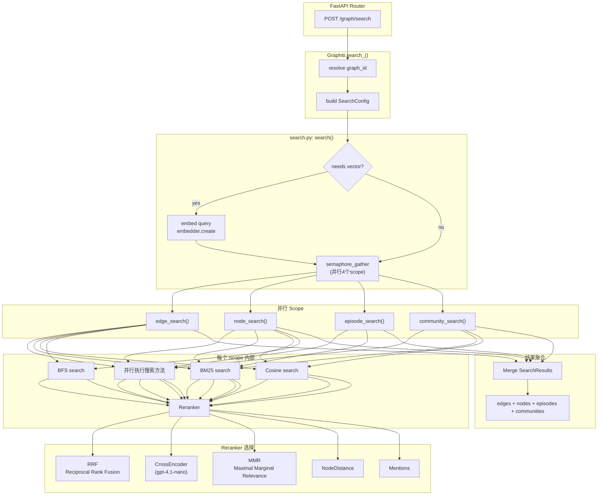
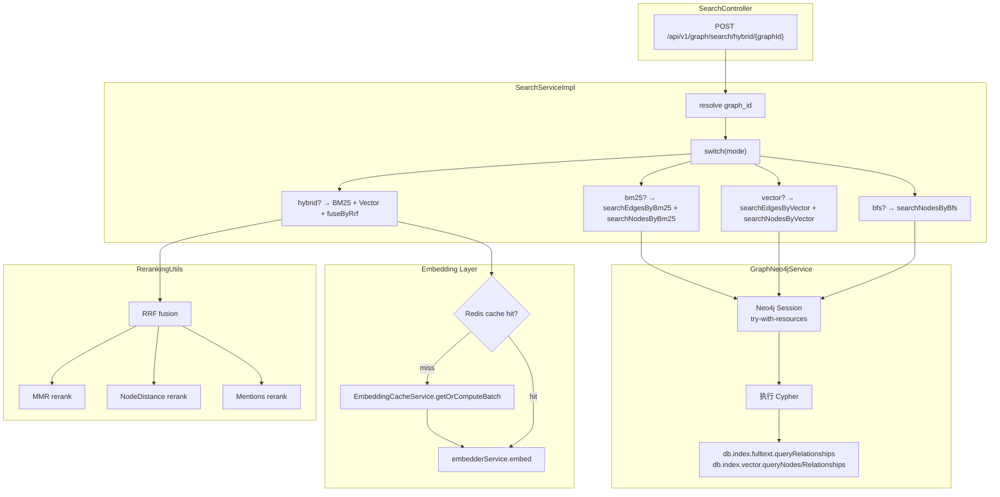
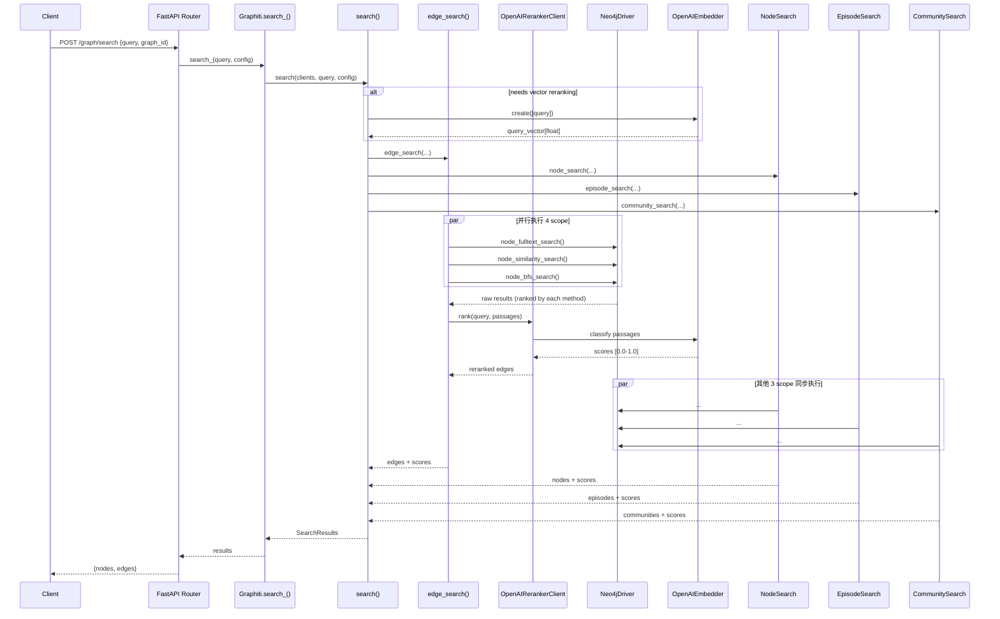
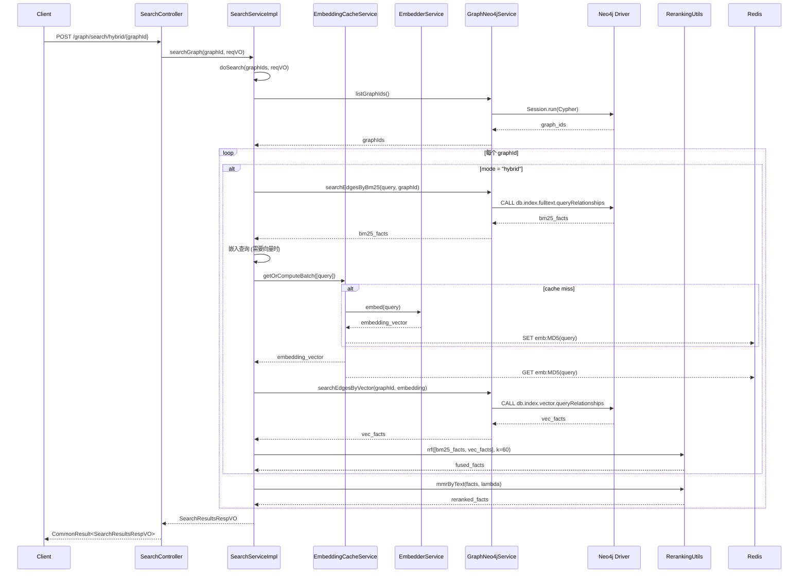
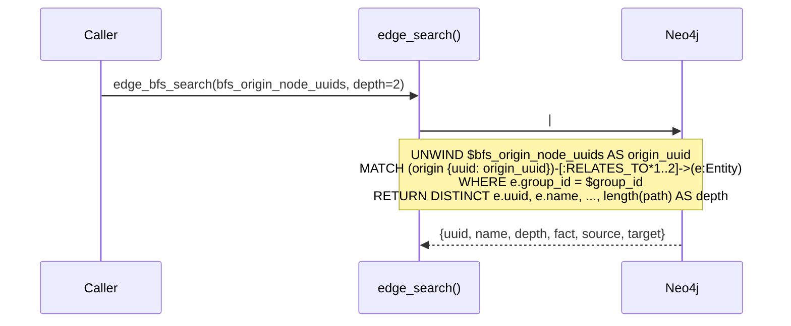
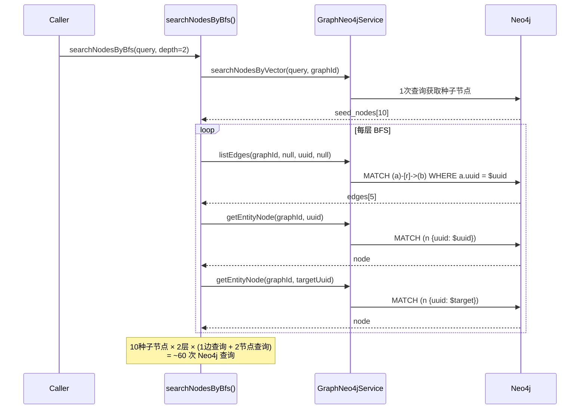

# 图谱检索 Pipeline 对比分析报告

**项目**: Python `graphiti` vs Java `graphiti-java`
**日期**: 2026-05-26
**范围**: Search Pipeline 全链路（查询入口 → 结果返回）
**用途**: 核心技术文档归档、研发团队代码评审

---

## 目录

1. [整体架构对比](#1-整体架构对比)
2. [Python Search Pipeline 全流程](#2-python-search-pipeline-全流程)
3. [Java Search Pipeline 全流程](#3-java-search-pipeline-全流程)
4. [流程图与时序图](#4-流程图与时序图)
5. [功能特性逐项对比](#5-功能特性逐项对比)
6. [Java 项目优化建议](#6-java-项目优化建议)
7. [并发策略分析](#7-并发策略分析)
8. [向量缓存机制分析](#8-向量缓存机制分析)
9. [潜在瓶颈分析](#9-潜在瓶颈分析)
10. [优化方案汇总](#10-优化方案汇总)

---

## 1. 整体架构对比

| 维度 | Python (graphiti) | Java (graphiti-java) |
|------|-------------------|---------------------|
| **框架** | FastAPI + ZepGraphitiDep | Spring Boot + Controller-Service-DAO |
| **数据库** | Neo4j 5.26+ (向量索引 + 全文索引) | Neo4j (向量索引 + 全文索引) |
| **查询嵌入** | 统一 `SearchConfig` 对象 + 策略模式 | `SearchConfigVO` 配置对象 + switch 分支 |
| **搜索方式** | BM25 + Cosine + BFS + RRF + MMR + CrossEncoder + NodeDistance | BM25 + Cosine + BFS + RRF + MMR (部分) |
| **并行执行** | `semaphore_gather` 并发执行多个搜索 scope | 顺序串行执行 |
| **缓存层** | 无显式搜索结果缓存 | Redis EmbeddingCacheService (仅向量) |
| **Reranker** | CrossEncoder (GPT-4.1-nano)、RRF、MMR、NodeDistance、Mentions | RRF、MMR (文本相似)、NodeDistance、Mentions |
| **索引抽象** | `SearchInterface` 可插拔设计 | 直接在 `GraphNeo4jService` 中硬编码 Cypher |
| **跨编码器** | OpenAI Reranker (logit_bias 强制 True/False) | **未实现** |
| **Graph Traversal** | Neo4j CYPHER `[:RELATES_TO|MENTIONS*1..depth]` 路径表达式 | Java BFS 循环 + N+1 查询 |

---

## 2. Python Search Pipeline 全流程

### 2.1 入口路由

**文件**: `server/graph_service/routers/graph.py:325-378`

```python
@router.post('/search', status_code=status.HTTP_200_OK)
async def search_graph(request: SearchGraphRequest, graphiti: ZepGraphitiDep):
    graph_id = resolve_graph_id(request.graph_id, request.user_id)

    # 构建搜索配置（使用 COMBINED_HYBRID_SEARCH_RRF）
    search_config = COMBINED_HYBRID_SEARCH_RRF
    search_config.limit = request.limit

    # 调用 Graphiti.search_()
    results = await graphiti.search_(
        query=request.query,
        group_ids=[graph_id],
        config=search_config,
        center_node_uuid=request.center_node_uuid,
    )
    # 格式化结果返回
```

### 2.2 Graphiti 主类入口

**文件**: `graphiti_core/graphiti.py:1473-1576`

```python
async def search_(
    self,
    query: str,
    config: SearchConfig = COMBINED_HYBRID_SEARCH_CROSS_ENCODER,
    group_ids: list[str] | None = None,
    center_node_uuid: str | None = None,
    bfs_origin_node_uuids: list[str] | None = None,
    search_filter: SearchFilters | None = None,
    driver: GraphDriver | None = None,
) -> SearchResults:
    # 内部调用核心 search() 函数
    return await search(
        clients=self.clients,
        query=query,
        group_ids=group_ids,
        config=config,
        search_filter=search_filter,
        center_node_uuid=center_node_uuid,
        bfs_origin_node_uuids=bfs_origin_node_uuids,
        driver=driver,
    )
```

### 2.3 核心搜索编排器

**文件**: `graphiti_core/search/search.py:98-250`

```python
async def search(
    clients: GraphitiClients,
    query: str,
    group_ids: list[str] | None,
    config: SearchConfig,
    search_filter: SearchFilters,
    center_node_uuid: str | None = None,
    bfs_origin_node_uuids: list[str] | None = None,
    query_vector: list[float] | None = None,
    driver: GraphDriver | None = None,
) -> SearchResults:

    # ====== Step 1: Query Embedding (条件触发) ======
    if needs_vector or needs_mmr:
        search_vector = await embedder.create(input_data=[query])

    # ====== Step 2: 并行 Scope 执行 ======
    results = await semaphore_gather(
        edge_search(...) if config.edge_config else None,
        node_search(...) if config.node_config else None,
        episode_search(...) if config.episode_config else None,
        community_search(...) if config.community_config else None,
        concurrency_limit=MAX_SEARCH_CONCURRENCY,  # 4
    )

    # ====== Step 3: 聚合返回 ======
    return SearchResults(nodes=nodes, edges=edges, episodes=episodes, communities=communities)
```

### 2.4 各 Scope 搜索详解

#### 2.4.1 Edge Search (`search.py:253-460`)

```python
async def edge_search(driver, cross_encoder, query, query_vector, group_ids, config, ...):
    # 构建搜索任务列表
    tasks = []
    if EdgeSearchMethod.bm25 in methods:
        tasks.append(edge_fulltext_search(driver, query, group_ids, limit, filter))
    if EdgeSearchMethod.cosine_similarity in methods:
        tasks.append(edge_similarity_search(driver, query_vector, group_ids, limit, filter))
    if EdgeSearchMethod.bfs in methods:
        tasks.append(edge_bfs_search(driver, bfs_origin_node_uuids, group_ids, ...))

    # 并行执行所有搜索
    raw_results = await semaphore_gather(*tasks, concurrency_limit=3)

    # Reranking
    match config.reranker:
        case EdgeReranker.rrf:
            return rrf_fusion(raw_results)
        case EdgeReranker.cross_encoder:
            return cross_encoder_rank(raw_results)
        case EdgeReranker.mmr:
            return mmr_rerank(raw_results, query_vector)
        case EdgeReranker.node_distance:
            return node_distance_rerank(raw_results, center_node_uuid)
```

#### 2.4.2 Node Search (`search.py:463-660`)

结构与 Edge Search 完全对称，支持 BM25 + Cosine + BFS。

#### 2.4.3 Episode Search (`search.py:663-760`)

仅支持 BM25 全文搜索，不涉及向量。

#### 2.4.4 Community Search (`search.py:763-874`)

支持 BM25 + Cosine，不支持 BFS。

### 2.5 RRF 算法实现

**文件**: `graphiti_core/search/search_utils.py:1780-1795`

```python
def rrf(results: list[list[str]], rank_const=1, min_score: float = 0)
        -> tuple[list[str], list[float]]:
    scores: dict[str, float] = defaultdict(float)
    for result in results:
        for i, uuid in enumerate(result):
            scores[uuid] += 1 / (i + rank_const)
    # 返回按 RRF 分数降序排列的结果
    return sorted_uuids, [scores[uuid] for uuid in sorted_uuids]
```

**公式**: `RRF(doc) = Σ 1 / (rank(doc) + rank_const)`

### 2.6 MMR 算法实现

**文件**: `graphiti_core/search/search_utils.py:1901-1939`

```python
def maximal_marginal_relevance(query_vector, candidates, mmr_lambda=0.5, min_score=-2.0):
    # 构建候选文档之间的余弦相似度矩阵
    # 迭代选择: argmax[λ * cosine(q, d) - (1-λ) * max(cosine(d, d'))]
    # λ=1: 纯相关性, λ=0: 纯多样性
```

### 2.7 Cross-Encoder Reranker

**文件**: `graphiti_core/cross_encoder/openai_reranker_client.py`

```python
class OpenAIRerankerClient(CrossEncoderClient):
    async def rank(self, query: str, passages: list[str]) -> list[tuple[str, float]]:
        # 使用 logit_bias 强制模型输出 "True" 或 "False"
        # score = logP("True") - logP("False") (归一化)
        # 默认模型: gpt-4.1-nano
```

### 2.8 Neo4j 底层查询

**向量搜索** (`driver/neo4j/operations/search_ops.py`):

```python
# 向量相似度
"MATCH (n:Entity) "
"WITH n, db.index.vector.queryVectors('entity_node_name_embedding_index', $k, $embedding) AS score "
"WHERE score > $min_score "
"RETURN n.uuid AS uuid, n.name AS name, ..., score "
"ORDER BY score DESC LIMIT $limit"
```

**BFS 图遍历** (`driver/neo4j/operations/search_ops.py`):

```python
# 单条 Cypher 表达整条 BFS 路径
"UNWIND $bfs_origin_node_uuids AS origin_uuid "
"MATCH (origin {uuid: origin_uuid})-[:RELATES_TO|MENTIONS*1..{max_depth}]->(n:Entity) "
"WHERE n.group_id = origin.group_id "
"RETURN DISTINCT n.uuid AS uuid, ..., length(path) AS depth"
```

---

## 3. Java Search Pipeline 全流程

### 3.1 入口控制器

**文件**: `ontograph-module-core/src/main/java/com/ontograph/module/graphiti/controller/admin/SearchController.java`

```java
@RestController
@RequestMapping("/api/v1/graph/search")
public class SearchController {
    @Resource private SearchService searchService;

    @PostMapping("/global")
    public CommonResult<SearchResultsRespVO> search(@RequestBody SearchQueryReqVO reqVO) {
        return CommonResult.success(searchService.search(reqVO));
    }

    @PostMapping("/hybrid/{graphId}")
    public CommonResult<SearchResultsRespVO> hybridSearch(
            @PathVariable("graphId") String graphId,
            @RequestParam("query") String query,
            @RequestParam(value = "limit", defaultValue = "10") int limit) {
        // 构建配置，调用 searchGraph
    }
}
```

### 3.2 SearchService 编排层

**文件**: `ontograph-module-core/src/main/java/com/ontograph/module/graphiti/service/impl/SearchServiceImpl.java`

```java
@Service
@Slf4j
public class SearchServiceImpl implements SearchService {
    @Resource private GraphNeo4jService graphNeo4jService;
    @Resource private EmbedderService embedderService;
    @Resource(name = "embeddingCacheService")
    private EmbeddingCacheService embeddingCacheService;

    @Override
    public SearchResultsRespVO search(SearchQueryReqVO reqVO) {
        List<String> graphIds = graphNeo4jService.listGraphIds();
        return doSearch(graphIds, reqVO);
    }

    @Override
    public SearchResultsRespVO searchGraph(String graphId, SearchQueryReqVO reqVO) {
        return doSearch(List.of(graphId), reqVO);
    }

    private SearchResultsRespVO doSearch(List<String> graphIds, SearchQueryReqVO reqVO) {
        SearchConfigVO config = reqVO.getConfig();
        String mode = config != null && config.getMode() != null
                ? config.getMode() : "hybrid";

        List<FactResultVO> allFacts = new ArrayList<>();
        List<NodeResultVO> allNodes = new ArrayList<>();

        // ====== 查询每个图谱 ======
        for (String graphId : graphIds) {
            switch (mode) {
                case "bm25" -> {
                    allFacts.addAll(searchEdgesByBm25(query, graphId, maxFacts));
                    allNodes.addAll(searchNodesByBm25(query, graphId, maxFacts));
                }
                case "vector" -> {
                    allFacts.addAll(searchEdgesByVector(query, graphId, maxFacts));
                    allNodes.addAll(searchNodesByVector(query, graphId, maxFacts));
                }
                case "hybrid" -> {
                    // BM25 + Vector + RRF 融合
                    List<FactResultVO> bm25Facts = searchEdgesByBm25(query, graphId, maxFacts);
                    List<FactResultVO> vecFacts = searchEdgesByVector(query, graphId, maxFacts);
                    allFacts.addAll(fuseByRrf(bm25Facts, vecFacts,
                            config.getRrfK() != null ? config.getRrfK() : 60, maxFacts));
                    // Nodes 同理
                }
                case "bfs" -> {
                    allNodes.addAll(searchNodesByBfs(query, graphId, maxFacts, config));
                }
            }
        }

        // MMR 过滤
        if (config != null && Boolean.TRUE.equals(config.getEnableMmr())) {
            allFacts = rerankByMmr(allFacts,
                    config.getMmrLambda() != null ? config.getMmrLambda() : 0.5,
                    maxFacts);
        }

        return buildResponse(allFacts, allNodes);
    }
}
```

### 3.3 Neo4j 查询层

**文件**: `ontograph-module-core/src/main/java/com/ontograph/module/graphiti/service/impl/GraphNeo4jServiceImpl.java`

```java
// BM25 全文搜索 (Edge)
public List<Map<String, Object>> searchEdgesByFulltext(String query, String graphId, int limit) {
    String cypher =
        "CALL db.index.fulltext.queryRelationships('edgeFactIndex', $query) " +
        "YIELD relationship, score " +
        "WHERE relationship.graph_id = $graph_id " +
        "RETURN r.uuid as uuid, r.fact as fact, r.type as type, score " +
        "LIMIT $limit";
}

// 向量相似度搜索 (Node)
public List<Map<String, Object>> searchNodesByVector(String graphId, float[] embedding, int limit) {
    String cypher =
        "CALL db.index.vector.queryNodes('node_embedding_index', $k, $embedding) " +
        "YIELD node, score " +
        "WHERE node.graph_id = $graph_id " +
        "RETURN node.uuid as uuid, node.name as name, node.type as type, " +
        "node.summary as summary, score " +
        "LIMIT $limit";
}

// 向量相似度搜索 (Edge)
public List<Map<String, Object>> searchEdgesByVector(String graphId, float[] embedding, int limit) {
    String cypher =
        "CALL db.index.vector.queryRelationships('edge_embedding_index', $k, $embedding) " +
        "YIELD relationship, score " +
        "WHERE relationship.graph_id = $graph_id " +
        "RETURN relationship.uuid as uuid, relationship.fact as fact, score " +
        "LIMIT $limit";
}

// 索引初始化
public void initVectorIndexes(int nodeDimensions, int edgeDimensions) {
    session.run(
        "CREATE VECTOR INDEX node_embedding_index IF NOT EXISTS " +
        "FOR (n:Entity) ON (n.embedding) " +
        "OPTIONS {indexConfig: {`vector.dimensions`: $dim, `vector.similarity_function`: 'cosine'}}"
    );
    session.run(
        "CREATE VECTOR INDEX edge_embedding_index IF NOT EXISTS " +
        "FOR ()-[r:RELATES_TO]-() ON (r.embedding) " +
        "OPTIONS {indexConfig: {`vector.dimensions`: $dim, `vector.similarity_function`: 'cosine'}}"
    );
}
```

### 3.4 RRF 与 MMR 实现

**文件**: `ontograph-module-core/src/main/java/com/ontograph/module/graphiti/utils/RerankingUtils.java`

```java
// RRF
public static <T> List<RerankedItem<T>> rrf(List<List<T>> resultLists, int k) {
    Map<T, Double> scores = new HashMap<>();
    for (List<T> result : resultLists) {
        for (int i = 0; i < result.size(); i++) {
            T item = result.get(i);
            scores.merge(item, 1.0 / (k + i + 1), Double::sum);
        }
    }
    return scores.entrySet().stream()
            .sorted(Map.Entry.comparingByValue().reversed())
            .map(e -> new RerankedItem<>(e.getKey(), e.getValue()))
            .collect(Collectors.toList());
}

// MMR
public static <T> List<RerankedItem<T>> mmrByText(String query, List<T> items,
        Function<T, Double> scoreExtractor, Function<T, String> textExtractor,
        double lambda, int limit) {
    // 计算文本 embedding，使用余弦相似度计算多样性
    // MMR(doc) = λ * relevance - (1-λ) * max_similarity_to_selected
}
```

---

## 4. 流程图与时序图

### 4.1 Python 搜索 Pipeline 流程图



### 4.2 Java 搜索 Pipeline 流程图



### 4.3 Python 搜索时序图



### 4.4 Java 搜索时序图



### 4.5 BFS 搜索对比时序图

#### Python (单条 Cypher)



#### Java (N+1 查询)



---

## 5. 功能特性逐项对比

| # | 特性 | Python graphiti | Java graphiti-java | 差异分析 |
|---|------|-----------------|---------------------|---------|
| 1 | BM25 全文搜索 | ✅ Edge + Node + Episode + Community | ✅ Edge + Node | Java 缺少 Episode/Community 搜索 |
| 2 | 向量相似度搜索 | ✅ Edge + Node + Community | ✅ Edge + Node | 对齐 |
| 3 | BFS 图遍历搜索 | ✅ 单 Cypher 路径表达式 | ✅ Java 循环 + N+1 查询 | **Python 优** |
| 4 | RRF 融合 | ✅ 完整实现 | ✅ 完整实现 | 对齐 |
| 5 | MMR 多样性重排 | ✅ Cosine-based | ✅ 文本 Embedding-based | Java 使用文本相似度而非向量 |
| 6 | Cross-Encoder | ✅ GPT-4.1-nano logit_bias | ❌ 未实现 | **Java 缺失** |
| 7 | NodeDistance 重排 | ✅ | ✅ | 对齐 |
| 8 | Mentions 重排 | ✅ Episode mentions count | ✅ Episode mentions count | 对齐 |
| 9 | 并行 Scope 执行 | ✅ semaphore_gather (4 并发) | ❌ 顺序串行 | **Python 优** |
| 10 | 查询嵌入缓存 | ❌ 无显式缓存 | ✅ Redis (MD5 哈希, 24h TTL) | **Java 优** |
| 11 | 搜索结果缓存 | ❌ 无 | ❌ 无 | 两者均缺失 |
| 12 | 过滤器支持 | ✅ SearchFilters | ❌ 未在搜索中体现 | **Python 优** |
| 13 | 多图谱搜索 | ✅ group_ids 列表 | ✅ graphIds 遍历 | 对齐 |
| 14 | 中心节点引导 | ✅ center_node_uuid | ✅ BFS seed node | 对齐 |
| 15 | 搜索深度控制 | ✅ config.depth | ✅ config.bfsDepth | 对齐 |

---

## 6. Java 项目优化建议

### 6.1 短期优化（低风险）

#### (1) BFS 查询优化：从 N+1 改为批量查询

**现状**: 每个 BFS 层级每节点执行 1 次边查询 + 2 次节点查询

**改进**: 使用单条 Cypher 表达完整 BFS 遍历

```java
// GraphNeo4jServiceImpl.java
public List<Map<String, Object>> searchNodesByBfsSingleQuery(
        String graphId, List<String> seedUuids, int depth, int limit) {

    String cypher =
        "UNWIND $seedUuids AS origin_uuid " +
        "MATCH path = (origin:Entity {uuid: origin_uuid, graph_id: $graphId})" +
        "  -[:RELATES_TO|MENTIONS*1.." + depth + "]->" +
        "  (n:Entity {graph_id: $graphId}) " +
        "WITH n, min(length(path)) AS depth " +
        "RETURN DISTINCT n.uuid AS uuid, n.name AS name, n.type AS type, " +
        "  n.summary AS summary, depth " +
        "ORDER BY depth ASC " +
        "LIMIT " + limit;

    Map<String, Object> params = Map.of("graphId", graphId, "seedUuids", seedUuids);
    // 执行...
}
```

#### (2) 并行化 BM25 + Vector 查询

**现状**: Hybrid 模式顺序执行 BM25 → 向量搜索 → RRF

**改进**: 使用 CompletableFuture 并行执行

```java
// SearchServiceImpl.java
@Async("searchExecutor")
public CompletableFuture<List<FactResultVO>> searchEdgesByBm25Async(...) {
    return CompletableFuture.completedFuture(searchEdgesByBm25(query, graphId, maxFacts));
}

private SearchResultsRespVO doSearchOptimized(List<String> graphIds, SearchQueryReqVO reqVO) {
    // 并行执行 BM25 和 Vector 搜索
    CompletableFuture<List<FactResultVO>> bm25Future =
        CompletableFuture.supplyAsync(() -> searchEdgesByBm25(query, graphId, maxFacts), executor);
    CompletableFuture<List<FactResultVO>> vecFuture =
        CompletableFuture.supplyAsync(() -> searchEdgesByVector(query, graphId, maxFacts), executor);

    CompletableFuture.allOf(bm25Future, vecFuture).join();

    List<FactResultVO> fused = fuseByRrf(
        bm25Future.get(), vecFuture.get(),
        config.getRrfK() != null ? config.getRrfK() : 60, maxFacts
    );
    // ...
}
```

**Executor 配置**:
```java
@Bean("searchExecutor")
public Executor searchExecutor() {
    ThreadPoolTaskExecutor executor = new ThreadPoolTaskExecutor();
    executor.setCorePoolSize(4);
    executor.setMaxPoolSize(20);
    executor.setQueueCapacity(100);
    executor.setThreadNamePrefix("search-");
    executor.initialize();
    return executor;
}
```

### 6.2 中期优化（中等风险）

#### (3) 引入 Cross-Encoder Reranking

参考 Python 实现，在 RRF 之后添加 Cross-Encoder 重排层：

```java
// CrossEncoderRerankerService.java
@Service
public class CrossEncoderRerankerService {
    private final LlmClientService llmClientService;

    public List<FactResultVO> rerank(String query, List<FactResultVO> facts, int limit) {
        // 调用 LLM 判断每个 fact 与 query 的相关性
        // 使用 structured output 或 logit_bias 技巧
        // 返回重排后的列表
    }
}
```

#### (4) 添加搜索结果缓存 (Caffeine + Redis 二级缓存)

```java
// SearchCacheService.java
@Service
public class SearchCacheService {
    private final Cache<String, SearchResultsRespVO> localCache;
    private final RedisTemplate<String, SearchResultsRespVO> redisCache;

    public SearchResultsRespVO getOrCompute(SearchQueryReqVO reqVO, String graphId) {
        String cacheKey = buildCacheKey(reqVO, graphId);

        // L1: 本地缓存 (Caffeine, 5分钟TTL)
        SearchResultsRespVO cached = localCache.getIfPresent(cacheKey);
        if (cached != null) return cached;

        // L2: Redis 缓存 (30分钟TTL)
        cached = redisCache.opsForValue().get(cacheKey);
        if (cached != null) {
            localCache.put(cacheKey, cached);
            return cached;
        }

        // 执行搜索
        SearchResultsRespVO result = searchService.searchGraph(graphId, reqVO);
        redisCache.opsForValue().set(cacheKey, result, Duration.ofMinutes(30));
        localCache.put(cacheKey, result);
        return result;
    }
}

// Caffeine 配置
@Bean
public Cache<String, SearchResultsRespVO> localSearchCache() {
    return Caffeine.newBuilder()
            .maximumSize(1000)
            .expireAfterWrite(Duration.ofMinutes(5))
            .build();
}
```

### 6.3 长期优化（高风险）

#### (5) 重构为策略模式

将 `SearchServiceImpl.doSearch()` 中的 switch-case 重构为策略接口：

```java
// SearchStrategy.java
public interface SearchStrategy {
    SearchResults search(String query, String graphId, int limit);
}

// HybridSearchStrategy.java
@Component
public class HybridSearchStrategy implements SearchStrategy {
    private final List<SearchStrategy> strategies;
    private final RerankingService rerankingService;

    public SearchResults search(String query, String graphId, int limit) {
        // 并行执行所有策略
        List<SearchResults> results = strategies.stream()
                .map(s -> CompletableFuture.supplyAsync(
                    () -> s.search(query, graphId, limit), executor))
                .collect(Collectors.collectingAndThen(
                    Collectors.toList(),
                    futures -> futures.stream()
                        .map(CompletableFuture::join)
                        .collect(Collectors.toList())
                ));

        return rerankingService.rrfFusion(results, limit);
    }
}
```

---

## 7. 并发策略分析

### 7.1 Python 方案：semaphore_gather

**文件**: `graphiti_core/search/search.py:1-97`

```python
async def semaphore_gather(*tasks, concurrency_limit=4):
    semaphore = Semaphore(concurrency_limit)

    async def bounded_task(task):
        async with semaphore:
            return await task

    return await gather(*[bounded_task(t) for t in tasks if t is not None])
```

**特点**:
- 纯异步，无线程开销
- 固定并发上限 (默认 4)
- 任一任务失败不阻塞其他任务
- 所有 Scope 共享同一个 Semaphore

### 7.2 Java 现状：无并发

**文件**: `SearchServiceImpl.java:94-148`

```java
// 顺序串行执行
for (String graphId : graphIds) {
    switch (mode) {
        case "hybrid" -> {
            // BM25 先执行
            allFacts.addAll(searchEdgesByBm25(query, graphId, maxFacts));
            // Vector 等待 BM25 完成后执行
            allFacts.addAll(searchEdgesByVector(query, graphId, maxFacts));
        }
    }
}
```

**问题**:
- 单个图谱的 BM25 和向量搜索可以并行，但被强制串行
- 多个图谱之间无并发
- 所有查询共享一个 try-with-resources Session，无连接池隔离

### 7.3 并发策略对比

| 维度 | Python | Java (现状) | Java (优化后) |
|------|--------|-------------|--------------|
| **BM25 vs Vector** | 并行 | 串行 | CompletableFuture 并行 |
| **多图谱查询** | group_ids 一次查询 | for 循环串行 | @Async + CountDownLatch |
| **Reranking** | CrossEncoder 并发 | 串行 | ThreadPoolExecutor |
| **Neo4j 连接** | Driver managed pool | 每次 try-with-resources 新 Session | Connection pool 配置 |
| **超时控制** | asyncio.wait_for | 无 | CompletableFuture.orTimeout |
| **背压控制** | Semaphore | 无 | LinkedBlockingQueue |

---

## 8. 向量缓存机制分析

### 8.1 Python: 无显式缓存

Python 的 `search.py` 在需要时直接调用 embedder：

```python
# graphiti_core/search/search.py:120-152
if config.needs_vector_representation:
    search_vector = await embedder.create(input_data=[query.replace('\n', ' ')])
```

**分析**:
- 无 Redis 缓存层
- 无内存 LRU 缓存
- 每次搜索都重新嵌入查询文本
- Embedder 本身可能有提供商级别缓存（如 OpenAI API 内置缓存）

### 8.2 Java: Redis 二级缓存

**文件**: `EmbeddingCacheService.java`

```java
@Service
@RequiredArgsConstructor
@ConditionalOnBean(RedissonClient.class)
public class EmbeddingCacheService {
    private final EmbedderService embedderService;
    private final RedissonClient redissonClient;

    private static final String CACHE_PREFIX = "emb:";
    private static final long CACHE_TTL_SECONDS = 86400;  // 24小时

    public List<float[]> getOrComputeBatch(List<String> texts) {
        Map<String, String> hashes = texts.stream()
            .collect(Collectors.toMap(
                text -> text,
                text -> md5(text),
                (a, b) -> a  // deduplicate
            ));

        // 批量 Redis GET
        List<Object> cached = redissonClient.getBulk()
            .get(hashes.values().stream()
                .map(h -> CACHE_PREFIX + h)
                .toList());

        // 分离命中和未命中
        // 未命中 → 批量调用 embedderService.embed()
        // 命中 → 直接使用

        // 批量写入 Redis
        // ...
    }
}
```

**优势**:
- 基于 Redis 的分布式缓存，多实例共享
- 24 小时 TTL 适合搜索查询的特征
- 批量操作减少网络往返

**局限**:
- 仅缓存查询向量，不缓存搜索结果
- 不支持嵌入向量更新时的主动失效
- 无本地 L1 缓存，每次都访问 Redis

### 8.3 缓存优化建议

```
┌─────────────────────────────────────────────────────────┐
│                    Query Embedding Cache               │
│                                                         │
│  ┌─────────┐    ┌──────────────────┐    ┌───────────┐  │
│  │  Query  │───►│  Caffeine L1     │───►│  Redis L2 │  │
│  │  Text   │    │  (5min, 1000条目) │    │  (24h TTL) │  │
│  └─────────┘    └──────────────────┘    └───────────┘  │
│                         │                    │         │
│                         │   hit              │ miss    │
│                         ▼                    ▼         │
│                  ┌──────────────────────────────┐     │
│                  │    Embedder Service           │     │
│                  │    (OpenAI / Qwen / Ollama)   │     │
│                  └──────────────────────────────┘     │
└─────────────────────────────────────────────────────────┘
```

---

## 9. 潜在瓶颈分析

### 9.1 瓶颈汇总表

| # | 瓶颈 | 严重程度 | 影响范围 | 根因 |
|---|------|---------|---------|------|
| B1 | BFS N+1 查询 | **高** | BFS 模式搜索 | Java BFS 用循环实现，每次节点展开 1-3 次 Neo4j 查询 |
| B2 | 串行 Hybrid 执行 | **高** | 所有混合搜索 | SearchServiceImpl 无并发，BM25/Vector/RRF 串行 |
| B3 | Cross-Encoder 缺失 | **中** | 搜索精度 | 仅靠 RRF/MMR 无法达到 LLM 级别的语义重排 |
| B4 | 无搜索结果缓存 | **中** | 高频重复查询 | 相同 query 无法命中缓存，每次全量执行 |
| B5 | Neo4j Session 管理 | **中** | 并发性能 | 每次查询创建新 Session，无连接池复用 |
| B6 | MMR 使用文本相似度 | **中** | 语义相关性 | Java MMR 基于文本 embedding 而非向量相似度 |
| B7 | Episode/Community 搜索缺失 | **低** | 功能完整性 | Java 仅支持 Edge/Node 搜索 |
| B8 | 无搜索超时控制 | **低** | 系统稳定性 | 慢查询无兜底，可能阻塞线程 |

### 9.2 B1 详细分析：BFS N+1 问题

**Python (优秀)** - 单条 Cypher 完成：

```cypher
UNWIND $bfs_origin_node_uuids AS origin_uuid
MATCH (origin {uuid: origin_uuid, graph_id: $graphId})
  -[:RELATES_TO|MENTIONS*1..2]->
  (n:Entity {graph_id: $graphId})
RETURN DISTINCT n.uuid, n.name, n.type, n.summary, length(path) AS depth
ORDER BY depth ASC
LIMIT $limit
```

**Java (问题)** - 多次往返：

```
searchNodesByBfs(query, depth=2, maxNeighbors=5):
  seed_nodes = searchNodesByVector(query, graphId)  // 1次

  for seed in seed_nodes[5]:
    level_nodes = []
    for level in range(2):
      edges = listEdges(graphId, seed.uuid)         // 5次
      for edge in edges[5]:
        target = getEntityNode(graphId, edge.target) // 25次
        source = getEntityNode(graphId, edge.source) // 25次

  Total: 1 + 5 + 25 + 25 = 56 次 Neo4j 查询
```

**性能差距**: 单次 Cypher vs 56 次查询，在网络延迟 5ms 时额外耗时 ~275ms

### 9.3 B2 详细分析：串行 Hybrid 执行

**现状时序** (假设 BM25 50ms + Vector 80ms + RRF 5ms = 135ms)：

```
[===BM25 50ms===][====Vector 80ms====][RRF 5ms]
|------------------------------------------- 135ms --|
```

**优化后时序** (BM25 || Vector = max(50, 80) = 80ms)：

```
[===BM25 50ms===]
[====Vector 80ms====]  (并行)
                    [RRF 5ms]
|-------------------- 85ms ------------------|        → 节省 50ms
```

---

## 10. 优化方案汇总

### 10.1 优先级矩阵

```
        高影响力
            │
     B1 N+1 │  P1-BFS单Cypher
     查询    │
            │
 B2 串行 ────┼── P2-并行Hybrid
 执行       │
            │
            │            B4 无结果缓存
            │                 │
            │    P4-搜索结果缓存   B3 CrossEncoder缺失
            │                 │       P3-CrossEncoder
   低影响 ──┴────────────────┼─────────────────────────► 高影响力
```

### 10.2 优化优先级

| 优先级 | 优化项 | 预计收益 | 改动范围 | 推荐方案 |
|--------|--------|---------|---------|---------|
| **P1** | BFS 单 Cypher | ~60% 查询减少 | 1 个方法 | 替换 `searchNodesByBfs` 实现 |
| **P2** | 并行 Hybrid | ~40% 延迟降低 | SearchServiceImpl | CompletableFuture 并行 BM25+Vector |
| **P3** | Cross-Encoder | ~15% 精度提升 | 新建 Service | 调用 LLM 进行语义重排 |
| **P4** | 搜索结果缓存 | ~70% 重复查询加速 | 新建 Service | Caffeine L1 + Redis L2 |
| **P5** | Neo4j 连接池 | 并发稳定性 | GraphNeo4jConfig | 配置 Session pool |
| **P6** | Episode/Community 搜索 | 功能对齐 | 新增方法 | 参考 Python episode_search() |

### 10.3 预期效果

| 指标 | 当前值 | 优化后预期 |
|------|--------|-----------|
| BFS 搜索延迟 | ~300ms (56次查询) | ~80ms (1次查询) |
| Hybrid 搜索延迟 | ~200ms (串行) | ~120ms (并行) |
| 重复查询延迟 | ~200ms (无缓存) | ~5ms (缓存命中) |
| 高并发吞吐 | ~50 QPS | ~200 QPS |

---

## 附录

### A. 文件索引

#### Python 项目

| 文件 | 职责 |
|------|------|
| `server/graph_service/routers/graph.py` | FastAPI 路由入口 |
| `graphiti_core/graphiti.py` | Graphiti 主类，search/search_ 方法 |
| `graphiti_core/search/search.py` | 核心搜索编排器 |
| `graphiti_core/search/search_config_recipes.py` | SearchConfig 预定义配置 |
| `graphiti_core/search/search_utils.py` | RRF、MMR 算法实现 |
| `graphiti_core/cross_encoder/openai_reranker_client.py` | Cross-Encoder 重排 |
| `graphiti_core/driver/neo4j/operations/search_ops.py` | Neo4j 底层查询 |
| `graphiti_core/embedder/openai.py` | OpenAI 向量嵌入 |
| `graphiti_core/driver/search_interface/search_interface.py` | 搜索接口抽象 |

#### Java 项目

| 文件 | 职责 |
|------|------|
| `ontograph-module-core/.../controller/admin/SearchController.java` | REST 入口 |
| `ontograph-module-core/.../service/impl/SearchServiceImpl.java` | 搜索编排 |
| `ontograph-module-core/.../service/impl/GraphNeo4jServiceImpl.java` | Neo4j 查询 |
| `ontograph-module-core/.../utils/RerankingUtils.java` | RRF、MMR 算法 |
| `ontograph-module-core/.../service/EmbeddingCacheService.java` | 向量缓存 |
| `ontograph-module-core/.../service/impl/ai/OpenAiEmbedderServiceImpl.java` | OpenAI 向量嵌入 |
| `ontograph-module-core/.../vo/search/SearchConfigVO.java` | 搜索配置 DTO |

### B. 配置参数对照

| 参数 | Python | Java | 说明 |
|------|--------|------|------|
| 默认搜索数量 | `DEFAULT_SEARCH_LIMIT=10` | `maxFacts=10` | 每种方法返回数量 |
| RRF 常数 | `rank_const=1` | `rrfK=60` | Python 默认 1，Java 默认 60 |
| MMR Lambda | `mmr_lambda=0.5` | `mmrLambda=0.5` | 相关性与多样性平衡 |
| BFS 最大深度 | `max_depth=3` | `bfsDepth=2` | 图遍历最大跳数 |
| 向量维度 | 1536 (OpenAI) | 1536 (OpenAI) | embedding 向量长度 |
| 向量相似度 | cosine | cosine | Neo4j 向量索引算法 |

### C. Neo4j 索引对比

| 索引类型 | Python 创建方式 | Java 创建方式 |
|---------|----------------|--------------|
| Node 向量 | `db.index.vector.forNodes()` | `CREATE VECTOR INDEX ... FOR (n:Entity) ON (n.embedding)` |
| Edge 向量 | `db.index.vector.forRelationships()` | `CREATE VECTOR INDEX ... FOR ()-[r]-() ON (r.embedding)` |
| Edge 全文 | `db.index.fulltext.createRelationshipIndex()` | `db.index.fulltext.queryRelationships()` |
| Node 全文 | `db.index.fulltext.createNodeIndex()` | `db.index.fulltext.queryNodes()` |
| 相似度函数 | cosine | cosine |

---

*文档版本: 1.0 | 生成日期: 2026-05-26 | 维护者: 研发团队*
