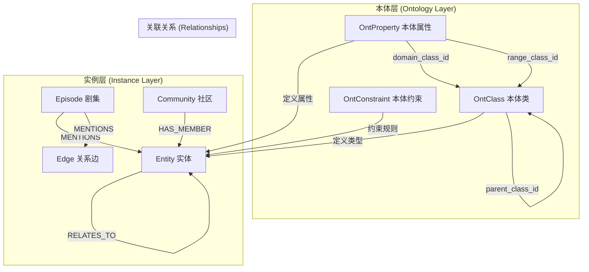

# 知识图谱核心实体关联关系图谱

## 总体关系概览



## 详细关联关系说明

### 1. 本体类 (OntClass) 与实体 (Entity) 的关系

**关联字段**: `entity.type` ↔ `ont_class.local_name`

```
OntClass (本体层)                Entity (实例层)
┌─────────────────┐              ┌──────────────────┐
│ id              │              │ uuid             │
│ class_uri       │              │ name             │
│ local_name ◄────┼───type──────►│ type             │
│ definition_id   │              │ summary          │
│ parent_class_id │              │ properties       │
└─────────────────┘              └──────────────────┘
```

**说明**:
- 实体的 `type` 字段存储的是本体类的 `local_name`（如 "Person", "Company"）
- 通过 `type` 字段，每个实体实例都关联到其定义的本体类
- 本体类可以有继承关系 (`parent_class_id`)

**法律领域数据示例**:

```cypher
// Neo4j 中的法律实体节点示例
(:Entity {
    graph_id: "legal-knowledge-graph",
    uuid: "party-001",
    name: "徐某骥",
    type: "Party",              // ← 对应 ont_class.local_name = "Party"
    partyName: "徐某骥",
    partyType: "自然人",
    partyRole: "原告",
    summary: "案件原告方，自然人当事人"
})

(:Entity {
    graph_id: "legal-knowledge-graph",
    uuid: "court-001",
    name: "上海市第一中级人民法院",
    type: "Court",              // ← 对应 ont_class.local_name = "Court"
    courtName: "上海市第一中级人民法院",
    courtLevel: "中级人民法院",
    location: "上海市",
    summary: "二审法院，管辖上海市辖区内的中级案件"
})

(:Entity {
    graph_id: "legal-knowledge-graph",
    uuid: "case-001",
    name: "公司解散纠纷案",
    type: "Case",               // ← 对应 ont_class.local_name = "Case"
    caseName: "徐某骥与上海某物业管理有限公司公司解散纠纷案",
    caseNumber: "（2022）沪0105民初21387号",
    caseType: "民事案件",
    caseStatus: "已结案",
    filingDate: date('2022-11-15'),
    summary: "公司解散纠纷一审案件"
})
```

```sql
-- PostgreSQL 本体类定义示例
INSERT INTO ont_class (id, definition_id, class_uri, local_name, parent_class_id, description, example, domain_hint) VALUES
(10, 1, 'http://legal-ai.cc/ontology/Party', 'Party', NULL, 
 '案件中的当事人，包括自然人、法人和非法人组织。',
 '{"partyName": "徐某骥", "partyType": "自然人", "partyRole": "原告"}',
 'KNOWLEDGE'),

(20, 1, 'http://legal-ai.cc/ontology/Court', 'Court', NULL,
 '审判机关，包括最高人民法院、高级人民法院、中级人民法院、基层人民法院。',
 '{"courtName": "上海市第一中级人民法院", "courtLevel": "中级人民法院"}',
 'KNOWLEDGE'),

(30, 1, 'http://legal-ai.cc/ontology/Case', 'Case', NULL,
 '法律诉讼案件，包括民事、刑事、行政案件。',
 '{"caseName": "公司解散纠纷案", "caseNumber": "（2022）沪0105民初21387号"}',
 'KNOWLEDGE');
```

### 2. 本体属性 (OntProperty) 与实体 (Entity) 的关系

**关联字段**: `ont_property.domain_class_id` → `ont_class.id`

```
OntProperty (属性定义)
┌──────────────────────┐
│ id                   │
│ property_uri         │
│ local_name           │
│ domain_class_id ─────┐
│ range_class_id       │
│ range_data_type      │
└──────────────────────┘
                     │
                     ▼
OntClass (类定义)          Entity (实体实例)
┌──────────────────┐       ┌──────────────────┐
│ id ◄─────────────┼───────┤ type             │
│ local_name       │       │ properties:      │
└──────────────────┘       │   - propName: val│
                           └──────────────────┘
```

**说明**:
- `domain_class_id` 指定该属性属于哪个类
- 实体的 `properties` 字段（JSON格式）存储属性值
- 属性值必须符合本体定义的约束（类型、范围、必填等）

**法律领域数据示例**:

```sql
-- PostgreSQL 本体属性定义示例
INSERT INTO ont_property (id, definition_id, property_uri, local_name, property_type, domain_class_id, range_class_id, range_data_type, is_required, description) VALUES
-- Party 类的属性
(101, 1, 'http://legal-ai.cc/ontology/hasPartyName', 'partyName', 'DATATYPE', 10, NULL, 'string', TRUE,
 '当事人姓名或名称'),

(102, 1, 'http://legal-ai.cc/ontology/hasPartyType', 'partyType', 'DATATYPE', 10, NULL, 'string', TRUE,
 '当事人类型：自然人/法人/非法人组织'),

(103, 1, 'http://legal-ai.cc/ontology/hasPartyRole', 'partyRole', 'DATATYPE', 10, NULL, 'string', TRUE,
 '当事人在案件中的角色：原告/被告/第三人'),

-- Case 类的属性
(201, 1, 'http://legal-ai.cc/ontology/hasCaseNumber', 'caseNumber', 'DATATYPE', 30, NULL, 'string', TRUE,
 '案件编号，格式：（年份）法院简称+案件类型+编号'),

(202, 1, 'http://legal-ai.cc/ontology/hasCaseType', 'caseType', 'DATATYPE', 30, NULL, 'string', TRUE,
 '案件类型：民事案件/刑事案件/行政案件'),

(203, 1, 'http://legal-ai.cc/ontology/hasFilingDate', 'filingDate', 'DATATYPE', 30, NULL, 'date', FALSE,
 '案件立案日期'),

-- Court 类的属性
(301, 1, 'http://legal-ai.cc/ontology/hasCourtName', 'courtName', 'DATATYPE', 20, NULL, 'string', TRUE,
 '法院名称'),

(302, 1, 'http://legal-ai.cc/ontology/hasCourtLevel', 'courtLevel', 'DATATYPE', 20, NULL, 'string', FALSE,
 '法院级别：最高/高级/中级/基层');
```

```cypher
// Neo4j 中实体节点的 properties 字段示例（存储属性值）
(:Entity {
    uuid: "party-001",
    type: "Party",
    name: "徐某骥",
    // 以下属性值必须符合 ont_property 中定义的规则
    partyName: "徐某骥",           // ← 对应 property: partyName (必填, string)
    partyType: "自然人",           // ← 对应 property: partyType (必填, string)
    partyRole: "原告",             // ← 对应 property: partyRole (必填, string)
    address: "上海市长宁区",       // ← 可选属性
    idNumber: "310105199001011234" // ← 可选属性
})

(:Entity {
    uuid: "case-001",
    type: "Case",
    name: "公司解散纠纷案",
    caseNumber: "（2022）沪0105民初21387号",  // ← 必填，符合案件编号格式
    caseName: "徐某骥与上海某物业管理有限公司公司解散纠纷案",
    caseType: "民事案件",                     // ← 必填
    caseStatus: "已结案",
    filingDate: date('2022-11-15'),           // ← date 类型
    amountInDispute: 500000                   // ← 争议金额（decimal 类型）
})
```

### 3. 实体 (Entity) 与关系边 (Edge) 的关系

**关联字段**: 
- `edge.source_node_uuid` → `entity.uuid`
- `edge.target_node_uuid` → `entity.uuid`

```
Entity (源实体)                    Edge (关系边)                  Entity (目标实体)
┌──────────────────┐              ┌──────────────────┐          ┌──────────────────┐
│ uuid ◄───────────┼──source─────│ source_node_uuid │          │ uuid             │
│ name             │              │ target_node_uuid ├─target──►│ name             │
│ type             │              │ type             │          │ type             │
│ properties       │              │ fact             │          │ properties       │
└──────────────────┘              │ valid_at         │          └──────────────────┘
                                  │ invalid_at       │
                                  └──────────────────┘
```

**说明**:
- 关系边通过 `source_node_uuid` 和 `target_node_uuid` 连接两个实体
- `type` 字段表示关系类型（如 "WORKS_AT", "OWNS"）
- `fact` 字段存储关系的事实描述
- 支持时序性（`valid_at`, `invalid_at`）

**法律领域数据示例**:

```cypher
// Neo4j 法律关系边示例

// 1. 案件当事人关系 (CASE_PARTY)
(party:Entity {uuid: "party-001", name: "徐某骥", type: "Party"})
-[:RELATES_TO {
    uuid: "rel-party-case-001",
    type: "CASE_PARTY",
    fact: "徐某骥作为原告提起公司解散纠纷诉讼",
    role: "原告",                    // 法律关系特有属性
    importance: "high",
    valid_at: 1668470400000,         // 2022-11-15 立案日期
    invalid_at: null                 // 当前有效
}]->
(case:Entity {uuid: "case-001", name: "公司解散纠纷案", type: "Case"})

// 2. 案件法院关系 (CASE_COURT)
(case:Entity {uuid: "case-001", name: "公司解散纠纷案"})
-[:RELATES_TO {
    uuid: "rel-case-court-001",
    type: "CASE_COURT",
    fact: "上海市长宁区人民法院审理此案",
    courtRole: "一审法院",
    valid_at: 1668470400000,
    invalid_at: null
}]->
(court:Entity {uuid: "court-002", name: "上海市长宁区人民法院", type: "Court"})

// 3. 案件法律条文关系 (CASE_LEGAL_BASIS)
(case:Entity {uuid: "case-001"})
-[:RELATES_TO {
    uuid: "rel-case-law-001",
    type: "CASE_LEGAL_BASIS",
    fact: "案件适用《中华人民共和国公司法》第182条",
    applicableProvision: "《公司法》第182条",
    valid_at: 1668470400000,
    invalid_at: null
}]->
(law:Entity {
    uuid: "law-001", 
    name: "公司法第182条", 
    type: "LegalProvision",
    lawName: "中华人民共和国公司法",
    articleNumber: "第182条",
    provisionContent: "公司经营管理发生严重困难..."
})

// 4. 案件法官关系 (CASE_JUDGE)
(case:Entity {uuid: "case-001"})
-[:RELATES_TO {
    uuid: "rel-case-judge-001",
    type: "CASE_JUDGE",
    fact: "张某法官担任审判长",
    judgeRole: "审判长",
    valid_at: 1668470400000,
    invalid_at: null
}]->
(judge:Entity {
    uuid: "judge-001", 
    name: "张某法官", 
    type: "Judge",
    judgeName: "张某",
    judgeTitle: "审判长"
})

// 5. 上诉案件关系 (APPEALED_CASE) - 时序关系示例
(case1:Entity {uuid: "case-001", name: "公司解散纠纷案一审"})
-[:RELATES_TO {
    uuid: "rel-appeal-001",
    type: "APPEALED_CASE",
    fact: "徐某骥不服一审判决，提起上诉",
    appealDate: date('2023-01-20'),
    valid_at: 1674172800000,         // 2023-01-20
    invalid_at: 1698105600000        // 2023-10-24 二审判决后失效
}]->
(case2:Entity {
    uuid: "case-002", 
    name: "公司解散纠纷案二审",
    caseNumber: "（2023）沪01民终11293号"
})
```

```sql
-- PostgreSQL 法律关系元数据定义示例
INSERT INTO ont_relationship_meta (id, definition_id, relationship_type, relationship_name, 
    source_entity_types, target_entity_types, is_directional, description) VALUES
(1, 1, 'CASE_PARTY', '案件当事人', 
 '["Party"]', '["Case"]', TRUE,
 '当事人参与案件的关系，包括原告、被告、第三人'),

(2, 1, 'CASE_COURT', '案件法院',
 '["Case"]', '["Court"]', TRUE,
 '案件由某法院审理的关系，包括一审、二审法院'),

(3, 1, 'CASE_LEGAL_BASIS', '法律依据',
 '["Case"]', '["LegalProvision"]', TRUE,
 '案件适用某法律条文的关系'),

(4, 1, 'CASE_JUDGE', '案件法官',
 '["Case"]', '["Judge"]', TRUE,
 '法官审理案件的关系，包括审判长、审判员'),

(5, 1, 'APPEALED_CASE', '上诉案件',
 '["Case"]', '["Case"]', TRUE,
 '案件之间的上诉关系，连接一审和二审案件');
```

### 4. 剧集 (Episode) 与实体/关系的关系

**关联关系**: `MENTIONS` 关系边

```
Episode (剧集)                    MENTIONS关系                  Entity/Edge
┌──────────────────┐              ┌──────────────────┐          ┌──────────────┐
│ uuid             │              │ type: MENTIONS   │          │ uuid         │
│ name             │              │ graph_id         │─────────►│ name/type    │
│ content          │─────────────►│                  │          └──────────────┘
│ source           │              │                  │
│ valid_at         │              │                  │─────────► Edge (也可被提及)
└──────────────────┘              └──────────────────┘
```

**说明**:
- Episode 通过 `MENTIONS` 关系边提及实体或关系边
- 在 Neo4j 中，这是一个实际的关系边：`(ep:Episode)-[:MENTIONS]->(e:Entity)`
- Episode 代表原始数据来源（如文档、对话、新闻等）
- 提供了实体和关系的溯源能力

**法律领域数据示例**:

```cypher
// Neo4j 法律 Episode 节点示例

// 1. 法律文书 Episode
(:Episode {
    graph_id: "legal-knowledge-graph",
    uuid: "ep-judgment-001",
    name: "一审判决书",
    source: "judgment_document",
    source_description: "上海市长宁区人民法院民事判决书",
    content: "原告徐某骥诉被告上海某物业管理有限公司公司解散纠纷一案...本院查明：公司经营管理发生严重困难，继续存续会使股东利益受到重大损失...判决如下：解散上海某物业管理有限公司。",
    documentNumber: "（2022）沪0105民初21387号",
    documentType: "民事判决书",
    issueDate: date('2023-06-15'),
    valid_at: 1686787200000,         // 2023-06-15
    processed: true
})

// 2. Episode 提及实体
(ep:Episode {uuid: "ep-judgment-001", name: "一审判决书"})
-[:MENTIONS {
    uuid: "mention-001",
    graph_id: "legal-knowledge-graph"
}]->
(party:Entity {uuid: "party-001", name: "徐某骥", type: "Party"})

(ep:Episode {uuid: "ep-judgment-001"})
-[:MENTIONS {
    uuid: "mention-002",
    graph_id: "legal-knowledge-graph"
}]->
(case:Entity {uuid: "case-001", name: "公司解散纠纷案", type: "Case"})

(ep:Episode {uuid: "ep-judgment-001"})
-[:MENTIONS {
    uuid: "mention-003",
    graph_id: "legal-knowledge-graph"
}]->
(court:Entity {uuid: "court-002", name: "上海市长宁区人民法院", type: "Court"})

// 3. Episode 提及关系边
(ep:Episode {uuid: "ep-judgment-001"})
-[:MENTIONS {
    uuid: "mention-004",
    graph_id: "legal-knowledge-graph"
}]->
(rel:RELATES_TO {uuid: "rel-party-case-001", type: "CASE_PARTY"})

// 4. 庭审笔录 Episode
(:Episode {
    graph_id: "legal-knowledge-graph",
    uuid: "ep-trial-001",
    name: "庭审笔录-20230301",
    source: "trial_transcript",
    source_description: "2023年3月1日庭审笔录",
    content: "审判长：现在开庭。首先核对当事人身份...原告徐某骥：我对公司解散的诉讼请求是...被告代理人：我们认为公司不符合解散条件...",
    trialDate: date('2023-03-01'),
    judgeName: "张某",
    valid_at: 1677628800000,         // 2023-03-01
    processed: true
})

// 5. 法律条文 Episode
(:Episode {
    graph_id: "legal-knowledge-graph",
    uuid: "ep-law-001",
    name: "公司法第182条",
    source: "legal_provision",
    source_description: "中华人民共和国公司法",
    content: "公司经营管理发生严重困难，继续存续会使股东利益受到重大损失，通过其他途径不能解决的，持有公司全部股东表决权百分之十以上的股东，可以请求人民法院解散公司。",
    lawName: "中华人民共和国公司法",
    articleNumber: "第182条",
    valid_at: 1104537600000,         // 2005-01-01 生效日期
    processed: true
})
```

```sql
-- PostgreSQL Episode 类型定义（如果有专门的 episode_type 表）
-- Episode 来源类型枚举
-- judgment_document    - 裁判文书
-- trial_transcript     - 庭审笔录
-- legal_provision      - 法律条文
-- evidence             - 证据材料
-- complaint            - 起诉状
-- defense              - 答辩状
-- mediation_agreement  - 调解协议
```

**法律溯源查询示例**:

```cypher
// 查询"徐某骥"这个实体是从哪些法律文书中提取的
MATCH (ep:Episode)-[:MENTIONS]->(e:Entity {name: "徐某骥"})
RETURN ep.name as document_name, 
       ep.source as document_type,
       ep.documentNumber as document_number,
       ep.issueDate as issue_date
ORDER BY ep.issueDate DESC;

// 查询某个案件的所有证据来源
MATCH (ep:Episode)-[:MENTIONS]->(case:Entity {caseNumber: "（2022）沪0105民初21387号"})
RETURN ep.name, ep.source, ep.content
LIMIT 10;
```

### 5. 社区 (Community) 与实体 (Entity) 的关系

**关联关系**: `HAS_MEMBER` 关系边

```
Community (社区)                  HAS_MEMBER关系                Entity (实体)
┌──────────────────┐              ┌──────────────────┐          ┌──────────────┐
│ uuid             │              │ type: HAS_MEMBER │          │ uuid         │
│ name             │              │ graph_id         │─────────►│ name         │
│ summary          │─────────────►│                  │          │ type         │
│ member_count     │              │                  │          │ properties   │
└──────────────────┘              └──────────────────┘          └──────────────┘
```

**说明**:
- 社区通过 `HAS_MEMBER` 关系边包含多个实体
- 社区是通过算法（如 Louvain、标签传播）自动发现的实体聚类
- `member_count` 记录社区成员数量
- 社区摘要由 LLM 生成

**法律领域数据示例**:

```cypher
// Neo4j 法律社区节点示例

// 1. 公司解散纠纷社区
(:Community {
    graph_id: "legal-knowledge-graph",
    uuid: "comm-dissolution-001",
    name: "公司解散纠纷相关实体",
    summary: "该社区包含上海某物业管理有限公司解散纠纷案的所有相关实体，包括股东、董事、法院、法官、律师等。该案件涉及公司经营管理严重困难，股东之间矛盾激化，最终法院判决解散公司。",
    member_count: 23,
    algorithm: "louvain",
    detected_at: datetime('2024-01-15T10:30:00')
})

// 社区成员关系
(comm:Community {uuid: "comm-dissolution-001"})
-[:HAS_MEMBER {
    uuid: "member-001",
    graph_id: "legal-knowledge-graph"
}]->
(party1:Entity {uuid: "party-001", name: "徐某骥", type: "Party"})

(comm:Community {uuid: "comm-dissolution-001"})
-[:HAS_MEMBER {
    uuid: "member-002",
    graph_id: "legal-knowledge-graph"
}]->
(party2:Entity {
    uuid: "party-002", 
    name: "上海某物业管理有限公司", 
    type: "Party",
    partyType: "法人"
})

(comm:Community {uuid: "comm-dissolution-001"})
-[:HAS_MEMBER {
    uuid: "member-003",
    graph_id: "legal-knowledge-graph"
}]->
(case:Entity {uuid: "case-001", name: "公司解散纠纷案", type: "Case"})

(comm:Community {uuid: "comm-dissolution-001"})
-[:HAS_MEMBER {
    uuid: "member-004",
    graph_id: "legal-knowledge-graph"
}]->
(court:Entity {uuid: "court-002", name: "上海市长宁区人民法院", type: "Court"})

(comm:Community {uuid: "comm-dissolution-001"})
-[:HAS_MEMBER {
    uuid: "member-005",
    graph_id: "legal-knowledge-graph"
}]->
(judge:Entity {uuid: "judge-001", name: "张某法官", type: "Judge"})

(comm:Community {uuid: "comm-dissolution-001"})
-[:HAS_MEMBER {
    uuid: "member-006",
    graph_id: "legal-knowledge-graph"
}]->
(law:Entity {uuid: "law-001", name: "公司法第182条", type: "LegalProvision"})

// 2. 商事审判社区（按法院级别聚类）
(:Community {
    graph_id: "legal-knowledge-graph",
    uuid: "comm-commercial-001",
    name: "上海市商事审判网络",
    summary: "该社区包含上海市各级法院审理的商事案件及相关实体，涉及公司纠纷、合同违约、知识产权等案件类型。",
    member_count: 156,
    algorithm: "label_propagation",
    detected_at: datetime('2024-01-20T14:00:00')
})

// 3. 法官网络社区
(:Community {
    graph_id: "legal-knowledge-graph",
    uuid: "comm-judge-network-001",
    name: "民商事审判法官协作网络",
    summary: "该社区包含经常共同审理案件的法官群体，反映法院内部的审判团队协作关系。",
    member_count: 45,
    algorithm: "louvain",
    detected_at: datetime('2024-02-01T09:00:00')
})

// 4. 法条引用网络社区
(:Community {
    graph_id: "legal-knowledge-graph",
    uuid: "comm-law-citation-001",
    name: "公司法相关法条引用网络",
    summary: "该社区包含在公司纠纷案件中经常被引用的法律条文，包括《公司法》核心条款及相关司法解释。",
    member_count: 78,
    algorithm: "louvain",
    detected_at: datetime('2024-02-10T16:30:00')
})
```

```sql
-- PostgreSQL 社区元数据存储（如果需要持久化社区分析结果）
CREATE TABLE community_analysis (
    id BIGSERIAL PRIMARY KEY,
    graph_id VARCHAR(128) NOT NULL,
    community_uuid VARCHAR(128) NOT NULL,
    name VARCHAR(256),
    summary TEXT,
    member_count INTEGER,
    algorithm VARCHAR(64),              -- louvain / label_propagation
    detected_at TIMESTAMP,
    metadata JSONB,                     -- 算法参数、质量指标等
    created_at TIMESTAMP DEFAULT CURRENT_TIMESTAMP
);

-- 社区分析结果示例
INSERT INTO community_analysis (graph_id, community_uuid, name, summary, member_count, algorithm, metadata) VALUES
('legal-knowledge-graph', 'comm-dissolution-001', '公司解散纠纷相关实体',
 '该社区包含上海某物业管理有限公司解散纠纷案的所有相关实体...',
 23, 'louvain',
 '{"resolution": 1.0, "modularity": 0.78, "iterations": 15}'),

('legal-knowledge-graph', 'comm-commercial-001', '上海市商事审判网络',
 '该社区包含上海市各级法院审理的商事案件及相关实体...',
 156, 'label_propagation',
 {"max_iterations": 100, "convergence_threshold": 0.001}');
```

**法律社区查询示例**:

```cypher
// 查询某个社区的所有成员（按类型分组）
MATCH (c:Community {uuid: "comm-dissolution-001"})-[:HAS_MEMBER]->(e:Entity)
RETURN e.type as entity_type, count(*) as count, collect(e.name) as members
ORDER BY count DESC;

// 结果示例：
// entity_type          | count | members
// ---------------------|-------|----------------------------------
// Party                | 8     | ["徐某骥", "上海某物业管理有限公司", ...]
// Case                 | 3     | ["公司解散纠纷案", "上诉案", ...]
// Court                | 2     | ["上海市长宁区人民法院", ...]
// Judge                | 2     | ["张某法官", "李某法官"]
// LegalProvision       | 5     | ["公司法第182条", "公司法解释二第1条", ...]
// Evidence             | 3     | ["证据1", "证据2", ...]

// 查询某个实体所属的所有社区
MATCH (c:Community)-[:HAS_MEMBER]->(e:Entity {name: "徐某骥"})
RETURN c.name, c.summary, c.member_count, c.algorithm;

// 查找社区内部的实体关系
MATCH (c:Community {uuid: "comm-dissolution-001"})-[:HAS_MEMBER]->(e1:Entity)
MATCH (e1)-[r:RELATES_TO]->(e2:Entity)
WHERE (c)-[:HAS_MEMBER]->(e2)
RETURN e1.name, type(r), e2.name, r.fact
LIMIT 20;
```

### 6. 本体约束 (OntConstraint) 与实体 (Entity) 的关系

**关联字段**: `ont_constraint.class_id` → `ont_class.id`

```
OntConstraint (约束)              OntClass (类)                Entity (实体)
┌──────────────────┐             ┌──────────────────┐         ┌──────────────┐
│ id               │             │ id ◄──────────────┼─────────┤ type         │
│ class_id ────────┼────────────►│ local_name       │         │ properties   │
│ property_id      │             └──────────────────┘         └──────────────┘
│ constraint_type  │
│ value (JSON)     │             验证过程:
│ severity         │             1. 根据 entity.type 找到 ont_class
└──────────────────┘             2. 找到该类的所有约束
                                 3. 验证 entity.properties 是否符合约束
```

**说明**:
- 约束定义了实体属性必须满足的规则
- 约束类型包括：CARDINALITY（数量）、PATTERN（正则）、RANGE（范围）、ENUM（枚举）等
- 在创建/更新实体时进行验证

**法律领域数据示例**:

```sql
-- PostgreSQL 法律本体约束定义示例

-- 1. 案件编号格式约束（PATTERN）
INSERT INTO ont_constraint (id, definition_id, class_id, property_id, constraint_type, value, error_message, severity, description) VALUES
(1, 1, 30, 201, 'PATTERN',
 '{"pattern": "^（\\d{4}）[\\u4e00-\\u9fa5]{2,6}\\u6c11[\\u521d\\u7ec8]{1}\\d{3,8}号$"}',
 '案件编号格式错误，应为：（年份）法院简称+案件类型+编号，如（2022）沪0105民初21387号',
 'ERROR',
 '案件编号必须符合中国法院标准格式');

-- 2. 当事人类型枚举约束（ENUM）
(2, 1, 10, 102, 'ENUM',
 '{"allowed_values": ["自然人", "法人", "非法人组织"]}',
 '当事人类型必须是：自然人、法人或非法人组织',
 'ERROR',
 '当事人类型枚举约束');

-- 3. 当事人角色枚举约束（ENUM）
(3, 1, 10, 103, 'ENUM',
 '{"allowed_values": ["原告", "被告", "第三人", "上诉人", "被上诉人"]}',
 '当事人角色必须是：原告、被告、第三人、上诉人或被上诉人',
 'ERROR',
 '当事人诉讼角色枚举约束');

-- 4. 法院级别枚举约束（ENUM）
(4, 1, 20, 302, 'ENUM',
 '{"allowed_values": ["最高人民法院", "高级人民法院", "中级人民法院", "基层人民法院", "专门法院"]}',
 '法院级别必须是：最高人民法院、高级人民法院、中级人民法院、基层人民法院或专门法院',
 'ERROR',
 '中国法院五级体系约束');

-- 5. 案件类型枚举约束（ENUM）
(5, 1, 30, 202, 'ENUM',
 '{"allowed_values": ["民事案件", "刑事案件", "行政案件"]}',
 '案件类型必须是：民事案件、刑事案件或行政案件',
 'ERROR',
 '中国三大诉讼类型约束');

-- 6. 争议金额范围约束（RANGE）
(6, 1, 30, NULL, 'RANGE',
 '{"property": "amountInDispute", "min": 0, "max": 10000000000}',
 '争议金额必须在 0 到 100亿元之间',
 'WARNING',
 '案件争议金额合理范围约束');

-- 7. 当事人姓名长度约束（LENGTH）
(7, 1, 10, 101, 'LENGTH',
 '{"min": 2, "max": 100}',
 '当事人姓名长度必须在 2 到 100 个字符之间',
 'ERROR',
 '当事人姓名长度约束');

-- 8. 立案日期范围约束（RANGE - 日期）
(8, 1, 30, 203, 'RANGE',
 '{"property": "filingDate", "min": "1949-10-01", "max": "2099-12-31"}',
 '立案日期必须在中华人民共和国成立之后',
 'WARNING',
 '案件立案日期合理性约束');

-- 9. 身份证号格式约束（PATTERN）
(9, 1, 10, NULL, 'PATTERN',
 '{"property": "idNumber", "pattern": "^(\\d{15}|\\d{18}|\\d{17}X)$"}',
 '身份证号码格式错误，应为15位或18位',
 'ERROR',
 '中国大陆身份证号码格式约束');

-- 10. 必填属性约束（NOT_NULL）
(10, 1, 10, 101, 'NOT_NULL',
 '{}',
 '当事人姓名不能为空',
 'ERROR',
 '当事人姓名必填约束');

-- 11. 法官职务枚举约束（ENUM）
(11, 1, 40, NULL, 'ENUM',
 '{"property": "judgeTitle", "allowed_values": ["审判长", "审判员", "代理审判员", "人民陪审员", "书记员"]}',
 '法官职务必须是：审判长、审判员、代理审判员、人民陪审员或书记员',
 'ERROR',
 '中国法官职务类型约束');

-- 12. 裁判文书类型枚举约束（ENUM）
(12, 1, 50, NULL, 'ENUM',
 '{"property": "documentType", "allowed_values": ["民事判决书", "民事裁定书", "刑事判决书", "刑事裁定书", "行政判决书", "行政裁定书", "调解书"]}',
 '文书类型必须是法定的裁判文书类型',
 'ERROR',
 '中国裁判文书类型约束');
```

```cypher
// Neo4j 中实体属性验证示例

// ✅ 正确的实体创建（符合所有约束）
CREATE (party:Entity {
    uuid: "party-valid-001",
    graph_id: "legal-knowledge-graph",
    type: "Party",
    name: "徐某骥",
    partyName: "徐某骥",              // ✅ 长度 2-100，非空
    partyType: "自然人",              // ✅ 在枚举值中
    partyRole: "原告",                // ✅ 在枚举值中
    idNumber: "310105199001011234",   // ✅ 符合18位格式
    address: "上海市长宁区"
})

// ❌ 错误的实体创建（违反多个约束）
CREATE (party:Entity {
    uuid: "party-invalid-001",
    graph_id: "legal-knowledge-graph",
    type: "Party",
    name: "徐",                       // ❌ 违反约束7：姓名长度至少2个字符
    partyName: "徐",
    partyType: "个人",                // ❌ 违反约束2：不在枚举值 [自然人, 法人, 非法人组织] 中
    partyRole: "起诉人",              // ❌ 违反约束3：不在枚举值 [原告, 被告, 第三人, ...] 中
    idNumber: "123456"                // ❌ 违反约束9：身份证号码格式错误
})
// 验证错误信息：
// 1. [ONT004] 当事人姓名长度必须在 2 到 100 个字符之间 (attempted: "徐")
// 2. [ONT004] 当事人类型必须是：自然人、法人或非法人组织 (attempted: "个人")
// 3. [ONT004] 当事人角色必须是：原告、被告、第三人、上诉人或被上诉人 (attempted: "起诉人")
// 4. [ONT004] 身份证号码格式错误，应为15位或18位 (attempted: "123456")
```

**约束验证流程示例**:

```java
// Java 后端验证流程示例（伪代码）
public ValidationResult validateParty(Map<String, Object> properties) {
    // 1. 根据 entity.type="Party" 找到 ont_class.id=10
    OntClassDO partyClass = classMapper.findByLocalName("Party");
    
    // 2. 查询该类的所有约束
    List<OntConstraintDO> constraints = constraintMapper.findByClassId(partyClass.getId());
    
    // 3. 逐条验证
    List<ValidationError> errors = new ArrayList<>();
    
    // 验证 partyType 枚举约束
    if (!List.of("自然人", "法人", "非法人组织").contains(properties.get("partyType"))) {
        errors.add(new ValidationError(
            "ONT004", 
            "当事人类型必须是：自然人、法人或非法人组织",
            "partyType",
            properties.get("partyType")
        ));
    }
    
    // 验证 idNumber 格式约束
    String idNumber = (String) properties.get("idNumber");
    if (idNumber != null && !idNumber.matches("^(\d{15}|\d{18}|\d{17}X)$")) {
        errors.add(new ValidationError(
            "ONT004",
            "身份证号码格式错误，应为15位或18位",
            "idNumber",
            idNumber
        ));
    }
    
    // 返回验证结果
    return errors.isEmpty() ? ValidationResult.pass() : ValidationResult.fail(errors);
}
```

**法律领域专用约束说明**:

| 约束类型 | 法律应用场景 | 示例 |
|---------|------------|------|
| PATTERN | 案件编号、身份证号、统一社会信用代码 | `（2022）沪0105民初21387号` |
| ENUM | 案件类型、当事人角色、法院级别 | `["民事案件", "刑事案件", "行政案件"]` |
| RANGE | 争议金额、立案日期 | `金额 >= 0`, `日期 >= 1949-10-01` |
| LENGTH | 当事人姓名、法院名称 | `姓名长度: 2-100` |
| NOT_NULL | 必填字段（姓名、案号等） | `partyName` 不能为空 |
| CARDINALITY | 一个案件的当事人数量限制 | `当事人数量: 1-100` |

## Neo4j 图数据库中的实际存储

### 节点标签 (Node Labels)

```cypher
// 法律实体节点 - 当事人 (Party)
(:Entity {
    graph_id: "legal-knowledge-graph",
    uuid: "party-001",
    name: "徐某骥",
    type: "Party",              // ← 对应 ont_class.local_name
    partyName: "徐某骥",
    partyType: "自然人",
    partyRole: "原告",
    summary: "案件原告方，持有公司30%股权"
})

// 法律实体节点 - 案件 (Case)
(:Entity {
    graph_id: "legal-knowledge-graph",
    uuid: "case-001",
    name: "公司解散纠纷案",
    type: "Case",
    caseName: "徐某骥与上海某物业管理有限公司公司解散纠纷案",
    caseNumber: "（2022）沪0105民初21387号",
    caseType: "民事案件",
    filingDate: date('2022-11-15'),
    summary: "公司经营管理严重困难，股东请求解散"
})

// 法律实体节点 - 法院 (Court)
(:Entity {
    graph_id: "legal-knowledge-graph",
    uuid: "court-002",
    name: "上海市长宁区人民法院",
    type: "Court",
    courtName: "上海市长宁区人民法院",
    courtLevel: "基层人民法院",
    location: "上海市长宁区",
    summary: "一审管辖法院"
})

// 法律实体节点 - 法律条文 (LegalProvision)
(:Entity {
    graph_id: "legal-knowledge-graph",
    uuid: "law-001",
    name: "公司法第182条",
    type: "LegalProvision",
    lawName: "中华人民共和国公司法",
    articleNumber: "第182条",
    provisionContent: "公司经营管理发生严重困难，继续存续会使股东利益受到重大损失...",
    summary: "公司司法解散的法律依据"
})

// 法律实体节点 - 法官 (Judge)
(:Entity {
    graph_id: "legal-knowledge-graph",
    uuid: "judge-001",
    name: "张某法官",
    type: "Judge",
    judgeName: "张某",
    judgeTitle: "审判长",
    courtName: "上海市长宁区人民法院",
    summary: "本案审判长"
})

// 法律实体节点 - 裁判文书 (JudgmentDocument)
(:Entity {
    graph_id: "legal-knowledge-graph",
    uuid: "judgment-001",
    name: "一审判决书",
    type: "JudgmentDocument",
    documentNumber: "（2022）沪0105民初21387号",
    documentType: "民事判决书",
    issueDate: date('2023-06-15'),
    judgmentResult: "解散上海某物业管理有限公司",
    courtName: "上海市长宁区人民法院",
    summary: "判决公司解散的一审裁判文书"
})

// 法律实体节点 - 证据 (Evidence)
(:Entity {
    graph_id: "legal-knowledge-graph",
    uuid: "evidence-001",
    name: "证据1-财务报表",
    type: "Evidence",
    evidenceNumber: "证据1",
    evidenceType: "书证",
    submittedBy: "原告徐某骥",
    purpose: "证明公司经营管理发生严重困难",
    summary: "公司连续三年亏损的财务报表"
})

// 法律剧集节点 - 裁判文书 Episode
(:Episode {
    graph_id: "legal-knowledge-graph",
    uuid: "ep-judgment-001",
    name: "一审判决书",
    source: "judgment_document",
    content: "原告徐某骥诉被告上海某物业管理有限公司公司解散纠纷一案...",
    documentNumber: "（2022）沪0105民初21387号",
    issueDate: date('2023-06-15'),
    processed: true
})

// 法律社区节点 - 案件相关实体聚类
(:Community {
    graph_id: "legal-knowledge-graph",
    uuid: "comm-dissolution-001",
    name: "公司解散纠纷相关实体",
    summary: "该社区包含公司解散纠纷案的所有相关实体",
    member_count: 23,
    algorithm: "louvain"
})
```

### 关系类型 (Relationship Types)

```cypher
// 法律关系边 - 案件当事人关系
(party:Entity {uuid: "party-001", name: "徐某骥"})
-[:RELATES_TO {
    uuid: "rel-party-case-001",
    type: "CASE_PARTY",
    fact: "徐某骥作为原告提起公司解散纠纷诉讼",
    role: "原告",
    valid_at: 1668470400000,
    invalid_at: null
}]->
(case:Entity {uuid: "case-001", name: "公司解散纠纷案"})

// 法律关系边 - 案件法院关系
(case:Entity {uuid: "case-001"})
-[:RELATES_TO {
    uuid: "rel-case-court-001",
    type: "CASE_COURT",
    fact: "上海市长宁区人民法院审理此案",
    courtRole: "一审法院",
    valid_at: 1668470400000,
    invalid_at: null
}]->
(court:Entity {uuid: "court-002", name: "上海市长宁区人民法院"})

// 法律关系边 - 案件法律条文关系
(case:Entity {uuid: "case-001"})
-[:RELATES_TO {
    uuid: "rel-case-law-001",
    type: "CASE_LEGAL_BASIS",
    fact: "案件适用《中华人民共和国公司法》第182条",
    valid_at: 1668470400000,
    invalid_at: null
}]->
(law:Entity {uuid: "law-001", name: "公司法第182条"})

// 法律关系边 - 上诉关系（时序关系）
(case1:Entity {uuid: "case-001", name: "公司解散纠纷案一审"})
-[:RELATES_TO {
    uuid: "rel-appeal-001",
    type: "APPEALED_CASE",
    fact: "徐某骥不服一审判决，提起上诉",
    appealDate: date('2023-01-20'),
    valid_at: 1674172800000,
    invalid_at: 1698105600000    // 二审判决后失效
}]->
(case2:Entity {
    uuid: "case-002", 
    name: "公司解散纠纷案二审",
    caseNumber: "（2023）沪01民终11293号"
})

// Episode 提及关系 - 法律文书提及实体
(ep:Episode {uuid: "ep-judgment-001", name: "一审判决书"})
-[:MENTIONS {
    uuid: "mention-001",
    graph_id: "legal-knowledge-graph"
}]->
(party:Entity {uuid: "party-001", name: "徐某骥"})

(ep:Episode {uuid: "ep-judgment-001"})
-[:MENTIONS {
    uuid: "mention-002",
    graph_id: "legal-knowledge-graph"
}]->
(case:Entity {uuid: "case-001", name: "公司解散纠纷案"})

// Episode 提及关系边
(ep:Episode {uuid: "ep-judgment-001"})
-[:MENTIONS {
    uuid: "mention-003",
    graph_id: "legal-knowledge-graph"
}]->
(rel:RELATES_TO {uuid: "rel-party-case-001", type: "CASE_PARTY"})

// 社区成员关系 - 社区包含法律实体
(comm:Community {uuid: "comm-dissolution-001", name: "公司解散纠纷相关实体"})
-[:HAS_MEMBER {
    uuid: "member-001",
    graph_id: "legal-knowledge-graph"
}]->
(party:Entity {uuid: "party-001", name: "徐某骥"})

(comm:Community {uuid: "comm-dissolution-001"})
-[:HAS_MEMBER {
    uuid: "member-002",
    graph_id: "legal-knowledge-graph"
}]->
(case:Entity {uuid: "case-001", name: "公司解散纠纷案"})

(comm:Community {uuid: "comm-dissolution-001"})
-[:HAS_MEMBER {
    uuid: "member-003",
    graph_id: "legal-knowledge-graph"
}]->
(court:Entity {uuid: "court-002", name: "上海市长宁区人民法院"})

(comm:Community {uuid: "comm-dissolution-001"})
-[:HAS_MEMBER {
    uuid: "member-004",
    graph_id: "legal-knowledge-graph"
}]->
(law:Entity {uuid: "law-001", name: "公司法第182条"})
```

**法律领域关系类型完整列表**:

| 关系类型 | 源实体类型 | 目标实体类型 | 说明 | 示例 |
|---------|----------|------------|------|------|
| CASE_PARTY | Party | Case | 当事人参与案件 | 原告、被告、第三人 |
| CASE_COURT | Case | Court | 案件由某法院审理 | 一审法院、二审法院 |
| CASE_JUDGE | Case | Judge | 法官审理案件 | 审判长、审判员 |
| CASE_LEGAL_BASIS | Case | LegalProvision | 案件适用某法条 | 《公司法》第182条 |
| CASE_EVIDENCE | Case | Evidence | 案件证据 | 书证、物证、证人证言 |
| APPEALED_CASE | Case | Case | 上诉关系 | 一审→二审 |
| JUDGMENT_CASE | JudgmentDocument | Case | 裁判文书对应案件 | 判决书→案件 |
| PARTY_LAWYER | Party | Lawyer | 当事人委托律师 | 原告→代理律师 |
| LAWYER_FIRM | Lawyer | LawFirm | 律师所属律所 | 律师→律师事务所 |
| MENTIONS | Episode | Entity/Edge | Episode 提及实体/关系 | 文书→当事人 |
| HAS_MEMBER | Community | Entity | 社区包含成员 | 案件社区→当事人 |

## PostgreSQL 关系型数据库中的本体定义

### 核心表结构与法律领域数据示例

```sql
-- 1. 本体定义表 - 法律知识图谱定义
INSERT INTO ont_definition (id, graph_id, namespace, name, version, status, description) VALUES
(1, 'legal-knowledge-graph', 'http://legal-ai.cc/ontology', '法律知识图谱本体', 'v1.0', 'ACTIVE',
 '法律领域知识图谱本体定义，包含案件、当事人、法院、法律条文等核心概念');

-- 2. 本体类表 - 法律实体类型定义
INSERT INTO ont_class (id, definition_id, class_uri, local_name, parent_class_id, description, example, domain_hint, metadata) VALUES
-- 核心法律实体类
(10, 1, 'http://legal-ai.cc/ontology/Party', 'Party', NULL, 
 '案件中的当事人，包括自然人、法人和非法人组织。',
 '{"partyName": "徐某骥", "partyType": "自然人", "partyRole": "原告"}',
 'KNOWLEDGE', '{"icon": "person", "color": "#E1F5FE"}'),

(20, 1, 'http://legal-ai.cc/ontology/Court', 'Court', NULL,
 '审判机关，包括最高人民法院、高级人民法院、中级人民法院、基层人民法院。',
 '{"courtName": "上海市第一中级人民法院", "courtLevel": "中级人民法院"}',
 'KNOWLEDGE', '{"icon": "court", "color": "#FCE4EC"}'),

(30, 1, 'http://legal-ai.cc/ontology/Case', 'Case', NULL,
 '法律诉讼案件，包括民事、刑事、行政案件。',
 '{"caseName": "公司解散纠纷案", "caseNumber": "（2022）沪0105民初21387号"}',
 'KNOWLEDGE', '{"icon": "case", "color": "#FFF3E0"}'),

(40, 1, 'http://legal-ai.cc/ontology/Judge', 'Judge', NULL,
 '案件审判人员，包括审判长、审判员、人民陪审员。',
 '{"judgeName": "张某", "judgeTitle": "审判长"}',
 'KNOWLEDGE', '{"icon": "judge", "color": "#FFF8E1"}'),

(50, 1, 'http://legal-ai.cc/ontology/LegalProvision', 'LegalProvision', NULL,
 '法律条文，包括法律、法规、司法解释的具体条款。',
 '{"lawName": "中华人民共和国公司法", "articleNumber": "第182条"}',
 'KNOWLEDGE', '{"icon": "law", "color": "#E8F5E9"}'),

(60, 1, 'http://legal-ai.cc/ontology/JudgmentDocument', 'JudgmentDocument', NULL,
 '裁判文书，包括判决书、裁定书、调解书。',
 '{"documentNumber": "（2022）沪0105民初21387号", "documentType": "民事判决书"}',
 'KNOWLEDGE', '{"icon": "document", "color": "#F3E5F5"}'),

(70, 1, 'http://legal-ai.cc/ontology/Evidence', 'Evidence', NULL,
 '案件证据，包括书证、物证、证人证言、鉴定意见等。',
 '{"evidenceNumber": "证据1", "evidenceType": "书证"}',
 'KNOWLEDGE', '{"icon": "evidence", "color": "#E0F2F1"}'),

(80, 1, 'http://legal-ai.cc/ontology/Lawyer', 'Lawyer', NULL,
 '执业律师，为当事人提供法律服务。',
 '{"partyName": "陈某律师", "firmName": "上海某律师事务所"}',
 'KNOWLEDGE', '{"icon": "lawyer", "color": "#E0F7FA"}');

-- 3. 本体属性表 - 法律实体属性定义
INSERT INTO ont_property (id, definition_id, property_uri, local_name, property_type, domain_class_id, range_data_type, is_required, description) VALUES
-- Party 类属性
(101, 1, 'http://legal-ai.cc/ontology/hasPartyName', 'partyName', 'DATATYPE', 10, 'string', TRUE,
 '当事人姓名或名称'),
(102, 1, 'http://legal-ai.cc/ontology/hasPartyType', 'partyType', 'DATATYPE', 10, 'string', TRUE,
 '当事人类型：自然人/法人/非法人组织'),
(103, 1, 'http://legal-ai.cc/ontology/hasPartyRole', 'partyRole', 'DATATYPE', 10, 'string', TRUE,
 '当事人在案件中的角色：原告/被告/第三人'),

-- Case 类属性
(201, 1, 'http://legal-ai.cc/ontology/hasCaseNumber', 'caseNumber', 'DATATYPE', 30, 'string', TRUE,
 '案件编号'),
(202, 1, 'http://legal-ai.cc/ontology/hasCaseType', 'caseType', 'DATATYPE', 30, 'string', TRUE,
 '案件类型：民事/刑事/行政'),
(203, 1, 'http://legal-ai.cc/ontology/hasFilingDate', 'filingDate', 'DATATYPE', 30, 'date', FALSE,
 '立案日期'),

-- Court 类属性
(301, 1, 'http://legal-ai.cc/ontology/hasCourtName', 'courtName', 'DATATYPE', 20, 'string', TRUE,
 '法院名称'),
(302, 1, 'http://legal-ai.cc/ontology/hasCourtLevel', 'courtLevel', 'DATATYPE', 20, 'string', FALSE,
 '法院级别');

-- 4. 本体约束表 - 法律数据验证规则
INSERT INTO ont_constraint (id, definition_id, class_id, property_id, constraint_type, value, error_message, severity) VALUES
-- 案件编号格式约束
(1, 1, 30, 201, 'PATTERN',
 '{"pattern": "^（\\d{4}）[\\u4e00-\\u9fa5]{2,6}\\u6c11[\\u521d\\u7ec8]{1}\\d{3,8}号$"}',
 '案件编号格式错误', 'ERROR'),

-- 当事人类型枚举约束
(2, 1, 10, 102, 'ENUM',
 '{"allowed_values": ["自然人", "法人", "非法人组织"]}',
 '当事人类型必须是：自然人、法人或非法人组织', 'ERROR'),

-- 案件类型枚举约束
(3, 1, 30, 202, 'ENUM',
 '{"allowed_values": ["民事案件", "刑事案件", "行政案件"]}',
 '案件类型必须是：民事案件、刑事案件或行政案件', 'ERROR');
```

### 法律本体类继承关系示例

```sql
-- 本体类继承关系 - 支持层级化分类
INSERT INTO ont_class (id, definition_id, class_uri, local_name, parent_class_id, description) VALUES
-- 顶层类
(5, 1, 'http://legal-ai.cc/ontology/LegalEntity', 'LegalEntity', NULL,
 '法律领域实体的顶层抽象类'),

-- 子类 - 继承自 LegalEntity
(10, 1, 'http://legal-ai.cc/ontology/Party', 'Party', 5,
 '案件当事人（继承自 LegalEntity）'),

(20, 1, 'http://legal-ai.cc/ontology/Court', 'Court', 5,
 '法院机构（继承自 LegalEntity）'),

-- 当事人的子类
(11, 1, 'http://legal-ai.cc/ontology/NaturalPerson', 'NaturalPerson', 10,
 '自然人当事人（继承自 Party）'),

(12, 1, 'http://legal-ai.cc/ontology/LegalPerson', 'LegalPerson', 10,
 '法人当事人（继承自 Party）');

-- 查询继承层级
SELECT 
    c1.local_name AS child_class,
    c2.local_name AS parent_class,
    c3.local_name AS grandparent_class
FROM ont_class c1
LEFT JOIN ont_class c2 ON c1.parent_class_id = c2.id
LEFT JOIN ont_class c3 ON c2.parent_class_id = c3.id
WHERE c1.definition_id = 1
ORDER BY c1.local_name;

-- 结果示例：
-- child_class       | parent_class | grandparent_class
-- ------------------|--------------|------------------
-- Case              | NULL         | NULL
-- Court             | LegalEntity  | NULL
-- Evidence          | NULL         | NULL
-- Judge             | NULL         | NULL
-- JudgmentDocument  | NULL         | NULL
-- LegalPerson       | Party        | LegalEntity
-- NaturalPerson     | Party        | LegalEntity
-- Party             | LegalEntity  | NULL
```

## 完整的关联链路示例

### 场景：从 Episode 到 Community 的完整法律追溯

```
原始法律文书 (Episode)
    │
    │ 文书: （2022）沪0105民初21387号 民事判决书
    │ 来源: judgment_document
    │
    │ LLM 提取实体和关系
    ▼
实体 "徐某骥" (type: "Party")
    │ ← ont_class.local_name = "Party"
    │ ← ont_definition.graph_id = "legal-knowledge-graph"
    │ ← 属性: partyName="徐某骥", partyType="自然人", partyRole="原告"
    │ ← 验证: 符合所有 OntConstraint 约束
    │
    │ 通过 RELATES_TO 关系 (CASE_PARTY)
    ▼
实体 "公司解散纠纷案" (type: "Case")
    │ ← 案号: （2022）沪0105民初21387号
    │ ← 属性: caseType="民事案件", filingDate="2022-11-15"
    │
    │ 通过 RELATES_TO 关系 (CASE_COURT)
    ▼
实体 "上海市长宁区人民法院" (type: "Court")
    │ ← 属性: courtLevel="基层人民法院"
    │
    │ 通过 RELATES_TO 关系 (CASE_LEGAL_BASIS)
    ▼
实体 "公司法第182条" (type: "LegalProvision")
    │ ← 属性: lawName="中华人民共和国公司法"
    │
    │ 被算法聚类（基于共同案件）
    ▼
社区 "公司解散纠纷相关实体" (Community)
    │ ← 算法: louvain
    │ ← 成员数: 23个实体
    │
    │ 通过 HAS_MEMBER 关系
    └─── 包含: 徐某骥、公司、法院、法官、律师、法律条文、证据...
```

### 法律领域查询示例

```cypher
// 1. 查找提及"徐某骥"的所有法律文书
MATCH (ep:Episode)-[:MENTIONS]->(e:Entity {name: "徐某骥"})
WHERE ep.source IN ['judgment_document', 'trial_transcript']
RETURN ep.name as document_name, 
       ep.source as document_type,
       ep.documentNumber as document_number,
       ep.issueDate as issue_date
ORDER BY ep.issueDate DESC;

// 结果示例：
// document_name        | document_type      | document_number              | issue_date
// ---------------------|-------------------|------------------------------|------------
// "一审判决书"         | judgment_document | （2022）沪0105民初21387号    | 2023-06-15
// "庭审笔录-20230301"  | trial_transcript  | NULL                         | 2023-03-01

// 2. 查找"徐某骥"参与的所有案件及其法院
MATCH (party:Entity {name: "徐某骥"})-[r:RELATES_TO {type: "CASE_PARTY"}]->(case:Entity)
MATCH (case)-[r2:RELATES_TO {type: "CASE_COURT"}]->(court:Entity)
RETURN party.partyName, 
       r.role as party_role,
       case.caseName, 
       case.caseNumber,
       court.courtName,
       r2.courtRole
ORDER BY case.filingDate DESC;

// 结果示例：
// partyName | party_role | caseName                | caseNumber                    | courtName                  | courtRole
// ----------|------------|-------------------------|-------------------------------|----------------------------|-----------
// "徐某骥"  | "原告"     | "公司解散纠纷案"        | "（2022）沪0105民初21387号"  | "上海市长宁区人民法院"     | "一审法院"

// 3. 查找"公司解散纠纷案"适用的所有法律条文
MATCH (case:Entity {caseNumber: "（2022）沪0105民初21387号"})
      -[r:RELATES_TO {type: "CASE_LEGAL_BASIS"}]->
      (law:Entity {type: "LegalProvision"})
RETURN law.lawName, 
       law.articleNumber, 
       law.provisionContent,
       r.fact as application_reason
LIMIT 10;

// 结果示例：
// lawName                        | articleNumber | provisionContent                    | application_reason
// -------------------------------|---------------|-------------------------------------|-------------------
// "中华人民共和国公司法"         | "第182条"     | "公司经营管理发生严重困难..."       | "案件适用《公司法》第182条"
// "公司法解释二"                 | "第1条"       | "单独或者合计持有公司全部股东..."  | "司法解释适用"

// 4. 查找公司解散纠纷社区的所有成员（按类型分组）
MATCH (c:Community {name: "公司解散纠纷相关实体"})-[:HAS_MEMBER]->(e:Entity)
RETURN e.type as entity_type, 
       count(*) as count, 
       collect(e.name)[0..5] as sample_members  // 只显示前5个
ORDER BY count DESC;

// 结果示例：
// entity_type          | count | sample_members
// ---------------------|-------|----------------------------------
// Party                | 8     | ["徐某骥", "上海某物业管理有限公司", ...]
// LegalProvision       | 5     | ["公司法第182条", "公司法解释二第1条", ...]
// Evidence             | 4     | ["证据1-财务报表", "证据2-审计报告", ...]
// Case                 | 3     | ["公司解散纠纷案一审", "上诉案", ...]
// Court                | 2     | ["上海市长宁区人民法院", "上海市第一中级人民法院"]
// Judge                | 2     | ["张某法官", "李某法官"]

// 5. 追溯案件判决的法律依据和事实基础
MATCH (case:Entity {caseNumber: "（2022）沪0105民初21387号"})
// 查找法律依据
OPTIONAL MATCH (case)-[r1:RELATES_TO {type: "CASE_LEGAL_BASIS"}]->(law:Entity)
// 查找证据
OPTIONAL MATCH (case)-[r2:RELATES_TO {type: "CASE_EVIDENCE"}]->(evidence:Entity)
// 查找裁判文书
OPTIONAL MATCH (judgment:Entity {type: "JudgmentDocument"})-[r3:RELATES_TO]->(case)
RETURN 
    case.caseName,
    collect(DISTINCT {law: law.lawName + " " + law.articleNumber}) as legal_basis,
    collect(DISTINCT {evidence: evidence.evidenceNumber + "-" + evidence.evidenceType}) as evidences,
    collect(DISTINCT {judgment: judgment.documentNumber + "-" + judgment.judgmentResult}) as judgments;

// 6. 查找某法官审理的所有案件及其当事人
MATCH (judge:Entity {judgeName: "张某"})
<-[r:RELATES_TO {type: "CASE_JUDGE"}]-
(case:Entity {type: "Case"})
<-[r2:RELATES_TO {type: "CASE_PARTY"}]-
(party:Entity {type: "Party"})
RETURN 
    judge.judgeName,
    judge.judgeTitle,
    case.caseNumber,
    case.caseType,
    party.partyName,
    r2.role as party_role,
    r.judgeRole
ORDER BY case.filingDate DESC
LIMIT 20;

// 7. 时序查询 - 查找某案件在特定时间点的有效关系
MATCH (case:Entity {caseNumber: "（2022）沪0105民初21387号"})
      <-[r:RELATES_TO]-
      (entity:Entity)
WHERE r.valid_at <= timestamp('2023-06-15T00:00:00')
  AND (r.invalid_at IS NULL OR r.invalid_at > timestamp('2023-06-15T00:00:00'))
RETURN entity.name, type(r), r.fact, r.valid_at, r.invalid_at;
```

## 总结：关键字段映射表

| 关联关系 | 源字段 | 目标字段 | 说明 |
|---------|--------|---------|------|
| 类→实体 | `ont_class.local_name` | `entity.type` | 定义实体的类型 |
| 属性→实体 | `ont_property.domain_class_id` | `entity.type` | 通过类关联到属性定义 |
| 实体→关系 | `entity.uuid` | `edge.source_node_uuid` / `target_node_uuid` | 关系的两端 |
| 剧集→实体 | `episode.uuid` | `MENTIONS` 关系 | Episode 提及实体 |
| 剧集→关系 | `episode.uuid` | `MENTIONS` 关系 | Episode 提及关系边 |
| 社区→实体 | `community.uuid` | `HAS_MEMBER` 关系 | 社区包含实体 |
| 约束→实体 | `ont_constraint.class_id` | `entity.type` | 通过类关联到约束 |
| 类继承 | `ont_class.parent_class_id` | `ont_class.id` | 支持继承层级 |
| 属性范围 | `ont_property.range_class_id` | `ont_class.id` | 属性指向的目标类 |

## 架构层次总结

```
┌─────────────────────────────────────────────────────┐
│              本体层 (Ontology Layer)                  │
│  PostgreSQL 存储:                                    │
│  - OntDefinition (本体定义)                          │
│  - OntClass (类定义) ← local_name 被 entity.type 引用│
│  - OntProperty (属性定义)                            │
│  - OntConstraint (约束定义)                          │
└─────────────────────────────────────────────────────┘
                          │ 定义
                          ▼
┌─────────────────────────────────────────────────────┐
│              实例层 (Instance Layer)                  │
│  Neo4j 存储:                                        │
│  - Entity 节点 (uuid, name, type, properties)       │
│  - Edge 关系 (source_uuid, target_uuid, type, fact) │
│  - Episode 节点 (内容、来源)                         │
│  - Community 节点 (聚类结果)                         │
└─────────────────────────────────────────────────────┘
                          │
                          ▼
┌─────────────────────────────────────────────────────┐
│           关联层 (Relationship Layer)                 │
│  Neo4j 关系边:                                      │
│  - RELATES_TO (实体之间的关系)                       │
│  - MENTIONS (Episode 提及实体/关系)                  │
│  - HAS_MEMBER (Community 包含实体)                   │
└─────────────────────────────────────────────────────┘
```

这个架构实现了：
1. **定义与实例分离**：本体定义在 PostgreSQL，实例数据在 Neo4j
2. **类型安全**：通过 `entity.type` 关联到 `ont_class.local_name` 实现类型约束
3. **溯源能力**：通过 `MENTIONS` 关系追溯数据来源
4. **聚类分析**：通过 `HAS_MEMBER` 关系实现社区发现
5. **时序支持**：所有节点和边都支持 `valid_at` / `invalid_at` 双时态