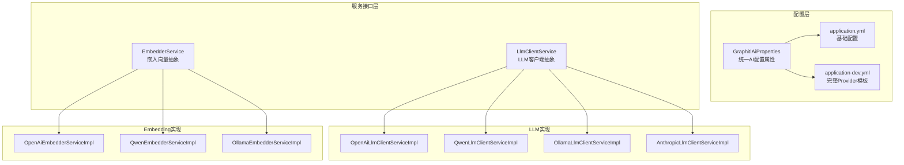
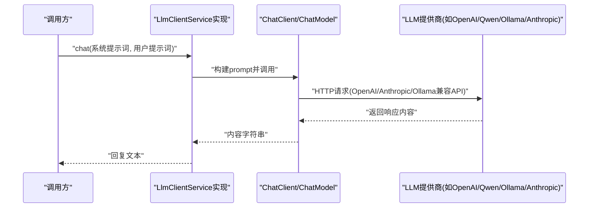
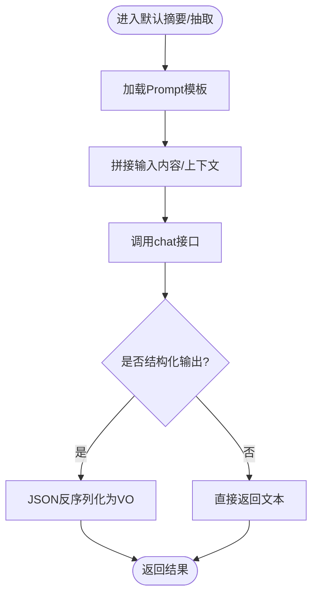
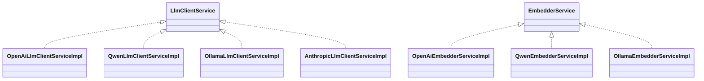

# AI提供商集成

<!--<cite>
**本文引用的文件**
- [LlmClientService.java](file://ontograph-module-core/src/main/java/com/graphiti/module/graphiti/service/LlmClientService.java)
- [EmbedderService.java](file://ontograph-module-core/src/main/java/com/graphiti/module/graphiti/service/EmbedderService.java)
- [GraphitiAiProperties.java](file://ontograph-module-core/src/main/java/com/graphiti/module/graphiti/config/GraphitiAiProperties.java)
- [OpenAiLlmClientServiceImpl.java](file://ontograph-module-core/src/main/java/com/graphiti/module/graphiti/service/impl/ai/OpenAiLlmClientServiceImpl.java)
- [QwenLlmClientServiceImpl.java](file://ontograph-module-core/src/main/java/com/graphiti/module/graphiti/service/impl/ai/QwenLlmClientServiceImpl.java)
- [OllamaLlmClientServiceImpl.java](file://ontograph-module-core/src/main/java/com/graphiti/module/graphiti/service/impl/ai/OllamaLlmClientServiceImpl.java)
- [AnthropicLlmClientServiceImpl.java](file://ontograph-module-core/src/main/java/com/graphiti/module/graphiti/service/impl/ai/AnthropicLlmClientServiceImpl.java)
- [OpenAiEmbedderServiceImpl.java](file://ontograph-module-core/src/main/java/com/graphiti/module/graphiti/service/impl/ai/OpenAiEmbedderServiceImpl.java)
- [QwenEmbedderServiceImpl.java](file://ontograph-module-core/src/main/java/com/graphiti/module/graphiti/service/impl/ai/QwenEmbedderServiceImpl.java)
- [OllamaEmbedderServiceImpl.java](file://ontograph-module-core/src/main/java/com/graphiti/module/graphiti/service/impl/ai/OllamaEmbedderServiceImpl.java)
- [application.yml](file://ontograph-server/src/main/resources/application.yml)
- [application-dev.yml](file://ontograph-server/src/main/resources/application-dev.yml)
- [ExtractEntitiesResultVO.java](file://ontograph-module-core/src/main/java/com/graphiti/module/graphiti/vo/llm/ExtractEntitiesResultVO.java)
- [ExtractRelationsResultVO.java](file://ontograph-module-core/src/main/java/com/graphiti/module/graphiti/vo/llm/ExtractRelationsResultVO.java)
</cite>-->

## 目录
1. [简介](#简介)
2. [项目结构](#项目结构)
3. [核心组件](#核心组件)
4. [架构总览](#架构总览)
5. [详细组件分析](#详细组件分析)
6. [依赖分析](#依赖分析)
7. [性能考虑](#性能考虑)
8. [故障排查指南](#故障排查指南)
9. [结论](#结论)
10. [附录](#附录)

## 简介
本文件面向Graphiti的AI提供商集成，系统性阐述如何通过统一抽象接口对接多家大语言模型（LLM）与嵌入（Embedding）服务，覆盖OpenAI、Anthropic Claude、阿里云Qwen、Ollama等主流提供商，并说明其API调用差异、参数映射、响应处理、配置管理、密钥管理、速率限制、错误处理与重试、降级策略、私有部署与本地模型支持，以及性能对比与成本分析建议。

## 项目结构
围绕AI集成的关键模块位于ontograph-module-core的服务层与配置层，采用“接口 + 多实现”的策略，结合Spring AI的OpenAI/Anthropic/Ollama适配器，实现对多提供商的透明切换。

**图表来源**
- [GraphitiAiProperties.java:1-135](file://ontograph-module-core/src/main/java/com/graphiti/module/graphiti/config/GraphitiAiProperties.java#L1-L135)
- [application.yml:1-67](file://ontograph-server/src/main/resources/application.yml#L1-L67)
- [application-dev.yml:1-676](file://ontograph-server/src/main/resources/application-dev.yml#L1-L676)
- [LlmClientService.java:1-158](file://ontograph-module-core/src/main/java/com/graphiti/module/graphiti/service/LlmClientService.java#L1-L158)
- [EmbedderService.java:1-41](file://ontograph-module-core/src/main/java/com/graphiti/module/graphiti/service/EmbedderService.java#L1-L41)
- [OpenAiLlmClientServiceImpl.java:1-111](file://ontograph-module-core/src/main/java/com/graphiti/module/graphiti/service/impl/ai/OpenAiLlmClientServiceImpl.java#L1-L111)
- [QwenLlmClientServiceImpl.java:1-98](file://ontograph-module-core/src/main/java/com/graphiti/module/graphiti/service/impl/ai/QwenLlmClientServiceImpl.java#L1-L98)
- [OllamaLlmClientServiceImpl.java:1-98](file://ontograph-module-core/src/main/java/com/graphiti/module/graphiti/service/impl/ai/OllamaLlmClientServiceImpl.java#L1-L98)
- [AnthropicLlmClientServiceImpl.java:1-112](file://ontograph-module-core/src/main/java/com/graphiti/module/graphiti/service/impl/ai/AnthropicLlmClientServiceImpl.java#L1-L112)
- [OpenAiEmbedderServiceImpl.java:1-107](file://ontograph-module-core/src/main/java/com/graphiti/module/graphiti/service/impl/ai/OpenAiEmbedderServiceImpl.java#L1-L107)
- [QwenEmbedderServiceImpl.java:1-66](file://ontograph-module-core/src/main/java/com/graphiti/module/graphiti/service/impl/ai/QwenEmbedderServiceImpl.java#L1-L66)
- [OllamaEmbedderServiceImpl.java:1-78](file://ontograph-module-core/src/main/java/com/graphiti/module/graphiti/service/impl/ai/OllamaEmbedderServiceImpl.java#L1-L78)

**章节来源**
- [application.yml:1-67](file://ontograph-server/src/main/resources/application.yml#L1-L67)
- [application-dev.yml:1-676](file://ontograph-server/src/main/resources/application-dev.yml#L1-L676)
- [GraphitiAiProperties.java:1-135](file://ontograph-module-core/src/main/java/com/graphiti/module/graphiti/config/GraphitiAiProperties.java#L1-L135)

## 核心组件
- 抽象接口
  - LlmClientService：统一LLM调用接口，支持单轮/系统提示词/结构化输出/批量调用，并内置摘要与实体/关系抽取默认实现。
  - EmbedderService：统一嵌入向量接口，支持单条与批量嵌入、维度查询与提供商标识。
- 配置中心
  - GraphitiAiProperties：集中管理LLM/Embedding/Rerank提供商选择与各Provider的模型、Base URL、温度、最大Token等参数。
- 具体实现
  - LLM：OpenAI、Qwen（OpenAI兼容）、Ollama、Anthropic（Chat Only，Embedding可选第三方）。
  - Embedding：OpenAI、Qwen（OpenAI兼容）、Ollama。
- Prompt模板
  - 内置实体/关系抽取模板，通过类路径加载，便于统一提示词管理。

**章节来源**
- [LlmClientService.java:1-158](file://ontograph-module-core/src/main/java/com/graphiti/module/graphiti/service/LlmClientService.java#L1-L158)
- [EmbedderService.java:1-41](file://ontograph-module-core/src/main/java/com/graphiti/module/graphiti/service/EmbedderService.java#L1-L41)
- [GraphitiAiProperties.java:1-135](file://ontograph-module-core/src/main/java/com/graphiti/module/graphiti/config/GraphitiAiProperties.java#L1-L135)
- [ExtractEntitiesResultVO.java:1-23](file://ontograph-module-core/src/main/java/com/graphiti/module/graphiti/vo/llm/ExtractEntitiesResultVO.java#L1-L23)
- [ExtractRelationsResultVO.java:1-23](file://ontograph-module-core/src/main/java/com/graphiti/module/graphiti/vo/llm/ExtractRelationsResultVO.java#L1-L23)

## 架构总览
Graphiti通过条件化Bean装配与Spring AI适配器，实现“统一接口 + 多Provider适配”的解耦架构。配置层决定当前使用的Provider，服务层按需注入对应实现；LLM侧以ChatClient封装调用，Embedding侧以EmbeddingModel封装向量计算。

**图表来源**
- [OpenAiLlmClientServiceImpl.java:42-68](file://ontograph-module-core/src/main/java/com/graphiti/module/graphiti/service/impl/ai/OpenAiLlmClientServiceImpl.java#L42-L68)
- [QwenLlmClientServiceImpl.java:28-55](file://ontograph-module-core/src/main/java/com/graphiti/module/graphiti/service/impl/ai/QwenLlmClientServiceImpl.java#L28-L55)
- [OllamaLlmClientServiceImpl.java:28-55](file://ontograph-module-core/src/main/java/com/graphiti/module/graphiti/service/impl/ai/OllamaLlmClientServiceImpl.java#L28-L55)
- [AnthropicLlmClientServiceImpl.java:42-69](file://ontograph-module-core/src/main/java/com/graphiti/module/graphiti/service/impl/ai/AnthropicLlmClientServiceImpl.java#L42-L69)

## 详细组件分析

### LLM客户端服务抽象与默认功能
- 统一方法族：支持纯用户提示词、带系统提示词、结构化输出（JSON解析为指定类型）、批量调用。
- 默认能力：
  - 摘要生成：对单段内容与社区节点摘要进行默认模板化摘要。
  - 实体/关系抽取：加载类路径模板，调用LLM并解析为VO对象列表。
- 错误处理：捕获异常并记录日志，必要时降级返回截断文本或空列表。

**图表来源**
- [LlmClientService.java:78-102](file://ontograph-module-core/src/main/java/com/graphiti/module/graphiti/service/LlmClientService.java#L78-L102)
- [LlmClientService.java:110-142](file://ontograph-module-core/src/main/java/com/graphiti/module/graphiti/service/LlmClientService.java#L110-L142)
- [LlmClientService.java:147-156](file://ontograph-module-core/src/main/java/com/graphiti/module/graphiti/service/LlmClientService.java#L147-L156)

**章节来源**
- [LlmClientService.java:1-158](file://ontograph-module-core/src/main/java/com/graphiti/module/graphiti/service/LlmClientService.java#L1-L158)
- [ExtractEntitiesResultVO.java:1-23](file://ontograph-module-core/src/main/java/com/graphiti/module/graphiti/vo/llm/ExtractEntitiesResultVO.java#L1-L23)
- [ExtractRelationsResultVO.java:1-23](file://ontograph-module-core/src/main/java/com/graphiti/module/graphiti/vo/llm/ExtractRelationsResultVO.java#L1-L23)

### 嵌入向量服务抽象与维度约定
- 单/批量嵌入：输入文本校验，调用EmbeddingModel，解析EmbeddingResponse。
- 维度约定：OpenAI/Qwen为1536维；Ollama示例为768维（具体以实际模型为准）。
- 错误处理：对空结果、空输出、NPE等进行明确异常与日志提示，指导检查模型类型与加载状态。

**章节来源**
- [EmbedderService.java:1-41](file://ontograph-module-core/src/main/java/com/graphiti/module/graphiti/service/EmbedderService.java#L1-L41)
- [OpenAiEmbedderServiceImpl.java:28-105](file://ontograph-module-core/src/main/java/com/graphiti/module/graphiti/service/impl/ai/OpenAiEmbedderServiceImpl.java#L28-L105)
- [QwenEmbedderServiceImpl.java:28-64](file://ontograph-module-core/src/main/java/com/graphiti/module/graphiti/service/impl/ai/QwenEmbedderServiceImpl.java#L28-L64)
- [OllamaEmbedderServiceImpl.java:28-77](file://ontograph-module-core/src/main/java/com/graphiti/module/graphiti/service/impl/ai/OllamaEmbedderServiceImpl.java#L28-L77)

### OpenAI提供商集成
- LLM：通过OpenAiChatModel与ChatClient调用，支持私有化部署（vLLM/LM Studio/LocalAI/Xinference等），通过spring.ai.openai.base-url与model/temperature等选项配置。
- Embedding：通过OpenAiEmbeddingModel调用，注意确保配置的是Embedding模型而非Rerank模型。
- 配置要点：graphiti.ai.llm-provider与embedding-provider均设为openai；同时提供spring.ai.openai.*与graphiti.ai.openai.*两套配置入口。

**章节来源**
- [OpenAiLlmClientServiceImpl.java:15-31](file://ontograph-module-core/src/main/java/com/graphiti/module/graphiti/service/impl/ai/OpenAiLlmClientServiceImpl.java#L15-L31)
- [OpenAiEmbedderServiceImpl.java:16-19](file://ontograph-module-core/src/main/java/com/graphiti/module/graphiti/service/impl/ai/OpenAiEmbedderServiceImpl.java#L16-L19)
- [application.yml:20-34](file://ontograph-server/src/main/resources/application.yml#L20-L34)
- [application-dev.yml:467-486](file://ontograph-server/src/main/resources/application-dev.yml#L467-L486)
- [GraphitiAiProperties.java:19-26](file://ontograph-module-core/src/main/java/com/graphiti/module/graphiti/config/GraphitiAiProperties.java#L19-L26)

### Qwen（通义千问）提供商集成
- LLM/Embedding：通过OpenAI兼容API调用，base-url指向DashScope兼容端点，模型名称与OpenAI一致。
- 适用场景：阿里云生态内或OpenAI兼容部署；embedding模型通常为text-embedding系列。
- 配置要点：llm-provider或embedding-provider设为qwen，填写DashScope API Key与base-url。

**章节来源**
- [QwenLlmClientServiceImpl.java:15-18](file://ontograph-module-core/src/main/java/com/graphiti/module/graphiti/service/impl/ai/QwenLlmClientServiceImpl.java#L15-L18)
- [QwenEmbedderServiceImpl.java:16-19](file://ontograph-module-core/src/main/java/com/graphiti/module/graphiti/service/impl/ai/QwenEmbedderServiceImpl.java#L16-L19)
- [application-dev.yml:76-87](file://ontograph-server/src/main/resources/application-dev.yml#L76-L87)

### Ollama提供商集成
- LLM/Embedding：分别通过OllamaChatModel与OllamaEmbeddingModel调用，依赖本地Ollama服务（默认http://localhost:11434）。
- 适用场景：本地私有部署，适合离线与隐私敏感场景；需预先拉取chat与embedding模型。
- 配置要点：llm-provider或embedding-provider设为ollama，设置base-url与模型名。

**章节来源**
- [OllamaLlmClientServiceImpl.java:15-18](file://ontograph-module-core/src/main/java/com/graphiti/module/graphiti/service/impl/ai/OllamaLlmClientServiceImpl.java#L15-L18)
- [OllamaEmbedderServiceImpl.java:16-19](file://ontograph-module-core/src/main/java/com/graphiti/module/graphiti/service/impl/ai/OllamaEmbedderServiceImpl.java#L16-L19)
- [application-dev.yml:59-69](file://ontograph-server/src/main/resources/application-dev.yml#L59-L69)

### Anthropic Claude提供商集成
- LLM：通过AnthropicChatModel与ChatClient调用，支持私有化部署（兼容Anthropic API的自建网关）。
- Embedding：Claude官方不提供Embedding/Rerank，需配合其他Provider（如OpenAI/Cohere）使用。
- 配置要点：llm-provider设为anthropic，填写API Key与base-url（可指向私有化网关）。

**章节来源**
- [AnthropicLlmClientServiceImpl.java:15-32](file://ontograph-module-core/src/main/java/com/graphiti/module/graphiti/service/impl/ai/AnthropicLlmClientServiceImpl.java#L15-L32)
- [application-dev.yml:88-103](file://ontograph-server/src/main/resources/application-dev.yml#L88-L103)

### Mistral 提供商集成
- LLM/Embedding：分别通过 `MistralAiChatModel` 与 `MistralAiEmbeddingModel` 调用；二者均有 Graphiti 适配器。
- 配置要点：将 `spring.ai.model.chat`、`spring.ai.model.embedding`、`graphiti.ai.llm-provider` 与 `graphiti.ai.embedding-provider` 都设为 `mistral`，并填写 `spring.ai.mistralai.api-key`。
- 运行时不会根据 `graphiti.ai.*` 自动推导 Spring AI 的模型选择器；这两组配置必须保持一致。

### 能力边界
- 当前具备 Graphiti 适配器的提供商是 OpenAI（含 Qwen 兼容路径）、Anthropic、Ollama 和 Mistral。
- `application-dev.yml` 中的其他厂商模板不是可直接选择的 Graphiti 适配器；在声明支持前必须实现对应的 `LlmClientService` / `EmbedderService` 并添加契约测试。

**章节来源**
- [application-dev.yml:13-461](file://ontograph-server/src/main/resources/application-dev.yml#L13-L461)
- [GraphitiAiProperties.java:33-96](file://ontograph-module-core/src/main/java/com/graphiti/module/graphiti/config/GraphitiAiProperties.java#L33-L96)

## 依赖分析
- 条件化装配：各Provider实现均使用@ConditionalOnProperty基于graphiti.ai.llm-provider或embedding-provider进行激活，避免冲突。
- Spring AI适配器：LLM侧使用ChatClient + ChatModel（OpenAI/Anthropic/Ollama），Embedding侧使用EmbeddingModel（OpenAI/Ollama）。
- 配置绑定：GraphitiAiProperties与application-dev.yml中的graphiti.ai.*形成强绑定，确保运行期参数一致性。

**图表来源**
- [LlmClientService.java:17-70](file://ontograph-module-core/src/main/java/com/graphiti/module/graphiti/service/LlmClientService.java#L17-L70)
- [EmbedderService.java:9-40](file://ontograph-module-core/src/main/java/com/graphiti/module/graphiti/service/EmbedderService.java#L9-L40)
- [OpenAiLlmClientServiceImpl.java:36](file://ontograph-module-core/src/main/java/com/graphiti/module/graphiti/service/impl/ai/OpenAiLlmClientServiceImpl.java#L36)
- [QwenLlmClientServiceImpl.java:23](file://ontograph-module-core/src/main/java/com/graphiti/module/graphiti/service/impl/ai/QwenLlmClientServiceImpl.java#L23)
- [OllamaLlmClientServiceImpl.java:23](file://ontograph-module-core/src/main/java/com/graphiti/module/graphiti/service/impl/ai/OllamaLlmClientServiceImpl.java#L23)
- [AnthropicLlmClientServiceImpl.java:37](file://ontograph-module-core/src/main/java/com/graphiti/module/graphiti/service/impl/ai/AnthropicLlmClientServiceImpl.java#L37)
- [OpenAiEmbedderServiceImpl.java:24](file://ontograph-module-core/src/main/java/com/graphiti/module/graphiti/service/impl/ai/OpenAiEmbedderServiceImpl.java#L24)
- [QwenEmbedderServiceImpl.java:25](file://ontograph-module-core/src/main/java/com/graphiti/module/graphiti/service/impl/ai/QwenEmbedderServiceImpl.java#L25)
- [OllamaEmbedderServiceImpl.java:25](file://ontograph-module-core/src/main/java/com/graphiti/module/graphiti/service/impl/ai/OllamaEmbedderServiceImpl.java#L25)

**章节来源**
- [OpenAiLlmClientServiceImpl.java:35](file://ontograph-module-core/src/main/java/com/graphiti/module/graphiti/service/impl/ai/OpenAiLlmClientServiceImpl.java#L35)
- [QwenLlmClientServiceImpl.java:22](file://ontograph-module-core/src/main/java/com/graphiti/module/graphiti/service/impl/ai/QwenLlmClientServiceImpl.java#L22)
- [OllamaLlmClientServiceImpl.java:22](file://ontograph-module-core/src/main/java/com/graphiti/module/graphiti/service/impl/ai/OllamaLlmClientServiceImpl.java#L22)
- [AnthropicLlmClientServiceImpl.java:36](file://ontograph-module-core/src/main/java/com/graphiti/module/graphiti/service/impl/ai/AnthropicLlmClientServiceImpl.java#L36)
- [OpenAiEmbedderServiceImpl.java:23](file://ontograph-module-core/src/main/java/com/graphiti/module/graphiti/service/impl/ai/OpenAiEmbedderServiceImpl.java#L23)
- [QwenEmbedderServiceImpl.java:23](file://ontograph-module-core/src/main/java/com/graphiti/module/graphiti/service/impl/ai/QwenEmbedderServiceImpl.java#L23)
- [OllamaEmbedderServiceImpl.java:23](file://ontograph-module-core/src/main/java/com/graphiti/module/graphiti/service/impl/ai/OllamaEmbedderServiceImpl.java#L23)

## 性能考虑
- 模型选择与维度
  - OpenAI/Qwen Embedding通常为1536维，Ollama常见为768维；维度越高，向量检索质量可能更好但存储与计算开销更大。
- 批量与并发
  - Embedding支持批量调用，建议在数据导入/检索前批量预嵌入，减少网络往返。
- 私有化部署
  - LM Studio/Ollama/LocalAI等本地部署可显著降低延迟与带宽成本，适合内网与低延迟场景。
- 温度与Token上限
  - 适度降低temperature提升稳定性；合理设置max-tokens避免超限与额外费用。

[本节为通用指导，无需特定文件引用]

## 故障排查指南
- 常见问题与定位
  - LLM调用异常：查看Provider实现的日志与异常抛出位置，确认API Key、Base URL、模型名与选项配置正确。
  - Embedding为空或NPE：确认使用Embedding模型而非Rerank模型；检查模型是否已加载；核对spring.ai.*与graphiti.ai.*配置一致性。
  - Ollama模型未加载：确保chat与embedding模型均已pull并可用。
- 建议流程
  - 逐项核对application-dev.yml中的Provider模板与实际启用项；
  - 在开发环境开启DEBUG日志，观察Spring AI与Graphiti日志；
  - 优先使用最小配置复现问题，再逐步增加复杂度。

**章节来源**
- [OpenAiEmbedderServiceImpl.java:34-59](file://ontograph-module-core/src/main/java/com/graphiti/module/graphiti/service/impl/ai/OpenAiEmbedderServiceImpl.java#L34-L59)
- [OllamaEmbedderServiceImpl.java:30-44](file://ontograph-module-core/src/main/java/com/graphiti/module/graphiti/service/impl/ai/OllamaEmbedderServiceImpl.java#L30-L44)
- [application-dev.yml:467-486](file://ontograph-server/src/main/resources/application-dev.yml#L467-L486)

## 结论
Graphiti通过统一抽象接口与条件化装配，实现了对OpenAI、Qwen、Ollama、Anthropic等多家LLM与Embedding提供商的无缝集成。借助完善的配置体系与错误处理机制，开发者可在云端与本地部署之间灵活切换，并针对不同场景优化性能与成本。建议在生产环境中结合监控与缓存策略，进一步提升稳定性与效率。

[本节为总结性内容，无需特定文件引用]

## 附录

### 配置管理与密钥管理
- 配置来源
  - application.yml：基础开关与全局配置。
  - application-dev.yml：完整Provider模板与示例，含OpenAI/Qwen/Ollama/Anthropic等多Provider配置。
  - GraphitiAiProperties：集中绑定graphiti.ai.*配置，支持运行期动态切换。
- 密钥与Base URL
  - OpenAI/Qwen/Ollama等均支持通过环境变量或配置文件注入API Key与Base URL，便于CI/CD与容器化部署。
- 速率限制与降级
  - 建议在网关或SDK层引入重试与退避策略；对第三方Provider，结合其SLA与配额限制制定熔断与降级预案（如回退至本地模型或简化提示词）。

**章节来源**
- [application.yml:25-34](file://ontograph-server/src/main/resources/application.yml#L25-L34)
- [application-dev.yml:1-676](file://ontograph-server/src/main/resources/application-dev.yml#L1-L676)
- [GraphitiAiProperties.java:19-96](file://ontograph-module-core/src/main/java/com/graphiti/module/graphiti/config/GraphitiAiProperties.java#L19-L96)

### 接入配置示例与最佳实践
- OpenAI（本地/私有化）
  - 在application-dev.yml中启用openai段落，设置base-url为本地或私有化地址，model与temperature按需调整。
- Qwen（DashScope兼容）
  - 设置base-url为https://dashscope.aliyuncs.com/compatible-mode/v1，填写DashScope API Key。
- Ollama
  - 设置base-url为本地Ollama服务地址，预先拉取chat与embedding模型。
- Anthropic
  - 若使用官方API，设置API Key与模型；若私有化，设置base-url为自建网关。

**章节来源**
- [application-dev.yml:13-461](file://ontograph-server/src/main/resources/application-dev.yml#L13-L461)

### 错误处理、重试与降级策略
- 错误处理
  - Provider实现统一捕获异常并记录日志；Embedding实现对空结果/NPE给出明确提示与修复建议。
- 重试与退避
  - 建议在网络抖动或第三方限流时引入指数退避重试；对非幂等操作需谨慎。
- 降级策略
  - 当第三方不可用时，可降级为本地模型（如Ollama）或简化提示词；对实体/关系抽取可采用规则引擎作为补充。

**章节来源**
- [OpenAiLlmClientServiceImpl.java:49-52](file://ontograph-module-core/src/main/java/com/graphiti/module/graphiti/service/impl/ai/OpenAiLlmClientServiceImpl.java#L49-L52)
- [OpenAiEmbedderServiceImpl.java:34-59](file://ontograph-module-core/src/main/java/com/graphiti/module/graphiti/service/impl/ai/OpenAiEmbedderServiceImpl.java#L34-L59)
- [OllamaEmbedderServiceImpl.java:30-44](file://ontograph-module-core/src/main/java/com/graphiti/module/graphiti/service/impl/ai/OllamaEmbedderServiceImpl.java#L30-L44)

### 私有部署与本地模型支持
- LM Studio/Ollama/LocalAI/Xinference等均可通过OpenAI兼容接口接入，适合内网与离线场景。
- 建议在开发环境优先使用本地部署，验证流程后再迁移至云端。

**章节来源**
- [application-dev.yml:52-228](file://ontograph-server/src/main/resources/application-dev.yml#L52-L228)

### 性能对比与成本分析指导
- 模型维度与检索质量：高维向量通常更精确但占用更多存储与内存；建议根据业务需求权衡。
- 本地vs云端：本地部署可显著降低请求延迟与带宽成本，但需评估硬件与维护成本。
- 令牌计费：对OpenAI/Qwen/Groq等按Token计费的Provider，建议优化提示词长度与结构，控制max-tokens。

[本节为通用指导，无需特定文件引用]
