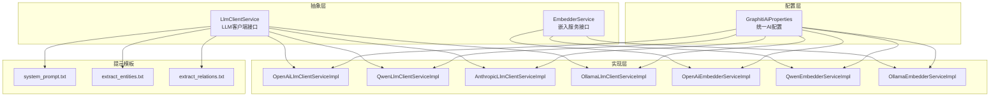
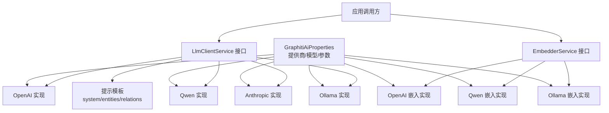
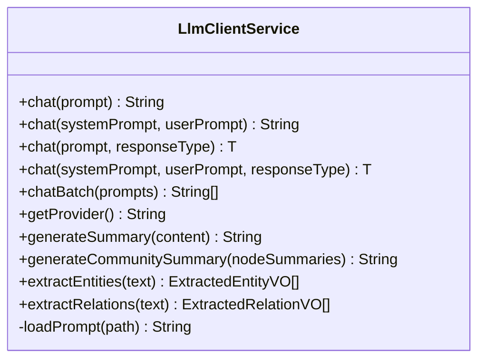
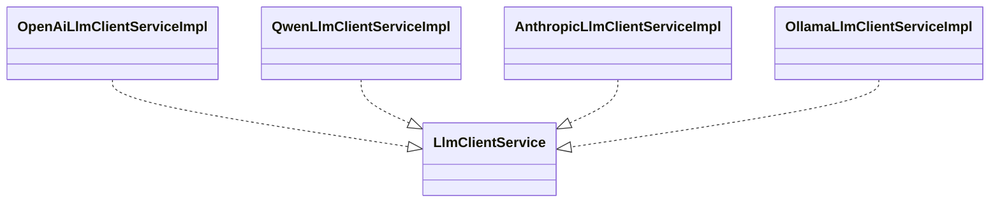
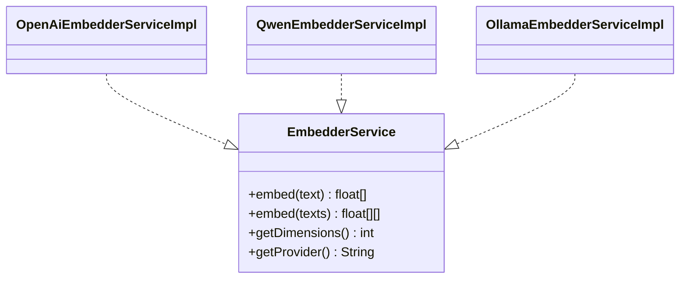
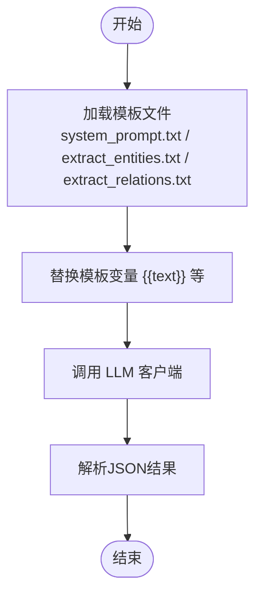
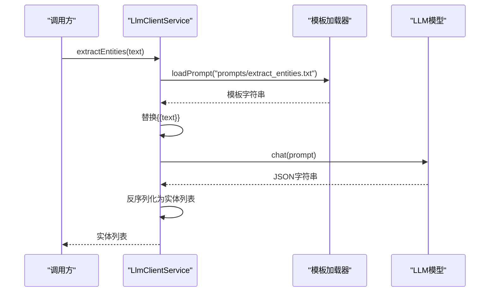
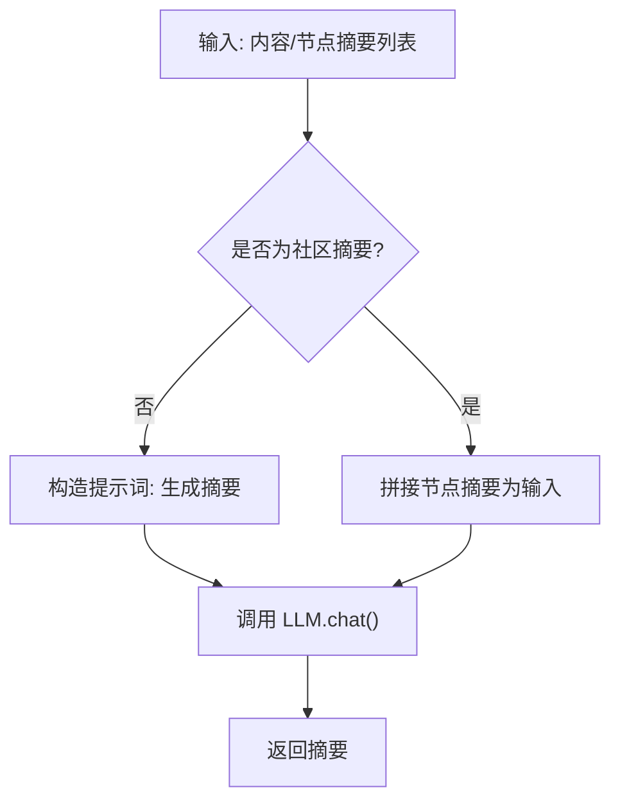
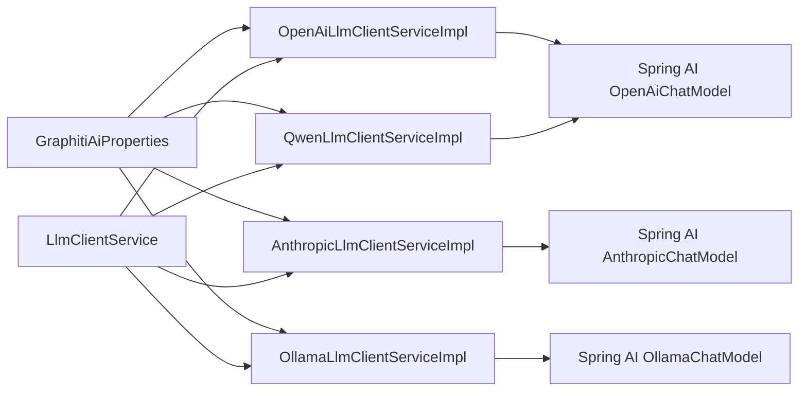

# AI集成

<!--<cite>
**本文引用的文件**
- [GraphitiAiProperties.java](file://ontograph-module-core/src/main/java/com/graphiti/module/graphiti/config/GraphitiAiProperties.java)
- [LlmClientService.java](file://ontograph-module-core/src/main/java/com/graphiti/module/graphiti/service/LlmClientService.java)
- [OpenAiLlmClientServiceImpl.java](file://ontograph-module-core/src/main/java/com/graphiti/module/graphiti/service/impl/ai/OpenAiLlmClientServiceImpl.java)
- [QwenLlmClientServiceImpl.java](file://ontograph-module-core/src/main/java/com/graphiti/module/graphiti/service/impl/ai/QwenLlmClientServiceImpl.java)
- [AnthropicLlmClientServiceImpl.java](file://ontograph-module-core/src/main/java/com/graphiti/module/graphiti/service/impl/ai/AnthropicLlmClientServiceImpl.java)
- [OllamaLlmClientServiceImpl.java](file://ontograph-module-core/src/main/java/com/graphiti/module/graphiti/service/impl/ai/OllamaLlmClientServiceImpl.java)
- [EmbedderService.java](file://ontograph-module-core/src/main/java/com/graphiti/module/graphiti/service/EmbedderService.java)
- [OpenAiEmbedderServiceImpl.java](file://ontograph-module-core/src/main/java/com/graphiti/module/graphiti/service/impl/ai/OpenAiEmbedderServiceImpl.java)
- [QwenEmbedderServiceImpl.java](file://ontograph-module-core/src/main/java/com/graphiti/module/graphiti/service/impl/ai/QwenEmbedderServiceImpl.java)
- [OllamaEmbedderServiceImpl.java](file://ontograph-module-core/src/main/java/com/graphiti/module/graphiti/service/impl/ai/OllamaEmbedderServiceImpl.java)
- [system_prompt.txt](file://ontograph-module-core/src/main/resources/prompts/system_prompt.txt)
- [extract_entities.txt](file://ontograph-module-core/src/main/resources/prompts/extract_entities.txt)
- [extract_relations.txt](file://ontograph-module-core/src/main/resources/prompts/extract_relations.txt)
</cite>-->

## 目录
1. [简介](#简介)
2. [项目结构](#项目结构)
3. [核心组件](#核心组件)
4. [架构总览](#架构总览)
5. [详细组件分析](#详细组件分析)
6. [依赖分析](#依赖分析)
7. [性能考虑](#性能考虑)
8. [故障排查指南](#故障排查指南)
9. [结论](#结论)
10. [附录](#附录)

## 简介
本文件面向AI工程师与数据科学家，系统梳理OntoGraph在AI集成方面的设计与实现，覆盖多大语言模型（LLM）提供商的抽象与接入（OpenAI、Anthropic、阿里云Qwen、Ollama等）、嵌入向量生成、提示词模板系统、实体关系抽取、以及混合检索策略中的BM25、向量相似度与图遍历融合思路。文档同时提供配置方法、私有部署支持、性能优化、成本控制与错误处理建议，并给出模型选择与实验配置方法。

## 项目结构
围绕AI能力的关键模块分布于ontograph-module-core中，主要分为三层：
- 配置层：集中管理各AI提供商的配置项与默认值
- 抽象层：定义统一的LLM客户端与嵌入服务接口
- 实现层：按提供商实现具体客户端与嵌入服务，结合Spring AI自动装配

图表来源
- [GraphitiAiProperties.java:1-135](file://ontograph-module-core/src/main/java/com/graphiti/module/graphiti/config/GraphitiAiProperties.java#L1-L135)
- [LlmClientService.java:1-158](file://ontograph-module-core/src/main/java/com/graphiti/module/graphiti/service/LlmClientService.java#L1-L158)
- [EmbedderService.java:1-41](file://ontograph-module-core/src/main/java/com/graphiti/module/graphiti/service/EmbedderService.java#L1-L41)
- [OpenAiLlmClientServiceImpl.java:1-111](file://ontograph-module-core/src/main/java/com/graphiti/module/graphiti/service/impl/ai/OpenAiLlmClientServiceImpl.java#L1-L111)
- [QwenLlmClientServiceImpl.java:1-98](file://ontograph-module-core/src/main/java/com/graphiti/module/graphiti/service/impl/ai/QwenLlmClientServiceImpl.java#L1-L98)
- [AnthropicLlmClientServiceImpl.java:1-112](file://ontograph-module-core/src/main/java/com/graphiti/module/graphiti/service/impl/ai/AnthropicLlmClientServiceImpl.java#L1-L112)
- [OllamaLlmClientServiceImpl.java:1-98](file://ontograph-module-core/src/main/java/com/graphiti/module/graphiti/service/impl/ai/OllamaLlmClientServiceImpl.java#L1-L98)
- [OpenAiEmbedderServiceImpl.java](file://ontograph-module-core/src/main/java/com/graphiti/module/graphiti/service/impl/ai/OpenAiEmbedderServiceImpl.java)
- [QwenEmbedderServiceImpl.java](file://ontograph-module-core/src/main/java/com/graphiti/module/graphiti/service/impl/ai/QwenEmbedderServiceImpl.java)
- [OllamaEmbedderServiceImpl.java](file://ontograph-module-core/src/main/java/com/graphiti/module/graphiti/service/impl/ai/OllamaEmbedderServiceImpl.java)
- [system_prompt.txt:1-11](file://ontograph-module-core/src/main/resources/prompts/system_prompt.txt#L1-L11)
- [extract_entities.txt:1-28](file://ontograph-module-core/src/main/resources/prompts/extract_entities.txt#L1-L28)
- [extract_relations.txt:1-33](file://ontograph-module-core/src/main/resources/prompts/extract_relations.txt#L1-L33)

章节来源
- [GraphitiAiProperties.java:1-135](file://ontograph-module-core/src/main/java/com/graphiti/module/graphiti/config/GraphitiAiProperties.java#L1-L135)
- [LlmClientService.java:1-158](file://ontograph-module-core/src/main/java/com/graphiti/module/graphiti/service/LlmClientService.java#L1-L158)
- [EmbedderService.java:1-41](file://ontograph-module-core/src/main/java/com/graphiti/module/graphiti/service/EmbedderService.java#L1-L41)

## 核心组件
- AI配置中心：集中管理LLM、Embedding、Rerank提供商及通用参数（模型名、基础URL、温度、最大token、Embedding/Rerank模型）
- LLM客户端抽象：统一聊天、结构化输出、批量调用、摘要生成、实体/关系抽取与提示模板加载
- 嵌入服务抽象：统一单条/批量嵌入、维度查询、提供商标识
- 提示词模板：系统提示、实体抽取、关系抽取模板，采用classpath资源加载

章节来源
- [GraphitiAiProperties.java:1-135](file://ontograph-module-core/src/main/java/com/graphiti/module/graphiti/config/GraphitiAiProperties.java#L1-L135)
- [LlmClientService.java:1-158](file://ontograph-module-core/src/main/java/com/graphiti/module/graphiti/service/LlmClientService.java#L1-L158)
- [EmbedderService.java:1-41](file://ontograph-module-core/src/main/java/com/graphiti/module/graphiti/service/EmbedderService.java#L1-L41)
- [system_prompt.txt:1-11](file://ontograph-module-core/src/main/resources/prompts/system_prompt.txt#L1-L11)
- [extract_entities.txt:1-28](file://ontograph-module-core/src/main/resources/prompts/extract_entities.txt#L1-L28)
- [extract_relations.txt:1-33](file://ontograph-module-core/src/main/resources/prompts/extract_relations.txt#L1-L33)

## 架构总览
AI集成采用“配置驱动 + 接口抽象 + 多实现”的分层架构。通过GraphitiAiProperties集中配置，结合Spring AI对OpenAI、Anthropic、Ollama等的自动装配，实现按提供商切换与私有部署支持；LlmClientService与EmbedderService分别屏蔽LLM与嵌入差异，统一对外提供能力。

图表来源
- [GraphitiAiProperties.java:1-135](file://ontograph-module-core/src/main/java/com/graphiti/module/graphiti/config/GraphitiAiProperties.java#L1-L135)
- [LlmClientService.java:1-158](file://ontograph-module-core/src/main/java/com/graphiti/module/graphiti/service/LlmClientService.java#L1-L158)
- [EmbedderService.java:1-41](file://ontograph-module-core/src/main/java/com/graphiti/module/graphiti/service/EmbedderService.java#L1-L41)
- [OpenAiLlmClientServiceImpl.java:1-111](file://ontograph-module-core/src/main/java/com/graphiti/module/graphiti/service/impl/ai/OpenAiLlmClientServiceImpl.java#L1-L111)
- [QwenLlmClientServiceImpl.java:1-98](file://ontograph-module-core/src/main/java/com/graphiti/module/graphiti/service/impl/ai/QwenLlmClientServiceImpl.java#L1-L98)
- [AnthropicLlmClientServiceImpl.java:1-112](file://ontograph-module-core/src/main/java/com/graphiti/module/graphiti/service/impl/ai/AnthropicLlmClientServiceImpl.java#L1-L112)
- [OllamaLlmClientServiceImpl.java:1-98](file://ontograph-module-core/src/main/java/com/graphiti/module/graphiti/service/impl/ai/OllamaLlmClientServiceImpl.java#L1-L98)
- [OpenAiEmbedderServiceImpl.java](file://ontograph-module-core/src/main/java/com/graphiti/module/graphiti/service/impl/ai/OpenAiEmbedderServiceImpl.java)
- [QwenEmbedderServiceImpl.java](file://ontograph-module-core/src/main/java/com/graphiti/module/graphiti/service/impl/ai/QwenEmbedderServiceImpl.java)
- [OllamaEmbedderServiceImpl.java](file://ontograph-module-core/src/main/java/com/graphiti/module/graphiti/service/impl/ai/OllamaEmbedderServiceImpl.java)
- [system_prompt.txt:1-11](file://ontograph-module-core/src/main/resources/prompts/system_prompt.txt#L1-L11)
- [extract_entities.txt:1-28](file://ontograph-module-core/src/main/resources/prompts/extract_entities.txt#L1-L28)
- [extract_relations.txt:1-33](file://ontograph-module-core/src/main/resources/prompts/extract_relations.txt#L1-L33)

## 详细组件分析

### 配置中心：GraphitiAiProperties
- 职责：集中管理AI提供商类型与各提供商的模型、基础URL、温度、最大token、Embedding/Rerank模型等
- 特性：支持默认值、参数校验、可扩展至更多提供商
- 私有部署：通过ProviderConfig.baseUrl实现对OpenAI、Anthropic、Ollama等的自定义基础地址注入

章节来源
- [GraphitiAiProperties.java:1-135](file://ontograph-module-core/src/main/java/com/graphiti/module/graphiti/config/GraphitiAiProperties.java#L1-L135)

### LLM客户端抽象：LlmClientService
- 统一接口：支持普通聊天、带系统提示词聊天、结构化输出（JSON解析）、批量聊天、摘要生成、实体/关系抽取
- 提示模板：内置模板加载器，从classpath读取system/entities/relations模板
- 错误兜底：实体/关系抽取失败时返回空列表，摘要失败时回退截断策略

图表来源
- [LlmClientService.java:1-158](file://ontograph-module-core/src/main/java/com/graphiti/module/graphiti/service/LlmClientService.java#L1-L158)

章节来源
- [LlmClientService.java:1-158](file://ontograph-module-core/src/main/java/com/graphiti/module/graphiti/service/LlmClientService.java#L1-L158)

### LLM客户端实现：OpenAI/Qwen/Anthropic/Ollama
- OpenAI：基于Spring AI OpenAiChatModel，支持私有化部署（通过spring.ai.openai.base-url）
- Qwen：使用OpenAI兼容API，复用OpenAiChatModel
- Anthropic：基于Spring AI AnthropicChatModel，支持私有化部署（通过spring.ai.anthropic.base-url）
- Ollama：基于Spring AI OllamaChatModel，依赖本地或远程Ollama服务

图表来源
- [OpenAiLlmClientServiceImpl.java:1-111](file://ontograph-module-core/src/main/java/com/graphiti/module/graphiti/service/impl/ai/OpenAiLlmClientServiceImpl.java#L1-L111)
- [QwenLlmClientServiceImpl.java:1-98](file://ontograph-module-core/src/main/java/com/graphiti/module/graphiti/service/impl/ai/QwenLlmClientServiceImpl.java#L1-L98)
- [AnthropicLlmClientServiceImpl.java:1-112](file://ontograph-module-core/src/main/java/com/graphiti/module/graphiti/service/impl/ai/AnthropicLlmClientServiceImpl.java#L1-L112)
- [OllamaLlmClientServiceImpl.java:1-98](file://ontograph-module-core/src/main/java/com/graphiti/module/graphiti/service/impl/ai/OllamaLlmClientServiceImpl.java#L1-L98)

章节来源
- [OpenAiLlmClientServiceImpl.java:1-111](file://ontograph-module-core/src/main/java/com/graphiti/module/graphiti/service/impl/ai/OpenAiLlmClientServiceImpl.java#L1-L111)
- [QwenLlmClientServiceImpl.java:1-98](file://ontograph-module-core/src/main/java/com/graphiti/module/graphiti/service/impl/ai/QwenLlmClientServiceImpl.java#L1-L98)
- [AnthropicLlmClientServiceImpl.java:1-112](file://ontograph-module-core/src/main/java/com/graphiti/module/graphiti/service/impl/ai/AnthropicLlmClientServiceImpl.java#L1-L112)
- [OllamaLlmClientServiceImpl.java:1-98](file://ontograph-module-core/src/main/java/com/graphiti/module/graphiti/service/impl/ai/OllamaLlmClientServiceImpl.java#L1-L98)

### 嵌入服务抽象与实现
- 抽象：统一embed/embedBatch/getDimensions/getProvider
- 实现：OpenAI/Qwen/Ollama嵌入实现，复用对应ChatModel的嵌入能力或通过Spring AI适配

图表来源
- [EmbedderService.java:1-41](file://ontograph-module-core/src/main/java/com/graphiti/module/graphiti/service/EmbedderService.java#L1-L41)
- [OpenAiEmbedderServiceImpl.java](file://ontograph-module-core/src/main/java/com/graphiti/module/graphiti/service/impl/ai/OpenAiEmbedderServiceImpl.java)
- [QwenEmbedderServiceImpl.java](file://ontograph-module-core/src/main/java/com/graphiti/module/graphiti/service/impl/ai/QwenEmbedderServiceImpl.java)
- [OllamaEmbedderServiceImpl.java](file://ontograph-module-core/src/main/java/com/graphiti/module/graphiti/service/impl/ai/OllamaEmbedderServiceImpl.java)

章节来源
- [EmbedderService.java:1-41](file://ontograph-module-core/src/main/java/com/graphiti/module/graphiti/service/EmbedderService.java#L1-L41)

### 提示词模板系统
- 模板位置：classpath:/prompts/*
- 模板内容：system_prompt、extract_entities、extract_relations
- 加载方式：LlmClientService内部通过ClassLoader加载，替换变量后传入LLM
- 输出约束：模板严格要求JSON格式，便于结构化抽取

图表来源
- [LlmClientService.java:147-156](file://ontograph-module-core/src/main/java/com/graphiti/module/graphiti/service/LlmClientService.java#L147-L156)
- [system_prompt.txt:1-11](file://ontograph-module-core/src/main/resources/prompts/system_prompt.txt#L1-L11)
- [extract_entities.txt:1-28](file://ontograph-module-core/src/main/resources/prompts/extract_entities.txt#L1-L28)
- [extract_relations.txt:1-33](file://ontograph-module-core/src/main/resources/prompts/extract_relations.txt#L1-L33)

章节来源
- [LlmClientService.java:110-142](file://ontograph-module-core/src/main/java/com/graphiti/module/graphiti/service/LlmClientService.java#L110-L142)
- [system_prompt.txt:1-11](file://ontograph-module-core/src/main/resources/prompts/system_prompt.txt#L1-L11)
- [extract_entities.txt:1-28](file://ontograph-module-core/src/main/resources/prompts/extract_entities.txt#L1-L28)
- [extract_relations.txt:1-33](file://ontograph-module-core/src/main/resources/prompts/extract_relations.txt#L1-L33)

### 实体/关系抽取流程
- 输入：原始文本
- 步骤：加载对应模板 -> 替换变量 -> LLM结构化输出 -> 反序列化为VO列表
- 异常：失败时返回空列表，保证上层流程不中断

图表来源
- [LlmClientService.java:110-122](file://ontograph-module-core/src/main/java/com/graphiti/module/graphiti/service/LlmClientService.java#L110-L122)
- [extract_entities.txt:1-28](file://ontograph-module-core/src/main/resources/prompts/extract_entities.txt#L1-L28)

章节来源
- [LlmClientService.java:110-142](file://ontograph-module-core/src/main/java/com/graphiti/module/graphiti/service/LlmClientService.java#L110-L142)

### 摘要生成流程
- 单摘要：直接调用chat生成
- 社区摘要：拼接节点摘要后调用chat生成

图表来源
- [LlmClientService.java:78-102](file://ontograph-module-core/src/main/java/com/graphiti/module/graphiti/service/LlmClientService.java#L78-L102)

章节来源
- [LlmClientService.java:78-102](file://ontograph-module-core/src/main/java/com/graphiti/module/graphiti/service/LlmClientService.java#L78-L102)

## 依赖分析
- 组件耦合：实现类均依赖Spring AI提供的ChatModel（OpenAiChatModel、AnthropicChatModel、OllamaChatModel），并通过条件注解按提供商启用
- 配置耦合：GraphitiAiProperties作为单一事实源，被各实现类通过Spring配置间接使用
- 模板耦合：LlmClientService与提示模板强耦合，模板变更直接影响抽取质量
- 外部依赖：OpenAI、Anthropic、Ollama等外部API或私有化服务的可用性与稳定性

图表来源
- [GraphitiAiProperties.java:1-135](file://ontograph-module-core/src/main/java/com/graphiti/module/graphiti/config/GraphitiAiProperties.java#L1-L135)
- [OpenAiLlmClientServiceImpl.java:1-111](file://ontograph-module-core/src/main/java/com/graphiti/module/graphiti/service/impl/ai/OpenAiLlmClientServiceImpl.java#L1-L111)
- [QwenLlmClientServiceImpl.java:1-98](file://ontograph-module-core/src/main/java/com/graphiti/module/graphiti/service/impl/ai/QwenLlmClientServiceImpl.java#L1-L98)
- [AnthropicLlmClientServiceImpl.java:1-112](file://ontograph-module-core/src/main/java/com/graphiti/module/graphiti/service/impl/ai/AnthropicLlmClientServiceImpl.java#L1-L112)
- [OllamaLlmClientServiceImpl.java:1-98](file://ontograph-module-core/src/main/java/com/graphiti/module/graphiti/service/impl/ai/OllamaLlmClientServiceImpl.java#L1-L98)
- [LlmClientService.java:1-158](file://ontograph-module-core/src/main/java/com/graphiti/module/graphiti/service/LlmClientService.java#L1-L158)

章节来源
- [GraphitiAiProperties.java:1-135](file://ontograph-module-core/src/main/java/com/graphiti/module/graphiti/config/GraphitiAiProperties.java#L1-L135)
- [LlmClientService.java:1-158](file://ontograph-module-core/src/main/java/com/graphiti/module/graphiti/service/LlmClientService.java#L1-L158)

## 性能考虑
- 批量调用：优先使用chatBatch减少网络往返
- 温度与maxTokens：根据任务稳定性与成本权衡调整，抽取任务建议较低温度
- 嵌入维度：统一维度便于后续向量检索与相似度计算
- 私有化部署：通过baseUrl直连vLLM/LM Studio/LocalAI/Ollama，降低延迟与带宽成本
- 缓存策略：对高频提示词与固定模板结果进行缓存（需结合业务场景评估）

## 故障排查指南
- LLM调用异常：检查提供商开关与API密钥、基础URL配置；查看实现类日志输出
- 结构化输出失败：确认模板输出严格JSON格式；捕获异常并回退为空列表
- 实体/关系抽取失败：核对模板变量替换、上下文长度限制与maxTokens设置
- 嵌入服务异常：确认嵌入模型名称与维度一致；检查网络连通性（私有部署）

章节来源
- [OpenAiLlmClientServiceImpl.java:49-52](file://ontograph-module-core/src/main/java/com/graphiti/module/graphiti/service/impl/ai/OpenAiLlmClientServiceImpl.java#L49-L52)
- [QwenLlmClientServiceImpl.java:36-39](file://ontograph-module-core/src/main/java/com/graphiti/module/graphiti/service/impl/ai/QwenLlmClientServiceImpl.java#L36-L39)
- [AnthropicLlmClientServiceImpl.java:50-53](file://ontograph-module-core/src/main/java/com/graphiti/module/graphiti/service/impl/ai/AnthropicLlmClientServiceImpl.java#L50-L53)
- [OllamaLlmClientServiceImpl.java:36-39](file://ontograph-module-core/src/main/java/com/graphiti/module/graphiti/service/impl/ai/OllamaLlmClientServiceImpl.java#L36-L39)
- [LlmClientService.java:118-122](file://ontograph-module-core/src/main/java/com/graphiti/module/graphiti/service/LlmClientService.java#L118-L122)

## 结论
OntoGraph通过配置中心、接口抽象与多实现的分层设计，实现了对多家LLM提供商与嵌入服务的统一接入与灵活切换。结合提示模板系统与实体/关系抽取能力，满足知识图谱构建中的信息抽取需求。通过私有化部署与批量调用等手段，可在性能与成本之间取得平衡。建议在生产环境中完善监控与告警、建立模板版本管理与灰度发布机制，持续优化模型选择与参数配置。

## 附录
- 模型选择建议
  - 开源/私有化：Ollama本地模型，低成本低延迟
  - 云端稳定：OpenAI/Groq等，适合高吞吐与高质量
  - 中文场景：Qwen，生态完善
  - 安全隔离：Anthropic私有化部署，合规可控
- 实验配置方法
  - 在GraphitiAiProperties中切换llmProvider/embeddingProvider
  - 通过ProviderConfig.baseUrl配置私有化地址
  - 使用chatBatch与合理maxTokens进行A/B测试
- 混合搜索策略（概念性说明）
  - BM25：基于关键词匹配，快速召回
  - 向量相似度：基于嵌入向量的语义近似
  - 图遍历：基于知识图谱的路径扩展与证据聚合
  - 融合策略：加权打分、重排序与上下文感知融合（需结合具体检索管线实现）