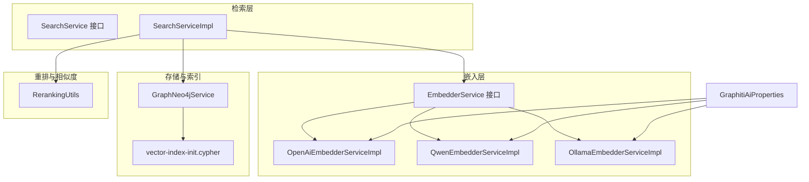
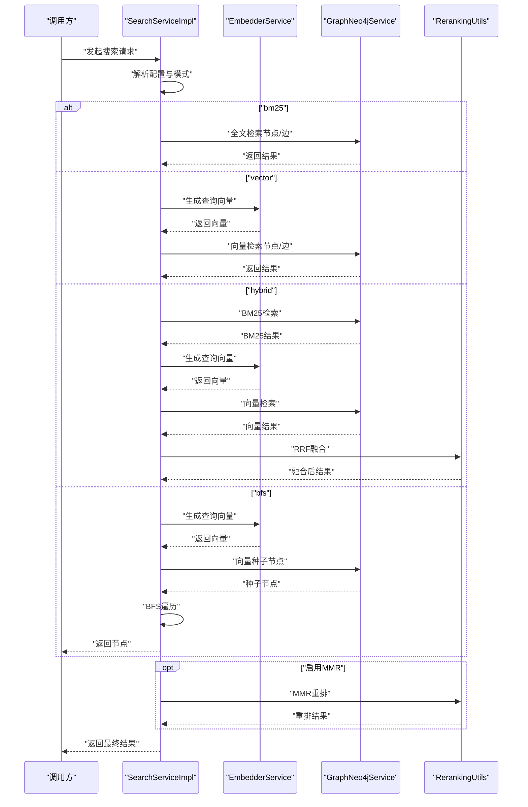
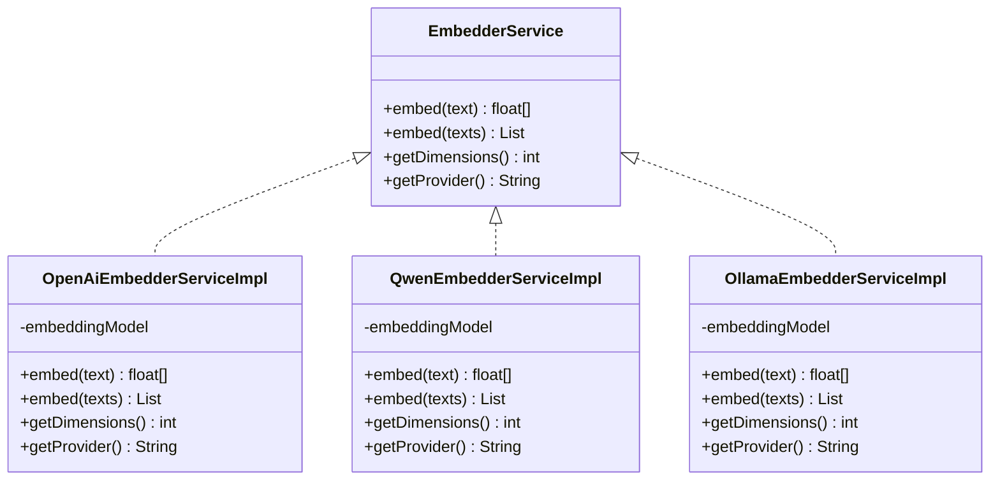
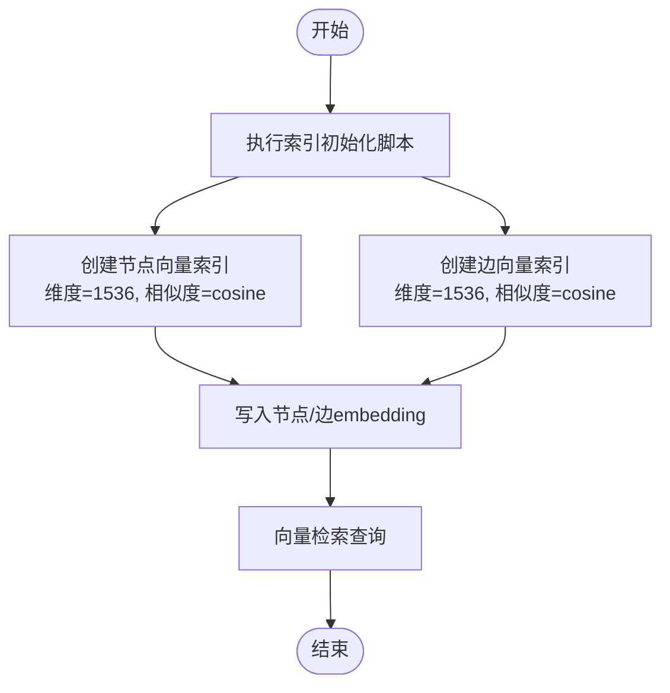
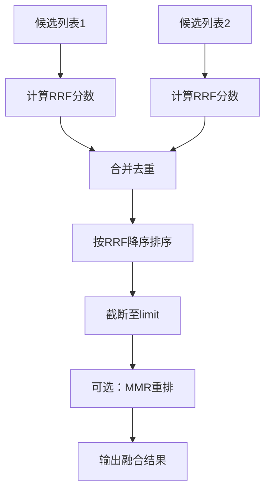
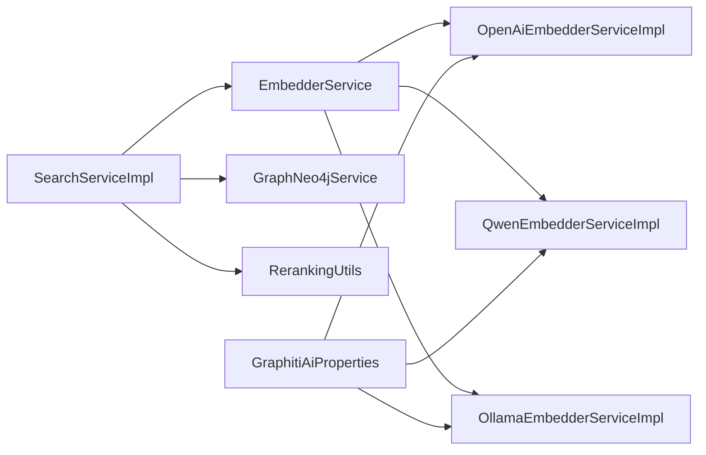

# 向量嵌入系统

<!--<cite>
**本文引用的文件**
- [EmbedderService.java](file://graphiti-module-core/src/main/java/com/graphiti/module/graphiti/service/EmbedderService.java)
- [OpenAiEmbedderServiceImpl.java](file://graphiti-module-core/src/main/java/com/graphiti/module/graphiti/service/impl/ai/OpenAiEmbedderServiceImpl.java)
- [QwenEmbedderServiceImpl.java](file://graphiti-module-core/src/main/java/com/graphiti/module/graphiti/service/impl/ai/QwenEmbedderServiceImpl.java)
- [OllamaEmbedderServiceImpl.java](file://graphiti-module-core/src/main/java/com/graphiti/module/graphiti/service/impl/ai/OllamaEmbedderServiceImpl.java)
- [GraphitiAiProperties.java](file://graphiti-module-core/src/main/java/com/graphiti/module/graphiti/config/GraphitiAiProperties.java)
- [SearchService.java](file://graphiti-module-core/src/main/java/com/graphiti/module/graphiti/service/SearchService.java)
- [SearchServiceImpl.java](file://graphiti-module-core/src/main/java/com/graphiti/module/graphiti/service/impl/SearchServiceImpl.java)
- [GraphNeo4jService.java](file://graphiti-module-core/src/main/java/com/graphiti/module/graphiti/service/GraphNeo4jService.java)
- [vector-index-init.cypher](file://sql/neo4j/vector-index-init.cypher)
- [RerankingUtils.java](file://graphiti-module-core/src/main/java/com/graphiti/module/graphiti/util/RerankingUtils.java)
- [StringNormalizer.java](file://graphiti-module-core/src/main/java/com/graphiti/module/graphiti/util/StringNormalizer.java)
</cite>-->

## 目录
1. [简介](#简介)
2. [项目结构](#项目结构)
3. [核心组件](#核心组件)
4. [架构总览](#架构总览)
5. [详细组件分析](#详细组件分析)
6. [依赖关系分析](#依赖关系分析)
7. [性能考量](#性能考量)
8. [故障排查指南](#故障排查指南)
9. [结论](#结论)
10. [附录](#附录)

## 简介
本文件面向Graphiti的向量嵌入系统，系统性阐述从文本预处理、嵌入维度管理、批量处理优化，到统一抽象接口设计、向量存储与索引、相似度计算、检索融合与重排序、缓存与内存管理、混合搜索权重调整，以及可视化与调试工具的使用方法。目标是帮助开发者与运维人员快速理解并高效使用Graphiti的向量检索能力。

## 项目结构
围绕向量嵌入与检索的关键模块如下：
- 抽象接口与实现：EmbedderService及其OpenAI/Qwen/Ollama实现
- 配置：GraphitiAiProperties集中管理各提供商参数
- 检索：SearchService/SearchServiceImpl实现混合检索（BM25、向量、BFS、RRF、MMR）
- 存储与索引：GraphNeo4jService封装Neo4j向量/全文索引查询与写入
- 重排与相似度：RerankingUtils提供RRF、MMR、节点距离与提及次数重排
- 工具：StringNormalizer用于字符串规范化

**图表来源**
- [EmbedderService.java:1-41](file://graphiti-module-core/src/main/java/com/graphiti/module/graphiti/service/EmbedderService.java#L1-L41)
- [OpenAiEmbedderServiceImpl.java:1-107](file://graphiti-module-core/src/main/java/com/graphiti/module/graphiti/service/impl/ai/OpenAiEmbedderServiceImpl.java#L1-L107)
- [QwenEmbedderServiceImpl.java:1-66](file://graphiti-module-core/src/main/java/com/graphiti/module/graphiti/service/impl/ai/QwenEmbedderServiceImpl.java#L1-L66)
- [OllamaEmbedderServiceImpl.java:1-78](file://graphiti-module-core/src/main/java/com/graphiti/module/graphiti/service/impl/ai/OllamaEmbedderServiceImpl.java#L1-L78)
- [SearchService.java:1-54](file://graphiti-module-core/src/main/java/com/graphiti/module/graphiti/service/SearchService.java#L1-L54)
- [SearchServiceImpl.java:1-520](file://graphiti-module-core/src/main/java/com/graphiti/module/graphiti/service/impl/SearchServiceImpl.java#L1-L520)
- [GraphNeo4jService.java:1-800](file://graphiti-module-core/src/main/java/com/graphiti/module/graphiti/service/GraphNeo4jService.java#L1-L800)
- [vector-index-init.cypher:1-27](file://sql/neo4j/vector-index-init.cypher#L1-L27)
- [RerankingUtils.java:1-386](file://graphiti-module-core/src/main/java/com/graphiti/module/graphiti/util/RerankingUtils.java#L1-L386)
- [GraphitiAiProperties.java:1-135](file://graphiti-module-core/src/main/java/com/graphiti/module/graphiti/config/GraphitiAiProperties.java#L1-L135)

**章节来源**
- [EmbedderService.java:1-41](file://graphiti-module-core/src/main/java/com/graphiti/module/graphiti/service/EmbedderService.java#L1-L41)
- [SearchService.java:1-54](file://graphiti-module-core/src/main/java/com/graphiti/module/graphiti/service/SearchService.java#L1-L54)
- [GraphNeo4jService.java:608-791](file://graphiti-module-core/src/main/java/com/graphiti/module/graphiti/service/GraphNeo4jService.java#L608-L791)
- [vector-index-init.cypher:1-27](file://sql/neo4j/vector-index-init.cypher#L1-L27)

## 核心组件
- 统一嵌入接口：EmbedderService定义单条与批量嵌入、维度查询与提供商标识
- 多提供商实现：OpenAI、Qwen、Ollama均实现EmbedderService，屏蔽差异
- 检索编排：SearchServiceImpl按模式（bm25/vector/hybrid/bfs）组合多种策略
- 存储与索引：GraphNeo4jService封装向量/全文索引查询与写入，并提供索引初始化
- 重排与相似度：RerankingUtils提供RRF、MMR、节点距离与提及次数重排
- 配置中心：GraphitiAiProperties集中管理各提供商模型、URL、温度、最大token等

**章节来源**
- [EmbedderService.java:9-40](file://graphiti-module-core/src/main/java/com/graphiti/module/graphiti/service/EmbedderService.java#L9-L40)
- [OpenAiEmbedderServiceImpl.java:24-106](file://graphiti-module-core/src/main/java/com/graphiti/module/graphiti/service/impl/ai/OpenAiEmbedderServiceImpl.java#L24-L106)
- [QwenEmbedderServiceImpl.java:24-65](file://graphiti-module-core/src/main/java/com/graphiti/module/graphiti/service/impl/ai/QwenEmbedderServiceImpl.java#L24-L65)
- [OllamaEmbedderServiceImpl.java:24-77](file://graphiti-module-core/src/main/java/com/graphiti/module/graphiti/service/impl/ai/OllamaEmbedderServiceImpl.java#L24-L77)
- [SearchServiceImpl.java:94-148](file://graphiti-module-core/src/main/java/com/graphiti/module/graphiti/service/impl/SearchServiceImpl.java#L94-L148)
- [GraphNeo4jService.java:699-762](file://graphiti-module-core/src/main/java/com/graphiti/module/graphiti/service/GraphNeo4jService.java#L699-L762)
- [RerankingUtils.java:32-86](file://graphiti-module-core/src/main/java/com/graphiti/module/graphiti/util/RerankingUtils.java#L32-L86)
- [GraphitiAiProperties.java:16-134](file://graphiti-module-core/src/main/java/com/graphiti/module/graphiti/config/GraphitiAiProperties.java#L16-L134)

## 架构总览
下图展示从查询到向量检索、融合与重排的整体流程：

**图表来源**
- [SearchServiceImpl.java:94-148](file://graphiti-module-core/src/main/java/com/graphiti/module/graphiti/service/impl/SearchServiceImpl.java#L94-L148)
- [SearchServiceImpl.java:164-174](file://graphiti-module-core/src/main/java/com/graphiti/module/graphiti/service/impl/SearchServiceImpl.java#L164-L174)
- [SearchServiceImpl.java:227-284](file://graphiti-module-core/src/main/java/com/graphiti/module/graphiti/service/impl/SearchServiceImpl.java#L227-L284)
- [SearchServiceImpl.java:288-308](file://graphiti-module-core/src/main/java/com/graphiti/module/graphiti/service/impl/SearchServiceImpl.java#L288-L308)
- [RerankingUtils.java:47-86](file://graphiti-module-core/src/main/java/com/graphiti/module/graphiti/util/RerankingUtils.java#L47-L86)
- [RerankingUtils.java:106-174](file://graphiti-module-core/src/main/java/com/graphiti/module/graphiti/util/RerankingUtils.java#L106-L174)

## 详细组件分析

### 统一嵌入接口与多提供商实现
- 接口职责：单条/批量嵌入、维度查询、提供商名称
- OpenAI实现：基于Spring AI OpenAiEmbeddingModel，支持单条/批量，异常处理明确
- Qwen实现：兼容OpenAI API风格，复用OpenAiEmbeddingModel
- Ollama实现：基于Spring AI OllamaEmbeddingModel，支持单条/批量

**图表来源**
- [EmbedderService.java:9-40](file://graphiti-module-core/src/main/java/com/graphiti/module/graphiti/service/EmbedderService.java#L9-L40)
- [OpenAiEmbedderServiceImpl.java:24-106](file://graphiti-module-core/src/main/java/com/graphiti/module/graphiti/service/impl/ai/OpenAiEmbedderServiceImpl.java#L24-L106)
- [QwenEmbedderServiceImpl.java:24-65](file://graphiti-module-core/src/main/java/com/graphiti/module/graphiti/service/impl/ai/QwenEmbedderServiceImpl.java#L24-L65)
- [OllamaEmbedderServiceImpl.java:24-77](file://graphiti-module-core/src/main/java/com/graphiti/module/graphiti/service/impl/ai/OllamaEmbedderServiceImpl.java#L24-L77)

**章节来源**
- [EmbedderService.java:9-40](file://graphiti-module-core/src/main/java/com/graphiti/module/graphiti/service/EmbedderService.java#L9-L40)
- [OpenAiEmbedderServiceImpl.java:28-105](file://graphiti-module-core/src/main/java/com/graphiti/module/graphiti/service/impl/ai/OpenAiEmbedderServiceImpl.java#L28-L105)
- [QwenEmbedderServiceImpl.java:28-64](file://graphiti-module-core/src/main/java/com/graphiti/module/graphiti/service/impl/ai/QwenEmbedderServiceImpl.java#L28-L64)
- [OllamaEmbedderServiceImpl.java:28-76](file://graphiti-module-core/src/main/java/com/graphiti/module/graphiti/service/impl/ai/OllamaEmbedderServiceImpl.java#L28-L76)

### 文本预处理与规范化
- 字符串规范化：StringNormalizer提供精确规范化、熵计算、长度与熵阈值判断，支撑去重与模糊匹配前置处理
- 建议实践：在生成嵌入前对输入文本进行清洗与归一化，提升嵌入一致性与检索稳定性

**章节来源**
- [StringNormalizer.java:11-80](file://graphiti-module-core/src/main/java/com/graphiti/module/graphiti/util/StringNormalizer.java#L11-L80)

### 嵌入维度管理与批量处理优化
- 维度管理：各实现报告固定维度（如OpenAI/Qwen常见1536，Ollama常见768），SearchServiceImpl直接调用接口获取维度
- 批量优化：OpenAI/Qwen/Ollama实现均支持批量嵌入，减少网络往返；异常路径包含空结果校验与日志提示
- 配置驱动：GraphitiAiProperties集中管理提供商模型名、基础URL、温度、最大token等，便于切换与私有化部署

**章节来源**
- [OpenAiEmbedderServiceImpl.java:97-105](file://graphiti-module-core/src/main/java/com/graphiti/module/graphiti/service/impl/ai/OpenAiEmbedderServiceImpl.java#L97-L105)
- [QwenEmbedderServiceImpl.java:56-64](file://graphiti-module-core/src/main/java/com/graphiti/module/graphiti/service/impl/ai/QwenEmbedderServiceImpl.java#L56-L64)
- [OllamaEmbedderServiceImpl.java:68-76](file://graphiti-module-core/src/main/java/com/graphiti/module/graphiti/service/impl/ai/OllamaEmbedderServiceImpl.java#L68-L76)
- [GraphitiAiProperties.java:101-133](file://graphiti-module-core/src/main/java/com/graphiti/module/graphiti/config/GraphitiAiProperties.java#L101-L133)

### 向量存储策略与索引构建
- 存储字段：节点与关系均保存embedding向量字段；写入时转换为Neo4j驱动接受的List<Float>
- 索引初始化：提供Cypher脚本创建节点/边向量索引，设置维度与相似度函数（默认余弦）
- 查询接口：提供向量检索节点/边的原生查询封装，返回相似度分数

**图表来源**
- [vector-index-init.cypher:4-18](file://sql/neo4j/vector-index-init.cypher#L4-L18)
- [GraphNeo4jService.java:699-762](file://graphiti-module-core/src/main/java/com/graphiti/module/graphiti/service/GraphNeo4jService.java#L699-L762)
- [GraphNeo4jService.java:768-791](file://graphiti-module-core/src/main/java/com/graphiti/module/graphiti/service/GraphNeo4jService.java#L768-L791)

**章节来源**
- [GraphNeo4jService.java:41-189](file://graphiti-module-core/src/main/java/com/graphiti/module/graphiti/service/GraphNeo4jService.java#L41-L189)
- [GraphNeo4jService.java:699-762](file://graphiti-module-core/src/main/java/com/graphiti/module/graphiti/service/GraphNeo4jService.java#L699-L762)
- [vector-index-init.cypher:4-18](file://sql/neo4j/vector-index-init.cypher#L4-L18)

### 相似度计算与重排策略
- 相似度：GraphNeo4jService通过Neo4j向量索引返回相似度分数；RerankingUtils提供余弦相似度计算
- RRF融合：SearchServiceImpl对BM25与向量结果进行倒数排名融合，支持k参数调节
- MMR重排：SearchServiceImpl可启用基于文本相似度的MMR重排，平衡相关性与多样性
- 节点距离与提及次数：提供基于图距离与Episode提及次数的二次重排

**图表来源**
- [SearchServiceImpl.java:227-284](file://graphiti-module-core/src/main/java/com/graphiti/module/graphiti/service/impl/SearchServiceImpl.java#L227-L284)
- [RerankingUtils.java:47-86](file://graphiti-module-core/src/main/java/com/graphiti/module/graphiti/util/RerankingUtils.java#L47-L86)
- [RerankingUtils.java:188-254](file://graphiti-module-core/src/main/java/com/graphiti/module/graphiti/util/RerankingUtils.java#L188-L254)

**章节来源**
- [SearchServiceImpl.java:227-308](file://graphiti-module-core/src/main/java/com/graphiti/module/graphiti/service/impl/SearchServiceImpl.java#L227-L308)
- [RerankingUtils.java:321-341](file://graphiti-module-core/src/main/java/com/graphiti/module/graphiti/util/RerankingUtils.java#L321-L341)

### 检索算法与过滤机制
- 模式选择：bm25、vector、hybrid（BM25+向量+RRF）、bfs（基于向量种子的图遍历）
- 过滤与分页：GraphNeo4jService提供节点/边的过滤与分页查询
- BFS细节：以向量检索结果作为种子节点，按深度与邻居上限进行遍历

**章节来源**
- [SearchServiceImpl.java:94-148](file://graphiti-module-core/src/main/java/com/graphiti/module/graphiti/service/impl/SearchServiceImpl.java#L94-L148)
- [SearchServiceImpl.java:178-223](file://graphiti-module-core/src/main/java/com/graphiti/module/graphiti/service/impl/SearchServiceImpl.java#L178-L223)
- [GraphNeo4jService.java:247-292](file://graphiti-module-core/src/main/java/com/graphiti/module/graphiti/service/GraphNeo4jService.java#L247-L292)

### 缓存策略与内存管理
- 嵌入缓存：建议在应用层对热点查询文本建立LRU缓存，避免重复调用EmbedderService
- 批量批处理：优先使用批量接口，减少网络开销；控制批次大小以平衡延迟与吞吐
- 向量序列化：写入Neo4j前转换为List<Float>，注意内存占用与GC压力
- 结果缓存：对稳定知识库的检索结果可做短期缓存，结合版本号或时间戳失效

[本节为通用实践建议，不直接分析具体文件]

### 混合搜索中的权重调整
- RRF参数k：影响不同来源结果的融合强度，默认值在工具类中定义
- MMR参数lambda：平衡相关性与多样性，0表示只考虑多样性，1表示只考虑相关性
- 模式权重：可通过配置开关与参数微调不同模式的贡献度

**章节来源**
- [RerankingUtils.java:21-28](file://graphiti-module-core/src/main/java/com/graphiti/module/graphiti/util/RerankingUtils.java#L21-L28)
- [SearchServiceImpl.java:119-123](file://graphiti-module-core/src/main/java/com/graphiti/module/graphiti/service/impl/SearchServiceImpl.java#L119-L123)
- [SearchServiceImpl.java:138-139](file://graphiti-module-core/src/main/java/com/graphiti/module/graphiti/service/impl/SearchServiceImpl.java#L138-L139)

### 可视化与调试工具使用
- 日志定位：各嵌入实现均记录详细错误日志，便于定位模型未加载、API返回空等问题
- 索引验证：通过Cypher脚本检查向量索引是否存在，确保向量检索可用
- 结果核验：使用GraphNeo4jService的向量检索接口返回相似度分数，辅助评估嵌入质量
- 配置核验：通过GraphitiAiProperties确认提供商、模型、URL等配置正确

**章节来源**
- [OpenAiEmbedderServiceImpl.java:33-60](file://graphiti-module-core/src/main/java/com/graphiti/module/graphiti/service/impl/ai/OpenAiEmbedderServiceImpl.java#L33-L60)
- [vector-index-init.cypher:4-18](file://sql/neo4j/vector-index-init.cypher#L4-L18)
- [GraphNeo4jService.java:699-762](file://graphiti-module-core/src/main/java/com/graphiti/module/graphiti/service/GraphNeo4jService.java#L699-L762)
- [GraphitiAiProperties.java:16-134](file://graphiti-module-core/src/main/java/com/graphiti/module/graphiti/config/GraphitiAiProperties.java#L16-L134)

## 依赖关系分析
- 接口与实现解耦：EmbedderService隔离不同提供商差异
- 检索编排：SearchServiceImpl依赖EmbedderService与GraphNeo4jService，形成清晰的编排层
- 工具复用：RerankingUtils被SearchServiceImpl广泛使用
- 配置注入：GraphitiAiProperties通过条件注解驱动具体实现加载

**图表来源**
- [EmbedderService.java:9-40](file://graphiti-module-core/src/main/java/com/graphiti/module/graphiti/service/EmbedderService.java#L9-L40)
- [OpenAiEmbedderServiceImpl.java:24-106](file://graphiti-module-core/src/main/java/com/graphiti/module/graphiti/service/impl/ai/OpenAiEmbedderServiceImpl.java#L24-L106)
- [QwenEmbedderServiceImpl.java:24-65](file://graphiti-module-core/src/main/java/com/graphiti/module/graphiti/service/impl/ai/QwenEmbedderServiceImpl.java#L24-L65)
- [OllamaEmbedderServiceImpl.java:24-77](file://graphiti-module-core/src/main/java/com/graphiti/module/graphiti/service/impl/ai/OllamaEmbedderServiceImpl.java#L24-L77)
- [SearchServiceImpl.java:23-24](file://graphiti-module-core/src/main/java/com/graphiti/module/graphiti/service/impl/SearchServiceImpl.java#L23-L24)
- [GraphNeo4jService.java:23-24](file://graphiti-module-core/src/main/java/com/graphiti/module/graphiti/service/GraphNeo4jService.java#L23-L24)
- [RerankingUtils.java:1-18](file://graphiti-module-core/src/main/java/com/graphiti/module/graphiti/util/RerankingUtils.java#L1-L18)
- [GraphitiAiProperties.java:16-134](file://graphiti-module-core/src/main/java/com/graphiti/module/graphiti/config/GraphitiAiProperties.java#L16-L134)

**章节来源**
- [SearchServiceImpl.java:23-24](file://graphiti-module-core/src/main/java/com/graphiti/module/graphiti/service/impl/SearchServiceImpl.java#L23-L24)
- [GraphNeo4jService.java:23-24](file://graphiti-module-core/src/main/java/com/graphiti/module/graphiti/service/GraphNeo4jService.java#L23-L24)

## 性能考量
- 嵌入性能
  - 优先使用批量接口，降低网络往返
  - 控制批次大小，避免超时或内存峰值过高
  - 对热点文本做本地缓存
- 索引与查询
  - 确保向量索引与维度一致，避免运行时错误
  - 合理设置limit，避免全表扫描
- 重排成本
  - RRF融合成本低，MMR重排需计算相似度矩阵，应限制候选规模
- 内存管理
  - 注意float[]与List<Float>转换的内存开销
  - 对大规模检索结果进行流式处理或分页

[本节提供通用指导，不直接分析具体文件]

## 故障排查指南
- 嵌入为空或null
  - 检查模型是否为嵌入模型而非重排模型
  - 确认模型已在本地服务中加载
  - 核对配置中的模型名与base-url
- 向量检索无结果
  - 确认向量索引已创建且维度匹配
  - 检查group_id过滤条件
- RRF/MMR结果异常
  - 调整k与lambda参数
  - 检查候选集规模与相似度阈值
- 日志定位
  - OpenAI实现记录详细的失败原因与排查建议

**章节来源**
- [OpenAiEmbedderServiceImpl.java:33-60](file://graphiti-module-core/src/main/java/com/graphiti/module/graphiti/service/impl/ai/OpenAiEmbedderServiceImpl.java#L33-L60)
- [OpenAiEmbedderServiceImpl.java:71-94](file://graphiti-module-core/src/main/java/com/graphiti/module/graphiti/service/impl/ai/OpenAiEmbedderServiceImpl.java#L71-L94)
- [vector-index-init.cypher:4-18](file://sql/neo4j/vector-index-init.cypher#L4-L18)
- [GraphNeo4jService.java:699-762](file://graphiti-module-core/src/main/java/com/graphiti/module/graphiti/service/GraphNeo4jService.java#L699-L762)

## 结论
Graphiti的向量嵌入系统通过统一抽象接口屏蔽多提供商差异，结合Neo4j向量索引与混合检索策略，实现了高可用、高性能的知识检索能力。通过合理的维度管理、批量处理、重排与缓存策略，可在不同场景下取得稳定的检索效果。建议在生产环境中配合完善的监控与日志体系，持续优化参数与策略。

## 附录
- 配置要点：提供商、模型名、base-url、温度、最大token
- 索引初始化：确保节点与边向量索引存在且维度一致
- 检索模式：根据需求选择bm25/vector/hybrid/bfs，并结合RRF/MMR进行融合与重排

**章节来源**
- [GraphitiAiProperties.java:16-134](file://graphiti-module-core/src/main/java/com/graphiti/module/graphiti/config/GraphitiAiProperties.java#L16-L134)
- [vector-index-init.cypher:4-18](file://sql/neo4j/vector-index-init.cypher#L4-L18)
- [SearchServiceImpl.java:94-148](file://graphiti-module-core/src/main/java/com/graphiti/module/graphiti/service/impl/SearchServiceImpl.java#L94-L148)