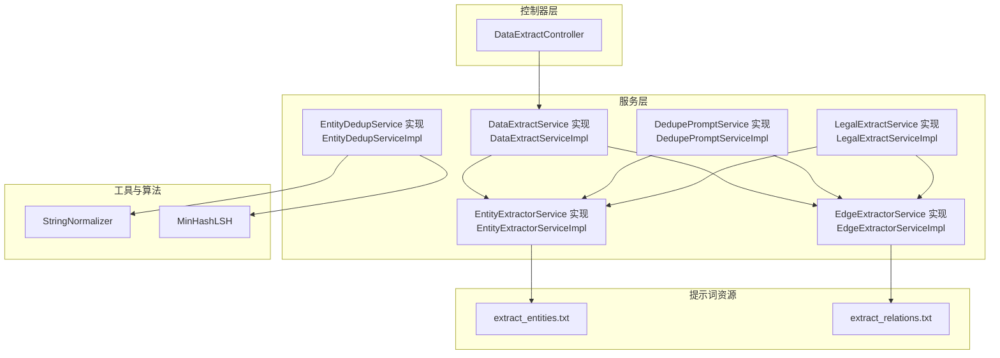
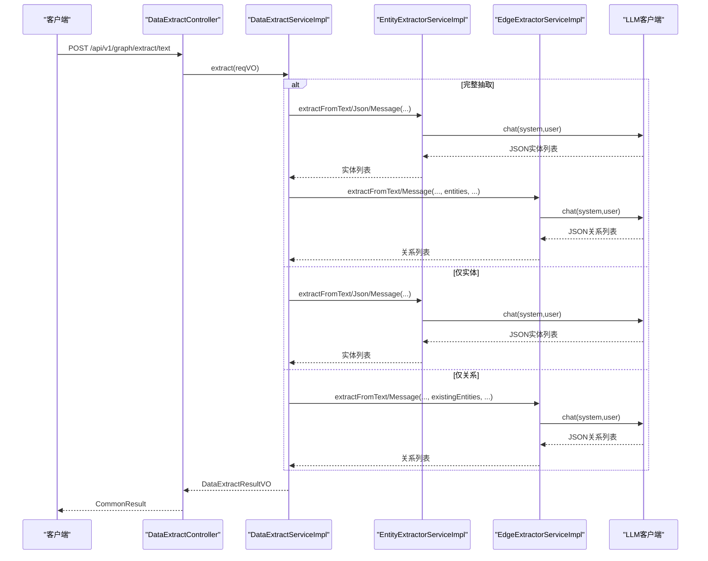
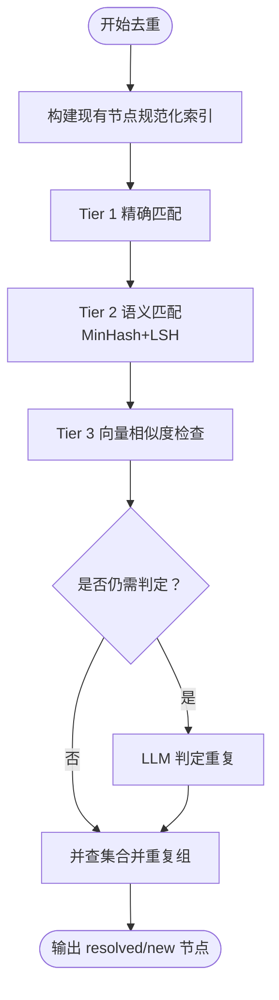
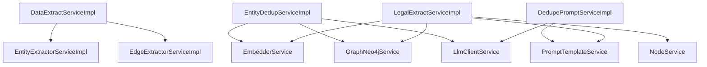

# 实体关系抽取

<!--<cite>
**本文引用的文件**
- [DataExtractServiceImpl.java](file://ontograph-module-core/src/main/java/com/graphiti/module/graphiti/service/impl/DataExtractServiceImpl.java)
- [EntityExtractorServiceImpl.java](file://ontograph-module-core/src/main/java/com/graphiti/module/graphiti/service/impl/EntityExtractorServiceImpl.java)
- [EdgeExtractorServiceImpl.java](file://ontograph-module-core/src/main/java/com/graphiti/module/graphiti/service/impl/EdgeExtractorServiceImpl.java)
- [EntityDedupServiceImpl.java](file://ontograph-module-core/src/main/java/com/graphiti/module/graphiti/service/impl/EntityDedupServiceImpl.java)
- [DedupePromptServiceImpl.java](file://ontograph-module-core/src/main/java/com/graphiti/module/graphiti/service/impl/DedupePromptServiceImpl.java)
- [LegalExtractServiceImpl.java](file://ontograph-module-core/src/main/java/com/graphiti/module/graphiti/service/impl/LegalExtractServiceImpl.java)
- [DataExtractController.java](file://ontograph-module-core/src/main/java/com/graphiti/module/graphiti/controller/admin/DataExtractController.java)
- [DataExtractService.java](file://ontograph-module-core/src/main/java/com/graphiti/module/graphiti/service/DataExtractService.java)
- [EntityExtractorService.java](file://ontograph-module-core/src/main/java/com/graphiti/module/graphiti/service/EntityExtractorService.java)
- [EdgeExtractorService.java](file://ontograph-module-core/src/main/java/com/graphiti/module/graphiti/service/EdgeExtractorService.java)
- [EntityDedupService.java](file://ontograph-module-core/src/main/java/com/graphiti/module/graphiti/service/EntityDedupService.java)
- [StringNormalizer.java](file://ontograph-module-core/src/main/java/com/graphiti/module/graphiti/util/StringNormalizer.java)
- [MinHashLSH.java](file://ontograph-module-core/src/main/java/com/graphiti/module/graphiti/util/MinHashLSH.java)
- [extract_entities.txt](file://ontograph-module-core/src/main/resources/prompts/extract_entities.txt)
- [extract_relations.txt](file://ontograph-module-core/src/main/resources/prompts/extract_relations.txt)
</cite>-->

## 目录
1. [简介](#简介)
2. [项目结构](#项目结构)
3. [核心组件](#核心组件)
4. [架构总览](#架构总览)
5. [详细组件分析](#详细组件分析)
6. [依赖分析](#依赖分析)
7. [性能考虑](#性能考虑)
8. [故障排查指南](#故障排查指南)
9. [结论](#结论)
10. [附录](#附录)

## 简介
本文件面向“实体关系抽取”子系统，系统性梳理基于大语言模型（LLM）的实体识别与关系提取实现，覆盖预处理流程、提示工程、规则与机器学习结合策略、实体去重（精确匹配、模糊匹配、语义相似度）、质量评估与置信度评分、性能优化与批处理、结果验证与人工审核、跨数据类型与领域适配、以及监控与持续改进方法。文档以代码为依据，辅以可视化图示，帮助开发者与非技术读者共同理解与使用该系统。

## 项目结构
本系统围绕“抽取服务层”展开，主要模块包括：
- 控制器层：对外暴露抽取接口，支持文本、JSON、仅实体/关系提取、类型配置与预览等能力
- 服务层：数据抽取编排、实体提取、关系提取、实体去重、提示词去重、法律知识图谱抽取
- 工具与算法层：字符串规范化、MinHash+LSH、并查集（Union-Find）
- 提示词资源：抽取实体与关系的标准提示词模板

图表来源
- [DataExtractController.java:31-279](file://ontograph-module-core/src/main/java/com/graphiti/module/graphiti/controller/admin/DataExtractController.java#L31-L279)
- [DataExtractServiceImpl.java:34-97](file://ontograph-module-core/src/main/java/com/graphiti/module/graphiti/service/impl/DataExtractServiceImpl.java#L34-L97)
- [EntityExtractorServiceImpl.java:26-95](file://ontograph-module-core/src/main/java/com/graphiti/module/graphiti/service/impl/EntityExtractorServiceImpl.java#L26-L95)
- [EdgeExtractorServiceImpl.java:26-89](file://ontograph-module-core/src/main/java/com/graphiti/module/graphiti/service/impl/EdgeExtractorServiceImpl.java#L26-L89)
- [EntityDedupServiceImpl.java:41-172](file://ontograph-module-core/src/main/java/com/graphiti/module/graphiti/service/impl/EntityDedupServiceImpl.java#L41-L172)
- [DedupePromptServiceImpl.java:31-165](file://ontograph-module-core/src/main/java/com/graphiti/module/graphiti/service/impl/DedupePromptServiceImpl.java#L31-L165)
- [LegalExtractServiceImpl.java:22-122](file://ontograph-module-core/src/main/java/com/graphiti/module/graphiti/service/impl/LegalExtractServiceImpl.java#L22-L122)
- [StringNormalizer.java:7-82](file://ontograph-module-core/src/main/java/com/graphiti/module/graphiti/util/StringNormalizer.java#L7-L82)
- [MinHashLSH.java:18-196](file://ontograph-module-core/src/main/java/com/graphiti/module/graphiti/util/MinHashLSH.java#L18-L196)
- [extract_entities.txt:1-28](file://ontograph-module-core/src/main/resources/prompts/extract_entities.txt#L1-L28)
- [extract_relations.txt:1-33](file://ontograph-module-core/src/main/resources/prompts/extract_relations.txt#L1-L33)

章节来源
- [DataExtractController.java:31-279](file://ontograph-module-core/src/main/java/com/graphiti/module/graphiti/controller/admin/DataExtractController.java#L31-L279)
- [DataExtractServiceImpl.java:34-97](file://ontograph-module-core/src/main/java/com/graphiti/module/graphiti/service/impl/DataExtractServiceImpl.java#L34-L97)

## 核心组件
- 数据抽取编排器：负责根据输入数据源类型与模式（完整/仅实体/仅关系），协调实体与关系抽取服务，聚合统计与耗时信息
- 实体提取器：面向文本、JSON、消息流，构建系统/用户提示词，调用LLM并解析结构化结果；支持模板化提示词
- 关系提取器：基于已提取实体集合，构建关系提示词，调用LLM并解析结构化结果；支持模板化提示词
- 实体去重器：三层策略（精确匹配→语义匹配→LLM判定），结合向量相似度与MinHash+LSH
- 提示词去重器：基于模板化提示词，实现节点/边的去重判定与解析
- 法律抽取器：面向法律JSON数据，支持模板化提示词与导入流程，自动构建节点与关系
- 控制器：提供REST接口，支持文件上传、类型配置、默认类型枚举、JSON预览等

章节来源
- [DataExtractServiceImpl.java:34-97](file://ontograph-module-core/src/main/java/com/graphiti/module/graphiti/service/impl/DataExtractServiceImpl.java#L34-L97)
- [EntityExtractorServiceImpl.java:26-95](file://ontograph-module-core/src/main/java/com/graphiti/module/graphiti/service/impl/EntityExtractorServiceImpl.java#L26-L95)
- [EdgeExtractorServiceImpl.java:26-89](file://ontograph-module-core/src/main/java/com/graphiti/module/graphiti/service/impl/EdgeExtractorServiceImpl.java#L26-L89)
- [EntityDedupServiceImpl.java:41-172](file://ontograph-module-core/src/main/java/com/graphiti/module/graphiti/service/impl/EntityDedupServiceImpl.java#L41-L172)
- [DedupePromptServiceImpl.java:31-165](file://ontograph-module-core/src/main/java/com/graphiti/module/graphiti/service/impl/DedupePromptServiceImpl.java#L31-L165)
- [LegalExtractServiceImpl.java:22-122](file://ontograph-module-core/src/main/java/com/graphiti/module/graphiti/service/impl/LegalExtractServiceImpl.java#L22-L122)
- [DataExtractController.java:31-279](file://ontograph-module-core/src/main/java/com/graphiti/module/graphiti/controller/admin/DataExtractController.java#L31-L279)

## 架构总览
系统采用“控制器-服务-提示词-LLM”的分层架构，实体与关系抽取均通过提示词模板驱动LLM输出结构化JSON，再由解析器统一抽取实体/关系列表。去重阶段引入多层策略与向量化相似度，确保高质量与高效率。

图表来源
- [DataExtractController.java:48-136](file://ontograph-module-core/src/main/java/com/graphiti/module/graphiti/controller/admin/DataExtractController.java#L48-L136)
- [DataExtractServiceImpl.java:44-97](file://ontograph-module-core/src/main/java/com/graphiti/module/graphiti/service/impl/DataExtractServiceImpl.java#L44-L97)
- [EntityExtractorServiceImpl.java:52-95](file://ontograph-module-core/src/main/java/com/graphiti/module/graphiti/service/impl/EntityExtractorServiceImpl.java#L52-L95)
- [EdgeExtractorServiceImpl.java:58-89](file://ontograph-module-core/src/main/java/com/graphiti/module/graphiti/service/impl/EdgeExtractorServiceImpl.java#L58-L89)

## 详细组件分析

### 数据抽取编排器（DataExtractServiceImpl）
- 功能要点
  - 支持三种模式：完整抽取（实体+关系）、仅实体、仅关系
  - 根据数据源类型（text/json/message）选择不同提取入口
  - 统计实体/关系类型分布，记录耗时与错误
  - 将历史episodes转换为Map列表，注入提示词上下文
- 流程控制
  - 仅关系模式要求提供existingEntities
  - 仅实体模式直接调用实体提取器
  - 完整模式先实体后关系，并将实体列表传递给关系提取器

章节来源
- [DataExtractServiceImpl.java:44-97](file://ontograph-module-core/src/main/java/com/graphiti/module/graphiti/service/impl/DataExtractServiceImpl.java#L44-L97)
- [DataExtractServiceImpl.java:153-188](file://ontograph-module-core/src/main/java/com/graphiti/module/graphiti/service/impl/DataExtractServiceImpl.java#L153-L188)

### 实体提取器（EntityExtractorServiceImpl）
- 功能要点
  - 默认实体类型定义（Person/Organization/Location/Event/Concept/Product/Document/Entity）
  - 支持文本、JSON、消息三种输入，分别构建提示词
  - 模板化提取：按sourceType拼接模板编码，回退到默认模板
  - 响应解析：优先解析标准JSON，失败时尝试纯文本解析
  - 输出包含name、entity_type、summary、episode_indices、confidence等字段
- 提示词构建
  - 系统提示词包含提取规则与类型定义
  - 用户提示词包含上下文（历史消息/JSON内容/文本）

章节来源
- [EntityExtractorServiceImpl.java:36-48](file://ontograph-module-core/src/main/java/com/graphiti/module/graphiti/service/impl/EntityExtractorServiceImpl.java#L36-L48)
- [EntityExtractorServiceImpl.java:52-95](file://ontograph-module-core/src/main/java/com/graphiti/module/graphiti/service/impl/EntityExtractorServiceImpl.java#L52-L95)
- [EntityExtractorServiceImpl.java:99-128](file://ontograph-module-core/src/main/java/com/graphiti/module/graphiti/service/impl/EntityExtractorServiceImpl.java#L99-L128)
- [EntityExtractorServiceImpl.java:132-196](file://ontograph-module-core/src/main/java/com/graphiti/module/graphiti/service/impl/EntityExtractorServiceImpl.java#L132-L196)
- [EntityExtractorServiceImpl.java:200-283](file://ontograph-module-core/src/main/java/com/graphiti/module/graphiti/service/impl/EntityExtractorServiceImpl.java#L200-L283)
- [EntityExtractorServiceImpl.java:285-304](file://ontograph-module-core/src/main/java/com/graphiti/module/graphiti/service/impl/EntityExtractorServiceImpl.java#L285-L304)

### 关系提取器（EdgeExtractorServiceImpl）
- 功能要点
  - 默认关系类型定义（WORKS_AT/LIVES_IN/KNOWS/…）
  - 支持文本、消息两种输入，基于实体列表构建关系提示词
  - 模板化提取：按sourceType拼接模板编码，回退到默认模板
  - 响应解析：校验实体名称存在性与自环，解析valid_at/invalid_at时间字段
  - 输出包含source_entity_name、target_entity_name、relation_type、fact、attributes、episode_indices、confidence等
- 提示词构建
  - 系统提示词包含关系提取规则与类型定义
  - 用户提示词包含实体列表、参考时间、历史消息（可选）

章节来源
- [EdgeExtractorServiceImpl.java:36-54](file://ontograph-module-core/src/main/java/com/graphiti/module/graphiti/service/impl/EdgeExtractorServiceImpl.java#L36-L54)
- [EdgeExtractorServiceImpl.java:58-89](file://ontograph-module-core/src/main/java/com/graphiti/module/graphiti/service/impl/EdgeExtractorServiceImpl.java#L58-L89)
- [EdgeExtractorServiceImpl.java:93-124](file://ontograph-module-core/src/main/java/com/graphiti/module/graphiti/service/impl/EdgeExtractorServiceImpl.java#L93-L124)
- [EdgeExtractorServiceImpl.java:128-210](file://ontograph-module-core/src/main/java/com/graphiti/module/graphiti/service/impl/EdgeExtractorServiceImpl.java#L128-L210)
- [EdgeExtractorServiceImpl.java:231-282](file://ontograph-module-core/src/main/java/com/graphiti/module/graphiti/service/impl/EdgeExtractorServiceImpl.java#L231-L282)
- [EdgeExtractorServiceImpl.java:341-360](file://ontograph-module-core/src/main/java/com/graphiti/module/graphiti/service/impl/EdgeExtractorServiceImpl.java#L341-L360)

### 实体去重器（EntityDedupServiceImpl）
- 三层策略
  - Tier 1：精确匹配（StringNormalizer.normalizeExact + 规范化索引）
  - Tier 2：语义匹配（MinHash + LSH，Jaccard相似度≥0.9）
  - Tier 3：LLM判定（向量余弦相似度≥0.6，必要时交由LLM确认）
- 关键算法
  - 字符串规范化：小写化、多余空白合并
  - MinHash+LSH：32个签名、4位band、8 bands，Jaccard阈值0.9
  - 余弦相似度：向量嵌入对比，阈值0.6
  - 并查集（Union-Find）：合并重复组，保留每组首元素
- 输出
  - resolvedNodes（映射到现有节点）、newNodes（待创建）、uuidMapping（名称→UUID映射）、统计信息

图表来源
- [EntityDedupServiceImpl.java:54-172](file://ontograph-module-core/src/main/java/com/graphiti/module/graphiti/service/impl/EntityDedupServiceImpl.java#L54-L172)
- [StringNormalizer.java:18-80](file://ontograph-module-core/src/main/java/com/graphiti/module/graphiti/util/StringNormalizer.java#L18-L80)
- [MinHashLSH.java:103-119](file://ontograph-module-core/src/main/java/com/graphiti/module/graphiti/util/MinHashLSH.java#L103-L119)
- [EntityDedupServiceImpl.java:376-396](file://ontograph-module-core/src/main/java/com/graphiti/module/graphiti/service/impl/EntityDedupServiceImpl.java#L376-L396)

章节来源
- [EntityDedupServiceImpl.java:41-172](file://ontograph-module-core/src/main/java/com/graphiti/module/graphiti/service/impl/EntityDedupServiceImpl.java#L41-L172)
- [StringNormalizer.java:7-82](file://ontograph-module-core/src/main/java/com/graphiti/module/graphiti/util/StringNormalizer.java#L7-L82)
- [MinHashLSH.java:18-196](file://ontograph-module-core/src/main/java/com/graphiti/module/graphiti/util/MinHashLSH.java#L18-L196)

### 提示词去重器（DedupePromptServiceImpl）
- 功能要点
  - 单实体去重、批量实体去重、节点分组去重、边去重
  - 基于模板化提示词，调用LLM并解析JSON响应
  - 支持将节点/边事实转换为统一格式，便于LLM判断
- 适用场景
  - 在实体/关系入库前进行人工审核与冲突消解

章节来源
- [DedupePromptServiceImpl.java:31-165](file://ontograph-module-core/src/main/java/com/graphiti/module/graphiti/service/impl/DedupePromptServiceImpl.java#L31-L165)
- [DedupePromptServiceImpl.java:202-258](file://ontograph-module-core/src/main/java/com/graphiti/module/graphiti/service/impl/DedupePromptServiceImpl.java#L202-L258)

### 法律抽取器（LegalExtractServiceImpl）
- 功能要点
  - 面向法律JSON数据，支持模板化提示词与默认提示词
  - 从JSON中按字段映射提取内容，构建用户提示词
  - 解析LLM返回的JSON，构建节点与关系导入
  - 支持模板切换与全链路导入（提取→导入）
- 导入流程
  - 逐类节点导入（Case/Party/Court/Judge/LegalProvision/Lawyer/Evidence/JudgmentDocument）
  - 构建边（如CASE_PARTY/CASE_COURT/CASE_JUDGE），并计算向量嵌入

章节来源
- [LegalExtractServiceImpl.java:22-122](file://ontograph-module-core/src/main/java/com/graphiti/module/graphiti/service/impl/LegalExtractServiceImpl.java#L22-L122)
- [LegalExtractServiceImpl.java:127-164](file://ontograph-module-core/src/main/java/com/graphiti/module/graphiti/service/impl/LegalExtractServiceImpl.java#L127-L164)
- [LegalExtractServiceImpl.java:166-206](file://ontograph-module-core/src/main/java/com/graphiti/module/graphiti/service/impl/LegalExtractServiceImpl.java#L166-L206)
- [LegalExtractServiceImpl.java:208-388](file://ontograph-module-core/src/main/java/com/graphiti/module/graphiti/service/impl/LegalExtractServiceImpl.java#L208-L388)
- [LegalExtractServiceImpl.java:390-736](file://ontograph-module-core/src/main/java/com/graphiti/module/graphiti/service/impl/LegalExtractServiceImpl.java#L390-L736)
- [LegalExtractServiceImpl.java:740-793](file://ontograph-module-core/src/main/java/com/graphiti/module/graphiti/service/impl/LegalExtractServiceImpl.java#L740-L793)

### 控制器（DataExtractController）
- 功能要点
  - 提供文本/JSON抽取、仅实体/仅关系抽取、类型配置查询、JSON预览等接口
  - 支持文件上传与参数化配置（实体类型、关系类型、自定义指令）
- 接口设计
  - /api/v1/graph/extract/text：完整抽取
  - /api/v1/graph/extract/json：JSON文件抽取
  - /api/v1/graph/extract/entities：仅实体
  - /api/v1/graph/extract/edges：仅关系（需existingEntities）
  - /api/v1/graph/extract/entity-types、/api/v1/graph/extract/edge-types：默认类型枚举

章节来源
- [DataExtractController.java:48-136](file://ontograph-module-core/src/main/java/com/graphiti/module/graphiti/controller/admin/DataExtractController.java#L48-L136)
- [DataExtractController.java:164-186](file://ontograph-module-core/src/main/java/com/graphiti/module/graphiti/controller/admin/DataExtractController.java#L164-L186)
- [DataExtractController.java:189-247](file://ontograph-module-core/src/main/java/com/graphiti/module/graphiti/controller/admin/DataExtractController.java#L189-L247)

## 依赖分析
- 组件耦合
  - DataExtractServiceImpl依赖EntityExtractorService与EdgeExtractorService，形成编排层
  - EntityDedupServiceImpl依赖GraphNeo4jService/EmbedderService/LlmClientService，形成去重层
  - DedupePromptServiceImpl依赖PromptTemplateService与LlmClientService，形成提示词去重层
  - LegalExtractServiceImpl依赖NodeService/GraphNeo4jService/EmbedderService/PromptTemplateService，形成法律抽取层
- 外部依赖
  - LLM客户端：统一chat接口，屏蔽不同供应商差异
  - 提示词模板：支持动态渲染与回退策略
  - 嵌入服务：用于向量相似度计算
  - Neo4j服务：节点与关系的持久化

图表来源
- [DataExtractServiceImpl.java:39-41](file://ontograph-module-core/src/main/java/com/graphiti/module/graphiti/service/impl/DataExtractServiceImpl.java#L39-L41)
- [EntityDedupServiceImpl.java:43-45](file://ontograph-module-core/src/main/java/com/graphiti/module/graphiti/service/impl/EntityDedupServiceImpl.java#L43-L45)
- [DedupePromptServiceImpl.java:33-35](file://ontograph-module-core/src/main/java/com/graphiti/module/graphiti/service/impl/DedupePromptServiceImpl.java#L33-L35)
- [LegalExtractServiceImpl.java:24-29](file://ontograph-module-core/src/main/java/com/graphiti/module/graphiti/service/impl/LegalExtractServiceImpl.java#L24-L29)

章节来源
- [DataExtractServiceImpl.java:39-41](file://ontograph-module-core/src/main/java/com/graphiti/module/graphiti/service/impl/DataExtractServiceImpl.java#L39-L41)
- [EntityDedupServiceImpl.java:43-45](file://ontograph-module-core/src/main/java/com/graphiti/module/graphiti/service/impl/EntityDedupServiceImpl.java#L43-L45)
- [DedupePromptServiceImpl.java:33-35](file://ontograph-module-core/src/main/java/com/graphiti/module/graphiti/service/impl/DedupePromptServiceImpl.java#L33-L35)
- [LegalExtractServiceImpl.java:24-29](file://ontograph-module-core/src/main/java/com/graphiti/module/graphiti/service/impl/LegalExtractServiceImpl.java#L24-L29)

## 性能考虑
- 批处理与并发
  - 控制器层支持批量文件上传与参数化配置，建议在上层实现队列与异步处理
  - 实体/关系提取器内部按输入切片处理，避免超长文本导致LLM超时
- 去重优化
  - MinHash+LSH在大规模实体时显著降低候选集规模，建议限制候选上限（如15）
  - 向量相似度仅在模糊匹配后触发，减少LLM调用次数
- 缓存与复用
  - 历史episodes序列化缓存，避免重复构造提示词
  - 提示词模板渲染结果可缓存（模板未变更时）
- I/O与网络
  - 嵌入服务与LLM调用建议设置合理的超时与重试策略
  - 导入阶段建议批量写入，减少事务开销

[本节为通用指导，无需列出章节来源]

## 故障排查指南
- 实体/关系解析失败
  - 现象：响应非标准JSON，解析异常
  - 处理：实体/关系解析器会尝试从响应中提取JSON代码块或普通对象；若仍失败，回退到纯文本解析
- 仅关系抽取报错
  - 现象：缺少existingEntities
  - 处理：先调用“仅实体”接口获取实体列表，再调用“仅关系”
- 法律抽取失败
  - 现象：模板未启用或渲染失败
  - 处理：回退到默认提示词；检查字段映射与JSON结构
- 去重失败
  - 现象：LLM去重失败或解析异常
  - 处理：记录错误并返回原始列表，避免阻塞主流程

章节来源
- [EntityExtractorServiceImpl.java:200-225](file://ontograph-module-core/src/main/java/com/graphiti/module/graphiti/service/impl/EntityExtractorServiceImpl.java#L200-L225)
- [EdgeExtractorServiceImpl.java:231-282](file://ontograph-module-core/src/main/java/com/graphiti/module/graphiti/service/impl/EdgeExtractorServiceImpl.java#L231-L282)
- [DataExtractController.java:129-135](file://ontograph-module-core/src/main/java/com/graphiti/module/graphiti/controller/admin/DataExtractController.java#L129-L135)
- [LegalExtractServiceImpl.java:127-164](file://ontograph-module-core/src/main/java/com/graphiti/module/graphiti/service/impl/LegalExtractServiceImpl.java#L127-L164)
- [DedupePromptServiceImpl.java:268-311](file://ontograph-module-core/src/main/java/com/graphiti/module/graphiti/service/impl/DedupePromptServiceImpl.java#L268-L311)

## 结论
本系统以“提示词+LLM+结构化解析+多层去重”为核心，实现了对多源数据（文本、JSON、消息）的实体与关系抽取，并提供了法律领域的专用流程。通过精确匹配、模糊匹配与语义相似度相结合的去重策略，兼顾了准确性与性能。建议在生产环境中配合异步队列、缓存与可观测性体系，持续优化提示词与阈值，提升抽取质量与稳定性。

[本节为总结性内容，无需列出章节来源]

## 附录

### 抽取流程与提示词模板
- 实体抽取提示词模板：extract_entities.txt
- 关系抽取提示词模板：extract_relations.txt
- 模板渲染：根据sourceType（text/json/message）选择对应模板编码，若无特定模板则回退默认

章节来源
- [extract_entities.txt:1-28](file://ontograph-module-core/src/main/resources/prompts/extract_entities.txt#L1-L28)
- [extract_relations.txt:1-33](file://ontograph-module-core/src/main/resources/prompts/extract_relations.txt#L1-L33)
- [EntityExtractorServiceImpl.java:100-128](file://ontograph-module-core/src/main/java/com/graphiti/module/graphiti/service/impl/EntityExtractorServiceImpl.java#L100-L128)
- [EdgeExtractorServiceImpl.java:94-124](file://ontograph-module-core/src/main/java/com/graphiti/module/graphiti/service/impl/EdgeExtractorServiceImpl.java#L94-L124)

### 质量评估与置信度评分机制
- 置信度字段
  - 实体/关系解析器在响应中可携带confidence字段，解析器将其映射到VO对象
- 评估建议
  - 建议在提示词中要求LLM输出confidence或理由，便于后续阈值筛选与人工复核
  - 对低置信度样本建立标注与回归训练计划

章节来源
- [EntityExtractorServiceImpl.java:214-215](file://ontograph-module-core/src/main/java/com/graphiti/module/graphiti/service/impl/EntityExtractorServiceImpl.java#L214-L215)
- [EdgeExtractorServiceImpl.java:267-268](file://ontograph-module-core/src/main/java/com/graphiti/module/graphiti/service/impl/EdgeExtractorServiceImpl.java#L267-L268)

### 跨数据类型与领域适配
- 文本/JSON/消息：通过sourceType路由至不同提取入口，支持自定义指令与类型配置
- 法律领域：提供专用模板与导入流程，自动构建节点与关系
- 建议
  - 针对新领域定制提示词模板与类型定义
  - 引入领域本体约束与校验

章节来源
- [DataExtractServiceImpl.java:162-187](file://ontograph-module-core/src/main/java/com/graphiti/module/graphiti/service/impl/DataExtractServiceImpl.java#L162-L187)
- [LegalExtractServiceImpl.java:127-164](file://ontograph-module-core/src/main/java/com/graphiti/module/graphiti/service/impl/LegalExtractServiceImpl.java#L127-L164)

### 监控指标与持续改进
- 指标建议
  - 抽取吞吐量（实体/关系/秒）、平均耗时、错误率、置信度分布、去重命中率
- 改进方法
  - 基于错误日志与人工审核样本迭代提示词
  - 动态调整去重阈值与候选上限
  - 引入A/B测试评估提示词与阈值变化影响

[本节为通用指导，无需列出章节来源]