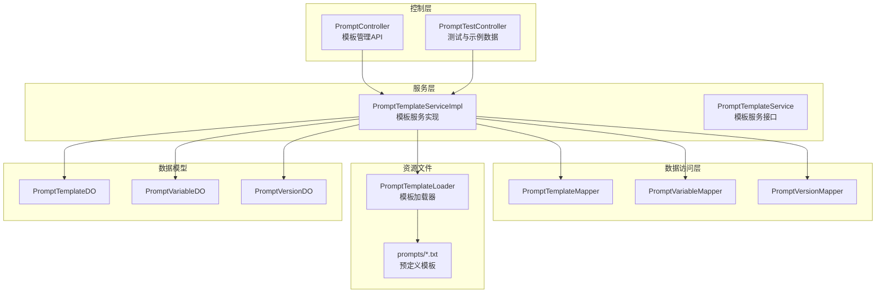
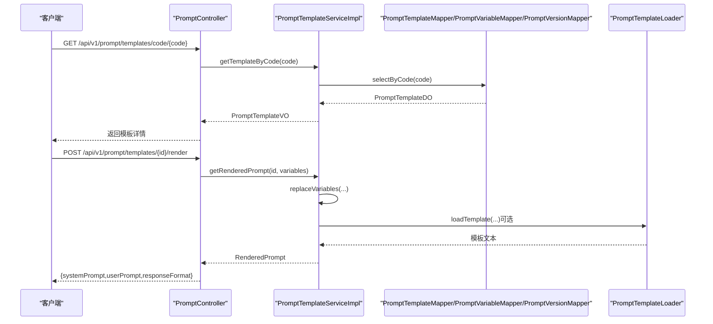
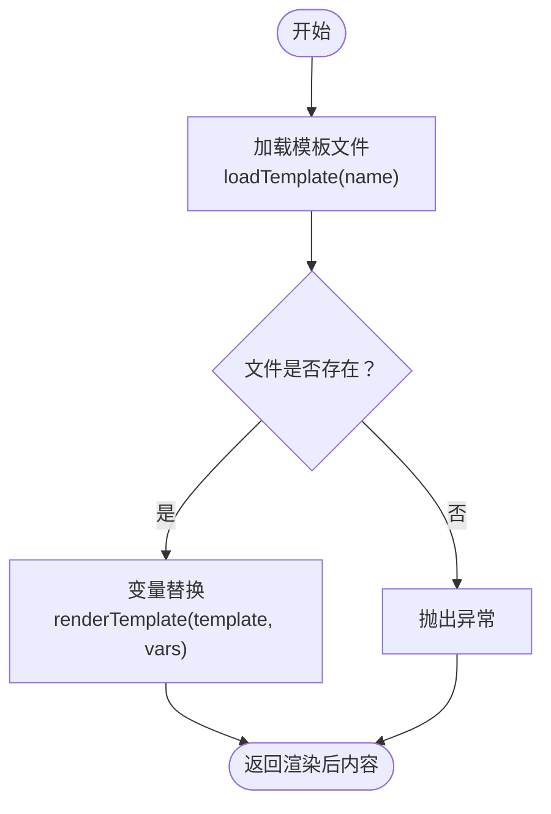
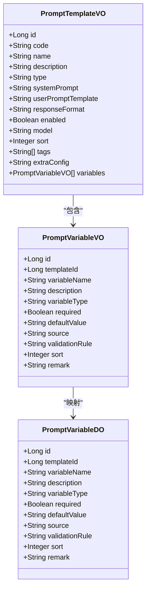
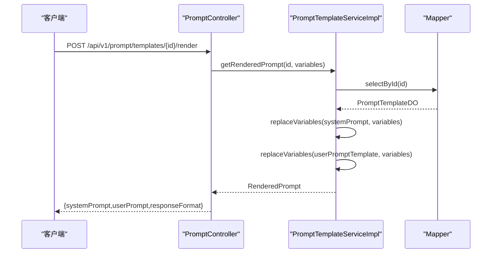
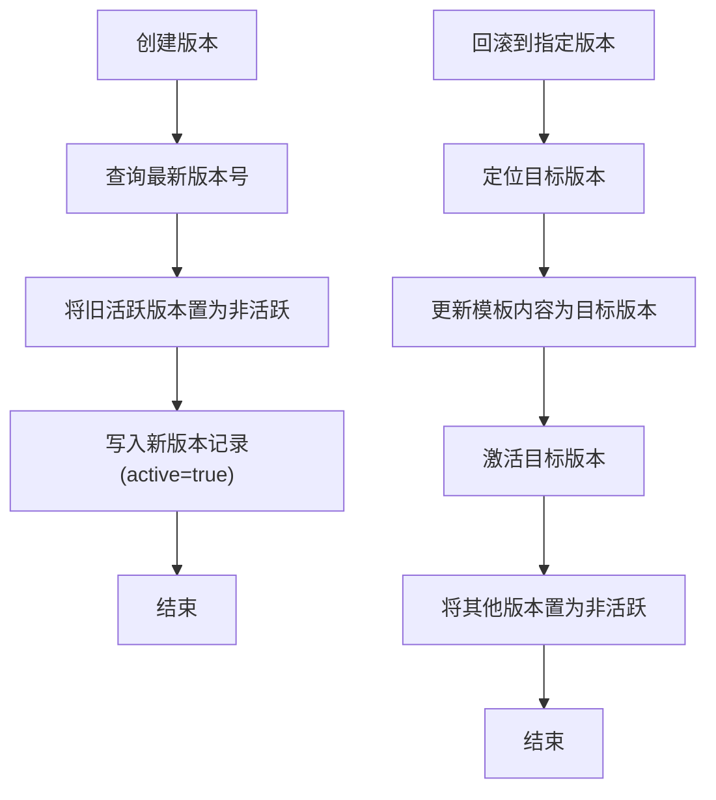
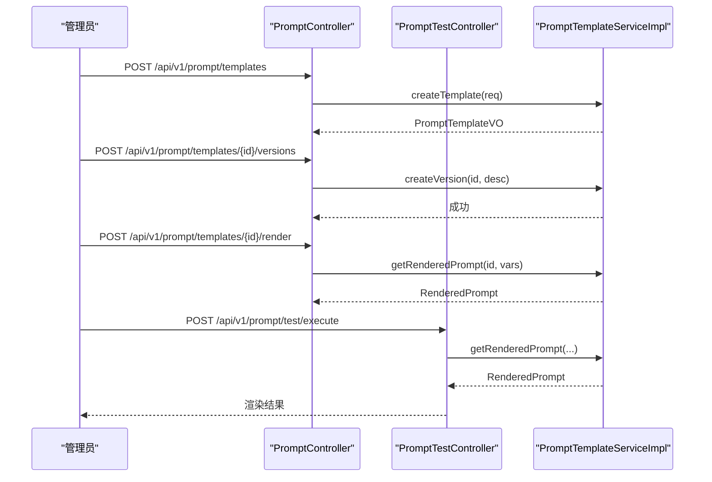
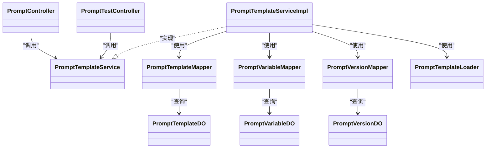

# 提示词管理

<!--<cite>
**本文引用的文件**
- [PromptTemplateLoader.java](file://ontograph-module-core/src/main/java/com/graphiti/module/graphiti/util/PromptTemplateLoader.java)
- [PromptTemplateServiceImpl.java](file://ontograph-module-core/src/main/java/com/graphiti/module/graphiti/service/impl/PromptTemplateServiceImpl.java)
- [PromptTemplateService.java](file://ontograph-module-core/src/main/java/com/graphiti/module/graphiti/service/PromptTemplateService.java)
- [PromptController.java](file://ontograph-module-core/src/main/java/com/graphiti/module/graphiti/controller/admin/PromptController.java)
- [PromptTestController.java](file://ontograph-module-core/src/main/java/com/graphiti/module/graphiti/controller/admin/PromptTestController.java)
- [PromptTemplateDO.java](file://ontograph-module-core/src/main/java/com/graphiti/module/graphiti/dal/dataobject/PromptTemplateDO.java)
- [PromptVariableDO.java](file://ontograph-module-core/src/main/java/com/graphiti/module/graphiti/dal/dataobject/PromptVariableDO.java)
- [PromptVersionDO.java](file://ontograph-module-core/src/main/java/com/graphiti/module/graphiti/dal/dataobject/PromptVersionDO.java)
- [PromptTemplateMapper.java](file://ontograph-module-core/src/main/java/com/graphiti/module/graphiti/dal/mysql/PromptTemplateMapper.java)
- [PromptVariableMapper.java](file://ontograph-module-core/src/main/java/com/graphiti/module/graphiti/dal/mysql/PromptVariableMapper.java)
- [PromptVersionMapper.java](file://ontograph-module-core/src/main/java/com/graphiti/module/graphiti/dal/mysql/PromptVersionMapper.java)
- [PromptTemplateVO.java](file://ontograph-module-core/src/main/java/com/graphiti/module/graphiti/vo/prompt/PromptTemplateVO.java)
- [CreatePromptTemplateReqVO.java](file://ontograph-module-core/src/main/java/com/graphiti/module/graphiti/vo/prompt/CreatePromptTemplateReqVO.java)
- [PromptVariableVO.java](file://ontograph-module-core/src/main/java/com/graphiti/module/graphiti/vo/prompt/PromptVariableVO.java)
- [system_prompt.txt](file://ontograph-module-core/src/main/resources/prompts/system_prompt.txt)
- [extract_entities.txt](file://ontograph-module-core/src/main/resources/prompts/extract_entities.txt)
- [extract_relations.txt](file://ontograph-module-core/src/main/resources/prompts/extract_relations.txt)
- [summarize_node.txt](file://ontograph-module-core/src/main/resources/prompts/summarize_node.txt)
- [summarize_community.txt](file://ontograph-module-core/src/main/resources/prompts/summarize_community.txt)
- [summarize_saga.txt](file://ontograph-module-core/src/main/resources/prompts/summarize_saga.txt)
</cite>-->

## 目录
1. [简介](#简介)
2. [项目结构](#项目结构)
3. [核心组件](#核心组件)
4. [架构总览](#架构总览)
5. [组件详解](#组件详解)
6. [依赖关系分析](#依赖关系分析)
7. [性能与扩展性](#性能与扩展性)
8. [故障排查指南](#故障排查指南)
9. [结论](#结论)
10. [附录](#附录)

## 简介
本文件系统性梳理 Graphiti 的提示词模板体系，覆盖预定义模板（实体抽取、关系抽取、节点摘要、社区摘要、系统提示）、提示词加载器与动态模板管理、变量系统与上下文注入、模板渲染流程、自定义提示词的创建与版本管理、测试与优化策略、多语言与本地化、跨 AI 供应商兼容性以及调试与性能监控最佳实践。

## 项目结构
提示词管理相关代码主要位于 core 模块中，采用“控制层-服务层-数据访问层-资源文件”分层组织：
- 控制层：提供 REST API，负责模板 CRUD、版本管理、渲染预览与测试执行
- 服务层：实现模板业务逻辑、变量替换、版本创建与回滚
- 数据访问层：MyBatis Mapper，访问数据库中的模板、变量、版本记录
- 资源文件：classpath 下的 prompts 目录，存放预定义模板文本

图表来源
- [PromptController.java:31-241](file://ontograph-module-core/src/main/java/com/graphiti/module/graphiti/controller/admin/PromptController.java#L31-L241)
- [PromptTestController.java:36-348](file://ontograph-module-core/src/main/java/com/graphiti/module/graphiti/controller/admin/PromptTestController.java#L36-L348)
- [PromptTemplateServiceImpl.java:34-402](file://ontograph-module-core/src/main/java/com/graphiti/module/graphiti/service/impl/PromptTemplateServiceImpl.java#L34-L402)
- [PromptTemplateMapper.java:14-39](file://ontograph-module-core/src/main/java/com/graphiti/module/graphiti/dal/mysql/PromptTemplateMapper.java#L14-L39)
- [PromptVariableMapper.java:14-34](file://ontograph-module-core/src/main/java/com/graphiti/module/graphiti/dal/mysql/PromptVariableMapper.java#L14-L34)
- [PromptVersionMapper.java:15-47](file://ontograph-module-core/src/main/java/com/graphiti/module/graphiti/dal/mysql/PromptVersionMapper.java#L15-L47)
- [PromptTemplateLoader.java:18-86](file://ontograph-module-core/src/main/java/com/graphiti/module/graphiti/util/PromptTemplateLoader.java#L18-L86)

章节来源
- [PromptController.java:31-241](file://ontograph-module-core/src/main/java/com/graphiti/module/graphiti/controller/admin/PromptController.java#L31-L241)
- [PromptTestController.java:36-348](file://ontograph-module-core/src/main/java/com/graphiti/module/graphiti/controller/admin/PromptTestController.java#L36-L348)
- [PromptTemplateServiceImpl.java:34-402](file://ontograph-module-core/src/main/java/com/graphiti/module/graphiti/service/impl/PromptTemplateServiceImpl.java#L34-L402)
- [PromptTemplateLoader.java:18-86](file://ontograph-module-core/src/main/java/com/graphiti/module/graphiti/util/PromptTemplateLoader.java#L18-L86)

## 核心组件
- 提示词加载器：从 classpath 加载模板文本，支持变量占位符替换
- 模板服务：模板 CRUD、变量解析、渲染输出、版本管理与回滚
- 控制器：对外暴露 REST API，支持模板管理、渲染预览、测试执行、版本操作
- 数据模型与 Mapper：持久化模板、变量、版本，提供查询与维护能力
- 预定义模板：系统提示、实体抽取、关系抽取、节点/社区/故事摘要

章节来源
- [PromptTemplateLoader.java:18-86](file://ontograph-module-core/src/main/java/com/graphiti/module/graphiti/util/PromptTemplateLoader.java#L18-L86)
- [PromptTemplateServiceImpl.java:34-402](file://ontograph-module-core/src/main/java/com/graphiti/module/graphiti/service/impl/PromptTemplateServiceImpl.java#L34-L402)
- [PromptTemplateService.java:14-109](file://ontograph-module-core/src/main/java/com/graphiti/module/graphiti/service/PromptTemplateService.java#L14-L109)
- [PromptController.java:31-241](file://ontograph-module-core/src/main/java/com/graphiti/module/graphiti/controller/admin/PromptController.java#L31-L241)
- [PromptTestController.java:36-348](file://ontograph-module-core/src/main/java/com/graphiti/module/graphiti/controller/admin/PromptTestController.java#L36-L348)
- [PromptTemplateDO.java:14-98](file://ontograph-module-core/src/main/java/com/graphiti/module/graphiti/dal/dataobject/PromptTemplateDO.java#L14-L98)
- [PromptVariableDO.java:14-78](file://ontograph-module-core/src/main/java/com/graphiti/module/graphiti/dal/dataobject/PromptVariableDO.java#L14-L78)
- [PromptVersionDO.java:14-65](file://ontograph-module-core/src/main/java/com/graphiti/module/graphiti/dal/dataobject/PromptVersionDO.java#L14-L65)

## 架构总览
提示词管理采用典型的三层架构：控制层负责请求接入与参数校验；服务层封装业务规则与渲染逻辑；数据访问层通过 MyBatis 与数据库交互；资源文件提供预定义模板。

图表来源
- [PromptController.java:88-122](file://ontograph-module-core/src/main/java/com/graphiti/module/graphiti/controller/admin/PromptController.java#L88-L122)
- [PromptTemplateServiceImpl.java:213-236](file://ontograph-module-core/src/main/java/com/graphiti/module/graphiti/service/impl/PromptTemplateServiceImpl.java#L213-L236)
- [PromptTemplateLoader.java:28-42](file://ontograph-module-core/src/main/java/com/graphiti/module/graphiti/util/PromptTemplateLoader.java#L28-L42)

## 组件详解

### 预定义模板与加载器
- 预定义模板位于 classpath: prompts/ 目录，包含系统提示与多种任务模板
- 加载器负责读取模板文本，支持变量占位符替换
- 模板常量集中于加载器内部，便于统一引用

图表来源
- [PromptTemplateLoader.java:28-73](file://ontograph-module-core/src/main/java/com/graphiti/module/graphiti/util/PromptTemplateLoader.java#L28-L73)
- [system_prompt.txt:1-11](file://ontograph-module-core/src/main/resources/prompts/system_prompt.txt#L1-L11)
- [extract_entities.txt:1-28](file://ontograph-module-core/src/main/resources/prompts/extract_entities.txt#L1-L28)
- [extract_relations.txt:1-33](file://ontograph-module-core/src/main/resources/prompts/extract_relations.txt#L1-L33)
- [summarize_node.txt:1-19](file://ontograph-module-core/src/main/resources/prompts/summarize_node.txt#L1-L19)
- [summarize_community.txt:1-19](file://ontograph-module-core/src/main/resources/prompts/summarize_community.txt#L1-L19)
- [summarize_saga.txt:1-16](file://ontograph-module-core/src/main/resources/prompts/summarize_saga.txt#L1-L16)

章节来源
- [PromptTemplateLoader.java:18-86](file://ontograph-module-core/src/main/java/com/graphiti/module/graphiti/util/PromptTemplateLoader.java#L18-L86)
- [system_prompt.txt:1-11](file://ontograph-module-core/src/main/resources/prompts/system_prompt.txt#L1-L11)
- [extract_entities.txt:1-28](file://ontograph-module-core/src/main/resources/prompts/extract_entities.txt#L1-L28)
- [extract_relations.txt:1-33](file://ontograph-module-core/src/main/resources/prompts/extract_relations.txt#L1-L33)
- [summarize_node.txt:1-19](file://ontograph-module-core/src/main/resources/prompts/summarize_node.txt#L1-L19)
- [summarize_community.txt:1-19](file://ontograph-module-core/src/main/resources/prompts/summarize_community.txt#L1-L19)
- [summarize_saga.txt:1-16](file://ontograph-module-core/src/main/resources/prompts/summarize_saga.txt#L1-L16)

### 提示词变量系统与上下文注入
- 变量定义：模板变量由 PromptVariableDO 描述，支持类型、必填、默认值、来源与校验规则
- 上下文注入：控制器在测试执行时将输入内容、上下文内容与自定义变量合并为渲染上下文
- 变量替换：服务层使用正则匹配 {var} 形式占位符，逐个替换为上下文值

图表来源
- [PromptVariableDO.java:14-78](file://ontograph-module-core/src/main/java/com/graphiti/module/graphiti/dal/dataobject/PromptVariableDO.java#L14-L78)
- [PromptVariableVO.java:13-49](file://ontograph-module-core/src/main/java/com/graphiti/module/graphiti/vo/prompt/PromptVariableVO.java#L13-L49)
- [PromptTemplateVO.java:15-69](file://ontograph-module-core/src/main/java/com/graphiti/module/graphiti/vo/prompt/PromptTemplateVO.java#L15-L69)

章节来源
- [PromptVariableDO.java:14-78](file://ontograph-module-core/src/main/java/com/graphiti/module/graphiti/dal/dataobject/PromptVariableDO.java#L14-L78)
- [PromptVariableMapper.java:14-34](file://ontograph-module-core/src/main/java/com/graphiti/module/graphiti/dal/mysql/PromptVariableMapper.java#L14-L34)
- [PromptTestController.java:210-229](file://ontograph-module-core/src/main/java/com/graphiti/module/graphiti/controller/admin/PromptTestController.java#L210-L229)

### 模板渲染流程
- 支持两种入口：按模板编码渲染与按模板 ID 渲染
- 渲染过程：分别替换系统提示与用户提示模板中的变量，输出 RenderedPrompt 结果对象
- 控制器提供渲染预览接口，便于前端实时查看变量替换效果

图表来源
- [PromptController.java:207-220](file://ontograph-module-core/src/main/java/com/graphiti/module/graphiti/controller/admin/PromptController.java#L207-L220)
- [PromptTemplateServiceImpl.java:213-236](file://ontograph-module-core/src/main/java/com/graphiti/module/graphiti/service/impl/PromptTemplateServiceImpl.java#L213-L236)

章节来源
- [PromptTemplateServiceImpl.java:213-260](file://ontograph-module-core/src/main/java/com/graphiti/module/graphiti/service/impl/PromptTemplateServiceImpl.java#L213-L260)
- [PromptTemplateService.java:63-82](file://ontograph-module-core/src/main/java/com/graphiti/module/graphiti/service/PromptTemplateService.java#L63-L82)

### 版本管理与回滚
- 版本创建：复制当前模板内容为新版本，旧活跃版本降级，新版本激活
- 版本查询：按模板 ID 获取版本历史，按版本号定位目标版本
- 回滚操作：将模板内容回滚至目标版本，同时激活该版本并取消其他版本的活跃状态

图表来源
- [PromptTemplateServiceImpl.java:264-334](file://ontograph-module-core/src/main/java/com/graphiti/module/graphiti/service/impl/PromptTemplateServiceImpl.java#L264-L334)
- [PromptVersionMapper.java:15-47](file://ontograph-module-core/src/main/java/com/graphiti/module/graphiti/dal/mysql/PromptVersionMapper.java#L15-L47)

章节来源
- [PromptTemplateServiceImpl.java:264-334](file://ontograph-module-core/src/main/java/com/graphiti/module/graphiti/service/impl/PromptTemplateServiceImpl.java#L264-L334)
- [PromptVersionDO.java:14-65](file://ontograph-module-core/src/main/java/com/graphiti/module/graphiti/dal/dataobject/PromptVersionDO.java#L14-L65)

### 自定义提示词的创建、测试与版本管理
- 创建与更新：通过控制器提交模板请求，服务层完成唯一性校验、变量保存与初始版本创建
- 测试执行：支持直接渲染预览与结合提取服务进行端到端效果测试
- 版本管理：支持创建版本、查看历史、回滚到任意历史版本

图表来源
- [PromptController.java:42-198](file://ontograph-module-core/src/main/java/com/graphiti/module/graphiti/controller/admin/PromptController.java#L42-L198)
- [PromptTestController.java:54-158](file://ontograph-module-core/src/main/java/com/graphiti/module/graphiti/controller/admin/PromptTestController.java#L54-L158)
- [PromptTemplateServiceImpl.java:45-94](file://ontograph-module-core/src/main/java/com/graphiti/module/graphiti/service/impl/PromptTemplateServiceImpl.java#L45-L94)

章节来源
- [PromptController.java:37-198](file://ontograph-module-core/src/main/java/com/graphiti/module/graphiti/controller/admin/PromptController.java#L37-L198)
- [PromptTestController.java:47-158](file://ontograph-module-core/src/main/java/com/graphiti/module/graphiti/controller/admin/PromptTestController.java#L47-L158)
- [PromptTemplateServiceImpl.java:45-153](file://ontograph-module-core/src/main/java/com/graphiti/module/graphiti/service/impl/PromptTemplateServiceImpl.java#L45-L153)

### 提示词变量系统与上下文注入
- 变量来源：支持来自上下文、静态值、LLM 动态生成
- 必填与默认值：服务层在渲染前可依据变量定义进行校验与填充
- 控制器注入：测试控制器将输入内容、上下文内容与自定义变量合并为渲染上下文

章节来源
- [PromptVariableDO.java:38-56](file://ontograph-module-core/src/main/java/com/graphiti/module/graphiti/dal/dataobject/PromptVariableDO.java#L38-L56)
- [PromptVariableMapper.java:24-27](file://ontograph-module-core/src/main/java/com/graphiti/module/graphiti/dal/mysql/PromptVariableMapper.java#L24-L27)
- [PromptTestController.java:210-229](file://ontograph-module-core/src/main/java/com/graphiti/module/graphiti/controller/admin/PromptTestController.java#L210-L229)

### 多语言支持与本地化
- 预定义模板遵循“输入语言即输出语言”的原则，系统提示与任务模板均尊重输入文本的语言
- 本地化建议：可在模板中增加语言参数变量，通过变量系统注入语言偏好，实现多语言提示词族

章节来源
- [system_prompt.txt:10-11](file://ontograph-module-core/src/main/resources/prompts/system_prompt.txt#L10-L11)

### 跨 AI 供应商兼容性
- 模板层不绑定具体供应商，通过 responseFormat 与 model 字段抽象不同供应商的输出约束与模型选择
- 实际调用由上层服务完成，模板仅负责生成标准化提示词

章节来源
- [PromptTemplateDO.java:41-66](file://ontograph-module-core/src/main/java/com/graphiti/module/graphiti/dal/dataobject/PromptTemplateDO.java#L41-L66)
- [PromptTemplateService.java:103-108](file://ontograph-module-core/src/main/java/com/graphiti/module/graphiti/service/PromptTemplateService.java#L103-L108)

## 依赖关系分析
- 控制层依赖服务层接口，服务层依赖数据访问层与模板加载器
- 数据模型之间存在一对一关系：模板与变量、模板与版本
- Mapper 提供按类型、编码、标签等维度的查询能力

图表来源
- [PromptController.java:32-33](file://ontograph-module-core/src/main/java/com/graphiti/module/graphiti/controller/admin/PromptController.java#L32-L33)
- [PromptTestController.java:39-42](file://ontograph-module-core/src/main/java/com/graphiti/module/graphiti/controller/admin/PromptTestController.java#L39-L42)
- [PromptTemplateServiceImpl.java:34-39](file://ontograph-module-core/src/main/java/com/graphiti/module/graphiti/service/impl/PromptTemplateServiceImpl.java#L34-L39)
- [PromptTemplateMapper.java:14-39](file://ontograph-module-core/src/main/java/com/graphiti/module/graphiti/dal/mysql/PromptTemplateMapper.java#L14-L39)
- [PromptVariableMapper.java:14-34](file://ontograph-module-core/src/main/java/com/graphiti/module/graphiti/dal/mysql/PromptVariableMapper.java#L14-L34)
- [PromptVersionMapper.java:15-47](file://ontograph-module-core/src/main/java/com/graphiti/module/graphiti/dal/mysql/PromptVersionMapper.java#L15-L47)
- [PromptTemplateLoader.java:18-86](file://ontograph-module-core/src/main/java/com/graphiti/module/graphiti/util/PromptTemplateLoader.java#L18-L86)

章节来源
- [PromptTemplateMapper.java:14-39](file://ontograph-module-core/src/main/java/com/graphiti/module/graphiti/dal/mysql/PromptTemplateMapper.java#L14-L39)
- [PromptVariableMapper.java:14-34](file://ontograph-module-core/src/main/java/com/graphiti/module/graphiti/dal/mysql/PromptVariableMapper.java#L14-L34)
- [PromptVersionMapper.java:15-47](file://ontograph-module-core/src/main/java/com/graphiti/module/graphiti/dal/mysql/PromptVersionMapper.java#L15-L47)

## 性能与扩展性
- 模板加载：classpath 读取，建议缓存常用模板以减少 IO
- 变量替换：正则匹配与字符串替换，建议限制变量数量与模板长度
- 版本管理：版本表按模板 ID 分区，查询按版本倒序，注意索引优化
- 并发控制：模板更新与版本创建使用事务，避免竞态条件

[本节为通用建议，无需特定文件引用]

## 故障排查指南
- 模板未找到：检查模板编码与文件路径，确认加载器路径与文件存在
- 变量缺失：核对变量定义与上下文传入，确保必填变量已提供
- 渲染异常：查看变量替换日志，确认占位符格式与上下文类型一致
- 版本回滚失败：确认目标版本存在且模板 ID 正确

章节来源
- [PromptTemplateLoader.java:30-42](file://ontograph-module-core/src/main/java/com/graphiti/module/graphiti/util/PromptTemplateLoader.java#L30-L42)
- [PromptTemplateServiceImpl.java:213-236](file://ontograph-module-core/src/main/java/com/graphiti/module/graphiti/service/impl/PromptTemplateServiceImpl.java#L213-L236)
- [PromptTestController.java:79-83](file://ontograph-module-core/src/main/java/com/graphiti/module/graphiti/controller/admin/PromptTestController.java#L79-L83)

## 结论
Graphiti 的提示词管理以清晰的分层架构与可扩展的数据模型为基础，既支持开箱即用的预定义模板，也允许灵活的自定义模板与版本管理。通过变量系统与上下文注入，实现了对复杂提示词的动态渲染；通过版本管理与测试工具，保障了提示词的质量与稳定性。未来可在模板缓存、变量校验增强、多语言模板族等方面持续演进。

[本节为总结性内容，无需特定文件引用]

## 附录

### 预定义模板清单与用途
- system_prompt.txt：系统角色与行为约束
- extract_entities.txt：实体抽取任务
- extract_relations.txt：关系抽取任务
- summarize_node.txt：节点摘要
- summarize_community.txt：社区摘要
- summarize_saga.txt：故事线摘要

章节来源
- [system_prompt.txt:1-11](file://ontograph-module-core/src/main/resources/prompts/system_prompt.txt#L1-L11)
- [extract_entities.txt:1-28](file://ontograph-module-core/src/main/resources/prompts/extract_entities.txt#L1-L28)
- [extract_relations.txt:1-33](file://ontograph-module-core/src/main/resources/prompts/extract_relations.txt#L1-L33)
- [summarize_node.txt:1-19](file://ontograph-module-core/src/main/resources/prompts/summarize_node.txt#L1-L19)
- [summarize_community.txt:1-19](file://ontograph-module-core/src/main/resources/prompts/summarize_community.txt#L1-L19)
- [summarize_saga.txt:1-16](file://ontograph-module-core/src/main/resources/prompts/summarize_saga.txt#L1-L16)

### API 一览（节选）
- 模板管理：POST/PUT/DELETE/GET /api/v1/prompt/templates*
- 版本管理：POST/GET/POST /api/v1/prompt/templates/{id}/versions*
- 渲染预览：POST /api/v1/prompt/templates/{id}/render
- 测试执行：POST /api/v1/prompt/test/execute
- 提取测试：POST /api/v1/prompt/test/extract
- 示例数据：POST /api/v1/prompt/test/generate-sample

章节来源
- [PromptController.java:42-240](file://ontograph-module-core/src/main/java/com/graphiti/module/graphiti/controller/admin/PromptController.java#L42-L240)
- [PromptTestController.java:51-206](file://ontograph-module-core/src/main/java/com/graphiti/module/graphiti/controller/admin/PromptTestController.java#L51-L206)