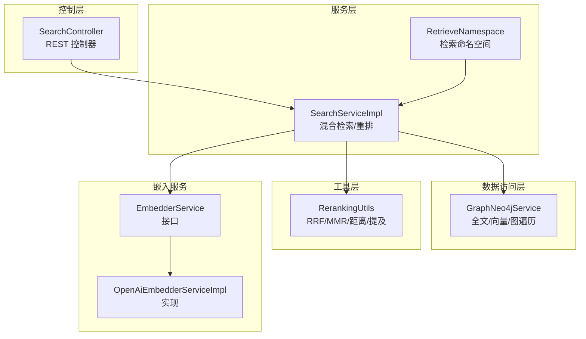
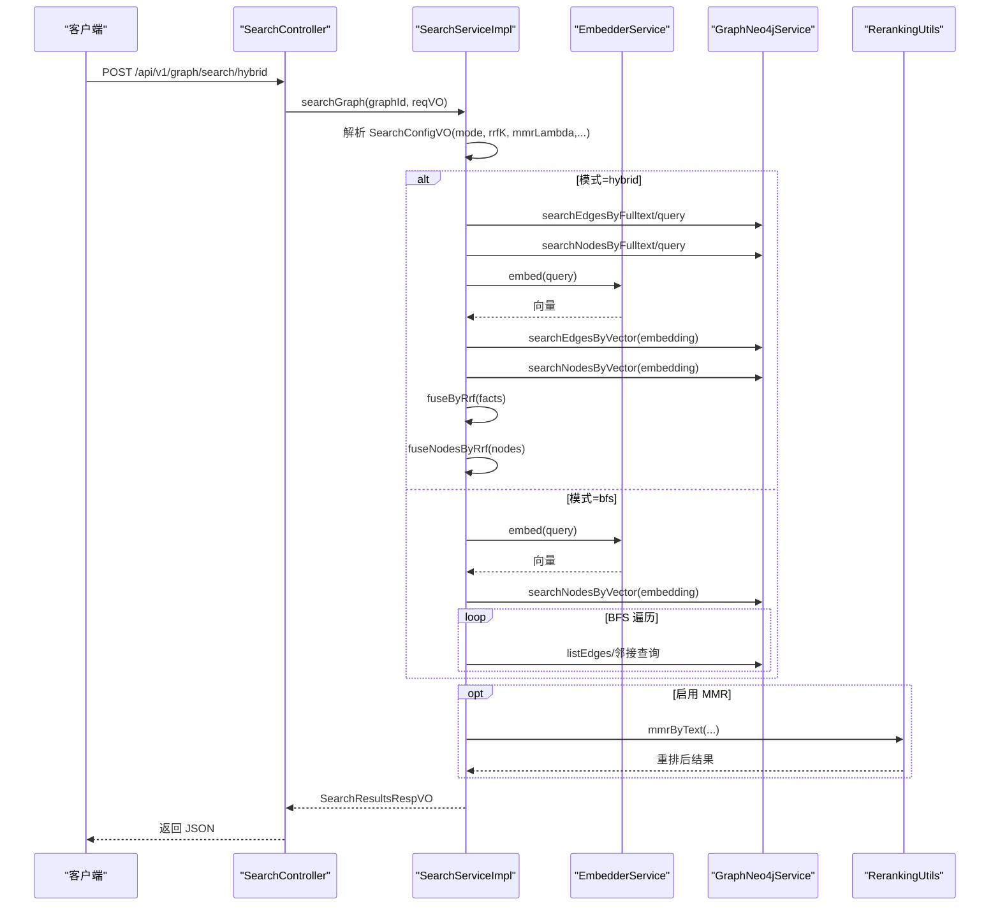
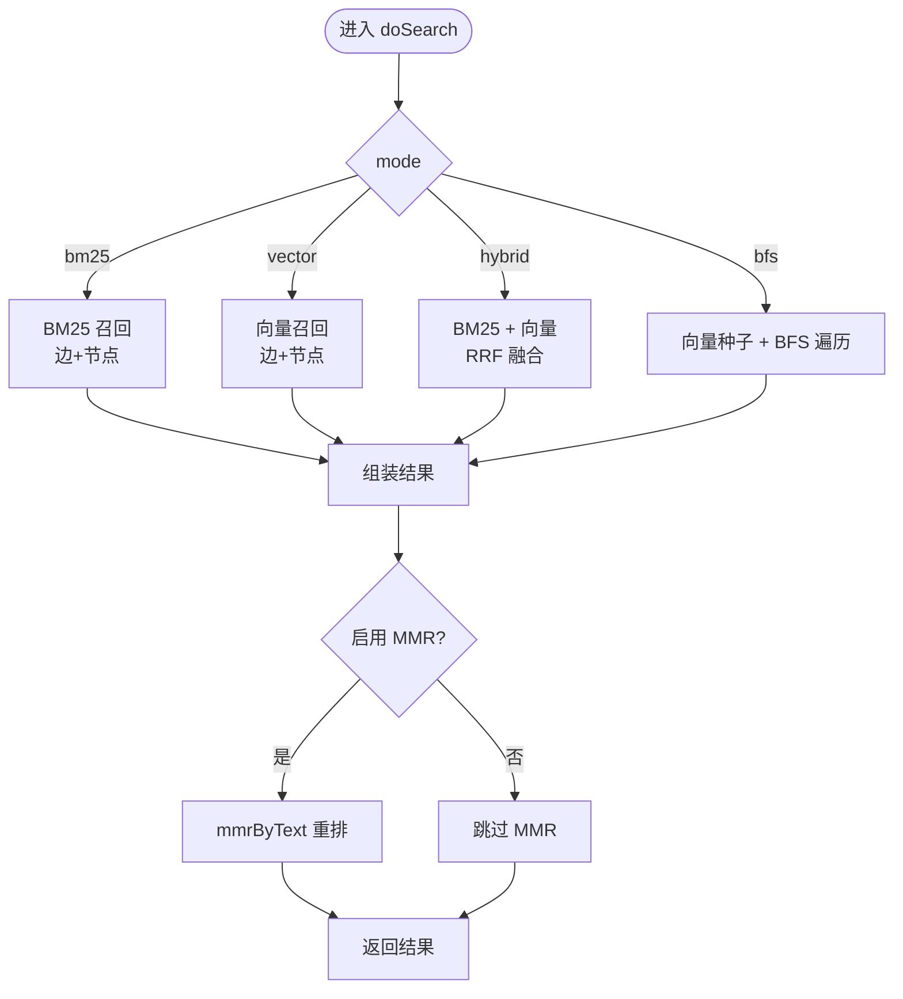
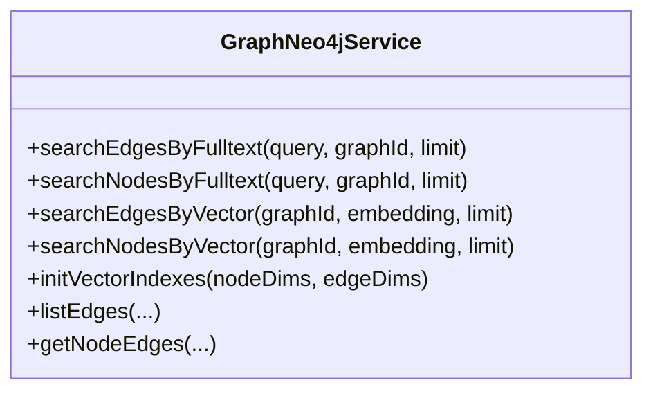
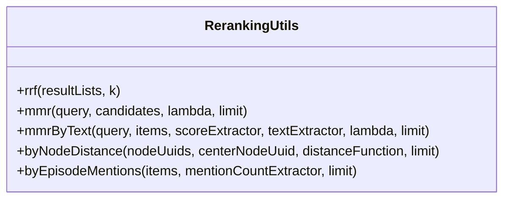
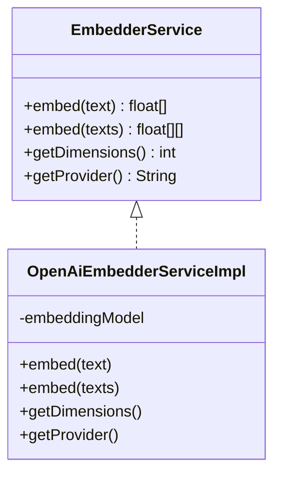
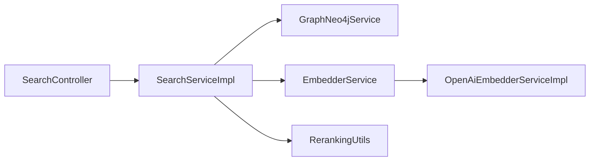

# 搜索算法融合

<!--<cite>
**本文引用的文件**
- [SearchController.java](file://graphiti-module-core/src/main/java/com/graphiti/module/graphiti/controller/admin/SearchController.java)
- [SearchServiceImpl.java](file://graphiti-module-core/src/main/java/com/graphiti/module/graphiti/service/impl/SearchServiceImpl.java)
- [SearchService.java](file://graphiti-module-core/src/main/java/com/graphiti/module/graphiti/service/SearchService.java)
- [SearchQueryReqVO.java](file://graphiti-module-core/src/main/java/com/graphiti/module/graphiti/vo/search/SearchQueryReqVO.java)
- [SearchResultsRespVO.java](file://graphiti-module-core/src/main/java/com/graphiti/module/graphiti/vo/search/SearchResultsRespVO.java)
- [SearchConfigVO.java](file://graphiti-module-core/src/main/java/com/graphiti/module/graphiti/vo/search/SearchConfigVO.java)
- [FactResultVO.java](file://graphiti-module-core/src/main/java/com/graphiti/module/graphiti/vo/search/FactResultVO.java)
- [NodeResultVO.java](file://graphiti-module-core/src/main/java/com/graphiti/module/graphiti/vo/search/NodeResultVO.java)
- [RerankingUtils.java](file://graphiti-module-core/src/main/java/com/graphiti/module/graphiti/util/RerankingUtils.java)
- [GraphNeo4jService.java](file://graphiti-module-core/src/main/java/com/graphiti/module/graphiti/service/GraphNeo4jService.java)
- [RetrieveNamespace.java](file://graphiti-module-core/src/main/java/com/graphiti/module/graphiti/namespace/RetrieveNamespace.java)
- [EmbedderService.java](file://graphiti-module-core/src/main/java/com/graphiti/module/graphiti/service/EmbedderService.java)
- [OpenAiEmbedderServiceImpl.java](file://graphiti-module-core/src/main/java/com/graphiti/module/graphiti/service/impl/ai/OpenAiEmbedderServiceImpl.java)
</cite>-->

## 目录
1. [简介](#简介)
2. [项目结构](#项目结构)
3. [核心组件](#核心组件)
4. [架构总览](#架构总览)
5. [详细组件分析](#详细组件分析)
6. [依赖分析](#依赖分析)
7. [性能考虑](#性能考虑)
8. [故障排查指南](#故障排查指南)
9. [结论](#结论)
10. [附录](#附录)

## 简介
本文件面向“搜索算法融合系统”的技术文档，聚焦 Graphiti 混合搜索算法的设计理念与实现架构，系统阐述 BM25 文本检索、向量相似度搜索与图遍历算法的融合策略；详解多路召回、交叉验证与重排序机制；解释搜索配置的动态调整与个性化推荐思路；给出索引策略、缓存机制与并行处理的性能优化建议；说明相关性评分与置信度计算；提供不同场景下的调优方法与效果评估；并给出搜索体验优化与用户行为分析的实现方案以及监控指标与故障诊断方法。

## 项目结构
围绕搜索功能的关键模块分布如下：
- 控制层：对外暴露搜索 API，支持全局搜索、图谱搜索、混合检索、语义检索、BFS 搜索与记忆检索
- 服务层：实现混合检索、多路召回、RRF 融合、MMR 重排序、节点距离与提及次数重排
- 数据访问层：封装 Neo4j 的全文与向量索引查询、节点/边检索、图遍历
- 工具层：提供 RerankingUtils 统一的重排工具（RRF、MMR、按节点距离、按提及次数）
- 嵌入服务：抽象统一的 EmbedderService，屏蔽底层 Provider 差异（OpenAI 等）

图表来源
- [SearchController.java:33-136](file://graphiti-module-core/src/main/java/com/graphiti/module/graphiti/controller/admin/SearchController.java#L33-L136)
- [SearchServiceImpl.java:26-148](file://graphiti-module-core/src/main/java/com/graphiti/module/graphiti/service/impl/SearchServiceImpl.java#L26-L148)
- [RetrieveNamespace.java:30-73](file://graphiti-module-core/src/main/java/com/graphiti/module/graphiti/namespace/RetrieveNamespace.java#L30-L73)
- [GraphNeo4jService.java:617-762](file://graphiti-module-core/src/main/java/com/graphiti/module/graphiti/service/GraphNeo4jService.java#L617-L762)
- [RerankingUtils.java:34-254](file://graphiti-module-core/src/main/java/com/graphiti/module/graphiti/util/RerankingUtils.java#L34-L254)
- [EmbedderService.java:17-39](file://graphiti-module-core/src/main/java/com/graphiti/module/graphiti/service/EmbedderService.java#L17-L39)
- [OpenAiEmbedderServiceImpl.java:29-60](file://graphiti-module-core/src/main/java/com/graphiti/module/graphiti/service/impl/ai/OpenAiEmbedderServiceImpl.java#L29-L60)

章节来源
- [SearchController.java:23-136](file://graphiti-module-core/src/main/java/com/graphiti/module/graphiti/controller/admin/SearchController.java#L23-L136)
- [SearchServiceImpl.java:26-148](file://graphiti-module-core/src/main/java/com/graphiti/module/graphiti/service/impl/SearchServiceImpl.java#L26-L148)
- [RetrieveNamespace.java:21-73](file://graphiti-module-core/src/main/java/com/graphiti/module/graphiti/namespace/RetrieveNamespace.java#L21-L73)

## 核心组件
- 搜索控制器：提供全局搜索、图谱搜索、混合检索、语义检索、BFS 搜索与记忆检索等 REST 接口
- 搜索服务实现：统一调度 BM25、向量、BFS 三种召回路径，采用 RRF 融合与 MMR 重排序，支持节点距离与提及次数二次重排
- Neo4j 数据访问：封装全文索引与向量索引查询，提供节点/边检索与图遍历
- 重排工具：提供 RRF、MMR、按节点距离、按提及次数等重排策略
- 嵌入服务：抽象统一的 EmbedderService，屏蔽底层 Provider 差异，当前默认 OpenAI 实现

章节来源
- [SearchController.java:33-136](file://graphiti-module-core/src/main/java/com/graphiti/module/graphiti/controller/admin/SearchController.java#L33-L136)
- [SearchServiceImpl.java:94-148](file://graphiti-module-core/src/main/java/com/graphiti/module/graphiti/service/impl/SearchServiceImpl.java#L94-L148)
- [GraphNeo4jService.java:617-762](file://graphiti-module-core/src/main/java/com/graphiti/module/graphiti/service/GraphNeo4jService.java#L617-L762)
- [RerankingUtils.java:34-254](file://graphiti-module-core/src/main/java/com/graphiti/module/graphiti/util/RerankingUtils.java#L34-L254)
- [EmbedderService.java:17-39](file://graphiti-module-core/src/main/java/com/graphiti/module/graphiti/service/EmbedderService.java#L17-L39)

## 架构总览
混合搜索的整体流程：
- 输入解析：解析查询、图谱范围、最大返回条数与搜索配置
- 多路召回：根据模式选择 BM25、向量或 BFS
- 融合策略：对边与节点分别进行 RRF 融合
- 重排序：可选 MMR 重排序；也可按节点距离或提及次数重排
- 输出组装：返回事实与节点列表、总数统计

图表来源
- [SearchController.java:88-136](file://graphiti-module-core/src/main/java/com/graphiti/module/graphiti/controller/admin/SearchController.java#L88-L136)
- [SearchServiceImpl.java:94-148](file://graphiti-module-core/src/main/java/com/graphiti/module/graphiti/service/impl/SearchServiceImpl.java#L94-L148)
- [GraphNeo4jService.java:617-762](file://graphiti-module-core/src/main/java/com/graphiti/module/graphiti/service/GraphNeo4jService.java#L617-L762)
- [RerankingUtils.java:188-254](file://graphiti-module-core/src/main/java/com/graphiti/module/graphiti/util/RerankingUtils.java#L188-L254)
- [EmbedderService.java:17-39](file://graphiti-module-core/src/main/java/com/graphiti/module/graphiti/service/EmbedderService.java#L17-L39)

## 详细组件分析

### 搜索控制器（SearchController）
- 功能：提供全局搜索、图谱搜索、检索入口、便捷检索接口（混合/语义/BFS）、记忆检索
- 设计要点：
  - 通过 SearchConfigVO 的 mode 字段切换 BM25、向量、混合、BFS 四种模式
  - 通过 rrfK、mmrLambda、bfsDepth、bfsMaxNeighbors 等参数动态调整召回与重排策略
  - 通过 SearchQueryReqVO 的 groupIds 限定搜索范围，支持多图谱聚合

章节来源
- [SearchController.java:33-136](file://graphiti-module-core/src/main/java/com/graphiti/module/graphiti/controller/admin/SearchController.java#L33-L136)
- [SearchQueryReqVO.java:17-31](file://graphiti-module-core/src/main/java/com/graphiti/module/graphiti/vo/search/SearchQueryReqVO.java#L17-L31)
- [SearchConfigVO.java:16-39](file://graphiti-module-core/src/main/java/com/graphiti/module/graphiti/vo/search/SearchConfigVO.java#L16-L39)

### 搜索服务实现（SearchServiceImpl）
- 多路召回与融合：
  - BM25：调用 GraphNeo4jService 的全文检索接口，返回边与节点列表
  - 向量：调用 EmbedderService 生成查询向量，再调用 GraphNeo4jService 的向量检索接口
  - BFS：以向量检索结果作为种子节点，进行图遍历，按深度与邻居上限收集节点
  - RRF 融合：对两条召回链路的结果按倒数排名融合，去重合并并按分数排序
- 重排序：
  - MMR：基于文本相似度与已选项目的最大相似度进行折中，平衡相关性与多样性
  - 节点距离重排：计算中心节点到候选节点的最短图距离，距离越近分数越高
  - 提及次数重排：统计边在 Episode 的 MENTIONS 关系中的出现次数，次数越多越靠前
- 输出：组装 SearchResultsRespVO，包含 facts、nodes、totalCount、nodeCount

图表来源
- [SearchServiceImpl.java:94-148](file://graphiti-module-core/src/main/java/com/graphiti/module/graphiti/service/impl/SearchServiceImpl.java#L94-L148)
- [SearchServiceImpl.java:227-284](file://graphiti-module-core/src/main/java/com/graphiti/module/graphiti/service/impl/SearchServiceImpl.java#L227-L284)
- [SearchServiceImpl.java:288-308](file://graphiti-module-core/src/main/java/com/graphiti/module/graphiti/service/impl/SearchServiceImpl.java#L288-L308)
- [SearchServiceImpl.java:320-365](file://graphiti-module-core/src/main/java/com/graphiti/module/graphiti/service/impl/SearchServiceImpl.java#L320-L365)

章节来源
- [SearchServiceImpl.java:94-148](file://graphiti-module-core/src/main/java/com/graphiti/module/graphiti/service/impl/SearchServiceImpl.java#L94-L148)
- [SearchServiceImpl.java:227-308](file://graphiti-module-core/src/main/java/com/graphiti/module/graphiti/service/impl/SearchServiceImpl.java#L227-L308)
- [SearchServiceImpl.java:320-365](file://graphiti-module-core/src/main/java/com/graphiti/module/graphiti/service/impl/SearchServiceImpl.java#L320-L365)

### Neo4j 数据访问（GraphNeo4jService）
- 全文检索：
  - 边：基于全文索引查询关系 fact，返回 uuid、fact、type、group_id、score
  - 节点：基于全文索引查询节点 name/summary，返回 uuid、name、summary、type、group_id、score
- 向量检索：
  - 节点：基于节点向量索引查询，返回 uuid、name、type、summary、similarity score
  - 边：基于边向量索引查询，返回 uuid、fact、type、similarity score
- 图遍历：通过邻接关系查询，结合队列与访问集合实现 BFS，支持深度与每层最大邻居数控制
- 索引初始化：提供节点与边向量索引创建方法，设置维度与相似度函数

图表来源
- [GraphNeo4jService.java:617-762](file://graphiti-module-core/src/main/java/com/graphiti/module/graphiti/service/GraphNeo4jService.java#L617-L762)

章节来源
- [GraphNeo4jService.java:617-762](file://graphiti-module-core/src/main/java/com/graphiti/module/graphiti/service/GraphNeo4jService.java#L617-L762)

### 重排工具（RerankingUtils）
- RRF：对多个候选列表进行倒数排名融合，k 默认 60
- MMR：基于查询与候选的相似度，减去与已选项目的最大相似度，平衡相关性与多样性
- 节点距离重排：按节点到中心节点的最短距离计算分数
- 提及次数重排：统计候选在 Episode 的 MENTIONS 关系中的出现次数

图表来源
- [RerankingUtils.java:34-254](file://graphiti-module-core/src/main/java/com/graphiti/module/graphiti/util/RerankingUtils.java#L34-L254)

章节来源
- [RerankingUtils.java:34-254](file://graphiti-module-core/src/main/java/com/graphiti/module/graphiti/util/RerankingUtils.java#L34-L254)

### 嵌入服务（EmbedderService 与 OpenAI 实现）
- 抽象接口：统一 embed 单条与批量嵌入、维度查询与 Provider 名称
- OpenAI 实现：基于 Spring AI 的 OpenAiEmbeddingModel，封装异常处理与日志

图表来源
- [EmbedderService.java:17-39](file://graphiti-module-core/src/main/java/com/graphiti/module/graphiti/service/EmbedderService.java#L17-L39)
- [OpenAiEmbedderServiceImpl.java:29-60](file://graphiti-module-core/src/main/java/com/graphiti/module/graphiti/service/impl/ai/OpenAiEmbedderServiceImpl.java#L29-L60)

章节来源
- [EmbedderService.java:17-39](file://graphiti-module-core/src/main/java/com/graphiti/module/graphiti/service/EmbedderService.java#L17-L39)
- [OpenAiEmbedderServiceImpl.java:29-60](file://graphiti-module-core/src/main/java/com/graphiti/module/graphiti/service/impl/ai/OpenAiEmbedderServiceImpl.java#L29-L60)

### 检索命名空间（RetrieveNamespace）
- 封装检索与记忆检索能力，统一对外提供 search、semanticSearch、searchGraph、getMemory
- 便于上层业务以命名空间方式调用，降低耦合

章节来源
- [RetrieveNamespace.java:30-73](file://graphiti-module-core/src/main/java/com/graphiti/module/graphiti/namespace/RetrieveNamespace.java#L30-L73)

## 依赖分析
- 控制层依赖服务层；服务层依赖数据访问层与嵌入服务；重排工具被服务层直接调用
- 搜索配置通过 SearchConfigVO 注入，影响召回与重排策略
- Neo4j 的全文与向量索引是检索性能的关键基础设施

图表来源
- [SearchController.java:33-136](file://graphiti-module-core/src/main/java/com/graphiti/module/graphiti/controller/admin/SearchController.java#L33-L136)
- [SearchServiceImpl.java:23-24](file://graphiti-module-core/src/main/java/com/graphiti/module/graphiti/service/impl/SearchServiceImpl.java#L23-L24)
- [GraphNeo4jService.java:617-762](file://graphiti-module-core/src/main/java/com/graphiti/module/graphiti/service/GraphNeo4jService.java#L617-L762)
- [RerankingUtils.java:34-254](file://graphiti-module-core/src/main/java/com/graphiti/module/graphiti/util/RerankingUtils.java#L34-L254)
- [EmbedderService.java:17-39](file://graphiti-module-core/src/main/java/com/graphiti/module/graphiti/service/EmbedderService.java#L17-L39)
- [OpenAiEmbedderServiceImpl.java:29-60](file://graphiti-module-core/src/main/java/com/graphiti/module/graphiti/service/impl/ai/OpenAiEmbedderServiceImpl.java#L29-L60)

章节来源
- [SearchServiceImpl.java:23-24](file://graphiti-module-core/src/main/java/com/graphiti/module/graphiti/service/impl/SearchServiceImpl.java#L23-L24)

## 性能考虑
- 索引策略
  - 全文索引：为边 fact 与节点 name/summary 建立全文索引，提升 BM25 检索效率
  - 向量索引：为节点与边 embedding 建立向量索引，设置相似度函数（如余弦），并确保维度一致
  - 索引初始化：在应用启动阶段调用 initVectorIndexes，避免运行时首次查询的冷启动开销
- 缓存机制
  - 查询向量缓存：对高频查询词进行向量缓存，减少重复嵌入调用
  - 结果缓存：对稳定查询与热门图谱组合进行短期缓存，降低数据库压力
- 并行处理
  - 多图谱并行：对 groupIds 并行发起检索，汇总后再进行融合与重排
  - 批量嵌入：对批量文本进行批处理嵌入，提高吞吐
- 参数调优
  - rrfK：控制 RRF 融合的平滑程度，较小值更偏向靠前列表
  - mmrLambda：平衡相关性与多样性，0.5 为折中，接近 1 更强调相关性
  - BFS 深度与邻居数：根据图密度与性能约束调整，避免过度扩散

## 故障排查指南
- 全文/向量索引未创建
  - 现象：全文/向量检索返回空或报错
  - 处理：检查索引初始化逻辑，确认索引已创建且维度匹配
- 嵌入模型异常
  - 现象：OpenAI 嵌入调用抛出空指针或无结果
  - 处理：确认配置的模型为嵌入模型而非重排模型，检查 base-url 与模型名
- MMR 重排无效
  - 现象：启用 MMR 后结果未变化
  - 处理：检查 mmrLambda 设置与输入分数，确认文本提取器返回非空文本
- BFS 遍历性能问题
  - 现象：深度较大时响应缓慢
  - 处理：降低 bfsDepth 或 bfsMaxNeighbors，或引入早期停止条件

章节来源
- [GraphNeo4jService.java:768-791](file://graphiti-module-core/src/main/java/com/graphiti/module/graphiti/service/GraphNeo4jService.java#L768-L791)
- [OpenAiEmbedderServiceImpl.java:34-60](file://graphiti-module-core/src/main/java/com/graphiti/module/graphiti/service/impl/ai/OpenAiEmbedderServiceImpl.java#L34-L60)
- [SearchServiceImpl.java:137-139](file://graphiti-module-core/src/main/java/com/graphiti/module/graphiti/service/impl/SearchServiceImpl.java#L137-L139)

## 结论
Graphiti 搜索算法融合系统通过“BM25 + 向量 + BFS”的多路召回与 RRF 融合、MMR 重排序、节点距离与提及次数重排，实现了高召回与高多样性的平衡。配合 Neo4j 的全文与向量索引、嵌入服务抽象与命名空间封装，系统具备良好的扩展性与可维护性。通过合理的索引策略、缓存与并行处理，可在不同规模与场景下获得稳定的性能表现。

## 附录
- 相关性评分与置信度
  - BM25 与向量检索均返回分数字段，RRF 融合后得到融合分数；MMR 在此基础上进一步平衡相关性与多样性
  - 节点距离与提及次数重排提供额外的排序信号，可用于个性化与时效性需求
- 个性化推荐算法思路
  - 基于用户画像与历史交互，动态调整 rrfK、mmrLambda、bfsDepth 等参数
  - 引入用户偏好特征向量与 MMReg 等学习排序方法，对候选进行个性化重排
- 搜索体验优化与用户行为分析
  - 记忆检索：基于对话历史重建上下文，增强连续问答体验
  - 用户行为埋点：记录点击、停留、反馈等，用于评估不同策略的效果
- 监控指标与故障诊断
  - 指标：查询延迟、召回覆盖率、重排前后相关性变化、缓存命中率、索引查询耗时
  - 诊断：索引状态检查、嵌入服务可用性、BFS 遍历深度与邻居数的性能曲线