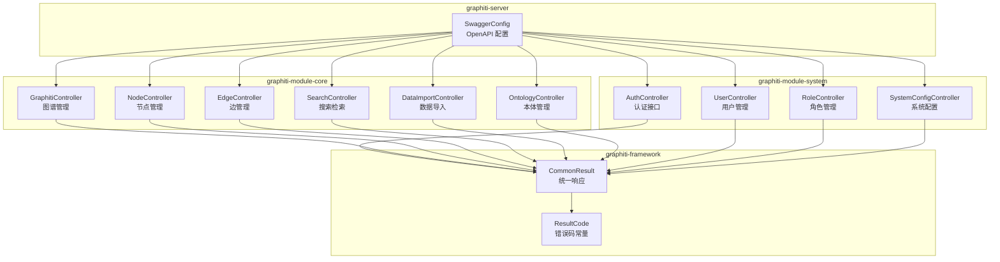
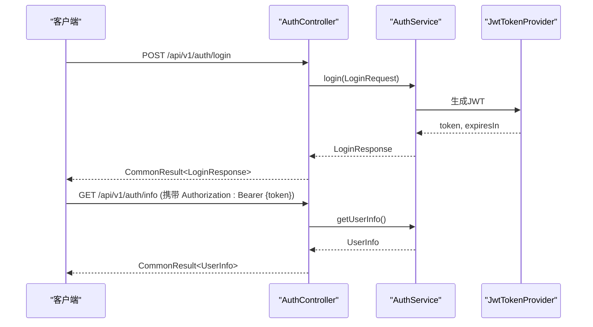
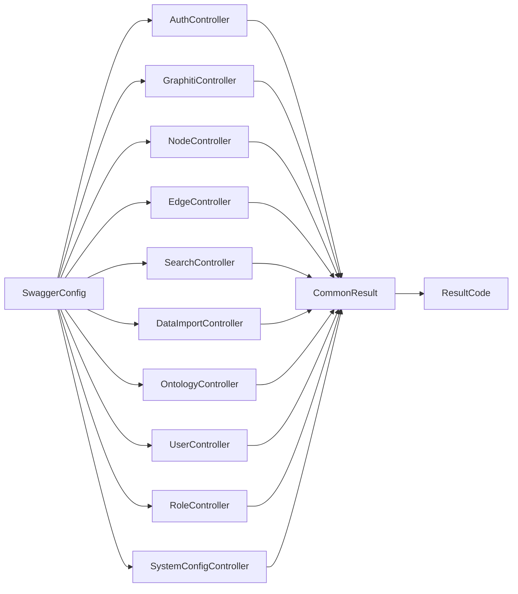

# API接口文档

<cite>
**本文引用的文件**
- [SwaggerConfig.java](file://graphiti-server/src/main/java/com/graphiti/config/SwaggerConfig.java)
- [AuthController.java](file://graphiti-module-system/src/main/java/com/graphiti/system/controller/AuthController.java)
- [UserController.java](file://graphiti-module-system/src/main/java/com/graphiti/system/controller/UserController.java)
- [RoleController.java](file://graphiti-module-system/src/main/java/com/graphiti/system/controller/RoleController.java)
- [SystemConfigController.java](file://graphiti-module-system/src/main/java/com/graphiti/system/controller/SystemConfigController.java)
- [GraphitiController.java](file://graphiti-module-core/src/main/java/com/graphiti/module/graphiti/controller/admin/GraphitiController.java)
- [NodeController.java](file://graphiti-module-core/src/main/java/com/graphiti/module/graphiti/controller/admin/NodeController.java)
- [EdgeController.java](file://graphiti-module-core/src/main/java/com/graphiti/module/graphiti/controller/admin/EdgeController.java)
- [SearchController.java](file://graphiti-module-core/src/main/java/com/graphiti/module/graphiti/controller/admin/SearchController.java)
- [DataImportController.java](file://graphiti-module-core/src/main/java/com/graphiti/module/graphiti/controller/admin/DataImportController.java)
- [OntologyController.java](file://graphiti-module-core/src/main/java/com/graphiti/module/graphiti/controller/admin/OntologyController.java)
- [CreateGraphReqVO.java](file://graphiti-module-core/src/main/java/com/graphiti/module/graphiti/vo/graph/CreateGraphReqVO.java)
- [SearchQueryReqVO.java](file://graphiti-module-core/src/main/java/com/graphiti/module/graphiti/vo/search/SearchQueryReqVO.java)
- [LoginRequest.java](file://graphiti-module-system/src/main/java/com/graphiti/system/dto/LoginRequest.java)
- [LoginResponse.java](file://graphiti-module-system/src/main/java/com/graphiti/system/dto/LoginResponse.java)
- [CommonResult.java](file://graphiti-framework/graphiti-common/src/main/java/com/graphiti/common/response/CommonResult.java)
- [ResultCode.java](file://graphiti-framework/graphiti-common/src/main/java/com/graphiti/common/constants/ResultCode.java)
- [README.md](file://README.md)
</cite>

## 目录
1. [简介](#简介)
2. [项目结构](#项目结构)
3. [核心组件](#核心组件)
4. [架构总览](#架构总览)
5. [详细组件分析](#详细组件分析)
6. [依赖分析](#依赖分析)
7. [性能考虑](#性能考虑)
8. [故障排查指南](#故障排查指南)
9. [结论](#结论)
10. [附录](#附录)

## 简介
本文件为 Graphiti-Java 的完整 API 接口文档，基于 Swagger/OpenAPI 规范整理，覆盖认证、系统管理、知识图谱、实体关系、搜索、数据导入、本体管理等模块。文档提供各端点的 HTTP 方法、URL 模式、请求参数、响应格式、错误码说明，并给出统一响应结构、认证机制（JWT）、权限控制策略、分页/过滤/排序通用参数、API 版本与兼容性说明，以及使用示例与最佳实践。

## 项目结构
后端采用多模块架构，核心控制器位于 core 模块的 admin 包中，系统管理控制器位于 system 模块，统一响应与常量位于 framework-common 模块，OpenAPI 文档通过 SwaggerConfig 配置。

图表来源
- [SwaggerConfig.java:24-46](file://graphiti-server/src/main/java/com/graphiti/config/SwaggerConfig.java#L24-L46)
- [AuthController.java:16-54](file://graphiti-module-system/src/main/java/com/graphiti/system/controller/AuthController.java#L16-L54)
- [GraphitiController.java:37-234](file://graphiti-module-core/src/main/java/com/graphiti/module/graphiti/controller/admin/GraphitiController.java#L37-L234)
- [NodeController.java:23-142](file://graphiti-module-core/src/main/java/com/graphiti/module/graphiti/controller/admin/NodeController.java#L23-L142)
- [EdgeController.java:23-90](file://graphiti-module-core/src/main/java/com/graphiti/module/graphiti/controller/admin/EdgeController.java#L23-L90)
- [SearchController.java:23-137](file://graphiti-module-core/src/main/java/com/graphiti/module/graphiti/controller/admin/SearchController.java#L23-L137)
- [DataImportController.java:22-111](file://graphiti-module-core/src/main/java/com/graphiti/module/graphiti/controller/admin/DataImportController.java#L22-L111)
- [OntologyController.java:20-231](file://graphiti-module-core/src/main/java/com/graphiti/module/graphiti/controller/admin/OntologyController.java#L20-L231)
- [CommonResult.java:14-67](file://graphiti-framework/graphiti-common/src/main/java/com/graphiti/common/response/CommonResult.java#L14-L67)
- [ResultCode.java:7-22](file://graphiti-framework/graphiti-common/src/main/java/com/graphiti/common/constants/ResultCode.java#L7-L22)

章节来源
- [README.md:406-431](file://README.md#L406-L431)

## 核心组件
- 统一响应结构：所有接口返回统一包装结构，包含 code、message、data、timestamp 字段；成功时 code 为 200，失败时使用 4xx/5xx 或业务错误码（1001-1099）。
- 错误码常量：定义标准错误码，如未授权、禁止访问、未找到、内部错误及业务错误码。
- 认证与安全：通过 Bearer JWT 实现认证，Swagger 中声明了 Bearer Authentication 安全方案。

章节来源
- [CommonResult.java:14-67](file://graphiti-framework/graphiti-common/src/main/java/com/graphiti/common/response/CommonResult.java#L14-L67)
- [ResultCode.java:7-22](file://graphiti-framework/graphiti-common/src/main/java/com/graphiti/common/constants/ResultCode.java#L7-L22)
- [SwaggerConfig.java:37-45](file://graphiti-server/src/main/java/com/graphiti/config/SwaggerConfig.java#L37-L45)

## 架构总览
以下序列图展示一次典型认证流程与后续受保护接口调用：

图表来源
- [AuthController.java:27-52](file://graphiti-module-system/src/main/java/com/graphiti/system/controller/AuthController.java#L27-L52)
- [LoginRequest.java:11-24](file://graphiti-module-system/src/main/java/com/graphiti/system/dto/LoginRequest.java#L11-L24)
- [LoginResponse.java:10-38](file://graphiti-module-system/src/main/java/com/graphiti/system/dto/LoginResponse.java#L10-L38)
- [SwaggerConfig.java:37-45](file://graphiti-server/src/main/java/com/graphiti/config/SwaggerConfig.java#L37-L45)

## 详细组件分析

### 认证接口
- 基础路径：/api/v1/auth
- 安全要求：除登录外，其他接口均需 Bearer JWT

端点一览
- POST /api/v1/auth/login
  - 功能：用户登录，返回 JWT 令牌与用户信息
  - 请求体：LoginRequest（username、password）
  - 响应体：CommonResult<LoginResponse>（token、expiresIn、userInfo）
  - 示例：见“使用示例”章节
- GET /api/v1/auth/info
  - 功能：获取当前登录用户信息
  - 安全：需要 Bearer JWT
  - 响应体：CommonResult<LoginResponse.UserInfo>
- POST /api/v1/auth/logout
  - 功能：退出登录
  - 安全：需要 Bearer JWT
  - 响应体：CommonResult<Void>

请求/响应示例（参考）
- 登录请求体字段
  - username：字符串，必填
  - password：字符串，必填
- 登录响应体字段
  - token：字符串
  - expiresIn：整数（秒）
  - userInfo.username：字符串
  - userInfo.nickname：字符串
  - userInfo.email：字符串

章节来源
- [AuthController.java:27-52](file://graphiti-module-system/src/main/java/com/graphiti/system/controller/AuthController.java#L27-L52)
- [LoginRequest.java:11-24](file://graphiti-module-system/src/main/java/com/graphiti/system/dto/LoginRequest.java#L11-L24)
- [LoginResponse.java:10-38](file://graphiti-module-system/src/main/java/com/graphiti/system/dto/LoginResponse.java#L10-L38)

### 系统管理接口
- 基础路径：/api/v1/admin/system/*

用户管理
- POST /api/v1/admin/system/user/create
  - 功能：创建用户
  - 安全：需要 Bearer JWT
  - 请求体：UserDO
  - 响应体：CommonResult<Long>（用户ID）
- PUT /api/v1/admin/system/user/update
  - 功能：更新用户
  - 安全：需要 Bearer JWT
  - 请求体：UserDO
  - 响应体：CommonResult<Boolean>
- DELETE /api/v1/admin/system/user/delete/{userId}
  - 功能：删除用户
  - 安全：需要 Bearer JWT
  - 路径参数：userId（Long，必填）
  - 响应体：CommonResult<Boolean>
- GET /api/v1/admin/system/user/get/{userId}
  - 功能：获取用户详情
  - 安全：需要 Bearer JWT
  - 路径参数：userId（Long，必填）
  - 响应体：CommonResult<UserDO>
- GET /api/v1/admin/system/user/list
  - 功能：分页获取用户列表
  - 安全：需要 Bearer JWT
  - 查询参数：pageNo（默认1）、pageSize（默认10）、username、nickname、status
  - 响应体：CommonResult<?>（分页结果）

角色管理
- POST /api/v1/admin/system/role/create
  - 功能：创建角色
  - 安全：需要 Bearer JWT
  - 请求体：RoleDO
  - 响应体：CommonResult<Long>
- PUT /api/v1/admin/system/role/update
  - 功能：更新角色
  - 安全：需要 Bearer JWT
  - 请求体：RoleDO
  - 响应体：CommonResult<Boolean>
- DELETE /api/v1/admin/system/role/delete/{roleId}
  - 功能：删除角色
  - 安全：需要 Bearer JWT
  - 路径参数：roleId（Long，必填）
  - 响应体：CommonResult<Boolean>
- GET /api/v1/admin/system/role/get/{roleId}
  - 功能：获取角色详情
  - 安全：需要 Bearer JWT
  - 路径参数：roleId（Long，必填）
  - 响应体：CommonResult<RoleDO>
- GET /api/v1/admin/system/role/list
  - 功能：获取所有角色列表
  - 安全：需要 Bearer JWT
  - 响应体：CommonResult<List<RoleDO>>

系统配置
- GET /api/v1/admin/system/config/list
  - 功能：分页查询系统配置
  - 安全：需要 Bearer JWT
  - 查询参数：pageNo（默认1）、pageSize（默认10）、configKey、configName、groupName、status
  - 响应体：CommonResult<Map<String, Object>>
- GET /api/v1/admin/system/config/all
  - 功能：获取所有配置（全量）
  - 安全：需要 Bearer JWT
  - 响应体：CommonResult<List<SystemConfigDO>>
- GET /api/v1/admin/system/config/{id}
  - 功能：获取配置详情
  - 安全：需要 Bearer JWT
  - 路径参数：id（Long，必填）
  - 响应体：CommonResult<SystemConfigDO>
- GET /api/v1/admin/system/config/key/{key}
  - 功能：根据key获取配置
  - 安全：需要 Bearer JWT
  - 路径参数：key（String，必填）
  - 响应体：CommonResult<SystemConfigDO>
- POST /api/v1/admin/system/config/create
  - 功能：创建系统配置
  - 安全：需要 Bearer JWT
  - 请求体：SystemConfigDO
  - 响应体：CommonResult<Long>
- PUT /api/v1/admin/system/config/{id}
  - 功能：更新系统配置
  - 安全：需要 Bearer JWT
  - 路径参数：id（Long，必填）
  - 请求体：SystemConfigDO
  - 响应体：CommonResult<Void>
- DELETE /api/v1/admin/system/config/{id}
  - 功能：删除系统配置
  - 安全：需要 Bearer JWT
  - 路径参数：id（Long，必填）
  - 响应体：CommonResult<Void>

章节来源
- [UserController.java:29-73](file://graphiti-module-system/src/main/java/com/graphiti/system/controller/UserController.java#L29-L73)
- [RoleController.java:30-69](file://graphiti-module-system/src/main/java/com/graphiti/system/controller/RoleController.java#L30-L69)
- [SystemConfigController.java:28-81](file://graphiti-module-system/src/main/java/com/graphiti/system/controller/SystemConfigController.java#L28-L81)

### 知识图谱接口
- 基础路径：/api/v1/graph

图谱生命周期
- POST /api/v1/graph/create
  - 功能：创建图谱
  - 安全：需要 Bearer JWT
  - 请求体：CreateGraphReqVO（name、description）
  - 响应体：CommonResult<GraphInfoRespVO>
- GET /api/v1/graph/list
  - 功能：获取图谱列表（分页）
  - 安全：需要 Bearer JWT
  - 查询参数：limit（默认100）、offset（默认0）
  - 响应体：CommonResult<GraphListRespVO>
- GET /api/v1/graph/{graphId}
  - 功能：获取图谱详情
  - 安全：需要 Bearer JWT
  - 路径参数：graphId（String，必填）
  - 响应体：CommonResult<GraphInfoRespVO>
- PUT /api/v1/graph/{graphId}
  - 功能：更新图谱信息
  - 安全：需要 Bearer JWT
  - 路径参数：graphId（String，必填）
  - 请求体：UpdateGraphReqVO
  - 响应体：CommonResult<GraphInfoRespVO>
- DELETE /api/v1/graph/{graphId}
  - 功能：删除图谱（逻辑删除）
  - 安全：需要 Bearer JWT
  - 路径参数：graphId（String，必填）
  - 响应体：CommonResult<Void>
- POST /api/v1/graph/{graphId}/clear
  - 功能：清空图谱数据（保留元数据）
  - 安全：需要 Bearer JWT
  - 路径参数：graphId（String，必填）
  - 响应体：CommonResult<Void>

统计信息
- GET /api/v1/graph/stats
  - 功能：获取系统级统计（图谱总数、节点数、边数等）
  - 安全：需要 Bearer JWT
  - 响应体：CommonResult<GraphStatsRespVO>
- GET /api/v1/graph/{graphId}/stats
  - 功能：获取指定图谱的统计（节点数、边数）
  - 安全：需要 Bearer JWT
  - 路径参数：graphId（String，必填）
  - 响应体：CommonResult<Map<String, Long>>

节点与边列表
- GET /api/v1/graph/{graphId}/nodes
  - 功能：获取图谱节点列表
  - 安全：需要 Bearer JWT
  - 路径参数：graphId（String，必填）
  - 响应体：CommonResult<List<NodeListRespVO>>
- GET /api/v1/graph/{graphId}/edges
  - 功能：获取图谱边列表
  - 安全：需要 Bearer JWT
  - 路径参数：graphId（String，必填）
  - 响应体：CommonResult<List<EdgeListRespVO>>

社区管理
- POST /api/v1/graph/{graphId}/communities/build
  - 功能：构建社区
  - 安全：需要 Bearer JWT
  - 路径参数：graphId（String，必填）
  - 响应体：CommonResult<Map<String, Object>>
- GET /api/v1/graph/{graphId}/communities
  - 功能：获取社区列表
  - 安全：需要 Bearer JWT
  - 路径参数：graphId（String，必填）
  - 响应体：CommonResult<List<Map<String, Object>>>
- GET /api/v1/graph/{graphId}/communities/search
  - 功能：按名称或摘要搜索社区
  - 安全：需要 Bearer JWT
  - 路径参数：graphId（String，必填）
  - 查询参数：query（String，必填）
  - 响应体：CommonResult<List<Map<String, Object>>>

克隆与导出
- POST /api/v1/graph/{graphId}/clone
  - 功能：克隆图谱
  - 安全：需要 Bearer JWT
  - 路径参数：graphId（String，必填）
  - 响应体：CommonResult<GraphInfoRespVO>
- GET /api/v1/graph/{graphId}/export
  - 功能：导出图谱数据
  - 安全：需要 Bearer JWT
  - 路径参数：graphId（String，必填）
  - 响应体：CommonResult<Map<String, Object>>

历史状态查询
- GET /api/v1/graph/{graphId}/history
  - 功能：查询指定时间点的图谱状态
  - 安全：需要 Bearer JWT
  - 路径参数：graphId（String，必填）
  - 查询参数：time（long，毫秒时间戳，必填）
  - 响应体：CommonResult<Map<String, Object>>（包含 nodes、edges）

图谱搜索
- POST /api/v1/graph/{graphId}/search
  - 功能：在指定图谱中进行搜索（POST body 形式）
  - 安全：需要 Bearer JWT
  - 路径参数：graphId（String，必填）
  - 请求体：SearchQueryReqVO（query、groupIds、maxFacts、enableRerank、config）
  - 响应体：CommonResult<SearchResultsRespVO>

请求/响应示例（参考）
- 创建图谱请求体字段
  - name：字符串，必填
  - description：字符串，可选
- 搜索请求体字段
  - query：字符串，必填
  - groupIds：字符串数组，可选
  - maxFacts：整数，默认10
  - enableRerank：布尔，默认true
  - config：SearchConfigVO（具体字段由实现定义）

章节来源
- [GraphitiController.java:50-233](file://graphiti-module-core/src/main/java/com/graphiti/module/graphiti/controller/admin/GraphitiController.java#L50-L233)
- [CreateGraphReqVO.java:11-22](file://graphiti-module-core/src/main/java/com/graphiti/module/graphiti/vo/graph/CreateGraphReqVO.java#L11-L22)
- [SearchQueryReqVO.java:14-32](file://graphiti-module-core/src/main/java/com/graphiti/module/graphiti/vo/search/SearchQueryReqVO.java#L14-L32)

### 实体关系接口
- 基础路径：/api/v1/nodes 与 /api/v1/graph/edge

节点管理
- GET /api/v1/nodes/list
  - 功能：获取节点列表（支持过滤）
  - 安全：需要 Bearer JWT
  - 查询参数：graphId（String，必填），NodeFilterReqVO（由实现定义）
  - 响应体：CommonResult<List<NodeListRespVO>>
- GET /api/v1/nodes/{nodeUuid}
  - 功能：获取节点详情
  - 安全：需要 Bearer JWT
  - 路径参数：nodeUuid（String，必填）
  - 查询参数：graphId（String，必填）
  - 响应体：CommonResult<NodeInfoRespVO>
- POST /api/v1/nodes/create
  - 功能：创建节点
  - 安全：需要 Bearer JWT
  - 查询参数：graphId（String，必填），skipValidation（Boolean，默认false）
  - 请求体：Map<String, Object>（包含 name、type、properties 等）
  - 响应体：CommonResult<NodeInfoRespVO>
- PUT /api/v1/nodes/{nodeUuid}
  - 功能：更新节点
  - 安全：需要 Bearer JWT
  - 路径参数：nodeUuid（String，必填）
  - 查询参数：graphId（String，必填）
  - 请求体：Map<String, Object>
  - 响应体：CommonResult<NodeInfoRespVO>
- DELETE /api/v1/nodes/{nodeUuid}
  - 功能：删除节点（及其关联边）
  - 安全：需要 Bearer JWT
  - 路径参数：nodeUuid（String，必填）
  - 查询参数：graphId（String，必填）
  - 响应体：CommonResult<Void>
- GET /api/v1/nodes/{nodeUuid}/edges
  - 功能：获取节点关联的边（双向）
  - 安全：需要 Bearer JWT
  - 路径参数：nodeUuid（String，必填）
  - 查询参数：graphId（String，必填），skip（默认0）、limit（默认20）
  - 响应体：CommonResult<List<EdgeListRespVO>>
- GET /api/v1/nodes/{nodeUuid}/episodes
  - 功能：获取节点关联的 Episode 列表
  - 安全：需要 Bearer JWT
  - 路径参数：nodeUuid（String，必填）
  - 查询参数：graphId（String，必填），skip（默认0）、limit（默认20）
  - 响应体：CommonResult<List<Map<String, Object>>>

边管理
- POST /api/v1/graph/edge/list/{graphId}
  - 功能：获取边列表（支持过滤）
  - 安全：需要 Bearer JWT
  - 路径参数：graphId（String，必填）
  - 请求体：EdgeFilterReqVO（可选）
  - 响应体：CommonResult<List<EdgeListRespVO>>
- GET /api/v1/graph/edge/{graphId}/{edgeUuid}
  - 功能：获取边详情
  - 安全：需要 Bearer JWT
  - 路径参数：graphId（String，必填），edgeUuid（String，必填）
  - 响应体：CommonResult<EdgeInfoRespVO>
- POST /api/v1/graph/edge/{graphId}
  - 功能：创建边
  - 安全：需要 Bearer JWT
  - 路径参数：graphId（String，必填）
  - 请求体：Map<String, Object>
  - 响应体：CommonResult<EdgeInfoRespVO>
- PUT /api/v1/graph/edge/{graphId}/{edgeUuid}
  - 功能：更新边
  - 安全：需要 Bearer JWT
  - 路径参数：graphId（String，必填），edgeUuid（String，必填）
  - 请求体：Map<String, Object>
  - 响应体：CommonResult<EdgeInfoRespVO>
- DELETE /api/v1/graph/edge/{graphId}/{edgeUuid}
  - 功能：删除边
  - 安全：需要 Bearer JWT
  - 路径参数：graphId（String，必填），edgeUuid（String，必填）
  - 响应体：CommonResult<Boolean>
- GET /api/v1/graph/edge/between/{sourceUuid}/{targetUuid}
  - 功能：查询两节点间的所有边（双向）
  - 安全：需要 Bearer JWT
  - 路径参数：sourceUuid（String，必填），targetUuid（String，必填）
  - 响应体：CommonResult<List<EdgeListRespVO>>

章节来源
- [NodeController.java:35-141](file://graphiti-module-core/src/main/java/com/graphiti/module/graphiti/controller/admin/NodeController.java#L35-L141)
- [EdgeController.java:33-89](file://graphiti-module-core/src/main/java/com/graphiti/module/graphiti/controller/admin/EdgeController.java#L33-L89)

### 搜索接口
- 基础路径：/api/v1/graph/search

全局与图谱内搜索
- POST /api/v1/graph/search/global
  - 功能：在多个图谱中进行全局搜索
  - 安全：需要 Bearer JWT
  - 请求体：SearchQueryReqVO
  - 响应体：CommonResult<SearchResultsRespVO>
- POST /api/v1/graph/search/graph/{graphId}
  - 功能：在指定图谱中进行搜索
  - 安全：需要 Bearer JWT
  - 路径参数：graphId（String，必填）
  - 请求体：SearchQueryReqVO
  - 响应体：CommonResult<SearchResultsRespVO>

记忆检索
- POST /api/v1/graph/search/memory
  - 功能：基于对话历史重建上下文获取记忆
  - 安全：需要 Bearer JWT
  - 请求体：GetMemoryReqVO（由实现定义）
  - 响应体：CommonResult<GetMemoryRespVO>

检索入口对齐
- POST /api/v1/graph/search/retrieve/search
  - 功能：独立检索入口，返回事实列表
  - 安全：需要 Bearer JWT
  - 请求体：SearchQueryReqVO
  - 响应体：CommonResult<SearchResultsRespVO>
- GET /api/v1/graph/search/retrieve/entity-edge/{uuid}
  - 功能：检索指定边，返回 fact 格式
  - 安全：需要 Bearer JWT
  - 路径参数：uuid（String，必填）
  - 响应体：CommonResult<FactResultVO>
- GET /api/v1/graph/search/retrieve/episodes/{graphId}
  - 功能：获取指定图谱最近的 N 个 Episode
  - 安全：需要 Bearer JWT
  - 路径参数：graphId（String，必填）
  - 查询参数：last_n（默认10）
  - 响应体：CommonResult<List<Map<String, Object>>>

便捷检索接口
- POST /api/v1/graph/search/hybrid/{graphId}
  - 功能：混合检索（语义+全文+图遍历）
  - 安全：需要 Bearer JWT
  - 路径参数：graphId（String，必填）
  - 查询参数：query（String，必填）、limit（默认10）
  - 响应体：CommonResult<SearchResultsRespVO>
- POST /api/v1/graph/search/semantic/{graphId}
  - 功能：语义搜索（向量相似度）
  - 安全：需要 Bearer JWT
  - 路径参数：graphId（String，必填）
  - 查询参数：query（String，必填）、limit（默认10）
  - 响应体：CommonResult<SearchResultsRespVO>
- POST /api/v1/graph/search/bfs/{graphId}
  - 功能：BFS 图遍历搜索
  - 安全：需要 Bearer JWT
  - 路径参数：graphId（String，必填）
  - 查询参数：query（String，必填）、depth（默认2）、limit（默认10）
  - 响应体：CommonResult<SearchResultsRespVO>

章节来源
- [SearchController.java:33-136](file://graphiti-module-core/src/main/java/com/graphiti/module/graphiti/controller/admin/SearchController.java#L33-L136)

### 数据导入接口
- 基础路径：/api/v1/graph/data

数据添加
- POST /api/v1/graph/data/add
  - 功能：添加单条数据并自动提取实体和关系
  - 安全：需要 Bearer JWT
  - 请求体：AddDataReqVO（由实现定义）
  - 响应体：CommonResult<Boolean>
- POST /api/v1/graph/data/batch
  - 功能：批量导入数据到图谱
  - 安全：需要 Bearer JWT
  - 请求体：AddDataBatchReqVO（由实现定义）
  - 响应体：CommonResult<Boolean>
- POST /api/v1/graph/data/messages
  - 功能：添加对话历史消息到图谱
  - 安全：需要 Bearer JWT
  - 请求体：AddMessagesReqVO（由实现定义）
  - 响应体：CommonResult<Boolean>
- POST /api/v1/graph/data/fact-triple
  - 功能：直接添加事实三元组到图谱
  - 安全：需要 Bearer JWT
  - 请求体：FactTripleReqVO（由实现定义）
  - 响应体：CommonResult<Boolean>
- POST /api/v1/graph/data/entity-node
  - 功能：直接写入实体节点（不经过 LLM 提取）
  - 安全：需要 Bearer JWT
  - 查询参数：graphId（String，必填）
  - 请求体：Map<String, Object>
  - 响应体：CommonResult<Boolean>

删除操作
- DELETE /api/v1/graph/data/entity-edge/{uuid}
  - 功能：根据边 UUID 删除实体边
  - 安全：需要 Bearer JWT
  - 路径参数：uuid（String，必填）
  - 响应体：CommonResult<Void>
- DELETE /api/v1/graph/data/group/{graphId}
  - 功能：删除图谱中的所有数据（含节点、边、Episode）
  - 安全：需要 Bearer JWT
  - 路径参数：graphId（String，必填）
  - 响应体：CommonResult<Void>
- DELETE /api/v1/graph/data/episode/{uuid}
  - 功能：根据 Episode UUID 删除事件
  - 安全：需要 Bearer JWT
  - 路径参数：uuid（String，必填）
  - 响应体：CommonResult<Void>
- POST /api/v1/graph/data/clear
  - 功能：清空所有图谱数据（全局操作）
  - 安全：需要 Bearer JWT
  - 说明：该端点暂不支持，抛出业务异常
  - 响应体：抛出 BusinessException（501）

章节来源
- [DataImportController.java:32-110](file://graphiti-module-core/src/main/java/com/graphiti/module/graphiti/controller/admin/DataImportController.java#L32-L110)

### 本体管理接口
- 基础路径：/api/v1/ontology

本体定义管理
- GET /api/v1/ontology/{graphId}/definition
  - 功能：获取指定图谱的活跃本体定义
  - 安全：需要 Bearer JWT
  - 路径参数：graphId（String，必填）
  - 响应体：CommonResult<OntDefinitionVO>
- POST /api/v1/ontology/{graphId}/definition
  - 功能：为图谱创建新的本体定义版本
  - 安全：需要 Bearer JWT
  - 路径参数：graphId（String，必填）
  - 请求体：OntDefinitionVO
  - 响应体：CommonResult<OntDefinitionVO>
- GET /api/v1/ontology/{graphId}
  - 功能：获取图谱本体的完整信息（类、属性、约束）
  - 安全：需要 Bearer JWT
  - 路径参数：graphId（String，必填）
  - 响应体：CommonResult<OntologyFullVO>
- POST /api/v1/ontology/{graphId}/validate/batch
  - 功能：对请求中的节点与边批量执行本体验证
  - 安全：需要 Bearer JWT
  - 路径参数：graphId（String，必填）
  - 请求体：BatchValidationReqVO
  - 响应体：CommonResult<BatchValidationRespVO>

类管理
- GET /api/v1/ontology/{graphId}/classes
  - 功能：获取图谱下所有本体类定义（平铺）
  - 安全：需要 Bearer JWT
  - 路径参数：graphId（String，必填）
  - 响应体：CommonResult<List<OntClassVO>>
- GET /api/v1/ontology/{graphId}/classes/hierarchy
  - 功能：以树形结构返回类继承关系
  - 安全：需要 Bearer JWT
  - 路径参数：graphId（String，必填）
  - 响应体：CommonResult<List<ClassHierarchyVO>>
- POST /api/v1/ontology/{graphId}/classes
  - 功能：在图谱下创建新的本体类
  - 安全：需要 Bearer JWT
  - 路径参数：graphId（String，必填）
  - 请求体：OntClassVO
  - 响应体：CommonResult<OntClassVO>
- PUT /api/v1/ontology/{graphId}/classes/{classId}
  - 功能：更新指定类的定义信息
  - 安全：需要 Bearer JWT
  - 路径参数：graphId（String，必填），classId（Long，必填）
  - 请求体：OntClassVO
  - 响应体：CommonResult<OntClassVO>
- DELETE /api/v1/ontology/{graphId}/classes/{classId}
  - 功能：删除指定的本体类（若存在子类则拒绝）
  - 安全：需要 Bearer JWT
  - 路径参数：graphId（String，必填），classId（Long，必填）
  - 响应体：CommonResult<Void>

属性管理
- GET /api/v1/ontology/{graphId}/properties
  - 功能：获取图谱下所有本体属性定义
  - 安全：需要 Bearer JWT
  - 路径参数：graphId（String，必填）
  - 响应体：CommonResult<List<OntPropertyVO>>
- POST /api/v1/ontology/{graphId}/properties
  - 功能：在图谱下创建新的本体属性
  - 安全：需要 Bearer JWT
  - 路径参数：graphId（String，必填）
  - 请求体：OntPropertyVO
  - 响应体：CommonResult<OntPropertyVO>
- PUT /api/v1/ontology/{graphId}/properties/{propertyId}
  - 功能：更新指定的本体属性
  - 安全：需要 Bearer JWT
  - 路径参数：graphId（String，必填），propertyId（Long，必填）
  - 请求体：OntPropertyVO
  - 响应体：CommonResult<OntPropertyVO>
- DELETE /api/v1/ontology/{graphId}/properties/{propertyId}
  - 功能：删除指定的本体属性
  - 安全：需要 Bearer JWT
  - 路径参数：graphId（String，必填），propertyId（Long，必填）
  - 响应体：CommonResult<Void>

约束管理
- GET /api/v1/ontology/{graphId}/constraints
  - 功能：获取图谱下所有本体约束
  - 安全：需要 Bearer JWT
  - 路径参数：graphId（String，必填）
  - 响应体：CommonResult<List<OntConstraintVO>>
- POST /api/v1/ontology/{graphId}/constraints
  - 功能：创建新的本体约束
  - 安全：需要 Bearer JWT
  - 路径参数：graphId（String，必填）
  - 请求体：OntConstraintVO
  - 响应体：CommonResult<OntConstraintVO>
- DELETE /api/v1/ontology/{graphId}/constraints/{constraintId}
  - 功能：删除指定的本体约束
  - 安全：需要 Bearer JWT
  - 路径参数：graphId（String，必填），constraintId（Long，必填）
  - 响应体：CommonResult<Void>

版本历史
- GET /api/v1/ontology/{graphId}/history
  - 功能：获取图谱本体的版本变更历史
  - 安全：需要 Bearer JWT
  - 路径参数：graphId（String，必填）
  - 响应体：CommonResult<List<OntVersionHistoryVO>>

Schema.org 导入导出
- POST /api/v1/ontology/{graphId}/import/schema-org
  - 功能：从 Schema.org CDN 导入指定领域的类与属性
  - 安全：需要 Bearer JWT
  - 路径参数：graphId（String，必填）
  - 请求体：SchemaOrgImportReqVO
  - 响应体：CommonResult<Map<String, Integer>>

推理引擎
- GET /api/v1/ontology/{graphId}/reasoners/status
  - 功能：查看 OWL 2 RL 推理机是否已预热
  - 安全：需要 Bearer JWT
  - 路径参数：graphId（String，必填）
  - 响应体：CommonResult<Map<String, Object>>
- POST /api/v1/ontology/{graphId}/reasoners/warmup
  - 功能：将图谱本体加载到 Jena InfGraph
  - 安全：需要 Bearer JWT
  - 路径参数：graphId（String，必填）
  - 响应体：CommonResult<Void>
- GET /api/v1/ontology/{graphId}/consistency
  - 功能：检查本体是否满足 OWL 2 RL 约束
  - 安全：需要 Bearer JWT
  - 路径参数：graphId（String，必填）
  - 响应体：CommonResult<ConsistencyResultVO>

章节来源
- [OntologyController.java:32-230](file://graphiti-module-core/src/main/java/com/graphiti/module/graphiti/controller/admin/OntologyController.java#L32-L230)

## 依赖分析
- 统一响应与错误码：所有控制器返回值均封装在 CommonResult 中，错误码来自 ResultCode 常量。
- 认证与安全：SwaggerConfig 声明 Bearer Authentication，控制器通过注解启用安全需求。
- 模块耦合：core 模块控制器依赖 service 层，service 层再依赖 DAL/仓库层；system 模块控制器依赖 system-service 层。

图表来源
- [CommonResult.java:14-67](file://graphiti-framework/graphiti-common/src/main/java/com/graphiti/common/response/CommonResult.java#L14-L67)
- [ResultCode.java:7-22](file://graphiti-framework/graphiti-common/src/main/java/com/graphiti/common/constants/ResultCode.java#L7-L22)
- [SwaggerConfig.java:37-45](file://graphiti-server/src/main/java/com/graphiti/config/SwaggerConfig.java#L37-L45)
- [AuthController.java:16-54](file://graphiti-module-system/src/main/java/com/graphiti/system/controller/AuthController.java#L16-L54)
- [GraphitiController.java:37-234](file://graphiti-module-core/src/main/java/com/graphiti/module/graphiti/controller/admin/GraphitiController.java#L37-L234)
- [NodeController.java:23-142](file://graphiti-module-core/src/main/java/com/graphiti/module/graphiti/controller/admin/NodeController.java#L23-L142)
- [EdgeController.java:23-90](file://graphiti-module-core/src/main/java/com/graphiti/module/graphiti/controller/admin/EdgeController.java#L23-L90)
- [SearchController.java:23-137](file://graphiti-module-core/src/main/java/com/graphiti/module/graphiti/controller/admin/SearchController.java#L23-L137)
- [DataImportController.java:22-111](file://graphiti-module-core/src/main/java/com/graphiti/module/graphiti/controller/admin/DataImportController.java#L22-L111)
- [OntologyController.java:20-231](file://graphiti-module-core/src/main/java/com/graphiti/module/graphiti/controller/admin/OntologyController.java#L20-L231)
- [UserController.java:19-74](file://graphiti-module-system/src/main/java/com/graphiti/system/controller/UserController.java#L19-L74)
- [RoleController.java:20-70](file://graphiti-module-system/src/main/java/com/graphiti/system/controller/RoleController.java#L20-L70)
- [SystemConfigController.java:19-82](file://graphiti-module-system/src/main/java/com/graphiti/system/controller/SystemConfigController.java#L19-L82)

## 性能考虑
- 搜索性能：混合检索结合 BM25、向量与 BFS，建议合理设置 maxFacts 与 rerank 开关；对大规模图谱建议开启向量索引与合适的深度限制。
- 分页与过滤：列表接口普遍支持分页参数（pageNo、pageSize），建议前端按需请求，避免一次性拉取过多数据。
- 批量导入：优先使用批量导入接口减少网络往返与事务开销。
- 缓存与会话：后端集成 Redis，建议利用缓存提升热点数据读取性能（具体由服务层实现）。

## 故障排查指南
常见错误码
- 400：请求参数非法（如必填字段缺失）
- 401：未认证或令牌无效
- 403：权限不足
- 404：资源不存在（如图谱、节点、边、Episode）
- 500：服务器内部错误
- 业务错误码（1001-1099）：如图谱不存在、本体未定义、节点/边/Episode 不存在、参数无效等

定位步骤
- 检查请求头是否包含正确的 Authorization: Bearer {token}
- 确认请求体字段类型与必填项符合 VO 定义
- 对于 404 错误，确认资源 ID 是否正确且存在
- 对于业务错误码，查看响应 message 获取更详细提示

章节来源
- [ResultCode.java:7-22](file://graphiti-framework/graphiti-common/src/main/java/com/graphiti/common/constants/ResultCode.java#L7-L22)
- [CommonResult.java:14-67](file://graphiti-framework/graphiti-common/src/main/java/com/graphiti/common/response/CommonResult.java#L14-L67)

## 结论
本文档基于 Swagger/OpenAPI 规范，系统梳理了 Graphiti-Java 的全部 RESTful 接口，明确了认证与权限控制、统一响应结构、错误码体系、分页与过滤参数、以及各模块的功能边界。建议在集成过程中严格遵循统一响应与错误码约定，并结合性能建议优化调用方式。

## 附录

### 统一响应结构
- 字段
  - code：整数，成功为 200，失败为 4xx/5xx 或业务错误码
  - message：字符串，错误信息或“success”
  - data：任意对象，实际返回数据
  - timestamp：字符串，ISO 时间格式

章节来源
- [CommonResult.java:14-67](file://graphiti-framework/graphiti-common/src/main/java/com/graphiti/common/response/CommonResult.java#L14-L67)

### 认证机制与权限控制
- 认证方式：Bearer JWT
- 安全方案：Swagger 中声明 Bearer Authentication，控制器通过注解启用
- 使用方式：在请求头 Authorization 中携带 Bearer {token}

章节来源
- [SwaggerConfig.java:37-45](file://graphiti-server/src/main/java/com/graphiti/config/SwaggerConfig.java#L37-L45)
- [AuthController.java:37-52](file://graphiti-module-system/src/main/java/com/graphiti/system/controller/AuthController.java#L37-L52)

### 通用参数说明
- 分页参数
  - pageNo：页码，默认1
  - pageSize：每页数量，默认10
- 过滤参数
  - 由各模块 VO 定义（如 NodeFilterReqVO、EdgeFilterReqVO、SearchQueryReqVO 等）
- 排序参数
  - 当前接口未显式提供排序参数，如需排序请在服务端实现或通过前端二次排序

章节来源
- [UserController.java:66-72](file://graphiti-module-system/src/main/java/com/graphiti/system/controller/UserController.java#L66-L72)
- [SearchQueryReqVO.java:14-32](file://graphiti-module-core/src/main/java/com/graphiti/module/graphiti/vo/search/SearchQueryReqVO.java#L14-L32)

### API 版本管理与兼容性
- 版本前缀：/api/v1
- 兼容性：当前版本为 1.0.0，遵循语义化版本管理；新增接口尽量保持向后兼容，变更接口会在后续版本中通过新路径或参数体现

章节来源
- [README.md:406-413](file://README.md#L406-L413)
- [SwaggerConfig.java:26-36](file://graphiti-server/src/main/java/com/graphiti/config/SwaggerConfig.java#L26-L36)

### 使用示例与最佳实践
- 登录获取令牌后，在后续请求头中携带 Authorization: Bearer {token}
- 搜索接口建议根据场景选择 hybrid/semantic/bfs 模式，并合理设置 limit 与 rerank
- 批量导入优于逐条导入，减少往返次数
- 对大规模列表查询使用分页参数，避免超大数据量传输
- 本体定义与验证：先定义本体，再进行批量验证，确保数据质量

章节来源
- [README.md:315-403](file://README.md#L315-L403)