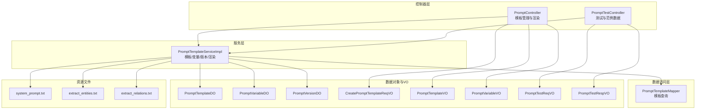
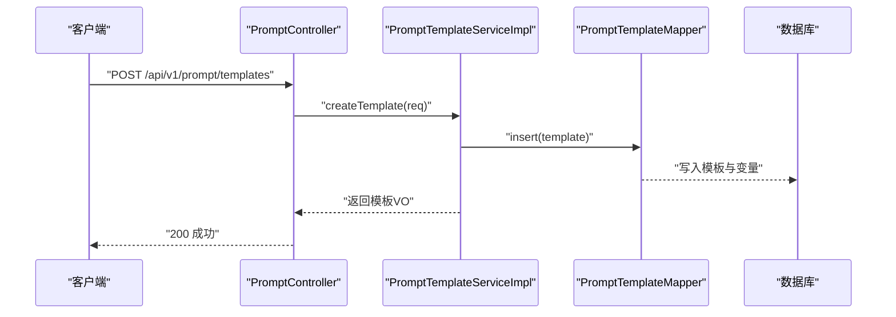
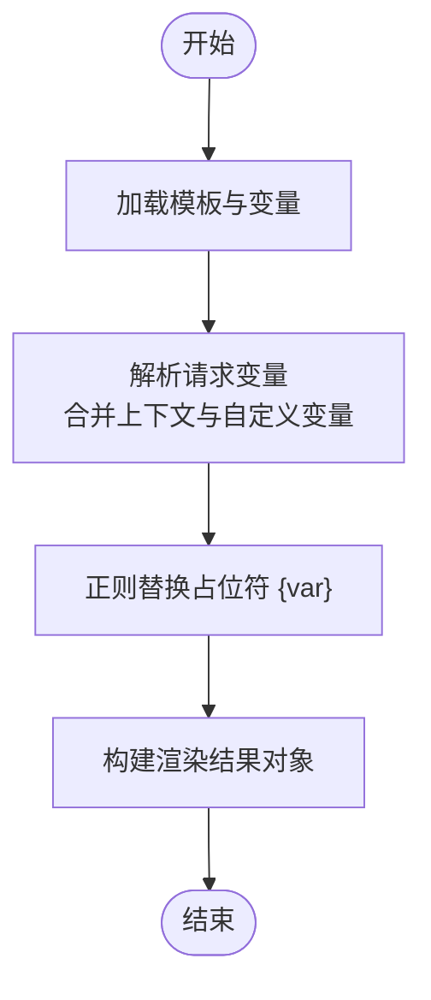
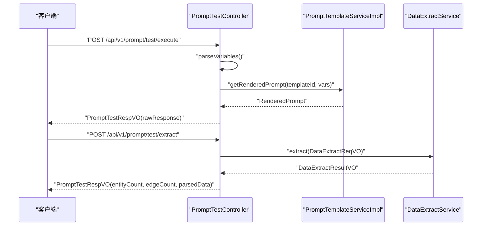
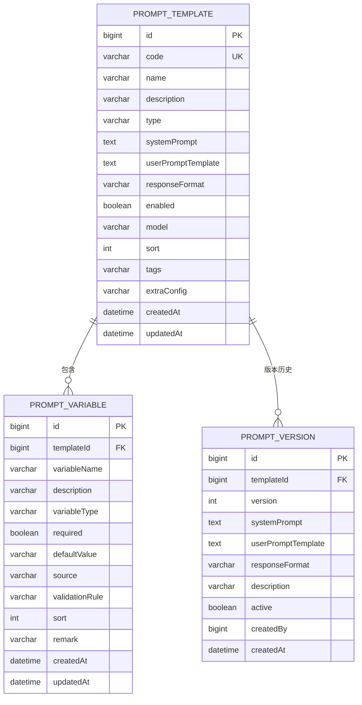
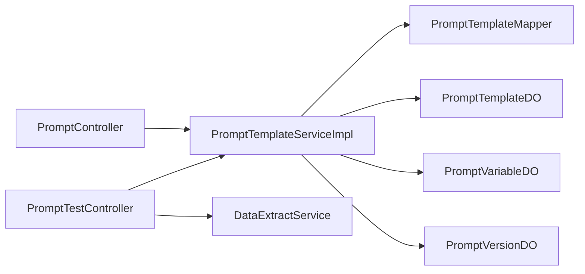

# 提示词接口

<!--<cite>
**本文引用的文件**
- [PromptController.java](file://graphiti-module-core/src/main/java/com/graphiti/module/graphiti/controller/admin/PromptController.java)
- [PromptTestController.java](file://graphiti-module-core/src/main/java/com/graphiti/module/graphiti/controller/admin/PromptTestController.java)
- [PromptTemplateService.java](file://graphiti-module-core/src/main/java/com/graphiti/module/graphiti/service/PromptTemplateService.java)
- [PromptTemplateServiceImpl.java](file://graphiti-module-core/src/main/java/com/graphiti/module/graphiti/service/impl/PromptTemplateServiceImpl.java)
- [PromptTemplateDO.java](file://graphiti-module-core/src/main/java/com/graphiti/module/graphiti/dal/dataobject/PromptTemplateDO.java)
- [PromptVariableDO.java](file://graphiti-module-core/src/main/java/com/graphiti/module/graphiti/dal/dataobject/PromptVariableDO.java)
- [PromptVersionDO.java](file://graphiti-module-core/src/main/java/com/graphiti/module/graphiti/dal/dataobject/PromptVersionDO.java)
- [PromptTemplateMapper.java](file://graphiti-module-core/src/main/java/com/graphiti/module/graphiti/dal/mysql/PromptTemplateMapper.java)
- [CreatePromptTemplateReqVO.java](file://graphiti-module-core/src/main/java/com/graphiti/module/graphiti/vo/prompts/CreatePromptTemplateReqVO.java)
- [PromptTemplateVO.java](file://graphiti-module-core/src/main/java/com/graphiti/module/graphiti/vo/prompts/PromptTemplateVO.java)
- [PromptVariableVO.java](file://graphiti-module-core/src/main/java/com/graphiti/module/graphiti/vo/prompts/PromptVariableVO.java)
- [PromptTestReqVO.java](file://graphiti-module-core/src/main/java/com/graphiti/module/graphiti/vo/prompts/PromptTestReqVO.java)
- [PromptTestRespVO.java](file://graphiti-module-core/src/main/java/com/graphiti/module/graphiti/vo/prompts/PromptTestRespVO.java)
- [system_prompt.txt](file://graphiti-module-core/src/main/resources/prompts/system_prompt.txt)
- [extract_entities.txt](file://graphiti-module-core/src/main/resources/prompts/extract_entities.txt)
- [extract_relations.txt](file://graphiti-module-core/src/main/resources/prompts/extract_relations.txt)
</cite>-->

## 目录
1. [简介](#简介)
2. [项目结构](#项目结构)
3. [核心组件](#核心组件)
4. [架构总览](#架构总览)
5. [详细组件分析](#详细组件分析)
6. [依赖分析](#依赖分析)
7. [性能考虑](#性能考虑)
8. [故障排查指南](#故障排查指南)
9. [结论](#结论)
10. [附录](#附录)

## 简介
本文件为 ontograph-java 的提示词管理接口提供完整的 API 文档与技术说明，覆盖提示词模板的创建、查询、更新、删除、启用/禁用、版本管理与回滚；同时涵盖提示词变量处理、模板渲染、测试执行、范例数据生成等能力。文档还包含提示词与 LLM 集成的工作流、参数配置建议、最佳实践、常见模式、调试技巧以及面向 AI 应用开发者与提示词工程师的实用参考。

## 项目结构
提示词相关的核心代码位于模块 graphiti-module-core 中，采用分层架构：
- 控制器层：对外暴露 REST API，负责请求接收、鉴权与响应封装
- 服务层：业务逻辑编排，包括模板管理、变量处理、渲染、版本控制
- 数据访问层：MyBatis Mapper，负责与数据库交互
- 数据对象与 VO：DO/VO 映射，承载持久化与传输结构
- 资源文件：内置提示词模板片段，便于快速构建系统提示词

图表来源
- [PromptController.java:1-242](file://graphiti-module-core/src/main/java/com/graphiti/module/graphiti/controller/admin/PromptController.java#L1-242)
- [PromptTestController.java:1-349](file://graphiti-module-core/src/main/java/com/graphiti/module/graphiti/controller/admin/PromptTestController.java#L1-349)
- [PromptTemplateServiceImpl.java:1-403](file://graphiti-module-core/src/main/java/com/graphiti/module/graphiti/service/impl/PromptTemplateServiceImpl.java#L1-403)
- [PromptTemplateMapper.java:1-40](file://graphiti-module-core/src/main/java/com/graphiti/module/graphiti/dal/mysql/PromptTemplateMapper.java#L1-40)
- [PromptTemplateDO.java:1-99](file://graphiti-module-core/src/main/java/com/graphiti/module/graphiti/dal/dataobject/PromptTemplateDO.java#L1-99)
- [PromptVariableDO.java:1-79](file://graphiti-module-core/src/main/java/com/graphiti/module/graphiti/dal/dataobject/PromptVariableDO.java#L1-79)
- [PromptVersionDO.java:1-66](file://graphiti-module-core/src/main/java/com/graphiti/module/graphiti/dal/dataobject/PromptVersionDO.java#L1-66)
- [CreatePromptTemplateReqVO.java:1-64](file://graphiti-module-core/src/main/java/com/graphiti/module/graphiti/vo/prompts/CreatePromptTemplateReqVO.java#L1-64)
- [PromptTemplateVO.java:1-70](file://graphiti-module-core/src/main/java/com/graphiti/module/graphiti/vo/prompts/PromptTemplateVO.java#L1-70)
- [PromptVariableVO.java:1-50](file://graphiti-module-core/src/main/java/com/graphiti/module/graphiti/vo/prompts/PromptVariableVO.java#L1-50)
- [PromptTestReqVO.java:1-40](file://graphiti-module-core/src/main/java/com/graphiti/module/graphiti/vo/prompts/PromptTestReqVO.java#L1-40)
- [PromptTestRespVO.java:1-54](file://graphiti-module-core/src/main/java/com/graphiti/module/graphiti/vo/prompts/PromptTestRespVO.java#L1-54)
- [system_prompt.txt:1-11](file://graphiti-module-core/src/main/resources/prompts/system_prompt.txt#L1-11)
- [extract_entities.txt:1-28](file://graphiti-module-core/src/main/resources/prompts/extract_entities.txt#L1-28)
- [extract_relations.txt:1-33](file://graphiti-module-core/src/main/resources/prompts/extract_relations.txt#L1-33)

章节来源
- [PromptController.java:1-242](file://graphiti-module-core/src/main/java/com/graphiti/module/graphiti/controller/admin/PromptController.java#L1-242)
- [PromptTestController.java:1-349](file://graphiti-module-core/src/main/java/com/graphiti/module/graphiti/controller/admin/PromptTestController.java#L1-349)

## 核心组件
- 提示词模板控制器：提供模板的增删改查、启用/禁用、类型查询、渲染预览、版本管理与回滚等接口
- 提示词测试控制器：提供测试执行、提取效果测试、范例数据生成等能力
- 提示词模板服务：定义模板管理、变量、渲染、版本控制等接口，并在实现中完成变量替换、版本创建与回滚
- 数据对象与 VO：定义模板、变量、版本的持久化结构与传输结构
- 资源文件：内置系统提示词与抽取模板片段，便于快速组装提示词

章节来源
- [PromptController.java:35-241](file://graphiti-module-core/src/main/java/com/graphiti/module/graphiti/controller/admin/PromptController.java#L35-241)
- [PromptTestController.java:46-206](file://graphiti-module-core/src/main/java/com/graphiti/module/graphiti/controller/admin/PromptTestController.java#L46-206)
- [PromptTemplateService.java:14-109](file://graphiti-module-core/src/main/java/com/graphiti/module/graphiti/service/PromptTemplateService.java#L14-109)
- [PromptTemplateServiceImpl.java:45-334](file://graphiti-module-core/src/main/java/com/graphiti/module/graphiti/service/impl/PromptTemplateServiceImpl.java#L45-334)
- [PromptTemplateDO.java:14-98](file://graphiti-module-core/src/main/java/com/graphiti/module/graphiti/dal/dataobject/PromptTemplateDO.java#L14-98)
- [PromptVariableDO.java:14-78](file://graphiti-module-core/src/main/java/com/graphiti/module/graphiti/dal/dataobject/PromptVariableDO.java#L14-78)
- [PromptVersionDO.java:14-65](file://graphiti-module-core/src/main/java/com/graphiti/module/graphiti/dal/dataobject/PromptVersionDO.java#L14-65)

## 架构总览
提示词接口遵循典型的三层架构：控制器负责路由与鉴权，服务层编排业务，DAO 层访问数据库。变量替换采用正则匹配，版本管理通过独立表维护历史快照，测试控制器在执行前先进行变量解析与模板渲染，再进行实体/关系抽取或范例数据生成。

图表来源
- [PromptController.java:42-50](file://graphiti-module-core/src/main/java/com/graphiti/module/graphiti/controller/admin/PromptController.java#L42-L50)
- [PromptTemplateServiceImpl.java:45-94](file://graphiti-module-core/src/main/java/com/graphiti/module/graphiti/service/impl/PromptTemplateServiceImpl.java#L45-L94)
- [PromptTemplateMapper.java:14-39](file://graphiti-module-core/src/main/java/com/graphiti/module/graphiti/dal/mysql/PromptTemplateMapper.java#L14-L39)

## 详细组件分析

### 模板管理 API
- 创建模板
  - 方法与路径：POST /api/v1/prompt/templates
  - 请求体：CreatePromptTemplateReqVO
  - 响应体：PromptTemplateVO
  - 关键点：校验模板编码唯一性；保存模板与变量；创建初始版本
- 更新模板
  - 方法与路径：PUT /api/v1/prompt/templates/{id}
  - 路径参数：id
  - 请求体：CreatePromptTemplateReqVO（含 id）
  - 响应体：PromptTemplateVO
  - 关键点：若编码变更需再次校验唯一性；更新变量前先删除旧变量
- 删除模板
  - 方法与路径：DELETE /api/v1/prompt/templates/{id}
  - 路径参数：id
  - 响应体：空
  - 关键点：级联删除变量与版本
- 获取模板详情
  - 方法与路径：GET /api/v1/prompt/templates/{id}
  - 路径参数：id
  - 响应体：PromptTemplateVO
- 根据编码获取模板
  - 方法与路径：GET /api/v1/prompt/templates/code/{code}
  - 路径参数：code
  - 响应体：PromptTemplateVO
- 获取所有模板
  - 方法与路径：GET /api/v1/prompt/templates
  - 响应体：List<PromptTemplateVO>
- 根据类型获取模板列表
  - 方法与路径：GET /api/v1/prompt/templates/type/{type}
  - 路径参数：type
  - 响应体：List<PromptTemplateVO>
- 启用/禁用模板
  - 方法与路径：PUT /api/v1/prompt/templates/{id}/toggle
  - 路径参数：id
  - 参数：enabled
  - 响应体：空

章节来源
- [PromptController.java:37-151](file://graphiti-module-core/src/main/java/com/graphiti/module/graphiti/controller/admin/PromptController.java#L37-L151)
- [CreatePromptTemplateReqVO.java:15-63](file://graphiti-module-core/src/main/java/com/graphiti/module/graphiti/vo/prompts/CreatePromptTemplateReqVO.java#L15-63)
- [PromptTemplateVO.java:15-69](file://graphiti-module-core/src/main/java/com/graphiti/module/graphiti/vo/prompts/PromptTemplateVO.java#L15-69)

### 版本管理 API
- 创建新版本
  - 方法与路径：POST /api/v1/prompt/templates/{id}/versions
  - 路径参数：id
  - 参数：description（可选）
  - 响应体：空
  - 关键点：创建新版本时将当前活跃版本置为非活跃，并记录新版本
- 获取版本历史
  - 方法与路径：GET /api/v1/prompt/templates/{id}/versions
  - 路径参数：id
  - 响应体：List<PromptVersionDO>
- 回滚到指定版本
  - 方法与路径：POST /api/v1/prompt/templates/{id}/rollback
  - 路径参数：id
  - 参数：version
  - 响应体：空
  - 关键点：更新模板内容为目标版本，并将目标版本设为活跃，其余版本置为非活跃

章节来源
- [PromptController.java:155-198](file://graphiti-module-core/src/main/java/com/graphiti/module/graphiti/controller/admin/PromptController.java#L155-L198)
- [PromptTemplateServiceImpl.java:264-334](file://graphiti-module-core/src/main/java/com/graphiti/module/graphiti/service/impl/PromptTemplateServiceImpl.java#L264-L334)
- [PromptVersionDO.java:14-65](file://graphiti-module-core/src/main/java/com/graphiti/module/graphiti/dal/dataobject/PromptVersionDO.java#L14-65)

### 渲染与测试 API
- 渲染提示词（预览）
  - 方法与路径：POST /api/v1/prompt/templates/{id}/render
  - 路径参数：id
  - 请求体：Map<String, Object>（变量）
  - 响应体：Map<String, String>（包含 systemPrompt、userPrompt、responseFormat）
  - 关键点：基于模板 ID 获取模板并进行变量替换
- 测试提示词模板
  - 方法与路径：POST /api/v1/prompt/test/execute
  - 请求体：PromptTestReqVO
  - 响应体：PromptTestRespVO
  - 关键点：解析变量；按模板 ID 或编码渲染；返回原始响应与耗时
- 测试提取效果
  - 方法与路径：POST /api/v1/prompt/test/extract
  - 请求体：PromptTestReqVO
  - 响应体：PromptTestRespVO
  - 关键点：构建 DataExtractReqVO 并调用抽取服务；返回实体/关系统计与解析结果
- 生成范例数据
  - 方法与路径：POST /api/v1/prompt/test/generate-sample
  - 请求体：GenerateSampleDataReqVO（由前端构造）
  - 响应体：GenerateSampleDataRespVO
  - 关键点：根据模板类型与数据类型生成提示词，调用 LLM 生成样本并解析

章节来源
- [PromptController.java:202-220](file://graphiti-module-core/src/main/java/com/graphiti/module/graphiti/controller/admin/PromptController.java#L202-L220)
- [PromptTestController.java:46-158](file://graphiti-module-core/src/main/java/com/graphiti/module/graphiti/controller/admin/PromptTestController.java#L46-L158)
- [PromptTestReqVO.java:12-39](file://graphiti-module-core/src/main/java/com/graphiti/module/graphiti/vo/prompts/PromptTestReqVO.java#L12-39)
- [PromptTestRespVO.java:12-52](file://graphiti-module-core/src/main/java/com/graphiti/module/graphiti/vo/prompts/PromptTestRespVO.java#L12-52)

### 提示词变量处理与模板渲染
- 变量定义与来源
  - PromptVariableDO/PromptVariableVO 支持变量名、类型、是否必需、默认值、来源（上下文/静态/动态）、验证规则、排序与备注
- 变量替换策略
  - 实现使用正则匹配模板中的占位符 {variable}，遍历传入变量映射进行替换
- 渲染结果
  - 返回系统提示词、用户提示词、响应格式与模型字段的组合对象

图表来源
- [PromptTemplateServiceImpl.java:241-260](file://graphiti-module-core/src/main/java/com/graphiti/module/graphiti/service/impl/PromptTemplateServiceImpl.java#L241-L260)
- [PromptVariableDO.java:14-78](file://graphiti-module-core/src/main/java/com/graphiti/module/graphiti/dal/dataobject/PromptVariableDO.java#L14-78)
- [PromptVariableVO.java:13-49](file://graphiti-module-core/src/main/java/com/graphiti/module/graphiti/vo/prompts/PromptVariableVO.java#L13-49)

章节来源
- [PromptTemplateServiceImpl.java:213-236](file://graphiti-module-core/src/main/java/com/graphiti/module/graphiti/service/impl/PromptTemplateServiceImpl.java#L213-L236)
- [PromptTemplateService.java:63-108](file://graphiti-module-core/src/main/java/com/graphiti/module/graphiti/service/PromptTemplateService.java#L63-L108)

### 测试执行流程
- 变量解析：优先使用输入内容作为 episode_content，可选添加 context_content；自定义变量以 JSON 形式解析并合并
- 渲染：支持按模板 ID 或模板编码进行渲染
- 抽取：将内容与模板 ID 传递给抽取服务，返回实体/关系统计与解析结果
- 范例数据：根据模板类型与数据类型生成提示词，调用 LLM 生成样本并解析 JSON

图表来源
- [PromptTestController.java:54-157](file://graphiti-module-core/src/main/java/com/graphiti/module/graphiti/controller/admin/PromptTestController.java#L54-L157)
- [PromptTemplateServiceImpl.java:229-236](file://graphiti-module-core/src/main/java/com/graphiti/module/graphiti/service/impl/PromptTemplateServiceImpl.java#L229-L236)

章节来源
- [PromptTestController.java:210-229](file://graphiti-module-core/src/main/java/com/graphiti/module/graphiti/controller/admin/PromptTestController.java#L210-L229)

### 数据模型

图表来源
- [PromptTemplateDO.java:14-98](file://graphiti-module-core/src/main/java/com/graphiti/module/graphiti/dal/dataobject/PromptTemplateDO.java#L14-98)
- [PromptVariableDO.java:14-78](file://graphiti-module-core/src/main/java/com/graphiti/module/graphiti/dal/dataobject/PromptVariableDO.java#L14-78)
- [PromptVersionDO.java:14-65](file://graphiti-module-core/src/main/java/com/graphiti/module/graphiti/dal/dataobject/PromptVersionDO.java#L14-65)

章节来源
- [PromptTemplateDO.java:14-98](file://graphiti-module-core/src/main/java/com/graphiti/module/graphiti/dal/dataobject/PromptTemplateDO.java#L14-98)
- [PromptVariableDO.java:14-78](file://graphiti-module-core/src/main/java/com/graphiti/module/graphiti/dal/dataobject/PromptVariableDO.java#L14-78)
- [PromptVersionDO.java:14-65](file://graphiti-module-core/src/main/java/com/graphiti/module/graphiti/dal/dataobject/PromptVersionDO.java#L14-65)

## 依赖分析
- 控制器依赖服务接口，服务实现依赖 Mapper 与 DO/VO
- 变量替换依赖正则表达式，版本管理依赖版本表的活动标记
- 测试控制器依赖服务接口与抽取服务，抽取服务进一步依赖底层抽取实现

图表来源
- [PromptController.java:32-33](file://graphiti-module-core/src/main/java/com/graphiti/module/graphiti/controller/admin/PromptController.java#L32-L33)
- [PromptTestController.java:38-42](file://graphiti-module-core/src/main/java/com/graphiti/module/graphiti/controller/admin/PromptTestController.java#L38-L42)
- [PromptTemplateServiceImpl.java:36-39](file://graphiti-module-core/src/main/java/com/graphiti/module/graphiti/service/impl/PromptTemplateServiceImpl.java#L36-L39)

章节来源
- [PromptTemplateServiceImpl.java:36-39](file://graphiti-module-core/src/main/java/com/graphiti/module/graphiti/service/impl/PromptTemplateServiceImpl.java#L36-L39)

## 性能考虑
- 变量替换：正则匹配在大模板上可能带来开销，建议控制模板大小与变量数量，必要时缓存常用模板
- 版本管理：版本表仅保留关键字段，避免存储冗余内容；回滚时批量更新其他版本状态
- 测试执行：尽量复用渲染结果，避免重复解析变量；对抽取结果进行必要的分页与限流
- 数据序列化：范例数据生成与抽取结果序列化使用 Jackson，注意异常分支的日志与降级

## 故障排查指南
- 模板不存在：创建/更新/删除/渲染/版本操作均会检查模板是否存在，若不存在将抛出异常
- 编码冲突：创建/更新模板时会校验模板编码唯一性
- 变量解析失败：自定义变量为非法 JSON 时会记录警告并跳过该部分
- 抽取错误：抽取服务返回的错误列表会拼接至响应的错误信息中
- LLM 调用：范例数据生成的 LLM 调用为占位实现，需在生产环境接入真实 LLM 服务

章节来源
- [PromptTemplateServiceImpl.java:48-52](file://graphiti-module-core/src/main/java/com/graphiti/module/graphiti/service/impl/PromptTemplateServiceImpl.java#L48-L52)
- [PromptTestController.java:148-152](file://graphiti-module-core/src/main/java/com/graphiti/module/graphiti/controller/admin/PromptTestController.java#L148-L152)
- [PromptTestController.java:283-287](file://graphiti-module-core/src/main/java/com/graphiti/module/graphiti/controller/admin/PromptTestController.java#L283-L287)

## 结论
ontograph-java 的提示词接口提供了从模板管理、变量处理、渲染预览到测试执行与版本回滚的完整能力。通过清晰的分层设计与数据模型，开发者可以高效地构建与维护提示词模板，并将其与抽取与 LLM 能力集成。建议在生产环境中完善 LLM 调用链路、增加缓存与限流策略，并持续优化变量与模板结构以提升性能与可维护性。

## 附录

### 提示词与 LLM 集成工作流
- 系统提示词：可从资源文件加载通用系统提示词，结合模板中的系统提示词与用户提示词模板共同构成最终提示
- 模型选择：模板可配置模型字段，测试时可覆盖模型参数（如温度、最大 tokens）
- 响应格式：模板可定义响应格式（如 JSON Schema），测试时可返回原始响应与解析后的结构化数据

章节来源
- [system_prompt.txt:1-11](file://graphiti-module-core/src/main/resources/prompts/system_prompt.txt#L1-11)
- [extract_entities.txt:1-28](file://graphiti-module-core/src/main/resources/prompts/extract_entities.txt#L1-28)
- [extract_relations.txt:1-33](file://graphiti-module-core/src/main/resources/prompts/extract_relations.txt#L1-33)
- [PromptTemplateServiceImpl.java:222-227](file://graphiti-module-core/src/main/java/com/graphiti/module/graphiti/service/impl/PromptTemplateServiceImpl.java#L222-L227)
- [PromptTestReqVO.java:31-39](file://graphiti-module-core/src/main/java/com/graphiti/module/graphiti/vo/prompts/PromptTestReqVO.java#L31-L39)

### 最佳实践与常见模式
- 模板编码：全局唯一且语义明确，便于按编码直接渲染
- 变量来源：区分上下文变量与静态/动态变量，减少硬编码
- 响应格式：明确 JSON Schema 或格式说明，便于下游解析
- 版本管理：每次重大修改创建新版本，保留历史快照，支持快速回滚
- 测试先行：先用测试接口验证变量与模板渲染，再进行抽取与上线

### 实际应用场景示例
- 实体抽取：使用实体抽取模板，传入文本内容与上下文，查看实体与关系统计
- 关系抽取：使用关系抽取模板，传入抽取结果，验证关系类型与事实陈述
- 范例数据：根据模板类型与数据类型生成测试样本，辅助前端展示与后端验证