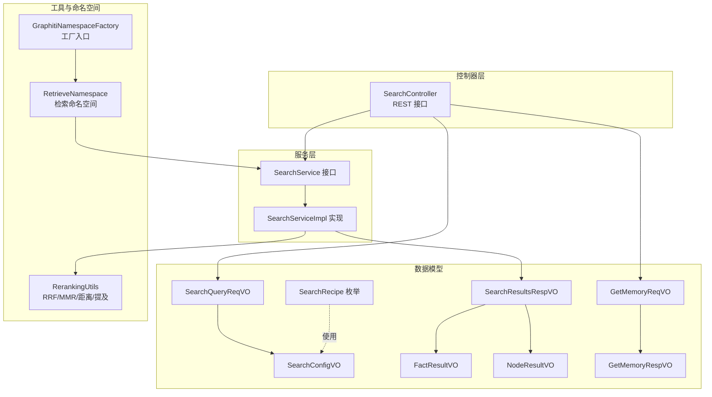
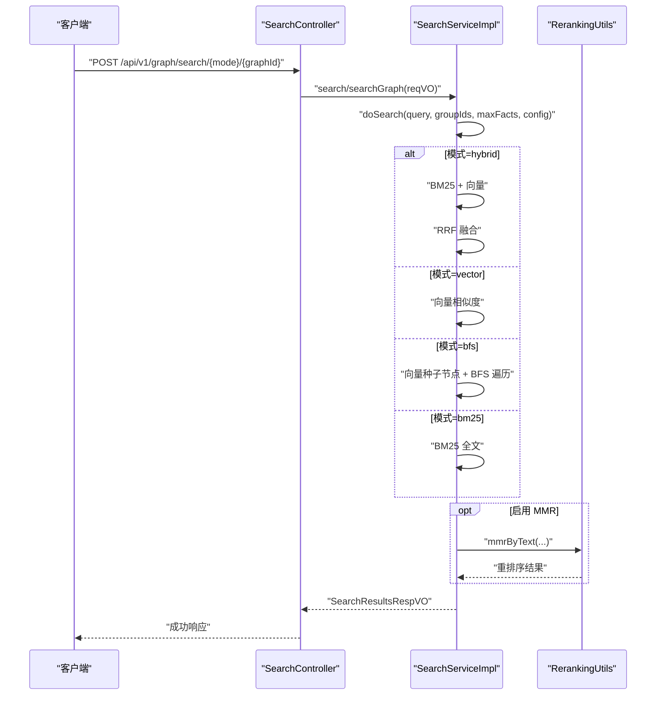
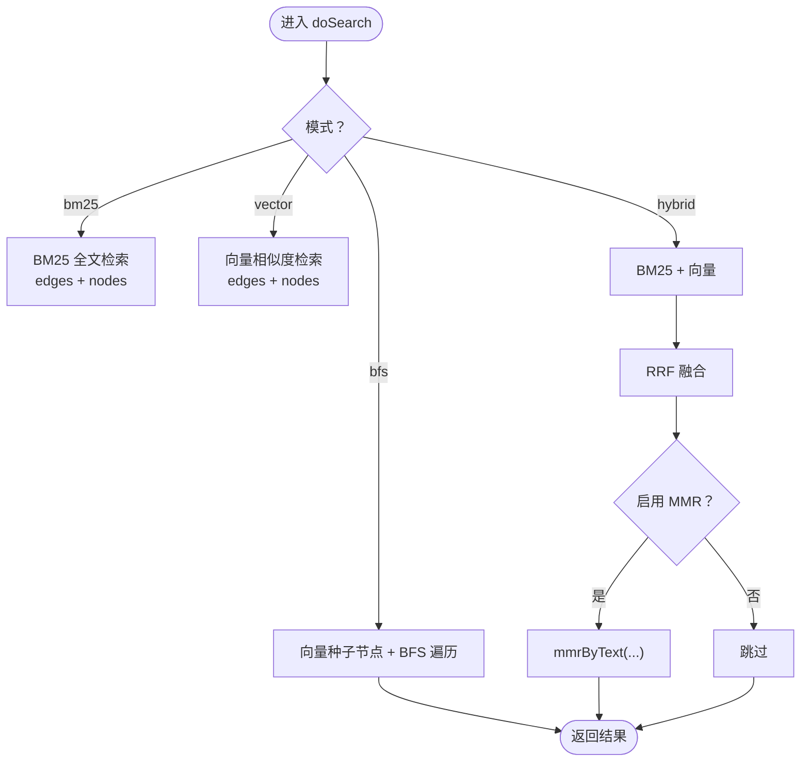
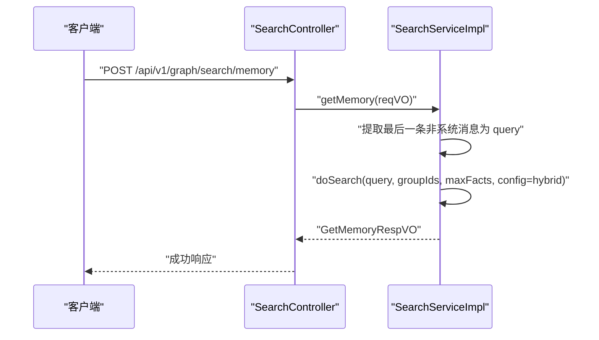
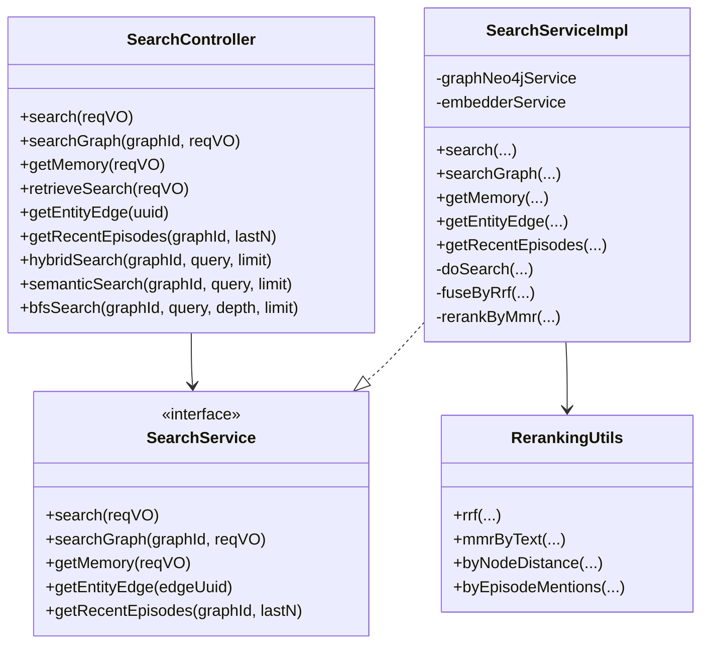

# 搜索接口

<!--<cite>
**本文引用的文件**
- [SearchController.java](file://graphiti-module-core/src/main/java/com/graphiti/module/graphiti/controller/admin/SearchController.java)
- [SearchService.java](file://graphiti-module-core/src/main/java/com/graphiti/module/graphiti/service/SearchService.java)
- [SearchServiceImpl.java](file://graphiti-module-core/src/main/java/com/graphiti/module/graphiti/service/impl/SearchServiceImpl.java)
- [SearchQueryReqVO.java](file://graphiti-module-core/src/main/java/com/graphiti/module/graphiti/vo/search/SearchQueryReqVO.java)
- [SearchConfigVO.java](file://graphiti-module-core/src/main/java/com/graphiti/module/graphiti/vo/search/SearchConfigVO.java)
- [SearchResultsRespVO.java](file://graphiti-module-core/src/main/java/com/graphiti/module/graphiti/vo/search/SearchResultsRespVO.java)
- [FactResultVO.java](file://graphiti-module-core/src/main/java/com/graphiti/module/graphiti/vo/search/FactResultVO.java)
- [NodeResultVO.java](file://graphiti-module-core/src/main/java/com/graphiti/module/graphiti/vo/search/NodeResultVO.java)
- [GetMemoryReqVO.java](file://graphiti-module-core/src/main/java/com/graphiti/module/graphiti/vo/search/GetMemoryReqVO.java)
- [GetMemoryRespVO.java](file://graphiti-module-core/src/main/java/com/graphiti/module/graphiti/vo/search/GetMemoryRespVO.java)
- [SearchRecipe.java](file://graphiti-module-core/src/main/java/com/graphiti/module/graphiti/vo/search/SearchRecipe.java)
- [RerankingUtils.java](file://graphiti-module-core/src/main/java/com/graphiti/module/graphiti/util/RerankingUtils.java)
- [RetrieveNamespace.java](file://graphiti-module-core/src/main/java/com/graphiti/module/graphiti/namespace/RetrieveNamespace.java)
- [GraphitiNamespaceFactory.java](file://graphiti-module-core/src/main/java/com/graphiti/module/graphiti/namespace/GraphitiNamespaceFactory.java)
</cite>-->

## 目录
1. [简介](#简介)
2. [项目结构](#项目结构)
3. [核心组件](#核心组件)
4. [架构总览](#架构总览)
5. [详细组件分析](#详细组件分析)
6. [依赖分析](#依赖分析)
7. [性能考虑](#性能考虑)
8. [故障排查指南](#故障排查指南)
9. [结论](#结论)
10. [附录](#附录)

## 简介
本文件为 Graphiti-Java 的搜索接口专业 API 文档，覆盖以下能力：
- 全局搜索与图谱级搜索
- 混合搜索（BM25 全文 + 向量相似度 + RRF 融合）
- 语义搜索（向量相似度）
- 图遍历搜索（BFS）
- 记忆检索（基于对话历史重建上下文）
- 搜索结果重排序（MMR、按节点距离、按 Episode 提及次数）
- 搜索配方（SearchRecipe）使用指南与最佳实践
- 搜索性能优化与索引策略建议
- 实际搜索场景示例与参数调优建议

## 项目结构
搜索相关代码主要位于模块 core 的 controller、service、vo、util、namespace 包中，采用分层架构：
- 控制器层：对外暴露 REST 接口
- 服务层：实现搜索策略与重排序逻辑
- VO 层：请求/响应数据模型
- 工具层：重排序与相似度计算
- 命名空间层：统一入口封装检索能力

图表来源
- [SearchController.java:1-138](file://graphiti-module-core/src/main/java/com/graphiti/module/graphiti/controller/admin/SearchController.java#L1-L138)
- [SearchService.java:1-54](file://graphiti-module-core/src/main/java/com/graphiti/module/graphiti/service/SearchService.java#L1-L54)
- [SearchServiceImpl.java:1-520](file://graphiti-module-core/src/main/java/com/graphiti/module/graphiti/service/impl/SearchServiceImpl.java#L1-L520)
- [SearchQueryReqVO.java:1-33](file://graphiti-module-core/src/main/java/com/graphiti/module/graphiti/vo/search/SearchQueryReqVO.java#L1-L33)
- [SearchConfigVO.java:1-40](file://graphiti-module-core/src/main/java/com/graphiti/module/graphiti/vo/search/SearchConfigVO.java#L1-L40)
- [SearchResultsRespVO.java:1-28](file://graphiti-module-core/src/main/java/com/graphiti/module/graphiti/vo/search/SearchResultsRespVO.java#L1-L28)
- [FactResultVO.java:1-59](file://graphiti-module-core/src/main/java/com/graphiti/module/graphiti/vo/search/FactResultVO.java#L1-L59)
- [NodeResultVO.java:1-31](file://graphiti-module-core/src/main/java/com/graphiti/module/graphiti/vo/search/NodeResultVO.java#L1-L31)
- [GetMemoryReqVO.java:1-29](file://graphiti-module-core/src/main/java/com/graphiti/module/graphiti/vo/search/GetMemoryReqVO.java#L1-L29)
- [GetMemoryRespVO.java:1-25](file://graphiti-module-core/src/main/java/com/graphiti/module/graphiti/vo/search/GetMemoryRespVO.java#L1-L25)
- [SearchRecipe.java:1-59](file://graphiti-module-core/src/main/java/com/graphiti/module/graphiti/vo/search/SearchRecipe.java#L1-L59)
- [RerankingUtils.java:1-386](file://graphiti-module-core/src/main/java/com/graphiti/module/graphiti/util/RerankingUtils.java#L1-L386)
- [RetrieveNamespace.java:1-75](file://graphiti-module-core/src/main/java/com/graphiti/module/graphiti/namespace/RetrieveNamespace.java#L1-L75)
- [GraphitiNamespaceFactory.java:1-144](file://graphiti-module-core/src/main/java/com/graphiti/module/graphiti/namespace/GraphitiNamespaceFactory.java#L1-L144)

章节来源
- [SearchController.java:1-138](file://graphiti-module-core/src/main/java/com/graphiti/module/graphiti/controller/admin/SearchController.java#L1-L138)
- [SearchServiceImpl.java:1-520](file://graphiti-module-core/src/main/java/com/graphiti/module/graphiti/service/impl/SearchServiceImpl.java#L1-L520)

## 核心组件
- 控制器：提供全局搜索、图谱搜索、记忆检索、便捷检索接口（混合/BM25/向量/BFS），以及检索入口与实体边事实获取。
- 服务：实现 doSearch 主流程，按模式执行 BM25、向量、BFS；使用 RRF 融合；可选 MMR 重排序；提供按节点距离与按 Episode 提及次数的重排序。
- 数据模型：请求体包含查询、限定图谱组、最大返回条数、是否启用重排序、搜索配置；响应体包含事实列表、节点列表及统计信息。
- 工具：提供 RRF、MMR、节点距离、Episode 提及次数等重排序工具。
- 命名空间：统一检索入口，便于业务侧以命名空间方式调用。

章节来源
- [SearchController.java:33-137](file://graphiti-module-core/src/main/java/com/graphiti/module/graphiti/controller/admin/SearchController.java#L33-L137)
- [SearchServiceImpl.java:26-148](file://graphiti-module-core/src/main/java/com/graphiti/module/graphiti/service/impl/SearchServiceImpl.java#L26-L148)
- [SearchQueryReqVO.java:14-32](file://graphiti-module-core/src/main/java/com/graphiti/module/graphiti/vo/search/SearchQueryReqVO.java#L14-L32)
- [SearchConfigVO.java:13-39](file://graphiti-module-core/src/main/java/com/graphiti/module/graphiti/vo/search/SearchConfigVO.java#L13-L39)
- [SearchResultsRespVO.java:13-27](file://graphiti-module-core/src/main/java/com/graphiti/module/graphiti/vo/search/SearchResultsRespVO.java#L13-L27)
- [RerankingUtils.java:32-314](file://graphiti-module-core/src/main/java/com/graphiti/module/graphiti/util/RerankingUtils.java#L32-L314)
- [RetrieveNamespace.java:27-73](file://graphiti-module-core/src/main/java/com/graphiti/module/graphiti/namespace/RetrieveNamespace.java#L27-L73)

## 架构总览
下图展示搜索请求从控制器到服务再到工具的调用链路，以及不同搜索模式的分支。

图表来源
- [SearchController.java:33-137](file://graphiti-module-core/src/main/java/com/graphiti/module/graphiti/controller/admin/SearchController.java#L33-L137)
- [SearchServiceImpl.java:94-148](file://graphiti-module-core/src/main/java/com/graphiti/module/graphiti/service/impl/SearchServiceImpl.java#L94-L148)
- [RerankingUtils.java:188-254](file://graphiti-module-core/src/main/java/com/graphiti/module/graphiti/util/RerankingUtils.java#L188-L254)

## 详细组件分析

### REST 接口总览
- 全局搜索：POST /api/v1/graph/search/global
- 图谱搜索：POST /api/v1/graph/search/graph/{graphId}
- 记忆检索：POST /api/v1/graph/search/memory
- 检索入口：POST /api/v1/graph/search/retrieve/search
- 获取指定边事实：GET /api/v1/graph/search/retrieve/entity-edge/{uuid}
- 获取最近 Episode：GET /api/v1/graph/search/retrieve/episodes/{graphId}?last_n=...
- 便捷检索：
  - 混合检索：POST /api/v1/graph/search/hybrid/{graphId}?query=&limit=
  - 语义搜索：POST /api/v1/graph/search/semantic/{graphId}?query=&limit=
  - BFS 搜索：POST /api/v1/graph/search/bfs/{graphId}?query=&depth=&limit=

章节来源
- [SearchController.java:33-137](file://graphiti-module-core/src/main/java/com/graphiti/module/graphiti/controller/admin/SearchController.java#L33-L137)

### 请求与响应模型
- 请求体 SearchQueryReqVO
  - 字段：query、groupIds、maxFacts、enableRerank、config
- 搜索配置 SearchConfigVO
  - 字段：mode、bm25Weight、vectorWeight、rrfK、mmrLambda、enableMmr、bfsDepth、bfsMaxNeighbors
- 响应体 SearchResultsRespVO
  - 字段：facts、totalCount、nodes、nodeCount
- 结果项
  - 边事实 FactResultVO：uuid、name、fact、sourceNodeUuid、targetNodeUuid、groupId、createdAt、validAt、invalidAt、score、relevance、expiredAt、episodes
  - 节点 NodeResultVO：uuid、name、labels、summary、score
- 记忆检索
  - 请求 GetMemoryReqVO：messages（必填）、groupIds、maxFacts
  - 响应 GetMemoryRespVO：facts、entities、context

章节来源
- [SearchQueryReqVO.java:14-32](file://graphiti-module-core/src/main/java/com/graphiti/module/graphiti/vo/search/SearchQueryReqVO.java#L14-L32)
- [SearchConfigVO.java:13-39](file://graphiti-module-core/src/main/java/com/graphiti/module/graphiti/vo/search/SearchConfigVO.java#L13-L39)
- [SearchResultsRespVO.java:13-27](file://graphiti-module-core/src/main/java/com/graphiti/module/graphiti/vo/search/SearchResultsRespVO.java#L13-L27)
- [FactResultVO.java:13-58](file://graphiti-module-core/src/main/java/com/graphiti/module/graphiti/vo/search/FactResultVO.java#L13-L58)
- [NodeResultVO.java:13-30](file://graphiti-module-core/src/main/java/com/graphiti/module/graphiti/vo/search/NodeResultVO.java#L13-L30)
- [GetMemoryReqVO.java:15-28](file://graphiti-module-core/src/main/java/com/graphiti/module/graphiti/vo/search/GetMemoryReqVO.java#L15-L28)
- [GetMemoryRespVO.java:13-24](file://graphiti-module-core/src/main/java/com/graphiti/module/graphiti/vo/search/GetMemoryRespVO.java#L13-L24)

### 搜索策略与流程
- 模式控制
  - bm25：仅 BM25 全文检索
  - vector：仅向量相似度
  - hybrid：BM25 + 向量 + RRF 融合
  - bfs：基于向量种子节点的图遍历
- RRF 融合
  - 将两个列表的排名按倒数排名公式融合，k 默认 60
- MMR 重排序
  - 基于文本相似度与多样性平衡，lambda 控制相关性与多样性的权衡
- BFS 遍历
  - 先用向量搜索获取种子节点，再按深度与每节点最大邻居数进行广度优先遍历

图表来源
- [SearchServiceImpl.java:94-148](file://graphiti-module-core/src/main/java/com/graphiti/module/graphiti/service/impl/SearchServiceImpl.java#L94-L148)
- [RerankingUtils.java:188-254](file://graphiti-module-core/src/main/java/com/graphiti/module/graphiti/util/RerankingUtils.java#L188-L254)

章节来源
- [SearchServiceImpl.java:94-308](file://graphiti-module-core/src/main/java/com/graphiti/module/graphiti/service/impl/SearchServiceImpl.java#L94-L308)
- [RerankingUtils.java:32-314](file://graphiti-module-core/src/main/java/com/graphiti/module/graphiti/util/RerankingUtils.java#L32-L314)

### 记忆检索（上下文重建）
- 输入：对话历史 messages（系统消息不参与）
- 步骤：取最后一条用户消息作为 query，执行混合检索，拼接“相关知识”上下文字符串
- 输出：facts、entities、context

图表来源
- [SearchController.java:49-54](file://graphiti-module-core/src/main/java/com/graphiti/module/graphiti/controller/admin/SearchController.java#L49-L54)
- [SearchServiceImpl.java:45-76](file://graphiti-module-core/src/main/java/com/graphiti/module/graphiti/service/impl/SearchServiceImpl.java#L45-L76)

章节来源
- [SearchController.java:49-54](file://graphiti-module-core/src/main/java/com/graphiti/module/graphiti/controller/admin/SearchController.java#L49-L54)
- [SearchServiceImpl.java:45-76](file://graphiti-module-core/src/main/java/com/graphiti/module/graphiti/service/impl/SearchServiceImpl.java#L45-L76)

### 搜索配方（SearchRecipe）使用指南
- 预置策略组合，便于快速启用常用检索模式
- 可通过 SearchConfigVO 的字段映射到 Recipe 的行为（如是否启用 RRF、MMR）
- 建议：在业务侧以 Recipe 为入口，统一管理检索策略；必要时微调 config 参数

章节来源
- [SearchRecipe.java:7-58](file://graphiti-module-core/src/main/java/com/graphiti/module/graphiti/vo/search/SearchRecipe.java#L7-L58)
- [SearchConfigVO.java:16-39](file://graphiti-module-core/src/main/java/com/graphiti/module/graphiti/vo/search/SearchConfigVO.java#L16-L39)

### 命名空间与工厂入口
- RetrieveNamespace：提供 search、semanticSearch、searchGraph、getMemory 等便捷方法
- GraphitiNamespaceFactory：统一注入各命名空间，业务侧通过工厂获取 retrieve 入口

章节来源
- [RetrieveNamespace.java:27-73](file://graphiti-module-core/src/main/java/com/graphiti/module/graphiti/namespace/RetrieveNamespace.java#L27-L73)
- [GraphitiNamespaceFactory.java:49-93](file://graphiti-module-core/src/main/java/com/graphiti/module/graphiti/namespace/GraphitiNamespaceFactory.java#L49-L93)

## 依赖分析
- 控制器依赖 SearchService 接口，实现解耦
- SearchServiceImpl 依赖 GraphNeo4jService（图数据库访问）与 EmbedderService（向量嵌入）
- 重排序依赖 RerankingUtils 工具类
- 命名空间与工厂负责组合与暴露能力

图表来源
- [SearchController.java:28-137](file://graphiti-module-core/src/main/java/com/graphiti/module/graphiti/controller/admin/SearchController.java#L28-L137)
- [SearchService.java:15-53](file://graphiti-module-core/src/main/java/com/graphiti/module/graphiti/service/SearchService.java#L15-L53)
- [SearchServiceImpl.java:21-519](file://graphiti-module-core/src/main/java/com/graphiti/module/graphiti/service/impl/SearchServiceImpl.java#L21-L519)
- [RerankingUtils.java:19-385](file://graphiti-module-core/src/main/java/com/graphiti/module/graphiti/util/RerankingUtils.java#L19-L385)

章节来源
- [SearchController.java:28-137](file://graphiti-module-core/src/main/java/com/graphiti/module/graphiti/controller/admin/SearchController.java#L28-L137)
- [SearchService.java:15-53](file://graphiti-module-core/src/main/java/com/graphiti/module/graphiti/service/SearchService.java#L15-L53)
- [SearchServiceImpl.java:21-519](file://graphiti-module-core/src/main/java/com/graphiti/module/graphiti/service/impl/SearchServiceImpl.java#L21-L519)
- [RerankingUtils.java:19-385](file://graphiti-module-core/src/main/java/com/graphiti/module/graphiti/util/RerankingUtils.java#L19-L385)

## 性能考虑
- 搜索模式选择
  - hybrid：适合兼顾召回与语义的相关性，但成本较高
  - vector：仅向量相似度，速度较快，适合大规模向量检索
  - bm25：全文检索，适合结构化关键词匹配
  - bfs：图遍历，适合探索邻域，需合理设置深度与邻居上限
- RRF 参数 k
  - 默认 60，可根据数据规模与分布调整，k 越大对低排名越宽容
- MMR 参数 lambda
  - 0.5 平衡相关性与多样性；偏应用推荐时可提高 lambda，偏信息检索时可降低
- 限制返回数量
  - 通过 maxFacts 控制下游处理压力
- 向量化与索引
  - 确保图数据库已建立向量索引，提升向量相似度检索性能
- 缓存与预热
  - 对高频查询结果进行缓存，减少重复计算

[本节为通用性能建议，无需特定文件引用]

## 故障排查指南
- 404 错误：检索指定边不存在
  - 现象：获取实体边事实接口返回 404
  - 处理：确认边 UUID 是否正确，或检查是否存在该边
- 查询为空
  - 现象：记忆检索输入为空消息
  - 处理：确保 messages 非空且至少包含一条非系统消息
- 结果为空
  - 现象：doSearch 返回空结果
  - 处理：检查 groupIds 是否包含有效图谱 ID；确认模式与索引是否匹配
- 性能问题
  - 现象：向量检索慢
  - 处理：检查向量索引是否建立；适当降低 maxFacts；评估是否需要降维或近似索引

章节来源
- [SearchController.java:65-75](file://graphiti-module-core/src/main/java/com/graphiti/module/graphiti/controller/admin/SearchController.java#L65-L75)
- [SearchServiceImpl.java:45-76](file://graphiti-module-core/src/main/java/com/graphiti/module/graphiti/service/impl/SearchServiceImpl.java#L45-L76)
- [SearchServiceImpl.java:94-103](file://graphiti-module-core/src/main/java/com/graphiti/module/graphiti/service/impl/SearchServiceImpl.java#L94-L103)

## 结论
Graphiti-Java 的搜索接口提供了从 REST 到服务、从策略到重排序的完整能力闭环。通过灵活的搜索配置与预置配方，可在不同场景下快速切换 BM25、向量、混合与图遍历策略，并结合 RRF 与 MMR 等重排序手段获得更佳的检索效果。配合合理的参数调优与索引策略，可满足生产环境的性能与稳定性要求。

[本节为总结性内容，无需特定文件引用]

## 附录

### API 定义与调用示例

- 全局搜索
  - 方法与路径：POST /api/v1/graph/search/global
  - 请求体：SearchQueryReqVO
  - 示例参数：query、groupIds（可选）、maxFacts、config.mode（可选）
  - 响应：SearchResultsRespVO

- 图谱搜索
  - 方法与路径：POST /api/v1/graph/search/graph/{graphId}
  - 路径参数：graphId
  - 请求体：SearchQueryReqVO
  - 示例参数：query、maxFacts、config（mode、rrfK、mmrLambda 等）

- 记忆检索
  - 方法与路径：POST /api/v1/graph/search/memory
  - 请求体：GetMemoryReqVO（messages 必填）
  - 响应：GetMemoryRespVO（facts、entities、context）

- 检索入口
  - 方法与路径：POST /api/v1/graph/search/retrieve/search
  - 请求体：SearchQueryReqVO
  - 响应：SearchResultsRespVO

- 获取指定边事实
  - 方法与路径：GET /api/v1/graph/search/retrieve/entity-edge/{uuid}
  - 路径参数：uuid
  - 响应：FactResultVO

- 获取最近 Episode
  - 方法与路径：GET /api/v1/graph/search/retrieve/episodes/{graphId}?last_n=...
  - 路径参数：graphId
  - 查询参数：last_n
  - 响应：Episode 列表（Map）

- 便捷检索
  - 混合检索：POST /api/v1/graph/search/hybrid/{graphId}?query=&limit=
  - 语义搜索：POST /api/v1/graph/search/semantic/{graphId}?query=&limit=
  - BFS 搜索：POST /api/v1/graph/search/bfs/{graphId}?query=&depth=&limit=

章节来源
- [SearchController.java:33-137](file://graphiti-module-core/src/main/java/com/graphiti/module/graphiti/controller/admin/SearchController.java#L33-L137)
- [SearchQueryReqVO.java:14-32](file://graphiti-module-core/src/main/java/com/graphiti/module/graphiti/vo/search/SearchQueryReqVO.java#L14-L32)
- [GetMemoryReqVO.java:15-28](file://graphiti-module-core/src/main/java/com/graphiti/module/graphiti/vo/search/GetMemoryReqVO.java#L15-L28)
- [GetMemoryRespVO.java:13-24](file://graphiti-module-core/src/main/java/com/graphiti/module/graphiti/vo/search/GetMemoryRespVO.java#L13-L24)

### 搜索参数与最佳实践
- 模式选择
  - 通用检索：hybrid（BM25 + 向量 + RRF）
  - 语义理解：vector（向量相似度）
  - 结构化查询：bm25（全文）
  - 邻域探索：bfs（图遍历）
- RRF 调参
  - k：默认 60；数据分布稀疏时可增大
- MMR 调参
  - lambda：0.5 平衡；偏向多样性可提高，偏向相关性可降低
- BFS 调参
  - depth：根据业务邻域范围设定
  - bfsMaxNeighbors：控制每层扩展规模
- 返回数量
  - maxFacts：根据前端展示与性能综合设定

章节来源
- [SearchConfigVO.java:16-39](file://graphiti-module-core/src/main/java/com/graphiti/module/graphiti/vo/search/SearchConfigVO.java#L16-L39)
- [SearchServiceImpl.java:178-223](file://graphiti-module-core/src/main/java/com/graphiti/module/graphiti/service/impl/SearchServiceImpl.java#L178-L223)
- [RerankingUtils.java:21-28](file://graphiti-module-core/src/main/java/com/graphiti/module/graphiti/util/RerankingUtils.java#L21-L28)