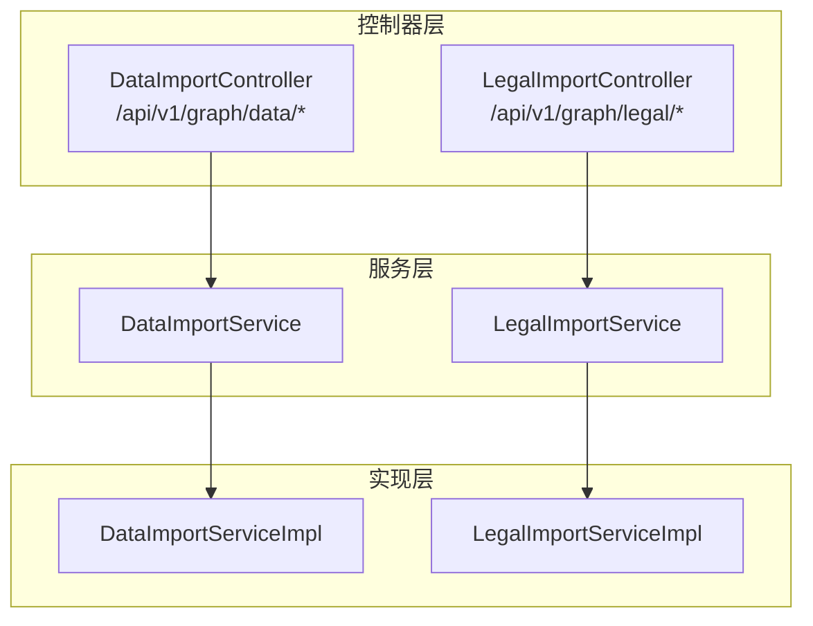
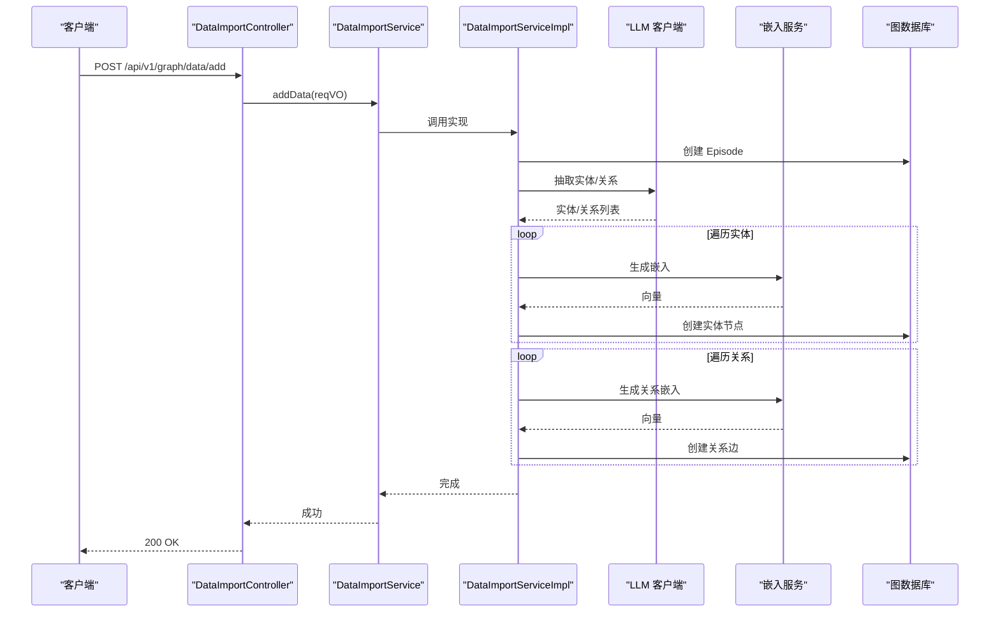
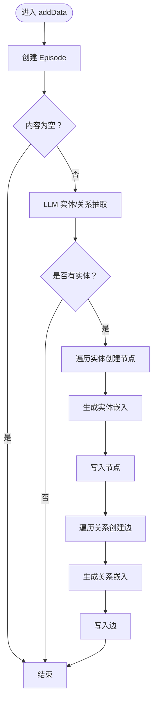
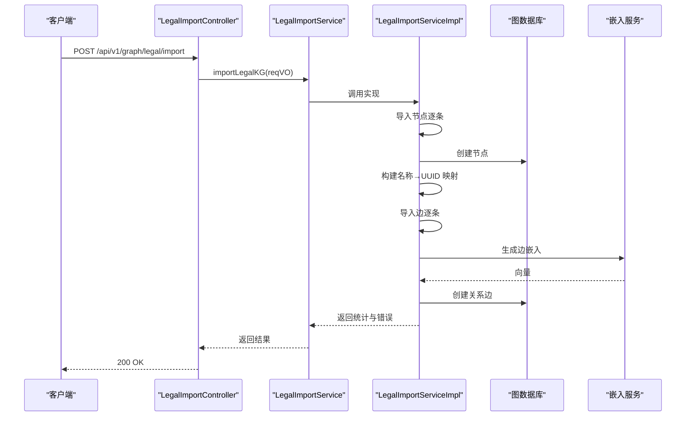
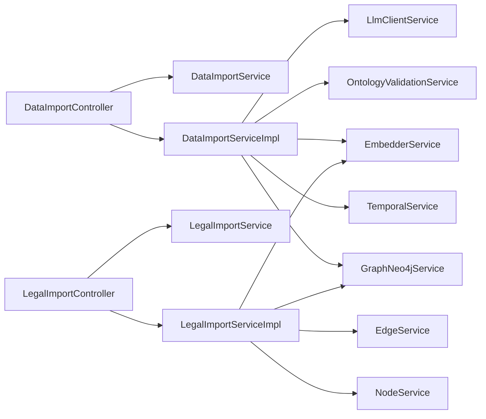

# 数据导入接口

<!--<cite>
**本文引用的文件**
- [DataImportController.java](file://ontograph-module-core/src/main/java/com/graphiti/module/graphiti/controller/admin/DataImportController.java)
- [LegalImportController.java](file://ontograph-module-core/src/main/java/com/graphiti/module/graphiti/controller/admin/LegalImportController.java)
- [DataImportService.java](file://ontograph-module-core/src/main/java/com/graphiti/module/graphiti/service/DataImportService.java)
- [LegalImportService.java](file://ontograph-module-core/src/main/java/com/graphiti/module/graphiti/service/LegalImportService.java)
- [DataImportServiceImpl.java](file://ontograph-module-core/src/main/java/com/graphiti/module/graphiti/service/impl/DataImportServiceImpl.java)
- [LegalImportServiceImpl.java](file://ontograph-module-core/src/main/java/com/graphiti/module/graphiti/service/impl/LegalImportServiceImpl.java)
- [AddDataReqVO.java](file://ontograph-module-core/src/main/java/com/graphiti/module/graphiti/vo/import/AddDataReqVO.java)
- [AddDataBatchReqVO.java](file://ontograph-module-core/src/main/java/com/graphiti/module/graphiti/vo/imports/AddDataBatchReqVO.java)
- [BatchDataItemVO.java](file://ontograph-module-core/src/main/java/com/graphiti/module/graphiti/vo/imports/BatchDataItemVO.java)
- [AddMessagesReqVO.java](file://ontograph-module-core/src/main/java/com/graphiti/module/graphiti/vo/import/AddMessagesReqVO.java)
- [FactTripleReqVO.java](file://ontograph-module-core/src/main/java/com/graphiti/module/graphiti/vo/import/FactTripleReqVO.java)
- [ImportLegalKGReqVO.java](file://ontograph-module-core/src/main/java/com/graphiti/module/graphiti/vo/legal/ImportLegalKGReqVO.java)
</cite>-->

## 目录
1. [简介](#简介)
2. [项目结构](#项目结构)
3. [核心组件](#核心组件)
4. [架构总览](#架构总览)
5. [详细组件分析](#详细组件分析)
6. [依赖分析](#依赖分析)
7. [性能考虑](#性能考虑)
8. [故障排查指南](#故障排查指南)
9. [结论](#结论)
10. [附录](#附录)

## 简介
本文件为 ontograph-java 的数据导入接口权威参考，覆盖以下能力：
- 批量数据导入：支持文本、消息、事实三元组、实体节点直写等多种写入路径
- 法律知识图谱导入：支持节点/边批量导入、一键导入“商事调解条例”法条、示例案例导入、导出法律图谱
- 自动数据抽取：基于 LLM 的实体与关系抽取，自动创建节点与关系，并生成向量嵌入
- 数据质量与一致性：结合本体校验、时序失效、去重提示等机制保障数据质量
- 技术细节：请求/响应结构、鉴权方式、错误码、分页与批处理策略、进度与监控要点

本指南面向数据工程师与系统集成商，提供可落地的 API 参考与最佳实践。

## 项目结构
围绕“数据导入”主题，后端采用“控制器 → 服务接口 → 服务实现”的分层设计，配合 VO 对象定义请求/响应结构，统一通过 Swagger 注解暴露 REST 接口。

图表来源
- [DataImportController.java:1-112](file://ontograph-module-core/src/main/java/com/graphiti/module/graphiti/controller/admin/DataImportController.java#L1-L112)
- [LegalImportController.java:1-136](file://ontograph-module-core/src/main/java/com/graphiti/module/graphiti/controller/admin/LegalImportController.java#L1-L136)
- [DataImportService.java:1-75](file://ontograph-module-core/src/main/java/com/graphiti/module/graphiti/service/DataImportService.java#L1-L75)
- [LegalImportService.java:1-48](file://ontograph-module-core/src/main/java/com/graphiti/module/graphiti/service/LegalImportService.java#L1-L48)
- [DataImportServiceImpl.java:1-323](file://ontograph-module-core/src/main/java/com/graphiti/module/graphiti/service/impl/DataImportServiceImpl.java#L1-L323)
- [LegalImportServiceImpl.java:1-467](file://ontograph-module-core/src/main/java/com/graphiti/module/graphiti/service/impl/LegalImportServiceImpl.java#L1-L467)

章节来源
- [DataImportController.java:1-112](file://ontograph-module-core/src/main/java/com/graphiti/module/graphiti/controller/admin/DataImportController.java#L1-L112)
- [LegalImportController.java:1-136](file://ontograph-module-core/src/main/java/com/graphiti/module/graphiti/controller/admin/LegalImportController.java#L1-L136)

## 核心组件
- 控制器
  - DataImportController：提供“添加单条/批量/消息/事实三元组/实体节点直写”及删除操作
  - LegalImportController：提供“批量导入法律图谱/节点/边”、“一键导入商事调解条例”、“示例案例导入”、“导出法律图谱”
- 服务接口
  - DataImportService：定义数据写入与删除契约
  - LegalImportService：定义法律图谱导入/导出契约
- 服务实现
  - DataImportServiceImpl：集成 LLM 实体/关系抽取、向量嵌入、时序失效、本体校验、批量优化等
  - LegalImportServiceImpl：事务化导入、名称→UUID 映射、批量错误收集、内置示例数据

章节来源
- [DataImportService.java:1-75](file://ontograph-module-core/src/main/java/com/graphiti/module/graphiti/service/DataImportService.java#L1-L75)
- [LegalImportService.java:1-48](file://ontograph-module-core/src/main/java/com/graphiti/module/graphiti/service/LegalImportService.java#L1-L48)
- [DataImportServiceImpl.java:1-323](file://ontograph-module-core/src/main/java/com/graphiti/module/graphiti/service/impl/DataImportServiceImpl.java#L1-L323)
- [LegalImportServiceImpl.java:1-467](file://ontograph-module-core/src/main/java/com/graphiti/module/graphiti/service/impl/LegalImportServiceImpl.java#L1-L467)

## 架构总览
下图展示“数据导入”端到端流程：控制器接收请求 → 服务实现执行业务逻辑 → 与图数据库交互并生成向量嵌入 → 返回统一响应。

图表来源
- [DataImportController.java:32-62](file://ontograph-module-core/src/main/java/com/graphiti/module/graphiti/controller/admin/DataImportController.java#L32-L62)
- [DataImportServiceImpl.java:35-109](file://ontograph-module-core/src/main/java/com/graphiti/module/graphiti/service/impl/DataImportServiceImpl.java#L35-L109)

## 详细组件分析

### 数据导入控制器（DataImportController）
- 路径与鉴权
  - 基础路径：/api/v1/graph/data
  - 所有接口均需 Bearer Token 鉴权
- 接口清单
  - POST /add：添加单条数据，触发 LLM 实体/关系抽取
  - POST /batch：批量添加数据（逐条调用 addData）
  - POST /messages：将多轮对话合并后写入图谱并抽取
  - POST /fact-triple：直接写入事实三元组
  - POST /entity-node：直接写入实体节点（不走 LLM）
  - DELETE /entity-edge/{uuid}：按边 UUID 删除实体边
  - DELETE /group/{graphId}：删除指定图谱的所有数据
  - DELETE /episode/{uuid}：删除指定 Episode
  - POST /clear：全局清空（当前实现为业务异常提示）

章节来源
- [DataImportController.java:22-112](file://ontograph-module-core/src/main/java/com/graphiti/module/graphiti/controller/admin/DataImportController.java#L22-L112)

### 法律知识图谱导入控制器（LegalImportController）
- 路径与鉴权
  - 基础路径：/api/v1/graph/legal
  - 所有接口均需 Bearer Token 鉴权
- 接口清单
  - POST /import：一次性导入节点+边（返回导入统计与错误列表）
  - POST /nodes：批量导入法律节点（返回成功/总数）
  - POST /edges：批量导入法律边（返回成功/总数）
  - POST /provisions：一键导入“商事调解条例”33条法条
  - POST /cases：导入示例案例数据（含当事人、法院、法官、律师等）
  - GET /export：导出法律图谱为 JSON（节点/边列表）

章节来源
- [LegalImportController.java:32-136](file://ontograph-module-core/src/main/java/com/graphiti/module/graphiti/controller/admin/LegalImportController.java#L32-L136)

### 数据导入服务与实现（DataImportService/Impl）
- 功能特性
  - 单条/批量/消息/三元组/节点直写写入
  - LLM 实体抽取、关系抽取、向量嵌入
  - 时序管理：同名实体失效旧事实
  - 本体校验：节点属性合法性与增强
  - 删除操作：按 UUID 删除边/图谱/事件
- 批量处理现状
  - 当前 batch 实现为顺序循环逐条调用 addData（TODO：后续可引入并发/事务批处理优化）

图表来源
- [DataImportServiceImpl.java:35-109](file://ontograph-module-core/src/main/java/com/graphiti/module/graphiti/service/impl/DataImportServiceImpl.java#L35-L109)

章节来源
- [DataImportService.java:8-75](file://ontograph-module-core/src/main/java/com/graphiti/module/graphiti/service/DataImportService.java#L8-L75)
- [DataImportServiceImpl.java:19-323](file://ontograph-module-core/src/main/java/com/graphiti/module/graphiti/service/impl/DataImportServiceImpl.java#L19-L323)

### 法律知识图谱导入服务与实现（LegalImportService/Impl）
- 功能特性
  - 事务化导入：节点→边，失败不影响已成功部分
  - 名称→UUID 映射：确保边导入时源/标节点存在
  - 错误收集：返回节点/边导入失败统计
  - 内置数据：提供“商事调解条例”33条法条与示例案例数据
  - 导出：按图谱导出节点/边列表
- 导入流程（节点+边）
  - 先导入节点，再导入边（边导入前构建名称→UUID 映射）
  - 边缺失源/标节点时跳过并记录日志

图表来源
- [LegalImportController.java:45-90](file://ontograph-module-core/src/main/java/com/graphiti/module/graphiti/controller/admin/LegalImportController.java#L45-L90)
- [LegalImportServiceImpl.java:29-127](file://ontograph-module-core/src/main/java/com/graphiti/module/graphiti/service/impl/LegalImportServiceImpl.java#L29-L127)

章节来源
- [LegalImportService.java:9-48](file://ontograph-module-core/src/main/java/com/graphiti/module/graphiti/service/LegalImportService.java#L9-L48)
- [LegalImportServiceImpl.java:13-467](file://ontograph-module-core/src/main/java/com/graphiti/module/graphiti/service/impl/LegalImportServiceImpl.java#L13-L467)

## 依赖分析
- 控制器依赖服务接口，服务接口由实现类提供具体逻辑
- DataImportServiceImpl 依赖图数据库服务、时序服务、本体校验服务、嵌入服务、LLM 客户端
- LegalImportServiceImpl 依赖节点/边服务、图数据库服务、嵌入服务

图表来源
- [DataImportController.java:29-30](file://ontograph-module-core/src/main/java/com/graphiti/module/graphiti/controller/admin/DataImportController.java#L29-L30)
- [LegalImportController.java:39-40](file://ontograph-module-core/src/main/java/com/graphiti/module/graphiti/controller/admin/LegalImportController.java#L39-L40)
- [DataImportServiceImpl.java:29-33](file://ontograph-module-core/src/main/java/com/graphiti/module/graphiti/service/impl/DataImportServiceImpl.java#L29-L33)
- [LegalImportServiceImpl.java:21-24](file://ontograph-module-core/src/main/java/com/graphiti/module/graphiti/service/impl/LegalImportServiceImpl.java#L21-L24)

章节来源
- [DataImportServiceImpl.java:29-33](file://ontograph-module-core/src/main/java/com/graphiti/module/graphiti/service/impl/DataImportServiceImpl.java#L29-L33)
- [LegalImportServiceImpl.java:21-24](file://ontograph-module-core/src/main/java/com/graphiti/module/graphiti/service/impl/LegalImportServiceImpl.java#L21-L24)

## 性能考虑
- 批量导入优化
  - 当前 batch 为顺序逐条调用 addData，建议后续引入线程池/事务批处理，减少 LLM 调用次数与数据库往返
- LLM 调用节流
  - 在高并发场景下，建议增加限流与重试策略，避免 LLM 侧限频
- 向量嵌入
  - 批量导入时尽量复用嵌入服务的批量接口（若可用），降低网络开销
- 图写入
  - 节点/边创建建议使用事务包裹，确保一致性；边导入前先构建名称→UUID 映射，避免多次查询
- 分页与导出
  - 导出接口默认分页上限为 10000，生产环境建议分页拉取并增量导出

[本节为通用性能建议，无需特定文件引用]

## 故障排查指南
- 常见错误与定位
  - 401 未授权：确认请求头携带 Bearer Token
  - 404 边/事件不存在：删除接口需确保 UUID 正确
  - 业务异常：全局异常处理器会抛出 BusinessException，检查服务端日志
- 日志与可观测性
  - 控制器与服务实现均输出关键步骤日志，便于定位问题
- 本体校验失败
  - 节点直写时若启用本体校验，属性不合法会抛出异常；建议先校验再导入
- LLM 抽取为空
  - 若输入内容为空或空白，不会触发抽取；请检查 content 字段

章节来源
- [DataImportController.java:108-110](file://ontograph-module-core/src/main/java/com/graphiti/module/graphiti/controller/admin/DataImportController.java#L108-L110)
- [DataImportServiceImpl.java:254-270](file://ontograph-module-core/src/main/java/com/graphiti/module/graphiti/service/impl/DataImportServiceImpl.java#L254-L270)

## 结论
ontograph-java 的数据导入体系以清晰的分层设计与完善的校验机制为基础，既支持自动化抽取，也支持直写与批量导入。建议在生产环境中结合限流、批处理与事务化导入，以获得更优的吞吐与一致性。

[本节为总结性内容，无需特定文件引用]

## 附录

### API 参考与调用方式

- 数据导入（/api/v1/graph/data）
  - POST /add
    - 请求体：AddDataReqVO
      - graphId：目标图谱 ID（必填）
      - content：数据内容（必填）
      - sourceType：来源类型（默认 text）
      - sourceDescription：来源描述
      - name：episode 名称（可选）
      - referenceTime：参考时间（影响时序）
      - updateCommunities：是否更新社区（默认 false）
    - 响应：CommonResult<Boolean>，成功返回 true
    - 行为：创建 Episode，LLM 抽取实体/关系，生成嵌入并写入图数据库
  - POST /batch
    - 请求体：AddDataBatchReqVO
      - graphId：目标图谱 ID（必填）
      - items：数据项列表（必填），每项包含 content/sourceType/sourceDescription/name
      - referenceTime：批次参考时间
      - updateCommunities：是否更新社区
    - 响应：CommonResult<Boolean>，成功返回 true
    - 行为：逐条调用 addData（当前实现）
  - POST /messages
    - 请求体：AddMessagesReqVO
      - graphId：目标图谱 ID（必填）
      - messages：消息列表（必填），每项包含 role/content
      - updateCommunities：是否更新社区
    - 响应：CommonResult<Boolean>，成功返回 true
    - 行为：合并对话内容，创建 Episode 并抽取实体/关系
  - POST /fact-triple
    - 请求体：FactTripleReqVO
      - graphId：目标图谱 ID（必填）
      - sourceNodeName：源节点名称（必填）
      - relationType：关系类型（必填）
      - targetNodeName：目标节点名称（必填）
      - fact：事实描述（可选）
      - properties：额外属性（可选）
    - 响应：CommonResult<Boolean>，成功返回 true
    - 行为：查找或创建节点，创建关系并生成嵌入
  - POST /entity-node
    - 查询参数：graphId（必填）
    - 请求体：节点数据 Map
      - name：节点名称（必填）
      - type：节点类型（默认 Entity）
      - summary：摘要（可选）
      - properties：节点属性（可选）
    - 响应：CommonResult<Boolean>，成功返回 true
    - 行为：节点直写，触发本体校验与时序失效
  - DELETE /entity-edge/{uuid}
    - 路径参数：uuid（必填）
    - 响应：CommonResult<Void>
    - 行为：按边 UUID 删除实体边
  - DELETE /group/{graphId}
    - 路径参数：graphId（必填）
    - 响应：CommonResult<Void>
    - 行为：删除指定图谱的所有数据
  - DELETE /episode/{uuid}
    - 路径参数：uuid（必填）
    - 响应：CommonResult<Void>
    - 行为：删除指定 Episode
  - POST /clear
    - 响应：抛出 BusinessException（501），提示使用 DELETE /graph/{graphId}/clear

章节来源
- [DataImportController.java:32-110](file://ontograph-module-core/src/main/java/com/graphiti/module/graphiti/controller/admin/DataImportController.java#L32-L110)
- [AddDataReqVO.java:14-40](file://ontograph-module-core/src/main/java/com/graphiti/module/graphiti/vo/import/AddDataReqVO.java#L14-L40)
- [AddDataBatchReqVO.java:18-36](file://ontograph-module-core/src/main/java/com/graphiti/module/graphiti/vo/imports/AddDataBatchReqVO.java#L18-L36)
- [BatchDataItemVO.java:13-29](file://ontograph-module-core/src/main/java/com/graphiti/module/graphiti/vo/imports/BatchDataItemVO.java#L13-L29)
- [AddMessagesReqVO.java:15-46](file://ontograph-module-core/src/main/java/com/graphiti/module/graphiti/vo/import/AddMessagesReqVO.java#L15-L46)
- [FactTripleReqVO.java:14-39](file://ontograph-module-core/src/main/java/com/graphiti/module/graphiti/vo/import/FactTripleReqVO.java#L14-L39)

- 法律知识图谱导入（/api/v1/graph/legal）
  - POST /import
    - 请求体：ImportLegalKGReqVO
      - graphId：目标图谱 ID（必填）
      - nodes：节点列表（可选）
      - edges：边列表（可选）
    - 响应：CommonResult<LegalImportResultRespVO>
      - 包含 nodeCount/edgeCount/nodeErrors/edgeErrors/graphId
    - 行为：事务化导入节点→边，失败收集错误
  - POST /nodes
    - 查询参数：graphId（必填）
    - 请求体：List<Map<String, Object>>
    - 响应：CommonResult<Map<String,Object>>，包含 successCount/totalCount
    - 行为：批量导入法律节点
  - POST /edges
    - 查询参数：graphId（必填）
    - 请求体：List<Map<String, Object>>
    - 响应：CommonResult<Map<String,Object>>，包含 successCount/totalCount
    - 行为：批量导入法律边（需先存在对应节点）
  - POST /provisions
    - 查询参数：graphId（必填）
    - 响应：CommonResult<Map<String,Object>>，包含 importedCount/lawName
    - 行为：一键导入“商事调解条例”33条法条
  - POST /cases
    - 查询参数：graphId（必填）
    - 响应：CommonResult<Map<String,Object>>，包含 importedCount
    - 行为：导入示例案例数据（含当事人、法院、法官、律师等）
  - GET /export
    - 查询参数：graphId（必填）
    - 响应：CommonResult<Map<String,Object>>，包含 graphId/nodeCount/nodes/edgeCount/edges
    - 行为：导出法律图谱为 JSON

章节来源
- [LegalImportController.java:45-134](file://ontograph-module-core/src/main/java/com/graphiti/module/graphiti/controller/admin/LegalImportController.java#L45-L134)
- [ImportLegalKGReqVO.java:16-29](file://ontograph-module-core/src/main/java/com/graphiti/module/graphiti/vo/legal/ImportLegalKGReqVO.java#L16-L29)

### 数据格式与Schema定义
- AddDataReqVO
  - graphId：字符串，必填
  - content：字符串，必填
  - sourceType：字符串，默认 text
  - sourceDescription：字符串
  - name：字符串
  - referenceTime：时间戳
  - updateCommunities：布尔值，默认 false
- AddDataBatchReqVO
  - graphId：字符串，必填
  - items：数组，元素为 BatchDataItemVO
  - referenceTime：时间戳
  - updateCommunities：布尔值，默认 false
- BatchDataItemVO
  - content：字符串，必填
  - sourceType：字符串，默认 text
  - sourceDescription：字符串
  - name：字符串
- AddMessagesReqVO
  - graphId：字符串，必填
  - messages：数组，元素为 MessageItemVO
  - updateCommunities：布尔值，默认 false
- MessageItemVO
  - role：字符串，枚举（system/user/assistant），必填
  - content：字符串，必填
- FactTripleReqVO
  - graphId：字符串，必填
  - sourceNodeName：字符串，必填
  - relationType：字符串，必填
  - targetNodeName：字符串，必填
  - fact：字符串
  - properties：对象
- ImportLegalKGReqVO
  - graphId：字符串，必填
  - nodes：数组，元素为 Map<String,Object>
  - edges：数组，元素为 Map<String,Object>

章节来源
- [AddDataReqVO.java:14-40](file://ontograph-module-core/src/main/java/com/graphiti/module/graphiti/vo/import/AddDataReqVO.java#L14-L40)
- [AddDataBatchReqVO.java:18-36](file://ontograph-module-core/src/main/java/com/graphiti/module/graphiti/vo/imports/AddDataBatchReqVO.java#L18-L36)
- [BatchDataItemVO.java:13-29](file://ontograph-module-core/src/main/java/com/graphiti/module/graphiti/vo/imports/BatchDataItemVO.java#L13-L29)
- [AddMessagesReqVO.java:15-46](file://ontograph-module-core/src/main/java/com/graphiti/module/graphiti/vo/import/AddMessagesReqVO.java#L15-L46)
- [FactTripleReqVO.java:14-39](file://ontograph-module-core/src/main/java/com/graphiti/module/graphiti/vo/import/FactTripleReqVO.java#L14-L39)
- [ImportLegalKGReqVO.java:16-29](file://ontograph-module-core/src/main/java/com/graphiti/module/graphiti/vo/legal/ImportLegalKGReqVO.java#L16-L29)

### 自动化功能与数据质量
- LLM 驱动的实体关系抽取
  - addData/addMessages：对 content 进行实体/关系抽取，生成节点与边
  - addFactTriple：直接写入三元组并生成嵌入
- 数据质量检查
  - 节点直写时可启用本体校验，不合法属性将被拒绝
  - 同名实体写入时会失效旧事实，避免时序冲突
- 重复数据处理
  - 通过名称→UUID 映射与时序失效机制，减少重复边/节点
  - 导入失败时记录日志，便于人工复核

章节来源
- [DataImportServiceImpl.java:51-105](file://ontograph-module-core/src/main/java/com/graphiti/module/graphiti/service/impl/DataImportServiceImpl.java#L51-L105)
- [DataImportServiceImpl.java:254-280](file://ontograph-module-core/src/main/java/com/graphiti/module/graphiti/service/impl/DataImportServiceImpl.java#L254-L280)
- [LegalImportServiceImpl.java:82-127](file://ontograph-module-core/src/main/java/com/graphiti/module/graphiti/service/impl/LegalImportServiceImpl.java#L82-L127)

### 实际导入场景示例
- 场景一：批量导入新闻文本
  - 使用 POST /api/v1/graph/data/batch，items 中包含多条 content
  - 建议设置 referenceTime 以统一时序
- 场景二：导入对话历史
  - 使用 POST /api/v1/graph/data/messages，传入多轮消息
  - 适合构建“会话记忆”型知识图谱
- 场景三：法律法条与案例导入
  - 使用 POST /api/v1/graph/legal/provisions 导入法条
  - 使用 POST /api/v1/graph/legal/cases 导入示例案例
  - 使用 POST /api/v1/graph/legal/import 统一导入节点/边
- 场景四：直接写入实体节点
  - 使用 POST /api/v1/graph/data/entity-node，适用于已有结构化数据
  - 将触发本体校验与时序失效

[本节为场景说明，无需特定文件引用]

### 性能优化建议
- 批量导入
  - 优先使用 /batch 或 /import（节点+边）以减少 LLM 调用次数
  - 在服务实现层引入线程池与事务批处理（当前实现为顺序逐条）
- LLM 与嵌入
  - 合理设置限流与重试，避免外部服务限频
  - 批量场景下尽量复用嵌入服务的批量接口
- 导出与分页
  - 导出接口默认分页上限为 10000，建议分页拉取并增量导出

[本节为通用优化建议，无需特定文件引用]