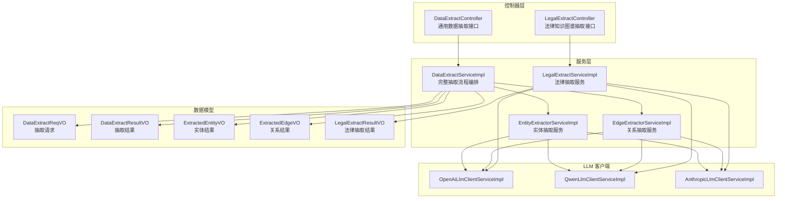
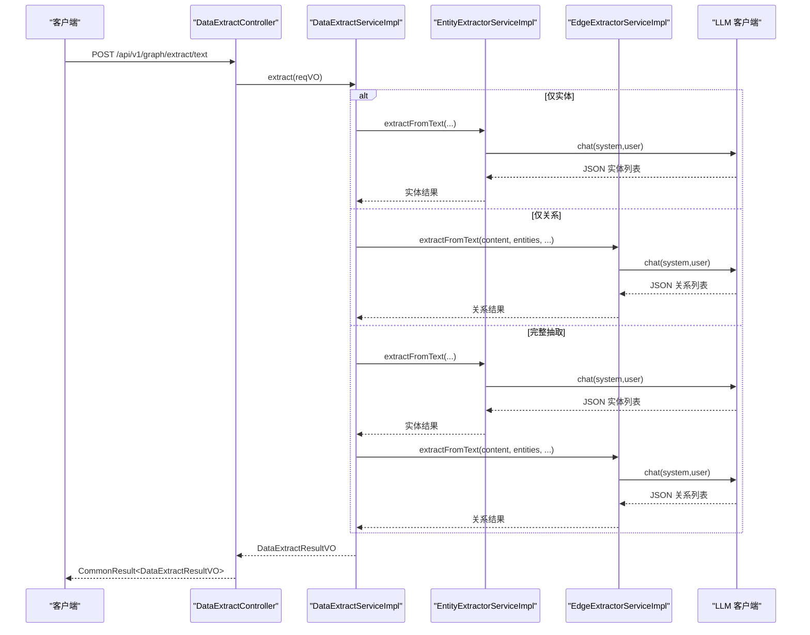
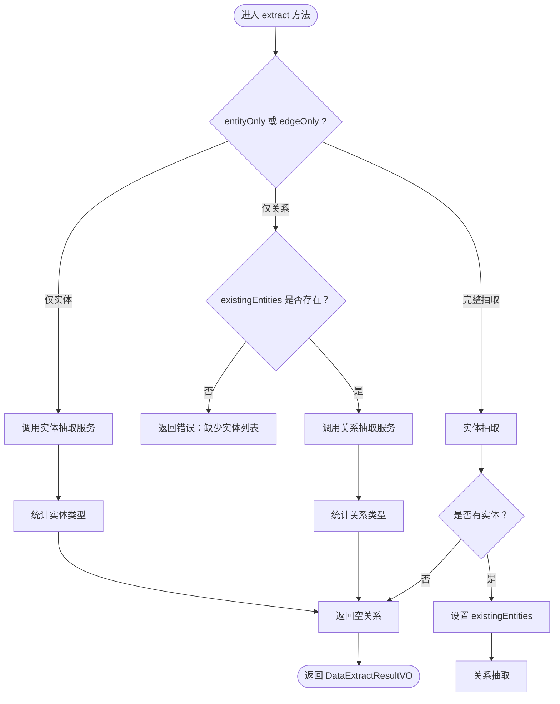
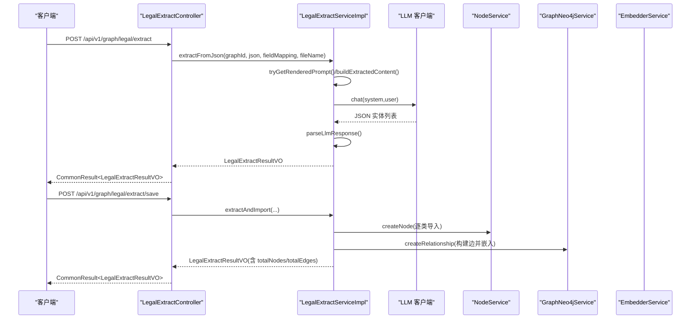
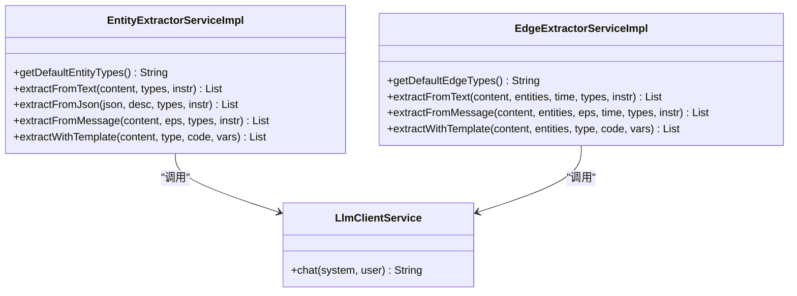
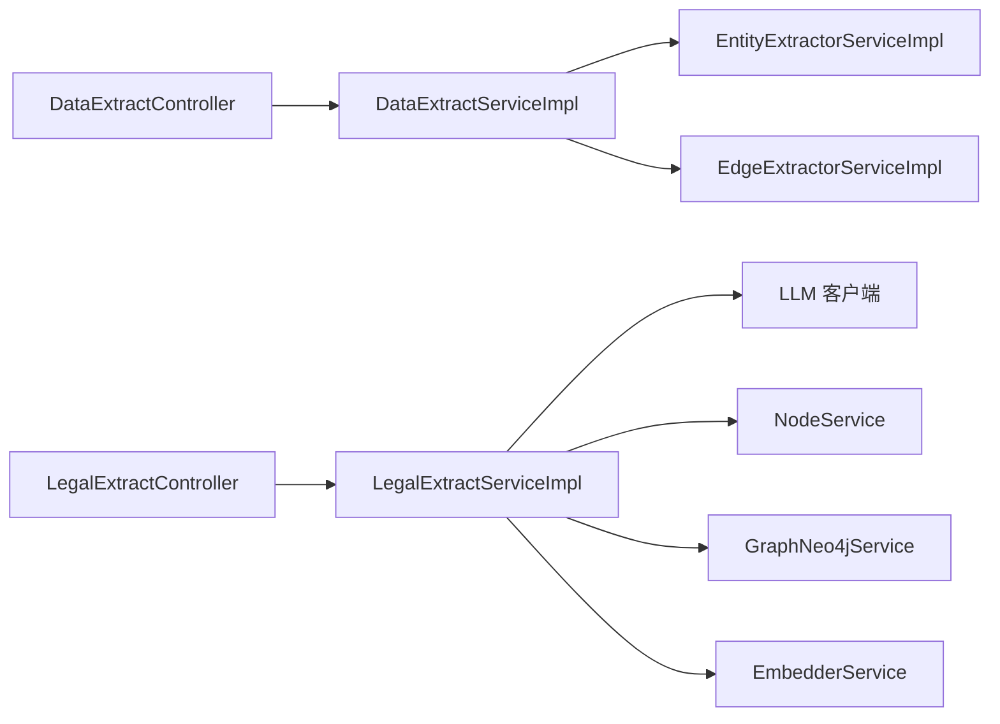

# 数据抽取接口

<!--<cite>
**本文引用的文件**
- [DataExtractController.java](file://graphiti-module-core/src/main/java/com/graphiti/module/graphiti/controller/admin/DataExtractController.java)
- [LegalExtractController.java](file://graphiti-module-core/src/main/java/com/graphiti/module/graphiti/controller/admin/LegalExtractController.java)
- [DataExtractServiceImpl.java](file://graphiti-module-core/src/main/java/com/graphiti/module/graphiti/service/impl/DataExtractServiceImpl.java)
- [LegalExtractServiceImpl.java](file://graphiti-module-core/src/main/java/com/graphiti/module/graphiti/service/impl/LegalExtractServiceImpl.java)
- [EntityExtractorServiceImpl.java](file://graphiti-module-core/src/main/java/com/graphiti/module/graphiti/service/impl/EntityExtractorServiceImpl.java)
- [EdgeExtractorServiceImpl.java](file://graphiti-module-core/src/main/java/com/graphiti/module/graphiti/service/impl/EdgeExtractorServiceImpl.java)
- [DataExtractReqVO.java](file://graphiti-module-core/src/main/java/com/graphiti/module/graphiti/vo/extractor/DataExtractReqVO.java)
- [DataExtractResultVO.java](file://graphiti-module-core/src/main/java/com/graphiti/module/graphiti/vo/extractor/DataExtractResultVO.java)
- [ExtractedEntityVO.java](file://graphiti-module-core/src/main/java/com/graphiti/module/graphiti/vo/extractor/ExtractedEntityVO.java)
- [ExtractedEdgeVO.java](file://graphiti-module-core/src/main/java/com/graphiti/module/graphiti/vo/extractor/ExtractedEdgeVO.java)
- [LegalExtractResultVO.java](file://graphiti-module-core/src/main/java/com/graphiti/module/graphiti/vo/legal/LegalExtractResultVO.java)
- [ExtractedCaseVO.java](file://graphiti-module-core/src/main/java/com/graphiti/module/graphiti/vo/legal/ExtractedCaseVO.java)
- [ExtractedPartyVO.java](file://graphiti-module-core/src/main/java/com/graphiti/module/graphiti/vo/legal/ExtractedPartyVO.java)
- [ExtractedCourtVO.java](file://graphiti-module-core/src/main/java/com/graphiti/module/graphiti/vo/legal/ExtractedCourtVO.java)
- [OpenAiLlmClientServiceImpl.java](file://graphiti-module-core/src/main/java/com/graphiti/module/graphiti/service/impl/ai/OpenAiLlmClientServiceImpl.java)
- [QwenLlmClientServiceImpl.java](file://graphiti-module-core/src/main/java/com/graphiti/module/graphiti/service/impl/ai/QwenLlmClientServiceImpl.java)
- [AnthropicLlmClientServiceImpl.java](file://graphiti-module-core/src/main/java/com/graphiti/module/graphiti/service/impl/ai/AnthropicLlmClientServiceImpl.java)
- [system_prompt.txt](file://graphiti-module-core/src/main/resources/prompts/system_prompt.txt)
</cite>-->

## 目录
1. [简介](#简介)
2. [项目结构](#项目结构)
3. [核心组件](#核心组件)
4. [架构总览](#架构总览)
5. [详细组件分析](#详细组件分析)
6. [依赖分析](#依赖分析)
7. [性能考虑](#性能考虑)
8. [故障排查指南](#故障排查指南)
9. [结论](#结论)
10. [附录](#附录)

## 简介
本文件为 ontograph-java 的数据抽取接口专业参考，覆盖两类核心能力：
- 通用数据抽取：从文本、JSON、消息中自动抽取实体与关系，支持批量、增量与自定义规则。
- 法律知识图谱抽取：从 JSON 文件中提取法律实体（案件、当事人、法院、法官、法律条文、律师、证据、裁判文书），并可直接导入图谱。

接口设计遵循 LLM 驱动的提示工程范式，结合实体识别与关系抽取双阶段流程，提供结构化结果、统计信息与错误回退机制；同时支持模板化提示词与字段映射，便于扩展与定制。

## 项目结构
围绕数据抽取的关键模块与文件组织如下：
- 控制器层：提供 HTTP 接口，负责参数接收、文件上传与结果封装。
- 服务层：实现抽取主流程与 LLM 调用，拆分为实体抽取、关系抽取与法律抽取三大服务。
- VO 层：定义请求与响应的数据结构，确保前后端契约一致。
- LLM 客户端：封装不同大模型厂商的调用接口，统一 chat 能力。
- 提示词资源：系统级提示词模板，保障抽取一致性与准确性。

图表来源
- [DataExtractController.java:31-36](file://graphiti-module-core/src/main/java/com/graphiti/module/graphiti/controller/admin/DataExtractController.java#L31-L36)
- [LegalExtractController.java:36-41](file://graphiti-module-core/src/main/java/com/graphiti/module/graphiti/controller/admin/LegalExtractController.java#L36-L41)
- [DataExtractServiceImpl.java:34-37](file://graphiti-module-core/src/main/java/com/graphiti/module/graphiti/service/impl/DataExtractServiceImpl.java#L34-L37)
- [EntityExtractorServiceImpl.java:23-26](file://graphiti-module-core/src/main/java/com/graphiti/module/graphiti/service/impl/EntityExtractorServiceImpl.java#L23-L26)
- [EdgeExtractorServiceImpl.java:19-26](file://graphiti-module-core/src/main/java/com/graphiti/module/graphiti/service/impl/EdgeExtractorServiceImpl.java#L19-L26)
- [LegalExtractServiceImpl.java:16-22](file://graphiti-module-core/src/main/java/com/graphiti/module/graphiti/service/impl/LegalExtractServiceImpl.java#L16-L22)
- [OpenAiLlmClientServiceImpl.java](file://graphiti-module-core/src/main/java/com/graphiti/module/graphiti/service/impl/ai/OpenAiLlmClientServiceImpl.java)
- [QwenLlmClientServiceImpl.java](file://graphiti-module-core/src/main/java/com/graphiti/module/graphiti/service/impl/ai/QwenLlmClientServiceImpl.java)
- [AnthropicLlmClientServiceImpl.java](file://graphiti-module-core/src/main/java/com/graphiti/module/graphiti/service/impl/ai/AnthropicLlmClientServiceImpl.java)

章节来源
- [DataExtractController.java:31-36](file://graphiti-module-core/src/main/java/com/graphiti/module/graphiti/controller/admin/DataExtractController.java#L31-L36)
- [LegalExtractController.java:36-41](file://graphiti-module-core/src/main/java/com/graphiti/module/graphiti/controller/admin/LegalExtractController.java#L36-L41)

## 核心组件
- 通用数据抽取控制器：提供文本、JSON、实体/关系独立抽取、JSON 预览与默认类型配置查询等接口。
- 法律抽取控制器：提供 JSON 预览、仅提取、提取并保存、本体字段映射与模板列表查询等接口。
- 抽取服务编排：统一调度实体与关系抽取，支持上下文 episodes、自定义指令与类型配置。
- 实体/关系抽取服务：基于提示词模板与 LLM，输出标准化的实体与关系结果，并支持置信度与属性扩展。
- 法律抽取服务：支持字段映射、模板渲染、节点导入与关系构建，最终形成完整的法律知识图谱。
- LLM 客户端：封装 OpenAI、通义千问、Anthropic 等模型的 chat 能力，统一接口。
- 数据模型：抽取请求与结果 VO，确保结构化输出与前后端契约一致。

章节来源
- [DataExtractController.java:48-136](file://graphiti-module-core/src/main/java/com/graphiti/module/graphiti/controller/admin/DataExtractController.java#L48-L136)
- [LegalExtractController.java:53-152](file://graphiti-module-core/src/main/java/com/graphiti/module/graphiti/controller/admin/LegalExtractController.java#L53-L152)
- [DataExtractServiceImpl.java:43-97](file://graphiti-module-core/src/main/java/com/graphiti/module/graphiti/service/impl/DataExtractServiceImpl.java#L43-L97)
- [EntityExtractorServiceImpl.java:52-95](file://graphiti-module-core/src/main/java/com/graphiti/module/graphiti/service/impl/EntityExtractorServiceImpl.java#L52-L95)
- [EdgeExtractorServiceImpl.java:58-89](file://graphiti-module-core/src/main/java/com/graphiti/module/graphiti/service/impl/EdgeExtractorServiceImpl.java#L58-L89)
- [LegalExtractServiceImpl.java:75-122](file://graphiti-module-core/src/main/java/com/graphiti/module/graphiti/service/impl/LegalExtractServiceImpl.java#L75-L122)

## 架构总览
通用数据抽取采用“实体优先、再关系”的两阶段流程，法律抽取采用“字段映射+LLM+导入”的端到端流程。两者均通过提示词模板与 LLM 客户端实现解耦。

图表来源
- [DataExtractController.java:48-58](file://graphiti-module-core/src/main/java/com/graphiti/module/graphiti/controller/admin/DataExtractController.java#L48-L58)
- [DataExtractServiceImpl.java:43-97](file://graphiti-module-core/src/main/java/com/graphiti/module/graphiti/service/impl/DataExtractServiceImpl.java#L43-L97)
- [EntityExtractorServiceImpl.java:52-63](file://graphiti-module-core/src/main/java/com/graphiti/module/graphiti/service/impl/EntityExtractorServiceImpl.java#L52-L63)
- [EdgeExtractorServiceImpl.java:58-71](file://graphiti-module-core/src/main/java/com/graphiti/module/graphiti/service/impl/EdgeExtractorServiceImpl.java#L58-L71)

## 详细组件分析

### 通用数据抽取接口
- 接口概览
  - 文本抽取：POST /api/v1/graph/extract/text
  - JSON 抽取：POST /api/v1/graph/extract/json（multipart/form-data）
  - 仅实体抽取：POST /api/v1/graph/extract/entities
  - 仅关系抽取：POST /api/v1/graph/extract/edges（需先提供实体列表）
  - JSON 预览：POST /api/v1/graph/extract/preview
  - 默认类型配置：GET /api/v1/graph/extract/entity-types、/api/v1/graph/extract/edge-types

- 请求参数
  - DataExtractReqVO：包含 graphId、content、sourceType、sourceDescription、entityTypesConfig、edgeTypesConfig、customInstructions、previousEpisodes、referenceTime、entityOnly、edgeOnly、existingEntities、promptTemplateId、extraVariables 等。
  - JSON 抽取接口额外支持 multipart 参数：file、graphId、entityTypesConfig、edgeTypesConfig、customInstructions。

- 处理流程
  - 编排服务根据 entityOnly、edgeOnly 与 existingEntities 判断执行路径。
  - 实体抽取支持 text/json/message 三种数据源类型，关系抽取支持 text/message。
  - 支持 episodes 上下文与自定义指令注入，提升抽取上下文一致性。

- 输出结果
  - DataExtractResultVO：包含 entities、edges、entityCount、edgeCount、entityTypeStatistics、edgeTypeStatistics、rawResponse、errors、elapsedMs。

- 置信度与属性
  - 实体/关系 VO 支持 confidence 与 attributes 字段，便于后续质量评估与扩展。

图表来源
- [DataExtractServiceImpl.java:43-97](file://graphiti-module-core/src/main/java/com/graphiti/module/graphiti/service/impl/DataExtractServiceImpl.java#L43-L97)
- [DataExtractServiceImpl.java:153-188](file://graphiti-module-core/src/main/java/com/graphiti/module/graphiti/service/impl/DataExtractServiceImpl.java#L153-L188)

章节来源
- [DataExtractController.java:48-136](file://graphiti-module-core/src/main/java/com/graphiti/module/graphiti/controller/admin/DataExtractController.java#L48-L136)
- [DataExtractReqVO.java:13-74](file://graphiti-module-core/src/main/java/com/graphiti/module/graphiti/vo/extractor/DataExtractReqVO.java#L13-L74)
- [DataExtractResultVO.java:8-42](file://graphiti-module-core/src/main/java/com/graphiti/module/graphiti/vo/extractor/DataExtractResultVO.java#L8-L42)
- [ExtractedEntityVO.java:9-37](file://graphiti-module-core/src/main/java/com/graphiti/module/graphiti/vo/extractor/ExtractedEntityVO.java#L9-L37)
- [ExtractedEdgeVO.java:7-41](file://graphiti-module-core/src/main/java/com/graphiti/module/graphiti/vo/extractor/ExtractedEdgeVO.java#L7-L41)

### 法律知识图谱抽取接口
- 接口概览
  - JSON 预览：POST /api/v1/graph/legal/extract/preview
  - 仅提取：POST /api/v1/graph/legal/extract（支持模板编码）
  - 提取并保存：POST /api/v1/graph/legal/extract/save
  - 本体字段映射：GET /api/v1/graph/legal/extract/ontology-fields
  - 模板列表：GET /api/v1/graph/legal/extract/templates

- 字段映射与模板
  - 通过 fieldMapping 将 JSON 字段映射到法律本体字段，支持数组索引路径。
  - 支持提示词模板渲染，若模板未启用或不存在则回退默认提示词。

- 导入流程
  - 节点导入：按实体类型分别导入 Case、Party、Court、Judge、LegalProvision、Lawyer、Evidence、JudgmentDocument。
  - 关系构建：基于实体间逻辑关系（如 CASE_PARTY、CASE_COURT、CASE_JUDGE）构建边并嵌入向量存入图数据库。

图表来源
- [LegalExtractController.java:93-152](file://graphiti-module-core/src/main/java/com/graphiti/module/graphiti/controller/admin/LegalExtractController.java#L93-L152)
- [LegalExtractServiceImpl.java:75-122](file://graphiti-module-core/src/main/java/com/graphiti/module/graphiti/service/impl/LegalExtractServiceImpl.java#L75-L122)
- [LegalExtractServiceImpl.java:166-206](file://graphiti-module-core/src/main/java/com/graphiti/module/graphiti/service/impl/LegalExtractServiceImpl.java#L166-L206)

章节来源
- [LegalExtractController.java:53-152](file://graphiti-module-core/src/main/java/com/graphiti/module/graphiti/controller/admin/LegalExtractController.java#L53-L152)
- [LegalExtractResultVO.java:11-81](file://graphiti-module-core/src/main/java/com/graphiti/module/graphiti/vo/legal/LegalExtractResultVO.java#L11-L81)
- [ExtractedCaseVO.java:10-41](file://graphiti-module-core/src/main/java/com/graphiti/module/graphiti/vo/legal/ExtractedCaseVO.java#L10-L41)
- [ExtractedPartyVO.java:10-37](file://graphiti-module-core/src/main/java/com/graphiti/module/graphiti/vo/legal/ExtractedPartyVO.java#L10-L37)
- [ExtractedCourtVO.java:10-33](file://graphiti-module-core/src/main/java/com/graphiti/module/graphiti/vo/legal/ExtractedCourtVO.java#L10-L33)

### 实体与关系抽取算法
- 实体抽取
  - 输入：content、entityTypesConfig、customInstructions。
  - 流程：构建系统提示词与用户提示词，调用 LLM，解析 JSON 结果，兼容纯文本回退。
  - 输出：实体列表，包含 name、entityType、summary、attributes、episodeIndices、confidence。

- 关系抽取
  - 输入：content、entities、referenceTime、edgeTypesConfig、customInstructions。
  - 流程：验证实体名称、排除自环、解析时间范围与属性，输出标准化关系。
  - 输出：关系列表，包含 sourceEntityName、targetEntityName、relationType、fact、validAt、invalidAt、episodeIndices、confidence、attributes。

图表来源
- [EntityExtractorServiceImpl.java:23-26](file://graphiti-module-core/src/main/java/com/graphiti/module/graphiti/service/impl/EntityExtractorServiceImpl.java#L23-L26)
- [EdgeExtractorServiceImpl.java:19-26](file://graphiti-module-core/src/main/java/com/graphiti/module/graphiti/service/impl/EdgeExtractorServiceImpl.java#L19-L26)

章节来源
- [EntityExtractorServiceImpl.java:52-95](file://graphiti-module-core/src/main/java/com/graphiti/module/graphiti/service/impl/EntityExtractorServiceImpl.java#L52-L95)
- [EdgeExtractorServiceImpl.java:58-89](file://graphiti-module-core/src/main/java/com/graphiti/module/graphiti/service/impl/EdgeExtractorServiceImpl.java#L58-L89)

## 依赖分析
- 控制器依赖服务：控制器仅负责参数绑定与结果封装，业务逻辑集中在服务层。
- 服务层依赖 LLM 客户端：通过统一 chat 接口屏蔽不同模型差异。
- 法律抽取服务依赖节点与图服务：导入节点后构建关系并写入图数据库。
- 数据模型稳定：VO 层定义清晰，便于前后端契约演进。

图表来源
- [DataExtractController.java:36-39](file://graphiti-module-core/src/main/java/com/graphiti/module/graphiti/controller/admin/DataExtractController.java#L36-L39)
- [LegalExtractController.java:43-44](file://graphiti-module-core/src/main/java/com/graphiti/module/graphiti/controller/admin/LegalExtractController.java#L43-L44)
- [DataExtractServiceImpl.java:38-41](file://graphiti-module-core/src/main/java/com/graphiti/module/graphiti/service/impl/DataExtractServiceImpl.java#L38-L41)
- [LegalExtractServiceImpl.java:24-29](file://graphiti-module-core/src/main/java/com/graphiti/module/graphiti/service/impl/LegalExtractServiceImpl.java#L24-L29)

章节来源
- [DataExtractServiceImpl.java:38-41](file://graphiti-module-core/src/main/java/com/graphiti/module/graphiti/service/impl/DataExtractServiceImpl.java#L38-L41)
- [LegalExtractServiceImpl.java:24-29](file://graphiti-module-core/src/main/java/com/graphiti/module/graphiti/service/impl/LegalExtractServiceImpl.java#L24-L29)

## 性能考虑
- 流水线解耦：实体与关系抽取分离，避免单次调用超长提示词导致的延迟。
- 模板化提示词：减少重复构造提示词的成本，提高 LLM 调用效率。
- 分步导入：法律抽取先提取再导入，便于分批处理与错误恢复。
- 时间与内存控制：对 JSON 预览与样本截断，避免大文件造成内存压力。
- 并发与限流：建议在网关或控制器层增加速率限制与超时配置，防止 LLM 调用成为瓶颈。

## 故障排查指南
- 常见错误
  - JSON 文件解析失败：检查文件格式与编码，确认字段映射路径正确。
  - 仅关系抽取缺少实体列表：确保先调用实体抽取接口或传入 existingEntities。
  - LLM 返回非标准 JSON：服务内置 JSON 片段提取与纯文本回退，仍可能出现解析异常，建议检查提示词模板与模型输出稳定性。
  - 模板未启用或不存在：自动回退默认提示词，但可能影响抽取质量，建议核查模板状态。

- 排查步骤
  - 查看返回的 errors 列表与 elapsedMs，定位耗时与失败原因。
  - 使用 JSON 预览接口快速确认字段结构与样本。
  - 在本地复现最小样例，逐步缩小问题范围。
  - 检查 LLM 客户端配置与网络连通性。

章节来源
- [DataExtractController.java:92-95](file://graphiti-module-core/src/main/java/com/graphiti/module/graphiti/controller/admin/DataExtractController.java#L92-L95)
- [LegalExtractController.java:79-82](file://graphiti-module-core/src/main/java/com/graphiti/module/graphiti/controller/admin/LegalExtractController.java#L79-L82)
- [DataExtractResultVO.java:33-41](file://graphiti-module-core/src/main/java/com/graphiti/module/graphiti/vo/extractor/DataExtractResultVO.java#L33-L41)
- [LegalExtractResultVO.java:63-80](file://graphiti-module-core/src/main/java/com/graphiti/module/graphiti/vo/legal/LegalExtractResultVO.java#L63-L80)

## 结论
ontograph-java 的数据抽取接口以 LLM 为核心，通过清晰的控制器-服务-模型分层，提供了通用与法律两大领域的抽取能力。接口支持批量、增量与自定义规则，具备完善的错误处理与性能控制策略，适合在生产环境中构建高质量的知识图谱。

## 附录

### API 定义与字段说明
- 通用数据抽取
  - POST /api/v1/graph/extract/text
    - 请求体：DataExtractReqVO
    - 响应体：CommonResult<DataExtractResultVO>
  - POST /api/v1/graph/extract/json
    - 表单参数：file、graphId、entityTypesConfig、edgeTypesConfig、customInstructions
    - 响应体：CommonResult<DataExtractResultVO>
  - POST /api/v1/graph/extract/entities
    - 请求体：DataExtractReqVO（entityOnly=true）
    - 响应体：CommonResult<DataExtractResultVO>
  - POST /api/v1/graph/extract/edges
    - 请求体：DataExtractReqVO（existingEntities 必填）
    - 响应体：CommonResult<DataExtractResultVO>
  - POST /api/v1/graph/extract/preview
    - 表单参数：file
    - 响应体：CommonResult<Map<String,Object>>
  - GET /api/v1/graph/extract/entity-types
    - 响应体：CommonResult<Map<String,Object>>
  - GET /api/v1/graph/extract/edge-types
    - 响应体：CommonResult<Map<String,Object>>

- 法律知识图谱抽取
  - POST /api/v1/graph/legal/extract/preview
    - 表单参数：file
    - 响应体：CommonResult<Map<String,Object>>
  - POST /api/v1/graph/legal/extract
    - 表单参数：file、graphId、fieldMapping、templateCode
    - 响应体：CommonResult<LegalExtractResultVO>
  - POST /api/v1/graph/legal/extract/save
    - 表单参数：file、graphId、fieldMapping
    - 响应体：CommonResult<LegalExtractResultVO>
  - GET /api/v1/graph/legal/extract/ontology-fields
    - 响应体：CommonResult<Map<String,Object>>
  - GET /api/v1/graph/legal/extract/templates
    - 响应体：CommonResult<Map<String,Object>>

章节来源
- [DataExtractController.java:48-136](file://graphiti-module-core/src/main/java/com/graphiti/module/graphiti/controller/admin/DataExtractController.java#L48-L136)
- [LegalExtractController.java:53-152](file://graphiti-module-core/src/main/java/com/graphiti/module/graphiti/controller/admin/LegalExtractController.java#L53-L152)

### 数据结构与置信度
- 通用抽取结果
  - DataExtractResultVO：包含 entities、edges、entityCount、edgeCount、entityTypeStatistics、edgeTypeStatistics、rawResponse、errors、elapsedMs。
  - ExtractedEntityVO：name、entityType、entityTypeId、summary、attributes、episodeIndices、confidence。
  - ExtractedEdgeVO：sourceEntityName、targetEntityName、relationType、fact、validAt、invalidAt、episodeIndices、confidence、attributes。

- 法律抽取结果
  - LegalExtractResultVO：cases、parties、courts、judges、provisions、lawyers、evidences、judgments、errors、sourceFileName、totalNodes、totalEdges。
  - 各实体 VO：如 ExtractedCaseVO、ExtractedPartyVO、ExtractedCourtVO 等，包含本体字段与 uuid。

章节来源
- [DataExtractResultVO.java:8-42](file://graphiti-module-core/src/main/java/com/graphiti/module/graphiti/vo/extractor/DataExtractResultVO.java#L8-L42)
- [ExtractedEntityVO.java:9-37](file://graphiti-module-core/src/main/java/com/graphiti/module/graphiti/vo/extractor/ExtractedEntityVO.java#L9-L37)
- [ExtractedEdgeVO.java:7-41](file://graphiti-module-core/src/main/java/com/graphiti/module/graphiti/vo/extractor/ExtractedEdgeVO.java#L7-L41)
- [LegalExtractResultVO.java:11-81](file://graphiti-module-core/src/main/java/com/graphiti/module/graphiti/vo/legal/LegalExtractResultVO.java#L11-L81)

### 提示词与系统提示
- 系统提示词：强调结构化输出、事实一致性与时间维度，避免 Markdown 代码块，严格 JSON 格式。
- 实体/关系抽取：通过模板化提示词与自定义指令增强抽取效果，支持 episodes 上下文注入。

章节来源
- [system_prompt.txt:1-11](file://graphiti-module-core/src/main/resources/prompts/system_prompt.txt#L1-L11)
- [EntityExtractorServiceImpl.java:132-165](file://graphiti-module-core/src/main/java/com/graphiti/module/graphiti/service/impl/EntityExtractorServiceImpl.java#L132-L165)
- [EdgeExtractorServiceImpl.java:128-165](file://graphiti-module-core/src/main/java/com/graphiti/module/graphiti/service/impl/EdgeExtractorServiceImpl.java#L128-L165)