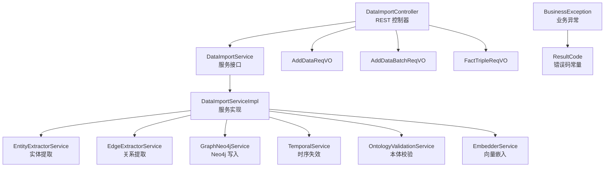
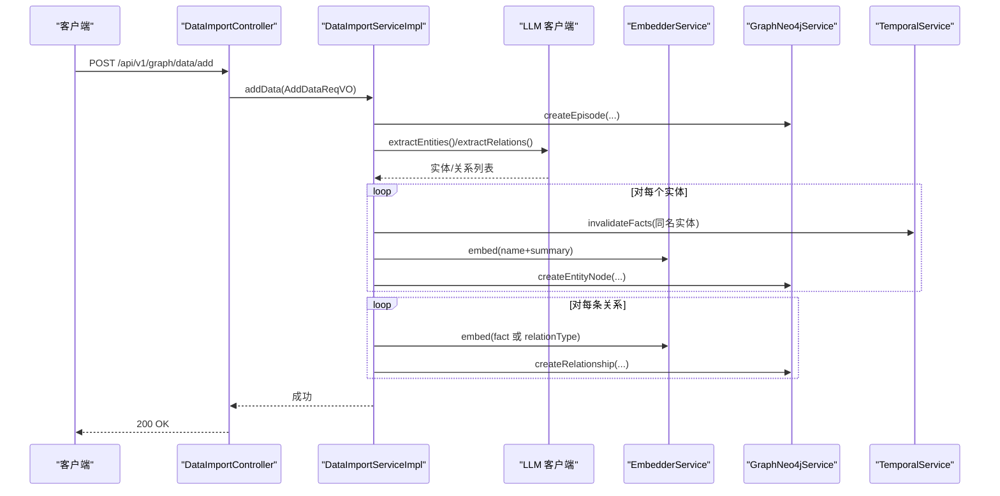
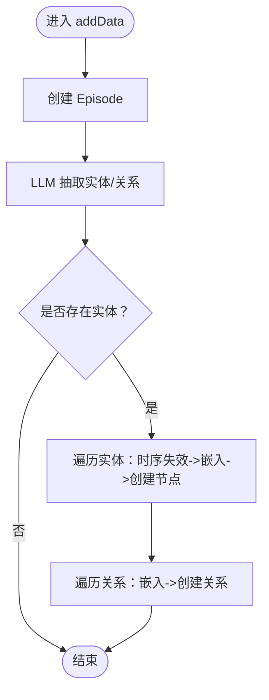
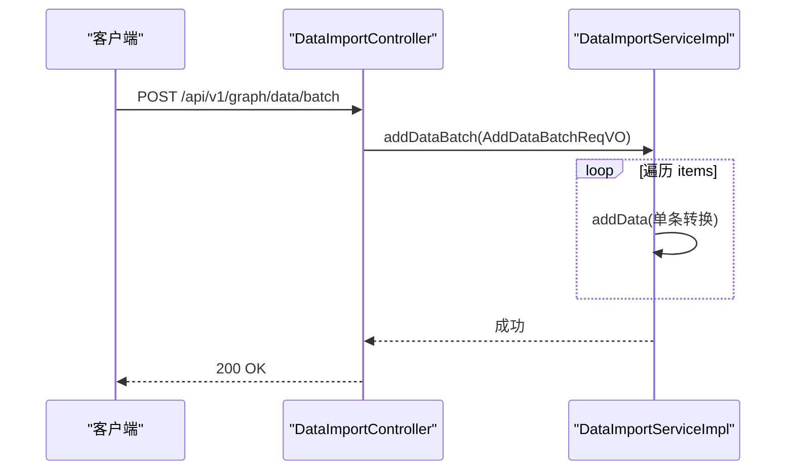
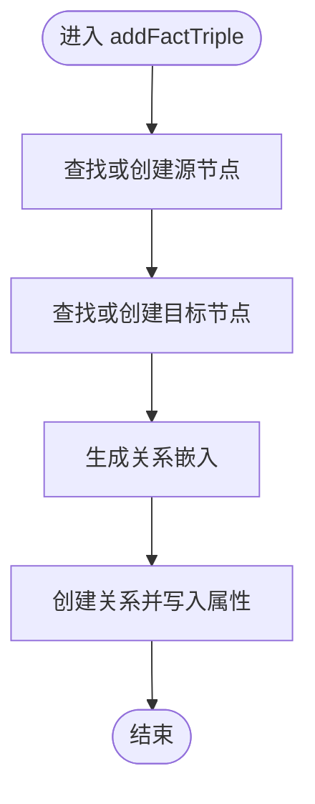
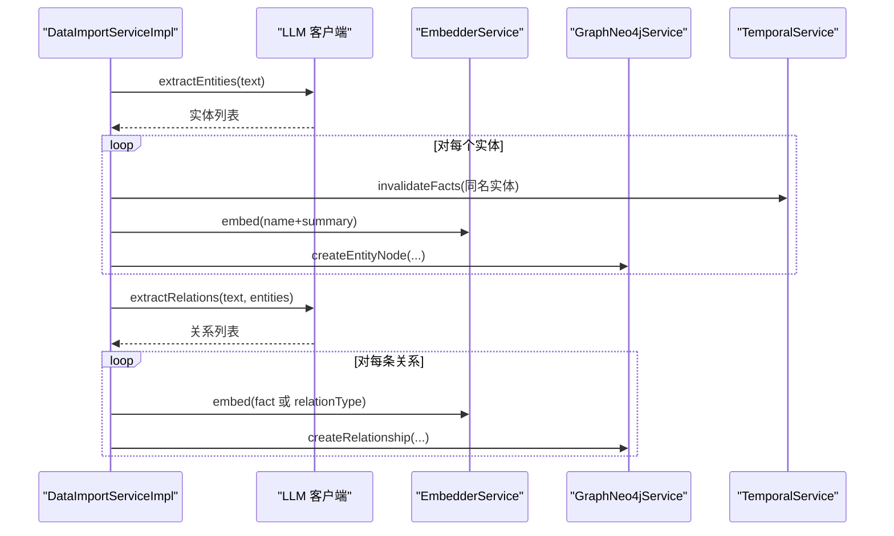
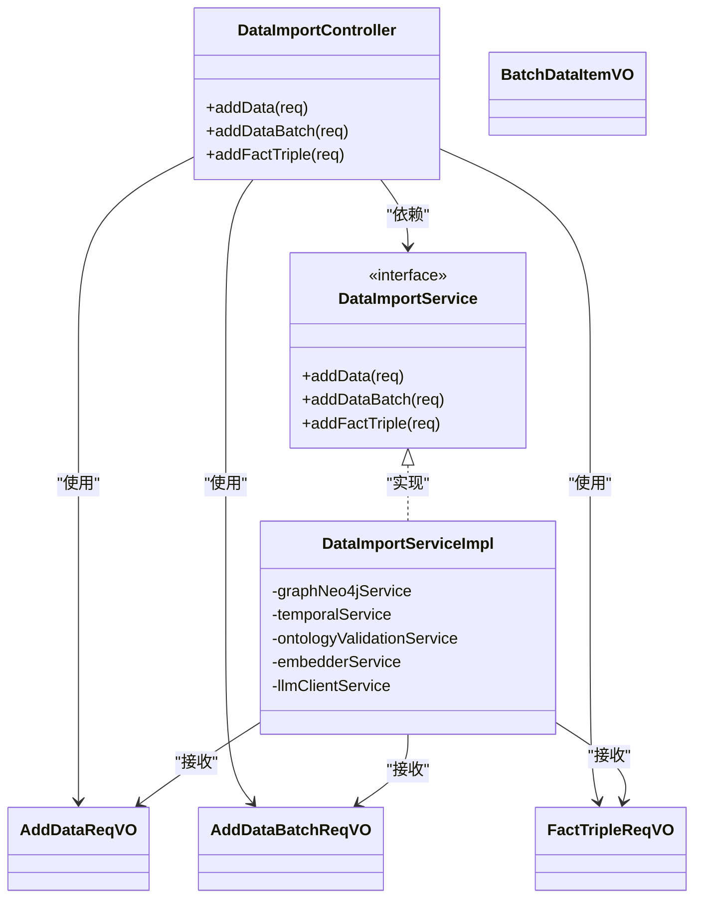

# 普通数据导入

<!--<cite>
**本文引用的文件**
- [DataImportController.java](file://graphiti-module-core/src/main/java/com/graphiti/module/graphiti/controller/admin/DataImportController.java)
- [DataImportService.java](file://graphiti-module-core/src/main/java/com/graphiti/module/graphiti/service/DataImportService.java)
- [DataImportServiceImpl.java](file://graphiti-module-core/src/main/java/com/graphiti/module/graphiti/service/impl/DataImportServiceImpl.java)
- [AddDataReqVO.java](file://graphiti-module-core/src/main/java/com/graphiti/module/graphiti/vo/imports/AddDataReqVO.java)
- [AddDataBatchReqVO.java](file://graphiti-module-core/src/main/java/com/graphiti/module/graphiti/vo/imports/AddDataBatchReqVO.java)
- [BatchDataItemVO.java](file://graphiti-module-core/src/main/java/com/graphiti/module/graphiti/vo/imports/BatchDataItemVO.java)
- [FactTripleReqVO.java](file://graphiti-module-core/src/main/java/com/graphiti/module/graphiti/vo/imports/FactTripleReqVO.java)
- [ResultCode.java](file://graphiti-framework/graphiti-common/src/main/java/com/graphiti/common/constants/ResultCode.java)
- [BusinessException.java](file://graphiti-framework/graphiti-common/src/main/java/com/graphiti/common/exception/BusinessException.java)
- [EntityExtractorService.java](file://graphiti-module-core/src/main/java/com/graphiti/module/graphiti/service/EntityExtractorService.java)
- [EdgeExtractorService.java](file://graphiti-module-core/src/main/java/com/graphiti/module/graphiti/service/EdgeExtractorService.java)
</cite>-->

## 目录
1. [简介](#简介)
2. [项目结构](#项目结构)
3. [核心组件](#核心组件)
4. [架构总览](#架构总览)
5. [详细组件分析](#详细组件分析)
6. [依赖分析](#依赖分析)
7. [性能考虑](#性能考虑)
8. [故障排查指南](#故障排查指南)
9. [结论](#结论)
10. [附录](#附录)

## 简介
本文件为 ontograph-java 普通数据导入功能的详细 API 文档，聚焦以下核心接口：
- 单条数据添加：/api/v1/graph/data/add
- 批量数据导入：/api/v1/graph/data/batch
- 事实三元组添加：/api/v1/graph/data/fact-triple

文档同时阐述 LLM 驱动的实体与关系自动抽取流程、数据预处理规则、重复数据检测机制，并给出请求参数格式、响应结构、错误码说明及最佳实践与性能优化建议，帮助数据工程师与系统集成商高效完成导入任务。

## 项目结构
围绕“普通数据导入”主题，后端采用分层设计：
- 控制器层：对外暴露 REST API，负责参数接收与鉴权
- 服务层：定义导入行为契约与实现，封装 LLM 抽取、向量嵌入、图数据库写入、时序失效等逻辑
- VO 层：定义请求参数模型，确保输入校验与可读性
- 异常与常量：统一错误码与异常处理

图表来源
- [DataImportController.java:24-62](file://graphiti-module-core/src/main/java/com/graphiti/module/graphiti/controller/admin/DataImportController.java#L24-L62)
- [DataImportService.java:20-74](file://graphiti-module-core/src/main/java/com/graphiti/module/graphiti/service/DataImportService.java#L20-L74)
- [DataImportServiceImpl.java:27-323](file://graphiti-module-core/src/main/java/com/graphiti/module/graphiti/service/impl/DataImportServiceImpl.java#L27-L323)
- [EntityExtractorService.java:11-62](file://graphiti-module-core/src/main/java/com/graphiti/module/graphiti/service/EntityExtractorService.java#L11-L62)
- [EdgeExtractorService.java:13-63](file://graphiti-module-core/src/main/java/com/graphiti/module/graphiti/service/EdgeExtractorService.java#L13-L63)
- [BusinessException.java:10-32](file://graphiti-framework/graphiti-common/src/main/java/com/graphiti/common/exception/BusinessException.java#L10-L32)
- [ResultCode.java:7-22](file://graphiti-framework/graphiti-common/src/main/java/com/graphiti/common/constants/ResultCode.java#L7-L22)

章节来源
- [DataImportController.java:24-62](file://graphiti-module-core/src/main/java/com/graphiti/module/graphiti/controller/admin/DataImportController.java#L24-L62)
- [DataImportService.java:20-74](file://graphiti-module-core/src/main/java/com/graphiti/module/graphiti/service/DataImportService.java#L20-L74)
- [DataImportServiceImpl.java:27-323](file://graphiti-module-core/src/main/java/com/graphiti/module/graphiti/service/impl/DataImportServiceImpl.java#L27-L323)

## 核心组件
- 控制器：提供三个导入接口与若干删除接口，均受 Bearer 认证保护
- 服务接口：定义 addData、addDataBatch、addMessages、addFactTriple、addEntityNode 等方法
- 服务实现：串联 LLM 实体/关系抽取、向量嵌入、Neo4j 写入、时序失效与本体校验
- VO 参数模型：AddDataReqVO、AddDataBatchReqVO、BatchDataItemVO、FactTripleReqVO
- 异常与错误码：BusinessException 与 ResultCode 常量

章节来源
- [DataImportController.java:27-111](file://graphiti-module-core/src/main/java/com/graphiti/module/graphiti/controller/admin/DataImportController.java#L27-L111)
- [DataImportService.java:20-74](file://graphiti-module-core/src/main/java/com/graphiti/module/graphiti/service/DataImportService.java#L20-L74)
- [DataImportServiceImpl.java:27-323](file://graphiti-module-core/src/main/java/com/graphiti/module/graphiti/service/impl/DataImportServiceImpl.java#L27-L323)
- [AddDataReqVO.java:14-39](file://graphiti-module-core/src/main/java/com/graphiti/module/graphiti/vo/imports/AddDataReqVO.java#L14-L39)
- [AddDataBatchReqVO.java:18-35](file://graphiti-module-core/src/main/java/com/graphiti/module/graphiti/vo/imports/AddDataBatchReqVO.java#L18-L35)
- [BatchDataItemVO.java:13-28](file://graphiti-module-core/src/main/java/com/graphiti/module/graphiti/vo/imports/BatchDataItemVO.java#L13-L28)
- [FactTripleReqVO.java:14-38](file://graphiti-module-core/src/main/java/com/graphiti/module/graphiti/vo/imports/FactTripleReqVO.java#L14-L38)
- [BusinessException.java:10-32](file://graphiti-framework/graphiti-common/src/main/java/com/graphiti/common/exception/BusinessException.java#L10-L32)
- [ResultCode.java:7-22](file://graphiti-framework/graphiti-common/src/main/java/com/graphiti/common/constants/ResultCode.java#L7-L22)

## 架构总览
下图展示“普通数据导入”的端到端流程：控制器接收请求 → 服务实现执行 LLM 抽取与写入 → Neo4j 存储 → 返回统一响应。

图表来源
- [DataImportController.java:32-38](file://graphiti-module-core/src/main/java/com/graphiti/module/graphiti/controller/admin/DataImportController.java#L32-L38)
- [DataImportServiceImpl.java:35-109](file://graphiti-module-core/src/main/java/com/graphiti/module/graphiti/service/impl/DataImportServiceImpl.java#L35-L109)

## 详细组件分析

### 接口清单与用途
- POST /api/v1/graph/data/add
  - 功能：添加单条数据，自动抽取实体与关系并写入图数据库
  - 认证：Bearer Token
  - 请求体：AddDataReqVO
  - 响应：200 成功，返回布尔值
- POST /api/v1/graph/data/batch
  - 功能：批量导入数据，逐条执行 addData
  - 认证：Bearer Token
  - 请求体：AddDataBatchReqVO
  - 响应：200 成功
- POST /api/v1/graph/data/fact-triple
  - 功能：直接添加事实三元组（源节点-关系-目标节点）
  - 认证：Bearer Token
  - 请求体：FactTripleReqVO
  - 响应：200 成功

章节来源
- [DataImportController.java:32-62](file://graphiti-module-core/src/main/java/com/graphiti/module/graphiti/controller/admin/DataImportController.java#L32-L62)

### 单条数据添加（/api/v1/graph/data/add）
- 处理流程
  - 创建 Episode 记录
  - LLM 抽取实体与关系
  - 对每个实体：时序失效同名旧实体、生成嵌入、创建节点
  - 对每条关系：生成嵌入、创建关系
- 请求参数（AddDataReqVO）
  - graphId：目标图谱 ID（必填）
  - content：数据内容（必填）
  - sourceType：来源类型（默认 text）
  - sourceDescription：来源描述
  - name：Episode 名称（可选）
  - referenceTime：参考时间（影响时序）
  - updateCommunities：是否更新社区（默认 false）
- 响应
  - 200 成功；内部可能抛出业务异常
- 错误码
  - 1006：参数非法（如 content 为空）

图表来源
- [DataImportServiceImpl.java:35-109](file://graphiti-module-core/src/main/java/com/graphiti/module/graphiti/service/impl/DataImportServiceImpl.java#L35-L109)

章节来源
- [DataImportServiceImpl.java:35-109](file://graphiti-module-core/src/main/java/com/graphiti/module/graphiti/service/impl/DataImportServiceImpl.java#L35-L109)
- [AddDataReqVO.java:17-38](file://graphiti-module-core/src/main/java/com/graphiti/module/graphiti/vo/imports/AddDataReqVO.java#L17-L38)
- [ResultCode.java:21](file://graphiti-framework/graphiti-common/src/main/java/com/graphiti/common/constants/ResultCode.java#L21)

### 批量数据导入（/api/v1/graph/data/batch）
- 处理流程
  - 逐条将 BatchDataItemVO 转换为 AddDataReqVO 并调用 addData
- 请求参数（AddDataBatchReqVO）
  - graphId：目标图谱 ID（必填）
  - items：数据项列表（必填），每项包含 content、sourceType、sourceDescription、name
  - referenceTime：批次参考时间
  - updateCommunities：是否更新社区
- 响应
  - 200 成功；内部可能抛出业务异常

图表来源
- [DataImportController.java:40-46](file://graphiti-module-core/src/main/java/com/graphiti/module/graphiti/controller/admin/DataImportController.java#L40-L46)
- [DataImportServiceImpl.java:111-126](file://graphiti-module-core/src/main/java/com/graphiti/module/graphiti/service/impl/DataImportServiceImpl.java#L111-L126)
- [AddDataBatchReqVO.java:22-34](file://graphiti-module-core/src/main/java/com/graphiti/module/graphiti/vo/imports/AddDataBatchReqVO.java#L22-L34)
- [BatchDataItemVO.java:16-27](file://graphiti-module-core/src/main/java/com/graphiti/module/graphiti/vo/imports/BatchDataItemVO.java#L16-L27)

章节来源
- [DataImportController.java:40-46](file://graphiti-module-core/src/main/java/com/graphiti/module/graphiti/controller/admin/DataImportController.java#L40-L46)
- [DataImportServiceImpl.java:111-126](file://graphiti-module-core/src/main/java/com/graphiti/module/graphiti/service/impl/DataImportServiceImpl.java#L111-L126)
- [AddDataBatchReqVO.java:18-35](file://graphiti-module-core/src/main/java/com/graphiti/module/graphiti/vo/imports/AddDataBatchReqVO.java#L18-L35)
- [BatchDataItemVO.java:13-28](file://graphiti-module-core/src/main/java/com/graphiti/module/graphiti/vo/imports/BatchDataItemVO.java#L13-L28)

### 事实三元组添加（/api/v1/graph/data/fact-triple）
- 处理流程
  - 查找或创建源节点与目标节点
  - 生成关系嵌入，创建关系并写入属性
- 请求参数（FactTripleReqVO）
  - graphId：目标图谱 ID（必填）
  - sourceNodeName：源节点名称（必填）
  - relationType：关系类型（必填）
  - targetNodeName：目标节点名称（必填）
  - fact：事实描述（可选）
  - properties：额外属性（可选）
- 响应
  - 200 成功；内部可能抛出业务异常

图表来源
- [DataImportServiceImpl.java:198-224](file://graphiti-module-core/src/main/java/com/graphiti/module/graphiti/service/impl/DataImportServiceImpl.java#L198-L224)
- [FactTripleReqVO.java:17-37](file://graphiti-module-core/src/main/java/com/graphiti/module/graphiti/vo/imports/FactTripleReqVO.java#L17-L37)

章节来源
- [DataImportServiceImpl.java:198-224](file://graphiti-module-core/src/main/java/com/graphiti/module/graphiti/service/impl/DataImportServiceImpl.java#L198-L224)
- [FactTripleReqVO.java:14-38](file://graphiti-module-core/src/main/java/com/graphiti/module/graphiti/vo/imports/FactTripleReqVO.java#L14-L38)

### LLM 驱动的实体关系自动抽取流程
- 实体抽取
  - 输入：文本内容
  - 输出：实体列表（名称、类型、摘要、属性）
  - 时序管理：对同名实体进行失效处理，避免历史事实污染
- 关系抽取
  - 输入：文本内容 + 已提取实体
  - 输出：关系列表（源实体、关系类型、目标实体、事实描述）
- 嵌入生成
  - 节点：name + summary
  - 关系：fact 或 relationType
- 写入图数据库
  - 节点：创建实体节点并写入属性
  - 关系：创建关系并写入属性

图表来源
- [DataImportServiceImpl.java:51-104](file://graphiti-module-core/src/main/java/com/graphiti/module/graphiti/service/impl/DataImportServiceImpl.java#L51-L104)
- [EntityExtractorService.java:21](file://graphiti-module-core/src/main/java/com/graphiti/module/graphiti/service/EntityExtractorService.java#L21)
- [EdgeExtractorService.java:25](file://graphiti-module-core/src/main/java/com/graphiti/module/graphiti/service/EdgeExtractorService.java#L25)

章节来源
- [DataImportServiceImpl.java:51-104](file://graphiti-module-core/src/main/java/com/graphiti/module/graphiti/service/impl/DataImportServiceImpl.java#L51-L104)
- [EntityExtractorService.java:11-62](file://graphiti-module-core/src/main/java/com/graphiti/module/graphiti/service/EntityExtractorService.java#L11-L62)
- [EdgeExtractorService.java:13-63](file://graphiti-module-core/src/main/java/com/graphiti/module/graphiti/service/EdgeExtractorService.java#L13-L63)

### 数据预处理规则
- 内容清洗
  - 去除空白内容，避免无效处理
- 时间语义
  - referenceTime 作为参考时间，用于解析相对时间与事件排序
- 本体约束
  - 若图谱启用本体，节点属性需满足本体约束；可通过验证结果合并增强属性
- 重复数据检测机制
  - 同名实体在写入前会触发时序失效，确保新事实覆盖旧事实
  - 三元组创建时不会重复创建相同关系，但不会阻止重复三元组写入

章节来源
- [DataImportServiceImpl.java:53-57](file://graphiti-module-core/src/main/java/com/graphiti/module/graphiti/service/impl/DataImportServiceImpl.java#L53-L57)
- [DataImportServiceImpl.java:254-265](file://graphiti-module-core/src/main/java/com/graphiti/module/graphiti/service/impl/DataImportServiceImpl.java#L254-L265)
- [DataImportServiceImpl.java:69-70](file://graphiti-module-core/src/main/java/com/graphiti/module/graphiti/service/impl/DataImportServiceImpl.java#L69-L70)

### 请求参数与响应结构
- 统一响应
  - 成功：200，返回布尔值 true
  - 失败：4xx/5xx，返回错误码与错误信息
- 错误码
  - 200：成功
  - 400：参数错误
  - 401：未认证
  - 403：权限不足
  - 404：资源不存在
  - 500：服务器内部错误
  - 1006：参数非法（如节点名称为空）

章节来源
- [ResultCode.java:8-22](file://graphiti-framework/graphiti-common/src/main/java/com/graphiti/common/constants/ResultCode.java#L8-L22)
- [BusinessException.java:10-32](file://graphiti-framework/graphiti-common/src/main/java/com/graphiti/common/exception/BusinessException.java#L10-L32)

## 依赖分析
- 控制器依赖服务接口，服务实现依赖 LLM、嵌入、Neo4j、时序与本体校验模块
- VO 类承担参数校验职责，确保输入合法性
- 异常体系通过 BusinessException 与 ResultCode 统一错误表达

图表来源
- [DataImportController.java:27-62](file://graphiti-module-core/src/main/java/com/graphiti/module/graphiti/controller/admin/DataImportController.java#L27-L62)
- [DataImportService.java:20-74](file://graphiti-module-core/src/main/java/com/graphiti/module/graphiti/service/DataImportService.java#L20-L74)
- [DataImportServiceImpl.java:27-323](file://graphiti-module-core/src/main/java/com/graphiti/module/graphiti/service/impl/DataImportServiceImpl.java#L27-L323)
- [AddDataReqVO.java:14-39](file://graphiti-module-core/src/main/java/com/graphiti/module/graphiti/vo/imports/AddDataReqVO.java#L14-L39)
- [AddDataBatchReqVO.java:18-35](file://graphiti-module-core/src/main/java/com/graphiti/module/graphiti/vo/imports/AddDataBatchReqVO.java#L18-L35)
- [BatchDataItemVO.java:13-28](file://graphiti-module-core/src/main/java/com/graphiti/module/graphiti/vo/imports/BatchDataItemVO.java#L13-L28)
- [FactTripleReqVO.java:14-38](file://graphiti-module-core/src/main/java/com/graphiti/module/graphiti/vo/imports/FactTripleReqVO.java#L14-L38)

## 性能考虑
- 批量导入
  - 当前实现为顺序逐条调用 addData，建议在上游进行分批与并发控制，降低往返开销
- LLM 调用
  - 合理设置提示词与上下文长度，避免过长文本导致延迟与成本上升
- 嵌入生成
  - 将实体与关系的嵌入生成集中化，减少重复计算
- 图写入
  - 在大规模写入场景下，建议使用事务与批量提交策略，提升吞吐
- 时序失效
  - 同名实体失效仅针对名称匹配，避免全表扫描；可在高频场景下引入缓存或索引优化

## 故障排查指南
- 常见错误与定位
  - 400 参数错误：检查 graphId、content、sourceNodeName、relationType 等必填字段
  - 401 未认证：确认 Bearer Token 是否正确传递
  - 404 资源不存在：检查图谱 ID、边 UUID、Episode UUID 是否有效
  - 1006 参数非法：节点名称为空或缺失
- 日志与追踪
  - 服务实现记录关键步骤日志，便于定位 LLM 抽取失败、嵌入生成异常或写入失败
- 本体校验失败
  - 若图谱启用了本体，节点属性需满足约束；可通过验证结果合并增强属性后重试

章节来源
- [BusinessException.java:10-32](file://graphiti-framework/graphiti-common/src/main/java/com/graphiti/common/exception/BusinessException.java#L10-L32)
- [DataImportServiceImpl.java:282-314](file://graphiti-module-core/src/main/java/com/graphiti/module/graphiti/service/impl/DataImportServiceImpl.java#L282-L314)
- [DataImportServiceImpl.java:267-269](file://graphiti-module-core/src/main/java/com/graphiti/module/graphiti/service/impl/DataImportServiceImpl.java#L267-L269)

## 结论
本文档系统梳理了 ontograph-java 普通数据导入的核心接口、LLM 抽取流程、数据预处理与去重机制，并提供了参数、响应与错误码说明以及性能优化与故障排查建议。建议在生产环境中结合批量并发、嵌入缓存与事务提交等策略，持续优化导入性能与稳定性。

## 附录
- 最佳实践
  - 明确图谱本体与属性约束，提前准备实体/关系类型配置
  - 对长文本进行分段处理，控制单次 LLM 输入长度
  - 批量导入时设置合理的并发度与重试策略
  - 对高频实体建立名称索引，加速时序失效与节点查找
- 参考实现位置
  - 控制器与服务接口：[DataImportController.java:27-62](file://graphiti-module-core/src/main/java/com/graphiti/module/graphiti/controller/admin/DataImportController.java#L27-L62)，[DataImportService.java:20-74](file://graphiti-module-core/src/main/java/com/graphiti/module/graphiti/service/DataImportService.java#L20-L74)
  - 服务实现与流程：[DataImportServiceImpl.java:27-323](file://graphiti-module-core/src/main/java/com/graphiti/module/graphiti/service/impl/DataImportServiceImpl.java#L27-L323)
  - 参数模型：[AddDataReqVO.java:14-39](file://graphiti-module-core/src/main/java/com/graphiti/module/graphiti/vo/imports/AddDataReqVO.java#L14-L39)，[AddDataBatchReqVO.java:18-35](file://graphiti-module-core/src/main/java/com/graphiti/module/graphiti/vo/imports/AddDataBatchReqVO.java#L18-L35)，[FactTripleReqVO.java:14-38](file://graphiti-module-core/src/main/java/com/graphiti/module/graphiti/vo/imports/FactTripleReqVO.java#L14-L38)
  - 错误码与异常：[ResultCode.java:7-22](file://graphiti-framework/graphiti-common/src/main/java/com/graphiti/common/constants/ResultCode.java#L7-L22)，[BusinessException.java:10-32](file://graphiti-framework/graphiti-common/src/main/java/com/graphiti/common/exception/BusinessException.java#L10-L32)