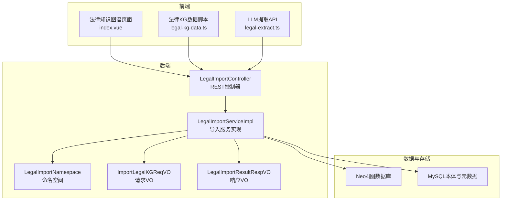
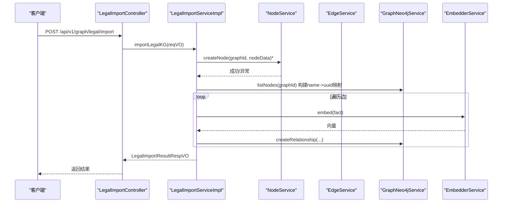
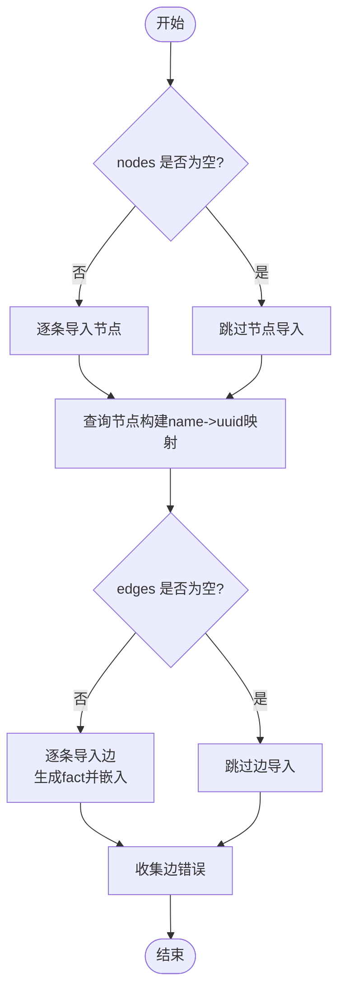
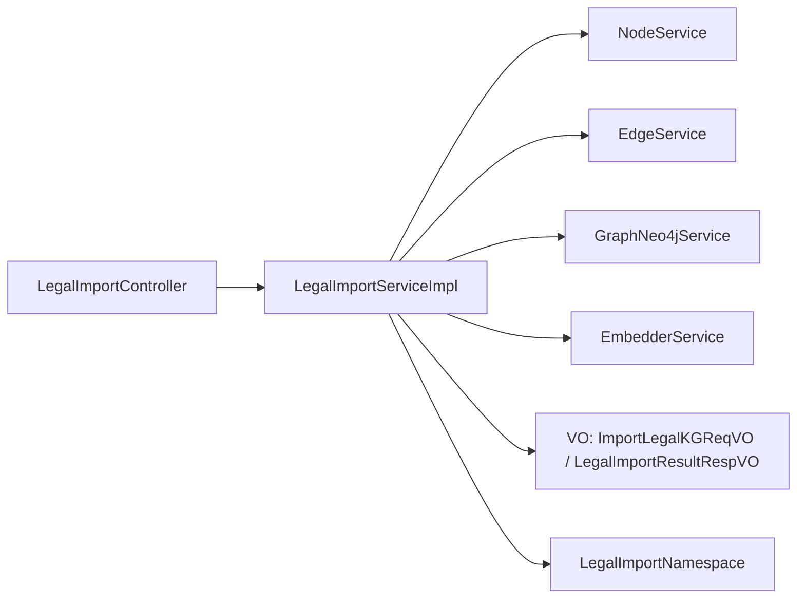

# 法律知识图谱导入

<cite>
**本文档引用的文件**
- [LegalImportController.java](file://graphiti-module-core/src/main/java/com/graphiti/module/graphiti/controller/admin/LegalImportController.java)
- [LegalImportService.java](file://graphiti-module-core/src/main/java/com/graphiti/module/graphiti/service/LegalImportService.java)
- [LegalImportServiceImpl.java](file://graphiti-module-core/src/main/java/com/graphiti/module/graphiti/service/impl/LegalImportServiceImpl.java)
- [LegalImportNamespace.java](file://graphiti-module-core/src/main/java/com/graphiti/module/graphiti/namespace/LegalImportNamespace.java)
- [ImportLegalKGReqVO.java](file://graphiti-module-core/src/main/java/com/graphiti/module/graphiti/vo/legal/ImportLegalKGReqVO.java)
- [LegalImportResultRespVO.java](file://graphiti-module-core/src/main/java/com/graphiti/module/graphiti/vo/legal/LegalImportResultRespVO.java)
- [legal-kg-data.ts](file://graphiti-web/src/api/legal-kg-data.ts)
- [legal-extract.ts](file://graphiti-web/src/api/legal-extract.ts)
- [index.vue](file://graphiti-web/src/views/legal-kg/index.vue)
- [ontology.md](file://docs/ontology.md)
- [V6__seed_legal_ontology_v2.sql](file://sql/postgresql/V6__seed_legal_ontology_v2.sql)
- [extract_entities.txt](file://graphiti-module-core/src/main/resources/prompts/extract_entities.txt)
</cite>

## 目录
1. [简介](#简介)
2. [项目结构](#项目结构)
3. [核心组件](#核心组件)
4. [架构总览](#架构总览)
5. [详细组件分析](#详细组件分析)
6. [依赖分析](#依赖分析)
7. [性能考虑](#性能考虑)
8. [故障排除指南](#故障排除指南)
9. [结论](#结论)
10. [附录](#附录)

## 简介
本文件为 Graphiti-Java 法律知识图谱导入功能的专业 API 文档，聚焦于法律 KG 数据导入接口 /api/v1/graph/legal/import 的特殊要求与处理流程。文档涵盖法律实体识别、法律关系抽取、案例数据标准化等专业能力，提供法律数据格式规范、Schema 定义、数据质量检查规则，并结合实际示例与最佳实践，帮助法律数据处理专家与司法科技开发者构建稳定高效的法律知识图谱导入解决方案。

## 项目结构
法律知识图谱导入功能位于后端模块 graphiti-module-core 中，采用分层设计：
- 控制器层：提供 REST 接口，暴露批量导入、节点导入、边导入、示例数据导入、导出等能力
- 服务层：封装导入逻辑，协调节点/边创建、嵌入生成、Neo4j 写入
- 视图模型：定义请求/响应数据结构
- 前端集成：提供可视化界面与示例数据脚本

图表来源
- [LegalImportController.java:32-136](file://graphiti-module-core/src/main/java/com/graphiti/module/graphiti/controller/admin/LegalImportController.java#L32-L136)
- [LegalImportServiceImpl.java:16-467](file://graphiti-module-core/src/main/java/com/graphiti/module/graphiti/service/impl/LegalImportServiceImpl.java#L16-L467)
- [LegalImportNamespace.java:24-82](file://graphiti-module-core/src/main/java/com/graphiti/module/graphiti/namespace/LegalImportNamespace.java#L24-L82)
- [ImportLegalKGReqVO.java:14-29](file://graphiti-module-core/src/main/java/com/graphiti/module/graphiti/vo/legal/ImportLegalKGReqVO.java#L14-L29)
- [LegalImportResultRespVO.java:12-43](file://graphiti-module-core/src/main/java/com/graphiti/module/graphiti/vo/legal/LegalImportResultRespVO.java#L12-L43)

章节来源
- [LegalImportController.java:32-136](file://graphiti-module-core/src/main/java/com/graphiti/module/graphiti/controller/admin/LegalImportController.java#L32-L136)
- [LegalImportServiceImpl.java:16-467](file://graphiti-module-core/src/main/java/com/graphiti/module/graphiti/service/impl/LegalImportServiceImpl.java#L16-467)
- [LegalImportNamespace.java:24-82](file://graphiti-module-core/src/main/java/com/graphiti/module/graphiti/namespace/LegalImportNamespace.java#L24-82)

## 核心组件
- LegalImportController：提供 /api/v1/graph/legal/import 等 REST 接口，负责接收请求、参数校验与响应包装
- LegalImportService/LegalImportServiceImpl：实现导入核心逻辑，包括节点批量导入、边批量导入、名称到 UUID 映射、嵌入生成、Neo4j 写入、示例数据与导出
- LegalImportNamespace：封装导入操作，便于在其他场景复用
- VO：ImportLegalKGReqVO（请求）、LegalImportResultRespVO（响应）

章节来源
- [LegalImportController.java:32-136](file://graphiti-module-core/src/main/java/com/graphiti/module/graphiti/controller/admin/LegalImportController.java#L32-L136)
- [LegalImportService.java:12-47](file://graphiti-module-core/src/main/java/com/graphiti/module/graphiti/service/LegalImportService.java#L12-L47)
- [LegalImportServiceImpl.java:16-467](file://graphiti-module-core/src/main/java/com/graphiti/module/graphiti/service/impl/LegalImportServiceImpl.java#L16-467)
- [LegalImportNamespace.java:24-82](file://graphiti-module-core/src/main/java/com/graphiti/module/graphiti/namespace/LegalImportNamespace.java#L24-82)
- [ImportLegalKGReqVO.java:14-29](file://graphiti-module-core/src/main/java/com/graphiti/module/graphiti/vo/legal/ImportLegalKGReqVO.java#L14-L29)
- [LegalImportResultRespVO.java:12-43](file://graphiti-module-core/src/main/java/com/graphiti/module/graphiti/vo/legal/LegalImportResultRespVO.java#L12-43)

## 架构总览
法律知识图谱导入采用双存储架构：MySQL 存放本体与元数据，Neo4j 存放图数据与向量索引。导入流程遵循“节点优先、边次之”的顺序，边导入前需建立名称到 UUID 的映射；同时，边的描述文本会通过嵌入服务生成向量，写入 Neo4j 并更新统计。

图表来源
- [LegalImportController.java:45-56](file://graphiti-module-core/src/main/java/com/graphiti/module/graphiti/controller/admin/LegalImportController.java#L45-L56)
- [LegalImportServiceImpl.java:30-61](file://graphiti-module-core/src/main/java/com/graphiti/module/graphiti/service/impl/LegalImportServiceImpl.java#L30-L61)
- [LegalImportServiceImpl.java:81-127](file://graphiti-module-core/src/main/java/com/graphiti/module/graphiti/service/impl/LegalImportServiceImpl.java#L81-L127)

## 详细组件分析

### API：批量导入法律图谱（/api/v1/graph/legal/import）
- 请求体：ImportLegalKGReqVO，包含 graphId、nodes、edges
- 处理流程：
  1) 节点导入：逐条调用节点服务创建，记录成功数量与错误信息
  2) 边导入：先查询全部节点构建 name->uuid 映射，再逐条创建关系，生成 fact 文本并嵌入向量
  3) 返回 LegalImportResultRespVO，包含节点/边数量与错误列表
- 错误收集：节点/边导入失败时记录简要信息，便于定位问题

图表来源
- [LegalImportServiceImpl.java:30-61](file://graphiti-module-core/src/main/java/com/graphiti/module/graphiti/service/impl/LegalImportServiceImpl.java#L30-L61)
- [LegalImportServiceImpl.java:81-127](file://graphiti-module-core/src/main/java/com/graphiti/module/graphiti/service/impl/LegalImportServiceImpl.java#L81-L127)

章节来源
- [LegalImportController.java:45-56](file://graphiti-module-core/src/main/java/com/graphiti/module/graphiti/controller/admin/LegalImportController.java#L45-L56)
- [LegalImportServiceImpl.java:30-61](file://graphiti-module-core/src/main/java/com/graphiti/module/graphiti/service/impl/LegalImportServiceImpl.java#L30-L61)
- [LegalImportServiceImpl.java:81-127](file://graphiti-module-core/src/main/java/com/graphiti/module/graphiti/service/impl/LegalImportServiceImpl.java#L81-L127)
- [ImportLegalKGReqVO.java:14-29](file://graphiti-module-core/src/main/java/com/graphiti/module/graphiti/vo/legal/ImportLegalKGReqVO.java#L14-L29)
- [LegalImportResultRespVO.java:12-43](file://graphiti-module-core/src/main/java/com/graphiti/module/graphiti/vo/legal/LegalImportResultRespVO.java#L12-43)

### API：批量导入法律节点（/api/v1/graph/legal/nodes）
- 参数：graphId（路径参数），nodes（请求体，数组）
- 处理：逐条导入节点，返回成功/总数统计

章节来源
- [LegalImportController.java:61-73](file://graphiti-module-core/src/main/java/com/graphiti/module/graphiti/controller/admin/LegalImportController.java#L61-L73)
- [LegalImportServiceImpl.java:63-78](file://graphiti-module-core/src/main/java/com/graphiti/module/graphiti/service/impl/LegalImportServiceImpl.java#L63-L78)

### API：批量导入法律边（/api/v1/graph/legal/edges）
- 参数：graphId（路径参数），edges（请求体，数组）
- 处理：构建 name->uuid 映射，逐条导入边，生成 fact 文本并嵌入向量

章节来源
- [LegalImportController.java:78-89](file://graphiti-module-core/src/main/java/com/graphiti/module/graphiti/controller/admin/LegalImportController.java#L78-L89)
- [LegalImportServiceImpl.java:81-127](file://graphiti-module-core/src/main/java/com/graphiti/module/graphiti/service/impl/LegalImportServiceImpl.java#L81-L127)

### API：导入商事调解条例法条（/api/v1/graph/legal/provisions）
- 功能：一键导入商事调解条例 33 条法条数据
- 返回：导入数量与法条名称

章节来源
- [LegalImportController.java:95-106](file://graphiti-module-core/src/main/java/com/graphiti/module/graphiti/controller/admin/LegalImportController.java#L95-L106)
- [LegalImportServiceImpl.java:129-133](file://graphiti-module-core/src/main/java/com/graphiti/module/graphiti/service/impl/LegalImportServiceImpl.java#L129-L133)

### API：导入示例案例（/api/v1/graph/legal/cases）
- 功能：导入预定义的示例案例数据（含案件、当事人、法院、法官、律师等）
- 返回：导入数量

章节来源
- [LegalImportController.java:111-121](file://graphiti-module-core/src/main/java/com/graphiti/module/graphiti/controller/admin/LegalImportController.java#L111-L121)
- [LegalImportServiceImpl.java:135-150](file://graphiti-module-core/src/main/java/com/graphiti/module/graphiti/service/impl/LegalImportServiceImpl.java#L135-L150)

### API：导出法律图谱数据（/api/v1/graph/legal/export）
- 功能：导出指定图谱的节点与边
- 返回：包含节点/边列表与数量

章节来源
- [LegalImportController.java:126-134](file://graphiti-module-core/src/main/java/com/graphiti/module/graphiti/controller/admin/LegalImportController.java#L126-L134)
- [LegalImportServiceImpl.java:152-168](file://graphiti-module-core/src/main/java/com/graphiti/module/graphiti/service/impl/LegalImportServiceImpl.java#L152-L168)

### 法律实体与关系 Schema 定义
- 实体类型（示例）：Case、Party、Court、Judge、LegalProvision、Lawyer、Evidence、JudgmentDocument、LegalOrganization、Mediator、MediationAgreement
- 关系类型（示例）：CASE_PARTY、CASE_JUDGE、CASE_COURT、CASE_LEGAL_PROVISION、CASE_EVIDENCE、CASE_JUDGMENT、PARTY_LAWYER、LEGAL_PROVISION_RELATED、CASE_RELATED、ORG_MEDIATOR、CASE_MEDIATION_ORG、CASE_MEDIATION_AGREEMENT
- 字段约束：通过本体约束（枚举、非空、范围等）保障数据质量

章节来源
- [legal-kg-data.ts:19-179](file://graphiti-web/src/api/legal-kg-data.ts#L19-L179)
- [legal-kg-data.ts:181-310](file://graphiti-web/src/api/legal-kg-data.ts#L181-L310)
- [V6__seed_legal_ontology_v2.sql:691-738](file://sql/postgresql/V6__seed_legal_ontology_v2.sql#L691-L738)

### 数据质量检查规则
- 类型存在性：节点/边类型必须在本体中定义
- 必填属性：根据本体要求检查必填字段
- 数据类型：严格匹配字符串、整数、浮点、布尔、日期、JSON 等
- 约束规则：枚举值、非空、范围、模式等
- 本体版本：通过 ACTIVE 版本的本体定义进行校验

章节来源
- [ontology.md:175-250](file://docs/ontology.md#L175-L250)
- [OntologyValidationServiceImpl.java:39-87](file://graphiti-module-core/src/main/java/com/graphiti/module/graphiti/service/impl/OntologyValidationServiceImpl.java#L39-L87)
- [OntologyValidationServiceImpl.java:89-129](file://graphiti-module-core/src/main/java/com/graphiti/module/graphiti/service/impl/OntologyValidationServiceImpl.java#L89-L129)
- [V6__seed_legal_ontology_v2.sql:691-738](file://sql/postgresql/V6__seed_legal_ontology_v2.sql#L691-L738)

### 法律实体识别与关系抽取（LLM 支持）
- 前端提供 JSON 文件上传与字段映射配置，后端通过 LLM 提取法律实体与关系
- 支持预览 JSON 字段结构、获取本体字段、提取并保存到图谱
- 提取模板：实体抽取提示词（extract_entities.txt）

章节来源
- [legal-extract.ts:145-195](file://graphiti-web/src/api/legal-extract.ts#L145-L195)
- [index.vue:299-504](file://graphiti-web/src/views/legal-kg/index.vue#L299-L504)
- [extract_entities.txt:1-28](file://graphiti-module-core/src/main/resources/prompts/extract_entities.txt#L1-L28)

### 案例数据标准化
- 示例数据包含：案件、当事人、法院、法官、律师、证据、裁判文书、调解协议、法律组织、调解员等
- 字段标准化：统一日期格式、枚举值、金额单位等
- 关系标准化：通过 UUID 引用，保证跨实体一致性

章节来源
- [legal-kg-data.ts:316-775](file://graphiti-web/src/api/legal-kg-data.ts#L316-L775)
- [legal-kg-data.ts:781-775](file://graphiti-web/src/api/legal-kg-data.ts#L781-L775)

## 依赖分析
- 控制器依赖服务接口，服务实现依赖节点/边服务、Neo4j 服务与嵌入服务
- 嵌入服务用于将边的描述文本转换为向量，支撑语义检索
- 本体约束与校验贯穿导入流程，确保数据质量

图表来源
- [LegalImportController.java:39-40](file://graphiti-module-core/src/main/java/com/graphiti/module/graphiti/controller/admin/LegalImportController.java#L39-L40)
- [LegalImportServiceImpl.java:21-24](file://graphiti-module-core/src/main/java/com/graphiti/module/graphiti/service/impl/LegalImportServiceImpl.java#L21-L24)
- [LegalImportServiceImpl.java:16-19](file://graphiti-module-core/src/main/java/com/graphiti/module/graphiti/service/impl/LegalImportServiceImpl.java#L16-L19)

章节来源
- [LegalImportController.java:39-40](file://graphiti-module-core/src/main/java/com/graphiti/module/graphiti/controller/admin/LegalImportController.java#L39-L40)
- [LegalImportServiceImpl.java:21-24](file://graphiti-module-core/src/main/java/com/graphiti/module/graphiti/service/impl/LegalImportServiceImpl.java#L21-L24)
- [LegalImportServiceImpl.java:16-19](file://graphiti-module-core/src/main/java/com/graphiti/module/graphiti/service/impl/LegalImportServiceImpl.java#L16-L19)

## 性能考虑
- 批量导入：建议分批提交 nodes/edges，避免单次请求过大
- 嵌入生成：根据数据量调整并发策略，避免嵌入服务过载
- Neo4j 写入：边导入前构建 name->uuid 映射，减少重复查询
- 本体校验：在导入前可先进行批量校验，降低失败率

## 故障排除指南
- 节点导入失败：检查 graphId、节点类型与必填字段，查看错误列表
- 边导入失败：确认源/目标节点名称是否存在，检查映射构建是否正确
- 嵌入异常：检查嵌入服务可用性与模型配置
- 本体约束错误：根据错误码与消息修正字段值（枚举、类型、非空等）

章节来源
- [LegalImportResultRespVO.java:26-36](file://graphiti-module-core/src/main/java/com/graphiti/module/graphiti/vo/legal/LegalImportResultRespVO.java#L26-L36)
- [LegalImportServiceImpl.java:185-202](file://graphiti-module-core/src/main/java/com/graphiti/module/graphiti/service/impl/LegalImportServiceImpl.java#L185-L202)
- [OntologyValidationServiceImpl.java:34-37](file://graphiti-module-core/src/main/java/com/graphiti/module/graphiti/service/impl/OntologyValidationServiceImpl.java#L34-L37)

## 结论
Graphiti-Java 的法律知识图谱导入功能通过严格的本体约束与双存储架构，提供了高可靠性的批量导入能力。结合实体识别与关系抽取的 LLM 支持，能够高效地将法律领域的结构化与半结构化数据转化为高质量的知识图谱，满足司法科技与法律数据处理的专业需求。

## 附录

### API 定义概览
- POST /api/v1/graph/legal/import：批量导入法律图谱（节点+边）
- POST /api/v1/graph/legal/nodes：批量导入法律节点
- POST /api/v1/graph/legal/edges：批量导入法律边
- POST /api/v1/graph/legal/provisions：导入商事调解条例法条
- POST /api/v1/graph/legal/cases：导入示例案例
- GET /api/v1/graph/legal/export：导出法律图谱数据

章节来源
- [LegalImportController.java:45-134](file://graphiti-module-core/src/main/java/com/graphiti/module/graphiti/controller/admin/LegalImportController.java#L45-L134)

### 法律数据格式规范要点
- graphId：目标图谱标识，必填
- nodes/edges：结构化数组，字段需符合本体定义
- UUID 引用：边使用 source/target 引用节点 UUID
- 日期格式：建议使用 ISO 8601
- 枚举值：严格遵循本体约束枚举集合

章节来源
- [ImportLegalKGReqVO.java:19-27](file://graphiti-module-core/src/main/java/com/graphiti/module/graphiti/vo/legal/ImportLegalKGReqVO.java#L19-L27)
- [legal-kg-data.ts:19-310](file://graphiti-web/src/api/legal-kg-data.ts#L19-L310)

### 最佳实践
- 先导入本体定义，再导入节点与边
- 使用示例数据作为基准，逐步扩展
- 在生产环境启用本体校验，确保数据质量
- 对大体量数据采用分批导入与并发控制

章节来源
- [index.vue:537-565](file://graphiti-web/src/views/legal-kg/index.vue#L537-L565)
- [ontology.md:175-250](file://docs/ontology.md#L175-L250)