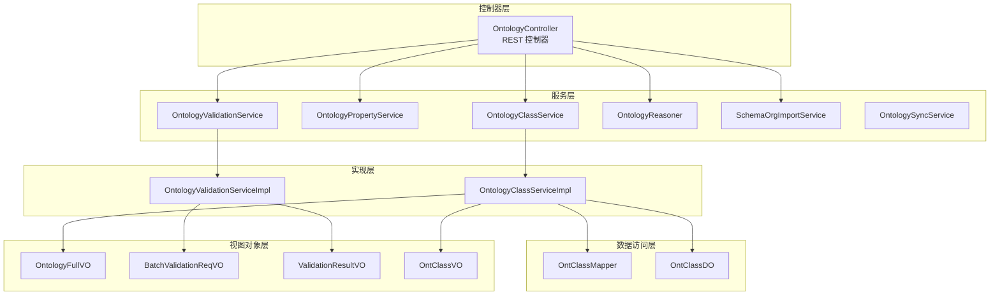
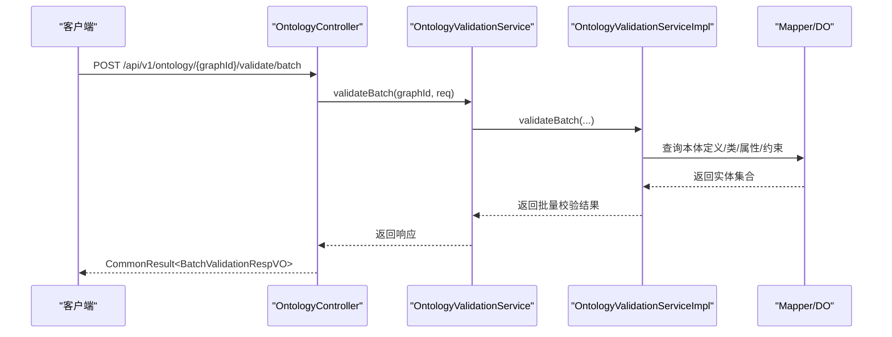
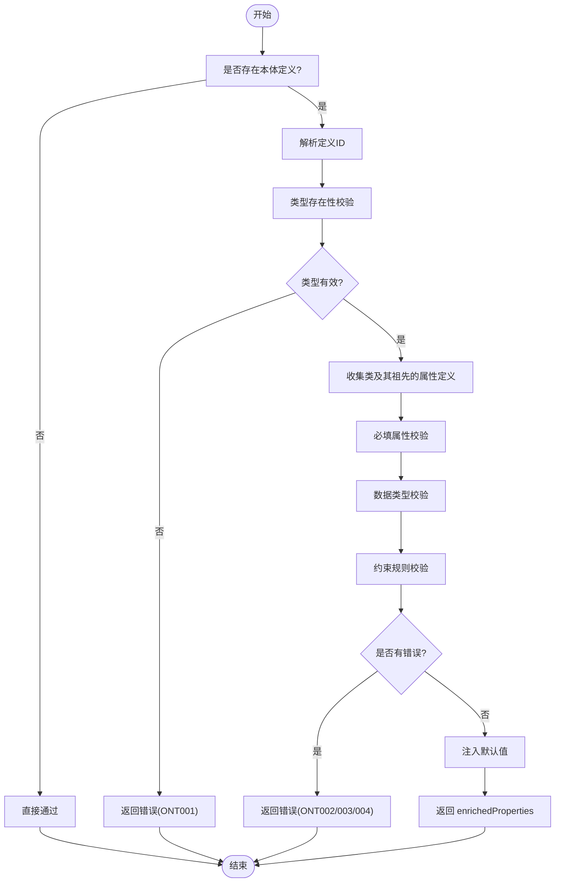
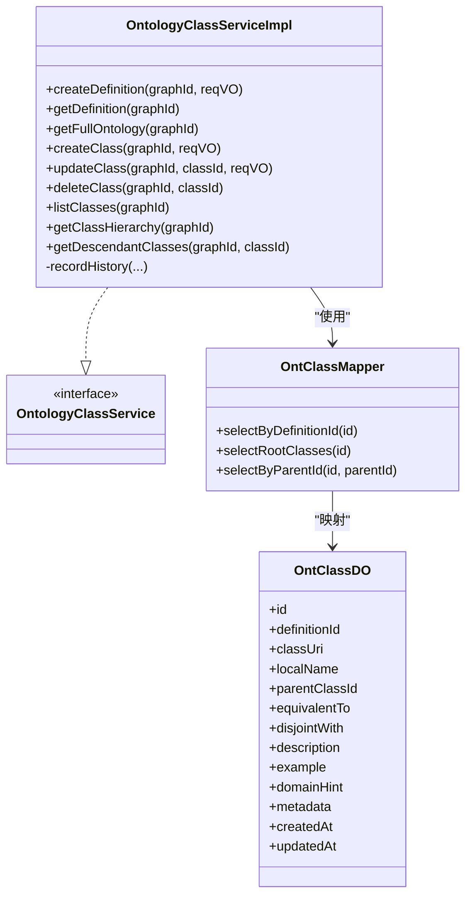
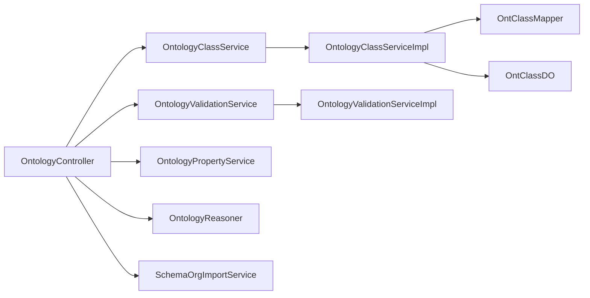

# 本体接口

<!--<cite>
**本文引用的文件**
- [ontograph-module-core/src/main/java/com/graphiti/module/graphiti/controller/admin/OntologyController.java](file://ontograph-module-core/src/main/java/com/graphiti/module/graphiti/controller/admin/OntologyController.java)
- [ontograph-module-core/src/main/java/com/graphiti/module/graphiti/service/OntologyClassService.java](file://ontograph-module-core/src/main/java/com/graphiti/module/graphiti/service/OntologyClassService.java)
- [ontograph-module-core/src/main/java/com/graphiti/module/graphiti/service/OntologyPropertyService.java](file://ontograph-module-core/src/main/java/com/graphiti/module/graphiti/service/OntologyPropertyService.java)
- [ontograph-module-core/src/main/java/com/graphiti/module/graphiti/service/OntologyValidationService.java](file://ontograph-module-core/src/main/java/com/graphiti/module/graphiti/service/OntologyValidationService.java)
- [ontograph-module-core/src/main/java/com/graphiti/module/graphiti/service/OntologySyncService.java](file://ontograph-module-core/src/main/java/com/graphiti/module/graphiti/service/OntologySyncService.java)
- [ontograph-module-core/src/main/java/com/graphiti/module/graphiti/service/OntologyReasoner.java](file://ontograph-module-core/src/main/java/com/graphiti/module/graphiti/service/OntologyReasoner.java)
- [ontograph-module-core/src/main/java/com/graphiti/module/graphiti/service/SchemaOrgImportService.java](file://ontograph-module-core/src/main/java/com/graphiti/module/graphiti/service/SchemaOrgImportService.java)
- [ontograph-module-core/src/main/java/com/graphiti/module/graphiti/service/impl/OntologyClassServiceImpl.java](file://ontograph-module-core/src/main/java/com/graphiti/module/graphiti/service/impl/OntologyClassServiceImpl.java)
- [ontograph-module-core/src/main/java/com/graphiti/module/graphiti/service/impl/OntologyValidationServiceImpl.java](file://ontograph-module-core/src/main/java/com/graphiti/module/graphiti/service/impl/OntologyValidationServiceImpl.java)
- [ontograph-module-core/src/main/java/com/graphiti/module/graphiti/dal/dataobject/ont/OntClassDO.java](file://ontograph-module-core/src/main/java/com/graphiti/module/graphiti/dal/dataobject/ont/OntClassDO.java)
- [ontograph-module-core/src/main/java/com/graphiti/module/graphiti/dal/mysql/ont/OntClassMapper.java](file://ontograph-module-core/src/main/java/com/graphiti/module/graphiti/dal/mysql/ont/OntClassMapper.java)
- [ontograph-module-core/src/main/java/com/graphiti/module/graphiti/vo/ontology/OntologyFullVO.java](file://ontograph-module-core/src/main/java/com/graphiti/module/graphiti/vo/ontology/OntologyFullVO.java)
- [ontograph-module-core/src/main/java/com/graphiti/module/graphiti/vo/ontology/BatchValidationReqVO.java](file://ontograph-module-core/src/main/java/com/graphiti/module/graphiti/vo/ontology/BatchValidationReqVO.java)
- [ontograph-module-core/src/main/java/com/graphiti/module/graphiti/vo/ontology/OntClassVO.java](file://ontograph-module-core/src/main/java/com/graphiti/module/graphiti/vo/ontology/OntClassVO.java)
- [ontograph-module-core/src/main/java/com/graphiti/module/graphiti/vo/ontology/ValidationResultVO.java](file://ontograph-module-core/src/main/java/com/graphiti/module/graphiti/vo/ontology/ValidationResultVO.java)
</cite>-->

## 目录
1. [简介](#简介)
2. [项目结构](#项目结构)
3. [核心组件](#核心组件)
4. [架构总览](#架构总览)
5. [详细组件分析](#详细组件分析)
6. [依赖分析](#依赖分析)
7. [性能考虑](#性能考虑)
8. [故障排查指南](#故障排查指南)
9. [结论](#结论)
10. [附录](#附录)

## 简介
本文件为 ontograph-java 的本体管理接口权威 API 参考，覆盖本体类定义、属性与约束管理、版本历史、Schema.org 导入导出、推理与一致性检查、以及 6 层验证引擎的调用方式与规则说明。文档同时提供数据模型、流程图与最佳实践，帮助本体工程师与知识建模专家高效落地。

## 项目结构
- 控制器层：集中于 admin 包下的 OntologyController，统一暴露本体管理相关 REST 接口。
- 服务层：定义了类、属性、验证、推理、同步、Schema.org 导入等接口契约。
- 实现层：提供具体业务逻辑，如 OntologyClassServiceImpl、OntologyValidationServiceImpl。
- 数据访问层：MyBatis Mapper 与 DO 对象映射本体表结构。
- 视图对象层：VO/DTO 描述对外传输的数据结构。

图表来源
- [ontograph-module-core/src/main/java/com/graphiti/module/graphiti/controller/admin/OntologyController.java:1-232](file://ontograph-module-core/src/main/java/com/graphiti/module/graphiti/controller/admin/OntologyController.java#L1-L232)
- [ontograph-module-core/src/main/java/com/graphiti/module/graphiti/service/OntologyClassService.java:1-35](file://ontograph-module-core/src/main/java/com/graphiti/module/graphiti/service/OntologyClassService.java#L1-L35)
- [ontograph-module-core/src/main/java/com/graphiti/module/graphiti/service/OntologyPropertyService.java:1-38](file://ontograph-module-core/src/main/java/com/graphiti/module/graphiti/service/OntologyPropertyService.java#L1-L38)
- [ontograph-module-core/src/main/java/com/graphiti/module/graphiti/service/OntologyValidationService.java:1-40](file://ontograph-module-core/src/main/java/com/graphiti/module/graphiti/service/OntologyValidationService.java#L1-L40)
- [ontograph-module-core/src/main/java/com/graphiti/module/graphiti/service/OntologyReasoner.java:1-25](file://ontograph-module-core/src/main/java/com/graphiti/module/graphiti/service/OntologyReasoner.java#L1-L25)
- [ontograph-module-core/src/main/java/com/graphiti/module/graphiti/service/SchemaOrgImportService.java:1-15](file://ontograph-module-core/src/main/java/com/graphiti/module/graphiti/service/SchemaOrgImportService.java#L1-L15)
- [ontograph-module-core/src/main/java/com/graphiti/module/graphiti/service/impl/OntologyClassServiceImpl.java:1-368](file://ontograph-module-core/src/main/java/com/graphiti/module/graphiti/service/impl/OntologyClassServiceImpl.java#L1-L368)
- [ontograph-module-core/src/main/java/com/graphiti/module/graphiti/service/impl/OntologyValidationServiceImpl.java:1-345](file://ontograph-module-core/src/main/java/com/graphiti/module/graphiti/service/impl/OntologyValidationServiceImpl.java#L1-L345)
- [ontograph-module-core/src/main/java/com/graphiti/module/graphiti/dal/mysql/ont/OntClassMapper.java:1-22](file://ontograph-module-core/src/main/java/com/graphiti/module/graphiti/dal/mysql/ont/OntClassMapper.java#L1-L22)
- [ontograph-module-core/src/main/java/com/graphiti/module/graphiti/dal/dataobject/ont/OntClassDO.java:1-49](file://ontograph-module-core/src/main/java/com/graphiti/module/graphiti/dal/dataobject/ont/OntClassDO.java#L1-L49)
- [ontograph-module-core/src/main/java/com/graphiti/module/graphiti/vo/ontology/OntologyFullVO.java:1-37](file://ontograph-module-core/src/main/java/com/graphiti/module/graphiti/vo/ontology/OntologyFullVO.java#L1-L37)
- [ontograph-module-core/src/main/java/com/graphiti/module/graphiti/vo/ontology/BatchValidationReqVO.java:1-24](file://ontograph-module-core/src/main/java/com/graphiti/module/graphiti/vo/ontology/BatchValidationReqVO.java#L1-L24)
- [ontograph-module-core/src/main/java/com/graphiti/module/graphiti/vo/ontology/ValidationResultVO.java:1-36](file://ontograph-module-core/src/main/java/com/graphiti/module/graphiti/vo/ontology/ValidationResultVO.java#L1-L36)
- [ontograph-module-core/src/main/java/com/graphiti/module/graphiti/vo/ontology/OntClassVO.java:1-29](file://ontograph-module-core/src/main/java/com/graphiti/module/graphiti/vo/ontology/OntClassVO.java#L1-L29)

章节来源
- [ontograph-module-core/src/main/java/com/graphiti/module/graphiti/controller/admin/OntologyController.java:1-232](file://ontograph-module-core/src/main/java/com/graphiti/module/graphiti/controller/admin/OntologyController.java#L1-L232)

## 核心组件
- 本体控制器：统一暴露本体定义、类、属性、约束、版本历史、Schema.org 导入、推理状态与一致性检查等接口。
- 验证服务：实现 6 层验证引擎（类型存在性、必填、数据类型、约束、OWL 约束预留、推理扩展预留）。
- 类服务：提供类定义的增删改查、类层次构建与后代收集。
- 属性与约束服务：提供属性与约束的 CRUD 与版本历史记录。
- 推理服务：推理机预热、一致性检查、类型推断与可满足性判断。
- 同步服务：将本体同步至 Neo4j 或增量同步。
- Schema.org 导入/导出：支持从 Schema.org 导入领域本体，并导出为 JSON-LD/Turtle。

章节来源
- [ontograph-module-core/src/main/java/com/graphiti/module/graphiti/controller/admin/OntologyController.java:16-232](file://ontograph-module-core/src/main/java/com/graphiti/module/graphiti/controller/admin/OntologyController.java#L16-L232)
- [ontograph-module-core/src/main/java/com/graphiti/module/graphiti/service/OntologyValidationService.java:8-40](file://ontograph-module-core/src/main/java/com/graphiti/module/graphiti/service/OntologyValidationService.java#L8-L40)
- [ontograph-module-core/src/main/java/com/graphiti/module/graphiti/service/OntologyClassService.java:9-35](file://ontograph-module-core/src/main/java/com/graphiti/module/graphiti/service/OntologyClassService.java#L9-L35)
- [ontograph-module-core/src/main/java/com/graphiti/module/graphiti/service/OntologyPropertyService.java:8-38](file://ontograph-module-core/src/main/java/com/graphiti/module/graphiti/service/OntologyPropertyService.java#L8-L38)
- [ontograph-module-core/src/main/java/com/graphiti/module/graphiti/service/OntologyReasoner.java:7-25](file://ontograph-module-core/src/main/java/com/graphiti/module/graphiti/service/OntologyReasoner.java#L7-L25)
- [ontograph-module-core/src/main/java/com/graphiti/module/graphiti/service/OntologySyncService.java:3-11](file://ontograph-module-core/src/main/java/com/graphiti/module/graphiti/service/OntologySyncService.java#L3-L11)
- [ontograph-module-core/src/main/java/com/graphiti/module/graphiti/service/SchemaOrgImportService.java:7-15](file://ontograph-module-core/src/main/java/com/graphiti/module/graphiti/service/SchemaOrgImportService.java#L7-L15)

## 架构总览
本体接口采用分层架构：控制器负责路由与鉴权，服务层抽象业务能力，实现层完成具体逻辑，DAO 层访问数据库，VO 层承载传输对象。验证引擎贯穿节点与边的校验流程；推理服务为 OWL 2 RL 推理提供支撑；同步与导入导出保障本体与外部系统的协同。

图表来源
- [ontograph-module-core/src/main/java/com/graphiti/module/graphiti/controller/admin/OntologyController.java:57-64](file://ontograph-module-core/src/main/java/com/graphiti/module/graphiti/controller/admin/OntologyController.java#L57-L64)
- [ontograph-module-core/src/main/java/com/graphiti/module/graphiti/service/OntologyValidationService.java:33-33](file://ontograph-module-core/src/main/java/com/graphiti/module/graphiti/service/OntologyValidationService.java#L33-L33)
- [ontograph-module-core/src/main/java/com/graphiti/module/graphiti/service/impl/OntologyValidationServiceImpl.java:131-158](file://ontograph-module-core/src/main/java/com/graphiti/module/graphiti/service/impl/OntologyValidationServiceImpl.java#L131-L158)
- [ontograph-module-core/src/main/java/com/graphiti/module/graphiti/dal/mysql/ont/OntClassMapper.java:1-22](file://ontograph-module-core/src/main/java/com/graphiti/module/graphiti/dal/mysql/ont/OntClassMapper.java#L1-L22)

## 详细组件分析

### 本体控制器（REST API）
- 命名空间：/api/v1/ontology
- 认证：基于 Bearer Token 的安全要求
- 主要接口
  - 本体定义
    - GET /{graphId}/definition：获取活跃本体定义
    - POST /{graphId}/definition：创建新版本本体定义
  - 完整本体检索
    - GET /{graphId}：返回定义、类、类层次、属性、约束的完整信息
  - 批量验证
    - POST /{graphId}/validate/batch：对节点与边进行批量验证
  - 类管理
    - GET /{graphId}/classes：平铺列出类
    - GET /{graphId}/classes/hierarchy：树形返回类层次
    - POST /{graphId}/classes：创建类
    - PUT /{graphId}/classes/{classId}：更新类
    - DELETE /{graphId}/classes/{classId}：删除类（拒绝存在子类时删除）
  - 属性管理
    - GET /{graphId}/properties：列出属性
    - POST /{graphId}/properties：创建属性
    - PUT /{graphId}/properties/{propertyId}：更新属性
    - DELETE /{graphId}/properties/{propertyId}：删除属性
  - 约束管理
    - GET /{graphId}/constraints：列出约束
    - POST /{graphId}/constraints：创建约束
    - DELETE /{graphId}/constraints/{constraintId}：删除约束
  - 版本历史
    - GET /{graphId}/history：获取版本变更历史
  - Schema.org 导入
    - POST /{graphId}/import/schema-org：从 Schema.org 导入领域类与属性
  - 推理引擎
    - GET /{graphId}/reasoners/status：查看推理机预热状态
    - POST /{graphId}/reasoners/warmup：预热推理机
    - GET /{graphId}/consistency：一致性检查

章节来源
- [ontograph-module-core/src/main/java/com/graphiti/module/graphiti/controller/admin/OntologyController.java:32-231](file://ontograph-module-core/src/main/java/com/graphiti/module/graphiti/controller/admin/OntologyController.java#L32-L231)

### 验证引擎（6 层）
- 层级说明
  - 1 类型存在性：节点/边类型必须在本体中定义或允许通过（边类型向后兼容）
  - 2 必填属性：根据属性定义的必填标记检查缺失项
  - 3 数据类型：按范围数据类型严格校验
  - 4 约束规则：支持正则、数值范围、枚举等约束
  - 5 OWL 约束（预留）
  - 6 推理扩展（预留）
- 关键行为
  - 节点验证：聚合错误，必要时注入默认值并返回 enrichedProperties
  - 边验证：边类型未定义时给出警告但允许通过
  - 批量验证：统计有效节点/边数量，汇总结果
- 错误码
  - 类型不存在：ONT001
  - 缺少必填：ONT002
  - 类型不匹配：ONT003
  - 违反约束：ONT004

图表来源
- [ontograph-module-core/src/main/java/com/graphiti/module/graphiti/service/impl/OntologyValidationServiceImpl.java:39-129](file://ontograph-module-core/src/main/java/com/graphiti/module/graphiti/service/impl/OntologyValidationServiceImpl.java#L39-L129)
- [ontograph-module-core/src/main/java/com/graphiti/module/graphiti/service/impl/OntologyValidationServiceImpl.java:207-322](file://ontograph-module-core/src/main/java/com/graphiti/module/graphiti/service/impl/OntologyValidationServiceImpl.java#L207-L322)

章节来源
- [ontograph-module-core/src/main/java/com/graphiti/module/graphiti/service/OntologyValidationService.java:8-40](file://ontograph-module-core/src/main/java/com/graphiti/module/graphiti/service/OntologyValidationService.java#L8-L40)
- [ontograph-module-core/src/main/java/com/graphiti/module/graphiti/service/impl/OntologyValidationServiceImpl.java:34-344](file://ontograph-module-core/src/main/java/com/graphiti/module/graphiti/service/impl/OntologyValidationServiceImpl.java#L34-L344)
- [ontograph-module-core/src/main/java/com/graphiti/module/graphiti/vo/ontology/ValidationResultVO.java:11-36](file://ontograph-module-core/src/main/java/com/graphiti/module/graphiti/vo/ontology/ValidationResultVO.java#L11-L36)
- [ontograph-module-core/src/main/java/com/graphiti/module/graphiti/vo/ontology/BatchValidationReqVO.java:1-24](file://ontograph-module-core/src/main/java/com/graphiti/module/graphiti/vo/ontology/BatchValidationReqVO.java#L1-L24)

### 类与属性/约束管理
- 类管理
  - 创建类：自动生成 URI（若未提供），记录版本历史
  - 更新类：支持字段增量更新，记录前后状态差异
  - 删除类：若存在子类则拒绝删除
  - 列表与层次：支持平铺列表与树形层次
  - 后代收集：用于派生类型判定与影响分析
- 属性管理
  - 支持域/范围类、数据类型、是否必填、多重性、最小/最大基数、默认值等
- 约束管理
  - 支持针对类与属性的约束，错误消息与严重级别可配置
- 版本历史
  - 记录定义变更、类变更、属性变更、约束变更等

图表来源
- [ontograph-module-core/src/main/java/com/graphiti/module/graphiti/service/impl/OntologyClassServiceImpl.java:45-368](file://ontograph-module-core/src/main/java/com/graphiti/module/graphiti/service/impl/OntologyClassServiceImpl.java#L45-L368)
- [ontograph-module-core/src/main/java/com/graphiti/module/graphiti/service/OntologyClassService.java:9-35](file://ontograph-module-core/src/main/java/com/graphiti/module/graphiti/service/OntologyClassService.java#L9-L35)
- [ontograph-module-core/src/main/java/com/graphiti/module/graphiti/dal/mysql/ont/OntClassMapper.java:10-22](file://ontograph-module-core/src/main/java/com/graphiti/module/graphiti/dal/mysql/ont/OntClassMapper.java#L10-L22)
- [ontograph-module-core/src/main/java/com/graphiti/module/graphiti/dal/dataobject/ont/OntClassDO.java:8-49](file://ontograph-module-core/src/main/java/com/graphiti/module/graphiti/dal/dataobject/ont/OntClassDO.java#L8-L49)

章节来源
- [ontograph-module-core/src/main/java/com/graphiti/module/graphiti/service/OntologyClassService.java:9-35](file://ontograph-module-core/src/main/java/com/graphiti/module/graphiti/service/OntologyClassService.java#L9-L35)
- [ontograph-module-core/src/main/java/com/graphiti/module/graphiti/service/OntologyPropertyService.java:8-38](file://ontograph-module-core/src/main/java/com/graphiti/module/graphiti/service/OntologyPropertyService.java#L8-L38)
- [ontograph-module-core/src/main/java/com/graphiti/module/graphiti/service/impl/OntologyClassServiceImpl.java:102-191](file://ontograph-module-core/src/main/java/com/graphiti/module/graphiti/service/impl/OntologyClassServiceImpl.java#L102-L191)
- [ontograph-module-core/src/main/java/com/graphiti/module/graphiti/dal/mysql/ont/OntClassMapper.java:13-21](file://ontograph-module-core/src/main/java/com/graphiti/module/graphiti/dal/mysql/ont/OntClassMapper.java#L13-L21)
- [ontograph-module-core/src/main/java/com/graphiti/module/graphiti/dal/dataobject/ont/OntClassDO.java:13-47](file://ontograph-module-core/src/main/java/com/graphiti/module/graphiti/dal/dataobject/ont/OntClassDO.java#L13-L47)

### 推理与一致性
- 推理机状态
  - GET /{graphId}/reasoners/status：返回 warmedUp 与 graphId
  - POST /{graphId}/reasoners/warmup：将本体加载到推理机
- 一致性检查
  - GET /{graphId}/consistency：返回一致性检查结果
- 其他能力
  - 获取祖先/后代类
  - 类型推断
  - 可满足性判断

章节来源
- [ontograph-module-core/src/main/java/com/graphiti/module/graphiti/controller/admin/OntologyController.java:204-231](file://ontograph-module-core/src/main/java/com/graphiti/module/graphiti/controller/admin/OntologyController.java#L204-L231)
- [ontograph-module-core/src/main/java/com/graphiti/module/graphiti/service/OntologyReasoner.java:7-25](file://ontograph-module-core/src/main/java/com/graphiti/module/graphiti/service/OntologyReasoner.java#L7-L25)

### 同步与 Schema.org 导入
- 同步
  - 全量同步：syncToNeo4j(graphId)
  - 增量同步：syncIncremental(graphId, fromClassId, toClassId)
  - 清空同步：clearNeo4jOntology(graphId)
- Schema.org 导入/导出
  - 导入：importFromSchemaOrg(graphId, reqVO)
  - 导出：exportAsJsonLd(graphId)、exportAsTurtle(graphId)

章节来源
- [ontograph-module-core/src/main/java/com/graphiti/module/graphiti/service/OntologySyncService.java:3-11](file://ontograph-module-core/src/main/java/com/graphiti/module/graphiti/service/OntologySyncService.java#L3-L11)
- [ontograph-module-core/src/main/java/com/graphiti/module/graphiti/service/SchemaOrgImportService.java:7-15](file://ontograph-module-core/src/main/java/com/graphiti/module/graphiti/service/SchemaOrgImportService.java#L7-L15)

## 依赖分析
- 控制器依赖服务接口，服务实现依赖 DAO 与 DO，形成清晰的分层耦合。
- 验证服务在无本体定义时采取“宽松通过”策略，保证系统向后兼容。
- 类层次构建基于父 ID 的递归查询，后代收集采用深度优先遍历。

图表来源
- [ontograph-module-core/src/main/java/com/graphiti/module/graphiti/controller/admin/OntologyController.java:25-29](file://ontograph-module-core/src/main/java/com/graphiti/module/graphiti/controller/admin/OntologyController.java#L25-L29)
- [ontograph-module-core/src/main/java/com/graphiti/module/graphiti/service/impl/OntologyClassServiceImpl.java:36-41](file://ontograph-module-core/src/main/java/com/graphiti/module/graphiti/service/impl/OntologyClassServiceImpl.java#L36-L41)
- [ontograph-module-core/src/main/java/com/graphiti/module/graphiti/dal/mysql/ont/OntClassMapper.java:10-22](file://ontograph-module-core/src/main/java/com/graphiti/module/graphiti/dal/mysql/ont/OntClassMapper.java#L10-L22)
- [ontograph-module-core/src/main/java/com/graphiti/module/graphiti/dal/dataobject/ont/OntClassDO.java:8-49](file://ontograph-module-core/src/main/java/com/graphiti/module/graphiti/dal/dataobject/ont/OntClassDO.java#L8-L49)

章节来源
- [ontograph-module-core/src/main/java/com/graphiti/module/graphiti/service/impl/OntologyClassServiceImpl.java:217-251](file://ontograph-module-core/src/main/java/com/graphiti/module/graphiti/service/impl/OntologyClassServiceImpl.java#L217-L251)

## 性能考虑
- 批量验证：建议分批提交，避免单次请求过大导致内存压力。
- 类层次构建：根节点查询与子节点分组减少 N+1 查询开销。
- 默认值注入：仅在属性缺失时注入，避免重复序列化。
- 推理机预热：在系统空闲时段执行，避免高峰时段阻塞。
- 数据类型校验：尽量在入库前完成，减少运行期校验成本。

## 故障排查指南
- 本体未定义
  - 现象：验证直接通过或类操作返回空集合
  - 处理：先创建本体定义再进行后续操作
- 删除类失败
  - 现象：提示存在子类，拒绝删除
  - 处理：先删除子类，再删除父类
- 类型不存在
  - 现象：返回错误码 ONT001
  - 处理：确认本地名或 URI 是否正确，或在本体中补充定义
- 缺少必填属性
  - 现象：返回错误码 ONT002
  - 处理：补齐 required 属性，或调整本体定义
- 类型不匹配
  - 现象：返回错误码 ONT003
  - 处理：修正属性值类型，确保与 rangeDataType 一致
- 违反约束
  - 现象：返回错误码 ONT004
  - 处理：检查正则、范围或枚举配置，修正属性值

章节来源
- [ontograph-module-core/src/main/java/com/graphiti/module/graphiti/service/impl/OntologyValidationServiceImpl.java:34-344](file://ontograph-module-core/src/main/java/com/graphiti/module/graphiti/service/impl/OntologyValidationServiceImpl.java#L34-L344)
- [ontograph-module-core/src/main/java/com/graphiti/module/graphiti/service/impl/OntologyClassServiceImpl.java:153-169](file://ontograph-module-core/src/main/java/com/graphiti/module/graphiti/service/impl/OntologyClassServiceImpl.java#L153-L169)

## 结论
本体接口提供了从定义、建模到验证、推理与同步的全链路能力。通过 6 层验证引擎与版本历史记录，确保知识图谱本体的规范性与可追溯性；通过推理与导入导出能力，提升本体的可用性与互操作性。建议在生产环境中结合批量验证、预热推理与增量同步策略，保障系统稳定性与性能。

## 附录

### 数据模型与关键 VO
- 完整本体检索：包含定义、类、类层次、属性、约束
- 批量验证请求：节点与边的类型及属性集合
- 验证结果：通过/失败、层级、错误列表、警告列表、增强属性

章节来源
- [ontograph-module-core/src/main/java/com/graphiti/module/graphiti/vo/ontology/OntologyFullVO.java:11-37](file://ontograph-module-core/src/main/java/com/graphiti/module/graphiti/vo/ontology/OntologyFullVO.java#L11-L37)
- [ontograph-module-core/src/main/java/com/graphiti/module/graphiti/vo/ontology/BatchValidationReqVO.java:7-24](file://ontograph-module-core/src/main/java/com/graphiti/module/graphiti/vo/ontology/BatchValidationReqVO.java#L7-L24)
- [ontograph-module-core/src/main/java/com/graphiti/module/graphiti/vo/ontology/ValidationResultVO.java:11-36](file://ontograph-module-core/src/main/java/com/graphiti/module/graphiti/vo/ontology/ValidationResultVO.java#L11-L36)
- [ontograph-module-core/src/main/java/com/graphiti/module/graphiti/vo/ontology/OntClassVO.java:10-29](file://ontograph-module-core/src/main/java/com/graphiti/module/graphiti/vo/ontology/OntClassVO.java#L10-L29)