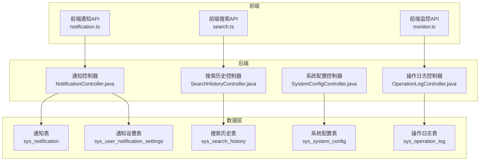
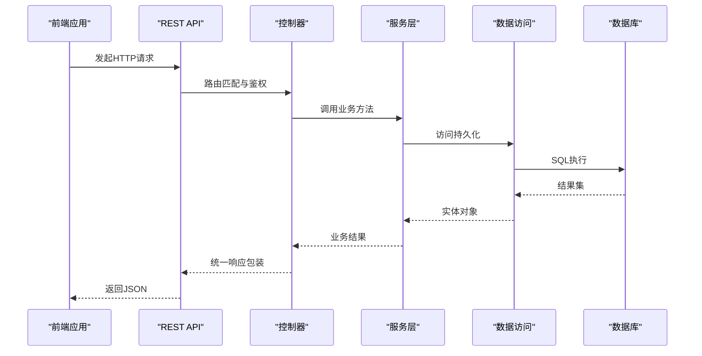
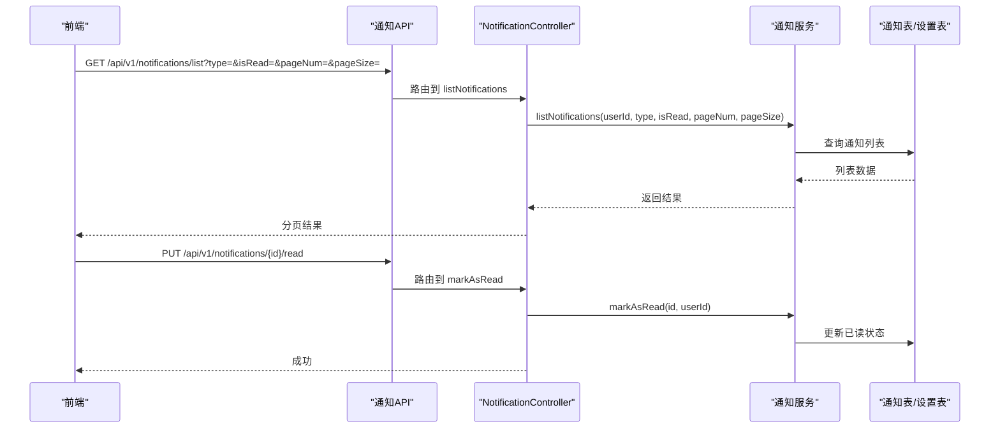
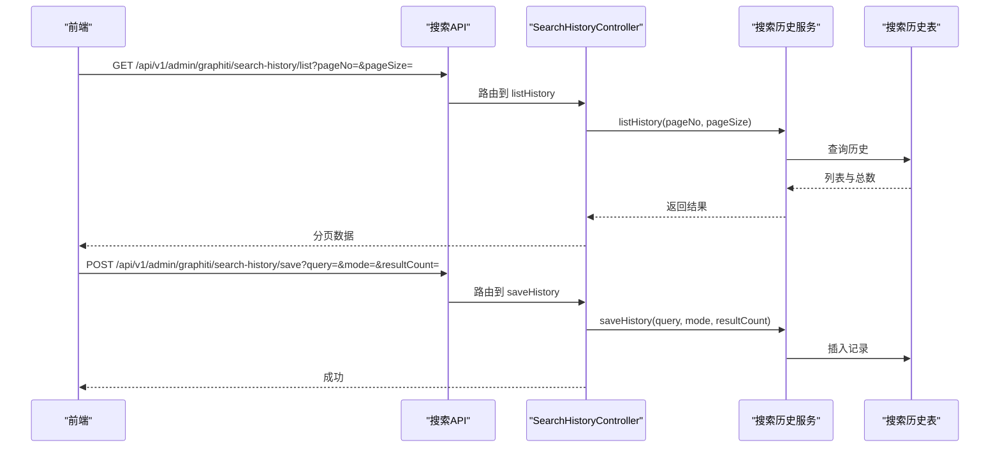
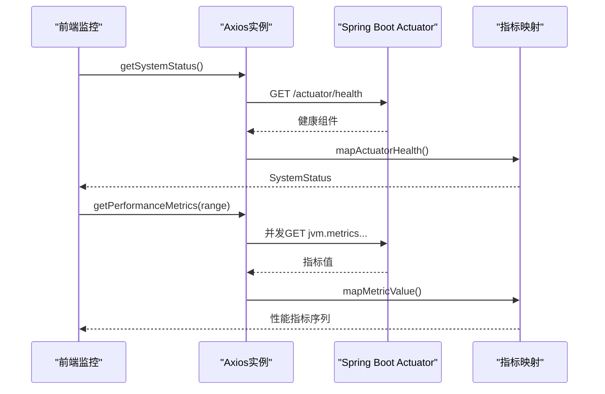
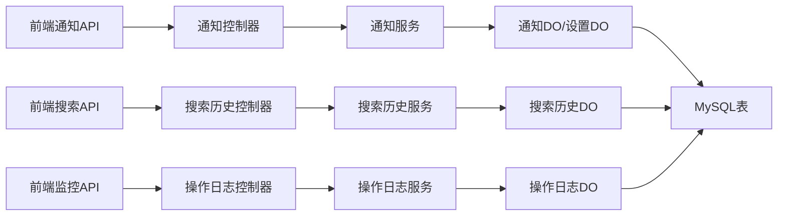
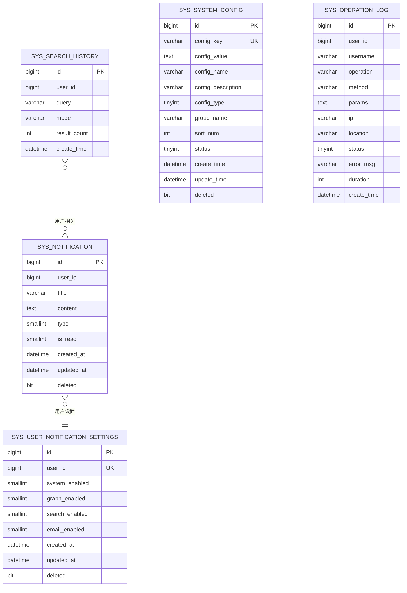

# 监控接口

<!--<cite>
**本文引用的文件**
- [NotificationController.java](file://graphiti-module-system/src/main/java/com/graphiti/system/controller/NotificationController.java)
- [SearchHistoryController.java](file://graphiti-module-system/src/main/java/com/graphiti/system/controller/SearchHistoryController.java)
- [SystemConfigController.java](file://graphiti-module-system/src/main/java/com/graphiti/system/controller/SystemConfigController.java)
- [OperationLogController.java](file://graphiti-module-system/src/main/java/com/graphiti/system/controller/OperationLogController.java)
- [notification.ts](file://graphiti-web/src/api/notification.ts)
- [search.ts](file://graphiti-web/src/api/search.ts)
- [monitor.ts](file://graphiti-web/src/api/monitor.ts)
- [V2__create_notification_tables.sql](file://sql/mysql/V2__create_notification_tables.sql)
- [schema.sql](file://sql/mysql/schema.sql)
- [NotificationDO.java](file://graphiti-module-system/src/main/java/com/graphiti/system/dal/dataobject/NotificationDO.java)
- [SearchHistoryDO.java](file://graphiti-module-system/src/main/java/com/graphiti/system/dal/dataobject/SearchHistoryDO.java)
- [NotificationSettingsDO.java](file://graphiti-module-system/src/main/java/com/graphiti/system/dal/dataobject/NotificationSettingsDO.java)
</cite>-->

## 目录
1. [简介](#简介)
2. [项目结构](#项目结构)
3. [核心组件](#核心组件)
4. [架构总览](#架构总览)
5. [详细组件分析](#详细组件分析)
6. [依赖分析](#依赖分析)
7. [性能考虑](#性能考虑)
8. [故障排查指南](#故障排查指南)
9. [结论](#结论)
10. [附录](#附录)

## 简介
本文件为 Graphiti-Java 的监控与辅助功能接口提供全面的 API 文档，覆盖通知管理、搜索历史、系统配置、操作日志以及系统监控（基于 Spring Boot Actuator）等能力。文档面向运维工程师与系统管理员，提供接口定义、调用流程、数据模型、性能与安全建议、查询与分析方法、存储策略与隐私保护说明，并给出典型监控场景的实践示例与配置指引。

## 项目结构
- 后端模块采用分层设计，系统监控与辅助功能主要位于 graphiti-module-system 模块，提供 REST 控制器与数据访问对象。
- 前端通过 graphiti-web 提供统一的 API 封装，便于在控制台中进行监控与辅助功能操作。
- 数据库脚本位于 sql/mysql 目录，包含通知、搜索历史、系统配置、操作日志等表结构。

图表来源
- [NotificationController.java:24-139](file://graphiti-module-system/src/main/java/com/graphiti/system/controller/NotificationController.java#L24-L139)
- [SearchHistoryController.java:16-49](file://graphiti-module-system/src/main/java/com/graphiti/system/controller/SearchHistoryController.java#L16-L49)
- [SystemConfigController.java:19-83](file://graphiti-module-system/src/main/java/com/graphiti/system/controller/SystemConfigController.java#L19-L83)
- [OperationLogController.java:18-73](file://graphiti-module-system/src/main/java/com/graphiti/system/controller/OperationLogController.java#L18-L73)
- [V2__create_notification_tables.sql:6-36](file://sql/mysql/V2__create_notification_tables.sql#L6-L36)
- [schema.sql:140-195](file://sql/mysql/schema.sql#L140-L195)

章节来源
- [NotificationController.java:24-139](file://graphiti-module-system/src/main/java/com/graphiti/system/controller/NotificationController.java#L24-L139)
- [SearchHistoryController.java:16-49](file://graphiti-module-system/src/main/java/com/graphiti/system/controller/SearchHistoryController.java#L16-L49)
- [SystemConfigController.java:19-83](file://graphiti-module-system/src/main/java/com/graphiti/system/controller/SystemConfigController.java#L19-L83)
- [OperationLogController.java:18-73](file://graphiti-module-system/src/main/java/com/graphiti/system/controller/OperationLogController.java#L18-L73)
- [V2__create_notification_tables.sql:6-36](file://sql/mysql/V2__create_notification_tables.sql#L6-L36)
- [schema.sql:140-195](file://sql/mysql/schema.sql#L140-L195)

## 核心组件
- 通知管理：提供通知列表、未读计数、标记已读/全部已读、删除单条/清空、通知设置的增删改查。
- 搜索历史：提供搜索历史的分页查询、保存、清空。
- 系统配置：提供系统配置的分页查询、全量查询、详情查询、按 key 查询、创建、更新、删除。
- 操作日志：提供操作日志的分页查询、详情、删除单条/清空、导出。
- 系统监控：通过前端封装的 monitor.ts 调用 Spring Boot Actuator 接口，获取系统健康、性能指标、数据库状态等。

章节来源
- [NotificationController.java:51-139](file://graphiti-module-system/src/main/java/com/graphiti/system/controller/NotificationController.java#L51-L139)
- [SearchHistoryController.java:25-47](file://graphiti-module-system/src/main/java/com/graphiti/system/controller/SearchHistoryController.java#L25-L47)
- [SystemConfigController.java:28-81](file://graphiti-module-system/src/main/java/com/graphiti/system/controller/SystemConfigController.java#L28-L81)
- [OperationLogController.java:27-71](file://graphiti-module-system/src/main/java/com/graphiti/system/controller/OperationLogController.java#L27-L71)
- [monitor.ts:75-194](file://graphiti-web/src/api/monitor.ts#L75-L194)

## 架构总览
下图展示从前端到后端控制器再到数据库的数据流与职责边界：

图表来源
- [NotificationController.java:51-139](file://graphiti-module-system/src/main/java/com/graphiti/system/controller/NotificationController.java#L51-L139)
- [SearchHistoryController.java:25-47](file://graphiti-module-system/src/main/java/com/graphiti/system/controller/SearchHistoryController.java#L25-L47)
- [SystemConfigController.java:28-81](file://graphiti-module-system/src/main/java/com/graphiti/system/controller/SystemConfigController.java#L28-L81)
- [OperationLogController.java:27-71](file://graphiti-module-system/src/main/java/com/graphiti/system/controller/OperationLogController.java#L27-L71)

## 详细组件分析

### 通知管理接口
- 功能范围：通知列表、未读计数、标记已读/全部已读、删除单条/清空、通知设置的增删改查。
- 鉴权：均需携带 Bearer Token。
- 关键点：
  - 列表支持按类型与已读状态筛选，分页参数 pageNum/pageSize。
  - 设置保存时会绑定当前用户ID。
  - 支持按用户维度的逻辑删除标记字段，便于审计与恢复。

图表来源
- [NotificationController.java:51-118](file://graphiti-module-system/src/main/java/com/graphiti/system/controller/NotificationController.java#L51-L118)
- [notification.ts:38-78](file://graphiti-web/src/api/notification.ts#L38-L78)

章节来源
- [NotificationController.java:51-139](file://graphiti-module-system/src/main/java/com/graphiti/system/controller/NotificationController.java#L51-L139)
- [notification.ts:38-79](file://graphiti-web/src/api/notification.ts#L38-L79)
- [NotificationDO.java:12-35](file://graphiti-module-system/src/main/java/com/graphiti/system/dal/dataobject/NotificationDO.java#L12-L35)
- [NotificationSettingsDO.java:12-35](file://graphiti-module-system/src/main/java/com/graphiti/system/dal/dataobject/NotificationSettingsDO.java#L12-L35)

### 搜索历史接口
- 功能范围：分页查询当前用户搜索历史、保存搜索记录、清空搜索历史。
- 鉴权：需要 Bearer Token。
- 关键点：
  - 保存接口支持传入 query、mode、resultCount。
  - 历史记录按用户维度存储，便于后续分析用户检索行为。

图表来源
- [SearchHistoryController.java:25-47](file://graphiti-module-system/src/main/java/com/graphiti/system/controller/SearchHistoryController.java#L25-L47)
- [search.ts:127-164](file://graphiti-web/src/api/search.ts#L127-L164)

章节来源
- [SearchHistoryController.java:25-47](file://graphiti-module-system/src/main/java/com/graphiti/system/controller/SearchHistoryController.java#L25-L47)
- [search.ts:127-164](file://graphiti-web/src/api/search.ts#L127-L164)
- [SearchHistoryDO.java:12-30](file://graphiti-module-system/src/main/java/com/graphiti/system/dal/dataobject/SearchHistoryDO.java#L12-L30)
- [schema.sql:183-195](file://sql/mysql/schema.sql#L183-L195)

### 系统配置接口
- 功能范围：分页查询、全量查询、详情、按 key 查询、创建、更新、删除。
- 鉴权：需要 Bearer Token。
- 关键点：
  - 支持按配置键、名称、分组、状态筛选。
  - 支持多种配置类型（文本/数字/布尔/JSON），便于灵活扩展。

章节来源
- [SystemConfigController.java:28-81](file://graphiti-module-system/src/main/java/com/graphiti/system/controller/SystemConfigController.java#L28-L81)
- [schema.sql:162-180](file://sql/mysql/schema.sql#L162-L180)

### 操作日志接口
- 功能范围：分页查询、详情、删除单条/清空、导出。
- 鉴权：需要 Bearer Token。
- 关键点：
  - 支持按用户名、操作名称、状态、时间范围筛选。
  - 导出用于审计与合规分析。

章节来源
- [OperationLogController.java:27-71](file://graphiti-module-system/src/main/java/com/graphiti/system/controller/OperationLogController.java#L27-L71)
- [schema.sql:140-159](file://sql/mysql/schema.sql#L140-L159)

### 系统监控接口（基于 Actuator）
- 功能范围：系统健康状态、性能指标（CPU/内存/线程）、数据库状态。
- 鉴权：前端 monitor.ts 通过 Axios 访问 /actuator/*，需确保网关或反向代理正确转发。
- 关键点：
  - getSystemStatus：读取 /actuator/health 并映射为系统状态。
  - getPerformanceMetrics：并发拉取 jvm.memory.used、jvm.memory.committed、process.cpu.usage、jvm.threads.live 等指标，生成时间序列。
  - getDatabaseStatus：读取 /actuator/health/components 中 db/neo4j 状态。
  - getApiLogs：当前前端实现为空，后续可接入 API 访问日志采集。

图表来源
- [monitor.ts:75-194](file://graphiti-web/src/api/monitor.ts#L75-L194)

章节来源
- [monitor.ts:75-194](file://graphiti-web/src/api/monitor.ts#L75-L194)

## 依赖分析
- 控制器依赖服务层，服务层依赖数据访问层，数据访问层依赖数据库。
- 前端 API 封装与后端控制器一一对应，便于维护与扩展。
- 监控数据来源于 Actuator，前端 monitor.ts 作为薄封装层，便于在控制台集成。

图表来源
- [NotificationController.java:30-40](file://graphiti-module-system/src/main/java/com/graphiti/system/controller/NotificationController.java#L30-L40)
- [SearchHistoryController.java:23-23](file://graphiti-module-system/src/main/java/com/graphiti/system/controller/SearchHistoryController.java#L23-L23)
- [OperationLogController.java:25-25](file://graphiti-module-system/src/main/java/com/graphiti/system/controller/OperationLogController.java#L25-L25)
- [NotificationDO.java:12-35](file://graphiti-module-system/src/main/java/com/graphiti/system/dal/dataobject/NotificationDO.java#L12-L35)
- [SearchHistoryDO.java:12-30](file://graphiti-module-system/src/main/java/com/graphiti/system/dal/dataobject/SearchHistoryDO.java#L12-L30)
- [NotificationSettingsDO.java:12-35](file://graphiti-module-system/src/main/java/com/graphiti/system/dal/dataobject/NotificationSettingsDO.java#L12-L35)

章节来源
- [NotificationController.java:30-40](file://graphiti-module-system/src/main/java/com/graphiti/system/controller/NotificationController.java#L30-L40)
- [SearchHistoryController.java:23-23](file://graphiti-module-system/src/main/java/com/graphiti/system/controller/SearchHistoryController.java#L23-L23)
- [OperationLogController.java:25-25](file://graphiti-module-system/src/main/java/com/graphiti/system/controller/OperationLogController.java#L25-L25)

## 性能考虑
- 监控指标聚合：前端 monitor.ts 并发拉取多个指标，建议在生产环境配置合理的超时与重试策略，避免对 JVM 指标端点造成压力。
- 分页查询：通知列表、搜索历史、操作日志均支持分页，建议在大数据量场景下使用合适的页大小与排序字段索引。
- 索引优化：通知表与搜索历史表已建立用户维度索引与时间索引，有助于提升查询性能。
- 缓存策略：对于只读配置与静态资源，可在网关或 CDN 层面增加缓存以降低后端压力。

## 故障排查指南
- 未授权访问：确认请求头携带有效的 Bearer Token；检查用户上下文解析与权限校验。
- 数据为空：检查数据库连接、表结构初始化脚本是否执行；核对用户维度过滤条件。
- Actuator 不可用：确认 Actuator 端点已启用且网络可达；检查反向代理配置。
- 性能指标异常：确认 JVM 指标端点可用；检查监控数据映射逻辑与时间序列生成。

章节来源
- [NotificationController.java:42-49](file://graphiti-module-system/src/main/java/com/graphiti/system/controller/NotificationController.java#L42-L49)
- [monitor.ts:80-97](file://graphiti-web/src/api/monitor.ts#L80-L97)

## 结论
本文档梳理了 Graphiti-Java 的监控与辅助功能接口，明确了通知管理、搜索历史、系统配置、操作日志与系统监控的 API 定义与调用流程。结合数据库表结构与前端封装，运维与管理员可快速完成监控数据的查询、分析与治理，并在保证性能与安全的前提下进行配置与审计。

## 附录

### 数据模型与存储策略
- 通知与通知设置：按用户维度存储，支持逻辑删除标记，便于审计与恢复。
- 搜索历史：按用户维度存储，支持按时间排序与统计分析。
- 系统配置：多类型字段支持灵活配置，按分组与状态管理。
- 操作日志：记录用户操作、方法、参数、耗时、状态与错误信息，支持导出。

图表来源
- [V2__create_notification_tables.sql:6-36](file://sql/mysql/V2__create_notification_tables.sql#L6-L36)
- [schema.sql:140-195](file://sql/mysql/schema.sql#L140-L195)

### 隐私保护与合规建议
- 最小化收集：仅记录必要的操作日志与搜索历史，避免敏感信息留存。
- 匿名化处理：对日志中的用户名、IP 等可识别信息进行脱敏或定期清理。
- 访问控制：严格限制监控与日志接口的访问权限，遵循最小权限原则。
- 数据保留：制定数据保留策略，到期自动清理或归档，满足合规要求。

### 实际监控场景示例
- 场景一：实时监控系统健康与资源使用
  - 使用 monitor.ts 的 getSystemStatus 与 getPerformanceMetrics，定时轮询并在控制台展示。
- 场景二：审计用户行为与检索趋势
  - 通过 OperationLogController 与 SearchHistoryController 的分页查询，结合导出功能进行月度审计。
- 场景三：个性化通知策略
  - 通过 NotificationController 的设置接口，按用户维度调整通知偏好，减少干扰并提升效率。