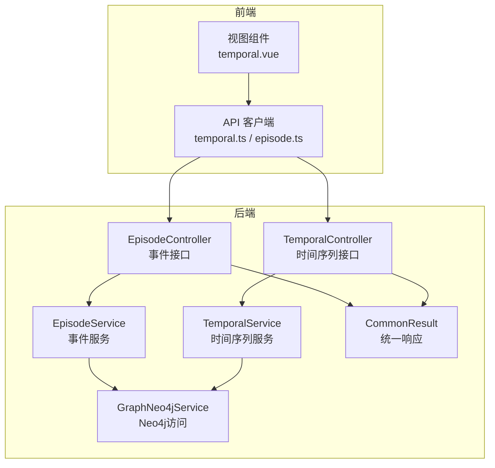
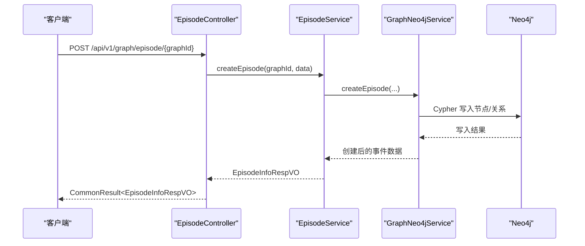
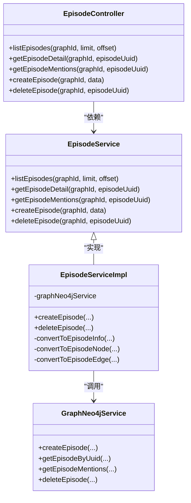
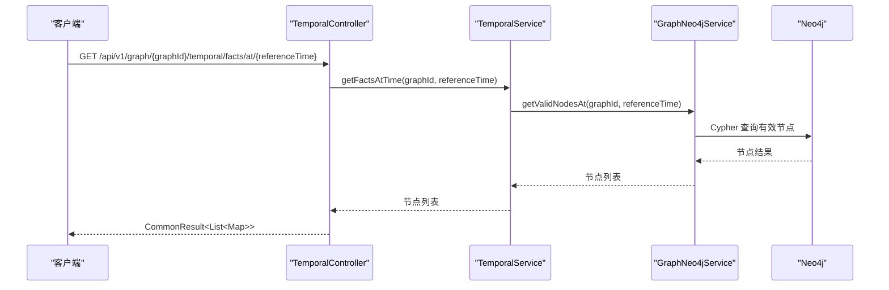
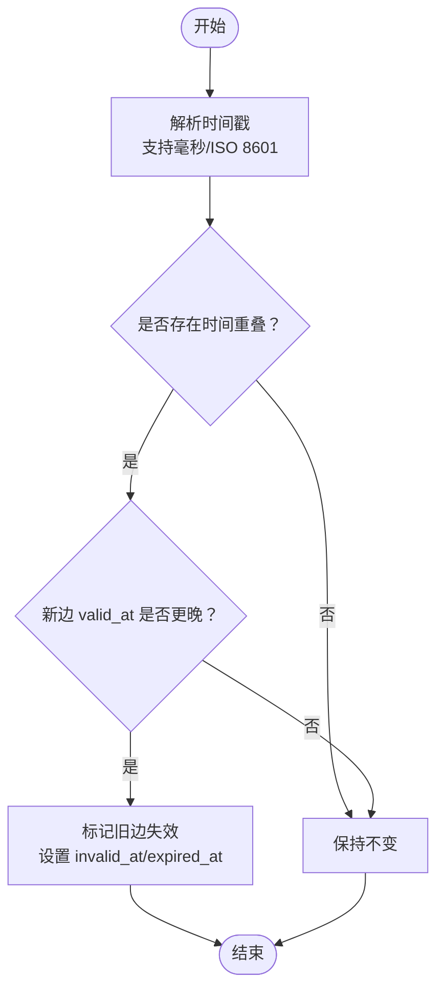
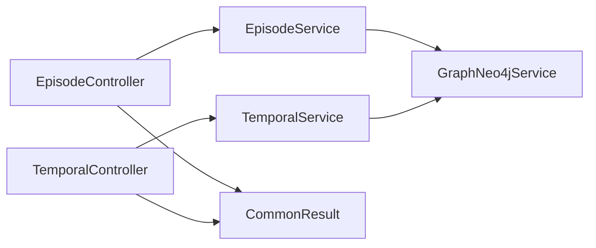

# 事件与时间序列接口

<cite>
**本文档引用的文件**
- [TemporalController.java](file://graphiti-module-core/src/main/java/com/graphiti/module/graphiti/controller/admin/TemporalController.java)
- [EpisodeController.java](file://graphiti-module-core/src/main/java/com/graphiti/module/graphiti/controller/admin/EpisodeController.java)
- [TemporalService.java](file://graphiti-module-core/src/main/java/com/graphiti/module/graphiti/service/TemporalService.java)
- [TemporalServiceImpl.java](file://graphiti-module-core/src/main/java/com/graphiti/module/graphiti/service/impl/TemporalServiceImpl.java)
- [EpisodeService.java](file://graphiti-module-core/src/main/java/com/graphiti/module/graphiti/service/EpisodeService.java)
- [EpisodeServiceImpl.java](file://graphiti-module-core/src/main/java/com/graphiti/module/graphiti/service/impl/EpisodeServiceImpl.java)
- [GraphNeo4jService.java](file://graphiti-module-core/src/main/java/com/graphiti/module/graphiti/service/GraphNeo4jService.java)
- [EpisodeInfoRespVO.java](file://graphiti-module-core/src/main/java/com/graphiti/module/graphiti/vo/episode/EpisodeInfoRespVO.java)
- [EpisodeListRespVO.java](file://graphiti-module-core/src/main/java/com/graphiti/module/graphiti/vo/episode/EpisodeListRespVO.java)
- [EpisodeMentionsRespVO.java](file://graphiti-module-core/src/main/java/com/graphiti/module/graphiti/vo/episode/EpisodeMentionsRespVO.java)
- [EpisodeFilterReqVO.java](file://graphiti-module-core/src/main/java/com/graphiti/module/graphiti/vo/episode/EpisodeFilterReqVO.java)
- [CommonResult.java](file://graphiti-framework/graphiti-common/src/main/java/com/graphiti/common/response/CommonResult.java)
- [ResultCode.java](file://graphiti-framework/graphiti-common/src/main/java/com/graphiti/common/constants/ResultCode.java)
- [temporal.ts](file://graphiti-web/src/api/temporal.ts)
- [episode.ts](file://graphiti-web/src/api/episode.ts)
- [temporal.vue](file://graphiti-web/src/views/graph/temporal.vue)
</cite>

## 目录
1. [简介](#简介)
2. [项目结构](#项目结构)
3. [核心组件](#核心组件)
4. [架构总览](#架构总览)
5. [详细组件分析](#详细组件分析)
6. [依赖分析](#依赖分析)
7. [性能考虑](#性能考虑)
8. [故障排查指南](#故障排查指南)
9. [结论](#结论)
10. [附录](#附录)

## 简介
本文件面向Graphiti-Java的事件与时间序列管理接口，提供完整的REST API文档与实现细节说明。内容涵盖：
- 事件实体的创建、查询、更新、删除等操作接口
- 时间序列数据管理、历史状态查询、事件时间线追踪
- 事件类型管理、时间戳处理、时序数据分析
- 请求参数、响应格式与时间范围查询机制
- 事件数据模型与时间索引优化策略
- 实际使用示例与时序查询最佳实践

## 项目结构
后端采用Spring Boot + Neo4j架构，核心模块包括：
- 控制器层：事件与时间序列相关接口由控制器暴露
- 服务层：事件与时间序列业务逻辑封装
- 数据访问层：基于Neo4j的节点与关系CRUD与时间查询
- 响应封装：统一响应结构与错误码规范

**图表来源**
- [EpisodeController.java:22-78](file://graphiti-module-core/src/main/java/com/graphiti/module/graphiti/controller/admin/EpisodeController.java#L22-L78)
- [TemporalController.java:16-66](file://graphiti-module-core/src/main/java/com/graphiti/module/graphiti/controller/admin/TemporalController.java#L16-L66)
- [EpisodeService.java:12-52](file://graphiti-module-core/src/main/java/com/graphiti/module/graphiti/service/EpisodeService.java#L12-L52)
- [TemporalService.java:19-95](file://graphiti-module-core/src/main/java/com/graphiti/module/graphiti/service/TemporalService.java#L19-L95)
- [GraphNeo4jService.java:1-200](file://graphiti-module-core/src/main/java/com/graphiti/module/graphiti/service/GraphNeo4jService.java#L1-L200)
- [CommonResult.java:14-67](file://graphiti-framework/graphiti-common/src/main/java/com/graphiti/common/response/CommonResult.java#L14-L67)

**章节来源**
- [EpisodeController.java:1-79](file://graphiti-module-core/src/main/java/com/graphiti/module/graphiti/controller/admin/EpisodeController.java#L1-L79)
- [TemporalController.java:1-66](file://graphiti-module-core/src/main/java/com/graphiti/module/graphiti/controller/admin/TemporalController.java#L1-L66)
- [CommonResult.java:1-67](file://graphiti-framework/graphiti-common/src/main/java/com/graphiti/common/response/CommonResult.java#L1-L67)

## 核心组件
- 事件管理控制器与服务
  - 控制器：提供事件列表、详情、提及、创建、删除接口
  - 服务：封装事件CRUD、提及查询、数据校验与转换
- 时间序列管理控制器与服务
  - 控制器：提供当前有效事实、指定时间点有效事实、关系图谱、实体历史、批量失效接口
  - 服务：基于Neo4j进行时间有效性判定、冲突解决与失效处理
- 数据访问层
  - 基于Neo4j的节点与关系CRUD、时间点查询、历史版本查询
- 统一响应封装
  - 统一返回结构，包含状态码、消息、数据与时间戳

**章节来源**
- [EpisodeController.java:22-78](file://graphiti-module-core/src/main/java/com/graphiti/module/graphiti/controller/admin/EpisodeController.java#L22-L78)
- [EpisodeService.java:12-52](file://graphiti-module-core/src/main/java/com/graphiti/module/graphiti/service/EpisodeService.java#L12-L52)
- [TemporalController.java:16-66](file://graphiti-module-core/src/main/java/com/graphiti/module/graphiti/controller/admin/TemporalController.java#L16-L66)
- [TemporalService.java:19-95](file://graphiti-module-core/src/main/java/com/graphiti/module/graphiti/service/TemporalService.java#L19-L95)
- [GraphNeo4jService.java:1-200](file://graphiti-module-core/src/main/java/com/graphiti/module/graphiti/service/GraphNeo4jService.java#L1-L200)
- [CommonResult.java:14-67](file://graphiti-framework/graphiti-common/src/main/java/com/graphiti/common/response/CommonResult.java#L14-L67)

## 架构总览
事件与时间序列接口遵循经典的分层架构：
- 表现层：REST接口，Swagger注解标注
- 控制器层：接收请求、参数校验、调用服务
- 服务层：业务编排、时间戳解析、冲突解决
- 数据访问层：Neo4j查询与写入，时间有效性过滤
- 响应层：统一返回结构，便于前端消费

**图表来源**
- [EpisodeController.java:60-77](file://graphiti-module-core/src/main/java/com/graphiti/module/graphiti/controller/admin/EpisodeController.java#L60-L77)
- [EpisodeServiceImpl.java:72-96](file://graphiti-module-core/src/main/java/com/graphiti/module/graphiti/service/impl/EpisodeServiceImpl.java#L72-L96)
- [GraphNeo4jService.java:93-174](file://graphiti-module-core/src/main/java/com/graphiti/module/graphiti/service/GraphNeo4jService.java#L93-L174)

## 详细组件分析

### 事件管理接口
- 接口概览
  - 获取事件列表：GET /api/v1/graph/episode/list/{graphId}?limit=&offset=
  - 获取事件详情：GET /api/v1/graph/episode/{graphId}/{episodeUuid}
  - 获取事件提及：GET /api/v1/graph/episode/{graphId}/{episodeUuid}/mentions
  - 创建事件：POST /api/v1/graph/episode/{graphId}
  - 删除事件：DELETE /api/v1/graph/episode/{graphId}/{episodeUuid}

- 请求参数与响应
  - 列表分页参数：limit（默认20）、offset（默认0）
  - 事件创建请求体字段：name、source、sourceDescription、content、createdAt（可选）
  - 统一响应：CommonResult<T>，包含code、message、data、timestamp

- 业务逻辑
  - 创建事件时生成UUID，校验content非空，调用GraphNeo4jService写入
  - 删除事件通过GraphNeo4jService执行删除操作
  - 提及查询返回节点与边的聚合信息

**图表来源**
- [EpisodeController.java:22-78](file://graphiti-module-core/src/main/java/com/graphiti/module/graphiti/controller/admin/EpisodeController.java#L22-L78)
- [EpisodeService.java:12-52](file://graphiti-module-core/src/main/java/com/graphiti/module/graphiti/service/EpisodeService.java#L12-L52)
- [EpisodeServiceImpl.java:25-161](file://graphiti-module-core/src/main/java/com/graphiti/module/graphiti/service/impl/EpisodeServiceImpl.java#L25-L161)
- [GraphNeo4jService.java:1-200](file://graphiti-module-core/src/main/java/com/graphiti/module/graphiti/service/GraphNeo4jService.java#L1-L200)

**章节来源**
- [EpisodeController.java:32-78](file://graphiti-module-core/src/main/java/com/graphiti/module/graphiti/controller/admin/EpisodeController.java#L32-L78)
- [EpisodeServiceImpl.java:29-102](file://graphiti-module-core/src/main/java/com/graphiti/module/graphiti/service/impl/EpisodeServiceImpl.java#L29-L102)
- [EpisodeInfoRespVO.java:14-52](file://graphiti-module-core/src/main/java/com/graphiti/module/graphiti/vo/episode/EpisodeInfoRespVO.java#L14-L52)
- [EpisodeListRespVO.java:13-24](file://graphiti-module-core/src/main/java/com/graphiti/module/graphiti/vo/episode/EpisodeListRespVO.java#L13-L24)
- [EpisodeMentionsRespVO.java:13-67](file://graphiti-module-core/src/main/java/com/graphiti/module/graphiti/vo/episode/EpisodeMentionsRespVO.java#L13-L67)
- [EpisodeFilterReqVO.java:12-27](file://graphiti-module-core/src/main/java/com/graphiti/module/graphiti/vo/episode/EpisodeFilterReqVO.java#L12-L27)

### 时间序列管理接口
- 接口概览
  - 当前有效事实：GET /api/v1/graph/{graphId}/temporal/facts/current
  - 指定时间点有效事实：GET /api/v1/graph/{graphId}/temporal/facts/at/{referenceTime}
  - 指定时间点关系图谱：GET /api/v1/graph/{graphId}/temporal/relationships/at/{referenceTime}
  - 实体历史版本：GET /api/v1/graph/{graphId}/temporal/history/{entityName}
  - 批量失效事实：POST /api/v1/graph/{graphId}/temporal/facts/invalidate

- 请求参数与响应
  - referenceTime：毫秒级Unix时间戳
  - 实体历史：按valid_at倒序返回历史版本
  - 批量失效：请求体为uuids数组，响应为空对象

- 业务逻辑
  - 时间戳解析：支持毫秒时间戳与ISO 8601字符串
  - 冲突解决：根据valid_at/invalid_at判断新旧边的失效关系
  - 失效处理：设置invalid_at与expired_at字段

**图表来源**
- [TemporalController.java:24-47](file://graphiti-module-core/src/main/java/com/graphiti/module/graphiti/controller/admin/TemporalController.java#L24-L47)
- [TemporalServiceImpl.java:114-122](file://graphiti-module-core/src/main/java/com/graphiti/module/graphiti/service/impl/TemporalServiceImpl.java#L114-L122)
- [GraphNeo4jService.java:884-912](file://graphiti-module-core/src/main/java/com/graphiti/module/graphiti/service/GraphNeo4jService.java#L884-L912)

**章节来源**
- [TemporalController.java:24-66](file://graphiti-module-core/src/main/java/com/graphiti/module/graphiti/controller/admin/TemporalController.java#L24-L66)
- [TemporalService.java:69-94](file://graphiti-module-core/src/main/java/com/graphiti/module/graphiti/service/TemporalService.java#L69-L94)
- [TemporalServiceImpl.java:44-127](file://graphiti-module-core/src/main/java/com/graphiti/module/graphiti/service/impl/TemporalServiceImpl.java#L44-L127)

### 数据模型与时间索引
- 节点与关系时间字段
  - 节点：valid_at（生效时间）、invalid_at（失效时间）
  - 关系：valid_at、invalid_at、expired_at（显式失效时间）
- 时间有效性判定
  - 当前有效：valid_at ≤ now < invalid_at
  - 指定时间点有效：valid_at ≤ t < invalid_at
- 历史版本查询
  - 按实体名称查询，按valid_at降序排列
- 时间戳处理
  - 支持毫秒时间戳与ISO 8601字符串解析
  - 冲突解决时比较新旧边的valid_at

**图表来源**
- [TemporalServiceImpl.java:44-85](file://graphiti-module-core/src/main/java/com/graphiti/module/graphiti/service/impl/TemporalServiceImpl.java#L44-L85)
- [TemporalServiceImpl.java:134-158](file://graphiti-module-core/src/main/java/com/graphiti/module/graphiti/service/impl/TemporalServiceImpl.java#L134-L158)

**章节来源**
- [TemporalService.java:12-18](file://graphiti-module-core/src/main/java/com/graphiti/module/graphiti/service/TemporalService.java#L12-L18)
- [TemporalServiceImpl.java:134-158](file://graphiti-module-core/src/main/java/com/graphiti/module/graphiti/service/impl/TemporalServiceImpl.java#L134-L158)

### 前端集成与最佳实践
- 前端API封装
  - temporal.ts：提供当前有效事实、指定时间点事实、关系图谱、实体历史、批量失效等方法
  - episode.ts：提供事件列表、详情、提及、创建、删除等方法
- 视图组件
  - temporal.vue：展示事件时间线、加载当前事实与指定时间点的事实
- 最佳实践
  - 使用毫秒时间戳作为referenceTime，确保跨时区一致性
  - 分页查询事件列表时，合理设置limit与offset
  - 批量失效前先获取实体历史，确认影响范围

**章节来源**
- [temporal.ts:63-114](file://graphiti-web/src/api/temporal.ts#L63-L114)
- [episode.ts:36-88](file://graphiti-web/src/api/episode.ts#L36-L88)
- [temporal.vue:216-287](file://graphiti-web/src/views/graph/temporal.vue#L216-L287)

## 依赖分析
- 控制器依赖服务接口，服务实现依赖数据访问层
- 统一响应封装贯穿所有控制器，保证返回格式一致
- 时间序列服务依赖Neo4j驱动进行Cypher查询与更新

**图表来源**
- [EpisodeController.java:22-78](file://graphiti-module-core/src/main/java/com/graphiti/module/graphiti/controller/admin/EpisodeController.java#L22-L78)
- [TemporalController.java:16-66](file://graphiti-module-core/src/main/java/com/graphiti/module/graphiti/controller/admin/TemporalController.java#L16-L66)
- [CommonResult.java:14-67](file://graphiti-framework/graphiti-common/src/main/java/com/graphiti/common/response/CommonResult.java#L14-L67)

**章节来源**
- [EpisodeController.java:22-78](file://graphiti-module-core/src/main/java/com/graphiti/module/graphiti/controller/admin/EpisodeController.java#L22-L78)
- [TemporalController.java:16-66](file://graphiti-module-core/src/main/java/com/graphiti/module/graphiti/controller/admin/TemporalController.java#L16-L66)
- [CommonResult.java:14-67](file://graphiti-framework/graphiti-common/src/main/java/com/graphiti/common/response/CommonResult.java#L14-L67)

## 性能考虑
- 时间查询优化
  - 在节点与关系上建立valid_at/invalid_at索引，加速时间点查询
  - 使用范围查询时避免全表扫描，尽量结合图谱ID与时间范围
- 批量操作
  - 批量失效使用IN子句减少网络往返
  - 批量创建事件时复用会话与参数绑定
- 前端分页
  - 合理设置limit与offset，避免一次性加载过多事件
- 嵌入向量
  - 节点与关系的embedding字段用于相似度检索，需配合向量索引使用

## 故障排查指南
- 常见错误码
  - 事件不存在：EPISODE_NOT_FOUND（1005）
  - 参数无效：INVALID_PARAMETER（1006）
  - 未找到：NOT_FOUND（404）
  - 服务器内部错误：INTERNAL_SERVER_ERROR（500）
- 业务异常
  - 创建事件时content为空抛出业务异常
  - 查询事件详情不存在时抛出业务异常
- 排查步骤
  - 检查请求参数类型与格式（时间戳、UUID）
  - 确认图谱ID与实体名称正确
  - 查看服务日志中的Cypher执行情况
  - 核对Neo4j中valid_at/invalid_at字段值

**章节来源**
- [ResultCode.java:7-22](file://graphiti-framework/graphiti-common/src/main/java/com/graphiti/common/constants/ResultCode.java#L7-L22)
- [EpisodeServiceImpl.java:83-93](file://graphiti-module-core/src/main/java/com/graphiti/module/graphiti/service/impl/EpisodeServiceImpl.java#L83-L93)
- [EpisodeServiceImpl.java:46-49](file://graphiti-module-core/src/main/java/com/graphiti/module/graphiti/service/impl/EpisodeServiceImpl.java#L46-L49)

## 结论
Graphiti-Java的事件与时间序列接口提供了完善的时序事实管理能力，覆盖事件生命周期与历史状态查询。通过统一的响应结构与清晰的分层设计，前后端协作高效。建议在生产环境中完善索引策略与批量操作优化，并结合前端分页与缓存提升用户体验。

## 附录
- 统一响应结构
  - code：状态码
  - message：消息
  - data：数据
  - timestamp：响应时间
- 时间范围查询
  - 指定时间点查询：GET /api/v1/graph/{graphId}/temporal/facts/at/{referenceTime}
  - 历史状态查询：GET /api/v1/graph/{graphId}/history?time={timestamp}
- 实际使用示例
  - 创建事件：POST /api/v1/graph/episode/{graphId}，请求体包含name、source、content等字段
  - 加载当前事实：GET /api/v1/graph/{graphId}/temporal/facts/current
  - 实体历史：GET /api/v1/graph/{graphId}/temporal/history/{entityName}

**章节来源**
- [CommonResult.java:14-67](file://graphiti-framework/graphiti-common/src/main/java/com/graphiti/common/response/CommonResult.java#L14-L67)
- [temporal.ts:63-114](file://graphiti-web/src/api/temporal.ts#L63-L114)
- [episode.ts:36-88](file://graphiti-web/src/api/episode.ts#L36-L88)