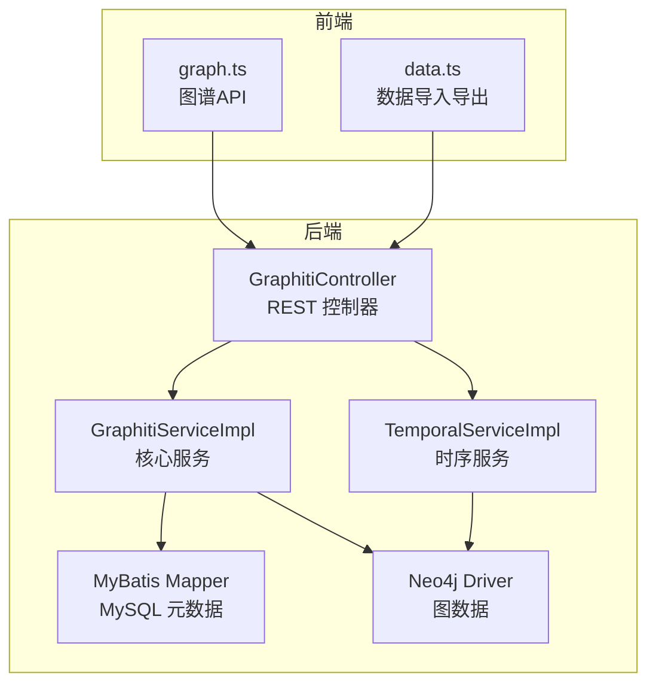
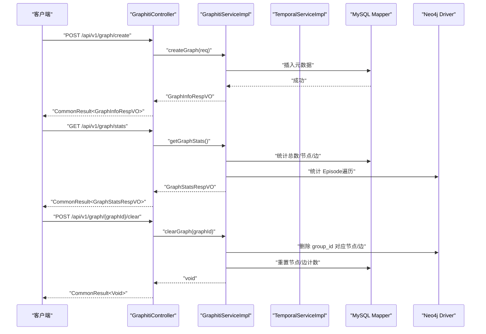
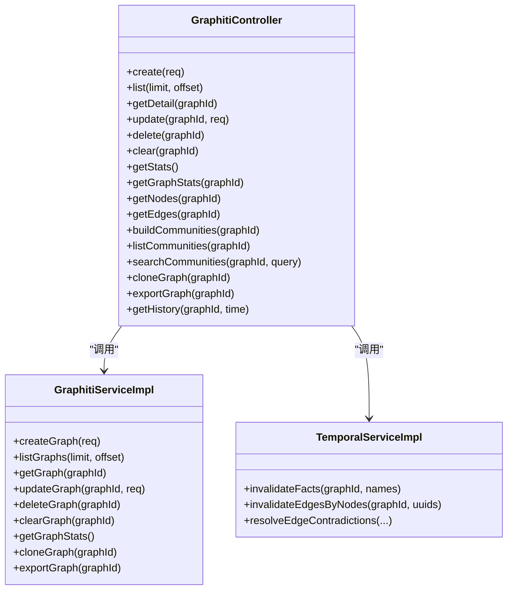

# 图谱管理接口

<!--<cite>
**本文引用的文件**
- [GraphitiController.java](file://graphiti-module-core/src/main/java/com/raphiti/module/graphiti/controller/admin/GraphitiController.java)
- [CreateGraphReqVO.java](file://graphiti-module-core/src/main/java/com/raphiti/module/graphiti/vo/graph/CreateGraphReqVO.java)
- [UpdateGraphReqVO.java](file://graphiti-module-core/src/main/java/com/raphiti/module/graphiti/vo/graph/UpdateGraphReqVO.java)
- [GraphStatsRespVO.java](file://graphiti-module-core/src/main/java/com/raphiti/module/graphiti/vo/graph/GraphStatsRespVO.java)
- [GraphListRespVO.java](file://graphiti-module-core/src/main/java/com/raphiti/module/graphiti/vo/graph/GraphListRespVO.java)
- [GraphInfoRespVO.java](file://graphiti-module-core/src/main/java/com/raphiti/module/graphiti/vo/graph/GraphInfoRespVO.java)
- [GraphitiServiceImpl.java](file://graphiti-module-core/src/main/java/com/raphiti/module/graphiti/service/impl/GraphitiServiceImpl.java)
- [ResultCode.java](file://graphiti-framework/graphiti-common/src/main/java/com/raphiti/common/constants/ResultCode.java)
- [CommonResult.java](file://graphiti-framework/graphiti-common/src/main/java/com/raphiti/common/response/CommonResult.java)
- [BusinessException.java](file://graphiti-framework/graphiti-common/src/main/java/com/raphiti/common/exception/BusinessException.java)
- [TemporalServiceImpl.java](file://graphiti-module-core/src/main/java/com/raphiti/module/graphiti/service/impl/TemporalServiceImpl.java)
- [graph.ts](file://graphiti-web/src/api/graph.ts)
- [data.ts](file://graphiti-web/src/api/data.ts)
- [README_CN.md](file://README_CN.md)
</cite>-->

## 目录
1. [简介](#简介)
2. [项目结构](#项目结构)
3. [核心组件](#核心组件)
4. [架构总览](#架构总览)
5. [详细组件分析](#详细组件分析)
6. [依赖分析](#依赖分析)
7. [性能考虑](#性能考虑)
8. [故障排查指南](#故障排查指南)
9. [结论](#结论)
10. [附录](#附录)

## 简介
本文件为 Graphiti-Java 图谱管理接口的专业 API 文档，覆盖图谱的创建、查询、更新、删除、清空、克隆、导出、统计、社区管理、历史状态查询等核心能力。文档同时说明了统一响应结构、错误码体系、分页查询机制，并给出生命周期管理与数据清理策略、使用示例与性能优化建议，帮助知识图谱管理员与开发者高效集成与运维。

## 项目结构
- 后端采用 Spring Boot + MyBatis + Neo4j 的分层架构，图谱管理主要集中在 admin 控制器与服务层。
- 前端通过 graph.ts、data.ts 等 API 文件对接后端 REST 接口，完成图谱 CRUD、数据导入导出、社区与历史查询等操作。

图表来源
- [GraphitiController.java:37-235](file://graphiti-module-core/src/main/java/com/raphiti/module/graphiti/controller/admin/GraphitiController.java#L37-L235)
- [GraphitiServiceImpl.java:98-256](file://graphiti-module-core/src/main/java/com/raphiti/module/graphiti/service/impl/GraphitiServiceImpl.java#L98-L256)
- [TemporalServiceImpl.java:1-44](file://graphiti-module-core/src/main/java/com/raphiti/module/graphiti/service/impl/TemporalServiceImpl.java#L1-L44)

章节来源
- [GraphitiController.java:37-235](file://graphiti-module-core/src/main/java/com/raphiti/module/graphiti/controller/admin/GraphitiController.java#L37-L235)
- [graph.ts:53-206](file://graphiti-web/src/api/graph.ts#L53-L206)
- [data.ts:132-320](file://graphiti-web/src/api/data.ts#L132-L320)

## 核心组件
- 控制器层：提供 REST 接口，负责参数校验、鉴权与调用服务层。
- 服务层：实现业务逻辑，包括图谱 CRUD、统计、克隆、导出、清空、历史查询等。
- 数据层：MySQL 存储图谱元数据；Neo4j 存储图数据（节点、边、时序事件）。
- 响应与异常：统一响应结构 CommonResult，业务异常 BusinessException，错误码 ResultCode。

章节来源
- [GraphitiController.java:37-235](file://graphiti-module-core/src/main/java/com/raphiti/module/graphiti/controller/admin/GraphitiController.java#L37-L235)
- [GraphitiServiceImpl.java:98-256](file://graphiti-module-core/src/main/java/com/raphiti/module/graphiti/service/impl/GraphitiServiceImpl.java#L98-L256)
- [CommonResult.java:14-67](file://graphiti-framework/graphiti-common/src/main/java/com/raphiti/common/response/CommonResult.java#L14-L67)
- [ResultCode.java:7-22](file://graphiti-framework/graphiti-common/src/main/java/com/raphiti/common/constants/ResultCode.java#L7-L22)

## 架构总览
下图展示图谱管理关键流程：创建、查询、更新、删除、清空、克隆、导出、统计、社区、历史查询。

图表来源
- [GraphitiController.java:50-118](file://graphiti-module-core/src/main/java/com/raphiti/module/graphiti/controller/admin/GraphitiController.java#L50-L118)
- [GraphitiServiceImpl.java:98-158](file://graphiti-module-core/src/main/java/com/raphiti/module/graphiti/service/impl/GraphitiServiceImpl.java#L98-L158)

## 详细组件分析

### 图谱管理 REST 接口
- 基础路径：/api/v1/graph
- 认证：所有接口均需 Bearer Token（见注解 SecurityRequirement）

1) 创建图谱
- 方法：POST
- 路径：/api/v1/graph/create
- 请求体：CreateGraphReqVO（名称必填，描述可选）
- 响应：GraphInfoRespVO
- 业务行为：生成唯一 graphId，初始化计数，写入 MySQL 元数据

2) 获取图谱列表（分页）
- 方法：GET
- 路径：/api/v1/graph/list
- 查询参数：limit（默认100）、offset（默认0）
- 响应：GraphListRespVO（graphs、totalCount、rowCount）

3) 获取图谱详情
- 方法：GET
- 路径：/api/v1/graph/{graphId}
- 路径参数：graphId
- 响应：GraphInfoRespVO

4) 更新图谱
- 方法：PUT
- 路径：/api/v1/graph/{graphId}
- 请求体：UpdateGraphReqVO（名称、描述可选）
- 响应：GraphInfoRespVO

5) 删除图谱（逻辑删除）
- 方法：DELETE
- 路径：/api/v1/graph/{graphId}
- 响应：CommonResult<Void>

6) 清空图谱数据（保留元数据）
- 方法：POST
- 路径：/api/v1/graph/{graphId}/clear
- 响应：CommonResult<Void>

7) 获取系统统计
- 方法：GET
- 路径：/api/v1/graph/stats
- 响应：GraphStatsRespVO（totalGraphs、totalNodes、totalEdges、totalEpisodes 及趋势）

8) 获取指定图谱统计
- 方法：GET
- 路径：/api/v1/graph/{graphId}/stats
- 响应：Map<String, Long>（nodeCount、edgeCount）

9) 获取节点列表
- 方法：GET
- 路径：/api/v1/graph/{graphId}/nodes
- 响应：List<NodeListRespVO>

10) 获取边列表
- 方法：GET
- 路径：/api/v1/graph/{graphId}/edges
- 响应：List<EdgeListRespVO>

11) 构建社区
- 方法：POST
- 路径：/api/v1/graph/{graphId}/communities/build
- 响应：Map<String, Object>

12) 获取社区列表
- 方法：GET
- 路径：/api/v1/graph/{graphId}/communities

13) 搜索社区
- 方法：GET
- 路径：/api/v1/graph/{graphId}/communities/search?query=...

14) 克隆图谱
- 方法：POST
- 路径：/api/v1/graph/{graphId}/clone
- 响应：GraphInfoRespVO

15) 导出图谱
- 方法：GET
- 路径：/api/v1/graph/{graphId}/export
- 响应：Map<String, Object>（graphId、name、description、nodeCount、edgeCount、createdAt、nodes、edges、episodes）

16) 历史状态查询
- 方法：GET
- 路径：/api/v1/graph/{graphId}/history
- 查询参数：time（毫秒时间戳）
- 响应：Map<String, Object>（nodes、edges）

章节来源
- [GraphitiController.java:50-235](file://graphiti-module-core/src/main/java/com/raphiti/module/graphiti/controller/admin/GraphitiController.java#L50-L235)
- [CreateGraphReqVO.java:10-22](file://graphiti-module-core/src/main/java/com/raphiti/module/graphiti/vo/graph/CreateGraphReqVO.java#L10-L22)
- [UpdateGraphReqVO.java:9-22](file://graphiti-module-core/src/main/java/com/raphiti/module/graphiti/vo/graph/UpdateGraphReqVO.java#L9-L22)
- [GraphStatsRespVO.java:9-47](file://graphiti-module-core/src/main/java/com/raphiti/module/graphiti/vo/graph/GraphStatsRespVO.java#L9-L47)
- [GraphListRespVO.java:11-24](file://graphiti-module-core/src/main/java/com/raphiti/module/graphiti/vo/graph/GraphListRespVO.java#L11-L24)
- [GraphInfoRespVO.java:10-41](file://graphiti-module-core/src/main/java/com/raphiti/module/graphiti/vo/graph/GraphInfoRespVO.java#L10-L41)

### 统一响应与错误码
- 统一响应：CommonResult<T>，包含 code、message、data、timestamp
- 成功：code=200，message="success"
- 业务错误码：1001=图谱不存在或已删除，1002=本体未定义，1003=节点不存在，1004=边不存在，1005=事件不存在，1006=参数无效
- 通用 HTTP 错误：400、401、403、404、500

章节来源
- [CommonResult.java:14-67](file://graphiti-framework/graphiti-common/src/main/java/com/raphiti/common/response/CommonResult.java#L14-L67)
- [ResultCode.java:7-22](file://graphiti-framework/graphiti-common/src/main/java/com/raphiti/common/constants/ResultCode.java#L7-L22)
- [BusinessException.java:10-32](file://graphiti-framework/graphiti-common/src/main/java/com/raphiti/common/exception/BusinessException.java#L10-L32)

### 分页查询与过滤
- 图谱列表：limit、offset 参数控制分页
- 节点/边列表：控制器内构造空过滤条件，便于后续扩展（如按类型、属性过滤）

章节来源
- [GraphitiController.java:66-163](file://graphiti-module-core/src/main/java/com/raphiti/module/graphiti/controller/admin/GraphitiController.java#L66-L163)

### 图谱生命周期与数据清理策略
- 删除图谱：逻辑删除 MySQL 元数据（deleted=true），Neo4j 数据暂未清理（TODO）
- 清空图谱：删除 Neo4j 中 group_id 对应的所有节点与边，重置 MySQL 节点/边计数
- 克隆图谱：复制元数据与 Neo4j 数据，生成新 graphId
- 导出图谱：返回元数据与 Neo4j 节点/边/事件集合

章节来源
- [GraphitiServiceImpl.java:98-205](file://graphiti-module-core/src/main/java/com/raphiti/module/graphiti/service/impl/GraphitiServiceImpl.java#L98-L205)

### 时序与历史查询
- 历史状态查询：按毫秒时间戳返回该时刻有效的节点与边
- 时序服务：提供失效节点/边、冲突解决等能力（用于维护）

章节来源
- [GraphitiController.java:222-233](file://graphiti-module-core/src/main/java/com/raphiti/module/graphiti/controller/admin/GraphitiController.java#L222-L233)
- [TemporalServiceImpl.java:27-44](file://graphiti-module-core/src/main/java/com/raphiti/module/graphiti/service/impl/TemporalServiceImpl.java#L27-L44)

### 前端对接与使用示例
- 前端 API 文件 graph.ts、data.ts 映射后端接口，提供创建、查询、更新、删除、清空、导出、社区、历史等方法
- 示例：README 中提供了创建本体、构建社区、调用 Swagger 文档等 curl 示例

章节来源
- [graph.ts:53-206](file://graphiti-web/src/api/graph.ts#L53-L206)
- [data.ts:132-320](file://graphiti-web/src/api/data.ts#L132-L320)
- [README_CN.md:366-413](file://README_CN.md#L366-L413)

## 依赖分析
- 控制器依赖服务层，服务层依赖 Mapper 与 Neo4j Driver
- 统一响应与异常贯穿各层，保证前后端一致的错误处理体验

图表来源
- [GraphitiController.java:41-48](file://graphiti-module-core/src/main/java/com/raphiti/module/graphiti/controller/admin/GraphitiController.java#L41-L48)
- [GraphitiServiceImpl.java:34-256](file://graphiti-module-core/src/main/java/com/raphiti/module/graphiti/service/impl/GraphitiServiceImpl.java#L34-L256)
- [TemporalServiceImpl.java:23-44](file://graphiti-module-core/src/main/java/com/raphiti/module/graphiti/service/impl/TemporalServiceImpl.java#L23-L44)

## 性能考虑
- 分页：列表接口默认 limit=100，建议前端按需调整，避免一次性加载过多数据
- 统计：系统统计会遍历所有图谱并查询 Neo4j Episode 数量，建议缓存或异步聚合
- 导出：导出接口返回大量节点/边，建议后端分批拉取或提供后台任务导出
- 清空：清空操作涉及大范围删除，建议在低峰期执行并监控 Neo4j 性能
- 时序：历史查询按时间戳回溯，建议在 Neo4j 中建立必要索引以提升查询效率

## 故障排查指南
- 常见错误码
  - 401 未认证：确认 Authorization 头是否携带有效 Bearer Token
  - 403 禁止访问：检查权限配置
  - 404 资源不存在：确认 graphId 是否正确
  - 1001 图谱不存在或已删除：检查图谱是否被逻辑删除
  - 500 服务器内部错误：查看后端日志定位具体异常
- 建议排查步骤
  - 使用 Swagger/OpenAPI 文档校验请求参数与路径
  - 检查统一响应中的 code/message 字段
  - 对于业务异常，捕获 BusinessException 并读取其 code/message
  - 关注服务层日志，特别是删除/清空/克隆/导出等耗时操作

章节来源
- [ResultCode.java:7-22](file://graphiti-framework/graphiti-common/src/main/java/com/raphiti/common/constants/ResultCode.java#L7-L22)
- [BusinessException.java:10-32](file://graphiti-framework/graphiti-common/src/main/java/com/raphiti/common/exception/BusinessException.java#L10-L32)
- [CommonResult.java:14-67](file://graphiti-framework/graphiti-common/src/main/java/com/raphiti/common/response/CommonResult.java#L14-L67)

## 结论
本文档系统性地梳理了 Graphiti-Java 的图谱管理 REST 接口，明确了请求参数、响应格式、错误码与生命周期策略，并提供了前端对接示例与性能优化建议。建议在生产环境中结合缓存、异步任务与索引优化，确保高并发场景下的稳定性与性能。

## 附录

### API 定义速查
- 创建图谱：POST /api/v1/graph/create
- 获取图谱列表：GET /api/v1/graph/list?limit=&offset=
- 获取图谱详情：GET /api/v1/graph/{graphId}
- 更新图谱：PUT /api/v1/graph/{graphId}
- 删除图谱：DELETE /api/v1/graph/{graphId}
- 清空图谱数据：POST /api/v1/graph/{graphId}/clear
- 获取系统统计：GET /api/v1/graph/stats
- 获取指定图谱统计：GET /api/v1/graph/{graphId}/stats
- 获取节点列表：GET /api/v1/graph/{graphId}/nodes
- 获取边列表：GET /api/v1/graph/{graphId}/edges
- 构建社区：POST /api/v1/graph/{graphId}/communities/build
- 获取社区列表：GET /api/v1/graph/{graphId}/communities
- 搜索社区：GET /api/v1/graph/{graphId}/communities/search?query=
- 克隆图谱：POST /api/v1/graph/{graphId}/clone
- 导出图谱：GET /api/v1/graph/{graphId}/export
- 历史状态查询：GET /api/v1/graph/{graphId}/history?time=

### 响应与错误码对照
- 成功：code=200，message="success"
- 业务错误：1001~1006（图谱/节点/边/事件不存在、参数无效等）
- 通用错误：400、401、403、404、500

章节来源
- [GraphitiController.java:50-235](file://graphiti-module-core/src/main/java/com/raphiti/module/graphiti/controller/admin/GraphitiController.java#L50-L235)
- [ResultCode.java:7-22](file://graphiti-framework/graphiti-common/src/main/java/com/raphiti/common/constants/ResultCode.java#L7-L22)
- [CommonResult.java:14-67](file://graphiti-framework/graphiti-common/src/main/java/com/raphiti/common/response/CommonResult.java#L14-L67)