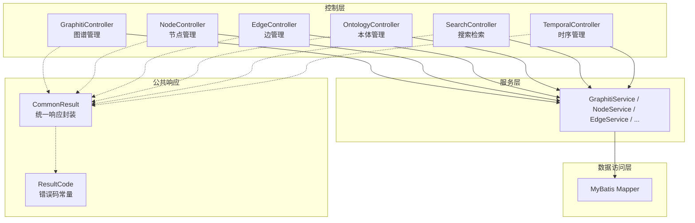
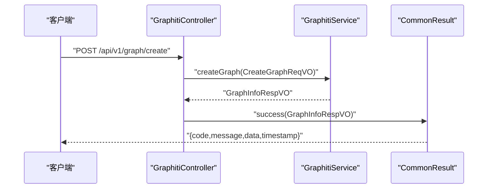
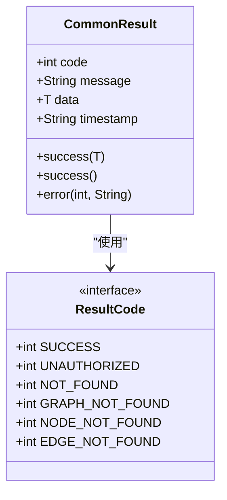

# 知识图谱接口

<!--<cite>
**本文引用的文件**
- [GraphitiController.java](file://graphiti-module-core/src/main/java/com/graphiti/module/graphiti/controller/admin/GraphitiController.java)
- [NodeController.java](file://graphiti-module-core/src/main/java/com/graphiti/module/graphiti/controller/admin/NodeController.java)
- [EdgeController.java](file://graphiti-module-core/src/main/java/com/graphiti/module/graphiti/controller/admin/EdgeController.java)
- [OntologyController.java](file://graphiti-module-core/src/main/java/com/graphiti/module/graphiti/controller/admin/OntologyController.java)
- [SearchController.java](file://graphiti-module-core/src/main/java/com/graphiti/module/graphiti/controller/admin/SearchController.java)
- [TemporalController.java](file://graphiti-module-core/src/main/java/com/graphiti/module/graphiti/controller/admin/TemporalController.java)
- [CreateGraphReqVO.java](file://graphiti-module-core/src/main/java/com/graphiti/module/graphiti/vo/graph/CreateGraphReqVO.java)
- [UpdateGraphReqVO.java](file://graphiti-module-core/src/main/java/com/graphiti/module/graphiti/vo/graph/UpdateGraphReqVO.java)
- [NodeFilterReqVO.java](file://graphiti-module-core/src/main/java/com/graphiti/module/graphiti/vo/node/NodeFilterReqVO.java)
- [EdgeFilterReqVO.java](file://graphiti-module-core/src/main/java/com/graphiti/module/graphiti/vo/edge/EdgeFilterReqVO.java)
- [SearchQueryReqVO.java](file://graphiti-module-core/src/main/java/com/graphiti/module/graphiti/vo/search/SearchQueryReqVO.java)
- [GraphStatsRespVO.java](file://graphiti-module-core/src/main/java/com/graphiti/module/graphiti/vo/graph/GraphStatsRespVO.java)
- [CommonResult.java](file://graphiti-framework/graphiti-common/src/main/java/com/graphiti/common/response/CommonResult.java)
- [ResultCode.java](file://graphiti-framework/graphiti-common/src/main/java/com/graphiti/common/constants/ResultCode.java)
</cite>-->

## 目录
1. [简介](#简介)
2. [项目结构](#项目结构)
3. [核心组件](#核心组件)
4. [架构总览](#架构总览)
5. [详细组件分析](#详细组件分析)
6. [依赖分析](#依赖分析)
7. [性能考量](#性能考量)
8. [故障排查指南](#故障排查指南)
9. [结论](#结论)
10. [附录](#附录)

## 简介
本文件为 ontograph-java 知识图谱管理接口的权威参考，覆盖图谱生命周期管理（创建、查询、更新、删除、清空、克隆）、节点与边的 CRUD、图谱统计、本体管理、检索与记忆、时序历史查询等能力。文档提供端点清单、请求参数、响应格式、错误码定义，并结合数据模型与查询优化策略给出实践建议与示例。

## 项目结构
后端采用 Spring Boot + MyBatis 架构，核心模块位于 graphiti-module-core，Admin 控制器集中于 admin 包；公共响应封装位于 graphiti-common。接口统一通过 Swagger 注解标注，便于生成文档与联调。

图表来源
- [GraphitiController.java:37-235](file://graphiti-module-core/src/main/java/com/graphiti/module/graphiti/controller/admin/GraphitiController.java#L37-L235)
- [NodeController.java:23-143](file://graphiti-module-core/src/main/java/com/graphiti/module/graphiti/controller/admin/NodeController.java#L23-L143)
- [EdgeController.java:23-91](file://graphiti-module-core/src/main/java/com/graphiti/module/graphiti/controller/admin/EdgeController.java#L23-L91)
- [OntologyController.java:20-232](file://graphiti-module-core/src/main/java/com/graphiti/module/graphiti/controller/admin/OntologyController.java#L20-L232)
- [SearchController.java:23-138](file://graphiti-module-core/src/main/java/com/graphiti/module/graphiti/controller/admin/SearchController.java#L23-L138)
- [TemporalController.java:16-67](file://graphiti-module-core/src/main/java/com/graphiti/module/graphiti/controller/admin/TemporalController.java#L16-L67)
- [CommonResult.java:14-68](file://graphiti-framework/graphiti-common/src/main/java/com/graphiti/common/response/CommonResult.java#L14-L68)
- [ResultCode.java:7-23](file://graphiti-framework/graphiti-common/src/main/java/com/graphiti/common/constants/ResultCode.java#L7-L23)

章节来源
- [GraphitiController.java:37-235](file://graphiti-module-core/src/main/java/com/graphiti/module/graphiti/controller/admin/GraphitiController.java#L37-L235)
- [NodeController.java:23-143](file://graphiti-module-core/src/main/java/com/graphiti/module/graphiti/controller/admin/NodeController.java#L23-L143)
- [EdgeController.java:23-91](file://graphiti-module-core/src/main/java/com/graphiti/module/graphiti/controller/admin/EdgeController.java#L23-L91)
- [OntologyController.java:20-232](file://graphiti-module-core/src/main/java/com/graphiti/module/graphiti/controller/admin/OntologyController.java#L20-L232)
- [SearchController.java:23-138](file://graphiti-module-core/src/main/java/com/graphiti/module/graphiti/controller/admin/SearchController.java#L23-L138)
- [TemporalController.java:16-67](file://graphiti-module-core/src/main/java/com/graphiti/module/graphiti/controller/admin/TemporalController.java#L16-L67)
- [CommonResult.java:14-68](file://graphiti-framework/graphiti-common/src/main/java/com/graphiti/common/response/CommonResult.java#L14-L68)
- [ResultCode.java:7-23](file://graphiti-framework/graphiti-common/src/main/java/com/graphiti/common/constants/ResultCode.java#L7-L23)

## 核心组件
- 图谱管理控制器：提供图谱的创建、列表、详情、更新、删除、清空、克隆、导出、统计、节点/边列表、社区构建与查询、历史状态查询等接口。
- 节点管理控制器：提供节点的列表、详情、创建、更新、删除、关联边与 Episode 查询。
- 边管理控制器：提供边的列表、详情、创建、更新、删除、节点间关系查询。
- 本体管理控制器：提供本体定义、类/属性/约束 CRUD、版本历史、Schema.org 导入、推理机状态与一致性检查。
- 搜索检索控制器：提供全局/图谱内搜索、记忆检索、检索搜索、实体边事实获取、最近 Episode 获取、混合/语义/BFS 检索快捷入口。
- 时序管理控制器：提供当前/指定时间点有效事实与关系、实体历史版本、批量失效事实。

章节来源
- [GraphitiController.java:37-235](file://graphiti-module-core/src/main/java/com/graphiti/module/graphiti/controller/admin/GraphitiController.java#L37-L235)
- [NodeController.java:23-143](file://graphiti-module-core/src/main/java/com/graphiti/module/graphiti/controller/admin/NodeController.java#L23-L143)
- [EdgeController.java:23-91](file://graphiti-module-core/src/main/java/com/graphiti/module/graphiti/controller/admin/EdgeController.java#L23-L91)
- [OntologyController.java:20-232](file://graphiti-module-core/src/main/java/com/graphiti/module/graphiti/controller/admin/OntologyController.java#L20-L232)
- [SearchController.java:23-138](file://graphiti-module-core/src/main/java/com/graphiti/module/graphiti/controller/admin/SearchController.java#L23-L138)
- [TemporalController.java:16-67](file://graphiti-module-core/src/main/java/com/graphiti/module/graphiti/controller/admin/TemporalController.java#L16-L67)

## 架构总览
以下序列图展示“创建图谱”端到端流程，体现控制器、服务与统一响应封装的协作。

图表来源
- [GraphitiController.java:53-59](file://graphiti-module-core/src/main/java/com/graphiti/module/graphiti/controller/admin/GraphitiController.java#L53-L59)
- [CommonResult.java:39-45](file://graphiti-framework/graphiti-common/src/main/java/com/graphiti/common/response/CommonResult.java#L39-L45)

## 详细组件分析

### 图谱管理接口
- 基础操作
  - 创建图谱：POST /api/v1/graph/create
  - 获取图谱列表：GET /api/v1/graph/list?limit=&offset=
  - 获取图谱详情：GET /api/v1/graph/{graphId}
  - 更新图谱：PUT /api/v1/graph/{graphId}
  - 删除图谱：DELETE /api/v1/graph/{graphId}
  - 清空图谱数据：POST /api/v1/graph/{graphId}/clear
  - 克隆图谱：POST /api/v1/graph/{graphId}/clone
  - 导出图谱：GET /api/v1/graph/{graphId}/export
- 统计查询
  - 系统统计：GET /api/v1/graph/stats
  - 指定图谱统计：GET /api/v1/graph/{graphId}/stats
- 节点/边列表
  - GET /api/v1/graph/{graphId}/nodes
  - GET /api/v1/graph/{graphId}/edges
- 社区管理
  - 构建社区：POST /api/v1/graph/{graphId}/communities/build
  - 社区列表：GET /api/v1/graph/{graphId}/communities
  - 社区搜索：GET /api/v1/graph/{graphId}/communities/search?query=
- 历史状态查询
  - GET /api/v1/graph/{graphId}/history?time=

请求参数与响应要点
- 请求体对象：CreateGraphReqVO（name 必填，description 可选）
- 更新体对象：UpdateGraphReqVO（name/description 可选）
- 统计响应：GraphStatsRespVO（totalGraphs/totalNodes/totalEdges/totalEpisodes 及趋势字段）

章节来源
- [GraphitiController.java:50-235](file://graphiti-module-core/src/main/java/com/graphiti/module/graphiti/controller/admin/GraphitiController.java#L50-L235)
- [CreateGraphReqVO.java:10-23](file://graphiti-module-core/src/main/java/com/graphiti/module/graphiti/vo/graph/CreateGraphReqVO.java#L10-L23)
- [UpdateGraphReqVO.java:9-23](file://graphiti-module-core/src/main/java/com/graphiti/module/graphiti/vo/graph/UpdateGraphReqVO.java#L9-L23)
- [GraphStatsRespVO.java:9-48](file://graphiti-module-core/src/main/java/com/graphiti/module/graphiti/vo/graph/GraphStatsRespVO.java#L9-L48)

### 节点管理接口
- 列表与详情
  - GET /api/v1/nodes/list?graphId=&...（支持 NodeFilterReqVO）
  - GET /api/v1/nodes/{nodeUuid}?graphId=
- 创建/更新/删除
  - POST /api/v1/nodes/create?graphId=&skipValidation=
  - PUT /api/v1/nodes/{nodeUuid}?graphId=
  - DELETE /api/v1/nodes/{nodeUuid}?graphId=
- 关联关系
  - GET /api/v1/nodes/{nodeUuid}/edges?graphId=&skip=&limit=
  - GET /api/v1/nodes/{nodeUuid}/episodes?graphId=&skip=&limit=

请求参数与过滤
- NodeFilterReqVO：name（模糊）、type（精确）、skip、limit

章节来源
- [NodeController.java:35-143](file://graphiti-module-core/src/main/java/com/graphiti/module/graphiti/controller/admin/NodeController.java#L35-L143)
- [NodeFilterReqVO.java:9-33](file://graphiti-module-core/src/main/java/com/graphiti/module/graphiti/vo/node/NodeFilterReqVO.java#L9-L33)

### 边管理接口
- 列表与详情
  - POST /api/v1/graph/edge/list/{graphId}（Body：EdgeFilterReqVO，可为空）
  - GET /api/v1/graph/edge/{graphId}/{edgeUuid}
- 创建/更新/删除
  - POST /api/v1/graph/edge/{graphId}
  - PUT /api/v1/graph/edge/{graphId}/{edgeUuid}
  - DELETE /api/v1/graph/edge/{graphId}/{edgeUuid}
- 节点间关系
  - GET /api/v1/graph/edge/between/{sourceUuid}/{targetUuid}

请求参数与过滤
- EdgeFilterReqVO：type、source、target、skip、limit

章节来源
- [EdgeController.java:33-91](file://graphiti-module-core/src/main/java/com/graphiti/module/graphiti/controller/admin/EdgeController.java#L33-L91)
- [EdgeFilterReqVO.java:9-38](file://graphiti-module-core/src/main/java/com/graphiti/module/graphiti/vo/edge/EdgeFilterReqVO.java#L9-L38)

### 本体管理接口
- 本体定义
  - GET /api/v1/ontology/{graphId}/definition
  - POST /api/v1/ontology/{graphId}/definition
  - GET /api/v1/ontology/{graphId}
- 批量验证
  - POST /api/v1/ontology/{graphId}/validate/batch
- 类管理
  - GET /api/v1/ontology/{graphId}/classes
  - GET /api/v1/ontology/{graphId}/classes/hierarchy
  - POST /api/v1/ontology/{graphId}/classes
  - PUT /api/v1/ontology/{graphId}/classes/{classId}
  - DELETE /api/v1/ontology/{graphId}/classes/{classId}
- 属性管理
  - GET /api/v1/ontology/{graphId}/properties
  - POST /api/v1/ontology/{graphId}/properties
  - PUT /api/v1/ontology/{graphId}/properties/{propertyId}
  - DELETE /api/v1/ontology/{graphId}/properties/{propertyId}
- 约束管理
  - GET /api/v1/ontology/{graphId}/constraints
  - POST /api/v1/ontology/{graphId}/constraints
  - DELETE /api/v1/ontology/{graphId}/constraints/{constraintId}
- 版本历史
  - GET /api/v1/ontology/{graphId}/history
- Schema.org 导入
  - POST /api/v1/ontology/{graphId}/import/schema-org
- 推理引擎
  - GET /api/v1/ontology/{graphId}/reasoners/status
  - POST /api/v1/ontology/{graphId}/reasoners/warmup
  - GET /api/v1/ontology/{graphId}/consistency

章节来源
- [OntologyController.java:32-232](file://graphiti-module-core/src/main/java/com/graphiti/module/graphiti/controller/admin/OntologyController.java#L32-L232)

### 搜索检索接口
- 全局搜索：POST /api/v1/graph/search/global
- 图谱搜索：POST /api/v1/graph/search/graph/{graphId}
- 记忆检索：POST /api/v1/graph/search/memory
- 检索搜索：POST /api/v1/graph/search/retrieve/search
- 实体边事实：GET /api/v1/graph/search/retrieve/entity-edge/{uuid}
- 最近 Episode：GET /api/v1/graph/search/retrieve/episodes/{graphId}?last_n=
- 混合检索：POST /api/v1/graph/search/hybrid/{graphId}?query=&limit=
- 语义搜索：POST /api/v1/graph/search/semantic/{graphId}?query=&limit=
- BFS 搜索：POST /api/v1/graph/search/bfs/{graphId}?query=&depth=&limit=

请求参数
- SearchQueryReqVO：query（必填）、groupIds、maxFacts、enableRerank、config

章节来源
- [SearchController.java:33-138](file://graphiti-module-core/src/main/java/com/graphiti/module/graphiti/controller/admin/SearchController.java#L33-L138)
- [SearchQueryReqVO.java:14-33](file://graphiti-module-core/src/main/java/com/graphiti/module/graphiti/vo/search/SearchQueryReqVO.java#L14-L33)

### 时序管理接口
- 当前有效事实：GET /api/v1/graph/{graphId}/temporal/facts/current
- 指定时间点事实：GET /api/v1/graph/{graphId}/temporal/facts/at/{referenceTime}
- 指定时间点关系：GET /api/v1/graph/{graphId}/temporal/relationships/at/{referenceTime}
- 实体历史版本：GET /api/v1/graph/{graphId}/temporal/history/{entityName}
- 批量失效事实：POST /api/v1/graph/{graphId}/temporal/facts/invalidate（Body：实体名数组）

章节来源
- [TemporalController.java:24-66](file://graphiti-module-core/src/main/java/com/graphiti/module/graphiti/controller/admin/TemporalController.java#L24-L66)

## 依赖分析
- 统一响应封装：所有控制器返回 CommonResult<T>，包含 code、message、data、timestamp。
- 错误码常量：ResultCode 定义通用与业务错误码，如 SUCCESS、UNAUTHORIZED、NOT_FOUND、GRAPH_NOT_FOUND、NODE_NOT_FOUND、EDGE_NOT_FOUND 等。
- 控制器到服务：各控制器依赖对应 Service 完成业务逻辑，Service 再调用 Mapper 或外部驱动。
- 参数校验：使用 Jakarta Bean Validation（如 @NotBlank、@Valid），配合 VO 对输入进行约束。

图表来源
- [CommonResult.java:14-68](file://graphiti-framework/graphiti-common/src/main/java/com/graphiti/common/response/CommonResult.java#L14-L68)
- [ResultCode.java:7-23](file://graphiti-framework/graphiti-common/src/main/java/com/graphiti/common/constants/ResultCode.java#L7-L23)

章节来源
- [CommonResult.java:14-68](file://graphiti-framework/graphiti-common/src/main/java/com/graphiti/common/response/CommonResult.java#L14-L68)
- [ResultCode.java:7-23](file://graphiti-framework/graphiti-common/src/main/java/com/graphiti/common/constants/ResultCode.java#L7-L23)

## 性能考量
- 分页与限制
  - 节点/边列表默认 skip=0、limit=20，建议前端传入合理 limit 并实现分页加载，避免一次性拉取大量数据。
- 搜索与重排序
  - SearchQueryReqVO 的 enableRerank 默认开启，复杂重排序会增加延迟；在大批量检索场景可考虑关闭或调整 maxFacts。
- 检索模式
  - 向量/混合/BFS 等模式对性能影响不同，建议根据场景选择；BFS 受深度与图密度影响较大。
- 本体推理
  - 推理机预热（warmup）可显著降低首次推理延迟；一致性检查为阻塞操作，建议在维护窗口执行。
- 统计与导出
  - 大图统计与导出可能耗时较长，建议异步化或分批处理，并提供进度反馈。

## 故障排查指南
常见错误与定位
- 401 未授权：确认请求头携带 Bearer Token。
- 403 禁止访问：权限不足或安全策略拦截。
- 404 资源不存在：图谱/节点/边 UUID 错误或已被删除。
- 业务错误（1001-1099）：如 GRAPH_NOT_FOUND、NODE_NOT_FOUND、EDGE_NOT_FOUND、INVALID_PARAMETER 等。
- 搜索异常：当检索实体边不存在时，返回 404 并提示“边不存在”。

章节来源
- [ResultCode.java:7-23](file://graphiti-framework/graphiti-common/src/main/java/com/graphiti/common/constants/ResultCode.java#L7-L23)
- [SearchController.java:65-75](file://graphiti-module-core/src/main/java/com/graphiti/module/graphiti/controller/admin/SearchController.java#L65-L75)

## 结论
ontograph-java 提供了覆盖知识图谱全生命周期与高级能力的 REST 接口体系，统一的响应封装与完善的参数校验保障了接口的一致性与可靠性。建议在生产环境中结合分页、缓存与异步策略优化性能，并通过本体推理与一致性检查确保数据质量。

## 附录

### 统一响应格式
- 成功响应：code=200，message="success"，data 为具体业务数据，timestamp 为 ISO 时间字符串。
- 错误响应：code 为错误码，message 为错误描述，data 为空。

章节来源
- [CommonResult.java:39-66](file://graphiti-framework/graphiti-common/src/main/java/com/graphiti/common/response/CommonResult.java#L39-L66)

### 错误码定义
- 通用：SUCCESS=200、BAD_REQUEST=400、UNAUTHORIZED=401、FORBIDDEN=403、NOT_FOUND=404、INTERNAL_SERVER_ERROR=500
- 业务：GRAPH_NOT_FOUND=1001、ONTOLOGY_NOT_DEFINED=1002、NODE_NOT_FOUND=1003、EDGE_NOT_FOUND=1004、EPISODE_NOT_FOUND=1005、INVALID_PARAMETER=1006

章节来源
- [ResultCode.java:7-23](file://graphiti-framework/graphiti-common/src/main/java/com/graphiti/common/constants/ResultCode.java#L7-L23)

### 使用示例（路径指引）
- 创建图谱
  - 请求：POST /api/v1/graph/create
  - 请求体：CreateGraphReqVO（name 必填）
  - 响应：CommonResult.success(GraphInfoRespVO)
  - 参考路径：[GraphitiController.java:53-59](file://graphiti-module-core/src/main/java/com/graphiti/module/graphiti/controller/admin/GraphitiController.java#L53-L59)，[CreateGraphReqVO.java:10-23](file://graphiti-module-core/src/main/java/com/graphiti/module/graphiti/vo/graph/CreateGraphReqVO.java#L10-L23)，[CommonResult.java:39-45](file://graphiti-framework/graphiti-common/src/main/java/com/graphiti/common/response/CommonResult.java#L39-L45)
- 获取节点列表
  - 请求：GET /api/v1/nodes/list?graphId=&name=&type=&skip=&limit=
  - 响应：CommonResult.success(List<NodeListRespVO>)
  - 参考路径：[NodeController.java:35-42](file://graphiti-module-core/src/main/java/com/graphiti/module/graphiti/controller/admin/NodeController.java#L35-L42)，[NodeFilterReqVO.java:9-33](file://graphiti-module-core/src/main/java/com/graphiti/module/graphiti/vo/node/NodeFilterReqVO.java#L9-L33)
- 边的创建与查询
  - 创建：POST /api/v1/graph/edge/{graphId}（Body：Map<String,Object>）
  - 查询详情：GET /api/v1/graph/edge/{graphId}/{edgeUuid}
  - 参考路径：[EdgeController.java:53-59](file://graphiti-module-core/src/main/java/com/graphiti/module/graphiti/controller/admin/EdgeController.java#L53-L59)，[EdgeController.java:44-51](file://graphiti-module-core/src/main/java/com/graphiti/module/graphiti/controller/admin/EdgeController.java#L44-L51)
- 搜索检索
  - 图谱内搜索：POST /api/v1/graph/search/graph/{graphId}
  - 语义搜索：POST /api/v1/graph/search/semantic/{graphId}?query=&limit=
  - 参考路径：[SearchController.java:40-47](file://graphiti-module-core/src/main/java/com/graphiti/module/graphiti/controller/admin/SearchController.java#L40-L47)，[SearchController.java:104-118](file://graphiti-module-core/src/main/java/com/graphiti/module/graphiti/controller/admin/SearchController.java#L104-L118)，[SearchQueryReqVO.java:14-33](file://graphiti-module-core/src/main/java/com/graphiti/module/graphiti/vo/search/SearchQueryReqVO.java#L14-L33)
- 时序历史
  - 指定时间点关系：GET /api/v1/graph/{graphId}/temporal/relationships/at/{referenceTime}
  - 参考路径：[TemporalController.java:40-47](file://graphiti-module-core/src/main/java/com/graphiti/module/graphiti/controller/admin/TemporalController.java#L40-L47)