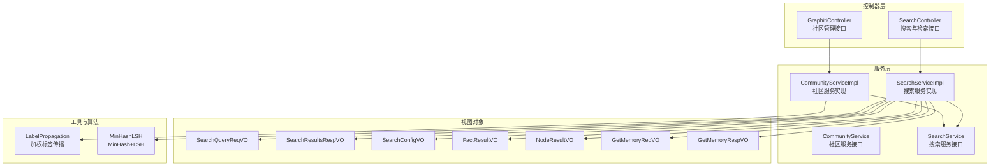
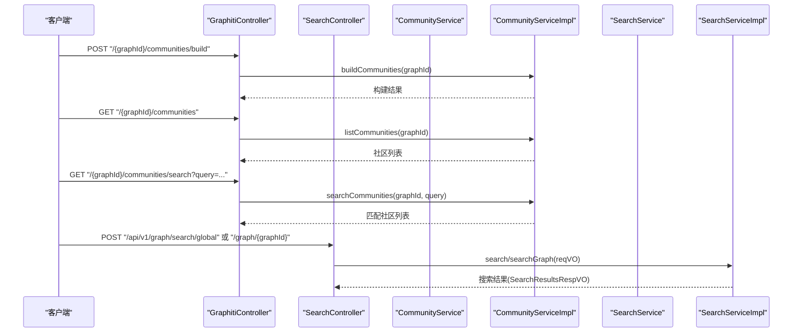
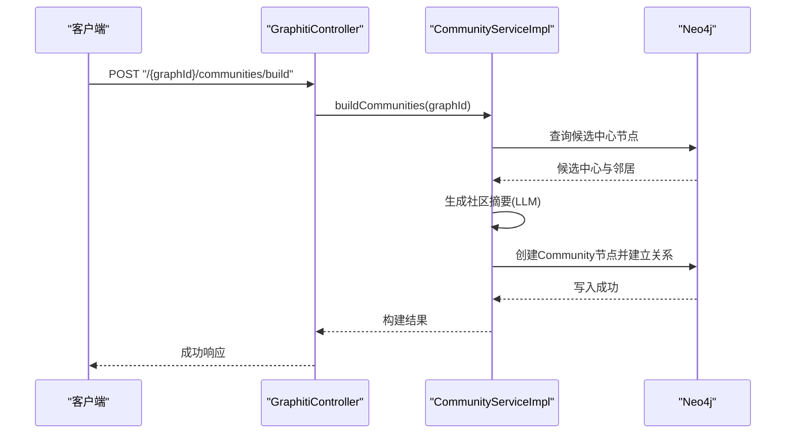
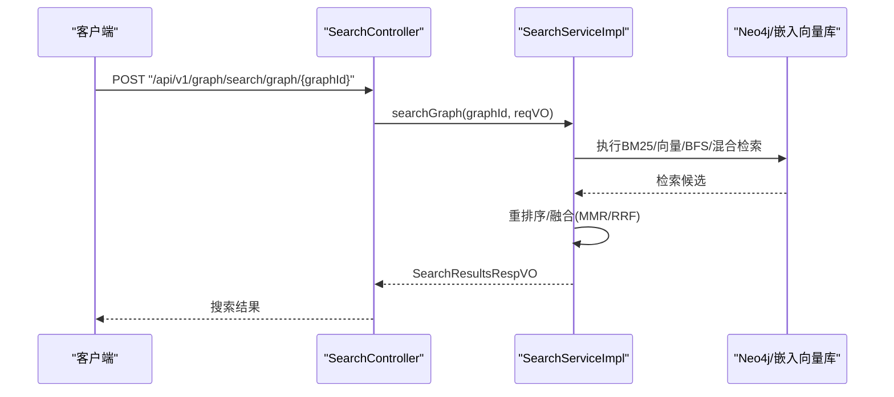
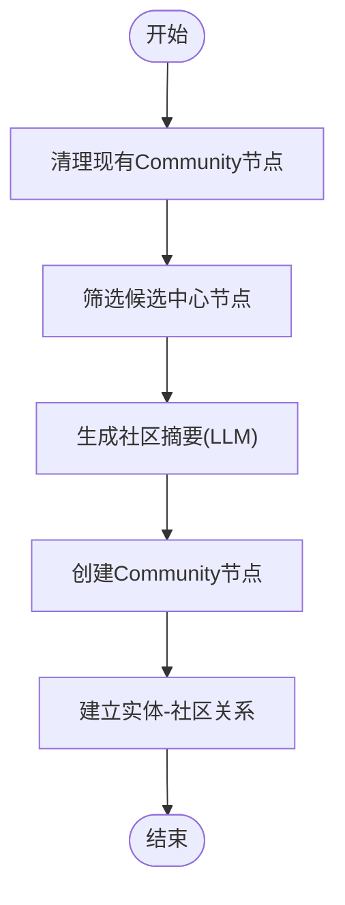
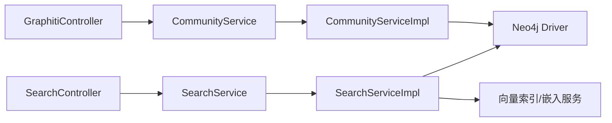

# 社区发现与搜索接口

<cite>
**本文引用的文件**
- [GraphitiController.java](file://graphiti-module-core/src/main/java/com/graphiti/module/graphiti/controller/admin/GraphitiController.java)
- [SearchController.java](file://graphiti-module-core/src/main/java/com/graphiti/module/graphiti/controller/admin/SearchController.java)
- [CommunityService.java](file://graphiti-module-core/src/main/java/com/graphiti/module/graphiti/service/CommunityService.java)
- [SearchService.java](file://graphiti-module-core/src/main/java/com/graphiti/module/graphiti/service/SearchService.java)
- [CommunityServiceImpl.java](file://graphiti-module-core/src/main/java/com/graphiti/module/graphiti/service/impl/CommunityServiceImpl.java)
- [SearchServiceImpl.java](file://graphiti-module-core/src/main/java/com/graphiti/module/graphiti/service/impl/SearchServiceImpl.java)
- [SearchQueryReqVO.java](file://graphiti-module-core/src/main/java/com/graphiti/module/graphiti/vo/search/SearchQueryReqVO.java)
- [SearchResultsRespVO.java](file://graphiti-module-core/src/main/java/com/graphiti/module/graphiti/vo/search/SearchResultsRespVO.java)
- [SearchConfigVO.java](file://graphiti-module-core/src/main/java/com/graphiti/module/graphiti/vo/search/SearchConfigVO.java)
- [FactResultVO.java](file://graphiti-module-core/src/main/java/com/graphiti/module/graphiti/vo/search/FactResultVO.java)
- [NodeResultVO.java](file://graphiti-module-core/src/main/java/com/graphiti/module/graphiti/vo/search/NodeResultVO.java)
- [GetMemoryReqVO.java](file://graphiti-module-core/src/main/java/com/graphiti/module/graphiti/vo/search/GetMemoryReqVO.java)
- [GetMemoryRespVO.java](file://graphiti-module-core/src/main/java/com/graphiti/module/graphiti/vo/search/GetMemoryRespVO.java)
- [LabelPropagation.java](file://graphiti-module-core/src/main/java/com/graphiti/module/graphiti/util/LabelPropagation.java)
- [MinHashLSH.java](file://graphiti-module-core/src/main/java/com/graphiti/module/graphiti/util/MinHashLSH.java)
</cite>

## 目录
1. [简介](#简介)
2. [项目结构](#项目结构)
3. [核心组件](#核心组件)
4. [架构概览](#架构概览)
5. [详细组件分析](#详细组件分析)
6. [依赖分析](#依赖分析)
7. [性能考虑](#性能考虑)
8. [故障排查指南](#故障排查指南)
9. [结论](#结论)
10. [附录](#附录)

## 简介
本文件面向Graphiti-Java社区与搜索接口的使用者与维护者，系统化梳理“社区发现与搜索”相关REST接口，覆盖以下能力：
- 社区发现算法触发与清理
- 社区列表查询与搜索
- 高级搜索能力：全局搜索、图谱内搜索、检索搜索、记忆检索
- 混合搜索、语义搜索、BFS图遍历搜索
- 请求参数、响应格式与搜索优化策略
- 社区算法实现与搜索性能调优方法
- 实际使用示例与最佳实践

## 项目结构
围绕“社区发现与搜索”的关键模块与文件如下：
- 控制器层：GraphitiController（社区管理）、SearchController（搜索与检索）
- 服务层：CommunityService/CommunityServiceImpl、SearchService/SearchServiceImpl
- 视图对象：SearchQueryReqVO、SearchResultsRespVO、SearchConfigVO、FactResultVO、NodeResultVO、GetMemoryReqVO、GetMemoryRespVO
- 工具与算法：LabelPropagation（加权标签传播）、MinHashLSH（MinHash+LSH）

图表来源
- [GraphitiController.java:166-190](file://graphiti-module-core/src/main/java/com/graphiti/module/graphiti/controller/admin/GraphitiController.java#L166-L190)
- [SearchController.java:33-136](file://graphiti-module-core/src/main/java/com/graphiti/module/graphiti/controller/admin/SearchController.java#L33-L136)
- [CommunityService.java:9-38](file://graphiti-module-core/src/main/java/com/graphiti/module/graphiti/service/CommunityService.java#L9-L38)
- [CommunityServiceImpl.java:1064-1198](file://graphiti-module-core/src/main/java/com/graphiti/module/graphiti/service/impl/CommunityServiceImpl.java#L1064-L1198)
- [SearchService.java:15-53](file://graphiti-module-core/src/main/java/com/graphiti/module/graphiti/service/SearchService.java#L15-L53)
- [SearchServiceImpl.java](file://graphiti-module-core/src/main/java/com/graphiti/module/graphiti/service/impl/SearchServiceImpl.java)
- [SearchQueryReqVO.java:14-32](file://graphiti-module-core/src/main/java/com/graphiti/module/graphiti/vo/search/SearchQueryReqVO.java#L14-L32)
- [SearchResultsRespVO.java:13-27](file://graphiti-module-core/src/main/java/com/graphiti/module/graphiti/vo/search/SearchResultsRespVO.java#L13-L27)
- [SearchConfigVO.java:13-39](file://graphiti-module-core/src/main/java/com/graphiti/module/graphiti/vo/search/SearchConfigVO.java#L13-L39)
- [FactResultVO.java:13-58](file://graphiti-module-core/src/main/java/com/graphiti/module/graphiti/vo/search/FactResultVO.java#L13-L58)
- [NodeResultVO.java:13-30](file://graphiti-module-core/src/main/java/com/graphiti/module/graphiti/vo/search/NodeResultVO.java#L13-L30)
- [GetMemoryReqVO.java:15-28](file://graphiti-module-core/src/main/java/com/graphiti/module/graphiti/vo/search/GetMemoryReqVO.java#L15-L28)
- [GetMemoryRespVO.java:13-24](file://graphiti-module-core/src/main/java/com/graphiti/module/graphiti/vo/search/GetMemoryRespVO.java#L13-L24)
- [LabelPropagation.java:20-255](file://graphiti-module-core/src/main/java/com/graphiti/module/graphiti/util/LabelPropagation.java#L20-L255)
- [MinHashLSH.java:18-195](file://graphiti-module-core/src/main/java/com/graphiti/module/graphiti/util/MinHashLSH.java#L18-L195)

章节来源
- [GraphitiController.java:166-190](file://graphiti-module-core/src/main/java/com/graphiti/module/graphiti/controller/admin/GraphitiController.java#L166-L190)
- [SearchController.java:33-136](file://graphiti-module-core/src/main/java/com/graphiti/module/graphiti/controller/admin/SearchController.java#L33-L136)

## 核心组件
- 社区服务接口与实现
  - 接口职责：构建社区、列出社区、搜索社区、删除社区
  - 实现要点：基于Neo4j的Cypher查询；社区摘要通过LLM生成；支持清理现有社区
- 搜索服务接口与实现
  - 接口职责：全局搜索、图谱内搜索、检索搜索、获取记忆、获取最近Episode
  - 实现要点：支持多种搜索模式（bm25/vector/hybrid/bfs），可配置权重与重排序策略

章节来源
- [CommunityService.java:9-38](file://graphiti-module-core/src/main/java/com/graphiti/module/graphiti/service/CommunityService.java#L9-L38)
- [CommunityServiceImpl.java:1064-1198](file://graphiti-module-core/src/main/java/com/graphiti/module/graphiti/service/impl/CommunityServiceImpl.java#L1064-L1198)
- [SearchService.java:15-53](file://graphiti-module-core/src/main/java/com/graphiti/module/graphiti/service/SearchService.java#L15-L53)
- [SearchServiceImpl.java](file://graphiti-module-core/src/main/java/com/graphiti/module/graphiti/service/impl/SearchServiceImpl.java)

## 架构概览
下图展示“社区发现与搜索”在控制器、服务与数据访问层的交互关系。

图表来源
- [GraphitiController.java:166-190](file://graphiti-module-core/src/main/java/com/graphiti/module/graphiti/controller/admin/GraphitiController.java#L166-L190)
- [SearchController.java:33-47](file://graphiti-module-core/src/main/java/com/graphiti/module/graphiti/controller/admin/SearchController.java#L33-L47)
- [CommunityService.java:9-38](file://graphiti-module-core/src/main/java/com/graphiti/module/graphiti/service/CommunityService.java#L9-L38)
- [CommunityServiceImpl.java:1064-1198](file://graphiti-module-core/src/main/java/com/graphiti/module/graphiti/service/impl/CommunityServiceImpl.java#L1064-L1198)
- [SearchService.java:15-53](file://graphiti-module-core/src/main/java/com/graphiti/module/graphiti/service/SearchService.java#L15-L53)
- [SearchServiceImpl.java](file://graphiti-module-core/src/main/java/com/graphiti/module/graphiti/service/impl/SearchServiceImpl.java)

## 详细组件分析

### 社区发现与管理接口
- 构建社区
  - 方法与路径：POST "/{graphId}/communities/build"
  - 功能：对指定图谱执行社区发现算法，生成社区节点并建立关系
  - 参数：graphId（路径参数）
  - 响应：构建结果（包含社区数量与提示信息）
- 获取社区列表
  - 方法与路径：GET "/{graphId}/communities"
  - 功能：按成员数量降序返回社区列表
  - 参数：graphId（路径参数）
  - 响应：社区列表（uuid/name/summary/memberCount）
- 搜索社区
  - 方法与路径：GET "/{graphId}/communities/search?query=..."
  - 功能：按名称或摘要进行全文搜索
  - 参数：graphId（路径参数）、query（查询词）
  - 响应：匹配社区列表（uuid/name/summary/memberCount）
- 删除社区
  - 方法与路径：由服务层removeCommunities(graphId)提供，控制器未暴露HTTP端点
  - 功能：清理指定图谱下的所有Community节点

图表来源
- [GraphitiController.java:166-173](file://graphiti-module-core/src/main/java/com/graphiti/module/graphiti/controller/admin/GraphitiController.java#L166-L173)
- [CommunityServiceImpl.java:1064-1131](file://graphiti-module-core/src/main/java/com/graphiti/module/graphiti/service/impl/CommunityServiceImpl.java#L1064-L1131)

章节来源
- [GraphitiController.java:166-190](file://graphiti-module-core/src/main/java/com/graphiti/module/graphiti/controller/admin/GraphitiController.java#L166-L190)
- [CommunityService.java:9-38](file://graphiti-module-core/src/main/java/com/graphiti/module/graphiti/service/CommunityService.java#L9-L38)
- [CommunityServiceImpl.java:1064-1198](file://graphiti-module-core/src/main/java/com/graphiti/module/graphiti/service/impl/CommunityServiceImpl.java#L1064-L1198)

### 搜索与检索接口
- 全局搜索
  - 方法与路径：POST "/api/v1/graph/search/global"
  - 功能：在多个图谱中进行统一搜索
  - 请求体：SearchQueryReqVO（query/groupIds/maxFacts/enableRerank/config）
  - 响应：SearchResultsRespVO（facts/nodes及计数）
- 图谱内搜索
  - 方法与路径：POST "/api/v1/graph/search/graph/{graphId}"
  - 功能：在指定图谱中进行搜索
  - 路径参数：graphId
  - 请求体：SearchQueryReqVO
  - 响应：SearchResultsRespVO
- 检索搜索（retrieve入口）
  - 方法与路径：POST "/api/v1/graph/search/retrieve/search"
  - 功能：独立检索入口，返回事实列表
  - 请求体：SearchQueryReqVO
  - 响应：SearchResultsRespVO
- 获取指定边的事实
  - 方法与路径：GET "/api/v1/graph/search/retrieve/entity-edge/{uuid}"
  - 功能：检索指定边，返回fact格式
  - 路径参数：uuid
  - 响应：FactResultVO
- 获取最近Episode
  - 方法与路径：GET "/api/v1/graph/search/retrieve/episodes/{graphId}?last_n=N"
  - 功能：获取指定图谱最近的N个Episode
  - 路径参数：graphId、last_n
  - 响应：Episode列表
- 获取记忆
  - 方法与路径：POST "/api/v1/graph/search/memory"
  - 功能：基于对话历史重建上下文获取记忆
  - 请求体：GetMemoryReqVO（messages/groupIds/maxFacts）
  - 响应：GetMemoryRespVO（facts/entities/context）

图表来源
- [SearchController.java:40-47](file://graphiti-module-core/src/main/java/com/graphiti/module/graphiti/controller/admin/SearchController.java#L40-L47)
- [SearchServiceImpl.java](file://graphiti-module-core/src/main/java/com/graphiti/module/graphiti/service/impl/SearchServiceImpl.java)
- [SearchQueryReqVO.java:14-32](file://graphiti-module-core/src/main/java/com/graphiti/module/graphiti/vo/search/SearchQueryReqVO.java#L14-L32)
- [SearchResultsRespVO.java:13-27](file://graphiti-module-core/src/main/java/com/graphiti/module/graphiti/vo/search/SearchResultsRespVO.java#L13-L27)

章节来源
- [SearchController.java:33-136](file://graphiti-module-core/src/main/java/com/graphiti/module/graphiti/controller/admin/SearchController.java#L33-L136)
- [SearchService.java:15-53](file://graphiti-module-core/src/main/java/com/graphiti/module/graphiti/service/SearchService.java#L15-L53)
- [SearchServiceImpl.java](file://graphiti-module-core/src/main/java/com/graphiti/module/graphiti/service/impl/SearchServiceImpl.java)

### 搜索模式与配置
- 模式类型
  - bm25：基于全文检索
  - vector：基于向量相似度
  - hybrid：混合检索（BM25+向量）
  - bfs：BFS图遍历
- 关键配置项（SearchConfigVO）
  - mode：默认hybrid
  - bm25Weight/vectorWeight：权重分配
  - rrfK：RRF融合参数
  - enableMmr与mmrLambda：MMR重排序开关与平衡因子
  - bfsDepth与bfsMaxNeighbors：BFS遍历深度与每节点最大邻居数

章节来源
- [SearchConfigVO.java:13-39](file://graphiti-module-core/src/main/java/com/graphiti/module/graphiti/vo/search/SearchConfigVO.java#L13-L39)

### 混合搜索、语义搜索、BFS搜索
- 混合检索
  - 方法与路径：POST "/api/v1/graph/search/hybrid/{graphId}?query=...&limit=N"
  - 配置：mode=hybrid，默认权重与RRF融合
- 语义搜索
  - 方法与路径：POST "/api/v1/graph/search/semantic/{graphId}?query=...&limit=N"
  - 配置：mode=vector
- BFS搜索
  - 方法与路径：POST "/api/v1/graph/search/bfs/{graphId}?query=...&depth=D&limit=N"
  - 配置：mode=bfs，设置bfsDepth与bfsMaxNeighbors

章节来源
- [SearchController.java:88-136](file://graphiti-module-core/src/main/java/com/graphiti/module/graphiti/controller/admin/SearchController.java#L88-L136)

### 数据模型与响应格式
- 搜索结果（SearchResultsRespVO）
  - facts：事实列表（FactResultVO）
  - totalCount：总事实数
  - nodes：节点列表（NodeResultVO）
  - nodeCount：总节点数
- 事实结果（FactResultVO）
  - uuid/name/fact/source/target/groupId/createdAt/validAt/invalidAt/score/relevance/episodes
- 节点结果（NodeResultVO）
  - uuid/name/labels/summary/score
- 获取记忆（GetMemoryRespVO）
  - facts/entities/context

章节来源
- [SearchResultsRespVO.java:13-27](file://graphiti-module-core/src/main/java/com/graphiti/module/graphiti/vo/search/SearchResultsRespVO.java#L13-L27)
- [FactResultVO.java:13-58](file://graphiti-module-core/src/main/java/com/graphiti/module/graphiti/vo/search/FactResultVO.java#L13-L58)
- [NodeResultVO.java:13-30](file://graphiti-module-core/src/main/java/com/graphiti/module/graphiti/vo/search/NodeResultVO.java#L13-L30)
- [GetMemoryRespVO.java:13-24](file://graphiti-module-core/src/main/java/com/graphiti/module/graphiti/vo/search/GetMemoryRespVO.java#L13-L24)

### 社区算法实现与社区属性管理
- 社区构建流程
  - 清理现有Community节点
  - 基于规则筛选候选中心节点（类型相同或存在共同邻居）
  - 对每个候选生成摘要（LLM）
  - 创建Community节点并建立“HAS_COMMUNITY”关系
- 社区属性
  - uuid/name/summary/member_count
- 社区间关系分析
  - 通过HAS_COMMUNITY关系连接实体节点与社区节点
  - 可扩展为社区到社区的关系（如基于共享实体或主题一致性）

图表来源
- [CommunityServiceImpl.java:1064-1131](file://graphiti-module-core/src/main/java/com/graphiti/module/graphiti/service/impl/CommunityServiceImpl.java#L1064-L1131)

章节来源
- [CommunityServiceImpl.java:1064-1198](file://graphiti-module-core/src/main/java/com/graphiti/module/graphiti/service/impl/CommunityServiceImpl.java#L1064-L1198)

### 搜索性能调优与优化策略
- 检索模式选择
  - bm25：适合关键词精确匹配与结构化字段
  - vector：适合语义理解与泛化检索
  - hybrid：结合两者优势，合理分配权重
  - bfs：适合探索特定领域或种子节点的邻域
- 重排序与融合
  - MMR：在相关性与多样性之间平衡
  - RRF：对不同来源结果进行秩级融合
- 参数建议
  - enableRerank：默认开启，提升相关性
  - enableMmr：默认开启，mmrLambda≈0.5平衡相关性与多样性
  - rrfK：默认60，适中融合
  - maxFacts：控制返回规模，避免过载
- 索引与存储
  - 向量索引：确保向量维度与索引类型正确
  - 文本索引：对常用查询字段建立索引
- 算法辅助
  - LabelPropagation：用于社区发现的加权标签传播
  - MinHashLSH：用于实体去重的Tier2语义匹配

章节来源
- [SearchConfigVO.java:13-39](file://graphiti-module-core/src/main/java/com/graphiti/module/graphiti/vo/search/SearchConfigVO.java#L13-L39)
- [LabelPropagation.java:20-255](file://graphiti-module-core/src/main/java/com/graphiti/module/graphiti/util/LabelPropagation.java#L20-L255)
- [MinHashLSH.java:18-195](file://graphiti-module-core/src/main/java/com/graphiti/module/graphiti/util/MinHashLSH.java#L18-L195)

## 依赖分析
- 控制器到服务：GraphitiController与SearchController分别依赖CommunityService与SearchService
- 服务到实现：CommunityServiceImpl与SearchServiceImpl提供具体逻辑
- 服务到数据：实现通过Neo4j驱动执行Cypher查询；向量检索依赖嵌入向量库
- VO到服务：SearchQueryReqVO、SearchResultsRespVO、SearchConfigVO等作为输入输出载体

图表来源
- [GraphitiController.java:45-48](file://graphiti-module-core/src/main/java/com/graphiti/module/graphiti/controller/admin/GraphitiController.java#L45-L48)
- [SearchController.java:30-31](file://graphiti-module-core/src/main/java/com/graphiti/module/graphiti/controller/admin/SearchController.java#L30-L31)
- [CommunityServiceImpl.java:1061-1062](file://graphiti-module-core/src/main/java/com/graphiti/module/graphiti/service/impl/CommunityServiceImpl.java#L1061-L1062)
- [SearchServiceImpl.java](file://graphiti-module-core/src/main/java/com/graphiti/module/graphiti/service/impl/SearchServiceImpl.java)

章节来源
- [GraphitiController.java:45-48](file://graphiti-module-core/src/main/java/com/graphiti/module/graphiti/controller/admin/GraphitiController.java#L45-L48)
- [SearchController.java:30-31](file://graphiti-module-core/src/main/java/com/graphiti/module/graphiti/controller/admin/SearchController.java#L30-L31)

## 性能考虑
- 检索规模控制：通过maxFacts限制返回结果数量
- 权重与重排序：合理设置bm25Weight/vectorWeight与mmrLambda，避免过度重排导致延迟
- 融合策略：rrfK影响融合效果与性能，建议基准测试后确定
- 索引优化：确保全文与向量索引命中率，减少回表与扫描
- BFS深度：bfsDepth过大可能带来指数级增长，需结合bfsMaxNeighbors限制
- LLM摘要：批量生成摘要时注意并发与限流，避免阻塞

## 故障排查指南
- 社区构建失败
  - 检查图谱是否存在实体节点与RELATES_TO关系
  - 确认LLM服务可用且返回内容符合预期
  - 查看日志中“已清除图谱 ... 的所有社区”等提示
- 搜索结果为空
  - 检查query是否为空、groupIds是否正确
  - 尝试调整mode与权重，或放宽maxFacts
- 记忆检索异常
  - 确认GetMemoryReqVO.messages非空
  - 检查上下文重建逻辑与历史数据完整性

章节来源
- [CommunityServiceImpl.java:1187-1197](file://graphiti-module-core/src/main/java/com/graphiti/module/graphiti/service/impl/CommunityServiceImpl.java#L1187-L1197)
- [SearchController.java:65-75](file://graphiti-module-core/src/main/java/com/graphiti/module/graphiti/controller/admin/SearchController.java#L65-L75)

## 结论
本文档系统化梳理了Graphiti-Java的“社区发现与搜索”接口，覆盖社区构建、查询与搜索，以及全局搜索、检索搜索、记忆检索与多种搜索模式。通过明确的请求参数、响应格式与优化策略，帮助用户高效地构建与使用社区与搜索能力，并提供性能调优与故障排查建议。

## 附录

### 接口一览与最佳实践
- 社区管理
  - POST "/{graphId}/communities/build"：先清理再构建，建议在数据导入后执行
  - GET "/{graphId}/communities"：分页或限制返回数量
  - GET "/{graphId}/communities/search?query=..."：关键词搜索，建议配合全文索引
- 搜索检索
  - POST "/api/v1/graph/search/global"：多图谱聚合，适合跨域检索
  - POST "/api/v1/graph/search/graph/{graphId}"：单图谱检索，灵活配置模式
  - POST "/api/v1/graph/search/hybrid/{graphId}"：默认推荐，兼顾相关性与召回
  - POST "/api/v1/graph/search/semantic/{graphId}"：语义优先，适合模糊匹配
  - POST "/api/v1/graph/search/bfs/{graphId}"：邻域探索，设置合理depth与maxNeighbors
  - POST "/api/v1/graph/search/memory"：对话记忆重建，控制maxFacts避免冗长上下文
- 最佳实践
  - 搜索前先评估数据质量与索引状态
  - 混合检索优先，再根据场景微调权重
  - BFS搜索建议限制深度与邻居数，避免爆炸式增长
  - 社区构建周期性执行，结合数据变更频率