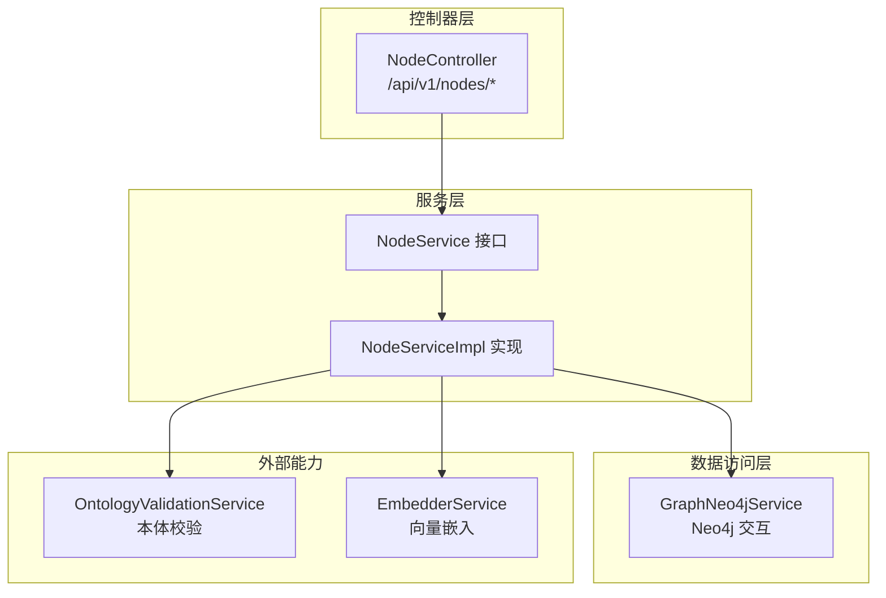
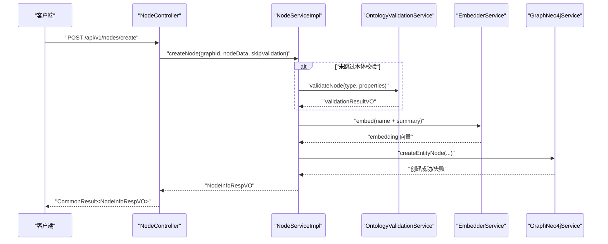
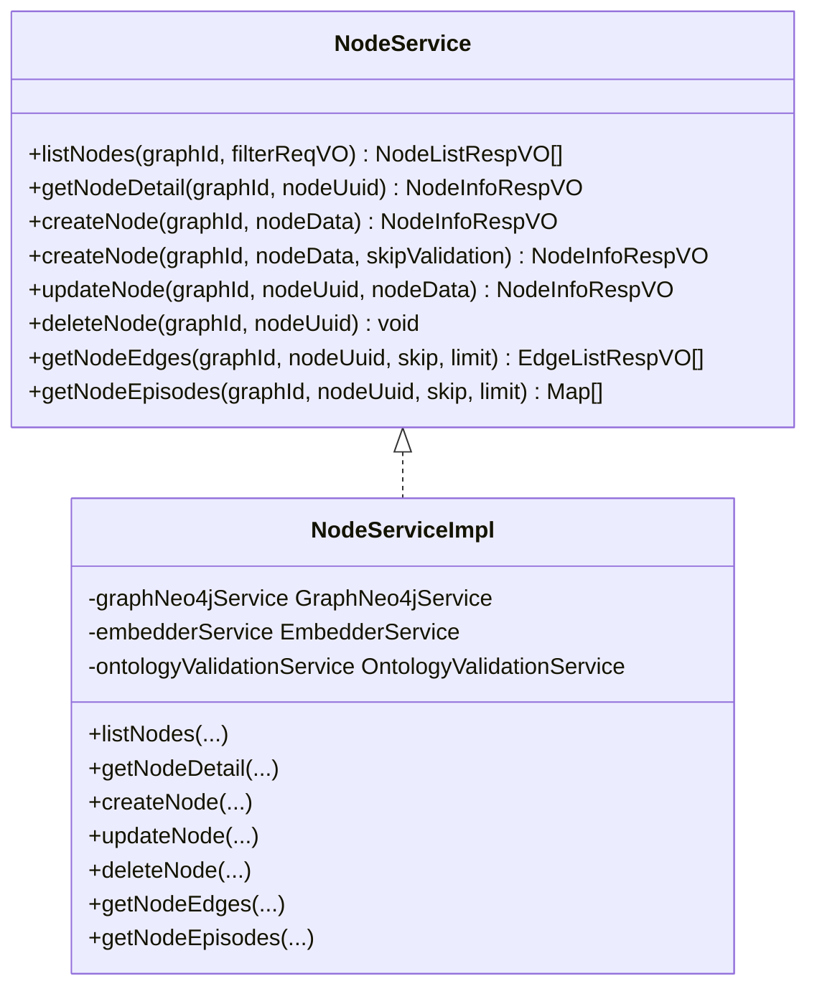
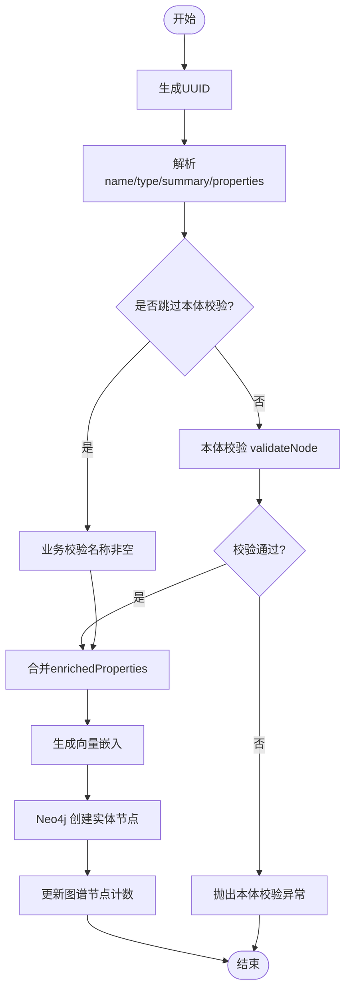
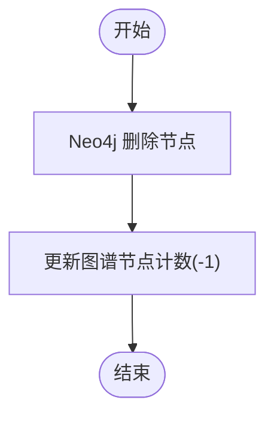
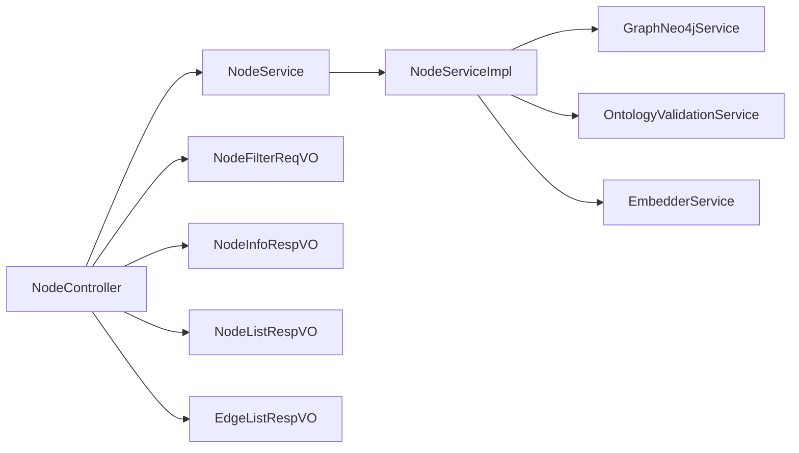

# 节点管理接口

<!--<cite>
**本文引用的文件**
- [NodeController.java](file://graphiti-module-core/src/main/java/com/graphiti/module/graphiti/controller/admin/NodeController.java)
- [NodeService.java](file://graphiti-module-core/src/main/java/com/graphiti/module/graphiti/service/NodeService.java)
- [NodeServiceImpl.java](file://graphiti-module-core/src/main/java/com/graphiti/module/graphiti/service/impl/NodeServiceImpl.java)
- [NodeFilterReqVO.java](file://graphiti-module-core/src/main/java/com/graphiti/module/graphiti/vo/node/NodeFilterReqVO.java)
- [NodeInfoRespVO.java](file://graphiti-module-core/src/main/java/com/graphiti/module/graphiti/vo/node/NodeInfoRespVO.java)
- [NodeListRespVO.java](file://graphiti-module-core/src/main/java/com/graphiti/module/graphiti/vo/node/NodeListRespVO.java)
- [EdgeListRespVO.java](file://graphiti-module-core/src/main/java/com/graphiti/module/graphiti/vo/edge/EdgeListRespVO.java)
</cite>-->

## 目录
1. [简介](#简介)
2. [项目结构](#项目结构)
3. [核心组件](#核心组件)
4. [架构总览](#架构总览)
5. [详细组件分析](#详细组件分析)
6. [依赖关系分析](#依赖关系分析)
7. [性能与查询优化](#性能与查询优化)
8. [故障排查指南](#故障排查指南)
9. [结论](#结论)
10. [附录：接口清单与示例](#附录接口清单与示例)

## 简介
本文件面向Graphiti-Java后端的“节点管理”REST API，覆盖节点的CRUD操作、过滤查询、分页、批量导入能力、节点属性与标签管理、以及节点关联边与Episode的查询接口。文档同时给出数据模型、错误处理机制、查询优化策略与最佳实践，并通过时序图与类图帮助理解端到端调用链路。

## 项目结构
- 控制器层：提供HTTP端点，负责参数解析、鉴权与返回统一响应包装。
- 服务层：封装业务逻辑，包括本体校验、向量嵌入、Neo4j交互、元数据更新等。
- VO层：定义请求与响应的数据结构，确保前后端契约清晰。
- 异常与响应：通过统一结果包装与业务异常进行错误处理。

图表来源
- [NodeController.java:23-142](file://graphiti-module-core/src/main/java/com/graphiti/module/graphiti/controller/admin/NodeController.java#L23-L142)
- [NodeService.java:13-78](file://graphiti-module-core/src/main/java/com/graphiti/module/graphiti/service/NodeService.java#L13-L78)
- [NodeServiceImpl.java:26-213](file://graphiti-module-core/src/main/java/com/graphiti/module/graphiti/service/impl/NodeServiceImpl.java#L26-L213)

章节来源
- [NodeController.java:23-142](file://graphiti-module-core/src/main/java/com/graphiti/module/graphiti/controller/admin/NodeController.java#L23-L142)
- [NodeService.java:13-78](file://graphiti-module-core/src/main/java/com/graphiti/module/graphiti/service/NodeService.java#L13-L78)
- [NodeServiceImpl.java:26-213](file://graphiti-module-core/src/main/java/com/graphiti/module/graphiti/service/impl/NodeServiceImpl.java#L26-L213)

## 核心组件
- NodeController：暴露节点管理REST端点，负责接收请求参数、调用服务层并返回统一响应。
- NodeService/NodeServiceImpl：定义并实现节点CRUD、过滤查询、关联边与Episode查询、本体校验与向量嵌入等逻辑。
- VO层：NodeFilterReqVO、NodeInfoRespVO、NodeListRespVO、EdgeListRespVO等，规范请求与响应结构。

章节来源
- [NodeController.java:23-142](file://graphiti-module-core/src/main/java/com/graphiti/module/graphiti/controller/admin/NodeController.java#L23-L142)
- [NodeService.java:13-78](file://graphiti-module-core/src/main/java/com/graphiti/module/graphiti/service/NodeService.java#L13-L78)
- [NodeFilterReqVO.java:10-32](file://graphiti-module-core/src/main/java/com/graphiti/module/graphiti/vo/node/NodeFilterReqVO.java#L10-L32)
- [NodeInfoRespVO.java:12-69](file://graphiti-module-core/src/main/java/com/graphiti/module/graphiti/vo/node/NodeInfoRespVO.java#L12-L69)
- [NodeListRespVO.java:12-59](file://graphiti-module-core/src/main/java/com/graphiti/module/graphiti/vo/node/NodeListRespVO.java#L12-L59)
- [EdgeListRespVO.java:12-69](file://graphiti-module-core/src/main/java/com/graphiti/module/graphiti/vo/edge/EdgeListRespVO.java#L12-L69)

## 架构总览
下图展示从客户端到服务层再到Neo4j的典型调用路径，以及本体校验与向量嵌入的集成点。

图表来源
- [NodeController.java:66-72](file://graphiti-module-core/src/main/java/com/graphiti/module/graphiti/controller/admin/NodeController.java#L66-L72)
- [NodeServiceImpl.java:64-111](file://graphiti-module-core/src/main/java/com/graphiti/module/graphiti/service/impl/NodeServiceImpl.java#L64-L111)

## 详细组件分析

### 控制器：NodeController
- 端点设计
  - GET /api/v1/nodes/list：按过滤条件与分页获取节点列表
  - GET /api/v1/nodes/{nodeUuid}：按UUID获取节点详情
  - POST /api/v1/nodes/create：创建节点（支持跳过本体校验）
  - PUT /api/v1/nodes/{nodeUuid}：更新节点（当前抛出待实现异常）
  - DELETE /api/v1/nodes/{nodeUuid}：删除节点
  - GET /api/v1/nodes/{nodeUuid}/edges：获取节点关联边（双向）
  - GET /api/v1/nodes/{nodeUuid}/episodes：获取节点关联Episode列表
- 鉴权与安全
  - 使用Bearer Token鉴权（Swagger注解声明）
- 统一响应
  - 返回CommonResult包装，便于前端统一处理

章节来源
- [NodeController.java:35-141](file://graphiti-module-core/src/main/java/com/graphiti/module/graphiti/controller/admin/NodeController.java#L35-L141)

### 服务层：NodeService/NodeServiceImpl
- 列表与详情
  - listNodes：基于skip/limit分页查询，转换为NodeListRespVO列表
  - getNodeDetail：查询单个节点，不存在则抛业务异常
- 创建节点
  - 支持跳过本体校验（skipValidation），默认不跳过
  - 本体校验通过后合并enrichedProperties
  - 校验节点名称非空
  - 基于name+summary生成向量嵌入
  - 在Neo4j中创建实体节点，更新图谱元数据计数
- 更新节点
  - 当前抛出业务异常提示功能待实现
- 删除节点
  - 删除节点及其关联边，更新图谱元数据计数
- 关联查询
  - getNodeEdges：查询节点关联边（双向），转换为EdgeListRespVO
  - getNodeEpisodes：查询节点关联Episode简要信息

图表来源
- [NodeService.java:13-78](file://graphiti-module-core/src/main/java/com/graphiti/module/graphiti/service/NodeService.java#L13-L78)
- [NodeServiceImpl.java:26-213](file://graphiti-module-core/src/main/java/com/graphiti/module/graphiti/service/impl/NodeServiceImpl.java#L26-L213)

章节来源
- [NodeService.java:13-78](file://graphiti-module-core/src/main/java/com/graphiti/module/graphiti/service/NodeService.java#L13-L78)
- [NodeServiceImpl.java:32-125](file://graphiti-module-core/src/main/java/com/graphiti/module/graphiti/service/impl/NodeServiceImpl.java#L32-L125)

### 数据模型与VO
- NodeFilterReqVO：过滤参数（name模糊匹配、type精确匹配、skip/limit分页）
- NodeListRespVO：节点列表项（uuid/name/type/label/groupId/createdAt/summary/attributes/properties）
- NodeInfoRespVO：节点详情（uuid/name/type/properties/summary/groupId/createdAt/validAt/invalidAt/labels/attributes）
- EdgeListRespVO：边列表项（uuid/source/target/type/properties/name/createdAt/validAt/invalidAt/expiredAt/episodes）

章节来源
- [NodeFilterReqVO.java:10-32](file://graphiti-module-core/src/main/java/com/graphiti/module/graphiti/vo/node/NodeFilterReqVO.java#L10-L32)
- [NodeListRespVO.java:12-59](file://graphiti-module-core/src/main/java/com/graphiti/module/graphiti/vo/node/NodeListRespVO.java#L12-L59)
- [NodeInfoRespVO.java:12-69](file://graphiti-module-core/src/main/java/com/graphiti/module/graphiti/vo/node/NodeInfoRespVO.java#L12-L69)
- [EdgeListRespVO.java:12-69](file://graphiti-module-core/src/main/java/com/graphiti/module/graphiti/vo/edge/EdgeListRespVO.java#L12-L69)

### 关键流程图

#### 创建节点流程

图表来源
- [NodeServiceImpl.java:64-111](file://graphiti-module-core/src/main/java/com/graphiti/module/graphiti/service/impl/NodeServiceImpl.java#L64-L111)

#### 删除节点流程

图表来源
- [NodeServiceImpl.java:120-125](file://graphiti-module-core/src/main/java/com/graphiti/module/graphiti/service/impl/NodeServiceImpl.java#L120-L125)

## 依赖关系分析
- 控制器依赖服务接口；服务实现依赖Neo4j服务、本体校验服务与嵌入服务。
- VO层作为跨层契约，避免控制器与服务直接耦合底层存储字段。
- 错误处理通过业务异常与统一响应包装，便于前端一致处理。

图表来源
- [NodeController.java:23-142](file://graphiti-module-core/src/main/java/com/graphiti/module/graphiti/controller/admin/NodeController.java#L23-L142)
- [NodeService.java:13-78](file://graphiti-module-core/src/main/java/com/graphiti/module/graphiti/service/NodeService.java#L13-L78)
- [NodeServiceImpl.java:26-213](file://graphiti-module-core/src/main/java/com/graphiti/module/graphiti/service/impl/NodeServiceImpl.java#L26-L213)

章节来源
- [NodeController.java:23-142](file://graphiti-module-core/src/main/java/com/graphiti/module/graphiti/controller/admin/NodeController.java#L23-L142)
- [NodeService.java:13-78](file://graphiti-module-core/src/main/java/com/graphiti/module/graphiti/service/NodeService.java#L13-L78)
- [NodeServiceImpl.java:26-213](file://graphiti-module-core/src/main/java/com/graphiti/module/graphiti/service/impl/NodeServiceImpl.java#L26-L213)

## 性能与查询优化
- 分页与限制
  - 列表查询默认limit=20，建议前端传入合理skip/limit以控制单页大小
- 本体校验与嵌入
  - 仅在需要时执行本体校验；批量导入可考虑skipValidation以提升吞吐
  - 向量嵌入按name+summary拼接文本，建议保持summary简洁以减少嵌入成本
- Neo4j查询
  - 关联边与Episode查询支持skip/limit，建议结合索引与标签优化Cypher查询
- 元数据更新
  - 创建/删除节点会更新图谱节点计数，建议在高并发场景下采用幂等写法或异步更新

[本节为通用性能建议，无需特定文件引用]

## 故障排查指南
- 常见错误与定位
  - 节点不存在：getNodeDetail在未找到节点时抛业务异常（错误码参考业务异常定义）
  - 节点名称为空：创建节点时若name为空，抛业务异常
  - 本体校验失败：validateNode返回失败时抛本体校验异常
  - 功能未实现：更新节点当前抛出业务异常提示
- 建议排查步骤
  - 检查graphId与nodeUuid是否正确
  - 核对请求体中name/type/properties是否符合预期
  - 若启用skipValidation，请确认批量导入场景下的数据质量
  - 查看服务日志中关于本体校验与嵌入生成的输出

章节来源
- [NodeServiceImpl.java:50-56](file://graphiti-module-core/src/main/java/com/graphiti/module/graphiti/service/impl/NodeServiceImpl.java#L50-L56)
- [NodeServiceImpl.java:90-92](file://graphiti-module-core/src/main/java/com/graphiti/module/graphiti/service/impl/NodeServiceImpl.java#L90-L92)
- [NodeServiceImpl.java:78-80](file://graphiti-module-core/src/main/java/com/graphiti/module/graphiti/service/impl/NodeServiceImpl.java#L78-L80)
- [NodeServiceImpl.java:114-117](file://graphiti-module-core/src/main/java/com/graphiti/module/graphiti/service/impl/NodeServiceImpl.java#L114-L117)

## 结论
节点管理接口提供了完整的CRUD能力与关联查询扩展，结合本体校验与向量嵌入，满足知识图谱高质量建模需求。建议在生产环境配合合理的分页策略、索引与缓存，持续监控本体校验与嵌入性能，确保系统稳定高效运行。

[本节为总结性内容，无需特定文件引用]

## 附录：接口清单与示例

### 统一响应与鉴权
- 统一响应：所有接口返回统一包装对象，包含状态码、消息与数据体
- 鉴权方式：Bearer Token（在Swagger中声明）

章节来源
- [NodeController.java:35-37](file://graphiti-module-core/src/main/java/com/graphiti/module/graphiti/controller/admin/NodeController.java#L35-L37)

### 节点列表查询
- 方法与路径：GET /api/v1/nodes/list
- 请求参数
  - graphId：图谱ID（必填）
  - filterReqVO：过滤条件（NodeFilterReqVO）
    - name：节点名称（模糊匹配）
    - type：节点类型（精确匹配）
    - skip：跳过数量（默认0）
    - limit：限制数量（默认20）
- 响应：CommonResult<List<NodeListRespVO>>
- 示例
  - GET /api/v1/nodes/list?graphId=graph-123&name=张三&type=Person&skip=0&limit=20

章节来源
- [NodeController.java:37-42](file://graphiti-module-core/src/main/java/com/graphiti/module/graphiti/controller/admin/NodeController.java#L37-L42)
- [NodeFilterReqVO.java:16-31](file://graphiti-module-core/src/main/java/com/graphiti/module/graphiti/vo/node/NodeFilterReqVO.java#L16-L31)
- [NodeListRespVO.java:18-58](file://graphiti-module-core/src/main/java/com/graphiti/module/graphiti/vo/node/NodeListRespVO.java#L18-L58)

### 节点详情查询
- 方法与路径：GET /api/v1/nodes/{nodeUuid}
- 请求参数
  - graphId：图谱ID（必填）
  - nodeUuid：节点UUID（路径参数）
- 响应：CommonResult<NodeInfoRespVO>
- 示例
  - GET /api/v1/nodes/node-abc?graphId=graph-123

章节来源
- [NodeController.java:51-56](file://graphiti-module-core/src/main/java/com/graphiti/module/graphiti/controller/admin/NodeController.java#L51-L56)
- [NodeInfoRespVO.java:18-68](file://graphiti-module-core/src/main/java/com/graphiti/module/graphiti/vo/node/NodeInfoRespVO.java#L18-L68)

### 节点创建
- 方法与路径：POST /api/v1/nodes/create
- 请求参数
  - graphId：图谱ID（必填）
  - nodeData：节点数据（JSON）
    - name：节点名称（必填）
    - type：节点类型（可选，默认Entity）
    - summary：节点摘要（可选）
    - properties：自定义属性（可选）
  - skipValidation：是否跳过本体校验（可选，默认false）
- 响应：CommonResult<NodeInfoRespVO>
- 示例
  - POST /api/v1/nodes/create?graphId=graph-123&skipValidation=false
  - 请求体示例（字段名与含义参见NodeInfoRespVO）
    - name: "张三"
    - type: "Person"
    - summary: "某公司技术负责人"
    - properties: { "age": 30, "city": "北京" }

章节来源
- [NodeController.java:66-72](file://graphiti-module-core/src/main/java/com/graphiti/module/graphiti/controller/admin/NodeController.java#L66-L72)
- [NodeServiceImpl.java:64-111](file://graphiti-module-core/src/main/java/com/graphiti/module/graphiti/service/impl/NodeServiceImpl.java#L64-L111)
- [NodeInfoRespVO.java:18-68](file://graphiti-module-core/src/main/java/com/graphiti/module/graphiti/vo/node/NodeInfoRespVO.java#L18-L68)

### 节点更新（待实现）
- 方法与路径：PUT /api/v1/nodes/{nodeUuid}
- 当前行为：抛出业务异常提示功能待实现
- 建议：后续实现时遵循现有DTO与校验策略

章节来源
- [NodeController.java:82-88](file://graphiti-module-core/src/main/java/com/graphiti/module/graphiti/controller/admin/NodeController.java#L82-L88)
- [NodeServiceImpl.java:114-117](file://graphiti-module-core/src/main/java/com/graphiti/module/graphiti/service/impl/NodeServiceImpl.java#L114-L117)

### 节点删除
- 方法与路径：DELETE /api/v1/nodes/{nodeUuid}
- 请求参数
  - graphId：图谱ID（必填）
  - nodeUuid：节点UUID（路径参数）
- 响应：CommonResult<Void>
- 示例
  - DELETE /api/v1/nodes/node-abc?graphId=graph-123

章节来源
- [NodeController.java:97-103](file://graphiti-module-core/src/main/java/com/graphiti/module/graphiti/controller/admin/NodeController.java#L97-L103)
- [NodeServiceImpl.java:120-125](file://graphiti-module-core/src/main/java/com/graphiti/module/graphiti/service/impl/NodeServiceImpl.java#L120-L125)

### 节点关联边查询
- 方法与路径：GET /api/v1/nodes/{nodeUuid}/edges
- 请求参数
  - graphId：图谱ID（必填）
  - nodeUuid：节点UUID（路径参数）
  - skip：跳过数量（默认0）
  - limit：限制数量（默认20）
- 响应：CommonResult<List<EdgeListRespVO>>
- 示例
  - GET /api/v1/nodes/node-abc/edges?graphId=graph-123&skip=0&limit=20

章节来源
- [NodeController.java:115-122](file://graphiti-module-core/src/main/java/com/graphiti/module/graphiti/controller/admin/NodeController.java#L115-L122)
- [EdgeListRespVO.java:18-68](file://graphiti-module-core/src/main/java/com/graphiti/module/graphiti/vo/edge/EdgeListRespVO.java#L18-L68)

### 节点关联Episode查询
- 方法与路径：GET /api/v1/nodes/{nodeUuid}/episodes
- 请求参数
  - graphId：图谱ID（必填）
  - nodeUuid：节点UUID（路径参数）
  - skip：跳过数量（默认0）
  - limit：限制数量（默认20）
- 响应：CommonResult<List<Map<String,Object>>>
- 示例
  - GET /api/v1/nodes/node-abc/episodes?graphId=graph-123&skip=0&limit=20

章节来源
- [NodeController.java:134-141](file://graphiti-module-core/src/main/java/com/graphiti/module/graphiti/controller/admin/NodeController.java#L134-L141)

### 最佳实践建议
- 批量导入
  - 使用skipValidation=true以提升吞吐，但需保证数据质量与一致性
- 查询优化
  - 合理设置skip/limit，避免超大分页
  - 对常用过滤字段建立索引，减少全表扫描
- 本体与属性
  - 优先启用本体校验，确保类型与属性约束一致
  - 属性命名遵循统一规范，避免冗余字段
- 安全与鉴权
  - 严格使用Bearer Token，避免泄露
  - 对敏感操作增加审计日志

[本节为通用最佳实践，无需特定文件引用]