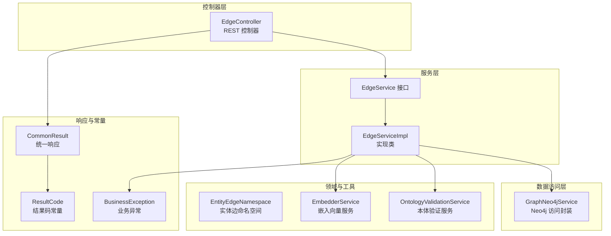
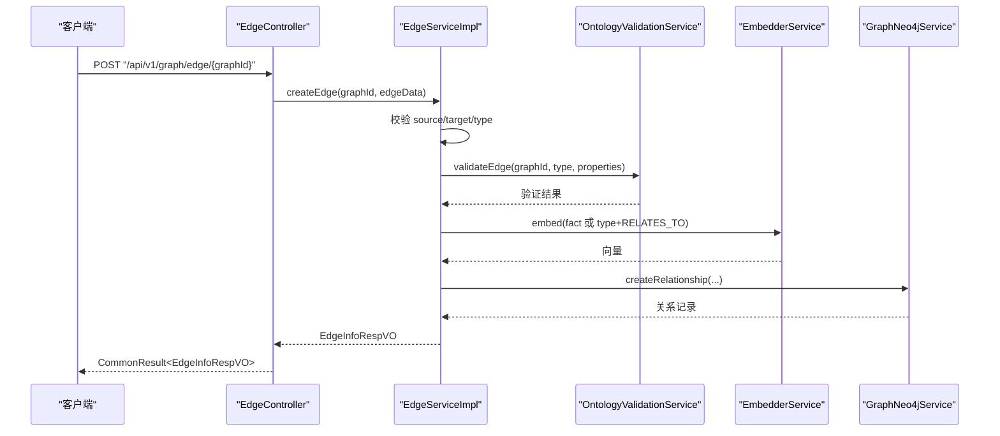
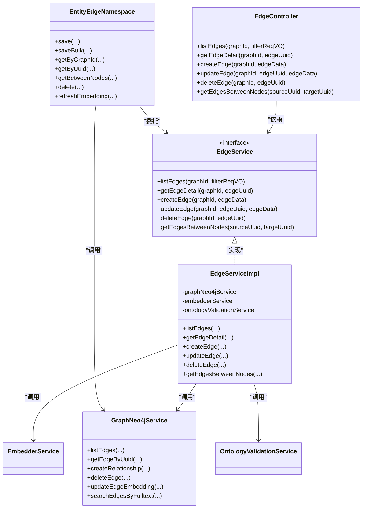

# 边管理接口

<!--<cite>
**本文引用的文件**
- [EdgeController.java](file://graphiti-module-core/src/main/java/com/graphiti/module/graphiti/controller/admin/EdgeController.java)
- [EdgeService.java](file://graphiti-module-core/src/main/java/com/graphiti/module/graphiti/service/EdgeService.java)
- [EdgeServiceImpl.java](file://graphiti-module-core/src/main/java/com/graphiti/module/graphiti/service/impl/EdgeServiceImpl.java)
- [GraphNeo4jService.java](file://graphiti-module-core/src/main/java/com/graphiti/module/graphiti/service/GraphNeo4jService.java)
- [EdgeFilterReqVO.java](file://graphiti-module-core/src/main/java/com/graphiti/module/graphiti/vo/edge/EdgeFilterReqVO.java)
- [EdgeInfoRespVO.java](file://graphiti-module-core/src/main/java/com/graphiti/module/graphiti/vo/edge/EdgeInfoRespVO.java)
- [EdgeListRespVO.java](file://graphiti-module-core/src/main/java/com/graphiti/module/graphiti/vo/edge/EdgeListRespVO.java)
- [EntityEdgeNamespace.java](file://graphiti-module-core/src/main/java/com/graphiti/module/graphiti/namespace/edge/EntityEdgeNamespace.java)
- [CommonResult.java](file://graphiti-framework/graphiti-common/src/main/java/com/graphiti/common/response/CommonResult.java)
- [ResultCode.java](file://graphiti-framework/graphiti-common/src/main/java/com/graphiti/common/constants/ResultCode.java)
- [BusinessException.java](file://graphiti-framework/graphiti-common/src/main/java/com/graphiti/common/exception/BusinessException.java)
- [EmbedderService.java](file://graphiti-module-core/src/main/java/com/graphiti/module/graphiti/service/EmbedderService.java)
- [OntologyValidationService.java](file://graphiti-module-core/src/main/java/com/graphiti/module/graphiti/service/OntologyValidationService.java)
</cite>-->

## 目录
1. [简介](#简介)
2. [项目结构](#项目结构)
3. [核心组件](#核心组件)
4. [架构总览](#架构总览)
5. [详细组件分析](#详细组件分析)
6. [依赖分析](#依赖分析)
7. [性能考虑](#性能考虑)
8. [故障排查指南](#故障排查指南)
9. [结论](#结论)
10. [附录](#附录)

## 简介
本文件为 ontograph-java 的“边管理接口”提供完整、系统的 API 文档，覆盖边的 CRUD 操作、过滤查询、关系类型与权重（嵌入向量）管理、方向性处理、属性配置、关系验证等高级功能，并给出数据模型、查询优化策略、使用示例与性能调优建议。

## 项目结构
边管理相关代码采用典型的分层架构：
- 控制器层：对外暴露 REST API，负责参数接收与响应封装
- 服务层：实现业务逻辑，协调嵌入向量与本体验证
- 数据访问层：通过 GraphNeo4jService 封装 Neo4j 访问
- VO/DTO 层：定义请求与响应的数据结构
- 命名空间层：提供领域化的便捷入口（如实体边命名空间）

图表来源
- [EdgeController.java:23-90](file://graphiti-module-core/src/main/java/com/graphiti/module/graphiti/controller/admin/EdgeController.java#L23-L90)
- [EdgeService.java:12-60](file://graphiti-module-core/src/main/java/com/graphiti/module/graphiti/service/EdgeService.java#L12-L60)
- [EdgeServiceImpl.java:25-171](file://graphiti-module-core/src/main/java/com/graphiti/module/graphiti/service/impl/EdgeServiceImpl.java#L25-L171)
- [GraphNeo4jService.java:21-1346](file://graphiti-module-core/src/main/java/com/graphiti/module/graphiti/service/GraphNeo4jService.java#L21-L1346)
- [EntityEdgeNamespace.java:22-87](file://graphiti-module-core/src/main/java/com/graphiti/module/graphiti/namespace/edge/EntityEdgeNamespace.java#L22-L87)
- [CommonResult.java:14-67](file://graphiti-framework/graphiti-common/src/main/java/com/graphiti/common/response/CommonResult.java#L14-L67)
- [ResultCode.java:7-22](file://graphiti-framework/graphiti-common/src/main/java/com/graphiti/common/constants/ResultCode.java#L7-L22)
- [BusinessException.java:10-32](file://graphiti-framework/graphiti-common/src/main/java/com/graphiti/common/exception/BusinessException.java#L10-L32)

章节来源
- [EdgeController.java:23-90](file://graphiti-module-core/src/main/java/com/graphiti/module/graphiti/controller/admin/EdgeController.java#L23-L90)
- [EdgeService.java:12-60](file://graphiti-module-core/src/main/java/com/graphiti/module/graphiti/service/EdgeService.java#L12-L60)
- [EdgeServiceImpl.java:25-171](file://graphiti-module-core/src/main/java/com/graphiti/module/graphiti/service/impl/EdgeServiceImpl.java#L25-L171)
- [GraphNeo4jService.java:21-1346](file://graphiti-module-core/src/main/java/com/graphiti/module/graphiti/service/GraphNeo4jService.java#L21-L1346)
- [EntityEdgeNamespace.java:22-87](file://graphiti-module-core/src/main/java/com/graphiti/module/graphiti/namespace/edge/EntityEdgeNamespace.java#L22-L87)
- [CommonResult.java:14-67](file://graphiti-framework/graphiti-common/src/main/java/com/graphiti/common/response/CommonResult.java#L14-L67)
- [ResultCode.java:7-22](file://graphiti-framework/graphiti-common/src/main/java/com/graphiti/common/constants/ResultCode.java#L7-L22)
- [BusinessException.java:10-32](file://graphiti-framework/graphiti-common/src/main/java/com/graphiti/common/exception/BusinessException.java#L10-L32)

## 核心组件
- 边控制器：提供边的 CRUD 与跨节点查询接口，统一返回 CommonResult
- 边服务：实现边的创建、查询、删除；集成本体验证与嵌入向量生成
- Neo4j 访问：封装 Cypher 查询、创建/删除关系、全文检索等
- 命名空间：提供实体边的便捷操作（保存、批量保存、刷新嵌入等）
- 统一响应与异常：规范返回结构与错误码

章节来源
- [EdgeController.java:23-90](file://graphiti-module-core/src/main/java/com/graphiti/module/graphiti/controller/admin/EdgeController.java#L23-L90)
- [EdgeService.java:12-60](file://graphiti-module-core/src/main/java/com/graphiti/module/graphiti/service/EdgeService.java#L12-L60)
- [EdgeServiceImpl.java:25-171](file://graphiti-module-core/src/main/java/com/graphiti/module/graphiti/service/impl/EdgeServiceImpl.java#L25-L171)
- [GraphNeo4jService.java:247-333](file://graphiti-module-core/src/main/java/com/graphiti/module/graphiti/service/GraphNeo4jService.java#L247-L333)
- [EntityEdgeNamespace.java:22-87](file://graphiti-module-core/src/main/java/com/graphiti/module/graphiti/namespace/edge/EntityEdgeNamespace.java#L22-L87)
- [CommonResult.java:14-67](file://graphiti-framework/graphiti-common/src/main/java/com/graphiti/common/response/CommonResult.java#L14-L67)

## 架构总览
边管理接口遵循“控制器-服务-数据访问”的分层设计，边的创建流程包含本体验证与嵌入向量生成，查询与删除通过 GraphNeo4jService 的 Cypher 实现。

图表来源
- [EdgeController.java:53-60](file://graphiti-module-core/src/main/java/com/graphiti/module/graphiti/controller/admin/EdgeController.java#L53-L60)
- [EdgeServiceImpl.java:61-102](file://graphiti-module-core/src/main/java/com/graphiti/module/graphiti/service/impl/EdgeServiceImpl.java#L61-L102)
- [GraphNeo4jService.java:93-174](file://graphiti-module-core/src/main/java/com/graphiti/module/graphiti/service/GraphNeo4jService.java#L93-L174)
- [EmbedderService.java:16-25](file://graphiti-module-core/src/main/java/com/graphiti/module/graphiti/service/EmbedderService.java#L16-L25)
- [OntologyValidationService.java:26-28](file://graphiti-module-core/src/main/java/com/graphiti/module/graphiti/service/OntologyValidationService.java#L26-L28)

## 详细组件分析

### 控制器：边管理接口
- 路径前缀：/api/v1/graph/edge
- 认证：均需 Bearer Token（Swagger 注解声明）
- 主要端点：
  - GET /{graphId}/{edgeUuid}：获取边详情
  - POST /list/{graphId}：按过滤条件分页查询边列表
  - POST /{graphId}：创建边
  - PUT /{graphId}/{edgeUuid}：更新边（当前抛出待实现异常）
  - DELETE /{graphId}/{edgeUuid}：删除边
  - GET /between/{sourceUuid}/{targetUuid}：查询两节点间的所有边（双向）

请求与响应要点：
- 请求体为 JSON，PUT/POST 创建边时传入 Map<String,Object>
- 响应统一包装为 CommonResult<T>
- 分页参数通过 EdgeFilterReqVO 的 skip/limit 控制

章节来源
- [EdgeController.java:33-90](file://graphiti-module-core/src/main/java/com/graphiti/module/graphiti/controller/admin/EdgeController.java#L33-L90)
- [EdgeFilterReqVO.java:10-37](file://graphiti-module-core/src/main/java/com/graphiti/module/graphiti/vo/edge/EdgeFilterReqVO.java#L10-L37)
- [CommonResult.java:14-67](file://graphiti-framework/graphiti-common/src/main/java/com/graphiti/common/response/CommonResult.java#L14-L67)

### 服务层：边业务逻辑
- listEdges：调用 GraphNeo4jService 的 listEdges，支持 type/source/target 过滤与 skip/limit 分页
- getEdgeDetail：按 UUID 查询并转换为 EdgeInfoRespVO
- createEdge：校验必要字段，执行本体验证，生成嵌入向量，创建关系并返回 EdgeInfoRespVO
- updateEdge：当前抛出业务异常提示功能未实现
- deleteEdge：委托 GraphNeo4jService 删除关系
- getEdgesBetweenNodes：查询两节点间的所有边（双向）

数据转换：
- convertToEdgeListRespVO / convertToEdgeInfoRespVO：从数据库映射到 VO，剔除系统字段（如 uuid、source、target、type、group_id），保留用户属性

章节来源
- [EdgeService.java:18-59](file://graphiti-module-core/src/main/java/com/graphiti/module/graphiti/service/EdgeService.java#L18-L59)
- [EdgeServiceImpl.java:32-124](file://graphiti-module-core/src/main/java/com/graphiti/module/graphiti/service/impl/EdgeServiceImpl.java#L32-L124)
- [EdgeInfoRespVO.java:12-69](file://graphiti-module-core/src/main/java/com/graphiti/module/graphiti/vo/edge/EdgeInfoRespVO.java#L12-L69)
- [EdgeListRespVO.java:12-69](file://graphiti-module-core/src/main/java/com/graphiti/module/graphiti/vo/edge/EdgeListRespVO.java#L12-L69)

### 数据访问层：Neo4j 访问
- listEdges：构建 WHERE 条件（type/source/target），返回关系及其两端节点 UUID
- getEdgeByUuid：按 UUID 查询关系及其端点
- createRelationship：支持自定义关系类型或默认 RELATES_TO，写入 uuid、type、fact、embedding、valid_at、invalid_at 等字段
- deleteEdge：按 UUID 删除关系
- updateEdgeEmbedding：更新关系的 embedding 字段
- 全文检索：searchEdgesByFulltext（需预先创建全文索引）

章节来源
- [GraphNeo4jService.java:247-333](file://graphiti-module-core/src/main/java/com/graphiti/module/graphiti/service/GraphNeo4jService.java#L247-L333)
- [GraphNeo4jService.java:93-174](file://graphiti-module-core/src/main/java/com/graphiti/module/graphiti/service/GraphNeo4jService.java#L93-L174)
- [GraphNeo4jService.java:617-645](file://graphiti-module-core/src/main/java/com/graphiti/module/graphiti/service/GraphNeo4jService.java#L617-L645)

### 命名空间：实体边便捷入口
- save/saveBulk：保存单条或多条实体边（自动触发嵌入生成）
- getByGraphId/getByUuid/getBetweenNodes/delete：按图谱、UUID、节点对查询或删除
- refreshEmbedding：根据当前边的 type 与 properties 重新生成 embedding 并更新

章节来源
- [EntityEdgeNamespace.java:31-86](file://graphiti-module-core/src/main/java/com/graphiti/module/graphiti/namespace/edge/EntityEdgeNamespace.java#L31-L86)

### 数据模型与字段说明
- EdgeFilterReqVO：type、source、target、skip、limit
- EdgeListRespVO：uuid、source、target、type、properties、name、createdAt、validAt、invalidAt、expiredAt、episodes
- EdgeInfoRespVO：与列表响应类似，但包含更丰富的元信息（如 name、episodes 等）

章节来源
- [EdgeFilterReqVO.java:10-37](file://graphiti-module-core/src/main/java/com/graphiti/module/graphiti/vo/edge/EdgeFilterReqVO.java#L10-L37)
- [EdgeListRespVO.java:12-69](file://graphiti-module-core/src/main/java/com/graphiti/module/graphiti/vo/edge/EdgeListRespVO.java#L12-L69)
- [EdgeInfoRespVO.java:12-69](file://graphiti-module-core/src/main/java/com/graphiti/module/graphiti/vo/edge/EdgeInfoRespVO.java#L12-L69)

### API 端点定义与参数

- 获取边列表
  - 方法：POST
  - 路径：/api/v1/graph/edge/list/{graphId}
  - 路径参数：graphId（图谱ID，必填）
  - 请求体：EdgeFilterReqVO（可选）
  - 响应：CommonResult<List<EdgeListRespVO>>
  - 过滤字段：type、source、target、skip、limit

- 获取边详情
  - 方法：GET
  - 路径：/api/v1/graph/edge/{graphId}/{edgeUuid}
  - 路径参数：graphId、edgeUuid（必填）
  - 响应：CommonResult<EdgeInfoRespVO>

- 创建边
  - 方法：POST
  - 路径：/api/v1/graph/edge/{graphId}
  - 路径参数：graphId（必填）
  - 请求体：Map<String,Object>，必需字段包括 source、target、type；可选字段包括 fact、properties
  - 响应：CommonResult<EdgeInfoRespVO>

- 更新边
  - 方法：PUT
  - 路径：/api/v1/graph/edge/{graphId}/{edgeUuid}
  - 路径参数：graphId、edgeUuid（必填）
  - 请求体：Map<String,Object>（当前实现抛出业务异常，提示功能待实现）
  - 响应：CommonResult<EdgeInfoRespVO>

- 删除边
  - 方法：DELETE
  - 路径：/api/v1/graph/edge/{graphId}/{edgeUuid}
  - 路径参数：graphId、edgeUuid（必填）
  - 响应：CommonResult<Boolean>

- 查询两节点间边（双向）
  - 方法：GET
  - 路径：/api/v1/graph/edge/between/{sourceUuid}/{targetUuid}
  - 路径参数：sourceUuid、targetUuid（必填）
  - 响应：CommonResult<List<EdgeListRespVO>>

章节来源
- [EdgeController.java:33-90](file://graphiti-module-core/src/main/java/com/graphiti/module/graphiti/controller/admin/EdgeController.java#L33-L90)
- [EdgeFilterReqVO.java:10-37](file://graphiti-module-core/src/main/java/com/graphiti/module/graphiti/vo/edge/EdgeFilterReqVO.java#L10-L37)

### 高级功能与行为说明

- 关系类型管理
  - 支持自定义关系类型（RELATES_TO 或其他），创建时可指定 Neo4j 关系类型与业务 type
  - 默认关系类型为 RELATES_TO，若未提供则使用默认值

- 方向性处理
  - 当前查询与创建均以“从源节点指向目标节点”的方向进行
  - 查询两节点间边时返回双向关系（由底层查询逻辑决定）

- 权重设置（嵌入向量）
  - 创建边时根据 fact 或 type+RELATES_TO 生成 embedding
  - 可通过命名空间 refreshEmbedding 重新计算并更新

- 属性配置
  - properties 字段作为通用属性容器，创建时直接写入关系
  - 查询时剔除系统字段，仅返回用户属性

- 关系验证
  - 若图谱已定义本体，则创建边前进行 validateEdge 校验
  - 本体验证失败将抛出业务异常

- 全文检索
  - 提供 searchEdgesByFulltext（需预先创建全文索引）
  - 支持按 fact 字段进行全文检索并返回评分

章节来源
- [GraphNeo4jService.java:93-174](file://graphiti-module-core/src/main/java/com/graphiti/module/graphiti/service/GraphNeo4jService.java#L93-L174)
- [EdgeServiceImpl.java:82-87](file://graphiti-module-core/src/main/java/com/graphiti/module/graphiti/service/impl/EdgeServiceImpl.java#L82-L87)
- [EntityEdgeNamespace.java:80-86](file://graphiti-module-core/src/main/java/com/graphiti/module/graphiti/namespace/edge/EntityEdgeNamespace.java#L80-L86)
- [GraphNeo4jService.java:617-645](file://graphiti-module-core/src/main/java/com/graphiti/module/graphiti/service/GraphNeo4jService.java#L617-L645)

### 错误处理机制
- 统一响应：CommonResult，包含 code、message、data、timestamp
- 结果码：SUCCESS=200，4xx/5xx/1xxx 业务错误码
- 业务异常：BusinessException，携带业务错误码与消息
- 常见错误场景：
  - 边不存在：EDGE_NOT_FOUND（1004）
  - 参数无效：INVALID_PARAMETER（1006）
  - 更新功能未实现：INTERNAL_SERVER_ERROR（500）
  - 本体验证失败：由 OntologyValidationService 抛出异常

章节来源
- [CommonResult.java:14-67](file://graphiti-framework/graphiti-common/src/main/java/com/graphiti/common/response/CommonResult.java#L14-L67)
- [ResultCode.java:7-22](file://graphiti-framework/graphiti-common/src/main/java/com/graphiti/common/constants/ResultCode.java#L7-L22)
- [BusinessException.java:10-32](file://graphiti-framework/graphiti-common/src/main/java/com/graphiti/common/exception/BusinessException.java#L10-L32)
- [EdgeServiceImpl.java:54-57](file://graphiti-module-core/src/main/java/com/graphiti/module/graphiti/service/impl/EdgeServiceImpl.java#L54-L57)
- [EdgeServiceImpl.java:107](file://graphiti-module-core/src/main/java/com/graphiti/module/graphiti/service/impl/EdgeServiceImpl.java#L107)

## 依赖分析

图表来源
- [EdgeController.java:28-90](file://graphiti-module-core/src/main/java/com/graphiti/module/graphiti/controller/admin/EdgeController.java#L28-L90)
- [EdgeService.java:12-60](file://graphiti-module-core/src/main/java/com/graphiti/module/graphiti/service/EdgeService.java#L12-L60)
- [EdgeServiceImpl.java:25-171](file://graphiti-module-core/src/main/java/com/graphiti/module/graphiti/service/impl/EdgeServiceImpl.java#L25-L171)
- [GraphNeo4jService.java:21-1346](file://graphiti-module-core/src/main/java/com/graphiti/module/graphiti/service/GraphNeo4jService.java#L21-L1346)
- [EntityEdgeNamespace.java:22-87](file://graphiti-module-core/src/main/java/com/graphiti/module/graphiti/namespace/edge/EntityEdgeNamespace.java#L22-L87)

## 性能考虑
- 分页与过滤
  - 使用 skip/limit 控制查询规模，避免一次性返回大量边
  - 在高并发场景下，建议结合索引与缓存策略
- 嵌入向量
  - 批量生成嵌入时优先使用 embed(List<String>)，减少调用次数
  - 对频繁刷新的边，可引入增量更新策略
- 查询优化
  - 为关系的 type、fact 等常用过滤字段建立索引（如全文索引）
  - 避免在大图上进行全表扫描，尽量带上过滤条件
- 缓存与降级
  - 对热点边详情与列表结果进行短期缓存
  - 在嵌入服务不可用时，允许降级返回非向量化数据

## 故障排查指南
- 常见错误码
  - 1004：边不存在
  - 1006：参数无效
  - 500：内部错误（如更新功能未实现）
- 排查步骤
  - 确认 graphId 与 edgeUuid 是否正确
  - 检查请求体是否包含 source、target、type
  - 若启用本体验证，确认 type 与属性满足本体约束
  - 检查嵌入服务可用性与维度配置
- 日志定位
  - 服务层日志包含删除边的操作记录
  - 命名空间层提供 refreshEmbedding 的调试日志

章节来源
- [ResultCode.java:15-22](file://graphiti-framework/graphiti-common/src/main/java/com/graphiti/common/constants/ResultCode.java#L15-L22)
- [EdgeServiceImpl.java:113](file://graphiti-module-core/src/main/java/com/graphiti/module/graphiti/service/impl/EdgeServiceImpl.java#L113)
- [EntityEdgeNamespace.java:80-86](file://graphiti-module-core/src/main/java/com/graphiti/module/graphiti/namespace/edge/EntityEdgeNamespace.java#L80-L86)

## 结论
ontograph-java 的边管理接口提供了完善的 CRUD、过滤与查询能力，并通过本体验证与嵌入向量增强了语义表达与检索效率。当前更新接口处于待实现状态，建议尽快补齐以完善生命周期管理。通过合理的索引、缓存与批处理策略，可在大规模图谱上获得稳定性能表现。

## 附录

### 使用示例（路径指引）
- 创建边
  - 请求：POST /api/v1/graph/edge/{graphId}
  - 请求体字段参考：source、target、type、fact、properties
  - 响应：EdgeInfoRespVO
  - 参考实现：[EdgeController.java:56-60](file://graphiti-module-core/src/main/java/com/graphiti/module/graphiti/controller/admin/EdgeController.java#L56-L60)，[EdgeServiceImpl.java:61-102](file://graphiti-module-core/src/main/java/com/graphiti/module/graphiti/service/impl/EdgeServiceImpl.java#L61-L102)
- 查询边列表
  - 请求：POST /api/v1/graph/edge/list/{graphId}
  - 请求体：EdgeFilterReqVO（type、source、target、skip、limit）
  - 响应：List<EdgeListRespVO>
  - 参考实现：[EdgeController.java:36-42](file://graphiti-module-core/src/main/java/com/graphiti/module/graphiti/controller/admin/EdgeController.java#L36-L42)，[GraphNeo4jService.java:247-292](file://graphiti-module-core/src/main/java/com/graphiti/module/graphiti/service/GraphNeo4jService.java#L247-L292)
- 查询两节点间边
  - 请求：GET /api/v1/graph/edge/between/{sourceUuid}/{targetUuid}
  - 响应：List<EdgeListRespVO>
  - 参考实现：[EdgeController.java:85-89](file://graphiti-module-core/src/main/java/com/graphiti/module/graphiti/controller/admin/EdgeController.java#L85-L89)，[GraphNeo4jService.java:247-292](file://graphiti-module-core/src/main/java/com/graphiti/module/graphiti/service/GraphNeo4jService.java#L247-L292)
- 删除边
  - 请求：DELETE /api/v1/graph/edge/{graphId}/{edgeUuid}
  - 响应：true
  - 参考实现：[EdgeController.java:77-80](file://graphiti-module-core/src/main/java/com/graphiti/module/graphiti/controller/admin/EdgeController.java#L77-L80)，[GraphNeo4jService.java:324-333](file://graphiti-module-core/src/main/java/com/graphiti/module/graphiti/service/GraphNeo4jService.java#L324-L333)

### 关系网络查询优化策略
- 建议
  - 为关系的 type、fact 建立索引，提升过滤与全文检索性能
  - 使用分页 skip/limit 控制单次查询规模
  - 对热点边进行缓存，降低重复查询开销
  - 批量处理嵌入生成，减少外部服务调用次数