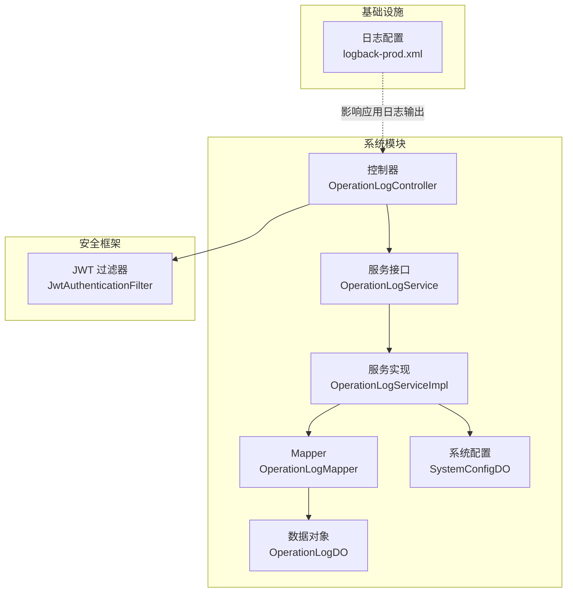
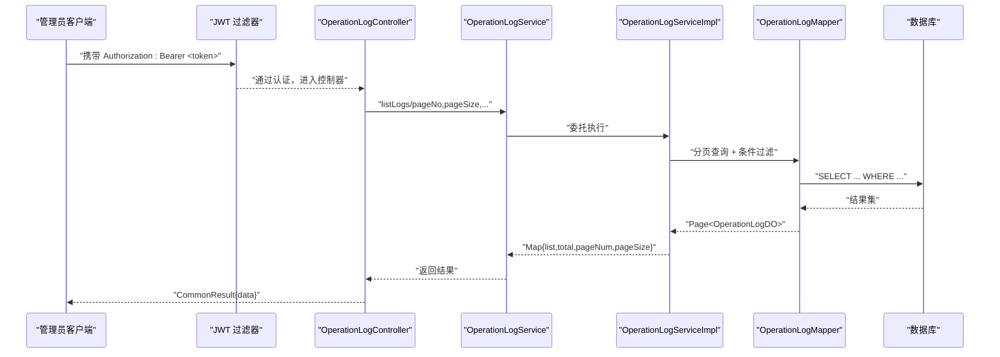
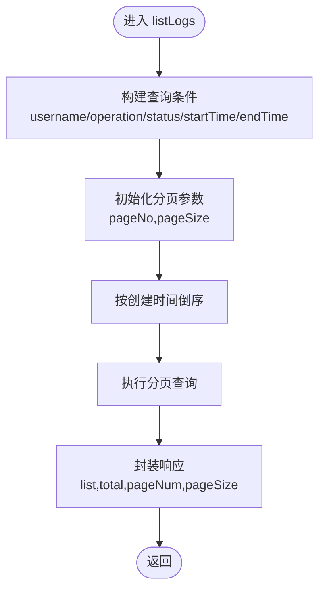
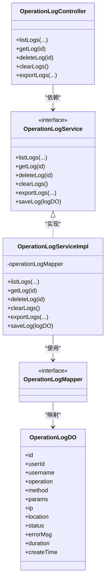

# 操作日志接口

<!--<cite>
**本文引用的文件**
- [OperationLogController.java](file://graphiti-module-system/src/main/java/com/graphiti/system/controller/OperationLogController.java)
- [OperationLogService.java](file://graphiti-module-system/src/main/java/com/graphiti/system/service/OperationLogService.java)
- [OperationLogServiceImpl.java](file://graphiti-module-system/src/main/java/com/graphiti/system/service/impl/OperationLogServiceImpl.java)
- [OperationLogDO.java](file://graphiti-module-system/src/main/java/com/graphiti/system/dal/dataobject/OperationLogDO.java)
- [OperationLogMapper.java](file://graphiti-module-system/src/main/java/com/graphiti/system/dal/mysql/OperationLogMapper.java)
- [SystemConfigDO.java](file://graphiti-module-system/src/main/java/com/graphiti/system/dal/dataobject/SystemConfigDO.java)
- [SystemConfigMapper.java](file://graphiti-module-system/src/main/java/com/graphiti/system/dal/mysql/SystemConfigMapper.java)
- [logback-prod.xml](file://config/logback-prod.xml)
- [JwtAuthenticationFilter.java](file://graphiti-framework/graphiti-spring-boot-starter-security/src/main/java/com/raphiti/framework/security/jwt/JwtAuthenticationFilter.java)
</cite>-->

## 目录
1. [简介](#简介)
2. [项目结构](#项目结构)
3. [核心组件](#核心组件)
4. [架构总览](#架构总览)
5. [详细组件分析](#详细组件分析)
6. [依赖关系分析](#依赖关系分析)
7. [性能考虑](#性能考虑)
8. [故障排查指南](#故障排查指南)
9. [结论](#结论)
10. [附录](#附录)

## 简介
本文件为 ontograph-java 系统中“操作日志”模块的完整 API 文档，面向系统管理员与后端开发者，覆盖管理后台对系统操作日志的查询、详情查看、删除、清空、导出等能力。文档同时说明日志数据模型、查询参数、分页机制、日志级别与脱敏策略、存储与保留策略、批量清理机制以及性能优化建议。

## 项目结构
操作日志相关代码位于 graphiti-module-system 模块，采用典型的分层架构：
- 控制器层：对外暴露 REST 接口
- 服务层：定义业务接口与实现类
- 数据访问层：MyBatis-Plus Mapper 与实体对象
- 安全层：基于 JWT 的认证过滤器
- 日志配置：生产环境 Logback 配置

图表来源
- [OperationLogController.java:18-22](file://graphiti-module-system/src/main/java/com/graphiti/system/controller/OperationLogController.java#L18-L22)
- [OperationLogService.java:10-44](file://graphiti-module-system/src/main/java/com/graphiti/system/service/OperationLogService.java#L10-L44)
- [OperationLogServiceImpl.java:23-25](file://graphiti-module-system/src/main/java/com/graphiti/system/service/impl/OperationLogServiceImpl.java#L23-L25)
- [OperationLogMapper.java:10-12](file://graphiti-module-system/src/main/java/com/graphiti/system/dal/mysql/OperationLogMapper.java#L10-L12)
- [OperationLogDO.java:14-41](file://graphiti-module-system/src/main/java/com/graphiti/system/dal/dataobject/OperationLogDO.java#L14-L41)
- [SystemConfigDO.java:14-41](file://graphiti-module-system/src/main/java/com/graphiti/system/dal/dataobject/SystemConfigDO.java#L14-L41)
- [JwtAuthenticationFilter.java:26-59](file://graphiti-framework/graphiti-spring-boot-starter-security/src/main/java/com/raphiti/framework/security/jwt/JwtAuthenticationFilter.java#L26-L59)
- [logback-prod.xml:59-83](file://config/logback-prod.xml#L59-L83)

章节来源
- [OperationLogController.java:18-22](file://graphiti-module-system/src/main/java/com/graphiti/system/controller/OperationLogController.java#L18-L22)
- [OperationLogService.java:10-44](file://graphiti-module-system/src/main/java/com/graphiti/system/service/OperationLogService.java#L10-L44)
- [OperationLogServiceImpl.java:23-25](file://graphiti-module-system/src/main/java/com/graphiti/system/service/impl/OperationLogServiceImpl.java#L23-L25)
- [OperationLogMapper.java:10-12](file://graphiti-module-system/src/main/java/com/graphiti/system/dal/mysql/OperationLogMapper.java#L10-L12)
- [OperationLogDO.java:14-41](file://graphiti-module-system/src/main/java/com/graphiti/system/dal/dataobject/OperationLogDO.java#L14-L41)
- [SystemConfigDO.java:14-41](file://graphiti-module-system/src/main/java/com/graphiti/system/dal/dataobject/SystemConfigDO.java#L14-L41)
- [JwtAuthenticationFilter.java:26-59](file://graphiti-framework/graphiti-spring-boot-starter-security/src/main/java/com/raphiti/framework/security/jwt/JwtAuthenticationFilter.java#L26-L59)
- [logback-prod.xml:59-83](file://config/logback-prod.xml#L59-L83)

## 核心组件
- 控制器：提供 REST 接口，负责接收请求参数并返回统一响应包装
- 服务接口与实现：封装查询、删除、清空、导出与保存逻辑
- 数据对象与 Mapper：映射 sys_operation_log 表，支持分页与条件查询
- 系统配置：用于扩展日志相关配置项（如保留策略）
- 安全过滤器：要求 Bearer Token 才能访问受保护的管理接口
- 日志配置：生产环境采用异步文件输出与滚动策略

章节来源
- [OperationLogController.java:27-71](file://graphiti-module-system/src/main/java/com/graphiti/system/controller/OperationLogController.java#L27-L71)
- [OperationLogService.java:10-44](file://graphiti-module-system/src/main/java/com/graphiti/system/service/OperationLogService.java#L10-L44)
- [OperationLogServiceImpl.java:27-104](file://graphiti-module-system/src/main/java/com/graphiti/system/service/impl/OperationLogServiceImpl.java#L27-L104)
- [OperationLogDO.java:14-41](file://graphiti-module-system/src/main/java/com/graphiti/system/dal/dataobject/OperationLogDO.java#L14-L41)
- [OperationLogMapper.java:10-12](file://graphiti-module-system/src/main/java/com/graphiti/system/dal/mysql/OperationLogMapper.java#L10-L12)
- [SystemConfigDO.java:14-41](file://graphiti-module-system/src/main/java/com/graphiti/system/dal/dataobject/SystemConfigDO.java#L14-L41)
- [JwtAuthenticationFilter.java:36-59](file://graphiti-framework/graphiti-spring-boot-starter-security/src/main/java/com/raphiti/framework/security/jwt/JwtAuthenticationFilter.java#L36-L59)
- [logback-prod.xml:50-56](file://config/logback-prod.xml#L50-L56)

## 架构总览
下图展示操作日志接口的端到端调用链路，包括鉴权、控制器、服务与数据访问层。

图表来源
- [OperationLogController.java:27-39](file://graphiti-module-system/src/main/java/com/graphiti/system/controller/OperationLogController.java#L27-L39)
- [OperationLogService.java:15-17](file://graphiti-module-system/src/main/java/com/graphiti/system/service/OperationLogService.java#L15-L17)
- [OperationLogServiceImpl.java:27-56](file://graphiti-module-system/src/main/java/com/graphiti/system/service/impl/OperationLogServiceImpl.java#L27-L56)
- [OperationLogMapper.java:10-12](file://graphiti-module-system/src/main/java/com/graphiti/system/dal/mysql/OperationLogMapper.java#L10-L12)

## 详细组件分析

### 控制器层：OperationLogController
- 路径前缀：/api/v1/admin/system/log
- 安全要求：需要 Bearer Token
- 主要接口：
  - GET /list：分页查询操作日志
  - GET /{id}：获取日志详情
  - DELETE /{id}：删除单条日志
  - DELETE /clear：清空所有日志
  - GET /export：导出日志（无分页）

章节来源
- [OperationLogController.java:27-71](file://graphiti-module-system/src/main/java/com/graphiti/system/controller/OperationLogController.java#L27-L71)

### 服务层：OperationLogService 与 OperationLogServiceImpl
- listLogs：支持多条件过滤与分页，返回包含 list、total、pageNum、pageSize 的字典
- getLog：按主键查询单条日志
- deleteLog：按主键删除
- clearLogs：清空表
- exportLogs：按条件导出全部匹配的日志
- saveLog：供 AOP 拦截器调用，自动补全创建时间并入库

章节来源
- [OperationLogService.java:15-43](file://graphiti-module-system/src/main/java/com/graphiti/system/service/OperationLogService.java#L15-L43)
- [OperationLogServiceImpl.java:27-104](file://graphiti-module-system/src/main/java/com/graphiti/system/service/impl/OperationLogServiceImpl.java#L27-L104)

### 数据模型：OperationLogDO
- 关键字段说明：
  - id：主键
  - userId/username：操作用户标识
  - operation/method/params/ip/location：操作描述、方法、参数、IP、地理位置
  - status：0-失败 1-成功
  - errorMsg：错误信息
  - duration：耗时（毫秒）
  - createTime：创建时间
- 对应表：sys_operation_log

章节来源
- [OperationLogDO.java:14-41](file://graphiti-module-system/src/main/java/com/graphiti/system/dal/dataobject/OperationLogDO.java#L14-L41)

### 数据访问层：OperationLogMapper
- 继承 MyBatis-Plus 基类，提供通用 CRUD 能力
- 与 OperationLogServiceImpl 协作完成分页与条件查询

章节来源
- [OperationLogMapper.java:10-12](file://graphiti-module-system/src/main/java/com/graphiti/system/dal/mysql/OperationLogMapper.java#L10-L12)

### 查询参数与过滤规则
- list 与 export 共同支持的过滤参数：
  - username：模糊匹配用户名
  - operation：模糊匹配操作名称
  - status：精确匹配状态（0/1）
  - startTime：大于等于起始时间
  - endTime：小于等于结束时间
- list 专属参数：
  - pageNo/pageSize：分页参数，默认第1页，每页10条
- 时间参数格式：字符串，服务端解析为 LocalDateTime

章节来源
- [OperationLogController.java:29-36](file://graphiti-module-system/src/main/java/com/graphiti/system/controller/OperationLogController.java#L29-L36)
- [OperationLogServiceImpl.java:31-47](file://graphiti-module-system/src/main/java/com/graphiti/system/service/impl/OperationLogServiceImpl.java#L31-L47)

### 分页查询流程

图表来源
- [OperationLogServiceImpl.java:27-56](file://graphiti-module-system/src/main/java/com/graphiti/system/service/impl/OperationLogServiceImpl.java#L27-L56)

### 导出流程
- 与分页查询类似，但不进行分页，直接返回满足条件的全部记录
- 适合离线分析与审计

章节来源
- [OperationLogController.java:61-71](file://graphiti-module-system/src/main/java/com/graphiti/system/controller/OperationLogController.java#L61-L71)
- [OperationLogServiceImpl.java:75-96](file://graphiti-module-system/src/main/java/com/graphiti/system/service/impl/OperationLogServiceImpl.java#L75-L96)

### 日志级别分类与脱敏策略
- 日志级别：系统运行日志遵循生产环境配置（INFO/WARN 等），具体以 logback 配置为准
- 脱敏建议：
  - 参数 params 中的敏感字段应在业务层进行脱敏后再入库
  - 导出时建议对敏感字段进行二次脱敏或权限控制
  - 错误信息 errorMsg 应避免泄露内部堆栈细节

章节来源
- [logback-prod.xml:59-83](file://config/logback-prod.xml#L59-L83)

### 日志存储策略与保留期限
- 存储介质：关系型数据库（Mapper 映射至 sys_operation_log）
- 保留策略：当前代码未内置自动清理；可通过定时任务或运维脚本定期清理历史数据
- 建议：结合系统配置表（SystemConfigDO）扩展“日志保留天数”等配置项，实现自动化清理

章节来源
- [OperationLogMapper.java:10-12](file://graphiti-module-system/src/main/java/com/graphiti/system/dal/mysql/OperationLogMapper.java#L10-L12)
- [SystemConfigDO.java:14-41](file://graphiti-module-system/src/main/java/com/graphiti/system/dal/dataobject/SystemConfigDO.java#L14-L41)

### 批量清理机制
- 提供清空接口（DELETE /clear），适用于紧急清理场景
- 建议：在系统配置中增加“自动清理阈值/周期”，并通过定时任务调用清理逻辑

章节来源
- [OperationLogController.java:54-59](file://graphiti-module-system/src/main/java/com/graphiti/system/controller/OperationLogController.java#L54-L59)
- [OperationLogServiceImpl.java:69-73](file://graphiti-module-system/src/main/java/com/graphiti/system/service/impl/OperationLogServiceImpl.java#L69-L73)

### 性能优化建议
- 数据库层面：
  - 为 createTime、username、operation、status 建立复合索引，提升过滤与排序性能
  - 对高频查询字段建立单独索引
- 应用层面：
  - 使用异步日志输出（生产已启用 AsyncAppender）
  - 合理设置分页大小，避免超大页码与过大数据量导出
  - 对导出接口增加并发限制与配额控制

章节来源
- [logback-prod.xml:50-56](file://config/logback-prod.xml#L50-L56)
- [OperationLogServiceImpl.java:27-56](file://graphiti-module-system/src/main/java/com/graphiti/system/service/impl/OperationLogServiceImpl.java#L27-L56)

## 依赖关系分析

图表来源
- [OperationLogController.java:23-25](file://graphiti-module-system/src/main/java/com/graphiti/system/controller/OperationLogController.java#L23-L25)
- [OperationLogService.java:10-44](file://graphiti-module-system/src/main/java/com/graphiti/system/service/OperationLogService.java#L10-L44)
- [OperationLogServiceImpl.java:23-25](file://graphiti-module-system/src/main/java/com/graphiti/system/service/impl/OperationLogServiceImpl.java#L23-L25)
- [OperationLogMapper.java:10-12](file://graphiti-module-system/src/main/java/com/graphiti/system/dal/mysql/OperationLogMapper.java#L10-L12)
- [OperationLogDO.java:14-41](file://graphiti-module-system/src/main/java/com/graphiti/system/dal/dataobject/OperationLogDO.java#L14-L41)

## 性能考虑
- 分页查询：默认每页10条，建议根据实际吞吐调整；避免超大页码
- 导出接口：一次性导出全部匹配记录，建议配合筛选条件与限流
- 数据库索引：为常用过滤字段建立索引，减少全表扫描
- 日志输出：生产环境已启用异步文件输出，降低 IO 阻塞

章节来源
- [OperationLogController.java:30-31](file://graphiti-module-system/src/main/java/com/graphiti/system/controller/OperationLogController.java#L30-L31)
- [OperationLogServiceImpl.java:48-56](file://graphiti-module-system/src/main/java/com/graphiti/system/service/impl/OperationLogServiceImpl.java#L48-L56)
- [logback-prod.xml:50-56](file://config/logback-prod.xml#L50-L56)

## 故障排查指南
- 认证失败：确认请求头包含正确的 Authorization: Bearer <token>
- 查询无结果：检查过滤参数是否正确（如时间范围、状态值）
- 导出过大：建议缩小时间范围或增加其他过滤条件
- 清理后数据恢复：清空接口为不可逆操作，建议在低峰期执行并做好备份

章节来源
- [JwtAuthenticationFilter.java:36-59](file://graphiti-framework/graphiti-spring-boot-starter-security/src/main/java/com/raphiti/framework/security/jwt/JwtAuthenticationFilter.java#L36-L59)
- [OperationLogController.java:27-71](file://graphiti-module-system/src/main/java/com/graphiti/system/controller/OperationLogController.java#L27-L71)
- [OperationLogServiceImpl.java:69-73](file://graphiti-module-system/src/main/java/com/graphiti/system/service/impl/OperationLogServiceImpl.java#L69-L73)

## 结论
操作日志模块提供了完善的管理后台接口，支持分页查询、详情查看、删除、清空与导出。结合系统配置与数据库索引优化，可满足日常审计与监控需求。建议后续增强自动清理与保留策略配置，进一步提升可运维性与安全性。

## 附录

### API 参考

- 列表查询
  - 方法：GET
  - 路径：/api/v1/admin/system/log/list
  - 认证：Bearer Token
  - 查询参数：
    - pageNo：页码，默认1
    - pageSize：每页数量，默认10
    - username：用户名（模糊）
    - operation：操作名称（模糊）
    - status：状态（0/1）
    - startTime：开始时间（字符串）
    - endTime：结束时间（字符串）
  - 返回：包含 list、total、pageNum、pageSize 的字典

- 日志详情
  - 方法：GET
  - 路径：/api/v1/admin/system/log/{id}
  - 认证：Bearer Token
  - 路径参数：id（日志ID）

- 删除单条日志
  - 方法：DELETE
  - 路径：/api/v1/admin/system/log/{id}
  - 认证：Bearer Token
  - 路径参数：id（日志ID）

- 清空所有日志
  - 方法：DELETE
  - 路径：/api/v1/admin/system/log/clear
  - 认证：Bearer Token

- 导出日志
  - 方法：GET
  - 路径：/api/v1/admin/system/log/export
  - 认证：Bearer Token
  - 查询参数：username、operation、status、startTime、endTime（与列表一致）

章节来源
- [OperationLogController.java:27-71](file://graphiti-module-system/src/main/java/com/graphiti/system/controller/OperationLogController.java#L27-L71)

### 数据模型说明（OperationLogDO）
- 字段类型与含义：
  - id：Long
  - userId：Long
  - username：String
  - operation：String
  - method：String
  - params：String（建议脱敏）
  - ip：String
  - location：String
  - status：Integer（0-失败 1-成功）
  - errorMsg：String
  - duration：Integer（毫秒）
  - createTime：LocalDateTime

章节来源
- [OperationLogDO.java:14-41](file://graphiti-module-system/src/main/java/com/graphiti/system/dal/dataobject/OperationLogDO.java#L14-L41)

### 系统配置扩展建议
- 建议在系统配置表中新增如下配置项：
  - 日志保留天数（整数）
  - 自动清理周期（字符串，如每日/每周）
  - 导出最大记录数（整数，防止超大导出）
- 通过定时任务读取配置并执行清理与归档

章节来源
- [SystemConfigDO.java:14-41](file://graphiti-module-system/src/main/java/com/graphiti/system/dal/dataobject/SystemConfigDO.java#L14-L41)
- [SystemConfigMapper.java:10-12](file://graphiti-module-system/src/main/java/com/graphiti/system/dal/mysql/SystemConfigMapper.java#L10-L12)