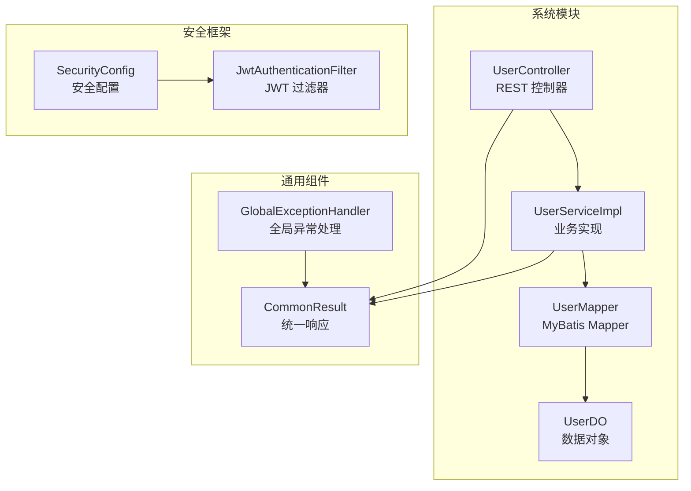
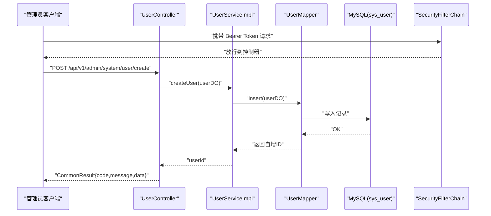
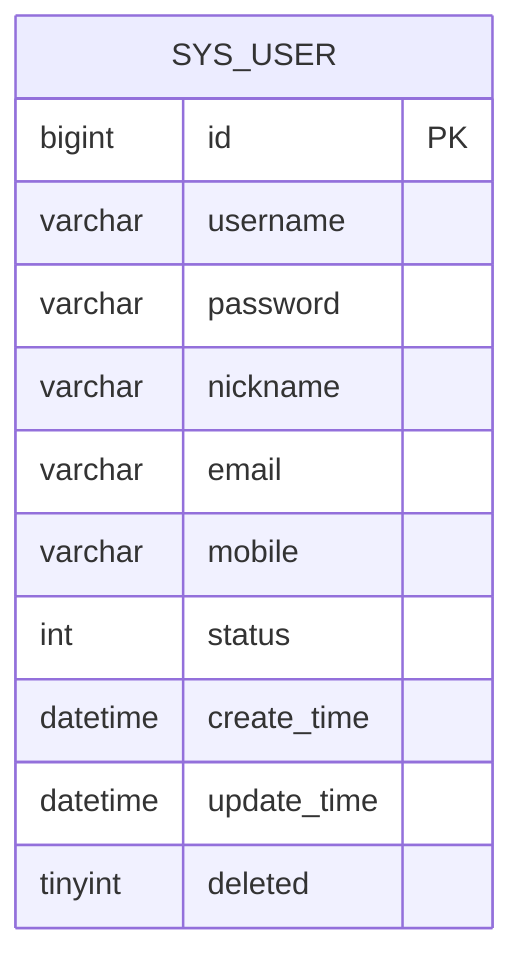
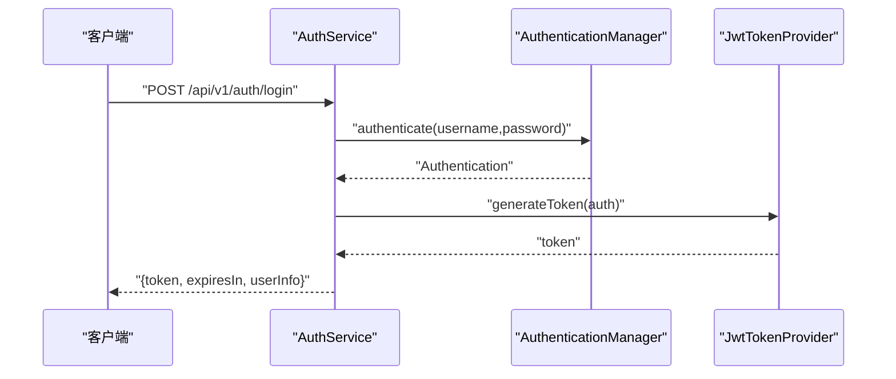
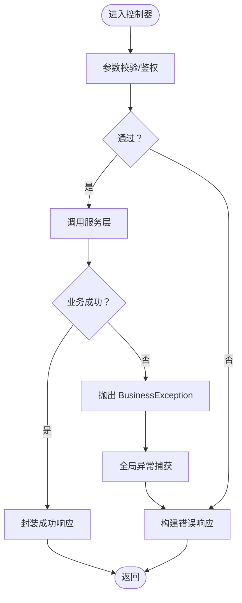
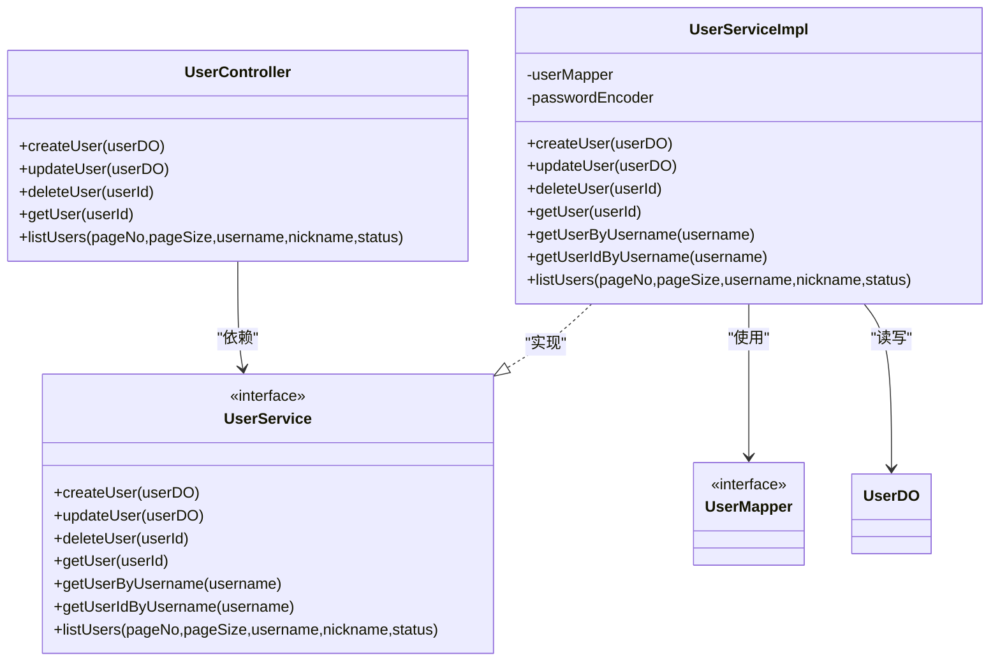

# 用户管理接口

<cite>
**本文引用的文件**
- [UserController.java](file://graphiti-module-system/src/main/java/com/graphiti/system/controller/UserController.java)
- [UserService.java](file://graphiti-module-system/src/main/java/com/graphiti/system/service/UserService.java)
- [UserServiceImpl.java](file://graphiti-module-system/src/main/java/com/graphiti/system/service/impl/UserServiceImpl.java)
- [UserMapper.java](file://graphiti-module-system/src/main/java/com/graphiti/system/dal/mysql/UserMapper.java)
- [UserDO.java](file://graphiti-module-system/src/main/java/com/graphiti/system/dal/dataobject/UserDO.java)
- [AuthService.java](file://graphiti-module-system/src/main/java/com/graphiti/system/service/AuthService.java)
- [AuthServiceImpl.java](file://graphiti-module-system/src/main/java/com/graphiti/system/service/impl/AuthServiceImpl.java)
- [LoginRequest.java](file://graphiti-module-system/src/main/java/com/graphiti/system/dto/LoginRequest.java)
- [LoginResponse.java](file://graphiti-module-system/src/main/java/com/graphiti/system/dto/LoginResponse.java)
- [SecurityConfig.java](file://graphiti-framework/graphiti-spring-boot-starter-security/src/main/java/com/graphiti/framework/security/config/SecurityConfig.java)
- [GlobalExceptionHandler.java](file://graphiti-framework/graphiti-common/src/main/java/com/graphiti/common/exception/GlobalExceptionHandler.java)
- [CommonResult.java](file://graphiti-framework/graphiti-common/src/main/java/com/graphiti/common/response/CommonResult.java)
</cite>

## 目录
1. [简介](#简介)
2. [项目结构](#项目结构)
3. [核心组件](#核心组件)
4. [架构总览](#架构总览)
5. [详细组件分析](#详细组件分析)
6. [依赖分析](#依赖分析)
7. [性能考虑](#性能考虑)
8. [故障排查指南](#故障排查指南)
9. [结论](#结论)
10. [附录](#附录)

## 简介
本文件为 Graphiti-Java 的“用户管理接口”API 参考文档，面向系统管理员与后端开发者，覆盖管理后台的用户 CRUD 与分页查询能力，并对鉴权、数据模型、参数校验、错误处理与分页搜索进行完整说明。接口基于 Spring Boot + MyBatis-Plus 实现，采用 JWT 无状态鉴权，统一响应体与全局异常处理。

## 项目结构
用户管理相关模块位于 graphiti-module-system 中，主要由控制器、服务层、数据访问层与数据对象组成；安全框架位于 graphiti-spring-boot-starter-security；通用响应与异常处理位于 graphiti-common。

图表来源
- [UserController.java:19-74](file://graphiti-module-system/src/main/java/com/graphiti/system/controller/UserController.java#L19-L74)
- [UserServiceImpl.java:24-112](file://graphiti-module-system/src/main/java/com/graphiti/system/service/impl/UserServiceImpl.java#L24-L112)
- [UserMapper.java:10-12](file://graphiti-module-system/src/main/java/com/graphiti/system/dal/mysql/UserMapper.java#L10-L12)
- [UserDO.java:13-37](file://graphiti-module-system/src/main/java/com/graphiti/system/dal/dataobject/UserDO.java#L13-L37)
- [SecurityConfig.java:115-136](file://graphiti-framework/graphiti-spring-boot-starter-security/src/main/java/com/graphiti/framework/security/config/SecurityConfig.java#L115-L136)
- [CommonResult.java:13-67](file://graphiti-framework/graphiti-common/src/main/java/com/graphiti/common/response/CommonResult.java#L13-L67)
- [GlobalExceptionHandler.java:17-73](file://graphiti-framework/graphiti-common/src/main/java/com/graphiti/common/exception/GlobalExceptionHandler.java#L17-L73)

章节来源
- [UserController.java:19-74](file://graphiti-module-system/src/main/java/com/graphiti/system/controller/UserController.java#L19-L74)
- [UserServiceImpl.java:24-112](file://graphiti-module-system/src/main/java/com/graphiti/system/service/impl/UserServiceImpl.java#L24-L112)
- [UserMapper.java:10-12](file://graphiti-module-system/src/main/java/com/graphiti/system/dal/mysql/UserMapper.java#L10-L12)
- [UserDO.java:13-37](file://graphiti-module-system/src/main/java/com/graphiti/system/dal/dataobject/UserDO.java#L13-L37)
- [SecurityConfig.java:115-136](file://graphiti-framework/graphiti-spring-boot-starter-security/src/main/java/com/graphiti/framework/security/config/SecurityConfig.java#L115-L136)
- [CommonResult.java:13-67](file://graphiti-framework/graphiti-common/src/main/java/com/graphiti/common/response/CommonResult.java#L13-L67)
- [GlobalExceptionHandler.java:17-73](file://graphiti-framework/graphiti-common/src/main/java/com/graphiti/common/exception/GlobalExceptionHandler.java#L17-L73)

## 核心组件
- 控制器层：提供 REST 接口，负责接收请求、参数校验与调用服务层。
- 服务层：封装业务逻辑，如密码加密、唯一性检查、软删除、分页查询等。
- 数据访问层：基于 MyBatis-Plus 的 Mapper，提供基础 CRUD 能力。
- 数据对象：映射 sys_user 表，包含用户基本信息、状态与时间戳。
- 安全框架：JWT 无状态认证，CORS 放通，未认证/权限不足统一返回 JSON。
- 统一响应与异常：统一响应体 CommonResult，全局异常处理 GlobalExceptionHandler。

章节来源
- [UserController.java:24-74](file://graphiti-module-system/src/main/java/com/graphiti/system/controller/UserController.java#L24-L74)
- [UserService.java:8-60](file://graphiti-module-system/src/main/java/com/graphiti/system/service/UserService.java#L8-L60)
- [UserServiceImpl.java:24-112](file://graphiti-module-system/src/main/java/com/graphiti/system/service/impl/UserServiceImpl.java#L24-L112)
- [UserDO.java:13-37](file://graphiti-module-system/src/main/java/com/graphiti/system/dal/dataobject/UserDO.java#L13-L37)
- [SecurityConfig.java:84-136](file://graphiti-framework/graphiti-spring-boot-starter-security/src/main/java/com/graphiti/framework/security/config/SecurityConfig.java#L84-L136)
- [CommonResult.java:13-67](file://graphiti-framework/graphiti-common/src/main/java/com/graphiti/common/response/CommonResult.java#L13-L67)
- [GlobalExceptionHandler.java:17-73](file://graphiti-framework/graphiti-common/src/main/java/com/graphiti/common/exception/GlobalExceptionHandler.java#L17-L73)

## 架构总览
用户管理接口遵循典型的 MVC 分层架构，配合 Spring Security 的 JWT 过滤链完成鉴权与跨域支持。

图表来源
- [UserController.java:29-35](file://graphiti-module-system/src/main/java/com/graphiti/system/controller/UserController.java#L29-L35)
- [UserServiceImpl.java:30-50](file://graphiti-module-system/src/main/java/com/graphiti/system/service/impl/UserServiceImpl.java#L30-L50)
- [UserMapper.java:10-12](file://graphiti-module-system/src/main/java/com/graphiti/system/dal/mysql/UserMapper.java#L10-L12)
- [SecurityConfig.java:115-136](file://graphiti-framework/graphiti-spring-boot-starter-security/src/main/java/com/graphiti/framework/security/config/SecurityConfig.java#L115-L136)
- [CommonResult.java:39-45](file://graphiti-framework/graphiti-common/src/main/java/com/graphiti/common/response/CommonResult.java#L39-L45)

## 详细组件分析

### 用户数据模型
用户实体映射数据库表 sys_user，关键字段如下：

- id：主键（Long）
- username：用户名（String）
- password：密码（String，存储为加密值）
- nickname：昵称（String）
- email：邮箱（String）
- mobile：手机号（String）
- status：状态（Integer）
- createTime：创建时间（LocalDateTime）
- updateTime：更新时间（LocalDateTime）
- deleted：逻辑删除标记（Boolean）

图表来源
- [UserDO.java:13-37](file://graphiti-module-system/src/main/java/com/graphiti/system/dal/dataobject/UserDO.java#L13-L37)

章节来源
- [UserDO.java:13-37](file://graphiti-module-system/src/main/java/com/graphiti/system/dal/dataobject/UserDO.java#L13-L37)

### 鉴权与权限机制
- 认证方式：JWT 无状态令牌，通过 Authorization: Bearer <token> 传递。
- 安全策略：禁用 CSRF，会话策略为 STATELESS；开放 /api/v1/auth/**、Swagger、Actuator 等路径。
- 未认证/权限不足：统一返回 JSON，状态码分别为 401/403。
- 登录流程：使用用户名+密码进行认证，成功后签发 JWT，有效期 24 小时。

图表来源
- [AuthService.java:9-25](file://graphiti-module-system/src/main/java/com/graphiti/system/service/AuthService.java#L9-L25)
- [AuthServiceImpl.java:26-44](file://graphiti-module-system/src/main/java/com/graphiti/system/service/impl/AuthServiceImpl.java#L26-L44)
- [SecurityConfig.java:115-136](file://graphiti-framework/graphiti-spring-boot-starter-security/src/main/java/com/graphiti/framework/security/config/SecurityConfig.java#L115-L136)

章节来源
- [AuthService.java:9-25](file://graphiti-module-system/src/main/java/com/graphiti/system/service/AuthService.java#L9-L25)
- [AuthServiceImpl.java:26-44](file://graphiti-module-system/src/main/java/com/graphiti/system/service/impl/AuthServiceImpl.java#L26-L44)
- [SecurityConfig.java:84-136](file://graphiti-framework/graphiti-spring-boot-starter-security/src/main/java/com/graphiti/framework/security/config/SecurityConfig.java#L84-L136)

### 统一响应与错误处理
- 统一响应体：包含 code、message、data、timestamp 字段。
- 全局异常：业务异常 BusinessException、参数校验异常、缺少参数、其他异常均被统一处理并返回标准格式。
- 响应示例：成功返回 code=200，失败返回对应错误码与消息。

图表来源
- [CommonResult.java:13-67](file://graphiti-framework/graphiti-common/src/main/java/com/graphiti/common/response/CommonResult.java#L13-L67)
- [GlobalExceptionHandler.java:26-72](file://graphiti-framework/graphiti-common/src/main/java/com/graphiti/common/exception/GlobalExceptionHandler.java#L26-L72)

章节来源
- [CommonResult.java:13-67](file://graphiti-framework/graphiti-common/src/main/java/com/graphiti/common/response/CommonResult.java#L13-L67)
- [GlobalExceptionHandler.java:26-72](file://graphiti-framework/graphiti-common/src/main/java/com/graphiti/common/exception/GlobalExceptionHandler.java#L26-L72)

### 用户管理接口清单

- 基础路径
  - 前缀：/api/v1/admin/system/user

- 创建用户
  - 方法与路径：POST /create
  - 鉴权：需要 Bearer Token
  - 请求体：UserDO（不包含 id、deleted、createTime、updateTime）
  - 响应：CommonResult<Long>（返回新用户 ID）
  - 参数校验：用户名唯一性检查；密码为空则不处理，否则进行加密存储
  - 错误：用户名重复（业务异常），参数缺失/非法（400），未认证/权限不足（401/403）

- 更新用户
  - 方法与路径：PUT /update
  - 鉴权：需要 Bearer Token
  - 请求体：UserDO（包含 id 即可）
  - 响应：CommonResult<Boolean>（true 表示成功）
  - 参数校验：无显式注解，依赖全局校验
  - 错误：未认证/权限不足（401/403）

- 删除用户
  - 方法与路径：DELETE /delete/{userId}
  - 路径参数：userId（Long，必填）
  - 鉴权：需要 Bearer Token
  - 响应：CommonResult<Boolean>（true 表示成功）
  - 行为：执行软删除（设置 deleted=true），更新时间戳
  - 错误：未认证/权限不足（401/403）

- 获取用户详情
  - 方法与路径：GET /get/{userId}
  - 路径参数：userId（Long，必填）
  - 鉴权：需要 Bearer Token
  - 响应：CommonResult<UserDO>
  - 错误：未认证/权限不足（401/403）

- 分页查询用户列表
  - 方法与路径：GET /list
  - 鉴权：需要 Bearer Token
  - 查询参数：
    - pageNo：页码，默认 1
    - pageSize：每页条数，默认 10
    - username：用户名（模糊匹配，可选）
    - nickname：昵称（模糊匹配，可选）
    - status：状态（可选）
  - 响应：CommonResult<Map>，包含 list、total、pageNum、pageSize
  - 错误：未认证/权限不足（401/403）

章节来源
- [UserController.java:29-73](file://graphiti-module-system/src/main/java/com/graphiti/system/controller/UserController.java#L29-L73)
- [UserServiceImpl.java:30-111](file://graphiti-module-system/src/main/java/com/graphiti/system/service/impl/UserServiceImpl.java#L30-L111)
- [UserDO.java:13-37](file://graphiti-module-system/src/main/java/com/graphiti/system/dal/dataobject/UserDO.java#L13-L37)

### 请求/响应示例

- 创建用户（成功）
  - 请求体：包含 username、password、nickname、email、mobile、status 等
  - 响应体：CommonResult<Long>，data 为新用户 ID

- 分页查询（成功）
  - 响应体：CommonResult<Map>，data 内容包含
    - list：用户数组（元素为 UserDO）
    - total：总数
    - pageNum：当前页
    - pageSize：每页大小

- 未认证
  - 响应体：CommonResult<?>，code=401，message 为“未认证，请登录或提供有效的 JWT Token”

章节来源
- [CommonResult.java:39-66](file://graphiti-framework/graphiti-common/src/main/java/com/graphiti/common/response/CommonResult.java#L39-L66)
- [SecurityConfig.java:84-96](file://graphiti-framework/graphiti-spring-boot-starter-security/src/main/java/com/graphiti/framework/security/config/SecurityConfig.java#L84-L96)

## 依赖分析
- 控制器依赖服务接口，服务实现依赖 Mapper 与数据对象。
- 安全配置启用 JWT 过滤器，拦截所有受保护路径。
- 全局异常处理统一捕获业务异常与参数异常，返回 CommonResult。

图表来源
- [UserController.java:24-74](file://graphiti-module-system/src/main/java/com/graphiti/system/controller/UserController.java#L24-L74)
- [UserService.java:8-60](file://graphiti-module-system/src/main/java/com/graphiti/system/service/UserService.java#L8-L60)
- [UserServiceImpl.java:24-112](file://graphiti-module-system/src/main/java/com/graphiti/system/service/impl/UserServiceImpl.java#L24-L112)
- [UserMapper.java:10-12](file://graphiti-module-system/src/main/java/com/graphiti/system/dal/mysql/UserMapper.java#L10-L12)
- [UserDO.java:13-37](file://graphiti-module-system/src/main/java/com/graphiti/system/dal/dataobject/UserDO.java#L13-L37)

章节来源
- [UserController.java:24-74](file://graphiti-module-system/src/main/java/com/graphiti/system/controller/UserController.java#L24-L74)
- [UserService.java:8-60](file://graphiti-module-system/src/main/java/com/graphiti/system/service/UserService.java#L8-L60)
- [UserServiceImpl.java:24-112](file://graphiti-module-system/src/main/java/com/graphiti/system/service/impl/UserServiceImpl.java#L24-L112)
- [UserMapper.java:10-12](file://graphiti-module-system/src/main/java/com/graphiti/system/dal/mysql/UserMapper.java#L10-L12)
- [UserDO.java:13-37](file://graphiti-module-system/src/main/java/com/graphiti/system/dal/dataobject/UserDO.java#L13-L37)

## 性能考虑
- 分页查询默认每页 10 条，建议前端按需调整 pageSize 并限制最大值以避免过大负载。
- 模糊查询使用 like，建议在高频字段上建立合适索引（如 username、nickname）。
- 密码加密使用 BCrypt，成本因子适中，创建用户时建议仅在必要时进行加密。
- 软删除减少物理删除带来的连锁影响，但需定期清理历史数据或在报表层过滤 deleted=false。

## 故障排查指南
- 401 未认证
  - 检查请求头 Authorization 是否为 Bearer <token>，token 是否过期。
  - 确认安全配置未拦截该路径。
- 403 权限不足
  - 检查当前用户角色是否具备管理后台访问权限。
- 400 参数错误
  - 检查请求体字段是否符合要求；用户名/密码非空校验失败。
- 业务异常（如用户名已存在）
  - 检查是否存在同名用户；确认唯一性约束与业务逻辑。
- 响应体结构
  - 所有响应均为 CommonResult 格式，data 字段承载实际数据或错误信息。

章节来源
- [SecurityConfig.java:84-113](file://graphiti-framework/graphiti-spring-boot-starter-security/src/main/java/com/graphiti/framework/security/config/SecurityConfig.java#L84-L113)
- [GlobalExceptionHandler.java:26-72](file://graphiti-framework/graphiti-common/src/main/java/com/graphiti/common/exception/GlobalExceptionHandler.java#L26-L72)
- [CommonResult.java:13-67](file://graphiti-framework/graphiti-common/src/main/java/com/graphiti/common/response/CommonResult.java#L13-L67)

## 结论
本文档提供了 Graphiti-Java 管理后台用户管理接口的完整参考，包括数据模型、鉴权机制、参数校验、分页查询与错误处理。建议在生产环境中结合 RBAC 权限体系与审计日志完善安全管控，并对高频查询字段进行索引优化。

## 附录

### 接口一览表
- POST /api/v1/admin/system/user/create
  - 描述：创建用户
  - 鉴权：是
  - 请求体：UserDO（除 id、deleted、createTime、updateTime）
  - 响应：CommonResult<Long>

- PUT /api/v1/admin/system/user/update
  - 描述：更新用户
  - 鉴权：是
  - 请求体：UserDO（含 id）
  - 响应：CommonResult<Boolean>

- DELETE /api/v1/admin/system/user/delete/{userId}
  - 描述：删除用户（软删除）
  - 鉴权：是
  - 路径参数：userId（Long）
  - 响应：CommonResult<Boolean>

- GET /api/v1/admin/system/user/get/{userId}
  - 描述：获取用户详情
  - 鉴权：是
  - 路径参数：userId（Long）
  - 响应：CommonResult<UserDO>

- GET /api/v1/admin/system/user/list
  - 描述：分页查询用户列表
  - 鉴权：是
  - 查询参数：
    - pageNo：页码（默认 1）
    - pageSize：每页条数（默认 10）
    - username：用户名（模糊匹配，可选）
    - nickname：昵称（模糊匹配，可选）
    - status：状态（可选）
  - 响应：CommonResult<Map>（包含 list、total、pageNum、pageSize）

章节来源
- [UserController.java:29-73](file://graphiti-module-system/src/main/java/com/graphiti/system/controller/UserController.java#L29-L73)
- [UserServiceImpl.java:89-111](file://graphiti-module-system/src/main/java/com/graphiti/system/service/impl/UserServiceImpl.java#L89-L111)
- [UserDO.java:13-37](file://graphiti-module-system/src/main/java/com/graphiti/system/dal/dataobject/UserDO.java#L13-L37)