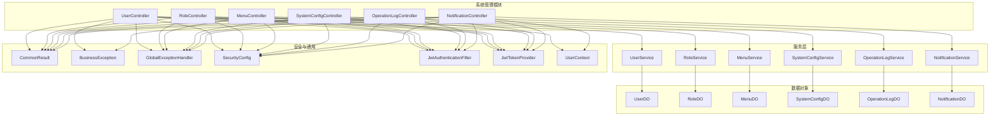
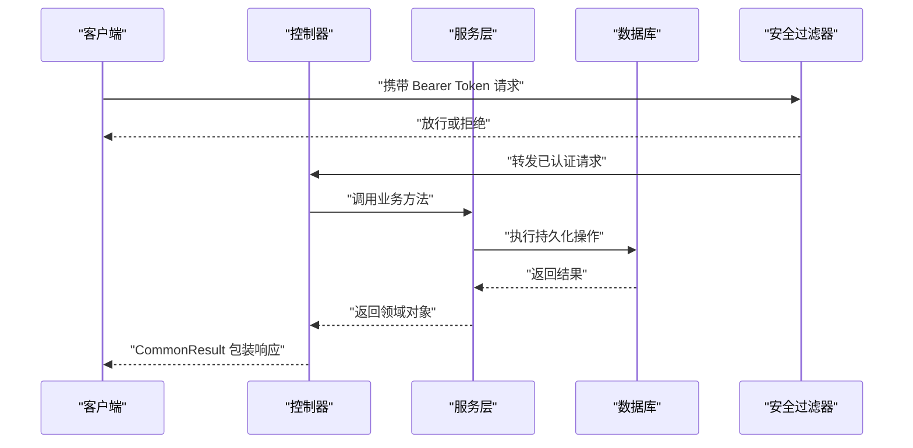
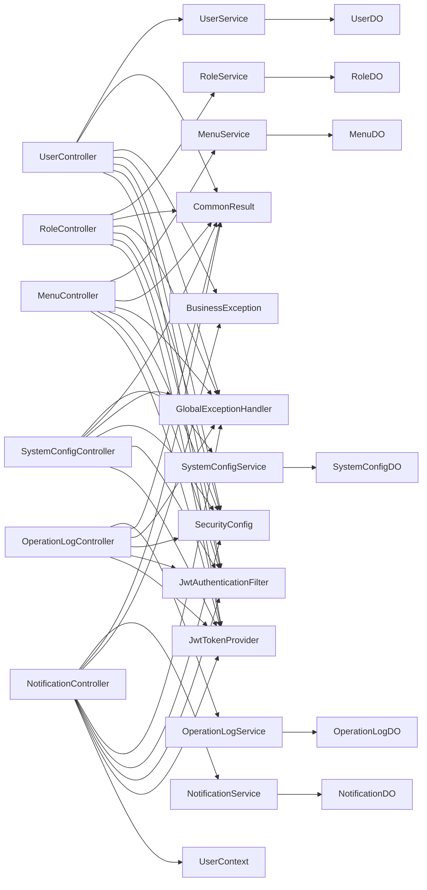
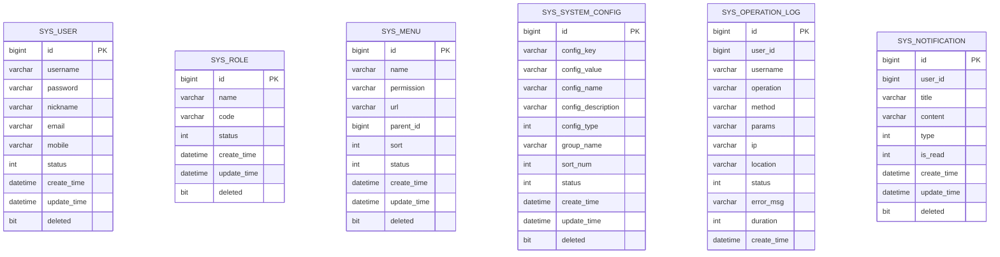

# 系统管理接口

<cite>
**本文引用的文件**
- [UserController.java](file://graphiti-module-system/src/main/java/com/graphiti/system/controller/UserController.java)
- [RoleController.java](file://graphiti-module-system/src/main/java/com/graphiti/system/controller/RoleController.java)
- [MenuController.java](file://graphiti-module-system/src/main/java/com/graphiti/system/controller/MenuController.java)
- [SystemConfigController.java](file://graphiti-module-system/src/main/java/com/graphiti/system/controller/SystemConfigController.java)
- [OperationLogController.java](file://graphiti-module-system/src/main/java/com/graphiti/system/controller/OperationLogController.java)
- [NotificationController.java](file://graphiti-module-system/src/main/java/com/graphiti/system/controller/NotificationController.java)
- [UserDO.java](file://graphiti-module-system/src/main/java/com/graphiti/system/dal/dataobject/UserDO.java)
- [RoleDO.java](file://graphiti-module-system/src/main/java/com/graphiti/system/dal/dataobject/RoleDO.java)
- [MenuDO.java](file://graphiti-module-system/src/main/java/com/graphiti/system/dal/dataobject/MenuDO.java)
- [SystemConfigDO.java](file://graphiti-module-system/src/main/java/com/graphiti/system/dal/dataobject/SystemConfigDO.java)
- [OperationLogDO.java](file://graphiti-module-system/src/main/java/com/graphiti/system/dal/dataobject/OperationLogDO.java)
- [NotificationDO.java](file://graphiti-module-system/src/main/java/com/graphiti/system/dal/dataobject/NotificationDO.java)
- [UserService.java](file://graphiti-module-system/src/main/java/com/graphiti/system/service/UserService.java)
- [RoleService.java](file://graphiti-module-system/src/main/java/com/graphiti/system/service/RoleService.java)
- [MenuService.java](file://graphiti-module-system/src/main/java/com/graphiti/system/service/MenuService.java)
- [SystemConfigService.java](file://graphiti-module-system/src/main/java/com/graphiti/system/service/SystemConfigService.java)
- [OperationLogService.java](file://graphiti-module-system/src/main/java/com/graphiti/system/service/OperationLogService.java)
- [NotificationService.java](file://graphiti-module-system/src/main/java/com/graphiti/system/service/NotificationService.java)
- [CommonResult.java](file://graphiti-framework/graphiti-common/src/main/java/com/graphiti/common/response/CommonResult.java)
- [BusinessException.java](file://graphiti-framework/graphiti-common/src/main/java/com/graphiti/common/exception/BusinessException.java)
- [GlobalExceptionHandler.java](file://graphiti-framework/graphiti-common/src/main/java/com/graphiti/common/exception/GlobalExceptionHandler.java)
- [ResultCode.java](file://graphiti-framework/graphiti-common/src/main/java/com/graphiti/common/constants/ResultCode.java)
- [SecurityConfig.java](file://graphiti-framework/graphiti-spring-boot-starter-security/src/main/java/com/graphiti/framework/security/config/SecurityConfig.java)
- [JwtAuthenticationFilter.java](file://graphiti-framework/graphiti-spring-boot-starter-security/src/main/java/com/graphiti/framework/security/jwt/JwtAuthenticationFilter.java)
- [JwtTokenProvider.java](file://graphiti-framework/graphiti-spring-boot-starter-security/src/main/java/com/graphiti/framework/security/jwt/JwtTokenProvider.java)
- [UserContext.java](file://graphiti-framework/graphiti-spring-boot-starter-security/src/main/java/com/graphiti/framework/security/util/UserContext.java)
</cite>

## 目录
1. [简介](#简介)
2. [项目结构](#项目结构)
3. [核心组件](#核心组件)
4. [架构总览](#架构总览)
5. [详细组件分析](#详细组件分析)
6. [依赖分析](#依赖分析)
7. [性能考虑](#性能考虑)
8. [故障排查指南](#故障排查指南)
9. [结论](#结论)
10. [附录](#附录)

## 简介
本文件为 Graphiti-Java 系统管理接口的权威参考，覆盖用户管理、角色权限、菜单管理、系统配置、操作日志、通知管理等系统级能力。文档面向系统管理员与后端/前端开发者，提供完整的 REST 接口说明、数据模型定义、权限控制机制、分页查询、批量操作、数据校验与错误处理策略，并通过图示帮助快速理解系统架构与调用流程。

## 项目结构
系统管理模块位于 graphiti-module-system，采用标准的分层架构：控制器层（Controller）、服务层（Service）、数据访问层（Mapper/DO），并集成统一响应体与全局异常处理。安全层基于 Spring Security + JWT 实现，提供 Bearer Token 鉴权与用户上下文解析。

图表来源
- [UserController.java:1-75](file://graphiti-module-system/src/main/java/com/graphiti/system/controller/UserController.java#L1-L75)
- [RoleController.java:1-71](file://graphiti-module-system/src/main/java/com/graphiti/system/controller/RoleController.java#L1-L71)
- [MenuController.java:1-79](file://graphiti-module-system/src/main/java/com/graphiti/system/controller/MenuController.java#L1-L79)
- [SystemConfigController.java:1-83](file://graphiti-module-system/src/main/java/com/graphiti/system/controller/SystemConfigController.java#L1-L83)
- [OperationLogController.java:1-73](file://graphiti-module-system/src/main/java/com/graphiti/system/controller/OperationLogController.java#L1-L73)
- [NotificationController.java:1-139](file://graphiti-module-system/src/main/java/com/graphiti/system/controller/NotificationController.java#L1-L139)
- [UserService.java:1-61](file://graphiti-module-system/src/main/java/com/graphiti/system/service/UserService.java#L1-L61)
- [RoleService.java:1-49](file://graphiti-module-system/src/main/java/com/graphiti/system/service/RoleService.java#L1-L49)
- [MenuService.java:1-49](file://graphiti-module-system/src/main/java/com/graphiti/system/service/MenuService.java#L1-L49)
- [SystemConfigService.java:1-48](file://graphiti-module-system/src/main/java/com/graphiti/system/service/SystemConfigService.java#L1-L48)
- [OperationLogService.java:1-45](file://graphiti-module-system/src/main/java/com/graphiti/system/service/OperationLogService.java#L1-L45)
- [NotificationService.java:1-77](file://graphiti-module-system/src/main/java/com/graphiti/system/service/NotificationService.java#L1-L77)
- [CommonResult.java](file://graphiti-framework/graphiti-common/src/main/java/com/graphiti/common/response/CommonResult.java)
- [BusinessException.java](file://graphiti-framework/graphiti-common/src/main/java/com/graphiti/common/exception/BusinessException.java)
- [GlobalExceptionHandler.java](file://graphiti-framework/graphiti-common/src/main/java/com/graphiti/common/exception/GlobalExceptionHandler.java)
- [SecurityConfig.java](file://graphiti-framework/graphiti-spring-boot-starter-security/src/main/java/com/graphiti/framework/security/config/SecurityConfig.java)
- [JwtAuthenticationFilter.java](file://graphiti-framework/graphiti-spring-boot-starter-security/src/main/java/com/graphiti/framework/security/jwt/JwtAuthenticationFilter.java)
- [JwtTokenProvider.java](file://graphiti-framework/graphiti-spring-boot-starter-security/src/main/java/com/graphiti/framework/security/jwt/JwtTokenProvider.java)
- [UserContext.java](file://graphiti-framework/graphiti-spring-boot-starter-security/src/main/java/com/graphiti/framework/security/util/UserContext.java)

章节来源
- [UserController.java:1-75](file://graphiti-module-system/src/main/java/com/graphiti/system/controller/UserController.java#L1-L75)
- [RoleController.java:1-71](file://graphiti-module-system/src/main/java/com/graphiti/system/controller/RoleController.java#L1-L71)
- [MenuController.java:1-79](file://graphiti-module-system/src/main/java/com/graphiti/system/controller/MenuController.java#L1-L79)
- [SystemConfigController.java:1-83](file://graphiti-module-system/src/main/java/com/graphiti/system/controller/SystemConfigController.java#L1-L83)
- [OperationLogController.java:1-73](file://graphiti-module-system/src/main/java/com/graphiti/system/controller/OperationLogController.java#L1-L73)
- [NotificationController.java:1-139](file://graphiti-module-system/src/main/java/com/graphiti/system/controller/NotificationController.java#L1-L139)

## 核心组件
- 控制器层：提供 REST API，负责参数接收、鉴权注解声明与返回统一响应体。
- 服务层：封装业务逻辑，提供 CRUD、分页查询、统计计数、批量处理等能力。
- 数据对象层：MyBatis-Plus 实体类映射数据库表结构。
- 安全层：基于 Spring Security + JWT 的认证与授权过滤链。
- 通用层：统一响应体、业务异常与全局异常处理器。

章节来源
- [UserService.java:1-61](file://graphiti-module-system/src/main/java/com/graphiti/system/service/UserService.java#L1-L61)
- [RoleService.java:1-49](file://graphiti-module-system/src/main/java/com/graphiti/system/service/RoleService.java#L1-L49)
- [MenuService.java:1-49](file://graphiti-module-system/src/main/java/com/graphiti/system/service/MenuService.java#L1-L49)
- [SystemConfigService.java:1-48](file://graphiti-module-system/src/main/java/com/graphiti/system/service/SystemConfigService.java#L1-L48)
- [OperationLogService.java:1-45](file://graphiti-module-system/src/main/java/com/graphiti/system/service/OperationLogService.java#L1-L45)
- [NotificationService.java:1-77](file://graphiti-module-system/src/main/java/com/graphiti/system/service/NotificationService.java#L1-L77)
- [CommonResult.java](file://graphiti-framework/graphiti-common/src/main/java/com/graphiti/common/response/CommonResult.java)
- [BusinessException.java](file://graphiti-framework/graphiti-common/src/main/java/com/graphiti/common/exception/BusinessException.java)
- [GlobalExceptionHandler.java](file://graphiti-framework/graphiti-common/src/main/java/com/graphiti/common/exception/GlobalExceptionHandler.java)
- [SecurityConfig.java](file://graphiti-framework/graphiti-spring-boot-starter-security/src/main/java/com/graphiti/framework/security/config/SecurityConfig.java)
- [JwtAuthenticationFilter.java](file://graphiti-framework/graphiti-spring-boot-starter-security/src/main/java/com/graphiti/framework/security/jwt/JwtAuthenticationFilter.java)
- [JwtTokenProvider.java](file://graphiti-framework/graphiti-spring-boot-starter-security/src/main/java/com/graphiti/framework/security/jwt/JwtTokenProvider.java)
- [UserContext.java](file://graphiti-framework/graphiti-spring-boot-starter-security/src/main/java/com/graphiti/framework/security/util/UserContext.java)

## 架构总览
系统管理接口遵循“控制器-服务-数据对象”的清晰分层，配合统一响应体与安全过滤器，形成可扩展、可维护的管理后台 API 生态。

图表来源
- [UserController.java:29-35](file://graphiti-module-system/src/main/java/com/graphiti/system/controller/UserController.java#L29-L35)
- [JwtAuthenticationFilter.java](file://graphiti-framework/graphiti-spring-boot-starter-security/src/main/java/com/graphiti/framework/security/jwt/JwtAuthenticationFilter.java)
- [SecurityConfig.java](file://graphiti-framework/graphiti-spring-boot-starter-security/src/main/java/com/graphiti/framework/security/config/SecurityConfig.java)
- [CommonResult.java](file://graphiti-framework/graphiti-common/src/main/java/com/graphiti/common/response/CommonResult.java)

## 详细组件分析

### 用户管理接口
- 基础路径：/api/v1/admin/system/user
- 支持操作：创建、更新、删除、详情查询、分页列表（支持用户名/昵称模糊搜索与状态筛选）
- 鉴权：所有接口均需 Bearer Token
- 返回：统一响应体包装 Long/Boolean/分页结果

接口清单
- POST /create：创建用户
- PUT /update：更新用户
- DELETE /delete/{userId}：删除用户
- GET /get/{userId}：获取用户详情
- GET /list?pageNo&pageSize&username&nickname&status：分页查询用户列表

请求/响应要点
- 请求体：UserDO（字段见数据模型）
- 响应体：CommonResult<T>，成功时包含业务数据
- 分页：pageNo 默认 1，pageSize 默认 10

章节来源
- [UserController.java:29-73](file://graphiti-module-system/src/main/java/com/graphiti/system/controller/UserController.java#L29-L73)
- [UserDO.java:1-38](file://graphiti-module-system/src/main/java/com/graphiti/system/dal/dataobject/UserDO.java#L1-L38)
- [UserService.java:10-60](file://graphiti-module-system/src/main/java/com/graphiti/system/service/UserService.java#L10-L60)
- [CommonResult.java](file://graphiti-framework/graphiti-common/src/main/java/com/graphiti/common/response/CommonResult.java)

### 角色管理接口
- 基础路径：/api/v1/admin/system/role
- 支持操作：创建、更新、删除、详情查询、获取全部角色
- 鉴权：Bearer Token
- 返回：CommonResult<T>

接口清单
- POST /create：创建角色
- PUT /update：更新角色
- DELETE /delete/{roleId}：删除角色
- GET /get/{roleId}：获取角色详情
- GET /list：获取全部角色列表

章节来源
- [RoleController.java:30-69](file://graphiti-module-system/src/main/java/com/graphiti/system/controller/RoleController.java#L30-L69)
- [RoleDO.java:1-32](file://graphiti-module-system/src/main/java/com/graphiti/system/dal/dataobject/RoleDO.java#L1-L32)
- [RoleService.java:10-48](file://graphiti-module-system/src/main/java/com/graphiti/system/service/RoleService.java#L10-L48)
- [CommonResult.java](file://graphiti-framework/graphiti-common/src/main/java/com/graphiti/common/response/CommonResult.java)

### 菜单管理接口
- 基础路径：/api/v1/admin/system/menu
- 支持操作：创建、更新、删除、详情查询、获取树形菜单列表
- 鉴权：Bearer Token
- 返回：CommonResult<T>

接口清单
- POST /create：创建菜单
- PUT /update：更新菜单
- DELETE /delete/{menuId}：删除菜单
- GET /get/{menuId}：获取菜单详情
- GET /list：获取树形菜单列表（内部递归构建子节点）

章节来源
- [MenuController.java:30-77](file://graphiti-module-system/src/main/java/com/graphiti/system/controller/MenuController.java#L30-L77)
- [MenuDO.java:1-45](file://graphiti-module-system/src/main/java/com/graphiti/system/dal/dataobject/MenuDO.java#L1-L45)
- [MenuService.java:10-48](file://graphiti-module-system/src/main/java/com/graphiti/system/service/MenuService.java#L10-L48)
- [CommonResult.java](file://graphiti-framework/graphiti-common/src/main/java/com/graphiti/common/response/CommonResult.java)

### 系统配置接口
- 基础路径：/api/v1/admin/system/config
- 支持操作：分页查询、全量查询、详情查询、按 key 查询、创建、更新、删除
- 鉴权：Bearer Token
- 返回：CommonResult<T>

接口清单
- GET /list?pageNo&pageSize&configKey&configName&groupName&status：分页查询
- GET /all：获取全部配置
- GET /{id}：按 ID 查询
- GET /key/{key}：按 key 查询
- POST /create：创建配置
- PUT /{id}：更新配置
- DELETE /{id}：删除配置

章节来源
- [SystemConfigController.java:28-81](file://graphiti-module-system/src/main/java/com/graphiti/system/controller/SystemConfigController.java#L28-L81)
- [SystemConfigDO.java:1-42](file://graphiti-module-system/src/main/java/com/graphiti/system/dal/dataobject/SystemConfigDO.java#L1-L42)
- [SystemConfigService.java:12-47](file://graphiti-module-system/src/main/java/com/graphiti/system/service/SystemConfigService.java#L12-L47)
- [CommonResult.java](file://graphiti-framework/graphiti-common/src/main/java/com/graphiti/common/response/CommonResult.java)

### 操作日志接口
- 基础路径：/api/v1/admin/system/log
- 支持操作：分页查询、详情查询、删除单条、清空日志、导出日志
- 鉴权：Bearer Token
- 返回：CommonResult<T>

接口清单
- GET /list?pageNo&pageSize&username&operation&status&startTime&endTime：分页查询
- GET /{id}：详情查询
- DELETE /{id}：删除单条日志
- DELETE /clear：清空所有日志
- GET /export?username&operation&status&startTime&endTime：导出日志

章节来源
- [OperationLogController.java:27-71](file://graphiti-module-system/src/main/java/com/graphiti/system/controller/OperationLogController.java#L27-L71)
- [OperationLogDO.java:1-42](file://graphiti-module-system/src/main/java/com/graphiti/system/dal/dataobject/OperationLogDO.java#L1-L42)
- [OperationLogService.java:12-44](file://graphiti-module-system/src/main/java/com/graphiti/system/service/OperationLogService.java#L12-L44)
- [CommonResult.java](file://graphiti-framework/graphiti-common/src/main/java/com/graphiti/common/response/CommonResult.java)

### 通知管理接口
- 基础路径：/api/v1/notifications
- 支持操作：分页查询通知、未读数量、标记已读、批量标记、删除通知、清空通知、获取/保存通知设置
- 鉴权：Bearer Token（通过 UserContext 解析当前用户）
- 返回：CommonResult<T>

接口清单
- GET /list?type&isRead&pageNum&pageSize：分页查询通知
- GET /unread-count：获取未读数量
- PUT /{id}/read：标记已读
- PUT /read-all：批量标记已读
- DELETE /{id}：删除通知
- DELETE /clear：清空通知
- GET /settings：获取通知设置
- PUT /settings：保存通知设置

章节来源
- [NotificationController.java:51-137](file://graphiti-module-system/src/main/java/com/graphiti/system/controller/NotificationController.java#L51-L137)
- [NotificationDO.java:1-36](file://graphiti-module-system/src/main/java/com/graphiti/system/dal/dataobject/NotificationDO.java#L1-L36)
- [NotificationService.java:11-76](file://graphiti-module-system/src/main/java/com/graphiti/system/service/NotificationService.java#L11-L76)
- [UserContext.java](file://graphiti-framework/graphiti-spring-boot-starter-security/src/main/java/com/graphiti/framework/security/util/UserContext.java)
- [CommonResult.java](file://graphiti-framework/graphiti-common/src/main/java/com/graphiti/common/response/CommonResult.java)

## 依赖分析
- 控制器依赖服务接口，服务接口依赖数据对象与持久层（Mapper/DO）。
- 统一响应体 CommonResult 作为所有接口返回载体，简化前端处理。
- 全局异常处理器捕获业务异常与运行时异常，统一返回错误码与消息。
- 安全配置与 JWT 过滤器确保受保护接口仅对有效 Token 放行。

图表来源
- [UserController.java:26-27](file://graphiti-module-system/src/main/java/com/graphiti/system/controller/UserController.java#L26-L27)
- [RoleController.java:27-28](file://graphiti-module-system/src/main/java/com/graphiti/system/controller/RoleController.java#L27-L28)
- [MenuController.java:27-28](file://graphiti-module-system/src/main/java/com/graphiti/system/controller/MenuController.java#L27-L28)
- [SystemConfigController.java](file://graphiti-module-system/src/main/java/com/graphiti/system/controller/SystemConfigController.java#L26)
- [OperationLogController.java](file://graphiti-module-system/src/main/java/com/graphiti/system/controller/OperationLogController.java#L25)
- [NotificationController.java:30-40](file://graphiti-module-system/src/main/java/com/graphiti/system/controller/NotificationController.java#L30-L40)
- [UserService.java:1-61](file://graphiti-module-system/src/main/java/com/graphiti/system/service/UserService.java#L1-L61)
- [RoleService.java:1-49](file://graphiti-module-system/src/main/java/com/graphiti/system/service/RoleService.java#L1-L49)
- [MenuService.java:1-49](file://graphiti-module-system/src/main/java/com/graphiti/system/service/MenuService.java#L1-L49)
- [SystemConfigService.java:1-48](file://graphiti-module-system/src/main/java/com/graphiti/system/service/SystemConfigService.java#L1-L48)
- [OperationLogService.java:1-45](file://graphiti-module-system/src/main/java/com/graphiti/system/service/OperationLogService.java#L1-L45)
- [NotificationService.java:1-77](file://graphiti-module-system/src/main/java/com/graphiti/system/service/NotificationService.java#L1-L77)
- [CommonResult.java](file://graphiti-framework/graphiti-common/src/main/java/com/graphiti/common/response/CommonResult.java)
- [BusinessException.java](file://graphiti-framework/graphiti-common/src/main/java/com/graphiti/common/exception/BusinessException.java)
- [GlobalExceptionHandler.java](file://graphiti-framework/graphiti-common/src/main/java/com/graphiti/common/exception/GlobalExceptionHandler.java)
- [SecurityConfig.java](file://graphiti-framework/graphiti-spring-boot-starter-security/src/main/java/com/graphiti/framework/security/config/SecurityConfig.java)
- [JwtAuthenticationFilter.java](file://graphiti-framework/graphiti-spring-boot-starter-security/src/main/java/com/graphiti/framework/security/jwt/JwtAuthenticationFilter.java)
- [JwtTokenProvider.java](file://graphiti-framework/graphiti-spring-boot-starter-security/src/main/java/com/graphiti/framework/security/jwt/JwtTokenProvider.java)
- [UserContext.java](file://graphiti-framework/graphiti-spring-boot-starter-security/src/main/java/com/graphiti/framework/security/util/UserContext.java)

## 性能考虑
- 分页查询：建议前端传入合理的 pageSize，避免一次性拉取大量数据；服务层应使用数据库分页以降低内存压力。
- 树形菜单构建：在控制器中进行内存聚合，建议控制菜单总量规模；若数据量大，可在服务层实现层级查询优化。
- 日志导出：导出接口可能产生大量数据，建议限制时间范围与状态条件，或采用异步导出任务。
- 缓存策略：对于高频读取的配置项与字典类数据，可在服务层引入缓存以减少数据库访问。
- 并发控制：批量操作（如批量标记已读、批量删除通知）建议使用事务与幂等设计，避免重复处理。

## 故障排查指南
常见问题与处理
- 401 未授权：检查请求头是否包含有效的 Bearer Token，确认 Token 未过期。
- 403 权限不足：确认当前用户角色具备相应菜单/接口权限。
- 400 参数错误：核对请求体字段类型与必填项，关注 DTO 校验规则。
- 500 服务器错误：查看全局异常处理器输出的日志，定位具体业务异常原因。

章节来源
- [BusinessException.java](file://graphiti-framework/graphiti-common/src/main/java/com/graphiti/common/exception/BusinessException.java)
- [GlobalExceptionHandler.java](file://graphiti-framework/graphiti-common/src/main/java/com/graphiti/common/exception/GlobalExceptionHandler.java)
- [ResultCode.java](file://graphiti-framework/graphiti-common/src/main/java/com/graphiti/common/constants/ResultCode.java)

## 结论
本系统管理接口以清晰的分层架构与统一的响应规范为基础，结合 JWT 鉴权与全局异常处理，提供了稳定可靠的管理后台 API。通过标准化的 CRUD、分页查询、批量操作与数据模型定义，能够满足用户、角色、菜单、配置、日志与通知等多维度的系统管理需求。建议在生产环境中配合缓存、异步任务与监控告警进一步提升可用性与可观测性。

## 附录

### RBAC 权限体系与访问控制
- 鉴权机制：基于 Spring Security + JWT，所有受保护接口需携带 Bearer Token。
- 用户上下文：通过 UserContext 解析当前登录用户，用于通知设置与操作日志归属。
- 接口权限：菜单权限标识（permission）用于前端路由与按钮级权限控制；后端通过安全配置与拦截器保证访问控制。

章节来源
- [SecurityConfig.java](file://graphiti-framework/graphiti-spring-boot-starter-security/src/main/java/com/graphiti/framework/security/config/SecurityConfig.java)
- [JwtAuthenticationFilter.java](file://graphiti-framework/graphiti-spring-boot-starter-security/src/main/java/com/graphiti/framework/security/jwt/JwtAuthenticationFilter.java)
- [JwtTokenProvider.java](file://graphiti-framework/graphiti-spring-boot-starter-security/src/main/java/com/graphiti/framework/security/jwt/JwtTokenProvider.java)
- [UserContext.java](file://graphiti-framework/graphiti-spring-boot-starter-security/src/main/java/com/graphiti/framework/security/util/UserContext.java)
- [MenuDO.java](file://graphiti-module-system/src/main/java/com/graphiti/system/dal/dataobject/MenuDO.java#L25)

### 数据模型定义

图表来源
- [UserDO.java:14-37](file://graphiti-module-system/src/main/java/com/graphiti/system/dal/dataobject/UserDO.java#L14-L37)
- [RoleDO.java:14-31](file://graphiti-module-system/src/main/java/com/graphiti/system/dal/dataobject/RoleDO.java#L14-L31)
- [MenuDO.java:17-44](file://graphiti-module-system/src/main/java/com/graphiti/system/dal/dataobject/MenuDO.java#L17-L44)
- [SystemConfigDO.java:14-41](file://graphiti-module-system/src/main/java/com/graphiti/system/dal/dataobject/SystemConfigDO.java#L14-L41)
- [OperationLogDO.java:14-41](file://graphiti-module-system/src/main/java/com/graphiti/system/dal/dataobject/OperationLogDO.java#L14-L41)
- [NotificationDO.java:14-35](file://graphiti-module-system/src/main/java/com/graphiti/system/dal/dataobject/NotificationDO.java#L14-L35)

### 统一响应体与错误码
- 统一响应体：所有接口返回 CommonResult<T>，包含状态码、消息与数据。
- 错误码：ResultCode 提供标准错误码枚举，便于前后端约定。
- 业务异常：业务层面抛出 BusinessException，由全局异常处理器捕获并格式化返回。

章节来源
- [CommonResult.java](file://graphiti-framework/graphiti-common/src/main/java/com/graphiti/common/response/CommonResult.java)
- [ResultCode.java](file://graphiti-framework/graphiti-common/src/main/java/com/graphiti/common/constants/ResultCode.java)
- [BusinessException.java](file://graphiti-framework/graphiti-common/src/main/java/com/graphiti/common/exception/BusinessException.java)
- [GlobalExceptionHandler.java](file://graphiti-framework/graphiti-common/src/main/java/com/graphiti/common/exception/GlobalExceptionHandler.java)