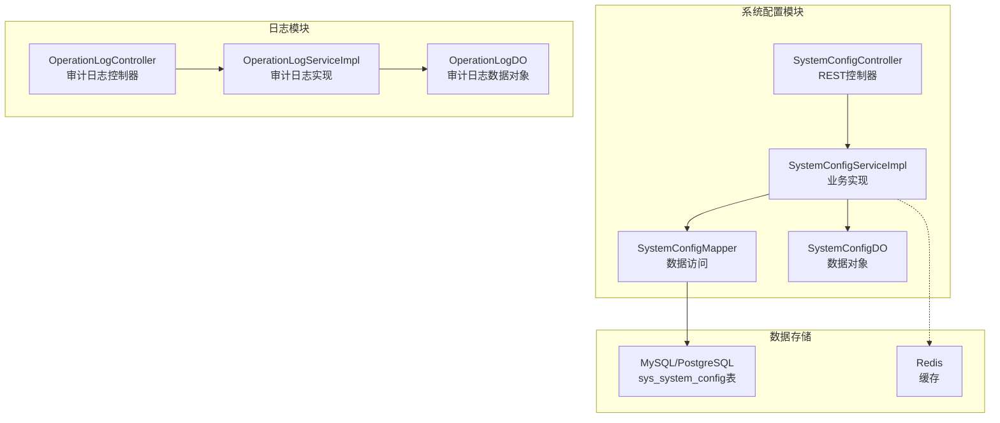
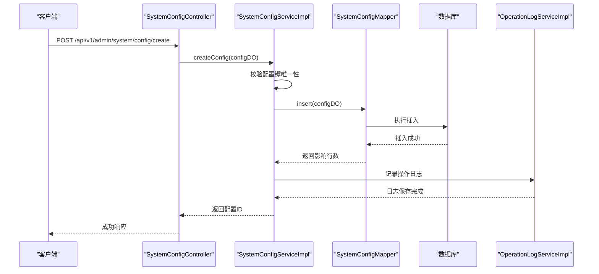
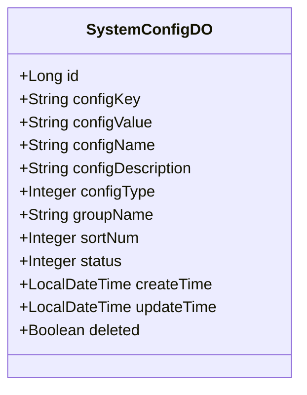
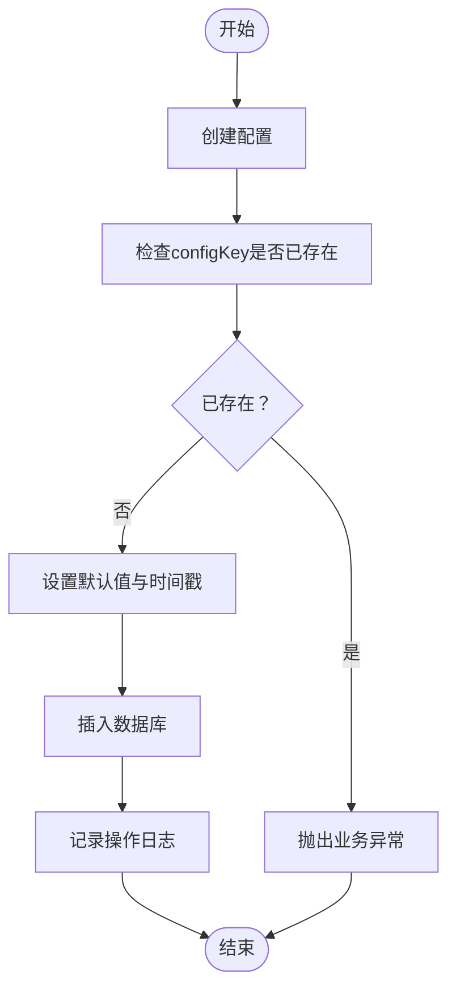
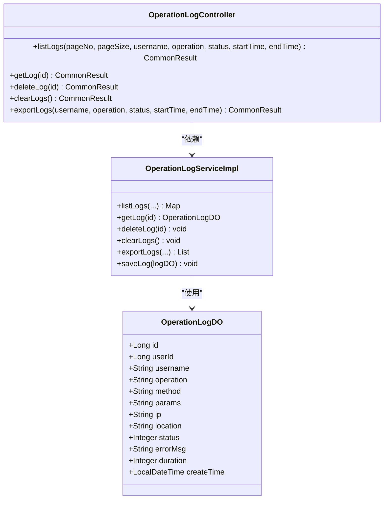
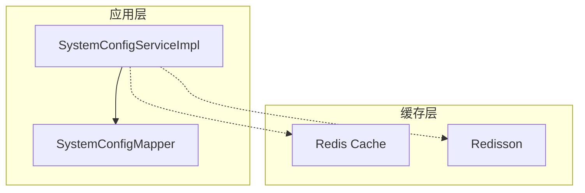
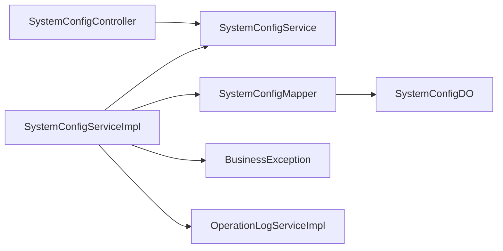

# 系统配置接口

<!--<cite>
**本文档引用的文件**
- [SystemConfigController.java](file://graphiti-module-system/src/main/java/com/graphiti/system/controller/SystemConfigController.java)
- [SystemConfigService.java](file://graphiti-module-system/src/main/java/com/graphiti/system/service/SystemConfigService.java)
- [SystemConfigServiceImpl.java](file://graphiti-module-system/src/main/java/com/graphiti/system/service/impl/SystemConfigServiceImpl.java)
- [SystemConfigDO.java](file://graphiti-module-system/src/main/java/com/graphiti/system/dal/dataobject/SystemConfigDO.java)
- [SystemConfigMapper.java](file://graphiti-module-system/src/main/java/com/graphiti/system/dal/mysql/SystemConfigMapper.java)
- [OperationLogController.java](file://graphiti-module-system/src/main/java/com/graphiti/system/controller/OperationLogController.java)
- [OperationLogServiceImpl.java](file://graphiti-module-system/src/main/java/com/graphiti/system/service/impl/OperationLogServiceImpl.java)
- [OperationLogDO.java](file://graphiti-module-system/src/main/java/com/graphiti/system/dal/dataobject/OperationLogDO.java)
- [schema.sql(MySQL)](file://sql/mysql/schema.sql)
- [schema.sql(PostgreSQL)](file://sql/postgresql/schema.sql)
- [init-data.sql(PostgreSQL)](file://sql/postgresql/init-data.sql)
- [pom.xml(Redis Starter)](file://graphiti-framework/graphiti-spring-boot-starter-redis/pom.xml)
- [docker-compose.yml](file://docker-compose.yml)
- [docker-compose.prod.yml](file://docker-compose.prod.yml)
</cite>-->

## 目录
1. [简介](#简介)
2. [项目结构](#项目结构)
3. [核心组件](#核心组件)
4. [架构概览](#架构概览)
5. [详细组件分析](#详细组件分析)
6. [依赖关系分析](#依赖关系分析)
7. [性能考虑](#性能考虑)
8. [故障排除指南](#故障排除指南)
9. [结论](#结论)
10. [附录](#附录)

## 简介
本文件为Graphiti-Java系统的配置接口提供全面的API文档。系统通过统一的配置管理模块支持全局配置、业务配置与运行时配置的集中管理，覆盖配置项的增删改查、分类管理、值类型验证与版本控制等能力。同时，系统提供配置热更新、缓存策略与同步机制，以及配置备份恢复、审计日志与权限控制等运维保障功能。

## 项目结构
系统配置相关的核心代码位于graphiti-module-system模块中，采用经典的分层架构：
- 控制器层：SystemConfigController提供REST API入口
- 服务层：SystemConfigService定义配置管理接口，SystemConfigServiceImpl实现具体业务逻辑
- 数据访问层：SystemConfigMapper基于MyBatis-Plus进行数据库操作
- 数据对象：SystemConfigDO映射sys_system_config表
- 日志模块：OperationLogController与OperationLogServiceImpl提供操作审计日志

**图表来源**
- [SystemConfigController.java:1-83](file://graphiti-module-system/src/main/java/com/graphiti/system/controller/SystemConfigController.java#L1-L83)
- [SystemConfigServiceImpl.java:1-123](file://graphiti-module-system/src/main/java/com/graphiti/system/service/impl/SystemConfigServiceImpl.java#L1-L123)
- [SystemConfigMapper.java:1-13](file://graphiti-module-system/src/main/java/com/graphiti/system/dal/mysql/SystemConfigMapper.java#L1-L13)
- [SystemConfigDO.java:1-42](file://graphiti-module-system/src/main/java/com/graphiti/system/dal/dataobject/SystemConfigDO.java#L1-L42)
- [OperationLogController.java:1-33](file://graphiti-module-system/src/main/java/com/graphiti/system/controller/OperationLogController.java#L1-L33)
- [OperationLogServiceImpl.java:1-105](file://graphiti-module-system/src/main/java/com/graphiti/system/service/impl/OperationLogServiceImpl.java#L1-L105)
- [OperationLogDO.java:1-41](file://graphiti-module-system/src/main/java/com/graphiti/system/dal/dataobject/OperationLogDO.java#L1-L41)

**章节来源**
- [SystemConfigController.java:1-83](file://graphiti-module-system/src/main/java/com/graphiti/system/controller/SystemConfigController.java#L1-L83)
- [SystemConfigService.java:1-48](file://graphiti-module-system/src/main/java/com/graphiti/system/service/SystemConfigService.java#L1-L48)
- [SystemConfigServiceImpl.java:1-123](file://graphiti-module-system/src/main/java/com/graphiti/system/service/impl/SystemConfigServiceImpl.java#L1-L123)
- [SystemConfigMapper.java:1-13](file://graphiti-module-system/src/main/java/com/graphiti/system/dal/mysql/SystemConfigMapper.java#L1-L13)
- [SystemConfigDO.java:1-42](file://graphiti-module-system/src/main/java/com/graphiti/system/dal/dataobject/SystemConfigDO.java#L1-L42)
- [OperationLogController.java:1-33](file://graphiti-module-system/src/main/java/com/graphiti/system/controller/OperationLogController.java#L1-L33)
- [OperationLogServiceImpl.java:1-105](file://graphiti-module-system/src/main/java/com/graphiti/system/service/impl/OperationLogServiceImpl.java#L1-L105)
- [OperationLogDO.java:1-41](file://graphiti-module-system/src/main/java/com/graphiti/system/dal/dataobject/OperationLogDO.java#L1-L41)

## 核心组件
系统配置接口围绕以下核心组件构建：

- 配置数据模型：SystemConfigDO定义了配置键、值、类型、分组、排序、状态及时间戳等字段
- 配置控制器：SystemConfigController提供REST API，支持分页查询、全量获取、详情查询、创建、更新与删除
- 配置服务：SystemConfigService定义配置管理接口，SystemConfigServiceImpl实现业务逻辑与数据校验
- 数据访问：SystemConfigMapper基于MyBatis-Plus进行数据库操作
- 审计日志：OperationLogController与OperationLogServiceImpl提供操作审计与导出功能

**章节来源**
- [SystemConfigDO.java:1-42](file://graphiti-module-system/src/main/java/com/graphiti/system/dal/dataobject/SystemConfigDO.java#L1-L42)
- [SystemConfigController.java:1-83](file://graphiti-module-system/src/main/java/com/graphiti/system/controller/SystemConfigController.java#L1-L83)
- [SystemConfigService.java:1-48](file://graphiti-module-system/src/main/java/com/graphiti/system/service/SystemConfigService.java#L1-L48)
- [SystemConfigServiceImpl.java:1-123](file://graphiti-module-system/src/main/java/com/graphiti/system/service/impl/SystemConfigServiceImpl.java#L1-L123)
- [SystemConfigMapper.java:1-13](file://graphiti-module-system/src/main/java/com/graphiti/system/dal/mysql/SystemConfigMapper.java#L1-L13)
- [OperationLogController.java:1-33](file://graphiti-module-system/src/main/java/com/graphiti/system/controller/OperationLogController.java#L1-L33)
- [OperationLogServiceImpl.java:1-105](file://graphiti-module-system/src/main/java/com/graphiti/system/service/impl/OperationLogServiceImpl.java#L1-L105)

## 架构概览
系统配置接口采用分层架构，结合MyBatis-Plus实现数据持久化，Redis作为可选缓存层提升读取性能。配置变更通过控制器进入服务层，服务层执行业务规则与数据校验后写入数据库。审计日志模块独立于配置模块，提供统一的操作审计能力。

**图表来源**
- [SystemConfigController.java:60-64](file://graphiti-module-system/src/main/java/com/graphiti/system/controller/SystemConfigController.java#L60-L64)
- [SystemConfigServiceImpl.java:69-85](file://graphiti-module-system/src/main/java/com/graphiti/system/service/impl/SystemConfigServiceImpl.java#L69-L85)
- [SystemConfigMapper.java:1-13](file://graphiti-module-system/src/main/java/com/graphiti/system/dal/mysql/SystemConfigMapper.java#L1-L13)
- [OperationLogServiceImpl.java:99-104](file://graphiti-module-system/src/main/java/com/graphiti/system/service/impl/OperationLogServiceImpl.java#L99-L104)

**章节来源**
- [SystemConfigController.java:1-83](file://graphiti-module-system/src/main/java/com/graphiti/system/controller/SystemConfigController.java#L1-L83)
- [SystemConfigServiceImpl.java:1-123](file://graphiti-module-system/src/main/java/com/graphiti/system/service/impl/SystemConfigServiceImpl.java#L1-L123)
- [OperationLogServiceImpl.java:1-105](file://graphiti-module-system/src/main/java/com/graphiti/system/service/impl/OperationLogServiceImpl.java#L1-L105)

## 详细组件分析

### 配置数据模型
配置数据模型由SystemConfigDO定义，包含以下关键字段：
- 基础信息：id、configKey、configValue、configName、configDescription
- 类型与分组：configType（1-文本 2-数字 3-布尔 4-JSON）、groupName、sortNum
- 状态与时间：status（0-禁用 1-启用）、createTime、updateTime、deleted
- 主键与唯一约束：id为主键，configKey在数据库层面具有唯一约束

**图表来源**
- [SystemConfigDO.java:1-42](file://graphiti-module-system/src/main/java/com/graphiti/system/dal/dataobject/SystemConfigDO.java#L1-L42)

**章节来源**
- [SystemConfigDO.java:1-42](file://graphiti-module-system/src/main/java/com/graphiti/system/dal/dataobject/SystemConfigDO.java#L1-L42)
- [schema.sql(MySQL):164-180](file://sql/mysql/schema.sql#L164-L180)
- [schema.sql(PostgreSQL):273-286](file://sql/postgresql/schema.sql#L273-L286)

### 配置控制器API
SystemConfigController提供完整的配置管理REST API，支持以下操作：
- 分页查询配置列表：GET /api/v1/admin/system/config/list
- 获取所有配置：GET /api/v1/admin/system/config/all
- 获取配置详情：GET /api/v1/admin/system/config/{id}
- 根据key获取配置：GET /api/v1/admin/system/config/key/{key}
- 创建配置：POST /api/v1/admin/system/config/create
- 更新配置：PUT /api/v1/admin/system/config/{id}
- 删除配置：DELETE /api/v1/admin/system/config/{id}

各API均采用Swagger注解标注摘要与参数说明，返回统一的CommonResult包装格式。

**章节来源**
- [SystemConfigController.java:28-81](file://graphiti-module-system/src/main/java/com/graphiti/system/controller/SystemConfigController.java#L28-L81)

### 配置服务实现
SystemConfigServiceImpl实现具体的业务逻辑：
- 列表查询：支持按configKey、configName、groupName、status过滤，分页返回并包含总数
- 全量查询：返回按分组与排序字段排序的全部配置
- 详情查询：根据ID查询配置，不存在时抛出业务异常
- 根据key查询：按configKey查询未删除的配置
- 创建配置：校验configKey唯一性，设置默认值与时间戳，插入数据库
- 更新配置：设置更新时间，更新数据库
- 删除配置：逻辑删除，设置deleted=true与更新时间

**图表来源**
- [SystemConfigServiceImpl.java:69-85](file://graphiti-module-system/src/main/java/com/graphiti/system/service/impl/SystemConfigServiceImpl.java#L69-L85)

**章节来源**
- [SystemConfigServiceImpl.java:27-102](file://graphiti-module-system/src/main/java/com/graphiti/system/service/impl/SystemConfigServiceImpl.java#L27-L102)

### 审计日志模块
OperationLogController与OperationLogServiceImpl提供操作审计能力：
- 分页查询日志：支持按用户名、操作名称、状态、时间范围过滤
- 获取日志详情：根据ID查询日志
- 删除日志：支持单条删除与清空
- 导出日志：按条件导出所有日志
- 记录日志：供AOP拦截器调用记录操作

**图表来源**
- [OperationLogController.java:1-33](file://graphiti-module-system/src/main/java/com/graphiti/system/controller/OperationLogController.java#L1-L33)
- [OperationLogServiceImpl.java:1-105](file://graphiti-module-system/src/main/java/com/graphiti/system/service/impl/OperationLogServiceImpl.java#L1-L105)
- [OperationLogDO.java:1-41](file://graphiti-module-system/src/main/java/com/graphiti/system/dal/dataobject/OperationLogDO.java#L1-L41)

**章节来源**
- [OperationLogController.java:1-33](file://graphiti-module-system/src/main/java/com/graphiti/system/controller/OperationLogController.java#L1-L33)
- [OperationLogServiceImpl.java:27-104](file://graphiti-module-system/src/main/java/com/graphiti/system/service/impl/OperationLogServiceImpl.java#L27-L104)
- [OperationLogDO.java:1-41](file://graphiti-module-system/src/main/java/com/graphiti/system/dal/dataobject/OperationLogDO.java#L1-L41)

### 配置值验证与类型管理
系统通过configType字段支持多种配置值类型：
- 文本（1）：适用于字符串类型的配置值
- 数字（2）：适用于整数或浮点数配置值
- 布尔（3）：适用于true/false或1/0配置值
- JSON（4）：适用于复杂结构的配置值

服务层在创建配置时对configKey进行唯一性校验，防止重复配置键导致的冲突。

**章节来源**
- [SystemConfigDO.java:28-28](file://graphiti-module-system/src/main/java/com/graphiti/system/dal/dataobject/SystemConfigDO.java#L28-L28)
- [SystemConfigServiceImpl.java:70-75](file://graphiti-module-system/src/main/java/com/graphiti/system/service/impl/SystemConfigServiceImpl.java#L70-L75)

### 配置分类管理
系统通过groupName字段实现配置分类管理，支持：
- 按分组名称进行查询过滤
- 在列表查询中按groupName与sortNum排序
- 支持配置的逻辑分组与层级展示

**章节来源**
- [SystemConfigDO.java:30-30](file://graphiti-module-system/src/main/java/com/graphiti/system/dal/dataobject/SystemConfigDO.java#L30-L30)
- [SystemConfigServiceImpl.java:32-33](file://graphiti-module-system/src/main/java/com/graphiti/system/service/impl/SystemConfigServiceImpl.java#L32-L33)

### 配置版本控制与热更新
系统当前版本未实现专门的配置版本控制机制。建议的改进方案：
- 引入配置版本表，记录每次变更的历史版本
- 实现配置回滚与对比功能
- 结合Redis实现配置热更新，支持配置变更的实时推送

**章节来源**
- [SystemConfigDO.java:36-38](file://graphiti-module-system/src/main/java/com/graphiti/system/dal/dataobject/SystemConfigDO.java#L36-L38)

### 配置缓存策略与同步机制
系统具备Redis缓存能力，可通过graphiti-spring-boot-starter-redis引入Redisson与Spring Cache：
- Redisson：提供分布式锁、限流等高级特性
- Spring Cache：支持声明式缓存注解
- 缓存策略：建议对热点配置进行缓存，设置合理的过期时间

**图表来源**
- [pom.xml(Redis Starter):19-36](file://graphiti-framework/graphiti-spring-boot-starter-redis/pom.xml#L19-L36)
- [docker-compose.yml:93-104](file://docker-compose.yml#L93-L104)
- [docker-compose.prod.yml:91-119](file://docker-compose.prod.yml#L91-L119)

**章节来源**
- [pom.xml(Redis Starter):1-39](file://graphiti-framework/graphiti-spring-boot-starter-redis/pom.xml#L1-L39)
- [docker-compose.yml:93-104](file://docker-compose.yml#L93-L104)
- [docker-compose.prod.yml:91-119](file://docker-compose.prod.yml#L91-L119)

### 配置备份恢复
系统提供PostgreSQL初始化数据脚本，可用于配置的备份与恢复：
- init-data.sql包含基础角色、用户与菜单的初始化数据
- 可扩展为配置备份脚本，定期导出sys_system_config表数据
- 支持多环境部署的配置迁移

**章节来源**
- [init-data.sql(PostgreSQL):1-110](file://sql/postgresql/init-data.sql#L1-L110)

## 依赖关系分析
系统配置模块的依赖关系清晰，遵循分层架构原则：

**图表来源**
- [SystemConfigController.java:1-83](file://graphiti-module-system/src/main/java/com/graphiti/system/controller/SystemConfigController.java#L1-L83)
- [SystemConfigService.java:1-48](file://graphiti-module-system/src/main/java/com/graphiti/system/service/SystemConfigService.java#L1-L48)
- [SystemConfigServiceImpl.java:1-123](file://graphiti-module-system/src/main/java/com/graphiti/system/service/impl/SystemConfigServiceImpl.java#L1-L123)
- [SystemConfigMapper.java:1-13](file://graphiti-module-system/src/main/java/com/graphiti/system/dal/mysql/SystemConfigMapper.java#L1-L13)
- [SystemConfigDO.java:1-42](file://graphiti-module-system/src/main/java/com/graphiti/system/dal/dataobject/SystemConfigDO.java#L1-L42)
- [OperationLogServiceImpl.java:1-105](file://graphiti-module-system/src/main/java/com/graphiti/system/service/impl/OperationLogServiceImpl.java#L1-L105)

**章节来源**
- [SystemConfigController.java:1-83](file://graphiti-module-system/src/main/java/com/graphiti/system/controller/SystemConfigController.java#L1-L83)
- [SystemConfigService.java:1-48](file://graphiti-module-system/src/main/java/com/graphiti/system/service/SystemConfigService.java#L1-L48)
- [SystemConfigServiceImpl.java:1-123](file://graphiti-module-system/src/main/java/com/graphiti/system/service/impl/SystemConfigServiceImpl.java#L1-L123)
- [SystemConfigMapper.java:1-13](file://graphiti-module-system/src/main/java/com/graphiti/system/dal/mysql/SystemConfigMapper.java#L1-L13)
- [SystemConfigDO.java:1-42](file://graphiti-module-system/src/main/java/com/graphiti/system/dal/dataobject/SystemConfigDO.java#L1-L42)
- [OperationLogServiceImpl.java:1-105](file://graphiti-module-system/src/main/java/com/graphiti/system/service/impl/OperationLogServiceImpl.java#L1-L105)

## 性能考虑
- 数据库索引：sys_system_config表对group_name与deleted字段建立索引，提升查询性能
- 分页查询：列表查询支持分页，避免一次性加载大量配置数据
- 缓存策略：建议对热点配置进行缓存，减少数据库访问压力
- 并发控制：Redisson提供分布式锁，确保配置更新的原子性

**章节来源**
- [schema.sql(PostgreSQL):289-291](file://sql/postgresql/schema.sql#L289-L291)
- [SystemConfigServiceImpl.java:34-41](file://graphiti-module-system/src/main/java/com/graphiti/system/service/impl/SystemConfigServiceImpl.java#L34-L41)

## 故障排除指南
- 配置键冲突：创建配置时若configKey已存在，将抛出业务异常
- 配置不存在：查询不存在的配置ID时，服务层抛出业务异常
- 数据库连接：确认MySQL/PostgreSQL连接正常，Redis服务可用
- 权限问题：确保API访问需要有效的Bearer Token

**章节来源**
- [SystemConfigServiceImpl.java:55-57](file://graphiti-module-system/src/main/java/com/graphiti/system/service/impl/SystemConfigServiceImpl.java#L55-L57)
- [SystemConfigServiceImpl.java:73-75](file://graphiti-module-system/src/main/java/com/graphiti/system/service/impl/SystemConfigServiceImpl.java#L73-L75)

## 结论
Graphiti-Java系统的配置接口提供了完整的配置管理能力，包括增删改查、分类管理、值类型验证与审计日志。通过分层架构与MyBatis-Plus的数据访问层，系统实现了清晰的职责分离与良好的可维护性。建议后续增强配置版本控制、热更新与缓存策略，以满足更复杂的生产环境需求。

## 附录

### API定义总览
- 分页查询配置列表：GET /api/v1/admin/system/config/list
- 获取所有配置：GET /api/v1/admin/system/config/all
- 获取配置详情：GET /api/v1/admin/system/config/{id}
- 根据key获取配置：GET /api/v1/admin/system/config/key/{key}
- 创建配置：POST /api/v1/admin/system/config/create
- 更新配置：PUT /api/v1/admin/system/config/{id}
- 删除配置：DELETE /api/v1/admin/system/config/{id}

### 配置数据模型字段说明
- configKey：配置键，唯一标识配置项
- configValue：配置值，支持文本、数字、布尔与JSON类型
- configName：配置名称，便于识别与展示
- configDescription：配置描述，说明配置用途
- configType：配置类型（1-文本 2-数字 3-布尔 4-JSON）
- groupName：分组名称，用于配置分类
- sortNum：排序编号，决定配置显示顺序
- status：状态（0-禁用 1-启用）
- createTime/updateTime：创建与更新时间
- deleted：逻辑删除标记

### 审计日志字段说明
- userId/username：操作用户信息
- operation：操作名称
- method：请求方法与路径
- params：请求参数（JSON格式）
- ip/location：IP地址与地理位置
- status：操作状态（0-失败 1-成功）
- errorMsg：错误信息
- duration：操作耗时（毫秒）
- createTime：创建时间

**章节来源**
- [SystemConfigController.java:28-81](file://graphiti-module-system/src/main/java/com/graphiti/system/controller/SystemConfigController.java#L28-L81)
- [SystemConfigDO.java:1-42](file://graphiti-module-system/src/main/java/com/graphiti/system/dal/dataobject/SystemConfigDO.java#L1-L42)
- [OperationLogDO.java:1-41](file://graphiti-module-system/src/main/java/com/graphiti/system/dal/dataobject/OperationLogDO.java#L1-L41)