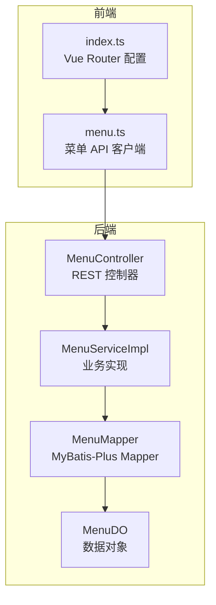
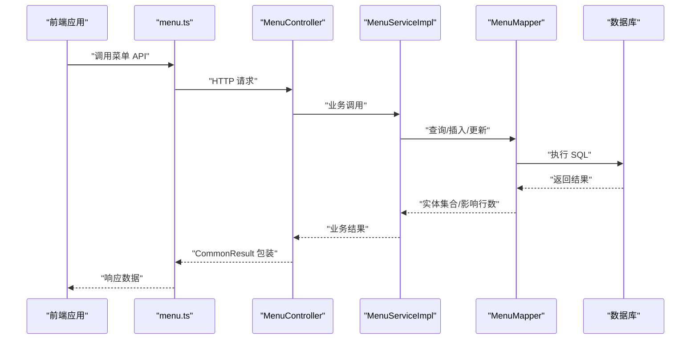
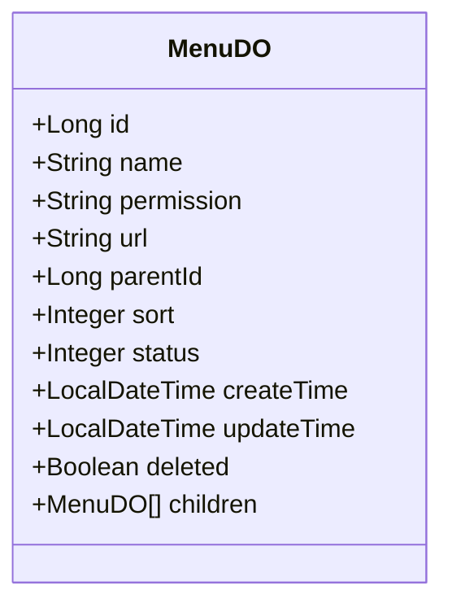
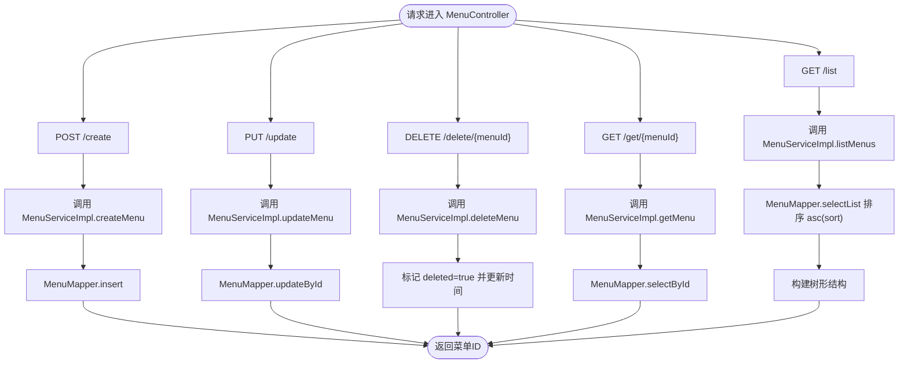
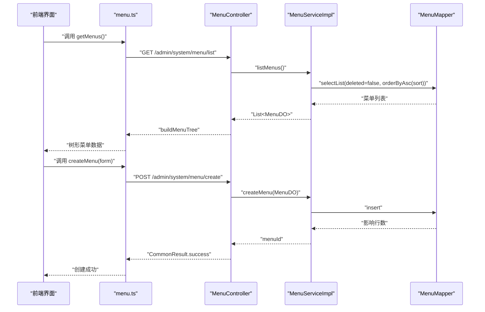
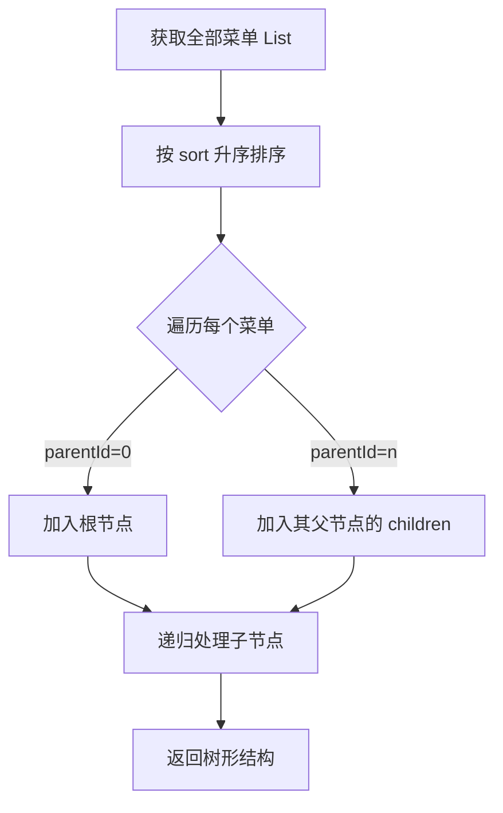
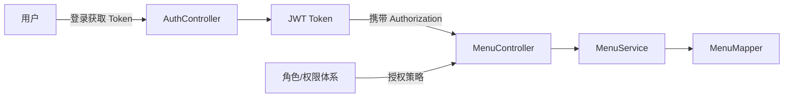
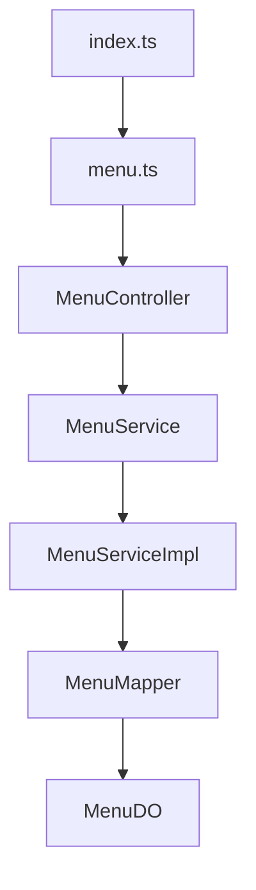

# 菜单管理接口

<!--<cite>
**本文引用的文件**
- [MenuController.java](file://graphiti-module-system/src/main/java/com/graphiti/system/controller/MenuController.java)
- [MenuService.java](file://graphiti-module-system/src/main/java/com/graphiti/system/service/MenuService.java)
- [MenuServiceImpl.java](file://graphiti-module-system/src/main/java/com/graphiti/system/service/impl/MenuServiceImpl.java)
- [MenuDO.java](file://graphiti-module-system/src/main/java/com/graphiti/system/dal/dataobject/MenuDO.java)
- [MenuMapper.java](file://graphiti-module-system/src/main/java/com/graphiti/system/dal/mysql/MenuMapper.java)
- [menu.ts](file://graphiti-web/src/api/menu.ts)
- [index.ts](file://graphiti-web/src/router/index.ts)
- [AuthController.java](file://graphiti-module-system/src/main/java/com/graphiti/system/controller/AuthController.java)
- [RoleService.java](file://graphiti-module-system/src/main/java/com/graphiti/system/service/RoleService.java)
- [RoleDO.java](file://graphiti-module-system/src/main/java/com/graphiti/system/dal/dataobject/RoleDO.java)
</cite>-->

## 目录
1. [简介](#简介)
2. [项目结构](#项目结构)
3. [核心组件](#核心组件)
4. [架构总览](#架构总览)
5. [详细组件分析](#详细组件分析)
6. [依赖关系分析](#依赖关系分析)
7. [性能考虑](#性能考虑)
8. [故障排除指南](#故障排除指南)
9. [结论](#结论)
10. [附录](#附录)

## 简介
本文件为 Graphiti-Java 菜单管理接口的完整 API 文档，覆盖管理后台对系统菜单的树形结构管理能力，包括创建、更新、删除、查询详情、获取树形列表等 REST 接口。文档同时说明菜单层级关系、权限控制与路由配置，提供菜单数据模型与树形结构示例，解释菜单与角色权限的关联机制、动态菜单生成与前端路由映射方式，并包含菜单状态管理、图标配置与权限标识符设置的最佳实践。

## 项目结构
菜单管理功能位于系统模块中，采用典型的分层架构：
- 控制器层：提供 REST API 接口
- 服务层：封装业务逻辑与校验
- 数据访问层：基于 MyBatis-Plus 的 Mapper 接口
- 前端：提供菜单 API 客户端与路由配置

**图表来源**
- [MenuController.java:25-78](file://graphiti-module-system/src/main/java/com/graphiti/system/controller/MenuController.java#L25-L78)
- [MenuServiceImpl.java:20-80](file://graphiti-module-system/src/main/java/com/graphiti/system/service/impl/MenuServiceImpl.java#L20-L80)
- [MenuMapper.java:10-12](file://graphiti-module-system/src/main/java/com/graphiti/system/dal/mysql/MenuMapper.java#L10-L12)
- [MenuDO.java:17-44](file://graphiti-module-system/src/main/java/com/graphiti/system/dal/dataobject/MenuDO.java#L17-L44)
- [menu.ts:57-144](file://graphiti-web/src/api/menu.ts#L57-L144)
- [index.ts:1-233](file://graphiti-web/src/router/index.ts#L1-L233)

**章节来源**
- [MenuController.java:17-78](file://graphiti-module-system/src/main/java/com/graphiti/system/controller/MenuController.java#L17-L78)
- [MenuServiceImpl.java:14-80](file://graphiti-module-system/src/main/java/com/graphiti/system/service/impl/MenuServiceImpl.java#L14-L80)
- [menu.ts:1-148](file://graphiti-web/src/api/menu.ts#L1-L148)
- [index.ts:1-233](file://graphiti-web/src/router/index.ts#L1-L233)

## 核心组件
- 菜单控制器：提供菜单的增删改查与树形列表接口，统一鉴权要求为 Bearer Token。
- 菜单服务接口与实现：负责权限标识重复性校验、软删除、排序查询与按权限标识查询。
- 菜单数据对象：定义菜单字段，包含名称、权限标识、URL、父级 ID、排序、状态、时间戳与软删除标记；children 字段用于树形渲染。
- 菜单 Mapper：继承 MyBatis-Plus 基类，提供通用 CRUD 能力。
- 前端菜单 API：提供树形列表、扁平列表、详情、创建、更新、删除、状态更新等方法，并进行后端数据模型映射。
- 路由配置：定义系统菜单管理页面路由，配合认证守卫实现权限控制。

**章节来源**
- [MenuController.java:25-78](file://graphiti-module-system/src/main/java/com/graphiti/system/controller/MenuController.java#L25-L78)
- [MenuService.java:8-48](file://graphiti-module-system/src/main/java/com/graphiti/system/service/MenuService.java#L8-L48)
- [MenuServiceImpl.java:24-80](file://graphiti-module-system/src/main/java/com/graphiti/system/service/impl/MenuServiceImpl.java#L24-L80)
- [MenuDO.java:17-44](file://graphiti-module-system/src/main/java/com/graphiti/system/dal/dataobject/MenuDO.java#L17-L44)
- [MenuMapper.java:10-12](file://graphiti-module-system/src/main/java/com/graphiti/system/dal/mysql/MenuMapper.java#L10-L12)
- [menu.ts:38-144](file://graphiti-web/src/api/menu.ts#L38-L144)
- [index.ts:87-93](file://graphiti-web/src/router/index.ts#L87-L93)

## 架构总览
菜单管理的请求流程遵循标准的 MVC 分层设计，前端通过 API 客户端调用后端控制器，控制器委托服务层执行业务逻辑，服务层通过 Mapper 访问数据库，最终返回树形结构或单项结果。

**图表来源**
- [menu.ts:57-144](file://graphiti-web/src/api/menu.ts#L57-L144)
- [MenuController.java:30-70](file://graphiti-module-system/src/main/java/com/graphiti/system/controller/MenuController.java#L30-L70)
- [MenuServiceImpl.java:24-80](file://graphiti-module-system/src/main/java/com/graphiti/system/service/impl/MenuServiceImpl.java#L24-L80)
- [MenuMapper.java:10-12](file://graphiti-module-system/src/main/java/com/graphiti/system/dal/mysql/MenuMapper.java#L10-L12)

## 详细组件分析

### 菜单数据模型
菜单数据对象包含以下关键字段：
- 主键与基础信息：id、name、permission、url、parentId、sort、status
- 时间与状态：createTime、updateTime、deleted
- 子节点：children（仅用于树形渲染，不持久化）

**图表来源**
- [MenuDO.java:17-44](file://graphiti-module-system/src/main/java/com/graphiti/system/dal/dataobject/MenuDO.java#L17-L44)

**章节来源**
- [MenuDO.java:17-44](file://graphiti-module-system/src/main/java/com/graphiti/system/dal/dataobject/MenuDO.java#L17-L44)

### 后端 API 定义
- 创建菜单
  - 方法：POST
  - 路径：/api/v1/admin/system/menu/create
  - 请求体：MenuDO（除主键外）
  - 返回：CommonResult<Long>（菜单ID）
- 更新菜单
  - 方法：PUT
  - 路径：/api/v1/admin/system/menu/update
  - 请求体：MenuDO（需包含 id）
  - 返回：CommonResult<Boolean>
- 删除菜单
  - 方法：DELETE
  - 路径：/api/v1/admin/system/menu/delete/{menuId}
  - 路径参数：menuId（Long）
  - 返回：CommonResult<Boolean>
- 获取菜单详情
  - 方法：GET
  - 路径：/api/v1/admin/system/menu/get/{menuId}
  - 路径参数：menuId（Long）
  - 返回：CommonResult<MenuDO>
- 获取菜单树形列表
  - 方法：GET
  - 路径：/api/v1/admin/system/menu/list
  - 返回：CommonResult<List<MenuDO>>（树形结构）

**图表来源**
- [MenuController.java:30-70](file://graphiti-module-system/src/main/java/com/graphiti/system/controller/MenuController.java#L30-L70)
- [MenuServiceImpl.java:24-80](file://graphiti-module-system/src/main/java/com/graphiti/system/service/impl/MenuServiceImpl.java#L24-L80)
- [MenuMapper.java:10-12](file://graphiti-module-system/src/main/java/com/graphiti/system/dal/mysql/MenuMapper.java#L10-L12)

**章节来源**
- [MenuController.java:30-70](file://graphiti-module-system/src/main/java/com/graphiti/system/controller/MenuController.java#L30-L70)
- [MenuService.java:8-48](file://graphiti-module-system/src/main/java/com/graphiti/system/service/MenuService.java#L8-L48)
- [MenuServiceImpl.java:24-80](file://graphiti-module-system/src/main/java/com/graphiti/system/service/impl/MenuServiceImpl.java#L24-L80)

### 前端 API 与路由映射
- 前端菜单 API 客户端提供：
  - 获取树形菜单列表
  - 获取扁平菜单列表（用于父级选择）
  - 获取菜单详情
  - 创建菜单（字段映射：name、permission、url、parentId、sort、status、deleted=false）
  - 更新菜单（字段映射：id、name、permission、url、parentId、sort、status）
  - 删除菜单
  - 更新状态
- 前端路由配置包含“菜单管理”页面路由，meta 中设置 requiresAuth 以启用认证守卫。

**图表来源**
- [menu.ts:62-112](file://graphiti-web/src/api/menu.ts#L62-L112)
- [MenuController.java:64-70](file://graphiti-module-system/src/main/java/com/graphiti/system/controller/MenuController.java#L64-L70)
- [MenuServiceImpl.java:73-79](file://graphiti-module-system/src/main/java/com/graphiti/system/service/impl/MenuServiceImpl.java#L73-L79)

**章节来源**
- [menu.ts:57-144](file://graphiti-web/src/api/menu.ts#L57-L144)
- [index.ts:87-93](file://graphiti-web/src/router/index.ts#L87-L93)

### 菜单层级关系与树形构建
- 层级关系：通过 parentId 关联父子节点，根节点 parentId 通常为 0 或空。
- 树形构建：后端在获取列表时，先按 sort 升序排列，再递归筛选 children，形成树形结构。
- 前端映射：后端 MenuDO 缺失 type/icon/component 等字段时，前端将其映射为默认值或空字符串，确保 UI 渲染兼容。

**图表来源**
- [MenuController.java:72-77](file://graphiti-module-system/src/main/java/com/graphiti/system/controller/MenuController.java#L72-L77)
- [MenuServiceImpl.java:73-79](file://graphiti-module-system/src/main/java/com/graphiti/system/service/impl/MenuServiceImpl.java#L73-L79)
- [menu.ts:39-54](file://graphiti-web/src/api/menu.ts#L39-L54)

**章节来源**
- [MenuController.java:72-77](file://graphiti-module-system/src/main/java/com/graphiti/system/controller/MenuController.java#L72-L77)
- [menu.ts:39-54](file://graphiti-web/src/api/menu.ts#L39-L54)

### 权限控制与角色关联
- 认证：所有菜单管理接口均需要 Bearer Token 认证。
- 权限标识：菜单的 permission 字段作为权限标识符，用于前端按钮级权限与后端资源授权。
- 角色管理：系统提供角色管理接口，角色与菜单的关联可通过角色权限体系实现（具体关联表与流程以实际数据库结构为准）。

**图表来源**
- [AuthController.java:27-32](file://graphiti-module-system/src/main/java/com/graphiti/system/controller/AuthController.java#L27-L32)
- [MenuController.java:31-36](file://graphiti-module-system/src/main/java/com/graphiti/system/controller/MenuController.java#L31-L36)
- [RoleService.java:8-48](file://graphiti-module-system/src/main/java/com/graphiti/system/service/RoleService.java#L8-L48)
- [RoleDO.java:17-31](file://graphiti-module-system/src/main/java/com/graphiti/system/dal/dataobject/RoleDO.java#L17-L31)

**章节来源**
- [AuthController.java:27-32](file://graphiti-module-system/src/main/java/com/graphiti/system/controller/AuthController.java#L27-L32)
- [RoleService.java:8-48](file://graphiti-module-system/src/main/java/com/graphiti/system/service/RoleService.java#L8-L48)
- [RoleDO.java:17-31](file://graphiti-module-system/src/main/java/com/graphiti/system/dal/dataobject/RoleDO.java#L17-L31)

### 动态菜单生成与前端路由映射
- 动态菜单：后端提供树形菜单列表，前端根据返回的菜单结构动态渲染侧边栏与面包屑。
- 路由映射：前端路由配置中包含“菜单管理”页面路由，meta.requiresAuth 为 true，结合全局路由守卫实现登录态与权限校验。
- 菜单到路由：后端 MenuDO 的 url 字段可映射到前端路由 path；前端 component 字段在后端不存在时，前端通过懒加载组件实现页面映射。

**章节来源**
- [menu.ts:46-49](file://graphiti-web/src/api/menu.ts#L46-L49)
- [index.ts:87-93](file://graphiti-web/src/router/index.ts#L87-L93)

## 依赖关系分析
- 控制器依赖服务接口，服务实现依赖 Mapper 接口，Mapper 继承自 MyBatis-Plus 基类。
- 前端 API 客户端依赖后端控制器提供的路径与数据模型。
- 路由守卫依赖认证 API 与用户状态管理。

**图表来源**
- [MenuController.java:27-28](file://graphiti-module-system/src/main/java/com/graphiti/system/controller/MenuController.java#L27-L28)
- [MenuService.java:8-48](file://graphiti-module-system/src/main/java/com/graphiti/system/service/MenuService.java#L8-L48)
- [MenuServiceImpl.java:22-22](file://graphiti-module-system/src/main/java/com/graphiti/system/service/impl/MenuServiceImpl.java#L22-L22)
- [MenuMapper.java:10-12](file://graphiti-module-system/src/main/java/com/graphiti/system/dal/mysql/MenuMapper.java#L10-L12)
- [MenuDO.java:17-44](file://graphiti-module-system/src/main/java/com/graphiti/system/dal/dataobject/MenuDO.java#L17-L44)
- [menu.ts:57-144](file://graphiti-web/src/api/menu.ts#L57-L144)
- [index.ts:185-230](file://graphiti-web/src/router/index.ts#L185-L230)

**章节来源**
- [MenuController.java:27-28](file://graphiti-module-system/src/main/java/com/graphiti/system/controller/MenuController.java#L27-L28)
- [MenuServiceImpl.java:22-22](file://graphiti-module-system/src/main/java/com/graphiti/system/service/impl/MenuServiceImpl.java#L22-L22)
- [menu.ts:57-144](file://graphiti-web/src/api/menu.ts#L57-L144)
- [index.ts:185-230](file://graphiti-web/src/router/index.ts#L185-L230)

## 性能考虑
- 查询优化：后端按 sort 字段升序查询，避免前端二次排序；树形构建为一次遍历完成，复杂度近似 O(n)。
- 软删除：删除菜单时仅标记 deleted=true，减少物理删除带来的索引维护成本。
- 前端缓存：建议在前端对菜单树进行本地缓存，减少重复请求；结合路由懒加载提升首屏性能。
- 权限过滤：前端在渲染时可根据用户权限标识过滤不可见菜单项，降低无用渲染。

## 故障排除指南
- 权限标识冲突：创建菜单时若 permission 已存在，将抛出业务异常。请检查权限标识唯一性。
- 菜单不存在：根据 menuId 查询不到菜单时，需确认菜单是否存在或已被软删除。
- 接口鉴权失败：所有菜单管理接口均需 Bearer Token，请确认登录状态与 Token 有效性。
- 路由无法访问：如访问“菜单管理”页面提示 401，请检查路由守卫与认证状态。

**章节来源**
- [MenuServiceImpl.java:26-30](file://graphiti-module-system/src/main/java/com/graphiti/system/service/impl/MenuServiceImpl.java#L26-L30)
- [AuthController.java:37-42](file://graphiti-module-system/src/main/java/com/graphiti/system/controller/AuthController.java#L37-L42)
- [index.ts:185-230](file://graphiti-web/src/router/index.ts#L185-L230)

## 结论
Graphiti-Java 的菜单管理接口提供了完善的树形结构管理能力，结合权限标识与角色体系，能够满足系统管理员对菜单的全生命周期管理需求。前后端通过清晰的数据模型与 API 约定协作，既保证了功能完整性，也兼顾了性能与可维护性。建议在生产环境中配合路由守卫与权限策略，确保菜单访问的安全性与一致性。

## 附录

### API 参考清单
- 创建菜单
  - 方法：POST
  - 路径：/api/v1/admin/system/menu/create
  - 请求体：MenuDO（除主键外）
  - 返回：CommonResult<Long>
- 更新菜单
  - 方法：PUT
  - 路径：/api/v1/admin/system/menu/update
  - 请求体：MenuDO（需包含 id）
  - 返回：CommonResult<Boolean>
- 删除菜单
  - 方法：DELETE
  - 路径：/api/v1/admin/system/menu/delete/{menuId}
  - 路径参数：menuId（Long）
  - 返回：CommonResult<Boolean>
- 获取菜单详情
  - 方法：GET
  - 路径：/api/v1/admin/system/menu/get/{menuId}
  - 路径参数：menuId（Long）
  - 返回：CommonResult<MenuDO>
- 获取菜单树形列表
  - 方法：GET
  - 路径：/api/v1/admin/system/menu/list
  - 返回：CommonResult<List<MenuDO>>

**章节来源**
- [MenuController.java:30-70](file://graphiti-module-system/src/main/java/com/graphiti/system/controller/MenuController.java#L30-L70)

### 菜单数据模型字段说明
- id：菜单主键
- name：菜单名称
- permission：权限标识符（用于前端按钮级权限与后端资源授权）
- url：菜单对应的前端路由路径
- parentId：父级菜单 ID（0 表示根节点）
- sort：排序权重（升序）
- status：状态（0-禁用，1-启用）
- createTime/updateTime：创建与更新时间
- deleted：软删除标记
- children：子节点集合（仅用于树形渲染）

**章节来源**
- [MenuDO.java:20-43](file://graphiti-module-system/src/main/java/com/graphiti/system/dal/dataobject/MenuDO.java#L20-L43)