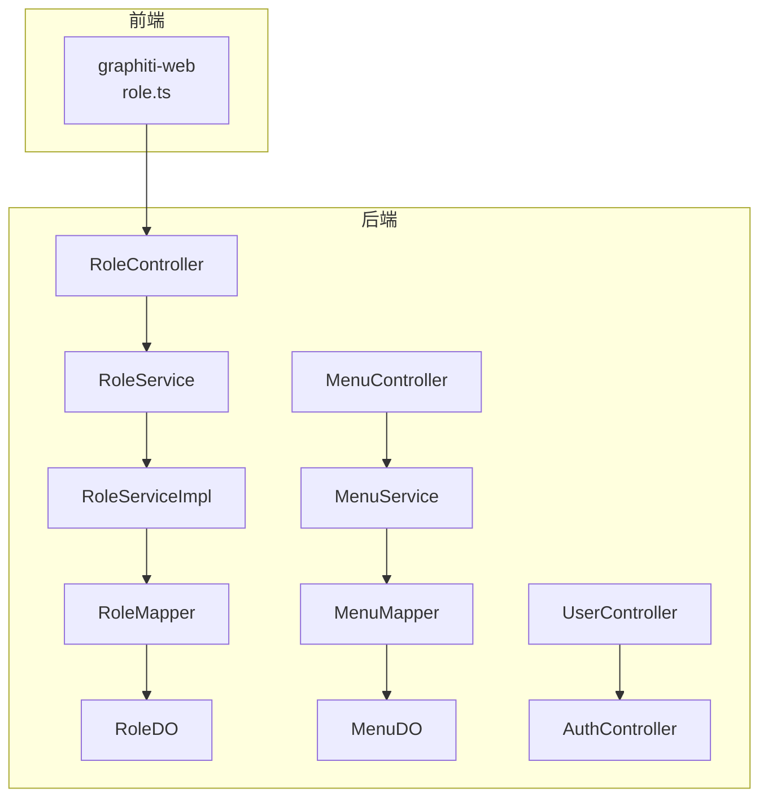
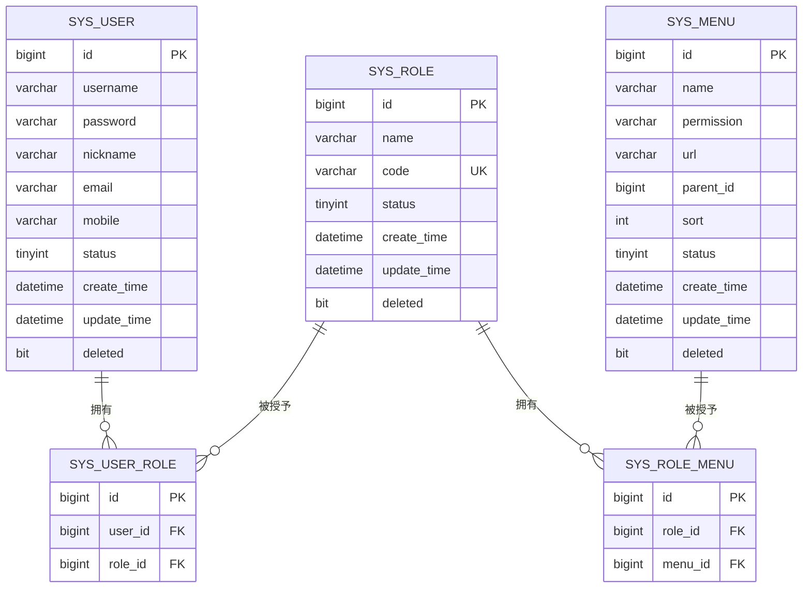
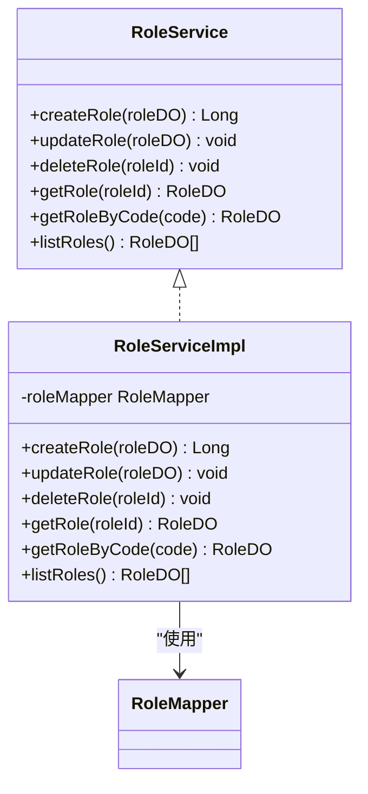
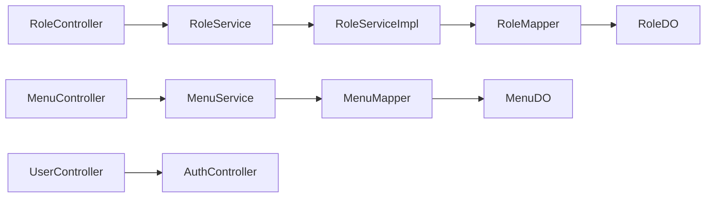

# 角色管理接口

<!--<cite>
**本文档引用的文件**
- [RoleController.java](file://graphiti-module-system/src/main/java/com/graphiti/system/controller/RoleController.java)
- [RoleService.java](file://graphiti-module-system/src/main/java/com/graphiti/system/service/RoleService.java)
- [RoleServiceImpl.java](file://graphiti-module-system/src/main/java/com/graphiti/system/service/impl/RoleServiceImpl.java)
- [RoleDO.java](file://graphiti-module-system/src/main/java/com/graphiti/system/dal/dataobject/RoleDO.java)
- [RoleMapper.java](file://graphiti-module-system/src/main/java/com/graphiti/system/dal/mysql/RoleMapper.java)
- [MenuDO.java](file://graphiti-module-system/src/main/java/com/graphiti/system/dal/dataobject/MenuDO.java)
- [MenuMapper.java](file://graphiti-module-system/src/main/java/com/graphiti/system/dal/mysql/MenuMapper.java)
- [UserController.java](file://graphiti-module-system/src/main/java/com/graphiti/system/controller/UserController.java)
- [AuthController.java](file://graphiti-module-system/src/main/java/com/graphiti/system/controller/AuthController.java)
- [schema.sql](file://sql/mysql/schema.sql)
- [role.ts](file://graphiti-web/src/api/role.ts)
</cite>-->

## 目录
1. [简介](#简介)
2. [项目结构](#项目结构)
3. [核心组件](#核心组件)
4. [架构总览](#架构总览)
5. [详细组件分析](#详细组件分析)
6. [依赖关系分析](#依赖关系分析)
7. [性能考虑](#性能考虑)
8. [故障排除指南](#故障排除指南)
9. [结论](#结论)
10. [附录](#附录)

## 简介
本文件为 Graphiti-Java 的角色管理接口提供全面的 API 文档，覆盖角色 CRUD 操作、权限分配、状态管理与层级关系。系统采用 RBAC 权限模型，角色与菜单通过中间表关联，支持角色与用户的多对多关系。本文档面向系统管理员，提供完整的端点说明、数据模型定义、请求/响应示例以及最佳实践。

## 项目结构
角色管理模块位于系统模块中，采用典型的分层架构：
- 控制器层：对外暴露 REST API
- 服务层：封装业务逻辑与校验
- 数据访问层：MyBatis-Plus Mapper 接口
- 数据对象层：DO 对象映射数据库表
- 前端 API 封装：统一调用后端接口

图表来源
- [RoleController.java:20-70](file://graphiti-module-system/src/main/java/com/graphiti/system/controller/RoleController.java#L20-L70)
- [RoleServiceImpl.java:17-80](file://graphiti-module-system/src/main/java/com/graphiti/system/service/impl/RoleServiceImpl.java#L17-L80)
- [RoleMapper.java:10-12](file://graphiti-module-system/src/main/java/com/graphiti/system/dal/mysql/RoleMapper.java#L10-L12)
- [RoleDO.java:12-31](file://graphiti-module-system/src/main/java/com/graphiti/system/dal/dataobject/RoleDO.java#L12-L31)
- [MenuDO.java:15-44](file://graphiti-module-system/src/main/java/com/graphiti/system/dal/dataobject/MenuDO.java#L15-L44)
- [MenuMapper.java:10-12](file://graphiti-module-system/src/main/java/com/graphiti/system/dal/mysql/MenuMapper.java#L10-L12)
- [UserController.java:20-74](file://graphiti-module-system/src/main/java/com/graphiti/system/controller/UserController.java#L20-L74)
- [AuthController.java:16-54](file://graphiti-module-system/src/main/java/com/graphiti/system/controller/AuthController.java#L16-L54)

章节来源
- [RoleController.java:17-70](file://graphiti-module-system/src/main/java/com/graphiti/system/controller/RoleController.java#L17-L70)
- [RoleServiceImpl.java:14-80](file://graphiti-module-system/src/main/java/com/graphiti/system/service/impl/RoleServiceImpl.java#L14-L80)
- [schema.sql:30-86](file://sql/mysql/schema.sql#L30-L86)

## 核心组件
- 角色控制器：提供角色的创建、更新、删除、详情查询、列表查询等 REST 端点
- 角色服务接口与实现：封装业务规则（如角色编码唯一性）、调用持久层
- 角色数据对象与 Mapper：映射 sys_role 表，提供基础 CRUD 能力
- 菜单数据对象与 Mapper：提供菜单树形结构与权限标识
- 用户与认证控制器：支撑角色与用户的关联及登录流程

章节来源
- [RoleController.java:25-70](file://graphiti-module-system/src/main/java/com/graphiti/system/controller/RoleController.java#L25-L70)
- [RoleService.java:8-48](file://graphiti-module-system/src/main/java/com/graphiti/system/service/RoleService.java#L8-L48)
- [RoleServiceImpl.java:20-80](file://graphiti-module-system/src/main/java/com/graphiti/system/service/impl/RoleServiceImpl.java#L20-L80)
- [RoleDO.java:12-31](file://graphiti-module-system/src/main/java/com/graphiti/system/dal/dataobject/RoleDO.java#L12-L31)
- [MenuDO.java:15-44](file://graphiti-module-system/src/main/java/com/graphiti/system/dal/dataobject/MenuDO.java#L15-L44)

## 架构总览
角色管理遵循 RBAC 模型，核心关系如下：
- 角色（sys_role）：包含角色名称、编码、状态、时间戳与软删除字段
- 用户（sys_user）：用户基本信息
- 用户角色关联（sys_user_role）：多对多关系
- 菜单（sys_menu）：菜单树形结构与权限标识
- 角色菜单关联（sys_role_menu）：角色拥有的菜单集合

图表来源
- [schema.sql:30-86](file://sql/mysql/schema.sql#L30-L86)

## 详细组件分析

### 角色控制器（RoleController）
- 端点设计
  - POST /api/v1/admin/system/role/create：创建角色
  - PUT /api/v1/admin/system/role/update：更新角色
  - DELETE /api/v1/admin/system/role/delete/{roleId}：逻辑删除角色
  - GET /api/v1/admin/system/role/get/{roleId}：获取角色详情
  - GET /api/v1/admin/system/role/list：获取角色列表（全量）
- 安全要求：均需 Bearer Token 认证
- 返回格式：统一使用 CommonResult 包裹

章节来源
- [RoleController.java:25-70](file://graphiti-module-system/src/main/java/com/graphiti/system/controller/RoleController.java#L25-L70)

### 角色服务（RoleService/RoleServiceImpl）
- 业务规则
  - 创建角色前检查角色编码唯一性
  - 更新时自动填充更新时间
  - 删除采用软删除（设置 deleted=true）
  - 列表查询默认排除已删除记录并按创建时间倒序
- 关键方法
  - createRole(RoleDO)：返回新角色 ID
  - updateRole(RoleDO)：无返回值
  - deleteRole(Long)：无返回值
  - getRole(Long)/getRoleByCode(String)：查询单个角色
  - listRoles()：查询未删除角色列表

图表来源
- [RoleService.java:8-48](file://graphiti-module-system/src/main/java/com/graphiti/system/service/RoleService.java#L8-L48)
- [RoleServiceImpl.java:17-80](file://graphiti-module-system/src/main/java/com/graphiti/system/service/impl/RoleServiceImpl.java#L17-L80)
- [RoleMapper.java:10-12](file://graphiti-module-system/src/main/java/com/graphiti/system/dal/mysql/RoleMapper.java#L10-L12)

章节来源
- [RoleService.java:8-48](file://graphiti-module-system/src/main/java/com/graphiti/system/service/RoleService.java#L8-L48)
- [RoleServiceImpl.java:20-80](file://graphiti-module-system/src/main/java/com/graphiti/system/service/impl/RoleServiceImpl.java#L20-L80)

### 数据模型与数据库表
- 角色数据对象（RoleDO）
  - 字段：id、name、code、status、createTime、updateTime、deleted
  - 约束：code 唯一；deleted 软删除
- 菜单数据对象（MenuDO）
  - 字段：id、name、permission、url、parentId、sort、status、createTime、updateTime、deleted
  - 扩展：children（树形子节点，仅用于序列化时携带）

章节来源
- [RoleDO.java:12-31](file://graphiti-module-system/src/main/java/com/graphiti/system/dal/dataobject/RoleDO.java#L12-L31)
- [MenuDO.java:15-44](file://graphiti-module-system/src/main/java/com/graphiti/system/dal/dataobject/MenuDO.java#L15-L44)
- [schema.sql:30-86](file://sql/mysql/schema.sql#L30-L86)

### 权限体系与角色层级
- RBAC 概念
  - 角色：权限的集合
  - 菜单：权限的载体，具备 permission 标识
  - 用户：可拥有多个角色
- 角色与菜单
  - 通过 sys_role_menu 关联，一个角色可拥有多个菜单
  - 前端 role.ts 中的 RoleForm 包含 menuIds 字段，用于角色授权菜单
- 角色与用户
  - 通过 sys_user_role 关联，实现用户的角色分配
  - 用户登录后，系统可根据其角色集合计算可访问的菜单与权限

章节来源
- [schema.sql:46-86](file://sql/mysql/schema.sql#L46-L86)
- [role.ts:23-30](file://graphiti-web/src/api/role.ts#L23-L30)

### API 请求/响应示例

- 创建角色
  - 方法：POST
  - 路径：/api/v1/admin/system/role/create
  - 请求体：RoleDO（name、code、status、description、deleted=false）
  - 响应：CommonResult<Long>，包含新角色 ID
  - 示例路径：[RoleController.java:30-36](file://graphiti-module-system/src/main/java/com/graphiti/system/controller/RoleController.java#L30-L36)

- 更新角色
  - 方法：PUT
  - 路径：/api/v1/admin/system/role/update
  - 请求体：RoleDO（id 必填，其他字段可选）
  - 响应：CommonResult<Boolean>，true 表示成功
  - 示例路径：[RoleController.java:38-44](file://graphiti-module-system/src/main/java/com/graphiti/system/controller/RoleController.java#L38-L44)

- 删除角色
  - 方法：DELETE
  - 路径：/api/v1/admin/system/role/delete/{roleId}
  - 路径参数：roleId（Long）
  - 响应：CommonResult<Boolean>，true 表示成功
  - 示例路径：[RoleController.java:46-53](file://graphiti-module-system/src/main/java/com/graphiti/system/controller/RoleController.java#L46-L53)

- 获取角色详情
  - 方法：GET
  - 路径：/api/v1/admin/system/role/get/{roleId}
  - 路径参数：roleId（Long）
  - 响应：CommonResult<RoleDO>
  - 示例路径：[RoleController.java:55-62](file://graphiti-module-system/src/main/java/com/graphiti/system/controller/RoleController.java#L55-L62)

- 获取角色列表
  - 方法：GET
  - 路径：/api/v1/admin/system/role/list
  - 查询参数：无
  - 响应：CommonResult<List<RoleDO>>
  - 示例路径：[RoleController.java:64-69](file://graphiti-module-system/src/main/java/com/graphiti/system/controller/RoleController.java#L64-L69)

- 角色状态管理（前端常用）
  - 方法：PUT
  - 路径：/api/v1/admin/system/role/update
  - 请求体：{ id, status }（仅传入需要变更的字段）
  - 响应：CommonResult<Boolean>
  - 示例路径：[role.ts:136-142](file://graphiti-web/src/api/role.ts#L136-L142)

章节来源
- [RoleController.java:30-69](file://graphiti-module-system/src/main/java/com/graphiti/system/controller/RoleController.java#L30-L69)
- [role.ts:99-142](file://graphiti-web/src/api/role.ts#L99-L142)

### 角色与用户的关联管理
- 用户与角色的多对多关系通过 sys_user_role 维护
- 用户登录后，系统可基于用户的角色集合进行权限判定
- 前端可通过用户管理接口获取用户详情与状态，结合角色管理完成用户授权

章节来源
- [schema.sql:46-55](file://sql/mysql/schema.sql#L46-L55)
- [UserController.java:24-74](file://graphiti-module-system/src/main/java/com/graphiti/system/controller/UserController.java#L24-L74)
- [AuthController.java:16-54](file://graphiti-module-system/src/main/java/com/graphiti/system/controller/AuthController.java#L16-L54)

### 角色权限的动态授权与撤销
- 动态授权：通过角色授权菜单（sys_role_menu），前端 role.ts 的 RoleForm 包含 menuIds 字段，后端在更新角色时可接收并持久化该字段
- 撤销授权：将角色不再关联的菜单从 sys_role_menu 中移除即可
- 权限生效：用户登录后，系统根据其角色集合合并菜单权限，实现动态授权

章节来源
- [schema.sql:76-86](file://sql/mysql/schema.sql#L76-L86)
- [role.ts:23-30](file://graphiti-web/src/api/role.ts#L23-L30)

## 依赖关系分析

图表来源
- [RoleController.java:25-28](file://graphiti-module-system/src/main/java/com/graphiti/system/controller/RoleController.java#L25-L28)
- [RoleServiceImpl.java:22-22](file://graphiti-module-system/src/main/java/com/graphiti/system/service/impl/RoleServiceImpl.java#L22-L22)
- [MenuMapper.java:10-12](file://graphiti-module-system/src/main/java/com/graphiti/system/dal/mysql/MenuMapper.java#L10-L12)
- [UserController.java:26-27](file://graphiti-module-system/src/main/java/com/graphiti/system/controller/UserController.java#L26-L27)
- [AuthController.java:20-21](file://graphiti-module-system/src/main/java/com/graphiti/system/controller/AuthController.java#L20-L21)

章节来源
- [RoleController.java:25-28](file://graphiti-module-system/src/main/java/com/graphiti/system/controller/RoleController.java#L25-L28)
- [RoleServiceImpl.java:22-22](file://graphiti-module-system/src/main/java/com/graphiti/system/service/impl/RoleServiceImpl.java#L22-L22)
- [MenuMapper.java:10-12](file://graphiti-module-system/src/main/java/com/graphiti/system/dal/mysql/MenuMapper.java#L10-L12)
- [UserController.java:26-27](file://graphiti-module-system/src/main/java/com/graphiti/system/controller/UserController.java#L26-L27)
- [AuthController.java:20-21](file://graphiti-module-system/src/main/java/com/graphiti/system/controller/AuthController.java#L20-L21)

## 性能考虑
- 列表查询：后端返回全量角色列表，前端进行分页与过滤，避免数据库压力过大
- 软删除：删除角色采用软删除，便于审计与恢复
- 索引优化：角色编码 code 建有唯一索引；用户角色与角色菜单关联表建有联合唯一索引与普通索引，提升查询效率
- 缓存建议：对于高频读取的角色与菜单数据，可在服务层增加缓存策略

章节来源
- [schema.sql:30-86](file://sql/mysql/schema.sql#L30-L86)
- [role.ts:53-78](file://graphiti-web/src/api/role.ts#L53-L78)

## 故障排除指南
- 角色编码重复
  - 现象：创建角色时报错“角色编码已存在”
  - 处理：更换唯一编码后重试
  - 参考：[RoleServiceImpl.java:26-30](file://graphiti-module-system/src/main/java/com/graphiti/system/service/impl/RoleServiceImpl.java#L26-L30)
- 未提供 Bearer Token
  - 现象：401 未授权
  - 处理：先调用登录接口获取 JWT，再在请求头添加 Authorization: Bearer <token>
  - 参考：[AuthController.java:27-32](file://graphiti-module-system/src/main/java/com/graphiti/system/controller/AuthController.java#L27-L32)
- 路径参数缺失或类型错误
  - 现象：404 或 400
  - 处理：确认路径参数 roleId 类型为 Long，且存在有效值
  - 参考：[RoleController.java:46-53](file://graphiti-module-system/src/main/java/com/graphiti/system/controller/RoleController.java#L46-L53)

章节来源
- [RoleServiceImpl.java:26-30](file://graphiti-module-system/src/main/java/com/graphiti/system/service/impl/RoleServiceImpl.java#L26-L30)
- [AuthController.java:27-32](file://graphiti-module-system/src/main/java/com/graphiti/system/controller/AuthController.java#L27-L32)
- [RoleController.java:46-53](file://graphiti-module-system/src/main/java/com/graphiti/system/controller/RoleController.java#L46-L53)

## 结论
Graphiti-Java 的角色管理接口以清晰的分层架构实现了 RBAC 权限模型，支持角色的完整生命周期管理与动态授权。通过角色与菜单、用户的关系设计，系统能够灵活地实现权限控制与审计追踪。建议在生产环境中配合缓存与索引策略，进一步提升性能与稳定性。

## 附录

### API 端点一览
- 创建角色：POST /api/v1/admin/system/role/create
- 更新角色：PUT /api/v1/admin/system/role/update
- 删除角色：DELETE /api/v1/admin/system/role/delete/{roleId}
- 获取角色详情：GET /api/v1/admin/system/role/get/{roleId}
- 获取角色列表：GET /api/v1/admin/system/role/list

章节来源
- [RoleController.java:30-69](file://graphiti-module-system/src/main/java/com/graphiti/system/controller/RoleController.java#L30-L69)