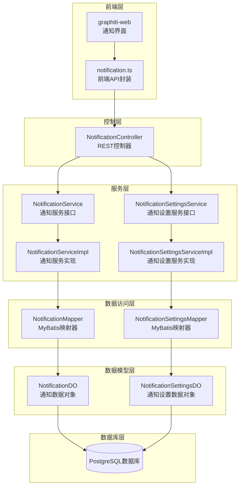
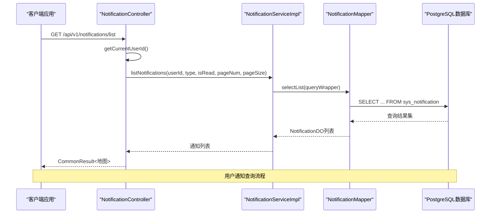
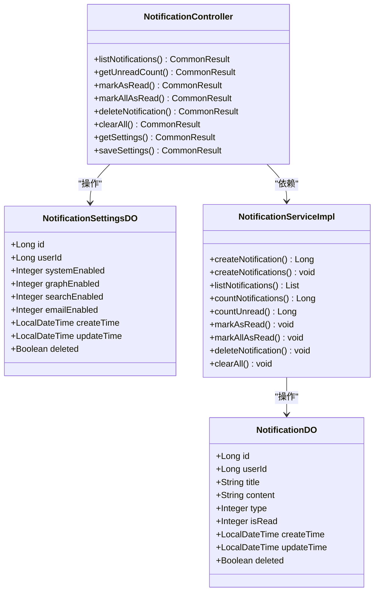
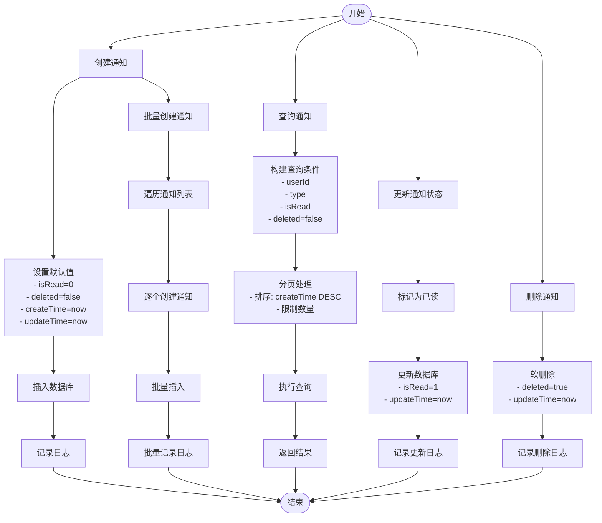
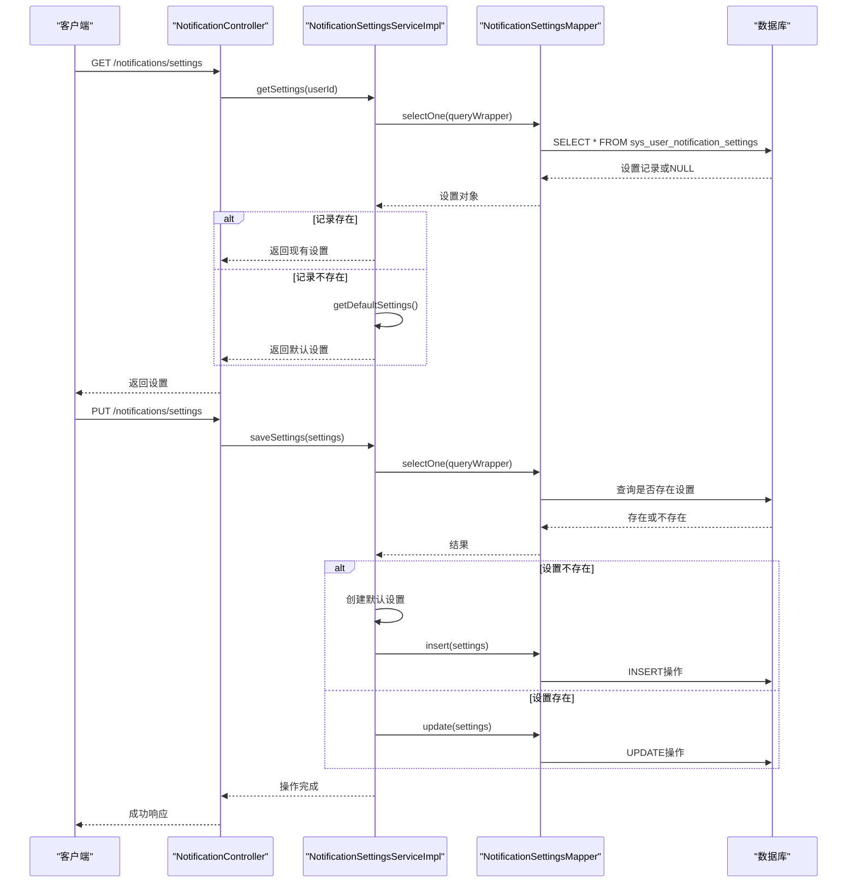
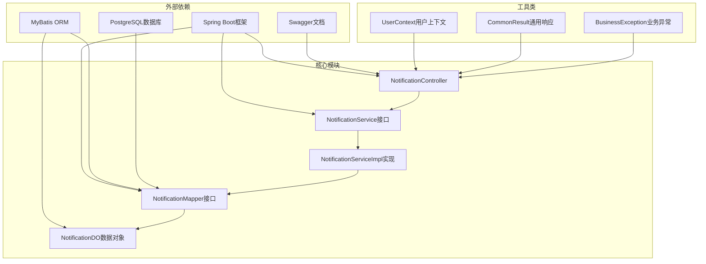

# 通知管理接口

<!--<cite>
**本文档引用的文件**
- [NotificationController.java](file://graphiti-module-system/src/main/java/com/graphiti/system/controller/NotificationController.java)
- [NotificationService.java](file://graphiti-module-system/src/main/java/com/graphiti/system/service/NotificationService.java)
- [NotificationServiceImpl.java](file://graphiti-module-system/src/main/java/com/graphiti/system/service/impl/NotificationServiceImpl.java)
- [NotificationDO.java](file://graphiti-module-system/src/main/java/com/graphiti/system/dal/dataobject/NotificationDO.java)
- [NotificationMapper.java](file://graphiti-module-system/src/main/java/com/graphiti/system/dal/mysql/NotificationMapper.java)
- [NotificationSettingsDO.java](file://graphiti-module-system/src/main/java/com/graphiti/system/dal/dataobject/NotificationSettingsDO.java)
- [NotificationSettingsService.java](file://graphiti-module-system/src/main/java/com/graphiti/system/service/NotificationSettingsService.java)
- [NotificationSettingsServiceImpl.java](file://graphiti-module-system/src/main/java/com/graphiti/system/service/impl/NotificationSettingsServiceImpl.java)
- [NotificationSettingsMapper.java](file://graphiti-module-system/src/main/java/com/graphiti/system/dal/mysql/NotificationSettingsMapper.java)
- [V2__create_notification_tables.sql](file://sql/postgresql/V2__create_notification_tables.sql)
- [notification.ts](file://graphiti-web/src/api/notification.ts)
</cite>-->

## 目录
1. [简介](#简介)
2. [项目结构](#项目结构)
3. [核心组件](#核心组件)
4. [架构概览](#架构概览)
5. [详细组件分析](#详细组件分析)
6. [依赖关系分析](#依赖关系分析)
7. [性能考虑](#性能考虑)
8. [故障排除指南](#故障排除指南)
9. [结论](#结论)
10. [附录](#附录)

## 简介

ontograph-java 通知管理接口是一个完整的系统通知解决方案，提供了站内信、系统公告和消息推送的通知机制。该接口支持通知的创建、查询、状态更新和模板管理功能，包含通知阅读状态跟踪、通知分类管理和用户偏好设置。

系统采用分层架构设计，包含控制层、服务层、数据访问层和数据库层，确保了良好的可维护性和扩展性。通知数据模型支持多种通知类型，包括系统通知、图谱通知和检索通知，满足不同场景下的通知需求。

## 项目结构

通知管理模块在Graphiti-Java项目中采用标准的分层架构组织：



**图表来源**
- [NotificationController.java:24-28](file://graphiti-module-system/src/main/java/com/graphiti/system/controller/NotificationController.java#L24-L28)
- [NotificationService.java:9-77](file://graphiti-module-system/src/main/java/com/graphiti/system/service/NotificationService.java#L9-L77)
- [NotificationServiceImpl.java:22-22](file://graphiti-module-system/src/main/java/com/graphiti/system/service/impl/NotificationServiceImpl.java#L22-L22)

**章节来源**
- [NotificationController.java:24-28](file://graphiti-module-system/src/main/java/com/graphiti/system/controller/NotificationController.java#L24-L28)
- [NotificationService.java:9-77](file://graphiti-module-system/src/main/java/com/graphiti/system/service/NotificationService.java#L9-L77)
- [NotificationServiceImpl.java:22-22](file://graphiti-module-system/src/main/java/com/graphiti/system/service/impl/NotificationServiceImpl.java#L22-L22)

## 核心组件

通知管理接口由以下核心组件构成：

### 控制器层
- **NotificationController**: 提供REST API端点，处理通知相关的HTTP请求
- 支持用户认证和权限控制
- 实现通知列表查询、状态更新、删除操作和设置管理

### 服务层
- **NotificationService**: 定义通知业务逻辑接口
- **NotificationSettingsService**: 定义通知设置业务逻辑接口
- **NotificationServiceImpl**: 实现通知创建、查询、更新等核心功能
- **NotificationSettingsServiceImpl**: 实现通知设置的获取和保存功能

### 数据访问层
- **NotificationMapper**: MyBatis映射器，负责与数据库交互
- **NotificationSettingsMapper**: MyBatis映射器，处理通知设置数据

### 数据模型层
- **NotificationDO**: 通知数据传输对象，包含通知的基本属性
- **NotificationSettingsDO**: 用户通知设置数据对象，管理用户偏好

**章节来源**
- [NotificationController.java:30-40](file://graphiti-module-system/src/main/java/com/graphiti/system/controller/NotificationController.java#L30-L40)
- [NotificationService.java:9-77](file://graphiti-module-system/src/main/java/com/graphiti/system/service/NotificationService.java#L9-L77)
- [NotificationSettingsService.java:8-22](file://graphiti-module-system/src/main/java/com/graphiti/system/service/NotificationSettingsService.java#L8-L22)

## 架构概览

通知管理系统的整体架构采用经典的三层架构模式，确保了关注点分离和代码的可维护性：



**图表来源**
- [NotificationController.java:51-69](file://graphiti-module-system/src/main/java/com/graphiti/system/controller/NotificationController.java#L51-L69)
- [NotificationServiceImpl.java:48-68](file://graphiti-module-system/src/main/java/com/graphiti/system/service/impl/NotificationServiceImpl.java#L48-L68)

系统支持多种通知类型和状态管理，通过统一的接口提供灵活的通知管理能力。

**章节来源**
- [NotificationController.java:51-118](file://graphiti-module-system/src/main/java/com/graphiti/system/controller/NotificationController.java#L51-L118)
- [NotificationServiceImpl.java:26-140](file://graphiti-module-system/src/main/java/com/graphiti/system/service/impl/NotificationServiceImpl.java#L26-L140)

## 详细组件分析

### 通知数据模型

通知系统的核心数据模型基于标准化的数据对象设计：



**图表来源**
- [NotificationDO.java:14-35](file://graphiti-module-system/src/main/java/com/graphiti/system/dal/dataobject/NotificationDO.java#L14-L35)
- [NotificationSettingsDO.java:14-35](file://graphiti-module-system/src/main/java/com/graphiti/system/dal/dataobject/NotificationSettingsDO.java#L14-L35)
- [NotificationController.java:28-139](file://graphiti-module-system/src/main/java/com/graphiti/system/controller/NotificationController.java#L28-L139)

#### 通知类型定义

系统支持三种主要的通知类型：

| 类型编号 | 类型名称 | 描述 |
|---------|----------|------|
| 1 | 系统通知 | 系统级通知，如系统维护、版本更新等 |
| 2 | 图谱通知 | 与知识图谱相关的通知，如图谱构建完成等 |
| 3 | 检索通知 | 与搜索查询相关的通知，如查询结果生成等 |

#### 通知状态管理

通知状态通过二进制标志进行管理：

| 状态值 | 状态名称 | 描述 |
|-------|----------|------|
| 0 | 未读 | 通知尚未被用户查看 |
| 1 | 已读 | 通知已被用户查看 |

**章节来源**
- [NotificationDO.java:20-28](file://graphiti-module-system/src/main/java/com/graphiti/system/dal/dataobject/NotificationDO.java#L20-L28)
- [V2__create_notification_tables.sql:64-68](file://sql/postgresql/V2__create_notification_tables.sql#L64-L68)

### 通知管理API

#### 通知列表查询

**端点**: `GET /api/v1/notifications/list`

**功能**: 分页获取当前用户的通知列表，支持按类型和已读状态筛选

**请求参数**:

| 参数名 | 类型 | 必填 | 描述 | 默认值 |
|--------|------|------|------|--------|
| type | Integer | 否 | 通知类型: 1-系统通知 2-图谱通知 3-检索通知 | 无限制 |
| isRead | Integer | 否 | 已读状态: 0-未读 1-已读 | 无限制 |
| pageNum | Integer | 否 | 页码 | 1 |
| pageSize | Integer | 否 | 每页数量 | 10 |

**响应数据结构**:

```json
{
  "code": 200,
  "message": "操作成功",
  "data": {
    "list": [
      {
        "id": 1,
        "userId": 1001,
        "title": "系统通知标题",
        "content": "通知内容",
        "type": 1,
        "isRead": 0,
        "createTime": "2026-01-01T00:00:00",
        "updateTime": "2026-01-01T00:00:00",
        "deleted": false
      }
    ],
    "total": 1,
    "pageNum": 1,
    "pageSize": 10
  }
}
```

#### 未读通知数量查询

**端点**: `GET /api/v1/notifications/unread-count`

**功能**: 获取当前用户的未读通知数量

**响应数据结构**:

```json
{
  "code": 200,
  "message": "操作成功",
  "data": {
    "count": 5
  }
}
```

#### 标记通知为已读

**端点**: `PUT /api/v1/notifications/{id}/read`

**功能**: 将指定通知标记为已读

**路径参数**:

| 参数名 | 类型 | 必填 | 描述 |
|--------|------|------|------|
| id | Long | 是 | 通知ID |

#### 标记所有通知为已读

**端点**: `PUT /api/v1/notifications/read-all`

**功能**: 将当前用户的所有通知标记为已读

#### 删除通知

**端点**: `DELETE /api/v1/notifications/{id}`

**功能**: 删除指定的单条通知

#### 清空所有通知

**端点**: `DELETE /api/v1/notifications/clear`

**功能**: 清空当前用户的所有通知

#### 获取通知设置

**端点**: `GET /api/v1/notifications/settings`

**功能**: 获取当前用户的通知偏好设置

**响应数据结构**:

```json
{
  "code": 200,
  "message": "操作成功",
  "data": {
    "id": 1,
    "userId": 1001,
    "systemEnabled": 1,
    "graphEnabled": 1,
    "searchEnabled": 1,
    "emailEnabled": 0,
    "createTime": "2026-01-01T00:00:00",
    "updateTime": "2026-01-01T00:00:00",
    "deleted": false
  }
}
```

#### 保存通知设置

**端点**: `PUT /api/v1/notifications/settings`

**功能**: 保存当前用户的通知偏好设置

**请求体参数**:

| 参数名 | 类型 | 必填 | 描述 | 默认值 |
|--------|------|------|------|--------|
| systemEnabled | Integer | 否 | 系统通知开关: 0-关闭 1-开启 | 1 |
| graphEnabled | Integer | 否 | 图谱通知开关: 0-关闭 1-开启 | 1 |
| searchEnabled | Integer | 否 | 检索通知开关: 0-关闭 1-开启 | 1 |
| emailEnabled | Integer | 否 | 邮件通知开关: 0-关闭 1-开启 | 0 |

**章节来源**
- [NotificationController.java:51-137](file://graphiti-module-system/src/main/java/com/graphiti/system/controller/NotificationController.java#L51-L137)
- [notification.ts:38-78](file://graphiti-web/src/api/notification.ts#L38-L78)

### 通知服务实现

通知服务实现了完整的CRUD操作和状态管理功能：



**图表来源**
- [NotificationServiceImpl.java:26-46](file://graphiti-module-system/src/main/java/com/graphiti/system/service/impl/NotificationServiceImpl.java#L26-L46)
- [NotificationServiceImpl.java:48-84](file://graphiti-module-system/src/main/java/com/graphiti/system/service/impl/NotificationServiceImpl.java#L48-L84)
- [NotificationServiceImpl.java:91-139](file://graphiti-module-system/src/main/java/com/graphiti/system/service/impl/NotificationServiceImpl.java#L91-L139)

#### 批量通知创建

系统支持批量通知创建功能，适用于需要同时发送多条通知的场景：

- **批量创建方法**: `createNotifications(List<NotificationDO> notifications)`
- **事务保证**: 使用Spring事务注解确保数据一致性
- **逐条处理**: 对每个通知调用创建方法，保持单条创建的完整性

#### 条件查询优化

通知查询支持多种过滤条件，通过LambdaQueryWrapper构建高效的SQL查询：

- **用户过滤**: 基于userId精确匹配
- **类型过滤**: 支持type字段的精确匹配
- **状态过滤**: 支持isRead字段的精确匹配
- **软删除过滤**: 自动过滤deleted=true的记录
- **排序规则**: 按create_time降序排列

**章节来源**
- [NotificationServiceImpl.java:26-140](file://graphiti-module-system/src/main/java/com/graphiti/system/service/impl/NotificationServiceImpl.java#L26-L140)

### 通知设置管理

通知设置服务提供了用户偏好的管理功能：



**图表来源**
- [NotificationController.java:120-137](file://graphiti-module-system/src/main/java/com/graphiti/system/controller/NotificationController.java#L120-L137)
- [NotificationSettingsServiceImpl.java:24-66](file://graphiti-module-system/src/main/java/com/graphiti/system/service/impl/NotificationSettingsServiceImpl.java#L24-L66)

#### 默认设置策略

当用户首次访问通知设置时，系统会自动创建默认设置：

- **systemEnabled**: 1 (开启)
- **graphEnabled**: 1 (开启)  
- **searchEnabled**: 1 (开启)
- **emailEnabled**: 0 (关闭)

这种设计确保了用户能够立即收到重要的系统通知，同时避免不必要的邮件打扰。

**章节来源**
- [NotificationSettingsServiceImpl.java:24-77](file://graphiti-module-system/src/main/java/com/graphiti/system/service/impl/NotificationSettingsServiceImpl.java#L24-L77)

## 依赖关系分析

通知管理模块的依赖关系清晰明确，遵循了依赖倒置原则：



**图表来源**
- [NotificationController.java:3-19](file://graphiti-module-system/src/main/java/com/graphiti/system/controller/NotificationController.java#L3-L19)
- [NotificationServiceImpl.java:3-14](file://graphiti-module-system/src/main/java/com/graphiti/system/service/impl/NotificationServiceImpl.java#L3-L14)

### 关键依赖特性

1. **Spring Boot集成**: 自动配置和依赖注入
2. **MyBatis ORM**: 简化的数据库操作
3. **Swagger文档**: 自动生成API文档
4. **JWT认证**: 基于Bearer Token的认证机制

**章节来源**
- [NotificationController.java:3-19](file://graphiti-module-system/src/main/java/com/graphiti/system/controller/NotificationController.java#L3-L19)
- [NotificationServiceImpl.java:3-14](file://graphiti-module-system/src/main/java/com/graphiti/system/service/impl/NotificationServiceImpl.java#L3-L14)

## 性能考虑

通知管理接口在设计时充分考虑了性能优化：

### 数据库优化

1. **索引设计**: 
   - `idx_sys_notification_user_id`: 用户ID索引
   - `idx_sys_notification_type`: 通知类型索引
   - `idx_sys_notification_is_read`: 已读状态索引
   - `idx_sys_notification_create_time`: 创建时间索引

2. **查询优化**:
   - 使用LambdaQueryWrapper构建高效查询
   - 支持条件过滤减少数据传输
   - 分页查询避免大数据量影响

3. **事务管理**:
   - 批量操作使用事务保证一致性
   - 软删除避免物理删除影响性能

### 缓存策略

虽然当前实现未包含缓存层，但建议在高并发场景下考虑：

1. **用户设置缓存**: 缓存用户通知设置减少数据库查询
2. **未读计数缓存**: 缓存未读通知数量提高查询性能
3. **热点数据缓存**: 缓存常用通知模板和配置

### 异步处理

对于大量通知的批量操作，建议采用异步处理：

1. **批量创建**: 使用队列处理大量通知创建
2. **定时清理**: 定期清理过期通知
3. **异步通知**: 对非关键通知采用异步发送

## 故障排除指南

### 常见问题及解决方案

#### 认证失败

**问题**: 401 未授权访问
**原因**: JWT Token无效或过期
**解决方案**: 
1. 检查Token格式和有效期
2. 重新登录获取新Token
3. 验证Authorization头格式

#### 用户不存在

**问题**: 401 用户不存在
**原因**: 当前用户名对应的用户ID为空
**解决方案**:
1. 验证用户登录状态
2. 检查用户表数据完整性
3. 确认UserContext配置正确

#### 数据库连接问题

**问题**: 数据库操作失败
**原因**: 连接池耗尽或SQL语法错误
**解决方案**:
1. 检查数据库连接配置
2. 验证SQL语句正确性
3. 查看数据库日志获取详细错误信息

#### 事务回滚

**问题**: 更新操作失败但数据不一致
**原因**: 事务异常导致回滚
**解决方案**:
1. 检查业务逻辑异常
2. 验证输入参数有效性
3. 查看事务日志

**章节来源**
- [NotificationController.java:42-49](file://graphiti-module-system/src/main/java/com/graphiti/system/controller/NotificationController.java#L42-L49)
- [NotificationServiceImpl.java:91-102](file://graphiti-module-system/src/main/java/com/graphiti/system/service/impl/NotificationServiceImpl.java#L91-L102)

### 错误处理机制

系统采用统一的异常处理机制：

1. **业务异常**: 自定义BusinessException处理业务逻辑错误
2. **全局异常**: GlobalExceptionHandler处理未捕获异常
3. **参数验证**: Spring Validation进行参数校验
4. **日志记录**: SLF4J记录详细的操作日志

**章节来源**
- [NotificationController.java:46](file://graphiti-module-system/src/main/java/com/graphiti/system/controller/NotificationController.java#L46)
- [NotificationServiceImpl.java:35](file://graphiti-module-system/src/main/java/com/graphiti/system/service/impl/NotificationServiceImpl.java#L35)

## 结论

Graphiti-Java通知管理接口提供了一个完整、高效且易于使用的通知解决方案。系统采用现代化的架构设计，支持多种通知类型和状态管理，具备良好的扩展性和维护性。

主要特点包括：

1. **完整的功能覆盖**: 支持通知的创建、查询、更新、删除和设置管理
2. **灵活的通知类型**: 支持系统通知、图谱通知和检索通知
3. **用户友好**: 提供直观的REST API和详细的Swagger文档
4. **性能优化**: 通过索引设计和分页查询确保高效性能
5. **安全可靠**: 基于JWT的认证机制和完善的错误处理

该接口为系统管理员提供了全面的通知管理能力，能够满足各种通知场景的需求，是构建企业级通知系统的基础组件。

## 附录

### 数据库表结构

通知管理涉及两个核心表：

#### sys_notification 表
| 字段名 | 类型 | 约束 | 描述 |
|--------|------|------|------|
| id | BIGSERIAL | PRIMARY KEY | 通知ID |
| user_id | BIGINT | NOT NULL | 用户ID |
| title | VARCHAR(255) | NOT NULL | 通知标题 |
| content | TEXT | NULL | 通知内容 |
| type | SMALLINT | NOT NULL DEFAULT 1 | 通知类型 |
| is_read | SMALLINT | NOT NULL DEFAULT 0 | 已读状态 |
| create_time | TIMESTAMP | DEFAULT CURRENT_TIMESTAMP | 创建时间 |
| update_time | TIMESTAMP | DEFAULT CURRENT_TIMESTAMP | 更新时间 |
| deleted | BOOLEAN | NOT NULL DEFAULT FALSE | 删除标志 |

#### sys_user_notification_settings 表
| 字段名 | 类型 | 约束 | 描述 |
|--------|------|------|------|
| id | BIGSERIAL | PRIMARY KEY | 设置ID |
| user_id | BIGINT | NOT NULL UNIQUE | 用户ID |
| system_enabled | SMALLINT | NOT NULL DEFAULT 1 | 系统通知开关 |
| graph_enabled | SMALLINT | NOT NULL DEFAULT 1 | 图谱通知开关 |
| search_enabled | SMALLINT | NOT NULL DEFAULT 1 | 检索通知开关 |
| email_enabled | SMALLINT | NOT NULL DEFAULT 0 | 邮件通知开关 |
| create_time | TIMESTAMP | DEFAULT CURRENT_TIMESTAMP | 创建时间 |
| update_time | TIMESTAMP | DEFAULT CURRENT_TIMESTAMP | 更新时间 |
| deleted | BOOLEAN | NOT NULL DEFAULT FALSE | 删除标志 |

### 前端集成示例

前端通过notification.ts模块调用通知API：

```typescript
// 获取通知列表
const notifications = await notificationApi.getNotifications({
  type: 1,
  isRead: 0,
  pageNum: 1,
  pageSize: 10
});

// 标记单个通知为已读
await notificationApi.markAsRead(123);

// 获取未读通知数量
const unreadCount = await notificationApi.getUnreadCount();

// 更新通知设置
await notificationApi.saveSettings({
  systemEnabled: 1,
  graphEnabled: 0,
  searchEnabled: 1,
  emailEnabled: 0
});
```

**章节来源**
- [V2__create_notification_tables.sql:6-42](file://sql/postgresql/V2__create_notification_tables.sql#L6-L42)
- [notification.ts:38-78](file://graphiti-web/src/api/notification.ts#L38-L78)