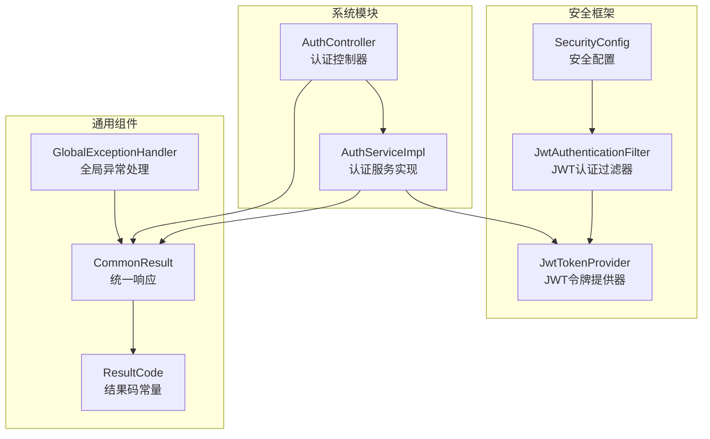
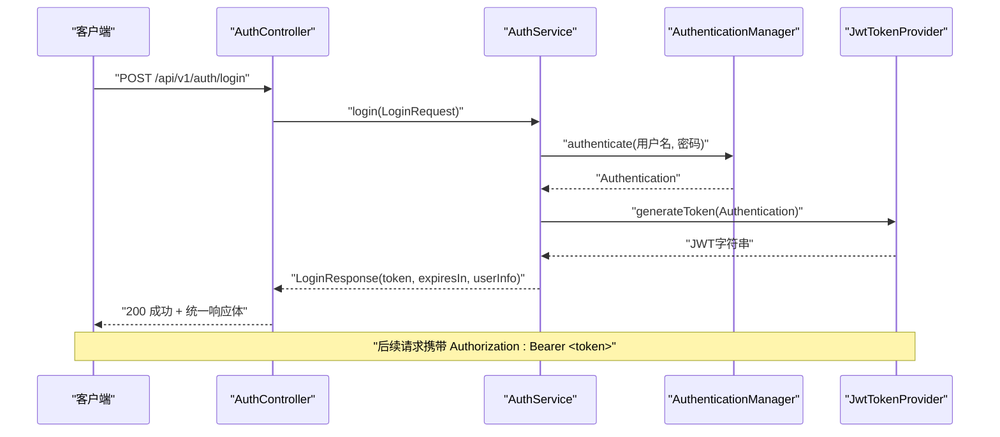
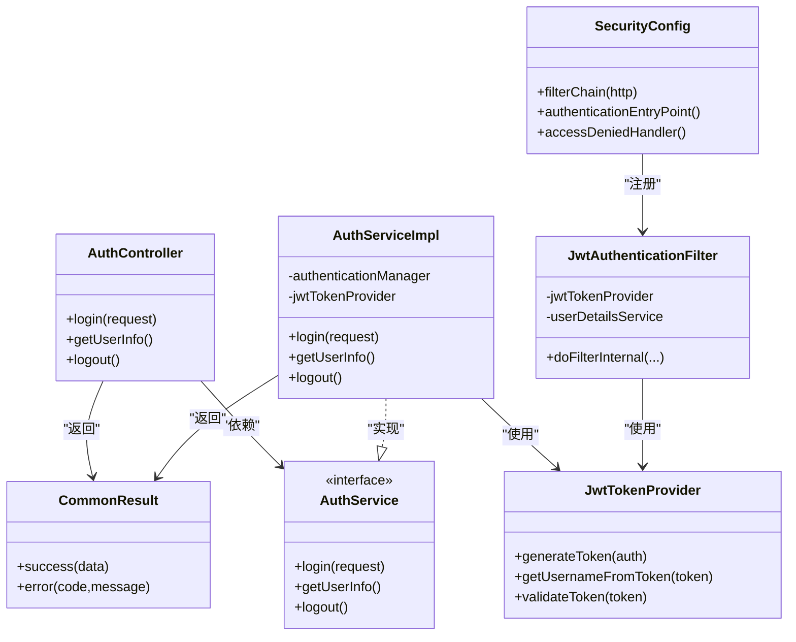
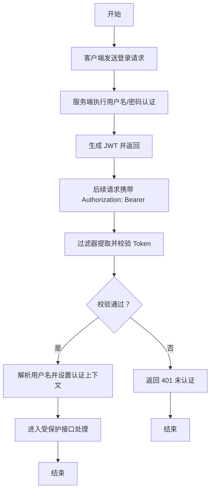

# 认证接口

<!--<cite>
**本文引用的文件**
- [AuthController.java](file://graphiti-module-system/src/main/java/com/graphiti/system/controller/AuthController.java)
- [LoginRequest.java](file://graphiti-module-system/src/main/java/com/graphiti/system/dto/LoginRequest.java)
- [LoginResponse.java](file://graphiti-module-system/src/main/java/com/graphiti/system/dto/LoginResponse.java)
- [AuthService.java](file://graphiti-module-system/src/main/java/com/graphiti/system/service/AuthService.java)
- [AuthServiceImpl.java](file://graphiti-module-system/src/main/java/com/graphiti/system/service/impl/AuthServiceImpl.java)
- [SecurityConfig.java](file://graphiti-framework/graphiti-spring-boot-starter-security/src/main/java/com/raphiti/framework/security/config/SecurityConfig.java)
- [JwtTokenProvider.java](file://graphiti-framework/graphiti-spring-boot-starter-security/src/main/java/com/graphiti/framework/security/jwt/JwtTokenProvider.java)
- [JwtAuthenticationFilter.java](file://graphiti-framework/graphiti-spring-boot-starter-security/src/main/java/com/graphiti/framework/security/jwt/JwtAuthenticationFilter.java)
- [CommonResult.java](file://graphiti-framework/graphiti-common/src/main/java/com/graphiti/common/response/CommonResult.java)
- [ResultCode.java](file://graphiti-framework/graphiti-common/src/main/java/com/graphiti/common/constants/ResultCode.java)
- [GlobalExceptionHandler.java](file://graphiti-framework/graphiti-common/src/main/java/com/graphiti/common/exception/GlobalExceptionHandler.java)
</cite>-->

## 目录
1. [简介](#简介)
2. [项目结构](#项目结构)
3. [核心组件](#核心组件)
4. [架构总览](#架构总览)
5. [详细组件分析](#详细组件分析)
6. [依赖分析](#依赖分析)
7. [性能考量](#性能考量)
8. [故障排查指南](#故障排查指南)
9. [结论](#结论)
10. [附录](#附录)

## 简介
本文件为 ontograph-java 的认证接口完整 API 参考，覆盖用户登录、获取用户信息与退出登录三大端点。文档详细说明了 JWT 认证流程、请求参数格式、响应数据结构、错误处理机制，并提供客户端集成示例与最佳实践。读者可据此完成前后端对接与安全集成。

## 项目结构
认证相关代码主要分布在以下模块与包中：
- 控制层：系统模块的认证控制器
- 服务层：认证服务接口与实现
- 安全框架：Spring Security 配置、JWT 提供器与过滤器
- 响应与异常：统一响应封装与全局异常处理

图表来源
- [AuthController.java:1-55](file://graphiti-module-system/src/main/java/com/graphiti/system/controller/AuthController.java#L1-L55)
- [AuthServiceImpl.java:1-67](file://graphiti-module-system/src/main/java/com/graphiti/system/service/impl/AuthServiceImpl.java#L1-L67)
- [SecurityConfig.java:1-138](file://graphiti-framework/graphiti-spring-boot-starter-security/src/main/java/com/raphiti/framework/security/config/SecurityConfig.java#L1-L138)
- [JwtAuthenticationFilter.java:1-61](file://graphiti-framework/graphiti-spring-boot-starter-security/src/main/java/com/graphiti/framework/security/jwt/JwtAuthenticationFilter.java#L1-L61)
- [JwtTokenProvider.java:1-87](file://graphiti-framework/graphiti-spring-boot-starter-security/src/main/java/com/graphiti/framework/security/jwt/JwtTokenProvider.java#L1-L87)
- [CommonResult.java:1-68](file://graphiti-framework/graphiti-common/src/main/java/com/graphiti/common/response/CommonResult.java#L1-L68)
- [ResultCode.java:1-23](file://graphiti-framework/graphiti-common/src/main/java/com/graphiti/common/constants/ResultCode.java#L1-L23)
- [GlobalExceptionHandler.java:1-74](file://graphiti-framework/graphiti-common/src/main/java/com/graphiti/common/exception/GlobalExceptionHandler.java#L1-L74)

章节来源
- [AuthController.java:1-55](file://graphiti-module-system/src/main/java/com/graphiti/system/controller/AuthController.java#L1-L55)
- [AuthService.java:1-26](file://graphiti-module-system/src/main/java/com/graphiti/system/service/AuthService.java#L1-L26)
- [AuthServiceImpl.java:1-67](file://graphiti-module-system/src/main/java/com/graphiti/system/service/impl/AuthServiceImpl.java#L1-L67)
- [SecurityConfig.java:1-138](file://graphiti-framework/graphiti-spring-boot-starter-security/src/main/java/com/raphiti/framework/security/config/SecurityConfig.java#L1-L138)
- [JwtTokenProvider.java:1-87](file://graphiti-framework/graphiti-spring-boot-starter-security/src/main/java/com/graphiti/framework/security/jwt/JwtTokenProvider.java#L1-L87)
- [JwtAuthenticationFilter.java:1-61](file://graphiti-framework/graphiti-spring-boot-starter-security/src/main/java/com/graphiti/framework/security/jwt/JwtAuthenticationFilter.java#L1-L61)
- [CommonResult.java:1-68](file://graphiti-framework/graphiti-common/src/main/java/com/graphiti/common/response/CommonResult.java#L1-L68)
- [ResultCode.java:1-23](file://graphiti-framework/graphiti-common/src/main/java/com/graphiti/common/constants/ResultCode.java#L1-L23)
- [GlobalExceptionHandler.java:1-74](file://graphiti-framework/graphiti-common/src/main/java/com/graphiti/common/exception/GlobalExceptionHandler.java#L1-L74)

## 核心组件
- 认证控制器：提供登录、获取用户信息、退出登录三个端点，均位于 /api/v1/auth 路径下。
- 认证服务：负责执行认证、生成 JWT、从上下文获取用户信息、清理会话。
- 安全配置：启用无状态会话、放行认证与文档端点、添加 JWT 过滤器、自定义未认证/权限不足响应。
- JWT 组件：生成、解析与校验 JWT；从请求头提取并注入认证上下文。
- 统一响应与异常：统一返回结构与错误码，全局捕获参数校验与业务异常。

章节来源
- [AuthController.java:16-55](file://graphiti-module-system/src/main/java/com/graphiti/system/controller/AuthController.java#L16-L55)
- [AuthService.java:9-25](file://graphiti-module-system/src/main/java/com/graphiti/system/service/AuthService.java#L9-L25)
- [AuthServiceImpl.java:21-67](file://graphiti-module-system/src/main/java/com/graphiti/system/service/impl/AuthServiceImpl.java#L21-L67)
- [SecurityConfig.java:115-136](file://graphiti-framework/graphiti-spring-boot-starter-security/src/main/java/com/raphiti/framework/security/config/SecurityConfig.java#L115-L136)
- [JwtTokenProvider.java:17-87](file://graphiti-framework/graphiti-spring-boot-starter-security/src/main/java/com/graphiti/framework/security/jwt/JwtTokenProvider.java#L17-L87)
- [JwtAuthenticationFilter.java:23-61](file://graphiti-framework/graphiti-spring-boot-starter-security/src/main/java/com/graphiti/framework/security/jwt/JwtAuthenticationFilter.java#L23-L61)
- [CommonResult.java:13-68](file://graphiti-framework/graphiti-common/src/main/java/com/graphiti/common/response/CommonResult.java#L13-L68)
- [ResultCode.java:7-22](file://graphiti-framework/graphiti-common/src/main/java/com/graphiti/common/constants/ResultCode.java#L7-L22)
- [GlobalExceptionHandler.java:17-74](file://graphiti-framework/graphiti-common/src/main/java/com/graphiti/common/exception/GlobalExceptionHandler.java#L17-L74)

## 架构总览
下图展示了认证端到端流程：客户端发起登录请求，后端使用 AuthenticationManager 执行认证，随后由 JwtTokenProvider 生成 JWT 并返回；后续请求由 JwtAuthenticationFilter 从 Authorization 头解析并验证 JWT，将认证信息写入 SecurityContext。

图表来源
- [AuthController.java:27-32](file://graphiti-module-system/src/main/java/com/graphiti/system/controller/AuthController.java#L27-L32)
- [AuthServiceImpl.java:26-44](file://graphiti-module-system/src/main/java/com/graphiti/system/service/impl/AuthServiceImpl.java#L26-L44)
- [JwtTokenProvider.java:40-53](file://graphiti-framework/graphiti-spring-boot-starter-security/src/main/java/com/graphiti/framework/security/jwt/JwtTokenProvider.java#L40-L53)
- [SecurityConfig.java:115-136](file://graphiti-framework/graphiti-spring-boot-starter-security/src/main/java/com/raphiti/framework/security/config/SecurityConfig.java#L115-L136)

## 详细组件分析

### 认证控制器（AuthController）
- 登录接口
  - 方法：POST
  - 路径：/api/v1/auth/login
  - 请求体：LoginRequest（用户名、密码）
  - 响应：CommonResult<LoginResponse>
- 获取用户信息接口
  - 方法：GET
  - 路径：/api/v1/auth/info
  - 安全要求：需要 Bearer Token
  - 响应：CommonResult<LoginResponse.UserInfo>
- 退出登录接口
  - 方法：POST
  - 路径：/api/v1/auth/logout
  - 安全要求：需要 Bearer Token
  - 响应：CommonResult<Void>

章节来源
- [AuthController.java:16-55](file://graphiti-module-system/src/main/java/com/graphiti/system/controller/AuthController.java#L16-L55)

### 登录请求与响应模型
- 登录请求（LoginRequest）
  - 字段：username（必填）、password（必填）
- 登录响应（LoginResponse）
  - 字段：token（JWT 字符串）、expiresIn（过期秒数）、userInfo（包含 username、nickname、email）

章节来源
- [LoginRequest.java:10-25](file://graphiti-module-system/src/main/java/com/graphiti/system/dto/LoginRequest.java#L10-L25)
- [LoginResponse.java:9-39](file://graphiti-module-system/src/main/java/com/graphiti/system/dto/LoginResponse.java#L9-L39)

### 认证服务（AuthService 与 AuthServiceImpl）
- login(LoginRequest)
  - 使用 AuthenticationManager 执行用户名/密码认证
  - 通过 JwtTokenProvider 生成 JWT
  - 构造 LoginResponse（固定 expiresIn 为 86400 秒）
- getUserInfo()
  - 从 SecurityContextHolder 获取认证信息
  - 返回当前用户基本信息（示例：用户名）
- logout()
  - 清空 Security 上下文（JWT 无状态，客户端需删除本地 Token）

章节来源
- [AuthService.java:9-25](file://graphiti-module-system/src/main/java/com/graphiti/system/service/AuthService.java#L9-L25)
- [AuthServiceImpl.java:21-67](file://graphiti-module-system/src/main/java/com/graphiti/system/service/impl/AuthServiceImpl.java#L21-L67)

### 安全配置与 JWT 过滤器
- 安全配置（SecurityConfig）
  - 无状态会话策略
  - 放行 /api/v1/auth/**、Swagger、Actuator 等端点
  - 添加 JwtAuthenticationFilter 在默认表单过滤器之前
  - 自定义未认证与权限不足的 JSON 响应
- JWT 过滤器（JwtAuthenticationFilter）
  - 从 Authorization 头提取 Bearer Token
  - 校验 Token 有效性并解析用户名
  - 加载用户详情并设置 Authentication 到 SecurityContext
- JWT 提供器（JwtTokenProvider）
  - 生成、解析、校验 JWT
  - 从 Token 提取用户名

章节来源
- [SecurityConfig.java:115-136](file://graphiti-framework/graphiti-spring-boot-starter-security/src/main/java/com/raphiti/framework/security/config/SecurityConfig.java#L115-L136)
- [JwtAuthenticationFilter.java:23-61](file://graphiti-framework/graphiti-spring-boot-starter-security/src/main/java/com/graphiti/framework/security/jwt/JwtAuthenticationFilter.java#L23-L61)
- [JwtTokenProvider.java:17-87](file://graphiti-framework/graphiti-spring-boot-starter-security/src/main/java/com/graphiti/framework/security/jwt/JwtTokenProvider.java#L17-L87)

### 统一响应与错误码
- 统一响应（CommonResult）
  - 字段：code、message、data、timestamp
  - 成功/失败静态构造方法
- 结果码常量（ResultCode）
  - SUCCESS、UNAUTHORIZED、FORBIDDEN 等
- 全局异常处理（GlobalExceptionHandler）
  - 捕获业务异常、参数校验异常、缺少参数异常与未知异常
  - 统一返回 CommonResult 格式

章节来源
- [CommonResult.java:13-68](file://graphiti-framework/graphiti-common/src/main/java/com/graphiti/common/response/CommonResult.java#L13-L68)
- [ResultCode.java:7-22](file://graphiti-framework/graphiti-common/src/main/java/com/graphiti/common/constants/ResultCode.java#L7-L22)
- [GlobalExceptionHandler.java:17-74](file://graphiti-framework/graphiti-common/src/main/java/com/graphiti/common/exception/GlobalExceptionHandler.java#L17-L74)

## 依赖分析
认证相关组件之间的依赖关系如下：

图表来源
- [AuthController.java:16-55](file://graphiti-module-system/src/main/java/com/graphiti/system/controller/AuthController.java#L16-L55)
- [AuthService.java:9-25](file://graphiti-module-system/src/main/java/com/graphiti/system/service/AuthService.java#L9-L25)
- [AuthServiceImpl.java:18-67](file://graphiti-module-system/src/main/java/com/graphiti/system/service/impl/AuthServiceImpl.java#L18-L67)
- [JwtTokenProvider.java:17-87](file://graphiti-framework/graphiti-spring-boot-starter-security/src/main/java/com/graphiti/framework/security/jwt/JwtTokenProvider.java#L17-L87)
- [JwtAuthenticationFilter.java:23-61](file://graphiti-framework/graphiti-spring-boot-starter-security/src/main/java/com/graphiti/framework/security/jwt/JwtAuthenticationFilter.java#L23-L61)
- [SecurityConfig.java:115-136](file://graphiti-framework/graphiti-spring-boot-starter-security/src/main/java/com/raphiti/framework/security/config/SecurityConfig.java#L115-L136)
- [CommonResult.java:13-68](file://graphiti-framework/graphiti-common/src/main/java/com/graphiti/common/response/CommonResult.java#L13-L68)

## 性能考量
- 无状态设计：JWT 无状态，服务器无需存储会话，降低内存与缓存压力。
- 过滤器链：仅在必要端点进行认证，其余端点直接放行，减少开销。
- Token 过期：默认 24 小时，建议客户端在过期前主动刷新或重新登录。
- 参数校验：前端应在提交前进行基础校验，减少无效请求。

## 故障排查指南
- 401 未认证
  - 可能原因：未提供 Authorization 头、Token 缺失或格式不正确、Token 无效或已过期
  - 处理建议：检查请求头是否为 Bearer Token；确认密钥与过期时间配置；重新登录获取新 Token
- 403 权限不足
  - 可能原因：已认证但无访问权限
  - 处理建议：确认用户角色与资源授权规则
- 400 参数错误
  - 可能原因：用户名或密码为空
  - 处理建议：完善前端校验与提示
- 500 系统内部错误
  - 可能原因：服务异常
  - 处理建议：查看服务日志并重试

章节来源
- [SecurityConfig.java:84-113](file://graphiti-framework/graphiti-spring-boot-starter-security/src/main/java/com/raphiti/framework/security/config/SecurityConfig.java#L84-L113)
- [GlobalExceptionHandler.java:26-72](file://graphiti-framework/graphiti-common/src/main/java/com/graphiti/common/exception/GlobalExceptionHandler.java#L26-L72)
- [AuthServiceImpl.java:47-59](file://graphiti-module-system/src/main/java/com/graphiti/system/service/impl/AuthServiceImpl.java#L47-L59)

## 结论
ontograph-java 的认证体系基于 Spring Security 与 JWT 实现，具备清晰的职责划分与统一的响应格式。通过无状态设计与严格的异常处理，系统在安全性与易用性之间取得平衡。开发者可按本文档完成客户端集成与扩展开发。

## 附录

### API 规范与示例

- 登录
  - 方法与路径：POST /api/v1/auth/login
  - 请求体字段
    - username：字符串，必填
    - password：字符串，必填
  - 成功响应字段
    - code：200
    - message：success
    - data.token：JWT 字符串
    - data.expiresIn：过期秒数（例如 86400）
    - data.userInfo.username：用户名
    - data.userInfo.nickname：昵称
    - data.userInfo.email：邮箱
  - 示例请求
    - Content-Type: application/json
    - Body: {"username":"<用户名>","password":"<密码>"}
  - 示例成功响应
    - Status: 200
    - Body: {"code":200,"message":"success","data":{"token":"<JWT>","expiresIn":86400,"userInfo":{"username":"<用户名>","nickname":"<昵称>","email":"<邮箱>"}},"timestamp":"<ISO时间>"}

- 获取用户信息
  - 方法与路径：GET /api/v1/auth/info
  - 请求头
    - Authorization: Bearer <token>
  - 成功响应字段
    - code：200
    - message：success
    - data.username：用户名
  - 示例响应
    - Status: 200
    - Body: {"code":200,"message":"success","data":{"username":"<用户名>"},"timestamp":"<ISO时间>"}

- 退出登录
  - 方法与路径：POST /api/v1/auth/logout
  - 请求头
    - Authorization: Bearer <token>
  - 成功响应字段
    - code：200
    - message：success
    - data：null
  - 示例响应
    - Status: 200
    - Body: {"code":200,"message":"success","data":null,"timestamp":"<ISO时间>"}

- 错误响应通用结构
  - 字段：code、message、data、timestamp
  - 示例
    - {"code":401,"message":"未认证，请登录或提供有效的 JWT Token","data":null,"timestamp":"<ISO时间>"}

章节来源
- [AuthController.java:27-53](file://graphiti-module-system/src/main/java/com/graphiti/system/controller/AuthController.java#L27-L53)
- [LoginRequest.java:10-25](file://graphiti-module-system/src/main/java/com/graphiti/system/dto/LoginRequest.java#L10-L25)
- [LoginResponse.java:9-39](file://graphiti-module-system/src/main/java/com/graphiti/system/dto/LoginResponse.java#L9-L39)
- [CommonResult.java:13-68](file://graphiti-framework/graphiti-common/src/main/java/com/graphiti/common/response/CommonResult.java#L13-L68)
- [SecurityConfig.java:84-113](file://graphiti-framework/graphiti-spring-boot-starter-security/src/main/java/com/raphiti/framework/security/config/SecurityConfig.java#L84-L113)

### JWT 认证流程详解
- 登录阶段
  - 客户端提交用户名/密码
  - 服务端使用 AuthenticationManager 认证
  - 生成 JWT 并返回给客户端
- 请求阶段
  - 客户端在每个受保护请求头中携带 Authorization: Bearer <token>
  - 过滤器从头中提取 Token 并校验
  - 解析用户名并加载用户详情，设置 Authentication 到上下文
- 退出阶段
  - 清空 Security 上下文（JWT 无状态，服务端不存储会话）
  - 客户端删除本地 Token

图表来源
- [AuthServiceImpl.java:26-44](file://graphiti-module-system/src/main/java/com/graphiti/system/service/impl/AuthServiceImpl.java#L26-L44)
- [JwtAuthenticationFilter.java:36-59](file://graphiti-framework/graphiti-spring-boot-starter-security/src/main/java/com/graphiti/framework/security/jwt/JwtAuthenticationFilter.java#L36-L59)
- [SecurityConfig.java:115-136](file://graphiti-framework/graphiti-spring-boot-starter-security/src/main/java/com/raphiti/framework/security/config/SecurityConfig.java#L115-L136)

### 客户端集成示例与最佳实践
- 前端
  - 登录成功后持久化保存 JWT（如 localStorage 或安全 Cookie）
  - 每次请求自动附加 Authorization: Bearer <token>
  - Token 过期前主动刷新或引导重新登录
- 后端
  - 严格校验请求头格式与 Token 内容
  - 对敏感接口开启细粒度权限控制
  - 使用 HTTPS 传输，避免明文泄露
- 安全建议
  - 限制 Token 过期时间，采用短期有效与刷新机制
  - 服务端不存储会话，避免会话劫持
  - 对关键操作增加二次校验（如短信/邮件验证码）