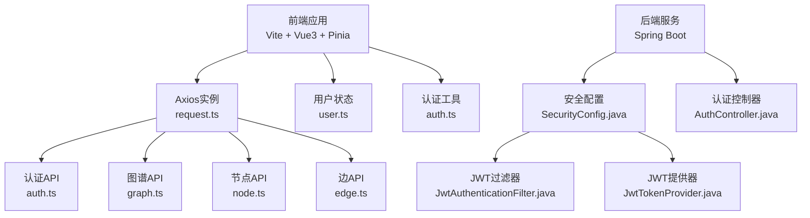
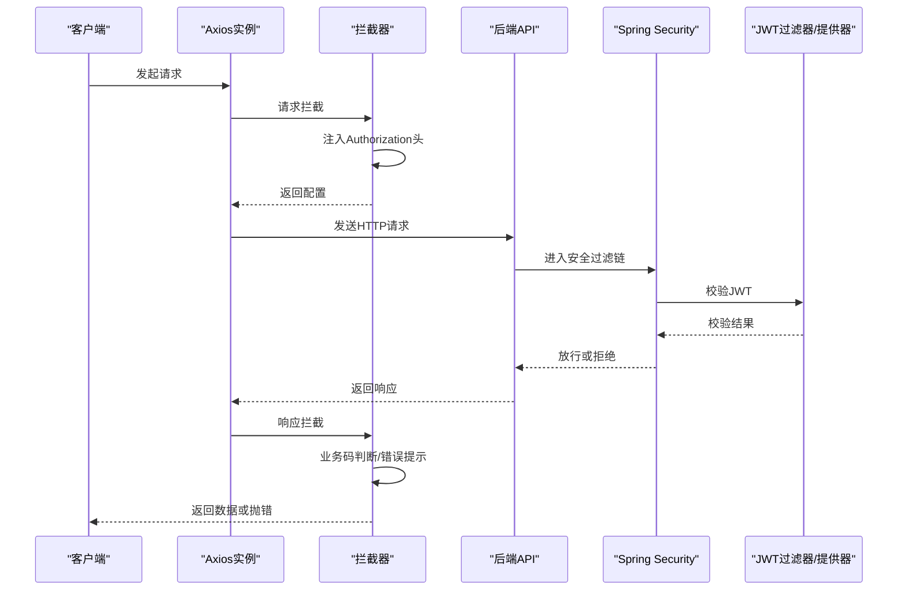
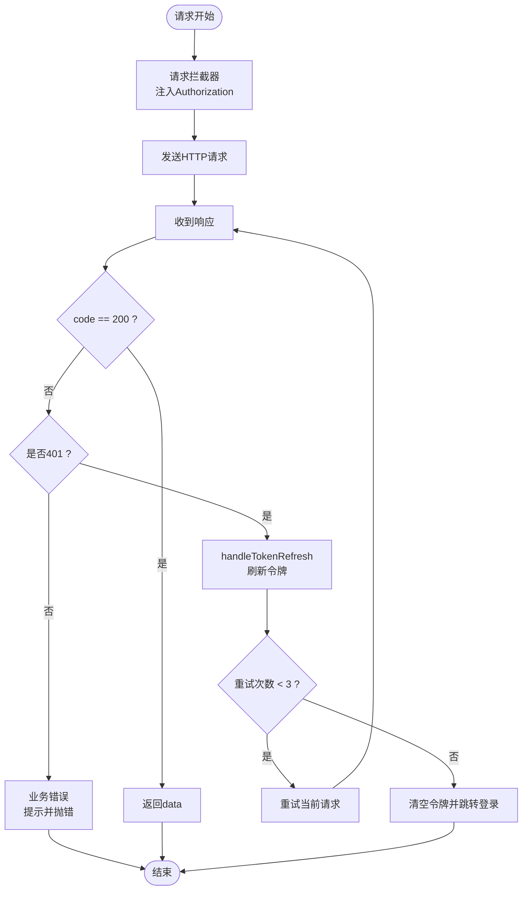
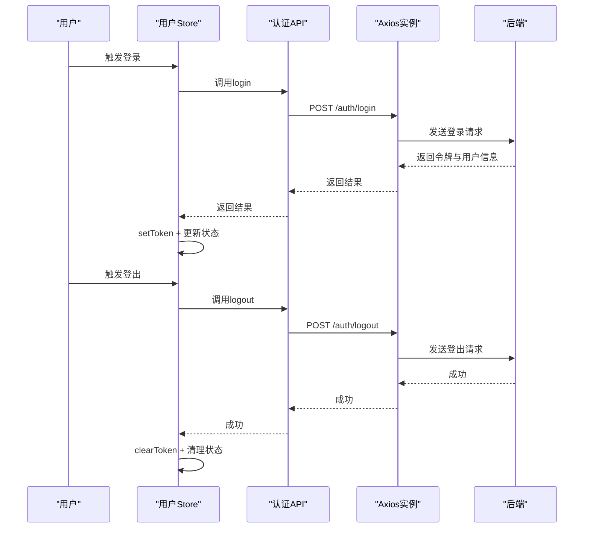
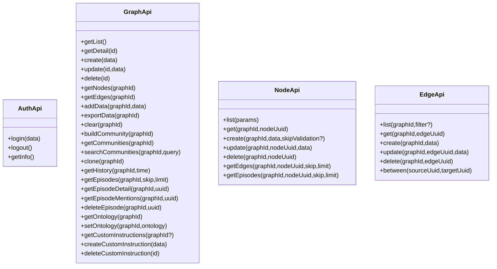
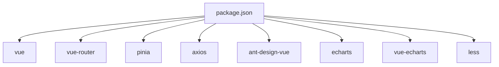

# API集成

<!--<cite>
**本文引用的文件**
- [ontograph-web/src/api/request.ts](file://ontograph-web/src/api/request.ts)
- [ontograph-web/src/utils/auth.ts](file://ontograph-web/src/utils/auth.ts)
- [ontograph-web/src/store/modules/user.ts](file://ontograph-web/src/store/modules/user.ts)
- [ontograph-web/src/api/auth.ts](file://ontograph-web/src/api/auth.ts)
- [ontograph-web/src/api/graph.ts](file://ontograph-web/src/api/graph.ts)
- [ontograph-web/src/api/node.ts](file://ontograph-web/src/api/node.ts)
- [ontograph-web/src/api/edge.ts](file://ontograph-web/src/api/edge.ts)
- [ontograph-web/package.json](file://ontograph-web/package.json)
- [ontograph-web/vite.config.ts](file://ontograph-web/vite.config.ts)
- [ontograph-framework/graphiti-spring-boot-starter-security/src/main/java/com/graphiti/framework/security/config/SecurityConfig.java](file://ontograph-framework/graphiti-spring-boot-starter-security/src/main/java/com/graphiti/framework/security/config/SecurityConfig.java)
- [ontograph-framework/graphiti-spring-boot-starter-security/src/main/java/com/graphiti/framework/security/jwt/JwtAuthenticationFilter.java](file://ontograph-framework/graphiti-spring-boot-starter-security/src/main/java/com/graphiti/framework/security/jwt/JwtAuthenticationFilter.java)
- [ontograph-framework/graphiti-spring-boot-starter-security/src/main/java/com/graphiti/framework/security/jwt/JwtTokenProvider.java](file://ontograph-framework/graphiti-spring-boot-starter-security/src/main/java/com/graphiti/framework/security/jwt/JwtTokenProvider.java)
- [ontograph-module-system/src/main/java/com/raphiti/system/controller/AuthController.java](file://ontograph-module-system/src/main/java/com/graphiti/system/controller/AuthController.java)
- [ontograph-server/src/main/resources/application.yml](file://ontograph-server/src/main/resources/application.yml)
</cite>-->

## 目录
1. [简介](#简介)
2. [项目结构](#项目结构)
3. [核心组件](#核心组件)
4. [架构总览](#架构总览)
5. [详细组件分析](#详细组件分析)
6. [依赖分析](#依赖分析)
7. [性能考虑](#性能考虑)
8. [故障排查指南](#故障排查指南)
9. [结论](#结论)
10. [附录](#附录)

## 简介
本文件面向后端API集成开发者，提供前端API集成的综合技术方案。内容涵盖：
- Axios封装的设计模式与拦截器、错误处理机制
- 认证流程（JWT令牌管理、自动刷新、登出）
- API模块化组织（auth、graph、node、edge等）
- 请求配置（超时、重试、并发控制）
- 响应数据处理（转换、格式化、缓存策略）
- 错误处理最佳实践（网络、业务、用户提示）
- CORS配置与跨域处理
- API测试策略与Mock数据使用建议

## 项目结构
前端采用Vite+Vue3+Pinia+Ant Design Vue，Axios作为HTTP客户端，统一通过request.ts封装请求与响应处理；后端基于Spring Security + JWT，提供认证、鉴权与CORS配置。

图表来源
- [ontograph-web/src/api/request.ts:1-138](file://ontograph-web/src/api/request.ts#L1-L138)
- [ontograph-web/src/api/auth.ts:1-53](file://ontograph-web/src/api/auth.ts#L1-L53)
- [ontograph-web/src/api/graph.ts:1-207](file://ontograph-web/src/api/graph.ts#L1-L207)
- [ontograph-web/src/api/node.ts:1-127](file://ontograph-web/src/api/node.ts#L1-L127)
- [ontograph-web/src/api/edge.ts:1-108](file://ontograph-web/src/api/edge.ts#L1-L108)
- [ontograph-web/src/store/modules/user.ts:1-67](file://ontograph-web/src/store/modules/user.ts#L1-L67)
- [ontograph-web/src/utils/auth.ts:1-41](file://ontograph-web/src/utils/auth.ts#L1-L41)
- [ontograph-framework/graphiti-spring-boot-starter-security/src/main/java/com/graphiti/framework/security/config/SecurityConfig.java:1-138](file://ontograph-framework/graphiti-spring-boot-starter-security/src/main/java/com/graphiti/framework/security/config/SecurityConfig.java#L1-L138)
- [ontograph-framework/graphiti-spring-boot-starter-security/src/main/java/com/graphiti/framework/security/jwt/JwtAuthenticationFilter.java:1-61](file://ontograph-framework/graphiti-spring-boot-starter-security/src/main/java/com/graphiti/framework/security/jwt/JwtAuthenticationFilter.java#L1-L61)
- [ontograph-framework/graphiti-spring-boot-starter-security/src/main/java/com/graphiti/framework/security/jwt/JwtTokenProvider.java:1-87](file://ontograph-framework/graphiti-spring-boot-starter-security/src/main/java/com/graphiti/framework/security/jwt/JwtTokenProvider.java#L1-L87)
- [ontograph-module-system/src/main/java/com/graphiti/system/controller/AuthController.java:1-55](file://ontograph-module-system/src/main/java/com/graphiti/system/controller/AuthController.java#L1-L55)

章节来源
- [ontograph-web/src/api/request.ts:1-138](file://ontograph-web/src/api/request.ts#L1-L138)
- [ontograph-web/src/api/auth.ts:1-53](file://ontograph-web/src/api/auth.ts#L1-L53)
- [ontograph-web/src/api/graph.ts:1-207](file://ontograph-web/src/api/graph.ts#L1-L207)
- [ontograph-web/src/api/node.ts:1-127](file://ontograph-web/src/api/node.ts#L1-L127)
- [ontograph-web/src/api/edge.ts:1-108](file://ontograph-web/src/api/edge.ts#L1-L108)
- [ontograph-web/src/store/modules/user.ts:1-67](file://ontograph-web/src/store/modules/user.ts#L1-L67)
- [ontograph-web/src/utils/auth.ts:1-41](file://ontograph-web/src/utils/auth.ts#L1-L41)
- [ontograph-web/vite.config.ts:1-41](file://ontograph-web/vite.config.ts#L1-L41)
- [ontograph-framework/graphiti-spring-boot-starter-security/src/main/java/com/graphiti/framework/security/config/SecurityConfig.java:1-138](file://ontograph-framework/graphiti-spring-boot-starter-security/src/main/java/com/graphiti/framework/security/config/SecurityConfig.java#L1-L138)
- [ontograph-framework/graphiti-spring-boot-starter-security/src/main/java/com/graphiti/framework/security/jwt/JwtAuthenticationFilter.java:1-61](file://ontograph-framework/graphiti-spring-boot-starter-security/src/main/java/com/graphiti/framework/security/jwt/JwtAuthenticationFilter.java#L1-L61)
- [ontograph-framework/graphiti-spring-boot-starter-security/src/main/java/com/graphiti/framework/security/jwt/JwtTokenProvider.java:1-87](file://ontograph-framework/graphiti-spring-boot-starter-security/src/main/java/com/graphiti/framework/security/jwt/JwtTokenProvider.java#L1-L87)
- [ontograph-module-system/src/main/java/com/graphiti/system/controller/AuthController.java:1-55](file://ontograph-module-system/src/main/java/com/graphiti/system/controller/AuthController.java#L1-L55)
- [ontograph-server/src/main/resources/application.yml:1-67](file://ontograph-server/src/main/resources/application.yml#L1-L67)

## 核心组件
- Axios实例与拦截器：统一请求头注入、响应数据转换、401自动刷新、错误提示与透传
- 认证工具：本地存储令牌与用户信息，提供读取/写入/清理
- 用户状态管理：Pinia Store集中管理登录态、用户信息拉取与登出
- API模块：按业务划分的模块化接口，统一通过Axios实例调用
- 后端安全：Spring Security + JWT + CORS配置，提供认证入口与未认证/权限不足响应

章节来源
- [ontograph-web/src/api/request.ts:1-138](file://ontograph-web/src/api/request.ts#L1-L138)
- [ontograph-web/src/utils/auth.ts:1-41](file://ontograph-web/src/utils/auth.ts#L1-L41)
- [ontograph-web/src/store/modules/user.ts:1-67](file://ontograph-web/src/store/modules/user.ts#L1-L67)
- [ontograph-web/src/api/auth.ts:1-53](file://ontograph-web/src/api/auth.ts#L1-L53)
- [ontograph-web/src/api/graph.ts:1-207](file://ontograph-web/src/api/graph.ts#L1-L207)
- [ontograph-web/src/api/node.ts:1-127](file://ontograph-web/src/api/node.ts#L1-L127)
- [ontograph-web/src/api/edge.ts:1-108](file://ontograph-web/src/api/edge.ts#L1-L108)
- [ontograph-framework/graphiti-spring-boot-starter-security/src/main/java/com/graphiti/framework/security/config/SecurityConfig.java:1-138](file://ontograph-framework/graphiti-spring-boot-starter-security/src/main/java/com/graphiti/framework/security/config/SecurityConfig.java#L1-L138)
- [ontograph-framework/graphiti-spring-boot-starter-security/src/main/java/com/graphiti/framework/security/jwt/JwtAuthenticationFilter.java:1-61](file://ontograph-framework/graphiti-spring-boot-starter-security/src/main/java/com/graphiti/framework/security/jwt/JwtAuthenticationFilter.java#L1-L61)
- [ontograph-framework/graphiti-spring-boot-starter-security/src/main/java/com/graphiti/framework/security/jwt/JwtTokenProvider.java:1-87](file://ontograph-framework/graphiti-spring-boot-starter-security/src/main/java/com/graphiti/framework/security/jwt/JwtTokenProvider.java#L1-L87)
- [ontograph-module-system/src/main/java/com/graphiti/system/controller/AuthController.java:1-55](file://ontograph-module-system/src/main/java/com/graphiti/system/controller/AuthController.java#L1-L55)

## 架构总览
前端通过Axios实例统一发起HTTP请求，拦截器负责：
- 请求阶段：从本地存储读取令牌并注入Authorization头
- 响应阶段：对业务状态码进行判断，200放行，401触发刷新流程，其他错误统一提示
- 异常阶段：网络错误统一提示，并区分是否需要刷新

后端通过Spring Security过滤JWT，校验通过后将认证信息放入SecurityContext；CORS允许跨域访问；认证接口位于/api/v1/auth路径下。

图表来源
- [ontograph-web/src/api/request.ts:20-61](file://ontograph-web/src/api/request.ts#L20-L61)
- [ontograph-framework/graphiti-spring-boot-starter-security/src/main/java/com/graphiti/framework/security/config/SecurityConfig.java:115-136](file://ontograph-framework/graphiti-spring-boot-starter-security/src/main/java/com/graphiti/framework/security/config/SecurityConfig.java#L115-L136)
- [ontograph-framework/graphiti-spring-boot-starter-security/src/main/java/com/graphiti/framework/security/jwt/JwtAuthenticationFilter.java:44-59](file://ontograph-framework/graphiti-spring-boot-starter-security/src/main/java/com/graphiti/framework/security/jwt/JwtAuthenticationFilter.java#L44-L59)
- [ontograph-module-system/src/main/java/com/graphiti/system/controller/AuthController.java:28-53](file://ontograph-module-system/src/main/java/com/graphiti/system/controller/AuthController.java#L28-L53)

## 详细组件分析

### Axios封装与拦截器
- 实例配置：baseURL来自环境变量，统一超时时间；针对大文件导入场景可在调用侧覆盖更长超时
- 请求拦截器：从localStorage读取令牌，注入Authorization头
- 响应拦截器：对后端统一响应结构进行解包，仅当code为200时返回data；401进入刷新流程；其他业务码按需提示
- 错误拦截器：网络错误统一提示；401同样进入刷新流程
- 自动刷新机制：防重复刷新标记、等待队列、最大重试次数、刷新失败兜底登出

图表来源
- [ontograph-web/src/api/request.ts:20-135](file://ontograph-web/src/api/request.ts#L20-L135)

章节来源
- [ontograph-web/src/api/request.ts:1-138](file://ontograph-web/src/api/request.ts#L1-L138)

### 认证流程与令牌管理
- 令牌存储：localStorage保存token与用户信息，支持读取、设置、清理
- 登录：调用认证API，成功后写入令牌与用户信息，更新Pinia状态
- 登出：调用后端登出接口，最终清理本地存储并更新状态
- 用户信息：登录后可拉取当前用户信息，用于界面展示与权限判断

图表来源
- [ontograph-web/src/store/modules/user.ts:21-44](file://ontograph-web/src/store/modules/user.ts#L21-L44)
- [ontograph-web/src/api/auth.ts:31-41](file://ontograph-web/src/api/auth.ts#L31-L41)
- [ontograph-web/src/utils/auth.ts:18-30](file://ontograph-web/src/utils/auth.ts#L18-L30)
- [ontograph-module-system/src/main/java/com/graphiti/system/controller/AuthController.java:28-53](file://ontograph-module-system/src/main/java/com/graphiti/system/controller/AuthController.java#L28-L53)

章节来源
- [ontograph-web/src/utils/auth.ts:1-41](file://ontograph-web/src/utils/auth.ts#L1-L41)
- [ontograph-web/src/store/modules/user.ts:1-67](file://ontograph-web/src/store/modules/user.ts#L1-L67)
- [ontograph-web/src/api/auth.ts:1-53](file://ontograph-web/src/api/auth.ts#L1-L53)
- [ontograph-module-system/src/main/java/com/graphiti/system/controller/AuthController.java:1-55](file://ontograph-module-system/src/main/java/com/graphiti/system/controller/AuthController.java#L1-L55)

### API模块化组织
- 认证模块：登录、登出、获取用户信息
- 图谱模块：图谱列表/详情/创建/更新/删除、节点/边查询、数据导入导出、社区构建与查询、历史状态、本体与自定义指令
- 节点模块：节点列表、详情、创建、更新、删除、关联边与Episode查询
- 边模块：边列表、详情、创建、更新、删除、双向边查询

图表来源
- [ontograph-web/src/api/auth.ts:26-49](file://ontograph-web/src/api/auth.ts#L26-L49)
- [ontograph-web/src/api/graph.ts:53-192](file://ontograph-web/src/api/graph.ts#L53-L192)
- [ontograph-web/src/api/node.ts:48-123](file://ontograph-web/src/api/node.ts#L48-L123)
- [ontograph-web/src/api/edge.ts:57-104](file://ontograph-web/src/api/edge.ts#L57-L104)

章节来源
- [ontograph-web/src/api/auth.ts:1-53](file://ontograph-web/src/api/auth.ts#L1-L53)
- [ontograph-web/src/api/graph.ts:1-207](file://ontograph-web/src/api/graph.ts#L1-L207)
- [ontograph-web/src/api/node.ts:1-127](file://ontograph-web/src/api/node.ts#L1-L127)
- [ontograph-web/src/api/edge.ts:1-108](file://ontograph-web/src/api/edge.ts#L1-L108)

### 请求配置与并发控制
- 超时设置：默认10秒，针对数据导入等场景可在调用侧覆盖更长超时
- 并发控制：当前实现未显式限制并发；如需限制，可在调用侧引入信号量或队列
- 重试机制：响应拦截器内对401触发刷新流程，刷新失败最多重试3次；网络错误不自动重试，交由上层处理

章节来源
- [ontograph-web/src/api/request.ts:5-8](file://ontograph-web/src/api/request.ts#L5-L8)
- [ontograph-web/src/api/request.ts:64-135](file://ontograph-web/src/api/request.ts#L64-L135)

### 响应数据处理与缓存策略
- 数据解包：统一从后端响应结构中提取data字段，仅当code为200时返回
- 格式化：各API模块对返回数据进行类型化映射（如Graph、Node、Edge等）
- 缓存策略：当前未见前端侧通用缓存实现；建议对只读列表/详情等接口引入轻量缓存，结合key失效策略

章节来源
- [ontograph-web/src/api/request.ts:35-53](file://ontograph-web/src/api/request.ts#L35-L53)
- [ontograph-web/src/api/graph.ts:55-58](file://ontograph-web/src/api/graph.ts#L55-L58)
- [ontograph-web/src/api/node.ts:53-63](file://ontograph-web/src/api/node.ts#L53-L63)
- [ontograph-web/src/api/edge.ts:62-64](file://ontograph-web/src/api/edge.ts#L62-L64)

### CORS配置与跨域处理
- 后端CORS：允许任意来源、方法与头部，允许凭据，预检缓存1小时
- 前端代理：开发环境下通过Vite代理将/api前缀转发至后端8080端口

章节来源
- [ontograph-framework/graphiti-spring-boot-starter-security/src/main/java/com/graphiti/framework/security/config/SecurityConfig.java:68-79](file://ontograph-framework/graphiti-spring-boot-starter-security/src/main/java/com/graphiti/framework/security/config/SecurityConfig.java#L68-L79)
- [ontograph-web/vite.config.ts:20-26](file://ontograph-web/vite.config.ts#L20-L26)

### 错误处理最佳实践
- 网络错误：统一提示“网络错误”，便于用户感知
- 业务错误：非1002等特定业务码统一提示，同时抛出错误供调用方处理
- 401处理：自动刷新令牌，最多重试3次；刷新失败则强制登出并跳转登录页
- 未认证/权限不足：后端返回JSON结构，前端拦截器统一处理

章节来源
- [ontograph-web/src/api/request.ts:54-61](file://ontograph-web/src/api/request.ts#L54-L61)
- [ontograph-web/src/api/request.ts:44-52](file://ontograph-web/src/api/request.ts#L44-L52)
- [ontograph-framework/graphiti-spring-boot-starter-security/src/main/java/com/graphiti/framework/security/config/SecurityConfig.java:84-113](file://ontograph-framework/graphiti-spring-boot-starter-security/src/main/java/com/graphiti/framework/security/config/SecurityConfig.java#L84-L113)

### API测试策略与Mock数据
- 单元测试：建议为每个API模块编写单元测试，模拟Axios响应与错误场景
- Mock数据：可使用Vite的mock插件或独立mock服务，提供稳定的数据集以支持UI联调
- 集成测试：通过代理将前端请求转发至后端，验证拦截器、认证与CORS链路

章节来源
- [ontograph-web/package.json:1-32](file://ontograph-web/package.json#L1-L32)
- [ontograph-web/vite.config.ts:1-41](file://ontograph-web/vite.config.ts#L1-L41)

## 依赖分析
- 前端依赖：Vue3、Vue Router、Pinia、Axios、Ant Design Vue等
- 后端依赖：Spring Security、JWT库、MyBatis-Plus、Actuator、OpenAPI/Swagger

图表来源
- [ontograph-web/package.json:11-21](file://ontograph-web/package.json#L11-L21)

章节来源
- [ontograph-web/package.json:1-32](file://ontograph-web/package.json#L1-L32)

## 性能考虑
- 超时与重试：合理设置超时，避免长时间阻塞；对401刷新采用指数退避与最大重试次数
- 并发控制：对高频列表查询引入并发限制，减少后端压力
- 缓存策略：对只读接口引入轻量缓存，结合key失效策略提升响应速度
- 前端渲染：对大数据量列表采用虚拟滚动或分页加载

## 故障排查指南
- 登录后仍提示未认证：检查Authorization头是否正确注入、后端JWT过滤器是否生效
- 401频繁刷新：确认刷新接口可用性、令牌有效期配置、刷新队列是否正确执行
- 跨域问题：确认后端CORS配置与前端代理设置一致
- 网络错误：检查代理配置、防火墙与DNS解析

章节来源
- [ontograph-web/src/api/request.ts:20-61](file://ontograph-web/src/api/request.ts#L20-L61)
- [ontograph-framework/graphiti-spring-boot-starter-security/src/main/java/com/graphiti/framework/security/config/SecurityConfig.java:68-79](file://ontograph-framework/graphiti-spring-boot-starter-security/src/main/java/com/graphiti/framework/security/config/SecurityConfig.java#L68-L79)
- [ontograph-web/vite.config.ts:20-26](file://ontograph-web/vite.config.ts#L20-L26)

## 结论
该API集成方案以Axios为核心，配合拦截器实现了统一的认证、错误处理与刷新机制；前端通过模块化API清晰地组织了认证、图谱、节点与边等业务能力；后端通过Spring Security与JWT提供了完善的认证与CORS支持。建议在现有基础上进一步完善并发控制、缓存策略与测试体系，以提升整体稳定性与可维护性。

## 附录
- 环境变量与基础URL：前端通过环境变量配置baseURL，确保开发与生产环境隔离
- JWT配置：后端提供密钥与过期时间配置，建议在生产环境使用强密钥与合理过期时间

章节来源
- [ontograph-web/src/api/request.ts:5-8](file://ontograph-web/src/api/request.ts#L5-L8)
- [ontograph-server/src/main/resources/application.yml:25-34](file://ontograph-server/src/main/resources/application.yml#L25-L34)