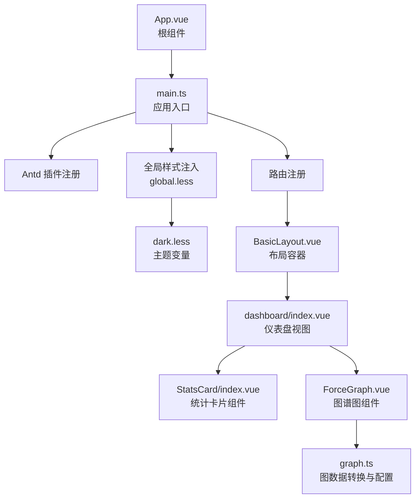
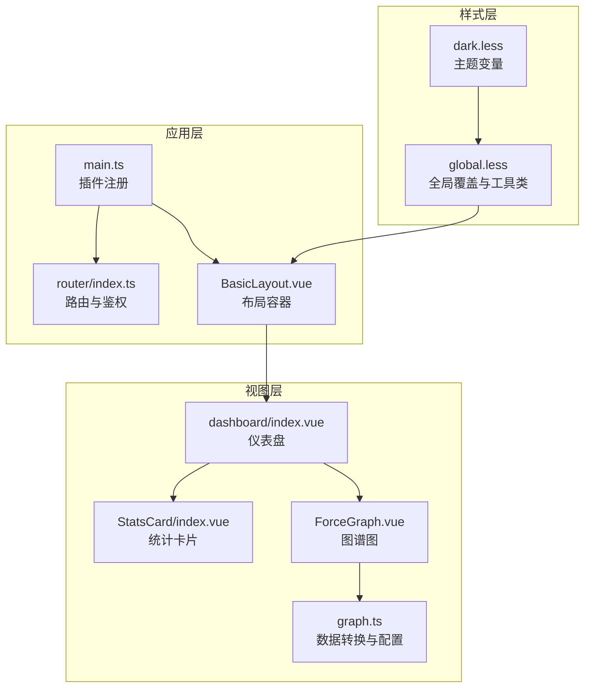
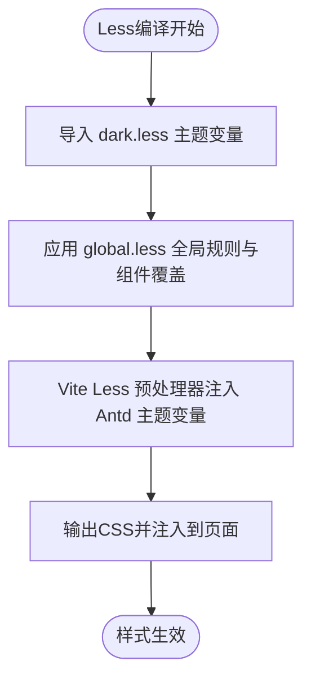
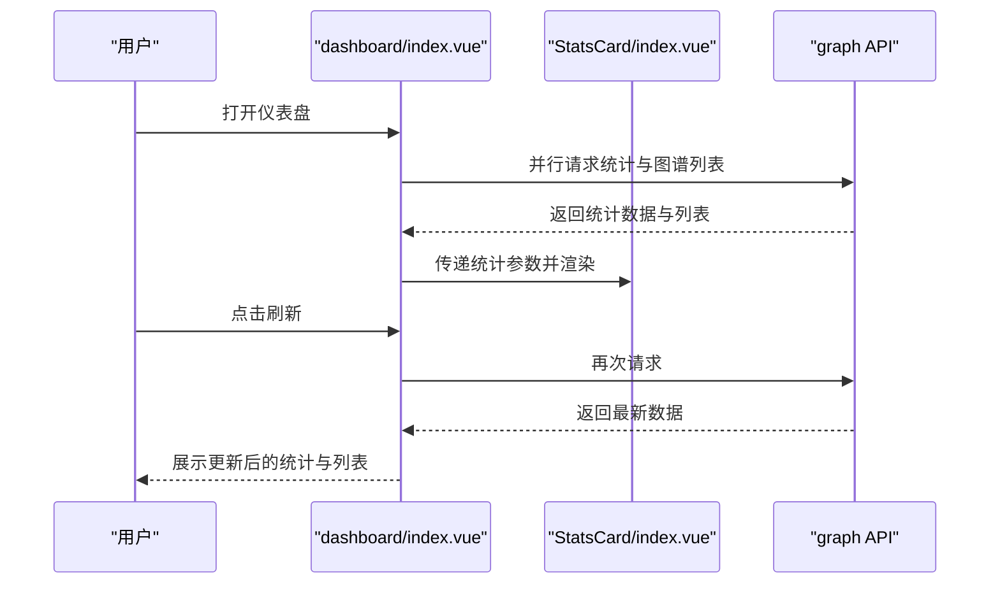
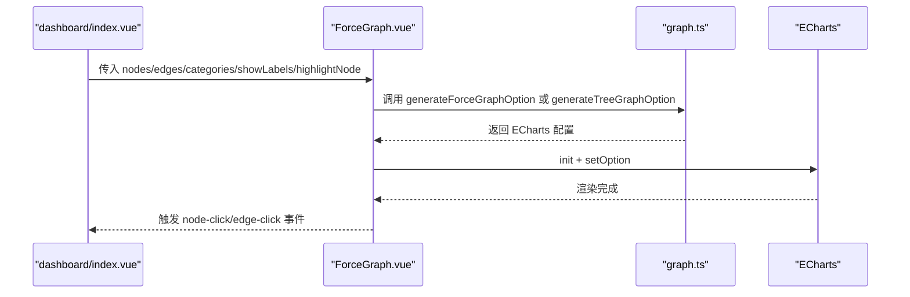
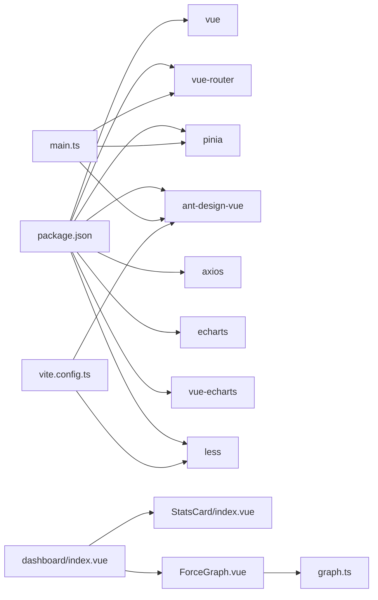

# UI/UX设计

<cite>
**本文引用的文件**
- [dark.less](file://graphiti-web/src/assets/styles/dark.less)
- [global.less](file://graphiti-web/src/assets/styles/global.less)
- [main.ts](file://graphiti-web/src/main.ts)
- [vite.config.ts](file://graphiti-web/vite.config.ts)
- [DESIGN.md](file://DESIGN.md)
- [BasicLayout.vue](file://graphiti-web/src/components/Layout/BasicLayout.vue)
- [StatsCard/index.vue](file://graphiti-web/src/components/StatsCard/index.vue)
- [ForceGraph.vue](file://graphiti-web/src/components/Graph/ForceGraph.vue)
- [graph.ts](file://graphiti-web/src/utils/graph.ts)
- [index.ts（路由）](file://graphiti-web/src/router/index.ts)
- [dashboard/index.vue](file://graphiti-web/src/views/dashboard/index.vue)
- [App.vue](file://graphiti-web/src/App.vue)
- [package.json](file://graphiti-web/package.json)
</cite>

## 目录
1. [简介](#简介)
2. [项目结构](#项目结构)
3. [核心组件](#核心组件)
4. [架构总览](#架构总览)
5. [详细组件分析](#详细组件分析)
6. [依赖分析](#依赖分析)
7. [性能考虑](#性能考虑)
8. [故障排查指南](#故障排查指南)
9. [结论](#结论)
10. [附录](#附录)

## 简介
本文件面向UI/UX设计师与前端开发者，系统梳理Graphiti控制台的UI/UX设计与实现，重点涵盖：
- Ant Design Vue组件库的使用与定制化（主题变量、组件样式覆盖）
- 全局样式架构（dark.less暗色主题与global.less通用样式组织）
- 视图组件设计模式（表单、表格、图表最佳实践）
- 交互设计原则（用户反馈、加载状态、操作确认）
- 可访问性设计（键盘导航、屏幕阅读器支持、色彩对比度）
- 移动端适配与触摸交互优化
- 动画与过渡效果规范
- 代码级实现路径与可视化图示

## 项目结构
前端采用Vue 3 + Vite + Ant Design Vue + Less，样式通过Less变量与全局覆盖实现统一风格；路由负责权限校验与页面标题设置；视图层以卡片、统计卡、图谱图为主。

**图示来源**
- [App.vue:1-16](file://graphiti-web/src/App.vue#L1-L16)
- [main.ts:1-25](file://graphiti-web/src/main.ts#L1-L25)
- [global.less:1-268](file://graphiti-web/src/assets/styles/global.less#L1-L268)
- [dark.less:1-49](file://graphiti-web/src/assets/styles/dark.less#L1-L49)
- [BasicLayout.vue:1-51](file://graphiti-web/src/components/Layout/BasicLayout.vue#L1-L51)
- [dashboard/index.vue:1-578](file://graphiti-web/src/views/dashboard/index.vue#L1-L578)
- [StatsCard/index.vue:1-162](file://graphiti-web/src/components/StatsCard/index.vue#L1-L162)
- [ForceGraph.vue:1-133](file://graphiti-web/src/components/Graph/ForceGraph.vue#L1-L133)
- [graph.ts:1-459](file://graphiti-web/src/utils/graph.ts#L1-L459)

**章节来源**
- [main.ts:1-25](file://graphiti-web/src/main.ts#L1-L25)
- [global.less:1-268](file://graphiti-web/src/assets/styles/global.less#L1-L268)
- [dark.less:1-49](file://graphiti-web/src/assets/styles/dark.less#L1-L49)
- [BasicLayout.vue:1-51](file://graphiti-web/src/components/Layout/BasicLayout.vue#L1-L51)
- [dashboard/index.vue:1-578](file://graphiti-web/src/views/dashboard/index.vue#L1-L578)
- [StatsCard/index.vue:1-162](file://graphiti-web/src/components/StatsCard/index.vue#L1-L162)
- [ForceGraph.vue:1-133](file://graphiti-web/src/components/Graph/ForceGraph.vue#L1-L133)
- [graph.ts:1-459](file://graphiti-web/src/utils/graph.ts#L1-L459)

## 核心组件
- 主题与全局样式
  - 暗色主题变量集中于dark.less，供global.less导入并驱动Antd组件覆盖。
  - global.less统一重置、滚动条、Antd组件覆盖、消息提示、通用工具类与页面过渡动画。
- 布局与页面
  - BasicLayout.vue提供头部、侧边栏与内容区域，统一背景与边框色。
  - dashboard/index.vue作为核心仪表盘，展示统计卡片、快捷操作与最近图谱列表，并内置响应式网格。
- 可复用组件
  - StatsCard：通用统计卡片，支持趋势箭头与点击回调。
  - ForceGraph：基于ECharts的图谱图，支持力导向、环形、树形布局与点击事件。
- 数据与工具
  - graph.ts：图数据转换、节点/边样式与ECharts配置生成。
  - graph API：提供图谱列表、详情、统计、节点/边查询等接口封装。

**章节来源**
- [dark.less:1-49](file://graphiti-web/src/assets/styles/dark.less#L1-L49)
- [global.less:1-268](file://graphiti-web/src/assets/styles/global.less#L1-L268)
- [BasicLayout.vue:1-51](file://graphiti-web/src/components/Layout/BasicLayout.vue#L1-L51)
- [dashboard/index.vue:1-578](file://graphiti-web/src/views/dashboard/index.vue#L1-L578)
- [StatsCard/index.vue:1-162](file://graphiti-web/src/components/StatsCard/index.vue#L1-L162)
- [ForceGraph.vue:1-133](file://graphiti-web/src/components/Graph/ForceGraph.vue#L1-L133)
- [graph.ts:1-459](file://graphiti-web/src/utils/graph.ts#L1-L459)

## 架构总览
整体架构围绕“主题变量—全局覆盖—组件样式—视图层”的分层组织，Antd组件通过Less变量与选择器覆盖实现统一风格；路由负责鉴权与标题设置；视图层以卡片与图谱图为核心，配合统计组件与交互反馈。

**图示来源**
- [dark.less:1-49](file://graphiti-web/src/assets/styles/dark.less#L1-L49)
- [global.less:1-268](file://graphiti-web/src/assets/styles/global.less#L1-L268)
- [main.ts:1-25](file://graphiti-web/src/main.ts#L1-L25)
- [index.ts（路由）:1-233](file://graphiti-web/src/router/index.ts#L1-L233)
- [BasicLayout.vue:1-51](file://graphiti-web/src/components/Layout/BasicLayout.vue#L1-L51)
- [dashboard/index.vue:1-578](file://graphiti-web/src/views/dashboard/index.vue#L1-L578)
- [StatsCard/index.vue:1-162](file://graphiti-web/src/components/StatsCard/index.vue#L1-L162)
- [ForceGraph.vue:1-133](file://graphiti-web/src/components/Graph/ForceGraph.vue#L1-L133)
- [graph.ts:1-459](file://graphiti-web/src/utils/graph.ts#L1-L459)

## 详细组件分析

### 主题与样式体系（dark.less 与 global.less）
- 主题变量
  - 主色、悬停/激活态、背景层级、文字色、边框色、辅助色、阴影、圆角、状态色、代码块背景与文字色。
- 全局覆盖
  - Antd按钮、卡片、表格、输入、下拉、单选/复选、模态框、消息提示等组件的关键属性覆盖，确保与暗色主题一致。
  - 通用工具类：居中、两端对齐、文本省略。
  - 页面过渡动画：淡入淡出。
- 构建注入
  - vite.config.ts通过Less预处理器注入dark.less变量，设置Antd主题变量与additionalData，保证运行时样式一致性。

**图示来源**
- [dark.less:1-49](file://graphiti-web/src/assets/styles/dark.less#L1-L49)
- [global.less:1-268](file://graphiti-web/src/assets/styles/global.less#L1-L268)
- [vite.config.ts:27-39](file://graphiti-web/vite.config.ts#L27-L39)

**章节来源**
- [dark.less:1-49](file://graphiti-web/src/assets/styles/dark.less#L1-L49)
- [global.less:1-268](file://graphiti-web/src/assets/styles/global.less#L1-L268)
- [vite.config.ts:27-39](file://graphiti-web/vite.config.ts#L27-L39)

### 布局组件（BasicLayout）
- 结构：头部、侧边栏、内容区三段式布局，统一背景与边框色。
- 样式：scoped作用域内使用主题变量，保证与global.less一致。

**章节来源**
- [BasicLayout.vue:1-51](file://graphiti-web/src/components/Layout/BasicLayout.vue#L1-L51)

### 仪表盘视图（dashboard/index.vue）
- 设计要点
  - 页面标题区、统计卡片网格、快捷操作区、最近图谱列表。
  - 统一使用卡片与边框色，强调hover与过渡动画。
  - 响应式：大屏3列/2列/1列自适应，移动端堆叠与标题换行。
- 交互
  - 刷新按钮结合loading状态；空状态使用Antd Empty并修正文字颜色。
  - 导航至图谱列表、详情、推理日志、本体管理等。

**图示来源**
- [dashboard/index.vue:224-294](file://graphiti-web/src/views/dashboard/index.vue#L224-L294)
- [StatsCard/index.vue:1-162](file://graphiti-web/src/components/StatsCard/index.vue#L1-L162)
- [graph.ts:1-459](file://graphiti-web/src/utils/graph.ts#L1-L459)

**章节来源**
- [dashboard/index.vue:1-578](file://graphiti-web/src/views/dashboard/index.vue#L1-L578)

### 统计卡片组件（StatsCard）
- 设计要点
  - 左侧图标区、中间数值与标签、右侧趋势指示（上升/下降）。
  - 数值格式化：千/万单位显示；支持hover提升与渐变遮罩。
- 交互
  - 可配置hoverable；点击事件向上抛出。

**章节来源**
- [StatsCard/index.vue:1-162](file://graphiti-web/src/components/StatsCard/index.vue#L1-L162)

### 图谱图组件（ForceGraph + graph.ts）
- 设计要点
  - 支持力导向、环形、树形三种布局；可切换标签显示与高亮节点。
  - 节点按类型着色（实体/事件/事件/默认），边按权重与过期状态决定线宽与虚实。
  - ECharts配置包含背景、提示框、图例、动画与强调聚焦。
- 交互
  - 点击节点/边触发上抛事件，便于联动详情面板。

**图示来源**
- [ForceGraph.vue:40-96](file://graphiti-web/src/components/Graph/ForceGraph.vue#L40-L96)
- [graph.ts:244-353](file://graphiti-web/src/utils/graph.ts#L244-L353)
- [graph.ts:377-458](file://graphiti-web/src/utils/graph.ts#L377-L458)

**章节来源**
- [ForceGraph.vue:1-133](file://graphiti-web/src/components/Graph/ForceGraph.vue#L1-L133)
- [graph.ts:1-459](file://graphiti-web/src/utils/graph.ts#L1-L459)

### 路由与鉴权（router/index.ts）
- 权限控制
  - requiresAuth元信息控制是否需要登录；定时进行token有效性检查。
  - 登录页与已登录用户访问登录页的重定向逻辑。
- 页面标题
  - 自动设置页面标题，增强上下文感知。

**章节来源**
- [index.ts（路由）:185-230](file://graphiti-web/src/router/index.ts#L185-L230)

## 依赖分析
- 依赖关系
  - main.ts注册Antd与全局样式，路由与Pinia在应用初始化阶段注入。
  - dashboard/index.vue依赖StatsCard与graph API；ForceGraph依赖graph工具函数。
  - vite.config.ts通过Less预处理器注入主题变量，影响全局样式与Antd主题。
- 外部依赖
  - Vue 3、Vue Router、Pinia、Ant Design Vue、Axios、ECharts、vue-echarts、Less。

**图示来源**
- [package.json:1-32](file://graphiti-web/package.json#L1-L32)
- [main.ts:1-25](file://graphiti-web/src/main.ts#L1-L25)
- [dashboard/index.vue:1-578](file://graphiti-web/src/views/dashboard/index.vue#L1-L578)
- [StatsCard/index.vue:1-162](file://graphiti-web/src/components/StatsCard/index.vue#L1-L162)
- [ForceGraph.vue:1-133](file://graphiti-web/src/components/Graph/ForceGraph.vue#L1-L133)
- [graph.ts:1-459](file://graphiti-web/src/utils/graph.ts#L1-L459)
- [vite.config.ts:1-41](file://graphiti-web/vite.config.ts#L1-L41)

**章节来源**
- [package.json:1-32](file://graphiti-web/package.json#L1-L32)
- [main.ts:1-25](file://graphiti-web/src/main.ts#L1-L25)
- [vite.config.ts:1-41](file://graphiti-web/vite.config.ts#L1-L41)

## 性能考虑
- 图谱渲染
  - ECharts图建议限制节点/边数量或启用虚拟化；必要时分批加载与懒渲染。
  - 合理设置动画时长与缓动，避免在低端设备上造成卡顿。
- 请求与并发
  - dashboard并行请求统计与列表，注意错误兜底与loading状态管理。
- 样式体积
  - 通过Less变量与覆盖减少重复样式，避免深层嵌套导致的样式膨胀。

## 故障排查指南
- 样式不生效
  - 检查vite.config.ts中additionalData是否正确指向dark.less；确认Antd主题变量注入顺序。
- 暗色主题不一致
  - 检查global.less中的Antd组件覆盖是否与dark.less变量一致；确认scoped样式未覆盖全局规则。
- 图谱渲染异常
  - 检查graph.ts中节点/边转换逻辑与ECharts配置；确认传入数据结构与categories匹配。
- 路由鉴权问题
  - 检查router守卫中的token校验与错误提示；确认页面标题设置逻辑。

**章节来源**
- [vite.config.ts:27-39](file://graphiti-web/vite.config.ts#L27-L39)
- [global.less:47-239](file://graphiti-web/src/assets/styles/global.less#L47-L239)
- [graph.ts:148-239](file://graphiti-web/src/utils/graph.ts#L148-L239)
- [index.ts（路由）:185-230](file://graphiti-web/src/router/index.ts#L185-L230)

## 结论
本项目以dark.less为主题基底，通过global.less对Antd组件进行系统性覆盖，形成统一的暗色视觉语言；视图层以卡片与图谱图为设计核心，结合统计组件与路由鉴权，构建了专业、高效的知识图谱控制台界面。遵循本文档的样式、交互与可访问性规范，可在保证一致性的同时提升用户体验与开发效率。

## 附录

### 视图组件设计模式（表单/表格/图表）
- 表单
  - 输入框、选择器、日期选择器统一使用暗色背景与主色边框；占位符与标签文字颜色与主题一致。
  - 错误状态与校验提示通过Antd内置能力实现，保持与主题一致。
- 表格
  - 表头与单元格背景、边框与悬停态与主题一致；支持hover高亮与行间分隔。
- 图表
  - 节点/边按类型与权重着色；支持标签开关与高亮联动；提供多种布局以适配不同场景。

**章节来源**
- [global.less:79-99](file://graphiti-web/src/assets/styles/global.less#L79-L99)
- [global.less:101-146](file://graphiti-web/src/assets/styles/global.less#L101-L146)
- [graph.ts:79-109](file://graphiti-web/src/utils/graph.ts#L79-L109)
- [graph.ts:183-210](file://graphiti-web/src/utils/graph.ts#L183-L210)

### 交互设计原则（反馈/加载/确认）
- 用户反馈
  - 使用Antd消息提示与空状态组件，确保在暗色背景下文字清晰可见。
- 加载状态
  - 按钮loading与页面骨架屏结合；dashboard中对并发请求进行统一loading管理。
- 操作确认
  - 关键删除/清空操作建议增加二次确认对话框，避免误操作。

**章节来源**
- [dashboard/index.vue:13-16](file://graphiti-web/src/views/dashboard/index.vue#L13-L16)
- [dashboard/index.vue:224-249](file://graphiti-web/src/views/dashboard/index.vue#L224-L249)
- [global.less:233-239](file://graphiti-web/src/assets/styles/global.less#L233-L239)

### 可访问性设计（键盘/屏幕阅读器/对比度）
- 键盘导航
  - 确保所有可交互元素可通过Tab聚焦；按钮与链接具备明确焦点样式。
- 屏幕阅读器支持
  - 为图标与装饰性元素提供aria-hidden；为可交互元素提供语义化标签与role。
- 色彩对比度
  - 文字与背景对比度满足WCAG AA以上；主色用于强调而非仅作装饰。

**章节来源**
- [DESIGN.md:277-308](file://DESIGN.md#L277-L308)
- [global.less:13-21](file://graphiti-web/src/assets/styles/global.less#L13-L21)

### 移动端适配与触摸交互
- 触摸目标
  - 按钮与输入框高度≥44px；标签与导航在小屏下折叠。
- 响应式布局
  - 仪表盘网格随宽度自适应；移动端堆叠与紧凑间距。

**章节来源**
- [dashboard/index.vue:551-577](file://graphiti-web/src/views/dashboard/index.vue#L551-L577)
- [DESIGN.md:502-530](file://DESIGN.md#L502-L530)

### 动画与过渡效果
- 页面过渡
  - 使用淡入淡出过渡，时长与缓动与设计一致。
- 组件hover
  - 卡片与统计卡支持轻微位移与遮罩渐变，增强触控反馈。

**章节来源**
- [global.less:260-267](file://graphiti-web/src/assets/styles/global.less#L260-L267)
- [dashboard/index.vue:370-405](file://graphiti-web/src/views/dashboard/index.vue#L370-L405)
- [StatsCard/index.vue:70-102](file://graphiti-web/src/components/StatsCard/index.vue#L70-L102)