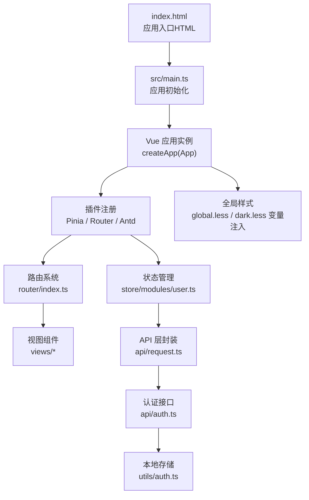
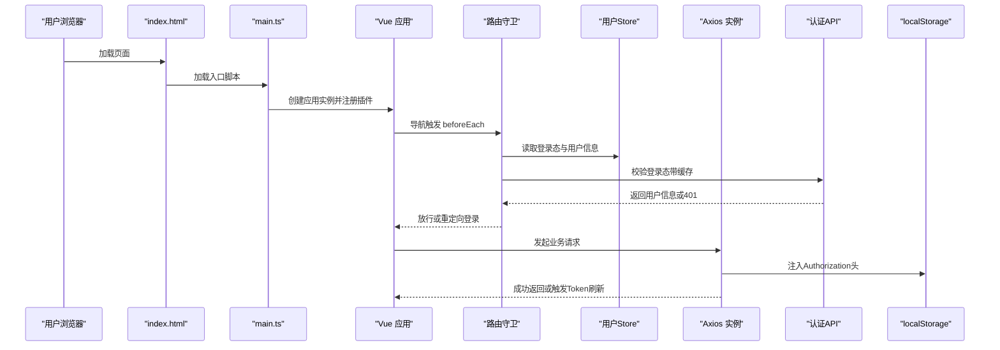
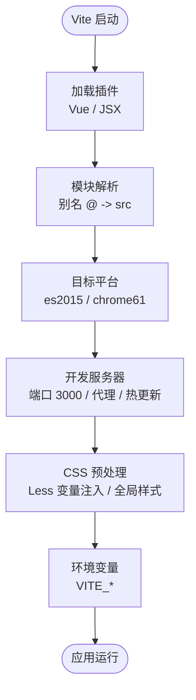
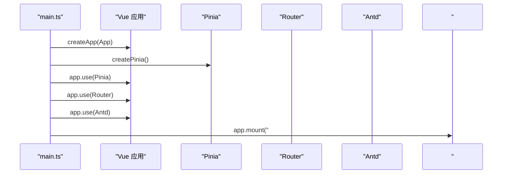
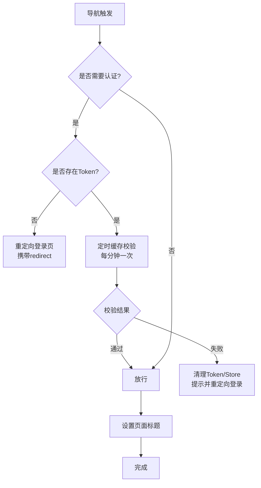
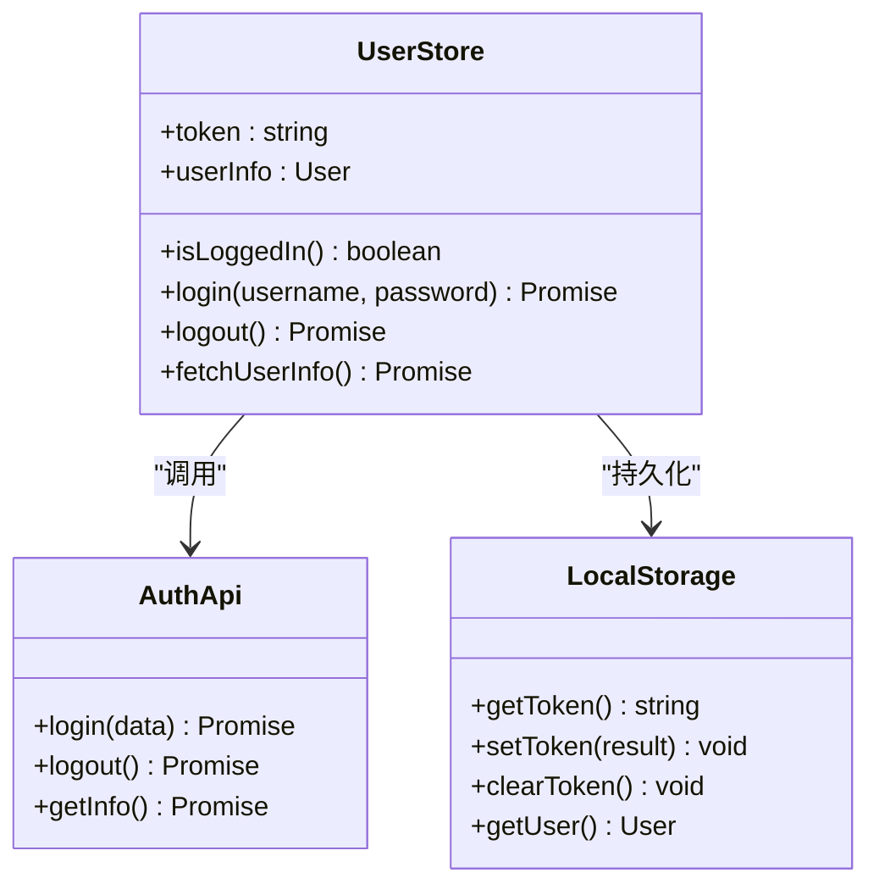
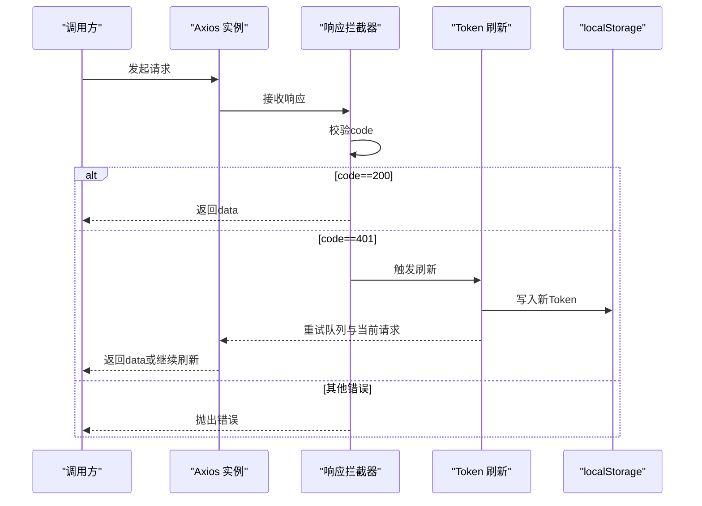
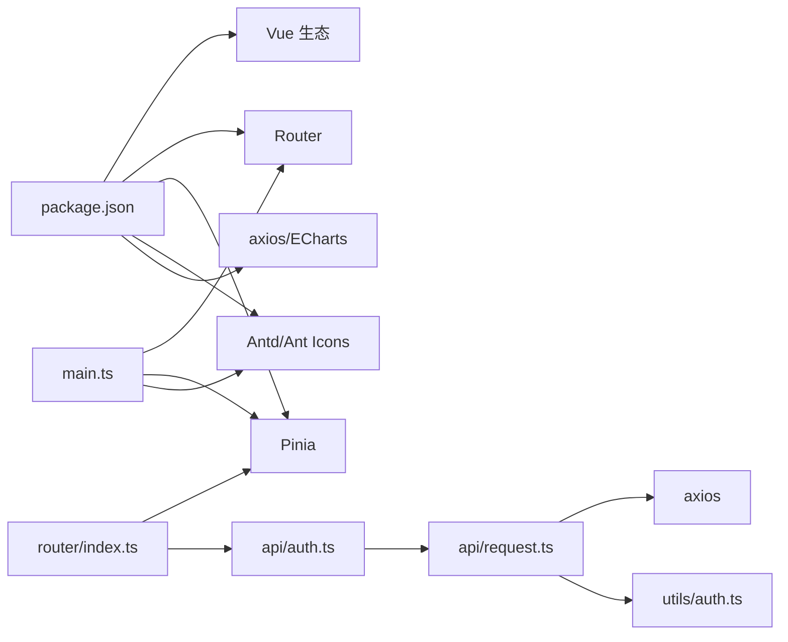

# Vue应用架构

<!--<cite>
**本文引用的文件**
- [package.json](file://ontograph-web/package.json)
- [vite.config.ts](file://ontograph-web/vite.config.ts)
- [tsconfig.json](file://ontograph-web/tsconfig.json)
- [main.ts](file://ontograph-web/src/main.ts)
- [App.vue](file://ontograph-web/src/App.vue)
- [index.html](file://ontograph-web/index.html)
- [vite-env.d.ts](file://ontograph-web/src/vite-env.d.ts)
- [router/index.ts](file://ontograph-web/src/router/index.ts)
- [store/modules/user.ts](file://ontograph-web/src/store/modules/user.ts)
- [utils/auth.ts](file://ontograph-web/src/utils/auth.ts)
- [api/auth.ts](file://ontograph-web/src/api/auth.ts)
- [api/request.ts](file://ontograph-web/src/api/request.ts)
- [components/Layout/BasicLayout.vue](file://ontograph-web/src/components/Layout/BasicLayout.vue)
- [views/dashboard/index.vue](file://ontograph-web/src/views/dashboard/index.vue)
</cite>-->

## 目录
1. [引言](#引言)
2. [项目结构](#项目结构)
3. [核心组件](#核心组件)
4. [架构总览](#架构总览)
5. [详细组件分析](#详细组件分析)
6. [依赖分析](#依赖分析)
7. [性能考虑](#性能考虑)
8. [故障排查指南](#故障排查指南)
9. [结论](#结论)
10. [附录](#附录)

## 引言
本文件面向前端架构师与高级开发者，系统性梳理基于 Vue.js 3 + Vite 的现代前端工程架构。内容涵盖构建工具配置（TypeScript 支持、模块解析、开发服务器与代理）、应用入口初始化流程（Vue 实例创建、插件注册、全局配置）、路由与状态管理设计、API 层鉴权与拦截机制、以及开发与生产环境的优化策略。文中所有技术细节均以仓库实际源码为依据，并通过图表直观展示关键流程。

## 项目结构
该前端工程位于 ontograph-web 目录，采用“按功能域分层 + 组件化”的组织方式：
- 构建与配置：package.json、vite.config.ts、tsconfig.json、vite-env.d.ts
- 入口与根组件：index.html、src/main.ts、src/App.vue
- 路由与状态：src/router、src/store
- 通用能力：src/api、src/utils、src/components、src/views
- 样式与主题：src/assets/styles

**图表来源**
- [index.html:1-14](file://ontograph-web/index.html#L1-L14)
- [main.ts:1-25](file://ontograph-web/src/main.ts#L1-L25)
- [router/index.ts:1-233](file://ontograph-web/src/router/index.ts#L1-L233)
- [store/modules/user.ts:1-67](file://ontograph-web/src/store/modules/user.ts#L1-L67)
- [api/request.ts:1-138](file://ontograph-web/src/api/request.ts#L1-L138)
- [api/auth.ts:1-53](file://ontograph-web/src/api/auth.ts#L1-L53)
- [utils/auth.ts:1-41](file://ontograph-web/src/utils/auth.ts#L1-L41)

**章节来源**
- [package.json:1-32](file://ontograph-web/package.json#L1-L32)
- [vite.config.ts:1-41](file://ontograph-web/vite.config.ts#L1-L41)
- [tsconfig.json:1-25](file://ontograph-web/tsconfig.json#L1-L25)
- [index.html:1-14](file://ontograph-web/index.html#L1-L14)

## 核心组件
- 构建与脚本：使用 Vite 5 与 Vue 插件，配合 TypeScript 类型检查与打包；提供 dev/build/preview/type-check 四类脚本。
- 模块解析：通过路径别名 @ 指向 src，便于跨目录引用；TypeScript 使用 bundler 解析策略。
- 开发服务器：端口 3000，默认代理 /api 到后端服务；LESS 预处理启用，注入暗色主题变量与全局样式。
- 应用入口：创建 Vue 实例，注册 Pinia、Router、Ant Design Vue 插件，挂载到 #app。
- 根组件：承载路由出口，统一页面背景与配色。
- 路由守卫：实现登录态校验、权限拦截、页面标题设置与缓存式鉴权检查。
- 状态管理：Pinia Store 封装用户登录态与信息，持久化至 localStorage。
- API 层：Axios 实例封装，统一请求头、响应处理、Token 刷新与队列重试。

**章节来源**
- [package.json:5-10](file://ontograph-web/package.json#L5-L10)
- [vite.config.ts:5-41](file://ontograph-web/vite.config.ts#L5-L41)
- [tsconfig.json:8-22](file://ontograph-web/tsconfig.json#L8-L22)
- [main.ts:11-25](file://ontograph-web/src/main.ts#L11-L25)
- [App.vue:1-16](file://ontograph-web/src/App.vue#L1-L16)
- [router/index.ts:181-230](file://ontograph-web/src/router/index.ts#L181-L230)
- [store/modules/user.ts:12-64](file://ontograph-web/src/store/modules/user.ts#L12-L64)
- [api/request.ts:5-61](file://ontograph-web/src/api/request.ts#L5-L61)

## 架构总览
下图展示了从前端入口到后端 API 的端到端交互路径，以及鉴权与状态管理的关键节点。

**图表来源**
- [index.html:10-11](file://ontograph-web/index.html#L10-L11)
- [main.ts:11-20](file://ontograph-web/src/main.ts#L11-L20)
- [router/index.ts:185-230](file://ontograph-web/src/router/index.ts#L185-L230)
- [store/modules/user.ts:14-54](file://ontograph-web/src/store/modules/user.ts#L14-L54)
- [api/request.ts:21-61](file://ontograph-web/src/api/request.ts#L21-L61)
- [api/auth.ts:26-50](file://ontograph-web/src/api/auth.ts#L26-L50)
- [utils/auth.ts:14-30](file://ontograph-web/src/utils/auth.ts#L14-L30)

## 详细组件分析

### 构建与开发服务器配置
- Vite 插件链：@vitejs/plugin-vue、@vitejs/plugin-vue-jsx。
- 模块解析：alias @ -> src；tsconfig paths 同步配置，确保 TS 与打包器一致。
- 目标平台：es2015 与 chrome61 CSS 目标，兼顾兼容性与现代特性。
- 代理配置：/api 代理至 http://localhost:8080，便于前后端分离联调。
- CSS 预处理：Less 变量注入暗色主题主色、圆角等；additionalData 自动引入暗色样式变量。
- 环境变量：vite-env.d.ts 定义 VITE_API_BASE_URL、VITE_APP_TITLE 等。

**图表来源**
- [vite.config.ts:6-41](file://ontograph-web/vite.config.ts#L6-L41)
- [tsconfig.json:19-21](file://ontograph-web/tsconfig.json#L19-L21)
- [vite-env.d.ts:3-11](file://ontograph-web/src/vite-env.d.ts#L3-L11)

**章节来源**
- [vite.config.ts:5-41](file://ontograph-web/vite.config.ts#L5-L41)
- [tsconfig.json:8-22](file://ontograph-web/tsconfig.json#L8-L22)
- [vite-env.d.ts:1-11](file://ontograph-web/src/vite-env.d.ts#L1-L11)

### 应用入口初始化流程（main.ts）
- 创建 Vue 应用实例并传入根组件 App.vue。
- 初始化 Pinia、注册 Router、Ant Design Vue。
- 引入全局样式（reset.css 与 global.less）。
- 挂载到 #app，打印环境与 URL 信息用于调试。

**图表来源**
- [main.ts:11-20](file://ontograph-web/src/main.ts#L11-L20)

**章节来源**
- [main.ts:1-25](file://ontograph-web/src/main.ts#L1-L25)
- [index.html:10-11](file://ontograph-web/index.html#L10-L11)

### 根组件 App.vue 设计模式
- 采用 Composition API 语法糖（<script setup>），简洁声明式风格。
- 根模板仅包含 <router-view />，实现路由驱动的视图切换。
- 全局样式限定 #app 宽高与背景色，保证整体视觉一致性。

**章节来源**
- [App.vue:1-16](file://ontograph-web/src/App.vue#L1-L16)

### 路由系统与守卫（router/index.ts）
- 路由表：采用动态导入（懒加载）拆分视图，减少首屏体积。
- 守卫逻辑：
  - 需要登录且无 Token：重定向登录页并携带 redirect。
  - 已登录：定时缓存式校验后端 /auth/info，异常则清空 Token 并提示。
  - 登录页被已登录用户访问：重定向仪表盘。
  - 设置页面标题：根据 meta.title 动态更新 document.title。
- 历史模式：基于浏览器 History API，结合 BASE_URL。

**图表来源**
- [router/index.ts:185-230](file://ontograph-web/src/router/index.ts#L185-L230)

**章节来源**
- [router/index.ts:1-174](file://ontograph-web/src/router/index.ts#L1-L174)
- [router/index.ts:176-179](file://ontograph-web/src/router/index.ts#L176-L179)

### 状态管理（Pinia Store：user.ts）
- 状态：token 与 userInfo，来源于 localStorage。
- 行为：
  - login：调用认证 API，写入 Token 与用户信息。
  - logout：调用登出 API，清理本地存储与状态。
  - fetchUserInfo：在有 Token 时拉取用户信息。
- Getter：isLoggedIn 辅助判断登录态。

**图表来源**
- [store/modules/user.ts:12-64](file://ontograph-web/src/store/modules/user.ts#L12-L64)
- [api/auth.ts:26-50](file://ontograph-web/src/api/auth.ts#L26-L50)
- [utils/auth.ts:14-40](file://ontograph-web/src/utils/auth.ts#L14-L40)

**章节来源**
- [store/modules/user.ts:1-67](file://ontograph-web/src/store/modules/user.ts#L1-L67)
- [api/auth.ts:1-53](file://ontograph-web/src/api/auth.ts#L1-L53)
- [utils/auth.ts:1-41](file://ontograph-web/src/utils/auth.ts#L1-L41)

### API 层与鉴权拦截（request.ts 与 auth.ts）
- Axios 实例：baseURL 来自 VITE_API_BASE_URL，统一超时与拦截器。
- 请求拦截：自动附加 Bearer Token。
- 响应拦截：
  - 业务成功（code==200）透传 data。
  - 401 触发 Token 刷新流程（防抖队列、最多重试 3 次）。
  - 其他错误码：弹出消息并抛出错误，允许调用方处理。
- Token 刷新：并发请求排队，刷新成功后批量重试，失败则清空 Token 并跳转登录。

**图表来源**
- [api/request.ts:5-61](file://ontograph-web/src/api/request.ts#L5-L61)
- [api/request.ts:64-135](file://ontograph-web/src/api/request.ts#L64-L135)
- [api/auth.ts:26-50](file://ontograph-web/src/api/auth.ts#L26-L50)
- [utils/auth.ts:18-25](file://ontograph-web/src/utils/auth.ts#L18-L25)

**章节来源**
- [api/request.ts:1-138](file://ontograph-web/src/api/request.ts#L1-L138)
- [api/auth.ts:1-53](file://ontograph-web/src/api/auth.ts#L1-L53)
- [utils/auth.ts:1-41](file://ontograph-web/src/utils/auth.ts#L1-L41)

### 布局与视图组件（BasicLayout 与 Dashboard）
- BasicLayout：采用 Ant Design Vue 布局组件，包含 Header、Sidebar 与 Content 区域，统一暗色主题样式变量。
- Dashboard：作为首页视图，使用统计卡片、快捷操作与最近图谱列表，采用并行请求与响应式布局。

**章节来源**
- [components/Layout/BasicLayout.vue:1-51](file://ontograph-web/src/components/Layout/BasicLayout.vue#L1-L51)
- [views/dashboard/index.vue:1-578](file://ontograph-web/src/views/dashboard/index.vue#L1-L578)

## 依赖分析
- 运行时依赖：Vue 3、Vue Router 4、Pinia 2、Ant Design Vue 4、axios、echarts、vue-echarts、@ant-design/icons-vue、less。
- 开发依赖：@vitejs/plugin-vue、@vitejs/plugin-vue-jsx、typescript、vue-tsc、vite、unplugin-vue-components、unplugin-auto-import。
- 依赖关系耦合：应用通过 main.ts 注册 Router/Pinia/Antd；API 层依赖 axios；路由守卫依赖用户 Store 与认证 API；Store 依赖本地存储工具。

**图表来源**
- [package.json:11-30](file://ontograph-web/package.json#L11-L30)
- [main.ts:11-16](file://ontograph-web/src/main.ts#L11-L16)
- [router/index.ts:1-6](file://ontograph-web/src/router/index.ts#L1-L6)
- [api/auth.ts:1-53](file://ontograph-web/src/api/auth.ts#L1-L53)
- [api/request.ts:1-138](file://ontograph-web/src/api/request.ts#L1-L138)
- [utils/auth.ts:1-41](file://ontograph-web/src/utils/auth.ts#L1-L41)

**章节来源**
- [package.json:1-32](file://ontograph-web/package.json#L1-L32)

## 性能考虑
- 代码分割与懒加载：路由视图采用动态导入，降低首屏包体。
- 缓存式鉴权检查：1 分钟内复用校验结果，减少后端压力。
- 并行请求：Dashboard 对统计数据与列表进行 Promise.allSettled 并行加载。
- CSS 产物目标：es2015 与 chrome61，兼顾兼容与体积；暗色主题变量集中管理，避免重复计算。
- 构建优化：Vite 默认开启 Tree Shaking；生产构建建议开启压缩与资源内联策略（如需）。

[本节为通用性能建议，无需特定文件引用]

## 故障排查指南
- 登录态失效或 401：
  - 检查 VITE_API_BASE_URL 是否正确指向后端地址。
  - 查看路由守卫是否触发清理逻辑与重定向。
  - 确认 axios 响应拦截器是否进入 Token 刷新流程。
- Token 刷新失败：
  - 检查 /auth/refresh 接口可用性与返回格式。
  - 关注刷新重试上限（最多 3 次），超过后清空 Token 并跳转登录。
- 样式异常：
  - 确认 dark.less 变量注入与 additionalData 配置。
  - 检查 Less 版本与 javascriptEnabled 配置。
- 开发代理：
  - 确认 /api 代理目标与 changeOrigin 设置。
  - 如遇跨域问题，优先检查后端 CORS 配置。

**章节来源**
- [vite.config.ts:20-26](file://ontograph-web/vite.config.ts#L20-L26)
- [router/index.ts:194-217](file://ontograph-web/src/router/index.ts#L194-L217)
- [api/request.ts:64-135](file://ontograph-web/src/api/request.ts#L64-L135)
- [api/request.ts:5-8](file://ontograph-web/src/api/request.ts#L5-L8)

## 结论
该 Vue 3 + Vite 工程在模块解析、开发体验、鉴权与状态管理方面形成了清晰的分层与职责边界。通过路由守卫与 API 拦截器实现统一的登录态治理，配合 Pinia Store 与本地存储，保障了用户体验与安全性。建议在生产构建中进一步结合 CDN、缓存策略与资源压缩，持续优化加载性能与稳定性。

## 附录
- 开发环境配置要点
  - 环境变量：在 vite-env.d.ts 中声明 VITE_API_BASE_URL、VITE_APP_TITLE 等。
  - 代理：在 vite.config.ts server.proxy 中配置后端地址。
  - 热重载：Vite 默认启用，无需额外配置。
- 生产构建流程
  - 使用脚本 npm run build 或 yarn build，内部先执行类型检查再打包。
  - 构建产物默认输出至 dist，可通过 Vite 输出目录配置调整。

**章节来源**
- [vite-env.d.ts:3-11](file://ontograph-web/src/vite-env.d.ts#L3-L11)
- [vite.config.ts:18-26](file://ontograph-web/vite.config.ts#L18-L26)
- [package.json:7](file://ontograph-web/package.json#L7)