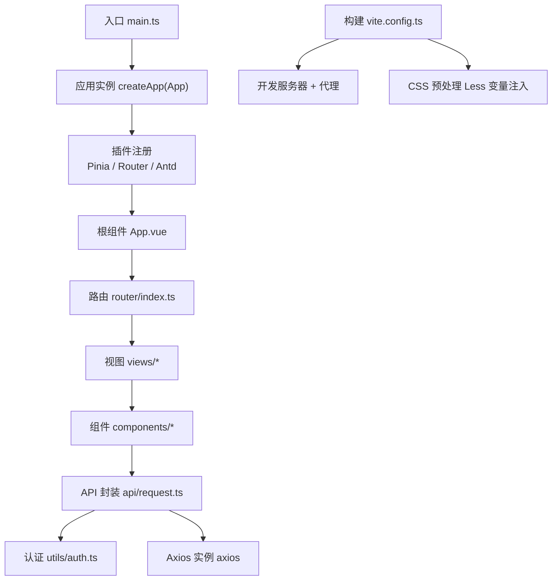
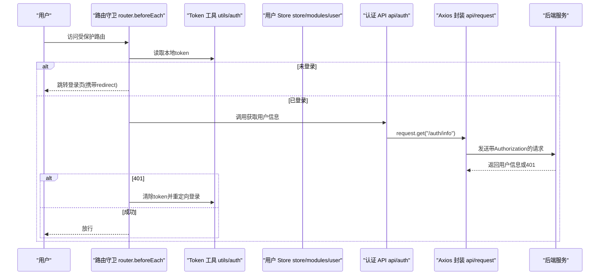
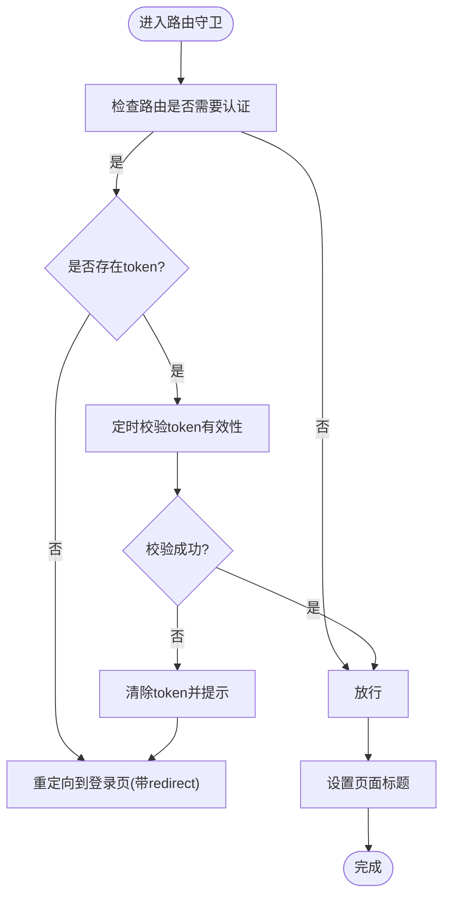
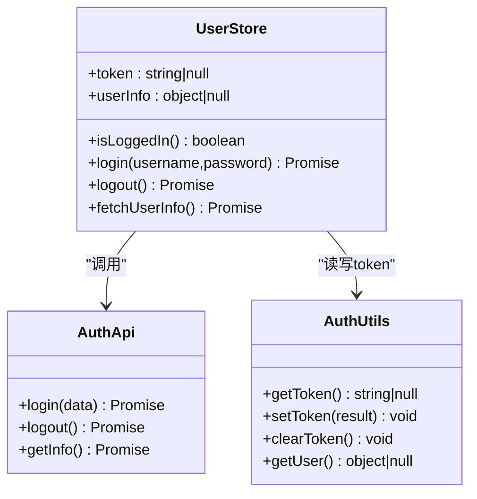
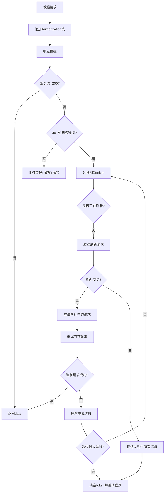
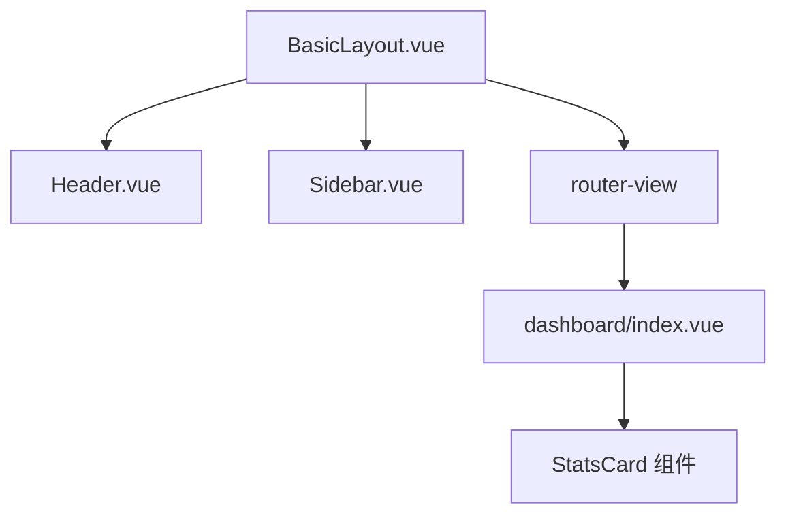
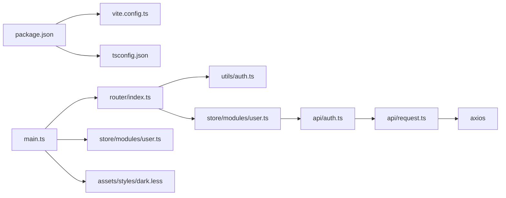

# 前端应用

<cite>
**本文引用的文件**
- [package.json](file://graphiti-web/package.json)
- [vite.config.ts](file://graphiti-web/vite.config.ts)
- [main.ts](file://graphiti-web/src/main.ts)
- [router/index.ts](file://graphiti-web/src/router/index.ts)
- [store/modules/user.ts](file://graphiti-web/src/store/modules/user.ts)
- [api/request.ts](file://graphiti-web/src/api/request.ts)
- [utils/auth.ts](file://graphiti-web/src/utils/auth.ts)
- [api/auth.ts](file://graphiti-web/src/api/auth.ts)
- [components/Layout/BasicLayout.vue](file://graphiti-web/src/components/Layout/BasicLayout.vue)
- [views/dashboard/index.vue](file://graphiti-web/src/views/dashboard/index.vue)
- [assets/styles/dark.less](file://graphiti-web/src/assets/styles/dark.less)
- [tsconfig.json](file://graphiti-web/tsconfig.json)
</cite>

## 目录
1. [简介](#简介)
2. [项目结构](#项目结构)
3. [核心组件](#核心组件)
4. [架构总览](#架构总览)
5. [组件详解](#组件详解)
6. [依赖关系分析](#依赖关系分析)
7. [性能考量](#性能考量)
8. [故障排查指南](#故障排查指南)
9. [结论](#结论)
10. [附录](#附录)

## 简介
本文件面向前端开发者与UI/UX设计师，系统梳理Graphiti-Java前端应用（基于Vue.js 3）的架构与实现要点。内容涵盖项目结构、路由与状态管理、组件分层设计、与后端API的集成方式（含Axios封装、认证与错误处理）、构建与部署流程、样式与主题定制、开发与调试技巧以及性能优化建议。目标是帮助团队快速理解并高效迭代该单页应用。

## 项目结构
- 技术栈：Vue 3 + TypeScript + Vite + Pinia + Vue Router + Ant Design Vue + Axios + ECharts
- 构建工具：Vite（开发服务器、代理、CSS预处理）
- 状态管理：Pinia（模块化store）
- 路由：Vue Router（history模式，带鉴权守卫）
- 样式：Less（暗色主题变量集中管理）

图表来源
- [main.ts:1-25](file://graphiti-web/src/main.ts#L1-L25)
- [router/index.ts:1-233](file://graphiti-web/src/router/index.ts#L1-L233)
- [api/request.ts:1-138](file://graphiti-web/src/api/request.ts#L1-L138)
- [vite.config.ts:1-41](file://graphiti-web/vite.config.ts#L1-L41)

章节来源
- [package.json:1-32](file://graphiti-web/package.json#L1-L32)
- [tsconfig.json:1-25](file://graphiti-web/tsconfig.json#L1-L25)
- [vite.config.ts:1-41](file://graphiti-web/vite.config.ts#L1-L41)
- [main.ts:1-25](file://graphiti-web/src/main.ts#L1-L25)

## 核心组件
- 应用入口与插件注册：创建Vue应用、安装Pinia/Router/Antd，并挂载根组件。
- 路由系统：定义多级路由与鉴权守卫；对需要登录的页面进行token校验与自动跳转。
- 状态管理：用户登录态与基本信息通过Pinia持久化至localStorage。
- API封装：统一Axios实例，内置请求/响应拦截器、token刷新队列与错误提示。
- 认证工具：token与用户信息的本地存储与读取。
- 布局组件：BasicLayout组合Header/Sidebar/Content区域，配合Antd布局组件。
- 视图组件：以功能域划分，如仪表盘、图谱管理、数据导入导出、系统管理等。
- 样式体系：全局Less变量注入，支持主题定制与暗色风格。

章节来源
- [main.ts:1-25](file://graphiti-web/src/main.ts#L1-L25)
- [router/index.ts:1-233](file://graphiti-web/src/router/index.ts#L1-L233)
- [store/modules/user.ts:1-67](file://graphiti-web/src/store/modules/user.ts#L1-L67)
- [api/request.ts:1-138](file://graphiti-web/src/api/request.ts#L1-L138)
- [utils/auth.ts:1-41](file://graphiti-web/src/utils/auth.ts#L1-L41)
- [components/Layout/BasicLayout.vue:1-51](file://graphiti-web/src/components/Layout/BasicLayout.vue#L1-L51)
- [views/dashboard/index.vue:1-578](file://graphiti-web/src/views/dashboard/index.vue#L1-L578)
- [assets/styles/dark.less:1-49](file://graphiti-web/src/assets/styles/dark.less#L1-L49)

## 架构总览
下图展示从前端到后端的关键交互路径，包括路由守卫、状态管理、API封装与认证流程。

图表来源
- [router/index.ts:185-230](file://graphiti-web/src/router/index.ts#L185-L230)
- [utils/auth.ts:14-30](file://graphiti-web/src/utils/auth.ts#L14-L30)
- [store/modules/user.ts:35-44](file://graphiti-web/src/store/modules/user.ts#L35-L44)
- [api/auth.ts:43-49](file://graphiti-web/src/api/auth.ts#L43-L49)
- [api/request.ts:35-61](file://graphiti-web/src/api/request.ts#L35-L61)

## 组件详解

### 路由与鉴权
- 路由采用history模式，支持多级嵌套布局与按需加载视图。
- 鉴权守卫逻辑：
  - 若目标路由requiresAuth为true且未登录，重定向至登录页并携带redirect参数。
  - 若已登录，定期（默认1分钟）调用后端接口校验token有效性；若返回401则清空token并跳转登录。
  - 已登录用户访问登录页时自动跳转仪表盘。
  - 动态设置页面标题。

图表来源
- [router/index.ts:185-230](file://graphiti-web/src/router/index.ts#L185-L230)

章节来源
- [router/index.ts:1-233](file://graphiti-web/src/router/index.ts#L1-L233)

### 状态管理（Pinia）
- 用户store负责：
  - 读取/写入token与用户信息（localStorage）。
  - 提供登录、登出、拉取用户信息等动作。
  - 暴露isLoggedIn计算属性供组件使用。

图表来源
- [store/modules/user.ts:12-64](file://graphiti-web/src/store/modules/user.ts#L12-L64)
- [api/auth.ts:26-50](file://graphiti-web/src/api/auth.ts#L26-L50)
- [utils/auth.ts:14-40](file://graphiti-web/src/utils/auth.ts#L14-L40)

章节来源
- [store/modules/user.ts:1-67](file://graphiti-web/src/store/modules/user.ts#L1-L67)
- [api/auth.ts:1-53](file://graphiti-web/src/api/auth.ts#L1-L53)
- [utils/auth.ts:1-41](file://graphiti-web/src/utils/auth.ts#L1-L41)

### API封装与认证
- Axios实例：
  - 基础URL来自环境变量，统一超时配置。
  - 请求头自动附加Authorization: Bearer token。
  - 响应拦截：根据后端返回的业务状态码决定透传数据或抛错；401触发token刷新流程。
- Token刷新策略：
  - 使用isRefreshing与队列refreshQueue避免并发刷新与请求丢失。
  - 最多重试3次，失败则清空token并跳转登录。
- 错误处理：
  - 对非业务错误（code!=1002）统一弹出消息提示。
  - 网络错误与401错误统一提示。

图表来源
- [api/request.ts:5-138](file://graphiti-web/src/api/request.ts#L5-L138)

章节来源
- [api/request.ts:1-138](file://graphiti-web/src/api/request.ts#L1-L138)

### 布局与视图
- BasicLayout：Antd布局容器，内含Header与Sidebar，内容区通过router-view渲染当前视图。
- Dashboard：首页视图，包含统计卡片、快捷操作与最近图谱列表，使用并行请求提升首屏性能。

图表来源
- [components/Layout/BasicLayout.vue:1-51](file://graphiti-web/src/components/Layout/BasicLayout.vue#L1-L51)
- [views/dashboard/index.vue:1-578](file://graphiti-web/src/views/dashboard/index.vue#L1-L578)

章节来源
- [components/Layout/BasicLayout.vue:1-51](file://graphiti-web/src/components/Layout/BasicLayout.vue#L1-L51)
- [views/dashboard/index.vue:1-578](file://graphiti-web/src/views/dashboard/index.vue#L1-L578)

### 样式与主题
- 全局Less变量注入：通过Vite的css.preprocessorOptions.less.modifyVars与additionalData，集中定义主色、背景、文字、边框、阴影与圆角等。
- 暗色主题：dark.less提供深色系变量，适配控制台视觉风格。
- 组件样式：采用scoped + less，结合变量实现一致的视觉与交互体验。

章节来源
- [vite.config.ts:27-39](file://graphiti-web/vite.config.ts#L27-L39)
- [assets/styles/dark.less:1-49](file://graphiti-web/src/assets/styles/dark.less#L1-L49)

## 依赖关系分析
- 入口依赖：main.ts依赖Pinia、Router、Antd与全局样式。
- 路由依赖：router/index.ts依赖鉴权工具与用户store，动态导入各视图组件。
- 状态依赖：store/modules/user.ts依赖api/auth.ts与utils/auth.ts。
- API依赖：api/request.ts依赖axios与utils/auth.ts；api/auth.ts依赖request。
- 构建依赖：package.json声明运行脚本与依赖版本；tsconfig.json定义路径别名与编译选项；vite.config.ts配置代理与CSS变量。

图表来源
- [package.json:1-32](file://graphiti-web/package.json#L1-L32)
- [main.ts:1-25](file://graphiti-web/src/main.ts#L1-L25)
- [router/index.ts:1-233](file://graphiti-web/src/router/index.ts#L1-L233)
- [store/modules/user.ts:1-67](file://graphiti-web/src/store/modules/user.ts#L1-L67)
- [api/auth.ts:1-53](file://graphiti-web/src/api/auth.ts#L1-L53)
- [api/request.ts:1-138](file://graphiti-web/src/api/request.ts#L1-L138)
- [utils/auth.ts:1-41](file://graphiti-web/src/utils/auth.ts#L1-L41)
- [vite.config.ts:1-41](file://graphiti-web/vite.config.ts#L1-L41)
- [tsconfig.json:1-25](file://graphiti-web/tsconfig.json#L1-L25)

章节来源
- [package.json:1-32](file://graphiti-web/package.json#L1-L32)
- [tsconfig.json:1-25](file://graphiti-web/tsconfig.json#L1-L25)
- [vite.config.ts:1-41](file://graphiti-web/vite.config.ts#L1-L41)
- [main.ts:1-25](file://graphiti-web/src/main.ts#L1-L25)

## 性能考量
- 资源加载
  - 路由按需加载：视图组件通过动态import延迟加载，减少首屏体积。
  - Axios默认超时合理，针对大体量导入场景可在调用侧覆盖更长超时。
- 并发与缓存
  - 首屏Dashboard使用Promise.allSettled并行请求统计与列表，失败项单独处理，避免阻塞。
  - 路由守卫对token校验设置1分钟间隔，降低频繁校验带来的压力。
- 样式与主题
  - Less变量集中管理，避免重复定义；暗色主题变量统一，便于维护。
- 代码质量
  - TypeScript严格模式开启，减少潜在运行时错误。
  - Vite构建目标ES2015，兼容现代浏览器。

章节来源
- [router/index.ts:185-230](file://graphiti-web/src/router/index.ts#L185-L230)
- [views/dashboard/index.vue:229-249](file://graphiti-web/src/views/dashboard/index.vue#L229-L249)
- [api/request.ts:5-8](file://graphiti-web/src/api/request.ts#L5-L8)
- [tsconfig.json:14-17](file://graphiti-web/tsconfig.json#L14-L17)

## 故障排查指南
- 登录后立即跳转登录页
  - 可能原因：后端返回401或token过期。
  - 处理步骤：确认鉴权接口可用；检查路由守卫中的校验逻辑与提示；必要时清理localStorage后重试。
- 请求频繁报“认证失败”
  - 可能原因：刷新token失败或队列处理异常。
  - 处理步骤：查看刷新流程日志；确认刷新接口可用；检查最大重试次数与队列清理逻辑。
- 样式异常或主题不生效
  - 可能原因：Less变量未正确注入或路径解析问题。
  - 处理步骤：检查Vite配置中的additionalData与modifyVars；确认变量命名与组件引用一致。
- 构建或热更新异常
  - 可能原因：Vite代理配置或TypeScript路径映射问题。
  - 处理步骤：确认代理target与端口；检查tsconfig路径别名与编译选项。

章节来源
- [router/index.ts:185-230](file://graphiti-web/src/router/index.ts#L185-L230)
- [api/request.ts:64-135](file://graphiti-web/src/api/request.ts#L64-L135)
- [vite.config.ts:27-39](file://graphiti-web/vite.config.ts#L27-L39)
- [tsconfig.json:18-22](file://graphiti-web/tsconfig.json#L18-L22)

## 结论
本项目采用现代化前端技术栈，围绕Vue 3生态构建了清晰的单页应用架构。通过Pinia管理用户状态、Vue Router实现路由守卫与按需加载、Axios封装统一处理认证与错误、Less变量集中管理主题，整体具备良好的可维护性与扩展性。建议在后续迭代中持续完善API文档、补充单元测试与端到端测试，并关注跨浏览器兼容与可访问性细节。

## 附录

### 开发与构建流程
- 启动开发服务器：执行开发脚本，Vite监听3000端口，启用代理转发/api到后端。
- 构建产物：TypeScript类型检查后由Vite打包，目标浏览器为现代浏览器（ES2015）。
- 预览生产包：本地预览构建产物，便于快速验证。

章节来源
- [package.json:5-10](file://graphiti-web/package.json#L5-L10)
- [vite.config.ts:14-26](file://graphiti-web/vite.config.ts#L14-L26)

### 环境变量与代理
- 基础URL：通过VITE_API_BASE_URL配置，Axios实例据此拼接完整请求地址。
- 代理：开发阶段将/api前缀转发至后端服务，避免跨域问题。

章节来源
- [api/request.ts:6](file://graphiti-web/src/api/request.ts#L6)
- [vite.config.ts:20-25](file://graphiti-web/vite.config.ts#L20-L25)

### 组件开发指南
- 组件分层
  - 布局组件：仅负责容器与结构，不直接依赖业务数据。
  - 业务组件：封装具体功能（如统计卡片），复用性强。
  - UI组件：Ant Design Vue提供的基础控件，遵循设计规范。
- 设计原则
  - 单一职责：每个组件聚焦一个功能点。
  - 可复用性：通过props与events解耦，便于在多处使用。
  - 可测试性：尽量保持纯函数与无副作用逻辑。
- 样式管理
  - 使用scoped样式与Less变量，避免样式冲突。
  - 暗色主题变量集中维护，新增组件遵循现有命名约定。

章节来源
- [components/Layout/BasicLayout.vue:1-51](file://graphiti-web/src/components/Layout/BasicLayout.vue#L1-L51)
- [assets/styles/dark.less:1-49](file://graphiti-web/src/assets/styles/dark.less#L1-L49)

### 用户体验与可访问性
- 可访问性
  - 为按钮、链接等交互元素提供明确的焦点状态与键盘导航支持。
  - 图标与文本同时呈现，确保无图像支持的用户也能理解含义。
- 一致性
  - 统一使用Ant Design Vue组件库，保证交互与视觉一致性。
  - 主题变量统一，减少视觉跳跃。
- 反馈
  - 错误与成功提示使用全局消息组件，及时告知用户操作结果。
  - 加载状态通过按钮loading与骨架屏提升感知速度。

章节来源
- [views/dashboard/index.vue:13-16](file://graphiti-web/src/views/dashboard/index.vue#L13-L16)
- [api/request.ts:46-48](file://graphiti-web/src/api/request.ts#L46-L48)