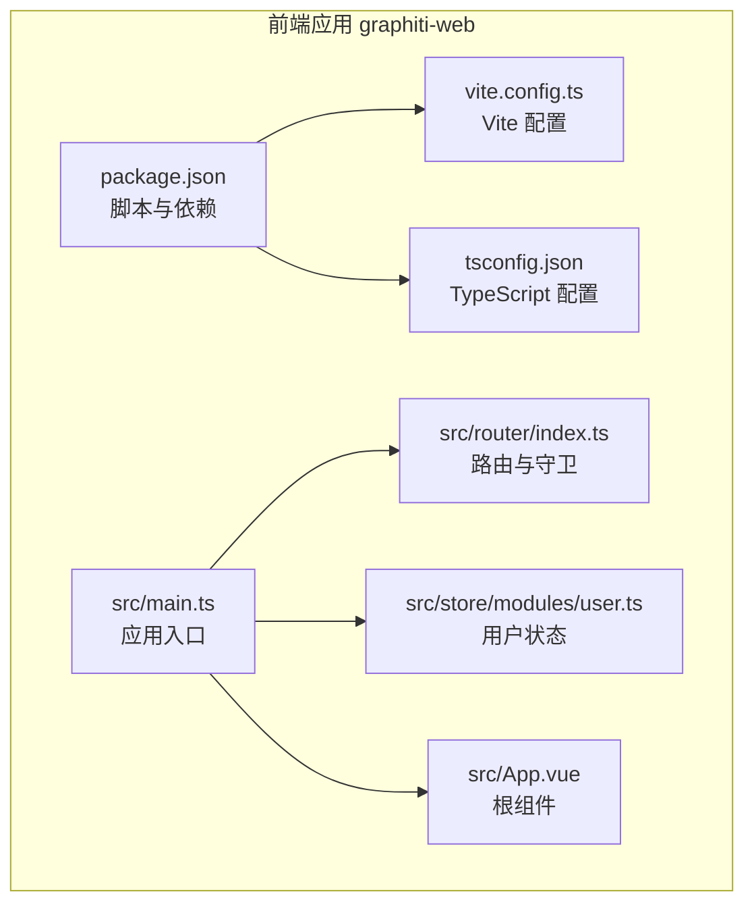
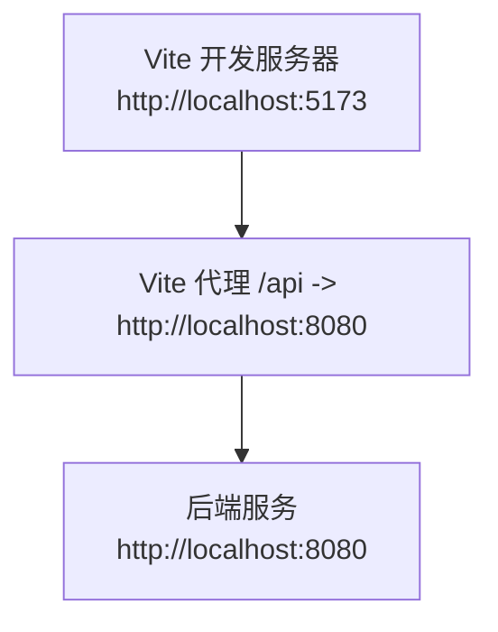
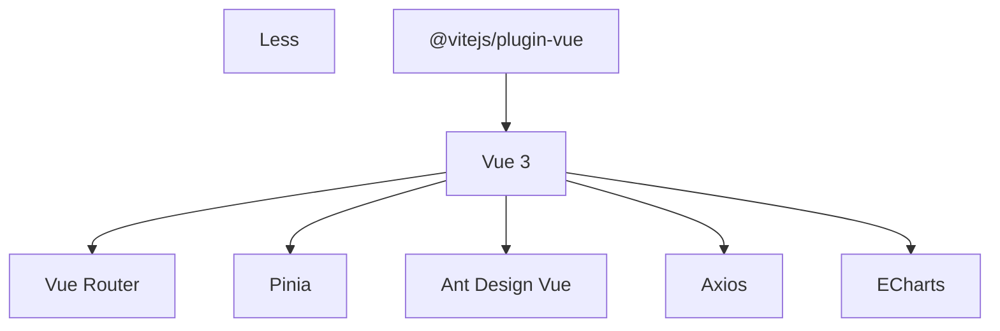
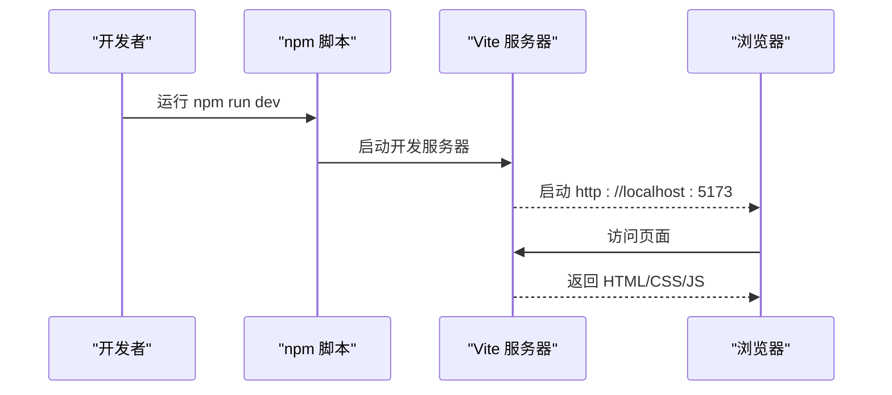
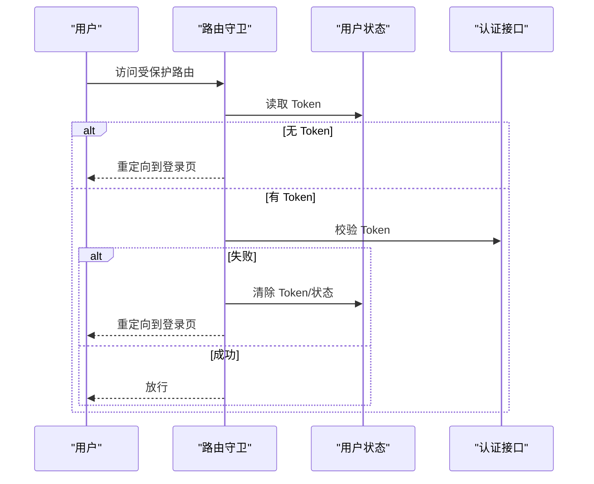

# 开发流程

<!--<cite>
**本文引用的文件**
- [package.json](file://graphiti-web/package.json)
- [vite.config.ts](file://graphiti-web/vite.config.ts)
- [tsconfig.json](file://graphiti-web/tsconfig.json)
- [README.md](file://README.md)
- [README_CN.md](file://README_CN.md)
- [DESIGN.md](file://DESIGN.md)
- [setup.bat](file://graphiti-web/setup.bat)
- [install.bat](file://graphiti-web/install.bat)
- [main.ts](file://graphiti-web/src/main.ts)
- [router/index.ts](file://graphiti-web/src/router/index.ts)
- [store/modules/user.ts](file://graphiti-web/src/store/modules/user.ts)
- [App.vue](file://graphiti-web/src/App.vue)
- [commit-msg.txt](file://commit-msg.txt)
</cite>-->

## 目录
1. [简介](#简介)
2. [项目结构](#项目结构)
3. [核心组件](#核心组件)
4. [架构总览](#架构总览)
5. [详细组件分析](#详细组件分析)
6. [依赖分析](#依赖分析)
7. [性能考虑](#性能考虑)
8. [故障排查指南](#故障排查指南)
9. [结论](#结论)
10. [附录](#附录)

## 简介
本文件面向前端开发团队，提供基于 Vue 3 + Vite 的完整开发工作流程指导。内容涵盖开发环境搭建（Node.js 版本、包管理器选择与依赖安装）、Vite 构建工具配置与优化（开发服务器、代理、CSS 预处理器、构建目标）、TypeScript 配置与类型管理（编译选项、路径映射、类型检查）、代码规范与格式化工具（ESLint、Prettier、Git 钩子）、调试技巧（浏览器调试、Vue DevTools、网络监控）、单元与集成测试配置思路、版本控制最佳实践与分支管理策略、持续集成与自动化部署流程等。

## 项目结构
前端工程位于 graphiti-web 目录，采用 Vue 3 单页应用架构，配合 Vite 作为构建工具与开发服务器，使用 TypeScript 进行类型管理，Ant Design Vue 提供 UI 组件库，Pinia 管理状态，Axios 发起 HTTP 请求，Less 处理样式与主题变量。

图表来源
- [package.json:1-32](file://graphiti-web/package.json#L1-L32)
- [vite.config.ts:1-41](file://graphiti-web/vite.config.ts#L1-L41)
- [tsconfig.json:1-25](file://graphiti-web/tsconfig.json#L1-L25)
- [main.ts:1-25](file://graphiti-web/src/main.ts#L1-L25)
- [router/index.ts:1-233](file://graphiti-web/src/router/index.ts#L1-L233)
- [store/modules/user.ts:1-67](file://graphiti-web/src/store/modules/user.ts#L1-L67)
- [App.vue:1-16](file://graphiti-web/src/App.vue#L1-L16)

章节来源
- [README.md:170-197](file://README.md#L170-L197)
- [README_CN.md:170-197](file://README_CN.md#L170-L197)

## 核心组件
- 应用入口与依赖注入：在应用入口中注册路由、状态管理与 UI 组件库，统一挂载根组件。
- 路由与鉴权：基于 Vue Router 的路由表与全局前置守卫，实现登录拦截、Token 校验与页面标题设置。
- 用户状态管理：基于 Pinia 的用户 Store，封装登录、登出与用户信息获取。
- 构建与开发：Vite 提供开发服务器、热更新与生产构建；TypeScript 提供类型检查与路径别名；Less 提供主题变量与全局样式。

章节来源
- [main.ts:1-25](file://graphiti-web/src/main.ts#L1-L25)
- [router/index.ts:181-230](file://graphiti-web/src/router/index.ts#L181-L230)
- [store/modules/user.ts:12-64](file://graphiti-web/src/store/modules/user.ts#L12-L64)
- [package.json:5-10](file://graphiti-web/package.json#L5-L10)
- [vite.config.ts:14-26](file://graphiti-web/vite.config.ts#L14-L26)
- [tsconfig.json:18-22](file://graphiti-web/tsconfig.json#L18-L22)

## 架构总览
前端与后端通过 Vite 代理进行联调，开发阶段前端运行在本地端口，后端运行在固定端口，代理将 /api 前缀请求转发至后端。应用通过 Axios 调用后端接口，Pinia 管理用户会话状态，Vue Router 控制页面导航与权限校验。

图表来源
- [vite.config.ts:18-26](file://graphiti-web/vite.config.ts#L18-L26)
- [README.md:303-312](file://README.md#L303-L312)
- [README_CN.md:303-312](file://README_CN.md#L303-L312)

## 详细组件分析

### 开发环境搭建
- Node.js 版本：根据项目文档，前端开发需 Node.js 18+。
- 包管理器：推荐使用 pnpm（项目脚本与 lock 文件显示），也可使用 npm 或 yarn。
- 依赖安装：执行安装命令后，可直接启动开发服务器；Windows 提供批处理脚本一键安装与启动。

章节来源
- [README.md:230-312](file://README.md#L230-L312)
- [README_CN.md:230-312](file://README_CN.md#L230-L312)
- [setup.bat:1-32](file://graphiti-web/setup.bat#L1-L32)
- [install.bat:1-10](file://graphiti-web/install.bat#L1-L10)

### Vite 配置与优化
- 插件：启用 @vitejs/plugin-vue 以支持 Vue SFC。
- 路径别名：通过 resolve.alias 将 @ 映射到 src，便于导入。
- 构建目标：target 设为 es2015，cssTarget 为 chrome61，确保兼容性与体积平衡。
- 开发服务器：端口 3000，启用代理将 /api 转发至后端。
- CSS 预处理：Less 配置主题变量、启用 JavaScript 变量与全局样式注入。

章节来源
- [vite.config.ts:1-41](file://graphiti-web/vite.config.ts#L1-L41)

### TypeScript 配置与类型管理
- 编译选项：严格模式、无 emit、模块解析采用 bundler、允许 TS 扩展名、JSON 模块解析等。
- 路径映射：baseUrl 与 paths 配合 @/* 实现绝对路径导入。
- 类型检查：通过脚本 vue-tsc --noEmit 在构建前进行类型检查。

章节来源
- [tsconfig.json:1-25](file://graphiti-web/tsconfig.json#L1-L25)
- [package.json:9-9](file://graphiti-web/package.json#L9-L9)

### 代码规范与格式化
- ESLint：建议在项目中集成 ESLint，统一规则集，结合 Prettier 进行格式化。
- Prettier：统一缩进、引号、分号等风格，避免团队分歧。
- Git 钩子：使用 Husky + lint-staged 在提交前自动运行 ESLint/Prettier，保证提交质量。

章节来源
- [README.md:499-523](file://README.md#L499-L523)
- [README_CN.md:499-523](file://README_CN.md#L499-L523)

### 调试技巧与开发工具
- 浏览器调试：打开开发者工具，观察 Network 面板确认接口请求与响应；Console 查看应用日志。
- Vue DevTools：安装浏览器扩展，查看组件树、状态与路由信息。
- 网络监控：利用 Vite 代理与后端 Swagger UI 对比请求参数与返回值，定位问题。
- 日志与监控：参考监控视图与后端 Actuator 接口，结合前端日志定位问题。

章节来源
- [router/index.ts:185-230](file://graphiti-web/src/router/index.ts#L185-L230)
- [commit-msg.txt:13-16](file://commit-msg.txt#L13-L16)

### 单元测试与集成测试
- 单元测试：为 Vue 组件与工具函数编写测试，使用 Vitest + @vue/test-utils。
- 集成测试：对路由守卫、状态管理与 API 调用进行端到端测试，结合 Mock 服务端响应。
- 覆盖率：设置阈值，保证关键路径被覆盖。

章节来源
- [router/index.ts:181-230](file://graphiti-web/src/router/index.ts#L181-L230)
- [store/modules/user.ts:21-44](file://graphiti-web/src/store/modules/user.ts#L21-L44)

### 版本控制最佳实践与分支管理
- 提交信息：采用 feat/fix/docs/refactor/test/chore 类型，清晰表达变更意图。
- 分支策略：主分支保护，功能开发在 feature/*，修复在 fix/*，热修复在 hotfix/*。
- 合并与审查：通过 Pull Request 审查，确保代码质量与一致性。

章节来源
- [README.md:514-523](file://README.md#L514-L523)
- [README_CN.md:514-523](file://README_CN.md#L514-L523)

### 持续集成与自动化部署
- CI 流程：拉取代码 → 安装依赖 → 类型检查 → 单元测试 → 构建产物 → 部署到预发布或生产。
- 缓存策略：缓存包管理器缓存目录，加速依赖安装。
- 安全扫描：在 CI 中集成安全扫描与依赖漏洞检测。
- 自动化部署：结合制品库与部署平台，实现蓝绿/滚动发布。

章节来源
- [package.json:5-10](file://graphiti-web/package.json#L5-L10)

## 依赖分析
前端依赖主要围绕 Vue 3 生态与构建工具链，核心包括 Vue、Vue Router、Pinia、Ant Design Vue、Axios、ECharts、Less 与 Vite 插件生态。这些依赖共同支撑开发体验、组件体系与构建效率。

图表来源
- [package.json:11-30](file://graphiti-web/package.json#L11-L30)

章节来源
- [package.json:11-30](file://graphiti-web/package.json#L11-L30)

## 性能考虑
- 构建目标：es2015 与 chrome61 的 CSS 目标在兼容性与体积间取得平衡。
- 代码分割：按路由拆分打包，减少首屏加载体积。
- 样式优化：通过 Less 变量集中管理主题，避免重复计算与冗余样式。
- 资源压缩：生产构建默认启用压缩与 Tree Shaking。
- 缓存策略：静态资源配置长缓存，HTML 不缓存。

章节来源
- [vite.config.ts:14-17](file://graphiti-web/vite.config.ts#L14-L17)

## 故障排查指南
- 依赖安装失败：检查网络与镜像源，必要时清理缓存后重试。
- 开发服务器端口冲突：修改 Vite server.port 或关闭占用进程。
- 跨域与代理：确认 /api 代理配置正确，后端允许跨域。
- 类型错误：运行类型检查脚本，逐项修复错误。
- 登录失效：路由守卫会拦截并提示重新登录，检查 Token 存储与后端会话。

章节来源
- [setup.bat:11-18](file://graphiti-web/setup.bat#L11-L18)
- [vite.config.ts:18-26](file://graphiti-web/vite.config.ts#L18-L26)
- [router/index.ts:194-217](file://graphiti-web/src/router/index.ts#L194-L217)

## 结论
本文提供了从环境搭建到开发调试、从构建优化到版本控制与 CI/CD 的全流程指导。建议团队在现有配置基础上，补充 ESLint/Prettier/Husky、单元测试与集成测试，并完善 CI 流水线，以提升开发效率与交付质量。

## 附录

### 开发服务器启动序列

图表来源
- [package.json:6-6](file://graphiti-web/package.json#L6-L6)
- [vite.config.ts:18-26](file://graphiti-web/vite.config.ts#L18-L26)

### 登录与鉴权流程

图表来源
- [router/index.ts:185-230](file://graphiti-web/src/router/index.ts#L185-L230)
- [store/modules/user.ts:35-44](file://graphiti-web/src/store/modules/user.ts#L35-L44)