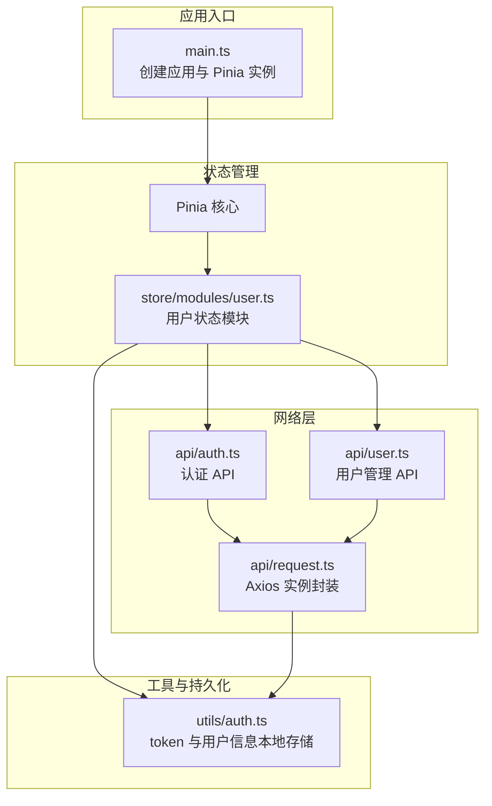
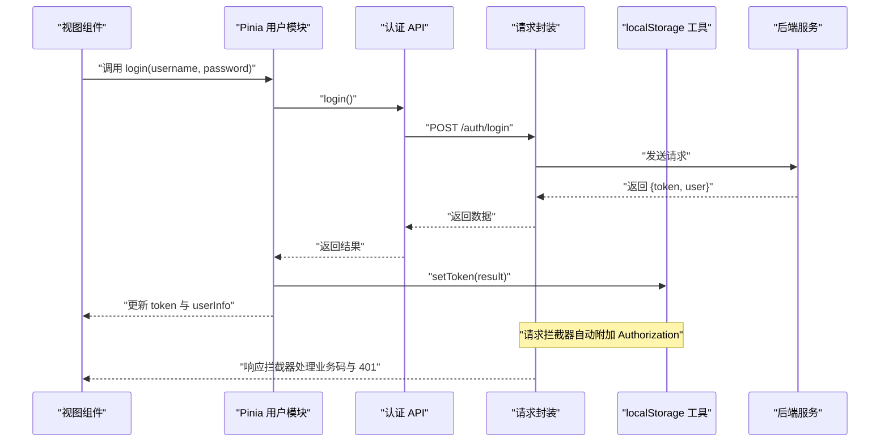
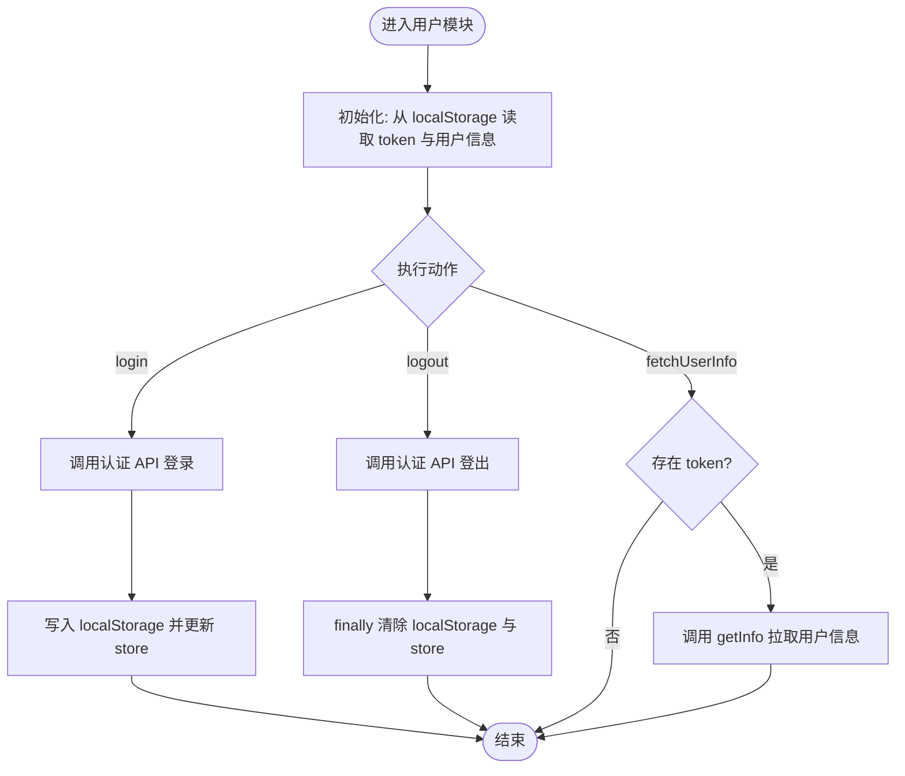
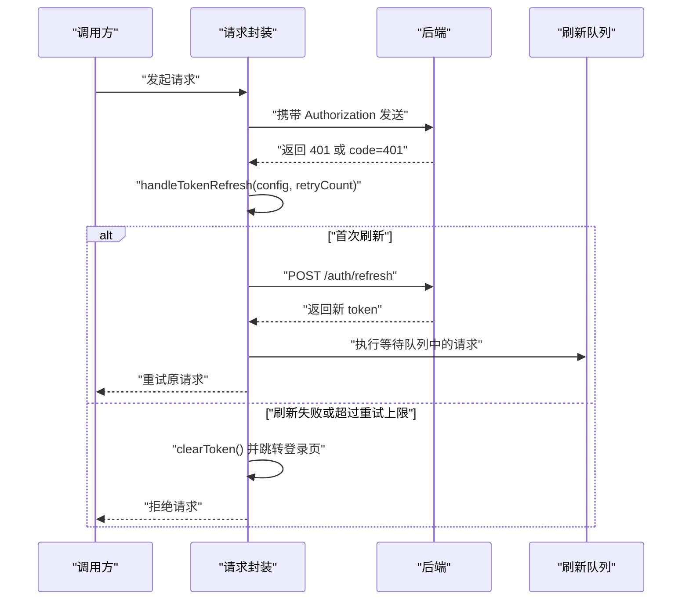
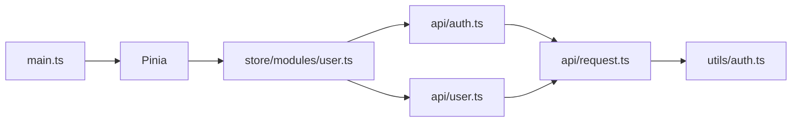

# 状态管理

<!--<cite>
**本文引用的文件**   
- [ontograph-web/package.json](file://ontograph-web/package.json)
- [ontograph-web/src/main.ts](file://ontograph-web/src/main.ts)
- [ontograph-web/src/store/modules/user.ts](file://ontograph-web/src/store/modules/user.ts)
- [ontograph-web/src/api/auth.ts](file://ontograph-web/src/api/auth.ts)
- [ontograph-web/src/api/user.ts](file://ontograph-web/src/api/user.ts)
- [ontograph-web/src/utils/auth.ts](file://ontograph-web/src/utils/auth.ts)
- [ontograph-web/src/api/request.ts](file://ontograph-web/src/api/request.ts)
- [ontograph-web/vite.config.ts](file://ontograph-web/vite.config.ts)
- [ontograph-web/tsconfig.json](file://ontograph-web/tsconfig.json)
</cite>-->

## 目录
1. [简介](#简介)
2. [项目结构](#项目结构)
3. [核心组件](#核心组件)
4. [架构总览](#架构总览)
5. [详细组件分析](#详细组件分析)
6. [依赖分析](#依赖分析)
7. [性能考虑](#性能考虑)
8. [故障排查指南](#故障排查指南)
9. [结论](#结论)
10. [附录](#附录)

## 简介
本文件面向状态管理开发者，系统性梳理本项目的前端状态管理方案。项目采用 Pinia（Vue 3 官方推荐的状态管理库）实现用户态管理，结合 Axios 封装的请求层完成与后端的认证与数据交互。文档涵盖以下主题：
- Pinia Store 的模块化组织与设计原则（state、getters、actions）
- 用户状态管理（登录态、用户信息、权限信息与偏好设置）
- 状态持久化策略（localStorage 使用场景与边界）
- 异步状态管理模式（API 调用、状态同步与错误处理）
- 状态调试工具（Vue DevTools）使用建议
- 最佳实践（状态规范化、性能优化、内存泄漏防护）
- 与 Vue 3 Composition API 的集成方式

## 项目结构
前端工程位于 ontograph-web 目录，采用 Vite + Vue 3 + TypeScript 技术栈，状态管理以 Pinia 为核心，通过模块化 Store 组织用户相关状态。

**图表来源**
- [ontograph-web/src/main.ts:1-25](file://ontograph-web/src/main.ts#L1-L25)
- [ontograph-web/src/store/modules/user.ts:1-67](file://ontograph-web/src/store/modules/user.ts#L1-L67)
- [ontograph-web/src/api/auth.ts:1-53](file://ontograph-web/src/api/auth.ts#L1-L53)
- [ontograph-web/src/api/user.ts:1-151](file://ontograph-web/src/api/user.ts#L1-L151)
- [ontograph-web/src/api/request.ts:1-138](file://ontograph-web/src/api/request.ts#L1-L138)
- [ontograph-web/src/utils/auth.ts:1-41](file://ontograph-web/src/utils/auth.ts#L1-L41)

**章节来源**
- [ontograph-web/package.json:1-32](file://ontograph-web/package.json#L1-L32)
- [ontograph-web/src/main.ts:1-25](file://ontograph-web/src/main.ts#L1-L25)
- [ontograph-web/vite.config.ts:1-41](file://ontograph-web/vite.config.ts#L1-L41)
- [ontograph-web/tsconfig.json:1-25](file://ontograph-web/tsconfig.json#L1-L25)

## 核心组件
- Pinia 核心：在应用入口初始化并注入，作为全局状态容器。
- 用户状态模块（user.ts）：集中管理 token、用户信息、登录/登出、获取用户信息等动作。
- 认证 API（auth.ts）：封装登录、登出、获取当前用户信息等接口。
- 请求封装（request.ts）：统一处理请求头、响应体、鉴权失败与 token 刷新、错误提示与透传。
- 工具函数（utils/auth.ts）：基于 localStorage 存储 token 与用户信息，提供读取、写入、清理能力。
- 用户管理 API（user.ts）：提供用户列表、详情、创建、更新、删除等管理接口（供系统管理页面使用）。

**章节来源**
- [ontograph-web/src/store/modules/user.ts:1-67](file://ontograph-web/src/store/modules/user.ts#L1-L67)
- [ontograph-web/src/api/auth.ts:1-53](file://ontograph-web/src/api/auth.ts#L1-L53)
- [ontograph-web/src/api/request.ts:1-138](file://ontograph-web/src/api/request.ts#L1-L138)
- [ontograph-web/src/utils/auth.ts:1-41](file://ontograph-web/src/utils/auth.ts#L1-L41)
- [ontograph-web/src/api/user.ts:1-151](file://ontograph-web/src/api/user.ts#L1-L151)

## 架构总览
下图展示从组件到状态管理与网络层的整体调用链路，以及 token 刷新与错误处理的关键节点。

**图表来源**
- [ontograph-web/src/store/modules/user.ts:21-33](file://ontograph-web/src/store/modules/user.ts#L21-L33)
- [ontograph-web/src/api/auth.ts:31-33](file://ontograph-web/src/api/auth.ts#L31-L33)
- [ontograph-web/src/api/request.ts:21-61](file://ontograph-web/src/api/request.ts#L21-L61)
- [ontograph-web/src/utils/auth.ts:18-25](file://ontograph-web/src/utils/auth.ts#L18-L25)

## 详细组件分析

### 用户状态模块（Pinia + Composition API）
- 设计原则
  - 使用 defineStore 与组合式风格，便于与 Vue 3 Composition API 协同。
  - state 仅存放必要字段（token、userInfo），避免冗余。
  - getters 提供派生状态（如是否登录），减少模板中的逻辑。
  - actions 封装异步流程（登录、登出、获取用户信息），集中错误处理与 UI 反馈。
- 关键点
  - 初始化：从 localStorage 读取 token 与用户信息，保证刷新后状态不丢失。
  - 登录：调用认证 API，成功后写入 localStorage 并更新 store。
  - 登出：调用认证 API，finally 分支确保清除本地与 store 状态。
  - 获取用户信息：在有 token 时拉取用户信息，异常时记录日志。

**图表来源**
- [ontograph-web/src/store/modules/user.ts:12-54](file://ontograph-web/src/store/modules/user.ts#L12-L54)

**章节来源**
- [ontograph-web/src/store/modules/user.ts:1-67](file://ontograph-web/src/store/modules/user.ts#L1-L67)

### 认证 API 与请求封装
- 认证 API
  - login：提交用户名与密码，返回 token 与用户信息。
  - logout：触发后端登出。
  - getInfo：获取当前用户信息。
- 请求封装
  - 请求拦截器：自动附加 Authorization 头。
  - 响应拦截器：统一解析业务码；当 code=401 或 401 响应时触发 token 刷新。
  - token 刷新：支持并发请求排队、最多重试次数限制、刷新失败后的兜底处理（清空 token、跳转登录页）。
  - 错误处理：非 1002 的业务错误统一弹窗提示，其余错误透传给调用方。

**图表来源**
- [ontograph-web/src/api/request.ts:64-135](file://ontograph-web/src/api/request.ts#L64-L135)

**章节来源**
- [ontograph-web/src/api/auth.ts:1-53](file://ontograph-web/src/api/auth.ts#L1-L53)
- [ontograph-web/src/api/request.ts:1-138](file://ontograph-web/src/api/request.ts#L1-L138)

### 工具函数与持久化策略
- localStorage 使用场景
  - 存储 token 与用户信息，实现刷新后状态保持。
  - 读取 token 注入到请求头，实现自动鉴权。
- 边界与注意事项
  - localStorage 不具备过期控制，需配合后端令牌机制与刷新策略。
  - 用户信息变更后需同步更新本地存储，避免状态不一致。
  - 在多标签页场景，localStorage 变更不会自动同步，需谨慎处理跨标签页一致性。

**章节来源**
- [ontograph-web/src/utils/auth.ts:1-41](file://ontograph-web/src/utils/auth.ts#L1-L41)
- [ontograph-web/src/api/request.ts:21-32](file://ontograph-web/src/api/request.ts#L21-L32)

### 与 Vue 3 Composition API 的集成
- 在组件中使用用户状态
  - 通过 storeToRefs 或直接解构访问响应式状态与 getter。
  - 在 onMounted 中调用 fetchUserInfo 完成初始化拉取。
  - 在事件回调中调用 actions（如 login、logout）驱动状态变更。
- 与路由守卫结合
  - 在路由守卫中检查 store 的登录态，决定是否放行或重定向至登录页。

**章节来源**
- [ontograph-web/src/store/modules/user.ts:12-64](file://ontograph-web/src/store/modules/user.ts#L12-L64)

## 依赖分析
- 依赖关系
  - main.ts 初始化 Pinia 并注入应用。
  - user.ts 依赖 auth.ts 与 utils/auth.ts。
  - auth.ts 与 user.ts 依赖 request.ts。
  - request.ts 依赖 utils/auth.ts 读取/写入 token。
- 潜在耦合点
  - user.ts 对 utils/auth.ts 的直接依赖较为紧密，建议在需要时抽象为 TokenService。
  - request.ts 与 auth.ts 的耦合体现在刷新 token 的调用，可进一步抽象为 AuthInterceptor。

**图表来源**
- [ontograph-web/src/main.ts:11-16](file://ontograph-web/src/main.ts#L11-L16)
- [ontograph-web/src/store/modules/user.ts:1-6](file://ontograph-web/src/store/modules/user.ts#L1-L6)
- [ontograph-web/src/api/auth.ts:1-53](file://ontograph-web/src/api/auth.ts#L1-L53)
- [ontograph-web/src/api/user.ts:1-151](file://ontograph-web/src/api/user.ts#L1-L151)
- [ontograph-web/src/api/request.ts:1-138](file://ontograph-web/src/api/request.ts#L1-L138)
- [ontograph-web/src/utils/auth.ts:1-41](file://ontograph-web/src/utils/auth.ts#L1-L41)

**章节来源**
- [ontograph-web/package.json:11-21](file://ontograph-web/package.json#L11-L21)

## 性能考虑
- 响应式粒度
  - 将用户信息拆分为多个字段而非大对象，减少不必要的渲染。
- 异步操作批处理
  - 在高频请求场景下，合并或去抖相关 API 调用。
- 缓存策略
  - 对于不频繁变化的数据（如用户基础信息），可在 store 内部做短期缓存并设置失效时间。
- 请求拦截与重试
  - 控制重试次数与指数退避，避免雪崩效应。
- UI 反馈
  - 在长耗时操作（如登录、批量删除）中提供加载状态，提升用户体验。

## 故障排查指南
- 登录后仍提示未登录
  - 检查 localStorage 中 token 是否正确写入。
  - 确认请求拦截器是否附加了 Authorization 头。
  - 查看响应拦截器对 401 的处理是否触发了 token 刷新。
- token 刷新失败
  - 观察刷新队列是否被正确执行与清理。
  - 检查刷新接口的超时与网络状况。
- 错误提示缺失
  - 确认业务码 1002 的特殊处理逻辑是否符合预期。
  - 检查全局消息组件是否正常工作。

**章节来源**
- [ontograph-web/src/api/request.ts:35-61](file://ontograph-web/src/api/request.ts#L35-L61)
- [ontograph-web/src/utils/auth.ts:14-30](file://ontograph-web/src/utils/auth.ts#L14-L30)

## 结论
本项目采用 Pinia + Axios 的轻量级状态管理方案，围绕用户态实现了登录、登出、信息拉取与 token 刷新的完整闭环。通过 localStorage 实现状态持久化，并在请求层统一处理鉴权与错误，具备良好的可维护性与扩展性。建议后续在以下方面持续演进：
- 将用户偏好设置纳入 store，完善状态规范化与持久化策略。
- 抽象 token 与鉴权相关逻辑，降低模块间耦合。
- 引入 Vue DevTools 进行状态监控与时间旅行调试。

## 附录

### 状态调试工具使用建议（Vue DevTools）
- 安装与启用
  - 在浏览器中安装 Vue DevTools 扩展。
  - 在开发模式下运行应用，确保 DevTools 可观测到 Pinia 实例。
- 常用功能
  - Store 面板：查看当前 store 的 state、getters、actions 调用历史。
  - 状态对比：观察 actions 执行前后 state 的变化。
  - 时间旅行：回放 actions，快速定位问题引入点。
- 注意事项
  - 生产环境建议关闭 DevTools 或限制其访问范围。

### 状态管理最佳实践清单
- 状态规范化
  - 将用户信息按字段拆分，避免嵌套大对象。
  - 对列表数据建立 ID 到实体的映射，减少重复渲染。
- 性能优化
  - 使用 computed 与 shallowRef 降低响应式开销。
  - 对高频更新的字段进行节流/去抖。
- 内存泄漏防护
  - 在组件卸载时取消未完成的请求或清理定时器。
  - 避免在 store 中持有 DOM 引用或全局订阅未释放。