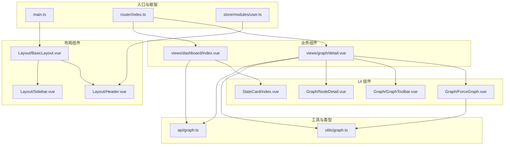
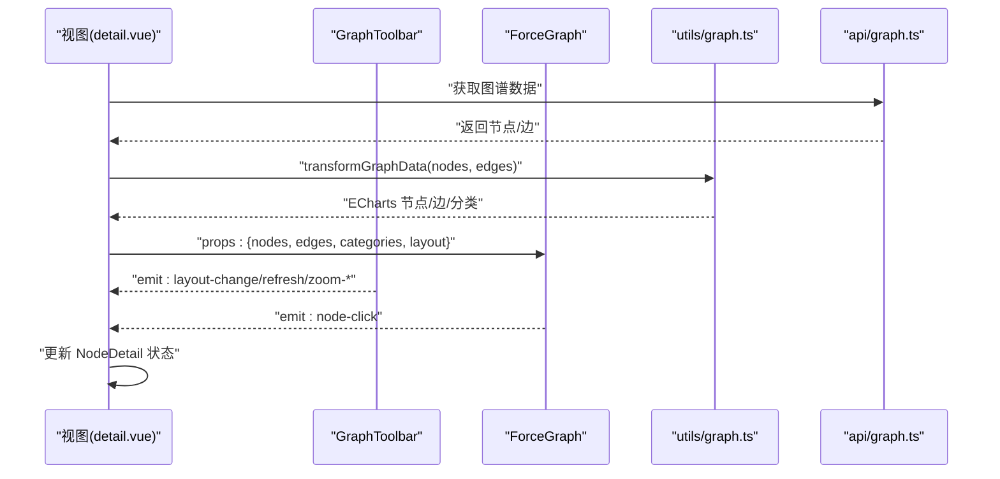
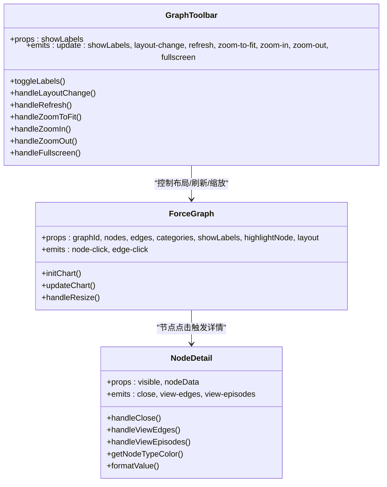
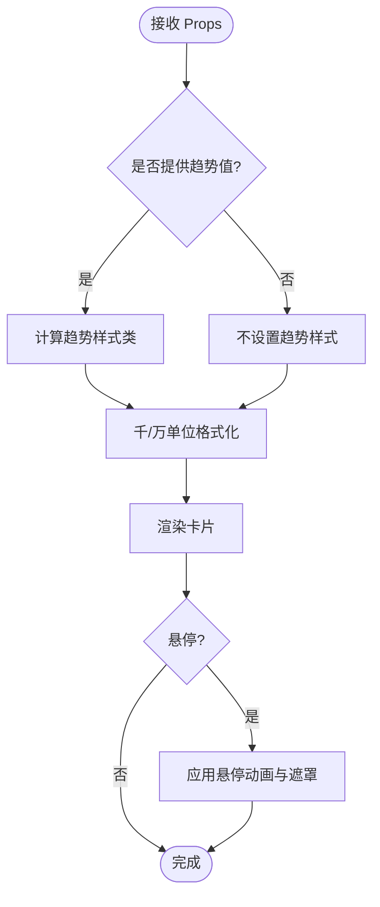
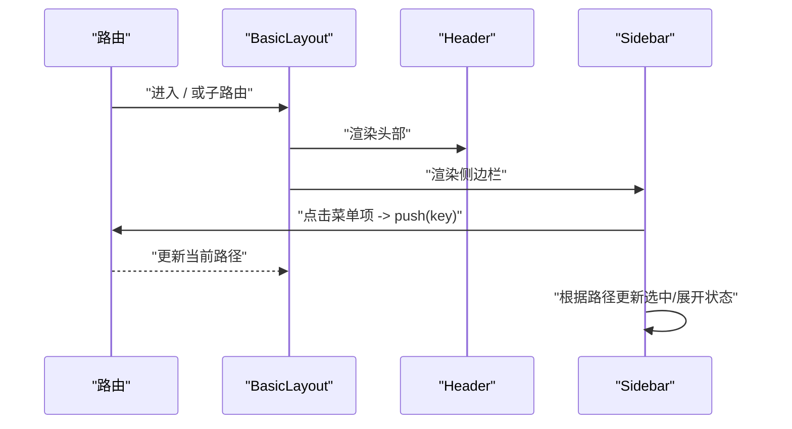
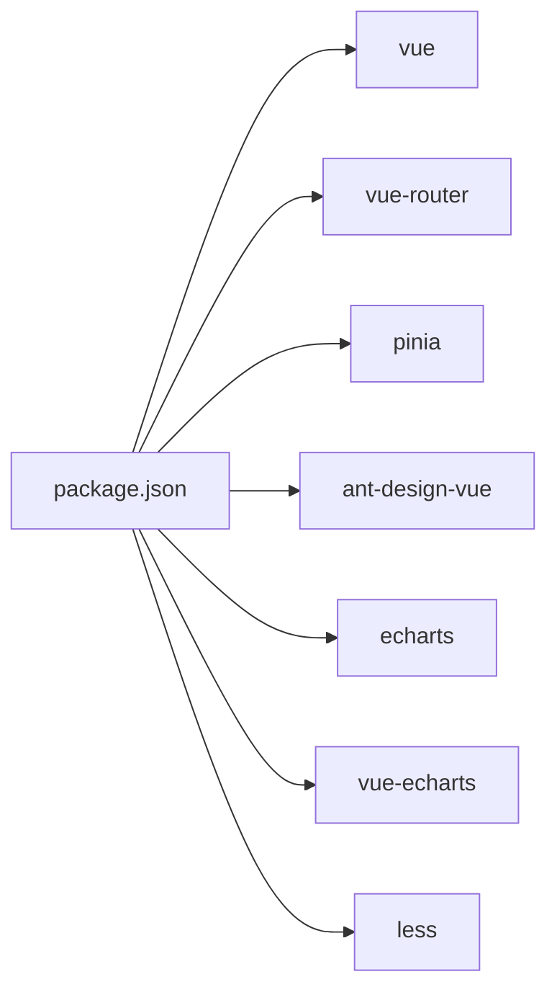

# 组件设计

<!--<cite>
**本文引用的文件**
- [ForceGraph.vue](file://graphiti-web/src/components/Graph/ForceGraph.vue)
- [GraphToolbar.vue](file://graphiti-web/src/components/Graph/GraphToolbar.vue)
- [NodeDetail.vue](file://graphiti-web/src/components/Graph/NodeDetail.vue)
- [StatsCard/index.vue](file://graphiti-web/src/components/StatsCard/index.vue)
- [BasicLayout.vue](file://graphiti-web/src/components/Layout/BasicLayout.vue)
- [Header.vue](file://graphiti-web/src/components/Layout/Header.vue)
- [Sidebar.vue](file://graphiti-web/src/components/Layout/Sidebar.vue)
- [graph.ts](file://graphiti-web/src/utils/graph.ts)
- [detail.vue](file://graphiti-web/src/views/graph/detail.vue)
- [index.vue](file://graphiti-web/src/views/dashboard/index.vue)
- [main.ts](file://graphiti-web/src/main.ts)
- [package.json](file://graphiti-web/package.json)
- [graph.ts（API）](file://graphiti-web/src/api/graph.ts)
- [index.ts（路由）](file://graphiti-web/src/router/index.ts)
- [user.ts（Pinia Store）](file://graphiti-web/src/store/modules/user.ts)
</cite>-->

## 目录
1. [简介](#简介)
2. [项目结构](#项目结构)
3. [核心组件](#核心组件)
4. [架构总览](#架构总览)
5. [详细组件分析](#详细组件分析)
6. [依赖分析](#依赖分析)
7. [性能考虑](#性能考虑)
8. [故障排查指南](#故障排查指南)
9. [结论](#结论)
10. [附录](#附录)

## 简介
本文件系统性梳理 Graphiti 前端（Vue 3 + TypeScript + Less）的组件设计模式，重点覆盖：
- 组件分层：布局组件、业务组件、UI 组件的职责划分与协作
- 组件通信：props 传递、事件发射、provide/inject 的使用现状与建议
- 组件复用：高阶组件、混入、组合式 API 的实践与替代方案
- Graph 组件家族：ForceGraph、GraphToolbar、NodeDetail 的协同工作流
- 通用组件抽象：StatsCard 的参数化配置与可扩展性
- 最佳实践：命名规范、样式封装、性能优化
- 测试与调试：组件测试策略与调试技巧

## 项目结构
前端采用“视图 + 组件 + 工具 + API + 路由 + 状态”分层组织，组件主要位于 graphiti-web/src/components 下，视图位于 graphiti-web/src/views 下，工具与类型位于 utils 与 types 中。

**图表来源**
- [main.ts:1-25](file://graphiti-web/src/main.ts#L1-L25)
- [index.ts（路由）:1-233](file://graphiti-web/src/router/index.ts#L1-L233)
- [BasicLayout.vue:1-51](file://graphiti-web/src/components/Layout/BasicLayout.vue#L1-L51)
- [Header.vue:1-212](file://graphiti-web/src/components/Layout/Header.vue#L1-L212)
- [Sidebar.vue:1-311](file://graphiti-web/src/components/Layout/Sidebar.vue#L1-L311)
- [detail.vue:1-426](file://graphiti-web/src/views/graph/detail.vue#L1-L426)
- [index.vue（仪表盘）:1-578](file://graphiti-web/src/views/dashboard/index.vue#L1-L578)
- [ForceGraph.vue:1-133](file://graphiti-web/src/components/Graph/ForceGraph.vue#L1-L133)
- [GraphToolbar.vue:1-157](file://graphiti-web/src/components/Graph/GraphToolbar.vue#L1-L157)
- [NodeDetail.vue:1-237](file://graphiti-web/src/components/Graph/NodeDetail.vue#L1-L237)
- [StatsCard/index.vue:1-162](file://graphiti-web/src/components/StatsCard/index.vue#L1-L162)
- [graph.ts（工具）:1-459](file://graphiti-web/src/utils/graph.ts#L1-L459)
- [graph.ts（API）:1-207](file://graphiti-web/src/api/graph.ts#L1-L207)

**章节来源**
- [main.ts:1-25](file://graphiti-web/src/main.ts#L1-L25)
- [package.json:1-32](file://graphiti-web/package.json#L1-L32)

## 核心组件
- 布局组件：BasicLayout、Header、Sidebar，负责整体骨架与导航
- 业务组件：graph/detail.vue、dashboard/index.vue，承载具体业务逻辑与数据流
- UI 组件：ForceGraph、GraphToolbar、NodeDetail、StatsCard，提供可复用的交互与展示能力
- 工具与类型：utils/graph.ts 提供图数据转换与 ECharts 配置；api/graph.ts 提供后端接口封装

**章节来源**
- [BasicLayout.vue:1-51](file://graphiti-web/src/components/Layout/BasicLayout.vue#L1-L51)
- [Header.vue:1-212](file://graphiti-web/src/components/Layout/Header.vue#L1-L212)
- [Sidebar.vue:1-311](file://graphiti-web/src/components/Layout/Sidebar.vue#L1-L311)
- [detail.vue:1-426](file://graphiti-web/src/views/graph/detail.vue#L1-L426)
- [index.vue（仪表盘）:1-578](file://graphiti-web/src/views/dashboard/index.vue#L1-L578)
- [ForceGraph.vue:1-133](file://graphiti-web/src/components/Graph/ForceGraph.vue#L1-L133)
- [GraphToolbar.vue:1-157](file://graphiti-web/src/components/Graph/GraphToolbar.vue#L1-L157)
- [NodeDetail.vue:1-237](file://graphiti-web/src/components/Graph/NodeDetail.vue#L1-L237)
- [StatsCard/index.vue:1-162](file://graphiti-web/src/components/StatsCard/index.vue#L1-L162)
- [graph.ts（工具）:1-459](file://graphiti-web/src/utils/graph.ts#L1-L459)
- [graph.ts（API）:1-207](file://graphiti-web/src/api/graph.ts#L1-L207)

## 架构总览
组件间通过 props 与事件进行松耦合通信，视图层负责状态管理与数据获取，工具层提供数据转换与配置生成，UI 组件专注渲染与交互。

**图表来源**
- [detail.vue:167-315](file://graphiti-web/src/views/graph/detail.vue#L167-L315)
- [GraphToolbar.vue:86-122](file://graphiti-web/src/components/Graph/GraphToolbar.vue#L86-L122)
- [ForceGraph.vue:31-54](file://graphiti-web/src/components/Graph/ForceGraph.vue#L31-L54)
- [graph.ts（工具）:214-239](file://graphiti-web/src/utils/graph.ts#L214-L239)
- [graph.ts（API）:80-98](file://graphiti-web/src/api/graph.ts#L80-L98)

## 详细组件分析

### Graph 组件家族
- ForceGraph：负责 ECharts 图渲染，支持力导向、环形、树形布局，监听 props 变化并动态更新
- GraphToolbar：提供缩放、标签显示、布局切换、刷新、全屏等控制
- NodeDetail：右侧详情面板，展示节点属性与操作入口

**图表来源**
- [ForceGraph.vue:15-122](file://graphiti-web/src/components/Graph/ForceGraph.vue#L15-L122)
- [GraphToolbar.vue:78-122](file://graphiti-web/src/components/Graph/GraphToolbar.vue#L78-L122)
- [NodeDetail.vue:66-112](file://graphiti-web/src/components/Graph/NodeDetail.vue#L66-L112)

**章节来源**
- [ForceGraph.vue:1-133](file://graphiti-web/src/components/Graph/ForceGraph.vue#L1-L133)
- [GraphToolbar.vue:1-157](file://graphiti-web/src/components/Graph/GraphToolbar.vue#L1-L157)
- [NodeDetail.vue:1-237](file://graphiti-web/src/components/Graph/NodeDetail.vue#L1-L237)

### StatsCard 通用组件
- 参数化配置：支持传入图标组件、标签、数值、趋势值与周期，并提供悬停态与趋势样式
- 可复用性：在仪表盘中作为 KPI 卡片使用，统一风格与交互

**图表来源**
- [StatsCard/index.vue:24-66](file://graphiti-web/src/components/StatsCard/index.vue#L24-L66)

**章节来源**
- [StatsCard/index.vue:1-162](file://graphiti-web/src/components/StatsCard/index.vue#L1-L162)
- [index.vue（仪表盘）:22-65](file://graphiti-web/src/views/dashboard/index.vue#L22-L65)

### 布局组件
- BasicLayout：整合 Header 与 Sidebar，提供内容区域
- Header：Logo、通知、用户下拉菜单、视图切换
- Sidebar：菜单项与子菜单，响应路由变化自动展开/选中

**图表来源**
- [index.ts（路由）:7-174](file://graphiti-web/src/router/index.ts#L7-L174)
- [BasicLayout.vue:1-51](file://graphiti-web/src/components/Layout/BasicLayout.vue#L1-L51)
- [Header.vue:1-212](file://graphiti-web/src/components/Layout/Header.vue#L1-L212)
- [Sidebar.vue:167-227](file://graphiti-web/src/components/Layout/Sidebar.vue#L167-L227)

**章节来源**
- [BasicLayout.vue:1-51](file://graphiti-web/src/components/Layout/BasicLayout.vue#L1-L51)
- [Header.vue:1-212](file://graphiti-web/src/components/Layout/Header.vue#L1-L212)
- [Sidebar.vue:1-311](file://graphiti-web/src/components/Layout/Sidebar.vue#L1-L311)
- [index.ts（路由）:1-233](file://graphiti-web/src/router/index.ts#L1-L233)

## 依赖分析
- 运行时依赖：vue、vue-router、pinia、ant-design-vue、echarts、vue-echarts、less
- 构建与类型：vite、typescript、vue-tsc、unplugin-auto-import 等

**图表来源**
- [package.json:11-30](file://graphiti-web/package.json#L11-L30)

**章节来源**
- [package.json:1-32](file://graphiti-web/package.json#L1-L32)

## 性能考虑
- 图渲染性能
  - 使用 ECharts Canvas 渲染器，减少 DOM 操作开销
  - 监听 props 变化时使用 nextTick 与深度监听，避免频繁重绘
  - 环形布局通过 force 配置并设置 layout=circular，兼顾灵活性与性能
- 事件与内存
  - 组件卸载时移除窗口 resize 监听与图表实例 dispose，防止内存泄漏
- 数据转换
  - 节点大小基于度中心性计算，边宽度与权重正相关，避免过度复杂计算
- 路由守卫
  - 登录态校验带缓存，降低频繁校验带来的网络压力

**章节来源**
- [ForceGraph.vue:98-122](file://graphiti-web/src/components/Graph/ForceGraph.vue#L98-L122)
- [graph.ts（工具）:138-143](file://graphiti-web/src/utils/graph.ts#L138-L143)
- [index.ts（路由）:185-230](file://graphiti-web/src/router/index.ts#L185-L230)

## 故障排查指南
- 图表不显示或空白
  - 检查容器是否存在与尺寸是否有效
  - 确认节点/边数据非空，必要时在视图层添加空态提示
- 事件未触发
  - 确认事件名与参数一致（如 node-click、edge-click）
  - 检查 ECharts 事件回调中的 dataType 判断
- 布局切换无效
  - 确认父组件正确下发 layout prop，并监听 layout-change 事件
- 详情面板不出现
  - 检查 visible 与 nodeData 的传入，确认点击事件已触发
- 登录态失效
  - 路由守卫会在鉴权失败时清理 token 并跳转登录页，检查后端返回状态码

**章节来源**
- [ForceGraph.vue:47-54](file://graphiti-web/src/components/Graph/ForceGraph.vue#L47-L54)
- [GraphToolbar.vue:100-122](file://graphiti-web/src/components/Graph/GraphToolbar.vue#L100-L122)
- [NodeDetail.vue:82-96](file://graphiti-web/src/components/Graph/NodeDetail.vue#L82-L96)
- [index.ts（路由）:194-217](file://graphiti-web/src/router/index.ts#L194-L217)

## 结论
本项目在组件设计上遵循“布局-业务-UI”的清晰分层，Graph 组件家族通过 props 与事件实现解耦协作，工具层提供稳定的图数据转换与配置生成，通用组件（如 StatsCard）提升复用性与一致性。建议后续在以下方面持续优化：
- 引入 provide/inject 以减少跨层级 props 传递
- 在大型视图中拆分组合式逻辑，提升可维护性
- 补充单元测试与集成测试，覆盖关键流程与边界条件

## 附录

### 组件通信模式
- props 传递：父组件向子组件传递数据与配置（如 nodes、edges、layout、visible）
- 事件发射：子组件向父组件发出动作信号（如 layout-change、node-click、close）
- provide/inject：当前未大规模使用，可在跨层级共享配置或服务时引入

**章节来源**
- [ForceGraph.vue:15-34](file://graphiti-web/src/components/Graph/ForceGraph.vue#L15-L34)
- [GraphToolbar.vue:78-94](file://graphiti-web/src/components/Graph/GraphToolbar.vue#L78-L94)
- [NodeDetail.vue:66-80](file://graphiti-web/src/components/Graph/NodeDetail.vue#L66-L80)

### 组件复用策略
- 组合式 API：在视图层使用组合式逻辑（如 onMounted、ref、watch）组织业务
- 高阶组件/混入：当前未使用，若需跨组件共享行为，可考虑组合式 API 替代
- 通用 UI：通过参数化配置（如 StatsCard）实现高复用

**章节来源**
- [index.vue（仪表盘）:174-294](file://graphiti-web/src/views/dashboard/index.vue#L174-L294)
- [StatsCard/index.vue:24-66](file://graphiti-web/src/components/StatsCard/index.vue#L24-L66)

### 数据流与类型
- 后端数据模型：Graph、Node、Edge、GraphStats
- 工具层转换：BackendNode/Edge → EChartsNode/Edge，并生成 categories
- 视图层消费：detail.vue 与 dashboard/index.vue 通过 API 获取数据并传入组件

**章节来源**
- [graph.ts（API）:3-50](file://graphiti-web/src/api/graph.ts#L3-L50)
- [graph.ts（工具）:6-69](file://graphiti-web/src/utils/graph.ts#L6-L69)
- [detail.vue:167-197](file://graphiti-web/src/views/graph/detail.vue#L167-L197)
- [index.vue（仪表盘）:224-249](file://graphiti-web/src/views/dashboard/index.vue#L224-L249)