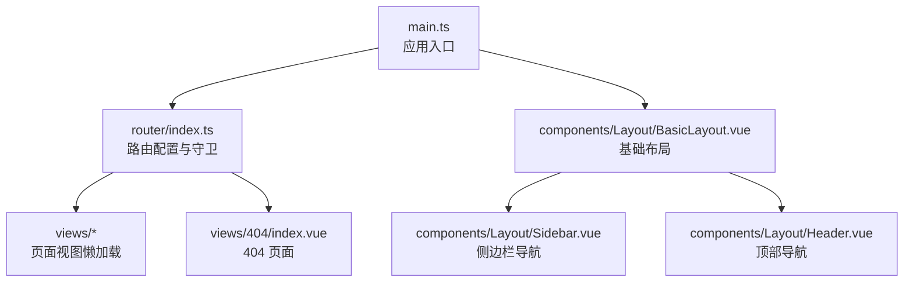
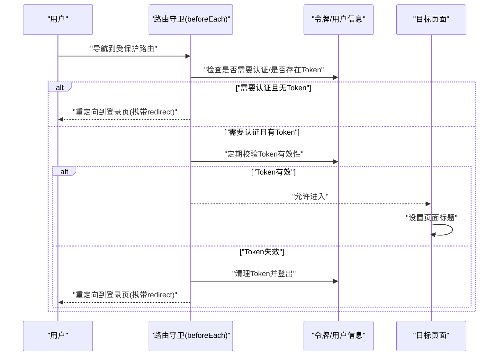
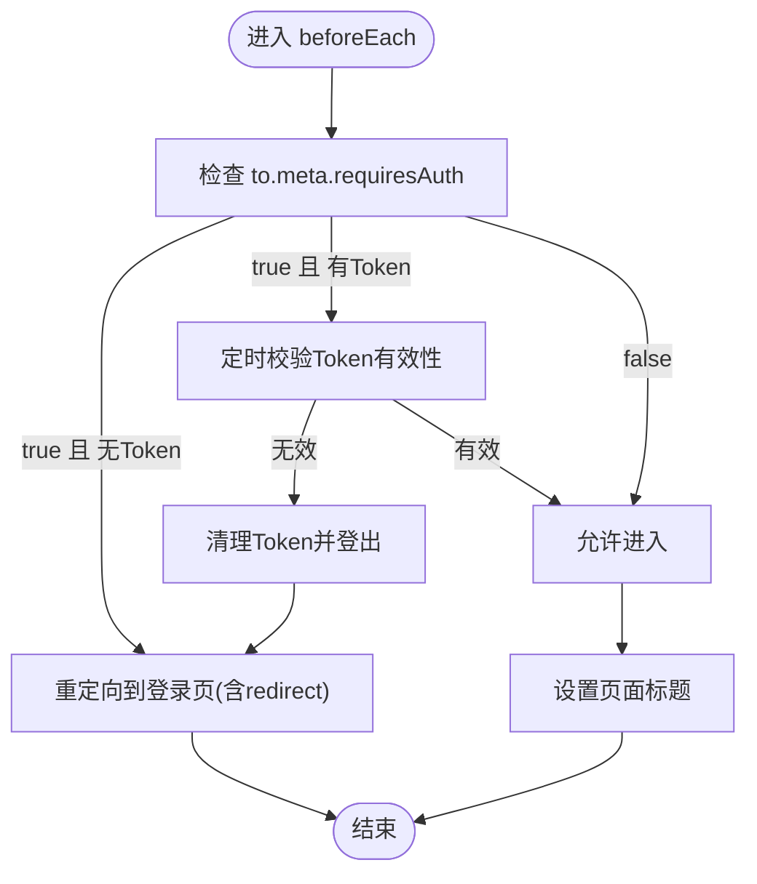
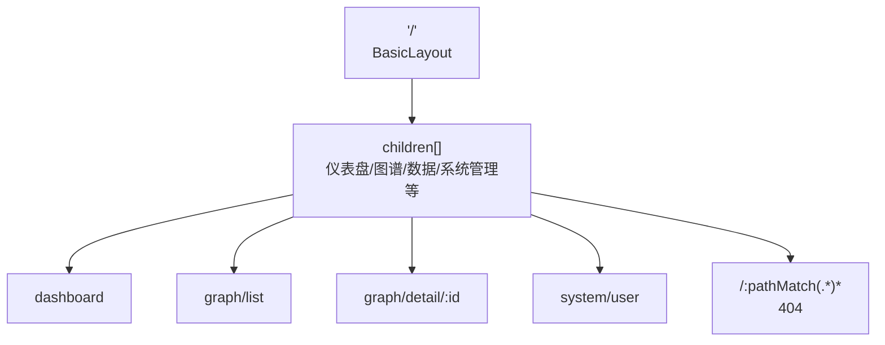
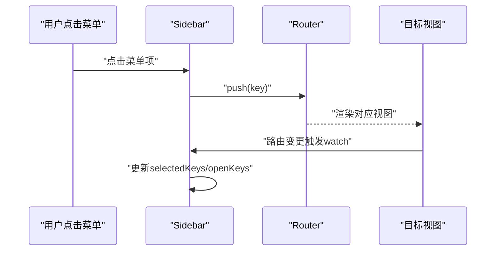
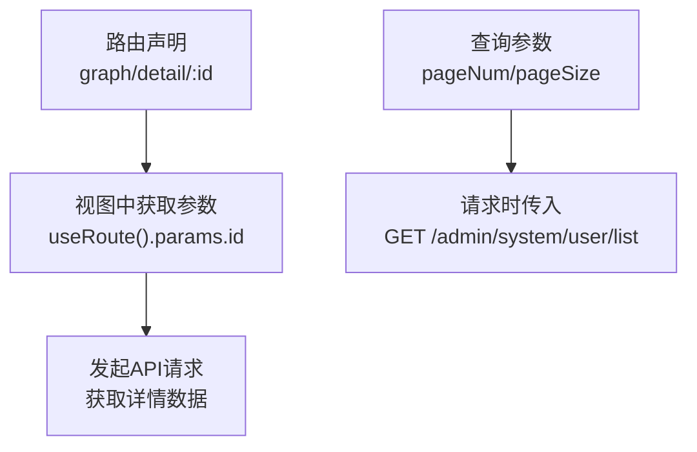
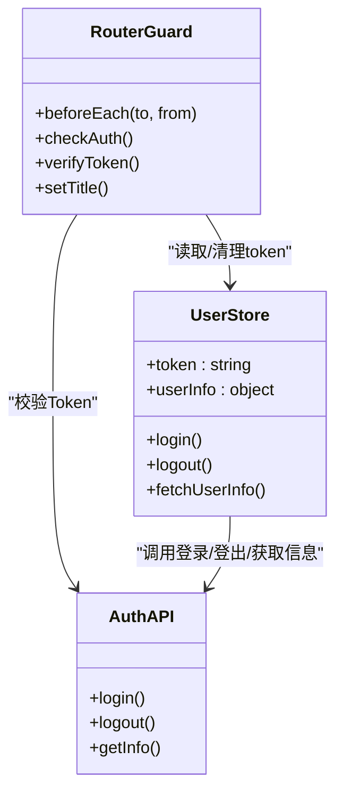
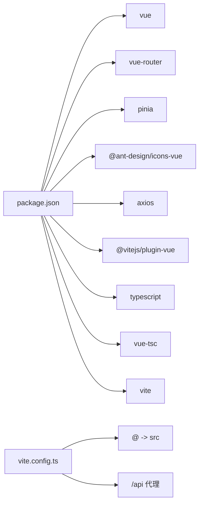

# 路由导航

<cite>
**本文引用的文件**
- [router/index.ts](file://graphiti-web/src/router/index.ts)
- [main.ts](file://graphiti-web/src/main.ts)
- [BasicLayout.vue](file://graphiti-web/src/components/Layout/BasicLayout.vue)
- [Sidebar.vue](file://graphiti-web/src/components/Layout/Sidebar.vue)
- [Header.vue](file://graphiti-web/src/components/Layout/Header.vue)
- [404/index.vue](file://graphiti-web/src/views/404/index.vue)
- [graph/detail.vue](file://graphiti-web/src/views/graph/detail.vue)
- [system/user/index.vue](file://graphiti-web/src/views/system/user/index.vue)
- [user.ts](file://graphiti-web/src/store/modules/user.ts)
- [auth.ts](file://graphiti-web/src/utils/auth.ts)
- [auth.ts](file://graphiti-web/src/api/auth.ts)
- [user.ts](file://graphiti-web/src/api/user.ts)
- [role.ts](file://graphiti-web/src/api/role.ts)
- [vite.config.ts](file://graphiti-web/vite.config.ts)
- [package.json](file://graphiti-web/package.json)
</cite>

## 目录
1. [简介](#简介)
2. [项目结构](#项目结构)
3. [核心组件](#核心组件)
4. [架构总览](#架构总览)
5. [详细组件分析](#详细组件分析)
6. [依赖分析](#依赖分析)
7. [性能考虑](#性能考虑)
8. [故障排查指南](#故障排查指南)
9. [结论](#结论)
10. [附录](#附录)

## 简介
本文件面向前端开发者，系统化梳理 Graphiti 控制台的路由导航体系，覆盖以下主题：
- Vue Router 配置与路由守卫机制（全局前置守卫、解析守卫、组件内守卫）
- 路由懒加载与代码分割优化
- 嵌套路由设计（侧边栏导航、面包屑导航、页面标题管理）
- 路由参数传递、查询字符串处理与动态路由匹配
- 权限控制实现方案（基于令牌的访问控制）
- 路由性能优化（预加载策略、缓存机制）
- 404 页面处理与错误边界设计
- 完整的路由开发实践指南

## 项目结构
控制台前端采用 Vue 3 + Vue Router 4 + Pinia 的现代前端技术栈，路由集中于 router/index.ts，通过懒加载按需加载视图组件；布局采用 BasicLayout 包裹侧边栏与内容区域，配合全局前置守卫实现统一鉴权与标题管理。

图表来源
- [main.ts:1-25](file://graphiti-web/src/main.ts#L1-L25)
- [router/index.ts:1-233](file://graphiti-web/src/router/index.ts#L1-L233)
- [BasicLayout.vue:1-51](file://graphiti-web/src/components/Layout/BasicLayout.vue#L1-L51)
- [Sidebar.vue:1-311](file://graphiti-web/src/components/Layout/Sidebar.vue#L1-L311)
- [Header.vue:1-212](file://graphiti-web/src/components/Layout/Header.vue#L1-L212)
- [404/index.vue:1-77](file://graphiti-web/src/views/404/index.vue#L1-L77)

章节来源
- [main.ts:1-25](file://graphiti-web/src/main.ts#L1-L25)
- [router/index.ts:7-174](file://graphiti-web/src/router/index.ts#L7-L174)

## 核心组件
- 路由器与守卫
  - 使用 createRouter + createWebHistory 创建浏览器历史模式路由器
  - 在 beforeEach 中实现统一鉴权、登录页拦截、Token 有效性缓存校验、页面标题设置
- 布局与导航
  - BasicLayout 提供头部、侧边栏与内容区域的容器
  - Sidebar 基于菜单项 key 与当前路由 path 同步选中状态与展开状态
  - Header 展示用户信息、通知与视图切换逻辑
- 权限与状态
  - Pinia 用户 Store 管理 token 与用户信息
  - auth.ts 封装本地存储与登录结果结构
  - auth API 提供登录、登出、获取用户信息接口
- 页面与参数
  - graph/detail.vue 使用动态路由参数 id 获取图谱详情
  - system/user/index.vue 展示用户管理，演示查询参数与分页参数的使用

章节来源
- [router/index.ts:176-230](file://graphiti-web/src/router/index.ts#L176-L230)
- [BasicLayout.vue:1-51](file://graphiti-web/src/components/Layout/BasicLayout.vue#L1-L51)
- [Sidebar.vue:167-228](file://graphiti-web/src/components/Layout/Sidebar.vue#L167-L228)
- [Header.vue:45-112](file://graphiti-web/src/components/Layout/Header.vue#L45-L112)
- [user.ts:12-64](file://graphiti-web/src/store/modules/user.ts#L12-L64)
- [auth.ts:14-40](file://graphiti-web/src/utils/auth.ts#L14-L40)
- [auth.ts:26-50](file://graphiti-web/src/api/auth.ts#L26-L50)
- [graph/detail.vue:127-160](file://graphiti-web/src/views/graph/detail.vue#L127-L160)
- [system/user/index.vue:161-329](file://graphiti-web/src/views/system/user/index.vue#L161-L329)

## 架构总览
路由导航系统围绕“统一鉴权 + 懒加载 + 嵌套路由 + 标题管理”展开，形成从入口到页面的完整链路。

图表来源
- [router/index.ts:185-230](file://graphiti-web/src/router/index.ts#L185-L230)
- [auth.ts:14-40](file://graphiti-web/src/utils/auth.ts#L14-L40)
- [user.ts:35-44](file://graphiti-web/src/store/modules/user.ts#L35-L44)

## 详细组件分析

### 路由守卫与鉴权流程
- 全局前置守卫
  - requiresAuth 标记控制是否需要登录
  - 未登录访问受保护路由 → 重定向至登录页并携带 redirect
  - 已登录访问登录页 → 重定向至仪表盘
  - Token 有效性缓存校验（每分钟一次），异常时清理本地状态并提示
  - 设置页面标题（若 meta.title 存在）

图表来源
- [router/index.ts:185-230](file://graphiti-web/src/router/index.ts#L185-L230)

章节来源
- [router/index.ts:185-230](file://graphiti-web/src/router/index.ts#L185-L230)

### 路由懒加载与代码分割
- 所有页面组件均以函数形式懒加载，按需下载，减少首屏体积
- 通过 import() 动态导入视图组件，结合 Webpack/Vite 的代码分割能力
- 适用场景：登录页、仪表盘、图谱详情、系统管理等页面

章节来源
- [router/index.ts:11](file://graphiti-web/src/router/index.ts#L11)
- [router/index.ts:25](file://graphiti-web/src/router/index.ts#L25)
- [router/index.ts:43](file://graphiti-web/src/router/index.ts#L43)
- [router/index.ts:133](file://graphiti-web/src/router/index.ts#L133)

### 嵌套路由与布局
- 根路径 '/' 使用 BasicLayout 作为父级容器
- 子路由 children 定义各功能模块页面
- 内容区域通过 router-view 渲染当前匹配的子路由组件

图表来源
- [router/index.ts:15-167](file://graphiti-web/src/router/index.ts#L15-L167)
- [BasicLayout.vue:10-11](file://graphiti-web/src/components/Layout/BasicLayout.vue#L10-L11)

章节来源
- [router/index.ts:15-167](file://graphiti-web/src/router/index.ts#L15-L167)
- [BasicLayout.vue:1-51](file://graphiti-web/src/components/Layout/BasicLayout.vue#L1-L51)

### 侧边栏导航与菜单联动
- Sidebar 使用 Ant Design Vue Menu，通过 selectedKeys/openKeys 与当前路由联动
- 根据路径自动展开对应分组菜单（如图谱管理、数据管理、工具、系统管理）
- 点击菜单项触发 router.push(key)，实现无刷新导航

图表来源
- [Sidebar.vue:167-228](file://graphiti-web/src/components/Layout/Sidebar.vue#L167-L228)
- [router/index.ts:185-230](file://graphiti-web/src/router/index.ts#L185-L230)

章节来源
- [Sidebar.vue:167-228](file://graphiti-web/src/components/Layout/Sidebar.vue#L167-L228)

### 页面标题管理
- beforeEach 中读取 to.meta.title 并设置 document.title
- 标题格式为“页面标题 - Graphiti Console”，提升品牌一致性

章节来源
- [router/index.ts:224-227](file://graphiti-web/src/router/index.ts#L224-L227)

### 路由参数传递与动态路由匹配
- 动态路由参数
  - graph/detail/:id：在视图中通过 useRoute().params.id 获取图谱 ID
- 查询参数
  - system/user/index.vue：通过 queryParams 对象维护查询条件，支持分页参数 pageNum/pageSize
- 路由跳转
  - Header 中通过 router.push 进行页面跳转（如通知中心、个人中心、视图切换）

图表来源
- [router/index.ts:41-44](file://graphiti-web/src/router/index.ts#L41-L44)
- [graph/detail.vue:140-144](file://graphiti-web/src/views/graph/detail.vue#L140-L144)
- [system/user/index.vue:174-180](file://graphiti-web/src/views/system/user/index.vue#L174-L180)
- [system/user/index.vue:58-74](file://graphiti-web/src/views/system/user/index.vue#L58-L74)

章节来源
- [router/index.ts:41-44](file://graphiti-web/src/router/index.ts#L41-L44)
- [graph/detail.vue:127-160](file://graphiti-web/src/views/graph/detail.vue#L127-L160)
- [system/user/index.vue:161-329](file://graphiti-web/src/views/system/user/index.vue#L161-L329)

### 权限控制实现方案
- 基于令牌的访问控制
  - 路由守卫检查 requiresAuth 与本地 Token
  - 定时调用 /auth/info 校验 Token 有效性
  - 异常时清理本地状态并重定向登录
- 用户状态管理
  - Pinia Store 管理 token 与用户信息
  - 登录成功写入 Token 与用户信息，登出清理并提示
- 角色与菜单
  - roleApi 提供角色列表与详情接口
  - userApi 支持用户 CRUD 与角色分配

图表来源
- [router/index.ts:185-230](file://graphiti-web/src/router/index.ts#L185-L230)
- [user.ts:12-64](file://graphiti-web/src/store/modules/user.ts#L12-L64)
- [auth.ts:26-50](file://graphiti-web/src/api/auth.ts#L26-L50)

章节来源
- [router/index.ts:185-230](file://graphiti-web/src/router/index.ts#L185-L230)
- [user.ts:12-64](file://graphiti-web/src/store/modules/user.ts#L12-L64)
- [auth.ts:26-50](file://graphiti-web/src/api/auth.ts#L26-L50)
- [role.ts:47-143](file://graphiti-web/src/api/role.ts#L47-L143)
- [user.ts:161-436](file://graphiti-web/src/views/system/user/index.vue#L161-L436)

### 404 页面处理与错误边界
- 通配符路由 '/:pathMatch(.*)*' 匹配未定义路径，渲染 404 页面
- 404 页面提供“返回首页”按钮，跳转至仪表盘

章节来源
- [router/index.ts:168-173](file://graphiti-web/src/router/index.ts#L168-L173)
- [404/index.vue:17-26](file://graphiti-web/src/views/404/index.vue#L17-L26)

### 组件内守卫与解析守卫
- 解析守卫（Route Record）：在路由记录上通过 meta 字段传递页面标题等元信息
- 组件内守卫：当前实现主要集中在全局前置守卫中完成鉴权与标题设置；如需在组件内进行更细粒度的守卫，可在组件中使用导航守卫钩子（例如在 setup 中监听路由变化并执行特定逻辑）

章节来源
- [router/index.ts:12](file://graphiti-web/src/router/index.ts#L12)
- [router/index.ts:26](file://graphiti-web/src/router/index.ts#L26)

## 依赖分析
- 运行时依赖
  - vue、vue-router、pinia、ant-design-vue、axios、echarts、vue-echarts、@ant-design/icons-vue、less
- 构建与开发依赖
  - @vitejs/plugin-vue、typescript、vue-tsc、vite、unplugin-vue-components、unplugin-auto-import
- 构建配置
  - Vite 别名 @ -> src，代理 /api -> http://localhost:8080，CSS 预处理器 Less 注入主题变量

图表来源
- [package.json:11-30](file://graphiti-web/package.json#L11-L30)
- [vite.config.ts:9-26](file://graphiti-web/vite.config.ts#L9-L26)

章节来源
- [package.json:1-32](file://graphiti-web/package.json#L1-L32)
- [vite.config.ts:1-41](file://graphiti-web/vite.config.ts#L1-L41)

## 性能考虑
- 路由懒加载
  - 所有页面组件均采用 import() 懒加载，避免首屏加载全部资源
- 代码分割
  - 结合路由层级拆分包，减少单个 chunk 体积，提升加载速度
- Token 校验缓存
  - 每分钟校验一次 Token 有效性，降低频繁请求带来的网络开销
- 预加载策略建议
  - 对高频访问的页面（如图谱列表、仪表盘）可考虑在空闲时预取数据或预渲染关键数据
- 缓存机制
  - 利用浏览器缓存与服务端缓存头，结合 Pinia Store 缓存轻量状态
- CSS 与图标
  - 使用 Less 主题变量统一样式，减少重复计算与重绘

章节来源
- [router/index.ts:11](file://graphiti-web/src/router/index.ts#L11)
- [router/index.ts:195-216](file://graphiti-web/src/router/index.ts#L195-L216)
- [vite.config.ts:27-39](file://graphiti-web/vite.config.ts#L27-L39)

## 故障排查指南
- 登录后仍被重定向到登录页
  - 检查 Token 是否正确写入 localStorage，确认 auth.ts.setToken 的调用
  - 确认 beforeEach 中的 requiresAuth 与 meta.title 设置
- Token 过期或无效
  - 查看控制台是否有 401 错误，确认 authApi.getInfo 的响应
  - 确认 clearToken 与 userStore.logout 的调用时机
- 页面标题未更新
  - 检查路由 meta.title 是否存在，确认 beforeEach 的 setTitle 分支
- 404 页面无法访问
  - 确认通配符路由存在且位于路由表末尾
  - 检查 404/index.vue 的模板与跳转逻辑

章节来源
- [auth.ts:18-30](file://graphiti-web/src/utils/auth.ts#L18-L30)
- [router/index.ts:185-230](file://graphiti-web/src/router/index.ts#L185-L230)
- [router/index.ts:168-173](file://graphiti-web/src/router/index.ts#L168-L173)
- [404/index.vue:17-26](file://graphiti-web/src/views/404/index.vue#L17-L26)

## 结论
该路由导航系统以“统一鉴权 + 懒加载 + 嵌套路由 + 标题管理”为核心，结合 Pinia 状态管理与 API 层，实现了清晰、可扩展、易维护的前端路由架构。通过合理的守卫策略与缓存机制，兼顾了安全性与性能。后续可在组件内守卫、权限细化与预加载策略方面进一步增强。

## 附录
- 最佳实践清单
  - 为每个受保护路由设置 meta.requiresAuth
  - 为每个路由设置 meta.title，确保页面标题一致
  - 使用懒加载与代码分割，避免首屏阻塞
  - 在全局守卫中集中处理 Token 校验与清理
  - 对高频页面进行数据缓存与预取
  - 保持通配符路由在路由表末尾，确保 404 正常工作