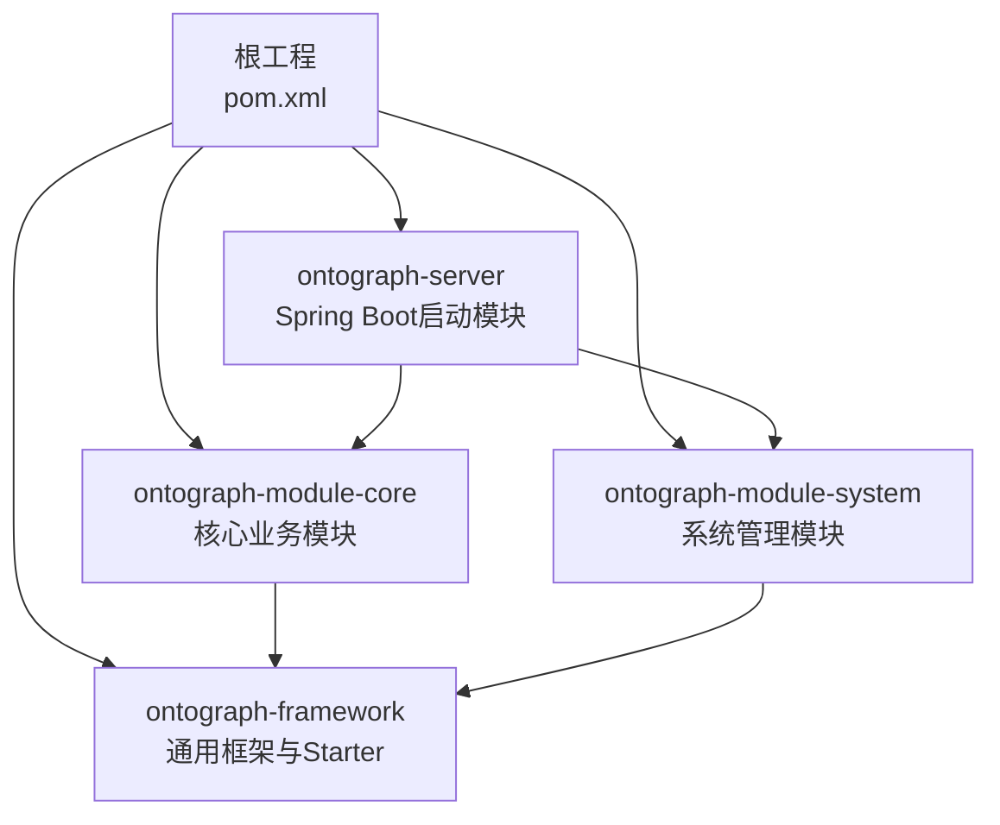
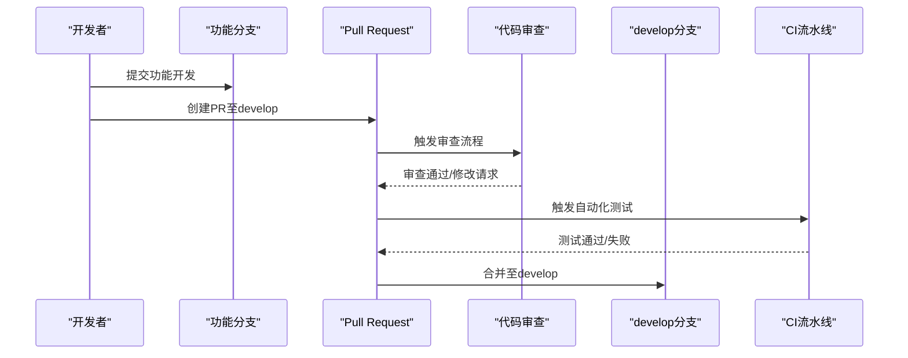
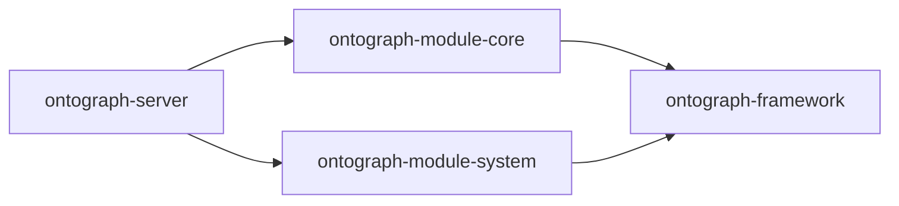

# Git工作流程

<!--<cite>
**本文引用的文件**
- [.gitignore](file://.gitignore)
- [commit-msg.txt](file://commit-msg.txt)
- [README.md](file://README.md)
- [README_CN.md](file://README_CN.md)
- [pom.xml](file://pom.xml)
- [ontograph-server/pom.xml](file://ontograph-server/pom.xml)
- [ontograph-module-core/pom.xml](file://ontograph-module-core/pom.xml)
- [ontograph-web/package.json](file://ontograph-web/package.json)
</cite>-->

## 目录
1. [简介](#简介)
2. [项目结构](#项目结构)
3. [核心组件](#核心组件)
4. [架构总览](#架构总览)
5. [详细组件分析](#详细组件分析)
6. [依赖分析](#依赖分析)
7. [性能考虑](#性能考虑)
8. [故障排除指南](#故障排除指南)
9. [结论](#结论)
10. [附录](#附录)

## 简介
本文件旨在为OntoGraph项目建立一套完整的Git工作流程与版本控制规范，覆盖分支管理策略、合并流程、提交消息规范、PR流程与代码审查标准、冲突解决策略、版本标签管理与发布流程、Git钩子与自动化工作流、备份与历史回滚、.gitignore配置、大型文件处理与敏感信息保护、团队协作规范与分支命名约定、以及提交频率建议。该规范以项目现有文档与配置为基础，结合实际工程实践制定，确保团队协作高效、可追溯、可审计。

## 项目结构
该项目采用多模块Maven聚合工程，包含后端框架、核心业务模块、系统管理模块与Spring Boot启动模块，同时集成前端Vue3应用。整体结构清晰，便于分模块开发与独立演进。



图表来源
- [pom.xml:15-20](file://pom.xml#L15-L20)
- [ontograph-server/pom.xml:17-40](file://ontograph-server/pom.xml#L17-L40)
- [ontograph-module-core/pom.xml:17-41](file://ontograph-module-core/pom.xml#L17-L41)

章节来源
- [pom.xml:15-20](file://pom.xml#L15-L20)
- [ontograph-server/pom.xml:17-40](file://ontograph-server/pom.xml#L17-L40)
- [ontograph-module-core/pom.xml:17-41](file://ontograph-module-core/pom.xml#L17-L41)

## 核心组件
- 多模块Maven工程：统一版本管理、依赖治理与构建流程。
- Spring Boot启动模块：整合前后端资源，打包为可执行JAR。
- 核心业务模块：知识图谱、本体、检索、数据导入等核心能力。
- 系统管理模块：用户、角色、菜单、认证授权等基础能力。
- 前端模块：Vue3 + Vite + TypeScript，通过Maven插件集成构建产物。

章节来源
- [pom.xml:15-20](file://pom.xml#L15-L20)
- [ontograph-server/pom.xml:17-40](file://ontograph-server/pom.xml#L17-L40)
- [ontograph-module-core/pom.xml:17-41](file://ontograph-module-core/pom.xml#L17-L41)
- [ontograph-web/package.json:1-32](file://ontograph-web/package.json#L1-L32)

## 架构总览
下图展示Git工作流在多模块工程中的落地方式：主分支用于稳定发布，开发分支承载迭代，功能分支隔离开发，PR驱动代码审查与合并，版本标签用于发布归档。

```mermaid
graph TB
subgraph "版本控制与分支"
MAIN["main<br/>稳定发布基线"]
DEV["develop<br/>日常集成"]
FEAT["feature/*<br/>功能开发"]
FIX["hotfix/*<br/>紧急修复"]
DOC["docs/*<br/>文档改进"]
end
subgraph "CI/CD与发布"
TAG["tag v1.x.x<br/>版本发布"]
GH["GitHub/GitLab<br/>远程仓库"]
CI["CI流水线<br/>构建与测试"]
end
MAIN <- --> DEV
DEV --> FEAT
DEV --> FIX
DEV --> DOC
FEAT --> PR["Pull Request<br/>代码审查"]
PR --> MERGE["合并到develop"]
MERGE --> CI --> TAG --> GH
```

## 详细组件分析

### 分支管理策略
- 主分支(main)
  - 仅接收来自develop的受控合并与hotfix回滚。
  - 保持可发布状态，所有合并需通过PR与审查。
- 开发分支(develop)
  - 日常集成与预发布验证的主要分支。
  - 所有feature与fix均从develop派生，完成后合并回develop。
- 功能分支(feature/*)
  - 用于新功能开发，命名形如feature/user-login。
  - 开发完成经PR合并至develop。
- 热修复分支(hotfix/*)
  - 用于紧急修复，从main切出，修复后同时合并回main与develop，并打标签。
- 文档分支(docs/*)
  - 用于文档改进，合并至develop。

章节来源
- [README.md:499-505](file://README.md#L499-L505)
- [README_CN.md:499-505](file://README_CN.md#L499-L505)

### 合并流程
- feature/fix/文档分支完成开发后，创建PR至develop。
- PR需至少一名审查者批准，且通过CI检查。
- 合并策略推荐squash合并，保持提交历史整洁。
- hotfix分支合并后需同步回develop并打标签。



图表来源
- [README.md:499-505](file://README.md#L499-L505)
- [README_CN.md:499-505](file://README_CN.md#L499-L505)

### 提交消息规范
- 规范格式：type(scope): subject
- 常见类型：feat、fix、docs、refactor、test、chore
- 示例参考：commit-msg.txt中的示例提交说明

章节来源
- [README.md:514-523](file://README.md#L514-L523)
- [README_CN.md:514-523](file://README_CN.md#L514-L523)
- [commit-msg.txt:1-27](file://commit-msg.txt#L1-L27)

### PR流程与代码审查标准
- PR必须关联任务或问题单，简述变更目的与影响范围。
- 代码审查至少一名维护者批准，确保符合架构原则与编码规范。
- 审查关注点：功能正确性、性能影响、安全性、可测试性、文档更新。
- CI通过后方可合并，避免破坏主干稳定性。

章节来源
- [README.md:525-531](file://README.md#L525-L531)
- [README_CN.md:525-531](file://README_CN.md#L525-L531)

### 冲突解决策略
- 频繁从develop拉取最新变更，减少冲突规模。
- 使用功能分支进行隔离，避免多人同时修改同一文件。
- 冲突解决后本地完整测试，再提交PR。
- 对复杂冲突，建议面对面讨论或临时暂停并拆分任务。

### 版本标签管理与发布流程
- 发布前在main上打标签，如v1.2.3，作为正式发布版本。
- 标签与CI流水线联动，触发制品打包与发布。
- hotfix修复直接在main打补丁标签，随后同步回develop。

章节来源
- [README.md:534-547](file://README.md#L534-L547)
- [README_CN.md:534-547](file://README_CN.md#L534-L547)

### Git钩子与自动化工作流
- 提交前钩子：建议在本地安装pre-commit，校验提交消息格式与基本语法。
- CI流水线：在PR与main合并时自动运行单元测试、依赖扫描与构建。
- 建议使用GitHub Actions或GitLab CI，配置如下阶段：
  - 代码风格检查
  - 单元测试与覆盖率
  - 构建与打包
  - 安全扫描（依赖与密钥）
  - 发布制品上传

### 备份策略与历史回滚
- 定期推送main与develop至远程仓库，确保历史备份。
- 回滚策略：
  - 小范围错误：使用revert提交撤销特定提交。
  - 大范围错误：基于最近一次健康快照创建hotfix分支修复并回滚。
- 严格限制对已推送历史的强制推送，避免破坏他人工作。

### .gitignore配置与大型文件处理
- 当前忽略规则：
  - 前端node_modules与dist
  - 后端target编译目录
  - IDE相关目录
  - Git工作树目录
- 大型文件处理：
  - 使用Git LFS管理大体积文件（如模型权重、日志文件）。
  - 对于数据库脚本与样例数据，保留小尺寸替代或提供下载链接。
- 敏感信息保护：
  - 不将密钥、密码、令牌提交到仓库。
  - 使用环境变量或配置中心注入敏感参数。
  - 在CI中使用受保护变量，避免明文输出。

章节来源
- [.gitignore:1-6](file://.gitignore#L1-L6)

### 团队协作规范与分支命名约定
- 分支命名约定：
  - feature/*：新增功能
  - fix/*：缺陷修复
  - docs/*：文档改进
  - refactor/*：重构
  - chore/*：构建、依赖等杂项
- 提交频率建议：
  - 小步快跑，每日多次提交，保持PR粒度适中。
  - 每个PR聚焦单一目标，避免“大杂烩”。

章节来源
- [README.md:499-505](file://README.md#L499-L505)
- [README_CN.md:499-505](file://README_CN.md#L499-L505)

## 依赖分析
多模块工程的依赖关系直接影响分支合并与发布节奏。建议：
- 保持模块间依赖清晰，避免循环依赖。
- 版本号集中管理，避免因版本不一致导致构建失败。
- 前端构建产物通过Maven插件自动嵌入，确保发布包完整性。



图表来源
- [ontograph-server/pom.xml:17-40](file://ontograph-server/pom.xml#L17-L40)
- [ontograph-module-core/pom.xml:17-41](file://ontograph-module-core/pom.xml#L17-L41)

章节来源
- [pom.xml:15-20](file://pom.xml#L15-L20)
- [ontograph-server/pom.xml:17-40](file://ontograph-server/pom.xml#L17-L40)
- [ontograph-module-core/pom.xml:17-41](file://ontograph-module-core/pom.xml#L17-L41)

## 性能考虑
- 合理的分支策略与PR审查能显著降低合并冲突与回归风险，间接提升整体交付效率。
- CI流水线应按模块并行执行，缩短反馈周期。
- 发布前进行轻量回归测试，确保主干稳定性。

## 故障排除指南
- 提交消息不符合规范
  - 现象：PR被阻塞或CI失败。
  - 处理：根据示例格式修正，重新提交。
- CI测试失败
  - 现象：流水线中断。
  - 处理：查看日志定位失败用例，修复后重新触发。
- 合并冲突
  - 现象：PR无法自动合并。
  - 处理：在本地合并develop最新变更，解决冲突并测试通过后更新PR。
- 前端构建失败
  - 现象：ontograph-server打包缺失前端产物。
  - 处理：确认ontograph-web依赖与构建产物拷贝步骤正常。

章节来源
- [commit-msg.txt:1-27](file://commit-msg.txt#L1-L27)
- [ontograph-web/package.json:5-9](file://ontograph-web/package.json#L5-L9)
- [ontograph-server/pom.xml:82-128](file://ontograph-server/pom.xml#L82-L128)

## 结论
通过明确的分支策略、严格的PR与审查流程、规范化的提交消息与标签管理，以及完善的CI/CD与备份回滚机制，OntoGraph项目能够在保证质量的前提下高效推进迭代。建议团队在实践中持续优化流程，结合项目发展调整策略，确保长期可持续演进。

## 附录
- 提交消息示例参考：[commit-msg.txt:1-27](file://commit-msg.txt#L1-L27)
- 分支与PR规范参考：[README.md:499-531](file://README.md#L499-L531)、[README_CN.md:499-531](file://README_CN.md#L499-L531)
- 多模块工程结构参考：[pom.xml:15-20](file://pom.xml#L15-L20)、[ontograph-server/pom.xml:17-40](file://ontograph-server/pom.xml#L17-L40)、[ontograph-module-core/pom.xml:17-41](file://ontograph-module-core/pom.xml#L17-L41)
- 前端构建与集成参考：[ontograph-web/package.json:5-9](file://ontograph-web/package.json#L5-L9)、[ontograph-server/pom.xml:82-128](file://ontograph-server/pom.xml#L82-L128)