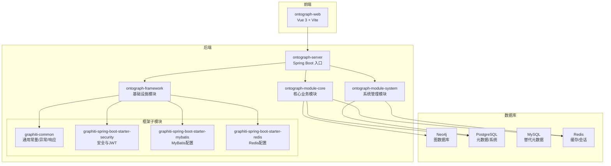
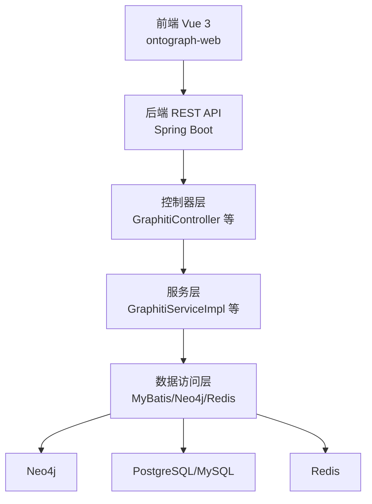
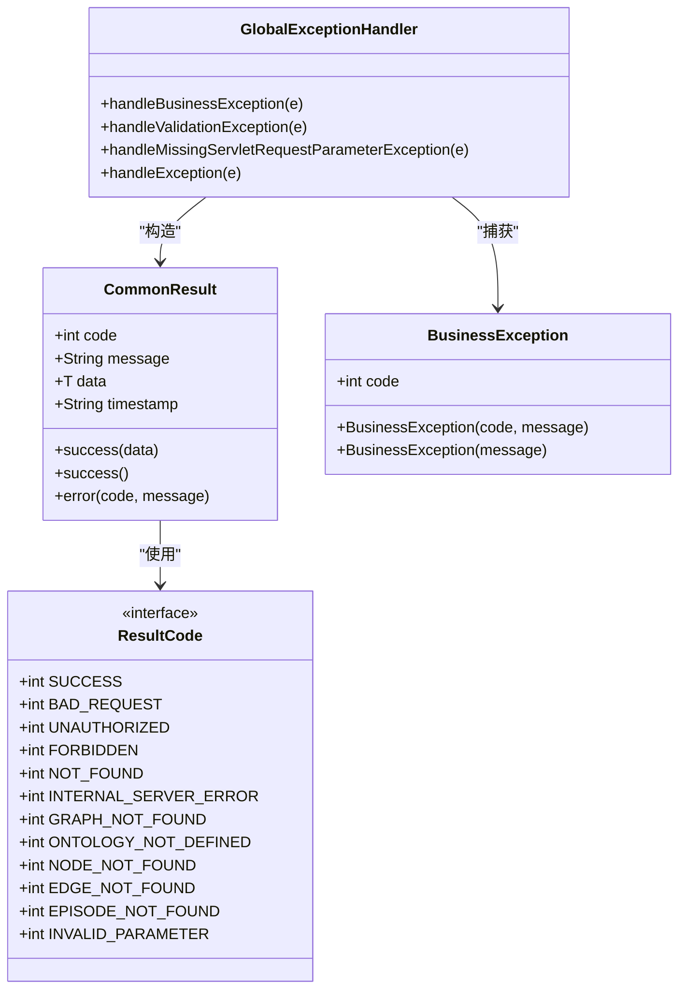
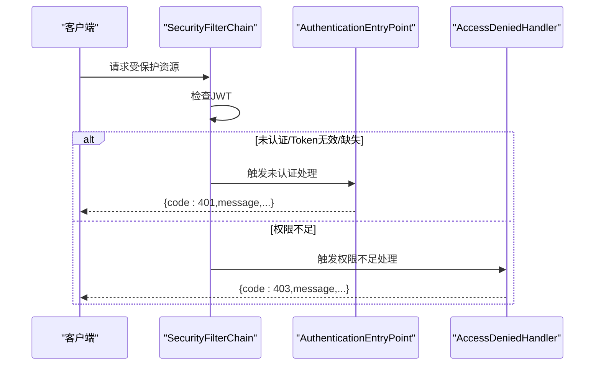
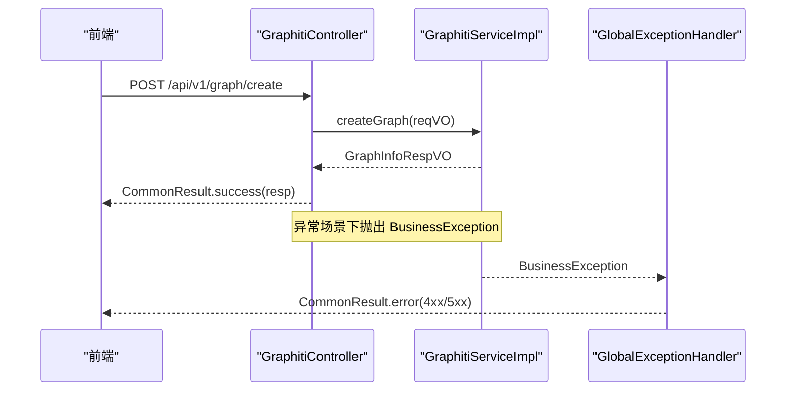
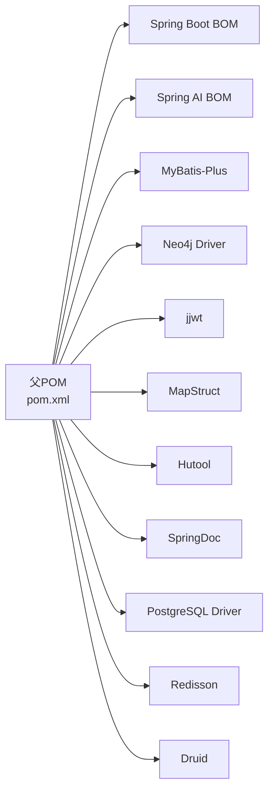

# 代码规范

<!--<cite>
**本文引用的文件**   
- [README.md](file://README.md)
- [DESIGN.md](file://DESIGN.md)
- [commit-msg.txt](file://commit-msg.txt)
- [pom.xml](file://pom.xml)
- [application.yml](file://ontograph-server/src/main/resources/application.yml)
- [ResultCode.java](file://ontograph-framework/graphiti-common/src/main/java/com/raphiti/common/constants/ResultCode.java)
- [BusinessException.java](file://ontograph-framework/graphiti-common/src/main/java/com/raphiti/common/exception/BusinessException.java)
- [GlobalExceptionHandler.java](file://ontograph-framework/graphiti-common/src/main/java/com/raphiti/common/exception/GlobalExceptionHandler.java)
- [CommonResult.java](file://ontograph-framework/graphiti-common/src/main/java/com/raphiti/common/response/CommonResult.java)
- [SecurityConfig.java](file://ontograph-framework/graphiti-spring-boot-starter-security/src/main/java/com/raphiti/framework/security/config/SecurityConfig.java)
- [GraphitiController.java](file://ontograph-module-core/src/main/java/com/raphiti/module/graphiti/controller/admin/GraphitiController.java)
- [GraphitiServiceImpl.java](file://ontograph-module-core/src/main/java/com/raphiti/module/graphiti/service/impl/GraphitiServiceImpl.java)
- [AuthController.java](file://ontograph-module-system/src/main/java/com/raphiti/system/controller/AuthController.java)
- [package.json](file://ontograph-web/package.json)
- [tsconfig.json](file://ontograph-web/tsconfig.json)
</cite>-->

## 目录
1. [引言](#引言)
2. [项目结构](#项目结构)
3. [核心组件](#核心组件)
4. [架构总览](#架构总览)
5. [详细组件分析](#详细组件分析)
6. [依赖分析](#依赖分析)
7. [性能考虑](#性能考虑)
8. [故障排查指南](#故障排查指南)
9. [结论](#结论)
10. [附录](#附录)

## 引言
本文件旨在建立OntoGraph项目的统一代码规范，覆盖后端Java编码规范、命名约定、代码格式化、Spring Boot模块组织与文件命名、Git提交消息与分支管理策略、注释与异常处理、日志记录最佳实践，以及前端Vue.js与TypeScript规范，并提供代码审查检查清单与质量门禁标准。目标是提升团队协作效率、保证代码一致性与可维护性。

## 项目结构
OntoGraph采用多模块Maven聚合工程，后端由Spring Boot驱动，前端基于Vue 3 + Vite，数据库包含Neo4j、PostgreSQL/MySQL与Redis。模块划分遵循“框架层-业务层-入口层”的层次化组织，便于职责分离与复用。

图表来源
- [pom.xml:15-20](file://pom.xml#L15-L20)
- [README.md:110-166](file://README.md#L110-L166)

章节来源
- [README.md:110-166](file://README.md#L110-L166)
- [pom.xml:15-20](file://pom.xml#L15-L20)

## 核心组件
- 统一响应与异常体系：通过通用响应类与全局异常处理器，确保前后端一致的错误契约与可观测性。
- 安全与鉴权：基于Spring Security + JWT，提供认证入口点与权限不足处理。
- 控制器与服务：控制器负责HTTP协议与参数校验，服务封装业务逻辑，事务与异常边界清晰。
- 配置与依赖：集中于父POM与应用配置文件，版本与依赖由BOM统一管理。

章节来源
- [CommonResult.java:1-68](file://ontograph-framework/graphiti-common/src/main/java/com/raphiti/common/response/CommonResult.java#L1-L68)
- [GlobalExceptionHandler.java:1-74](file://ontograph-framework/graphiti-common/src/main/java/com/raphiti/common/exception/GlobalExceptionHandler.java#L1-L74)
- [SecurityConfig.java:1-138](file://ontograph-framework/graphiti-spring-boot-starter-security/src/main/java/com/raphiti/framework/security/config/SecurityConfig.java#L1-L138)
- [GraphitiController.java:1-235](file://ontograph-module-core/src/main/java/com/raphiti/module/graphiti/controller/admin/GraphitiController.java#L1-L235)
- [GraphitiServiceImpl.java:1-256](file://ontograph-module-core/src/main/java/com/raphiti/module/graphiti/service/impl/GraphitiServiceImpl.java#L1-L256)

## 架构总览
后端以Spring Boot为核心，通过模块化拆分实现关注点分离；前端通过Axios调用后端REST接口；数据层分别对接Neo4j、PostgreSQL/MySQL与Redis，形成“图存储+关系型元数据+缓存”的混合架构。

图表来源
- [README.md:71-108](file://README.md#L71-L108)
- [GraphitiController.java:37-41](file://ontograph-module-core/src/main/java/com/raphiti/module/graphiti/controller/admin/GraphitiController.java#L37-L41)
- [GraphitiServiceImpl.java:24-27](file://ontograph-module-core/src/main/java/com/raphiti/module/graphiti/service/impl/GraphitiServiceImpl.java#L24-L27)

## 详细组件分析

### 统一响应与异常处理
- 统一响应：定义统一的响应体结构，包含状态码、消息、数据与时间戳，便于前端解析与调试。
- 业务异常：通过业务异常类与错误码常量，区分业务错误与系统错误，便于前端展示与埋点。
- 全局异常：集中处理业务异常、参数校验异常与未知异常，输出标准化错误响应与日志。

图表来源
- [CommonResult.java:13-67](file://ontograph-framework/graphiti-common/src/main/java/com/raphiti/common/response/CommonResult.java#L13-L67)
- [ResultCode.java:7-22](file://ontograph-framework/graphiti-common/src/main/java/com/raphiti/common/constants/ResultCode.java#L7-L22)
- [BusinessException.java:10-32](file://ontograph-framework/graphiti-common/src/main/java/com/raphiti/common/exception/BusinessException.java#L10-L32)
- [GlobalExceptionHandler.java:17-73](file://ontograph-framework/graphiti-common/src/main/java/com/raphiti/common/exception/GlobalExceptionHandler.java#L17-L73)

章节来源
- [CommonResult.java:1-68](file://ontograph-framework/graphiti-common/src/main/java/com/raphiti/common/response/CommonResult.java#L1-L68)
- [ResultCode.java:1-23](file://ontograph-framework/graphiti-common/src/main/java/com/raphiti/common/constants/ResultCode.java#L1-L23)
- [BusinessException.java:1-33](file://ontograph-framework/graphiti-common/src/main/java/com/raphiti/common/exception/BusinessException.java#L1-L33)
- [GlobalExceptionHandler.java:1-74](file://ontograph-framework/graphiti-common/src/main/java/com/raphiti/common/exception/GlobalExceptionHandler.java#L1-L74)

### 安全与鉴权
- 密码编码：BCryptPasswordEncoder提供强哈希。
- 过滤链：无状态会话策略，CORS允许跨域，开放部分路径无需鉴权。
- 未认证与权限不足：统一JSON响应，便于前端处理。

图表来源
- [SecurityConfig.java:84-113](file://ontograph-framework/graphiti-spring-boot-starter-security/src/main/java/com/raphiti/framework/security/config/SecurityConfig.java#L84-L113)
- [SecurityConfig.java:115-136](file://ontograph-framework/graphiti-spring-boot-starter-security/src/main/java/com/raphiti/framework/security/config/SecurityConfig.java#L115-L136)

章节来源
- [SecurityConfig.java:1-138](file://ontograph-framework/graphiti-spring-boot-starter-security/src/main/java/com/raphiti/framework/security/config/SecurityConfig.java#L1-L138)

### 控制器与服务层
- 控制器：使用Swagger注解描述接口，参数校验与分页参数通过VO承载。
- 服务层：事务边界明确，业务逻辑清晰，异常通过业务异常抛出，交由全局异常处理器统一处理。

图表来源
- [GraphitiController.java:56-59](file://ontograph-module-core/src/main/java/com/raphiti/module/graphiti/controller/admin/GraphitiController.java#L56-L59)
- [GraphitiServiceImpl.java:32-47](file://ontograph-module-core/src/main/java/com/raphiti/module/graphiti/service/impl/GraphitiServiceImpl.java#L32-L47)
- [GlobalExceptionHandler.java:26-30](file://ontograph-framework/graphiti-common/src/main/java/com/raphiti/common/exception/GlobalExceptionHandler.java#L26-L30)

章节来源
- [GraphitiController.java:1-235](file://ontograph-module-core/src/main/java/com/raphiti/module/graphiti/controller/admin/GraphitiController.java#L1-L235)
- [GraphitiServiceImpl.java:1-256](file://ontograph-module-core/src/main/java/com/raphiti/module/graphiti/service/impl/GraphitiServiceImpl.java#L1-L256)

### 前端Vue.js与TypeScript规范
- 语言与工具链：TypeScript 5.x，Vue 3，Vite 5，Pinia，Ant Design Vue 4，Axios 1.7。
- 严格模式：启用严格类型检查、未使用变量/参数检测、switch穷举检查。
- 路径别名：@/* 指向 src/*，便于模块导入。
- 构建脚本：开发、构建、预览与类型检查脚本齐全。

章节来源
- [package.json:1-32](file://ontograph-web/package.json#L1-L32)
- [tsconfig.json:1-25](file://ontograph-web/tsconfig.json#L1-L25)

## 依赖分析
- 版本与依赖：父POM通过BOM统一管理Spring Boot、Spring AI、MyBatis-Plus、Neo4j、JWT、MapStruct、Hutool、SpringDoc、PostgreSQL、Redisson、Druid等依赖版本。
- 编译插件：编译器插件配置Java 21，开启参数名保留与Lombok、MapStruct注解处理器。
- 运行配置：应用配置文件集中管理MyBatis、JWT、日志、Actuator、OpenAPI等。

图表来源
- [pom.xml:45-196](file://pom.xml#L45-L196)

章节来源
- [pom.xml:22-43](file://pom.xml#L22-L43)
- [pom.xml:199-236](file://pom.xml#L199-L236)
- [application.yml:1-67](file://ontograph-server/src/main/resources/application.yml#L1-L67)

## 性能考虑
- 无状态鉴权：JWT + 无状态会话减少服务器会话开销。
- 批量与分页：服务层支持分页参数，避免一次性加载大量数据。
- 缓存与索引：Redis用于缓存与会话，Neo4j向量索引用于语义检索，需结合实际负载评估。
- 日志级别：开发环境开启调试日志，生产环境建议收敛至INFO/ERROR，避免I/O瓶颈。

## 故障排查指南
- 统一错误响应：前端依据统一响应结构解析错误码与消息，快速定位问题。
- 参数校验：参数缺失或不合法时，全局异常返回400与具体字段提示。
- 未认证/权限不足：鉴权失败返回401/403，前端引导登录或提示权限不足。
- 未知异常：捕获Exception并返回500，同时记录错误日志，便于后端排查。

章节来源
- [GlobalExceptionHandler.java:37-60](file://ontograph-framework/graphiti-common/src/main/java/com/raphiti/common/exception/GlobalExceptionHandler.java#L37-L60)
- [SecurityConfig.java:84-113](file://ontograph-framework/graphiti-spring-boot-starter-security/src/main/java/com/raphiti/framework/security/config/SecurityConfig.java#L84-L113)

## 结论
通过统一的响应与异常体系、严格的参数校验与鉴权策略、清晰的模块划分与依赖管理，OntoGraph实现了高内聚低耦合的后端架构，并为前端提供了稳定可靠的API契约。建议在日常开发中持续遵循本文规范，配合代码审查与质量门禁，保障系统长期可维护性与稳定性。

## 附录

### Java编码规范与命名约定
- 包与模块：包名为反向域名风格，模块按功能域划分，如common、security、mybatis、redis等。
- 类与接口：类名使用名词或复合词，接口以形容词或名词结尾（如Service、Repository），实现类以Impl后缀。
- 方法：动宾短语，布尔方法以is/has/can前缀；私有方法以下划线开头或小写驼峰。
- 常量：全大写下划线分隔；枚举与接口常量在同一位置声明。
- 变量：小写驼峰；临时变量简短，避免魔法数字。
- 注释：类与公共方法使用Javadoc；复杂逻辑添加行内注释，保持简洁明了。
- 异常：业务异常使用ResultCode中的业务码；系统异常统一返回500。
- 日志：使用SLF4J，按级别输出（error/warn/info/debug），避免敏感信息泄露。

### Spring Boot目录结构组织与文件命名
- 控制器：按功能域分包，如controller/admin、controller/system；文件名以实体名+Controller结尾。
- 服务：接口与实现分离，接口以Service结尾，实现类以ServiceImpl结尾；分层清晰，事务边界明确。
- 数据访问：MyBatis-Plus实体与Mapper按功能域分包，数据对象以DO结尾，映射器以Mapper结尾。
- VO/DTO：视图对象以RespVO/ReqVO区分请求与响应；值对象以VO结尾。
- 配置：application.yml集中管理，按环境拆分profile；安全配置独立类，过滤链清晰。
- 资源：Prompts与静态资源按功能域放置，便于维护。

### Git提交消息规范与分支管理策略
- 提交消息类型：feat、fix、docs、refactor、test、chore等，遵循约定式提交。
- 分支策略：主分支保护，特性分支以feature/前缀，修复分支以fix/前缀，发布分支以release/前缀。
- 提交流程：本地提交→推送→发起PR→代码审查→合并→自动化部署。

章节来源
- [README.md:514-523](file://README.md#L514-L523)
- [commit-msg.txt:1-27](file://commit-msg.txt#L1-L27)

### 代码注释标准
- 类注释：说明职责、关键行为与注意事项。
- 方法注释：参数、返回值、异常、调用示例与边界条件。
- 字段注释：关键字段用途与约束。
- 行内注释：复杂逻辑解释，避免显而易见的注释。

### 异常处理规范
- 业务异常：抛出BusinessException，携带ResultCode中的业务码与消息。
- 参数异常：使用参数校验注解与全局异常处理，返回400与字段级提示。
- 未知异常：捕获Exception，返回500并记录日志。

章节来源
- [BusinessException.java:10-32](file://ontograph-framework/graphiti-common/src/main/java/com/raphiti/common/exception/BusinessException.java#L10-L32)
- [GlobalExceptionHandler.java:26-72](file://ontograph-framework/graphiti-common/src/main/java/com/raphiti/common/exception/GlobalExceptionHandler.java#L26-L72)

### 日志记录最佳实践
- 级别：DEBUG用于开发调试，INFO用于常规运行信息，WARN用于潜在问题，ERROR用于异常。
- 结构化：统一时间戳、线程名、日志级别、Logger名称与消息，便于检索。
- 安全：避免记录敏感信息（密码、Token、隐私数据）。

章节来源
- [application.yml:35-41](file://ontograph-server/src/main/resources/application.yml#L35-L41)

### 前端Vue.js与TypeScript规范
- 语言：TypeScript 5.x，启用严格模式，关闭隐式any。
- 依赖：Vue 3、Vue Router、Pinia、Ant Design Vue、Axios、ECharts等。
- 路径别名：@/* 指向src，简化导入路径。
- 构建：Vite提供开发、构建与预览脚本，类型检查独立任务。

章节来源
- [package.json:11-31](file://ontograph-web/package.json#L11-L31)
- [tsconfig.json:2-24](file://ontograph-web/tsconfig.json#L2-L24)

### 代码审查检查清单
- 规范性：命名是否符合约定、注释是否完整、异常处理是否合理。
- 安全性：鉴权与权限控制、敏感信息处理、CORS与CSRF防护。
- 性能：分页与批量处理、缓存策略、日志级别与频率。
- 可测试性：单元测试覆盖率、集成测试场景、Mock策略。
- 文档：API文档与注释、变更日志、部署与回滚流程。

### 质量门禁标准
- 代码规范：通过静态检查与格式化工具（如SpotBugs、Checkstyle、PMD、ESLint等）。
- 测试覆盖率：关键路径与异常路径覆盖率达标。
- 审查通过：至少一名Reviewer批准，冲突解决。
- 构建与部署：构建通过、健康检查通过、灰度验证通过。