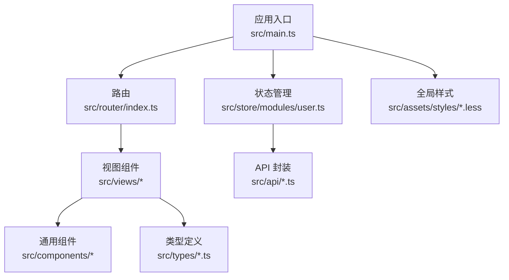
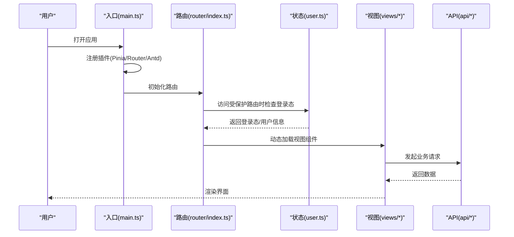
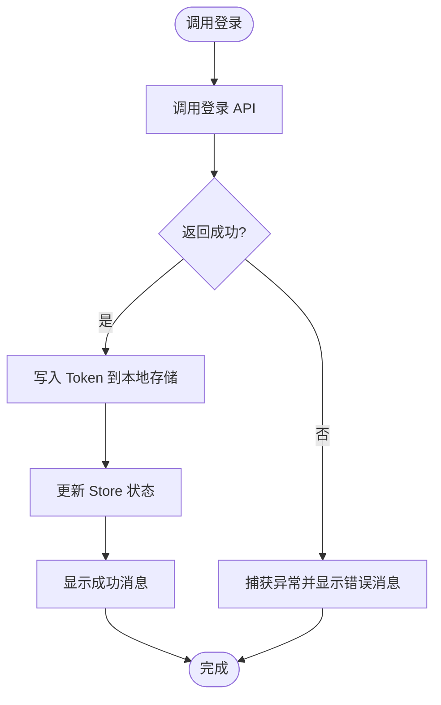
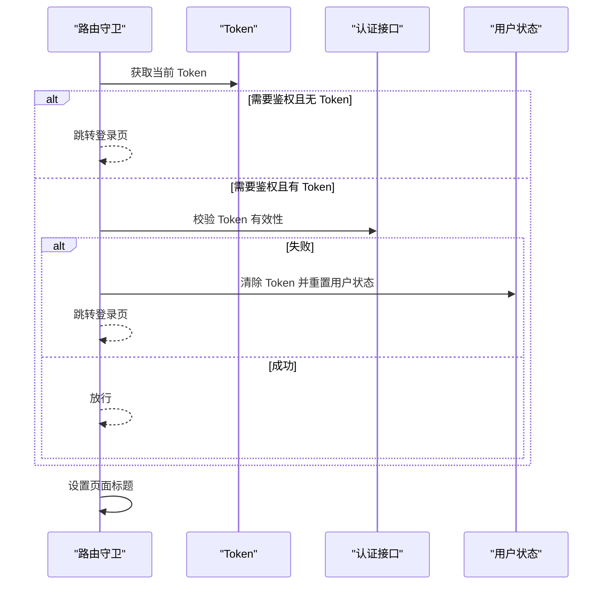
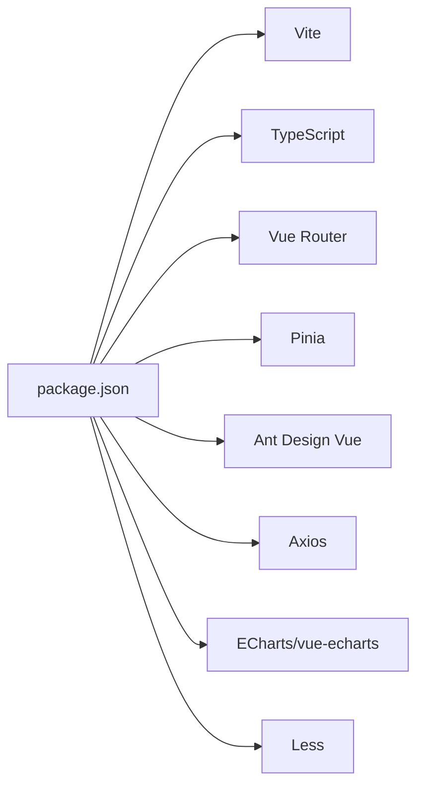

# 前端代码规范

<!--<cite>
**本文引用的文件**
- [package.json](file://graphiti-web/package.json)
- [vite.config.ts](file://graphiti-web/vite.config.ts)
- [tsconfig.json](file://graphiti-web/tsconfig.json)
- [main.ts](file://graphiti-web/src/main.ts)
- [router/index.ts](file://graphiti-web/src/router/index.ts)
- [store/modules/user.ts](file://graphiti-web/src/store/modules/user.ts)
- [types/graphiti.ts](file://graphiti-web/src/types/graphiti.ts)
- [App.vue](file://graphiti-web/src/App.vue)
</cite>-->

## 目录
1. [引言](#引言)
2. [项目结构](#项目结构)
3. [核心组件](#核心组件)
4. [架构总览](#架构总览)
5. [详细组件分析](#详细组件分析)
6. [依赖分析](#依赖分析)
7. [性能考虑](#性能考虑)
8. [故障排查指南](#故障排查指南)
9. [结论](#结论)
10. [附录](#附录)

## 引言
本规范面向 Graphiti 前端工程，基于现有 Vue 3 + TypeScript + Vite 技术栈与 Pinia/Pinia 状态管理、Vue Router 路由体系、Ant Design Vue 组件库与 ECharts 可视化组件的实际实现，制定统一的命名规范、文件组织结构、代码风格、TypeScript 类型定义、组件设计模式、状态管理与路由配置规范，并补充 CSS/LESS 编写与 UI 使用标准、测试与调试策略、构建配置与模块导入规范、组件通信与生命周期最佳实践，以及代码格式化与 ESLint 规则建议。本规范旨在提升团队协作效率、保证代码一致性与可维护性。

## 项目结构
前端工程位于 graphiti-web 目录，采用按功能域划分的目录组织方式：
- src/api：后端接口封装，按业务模块拆分
- src/components：通用可复用组件（如布局、图谱可视化等）
- src/router：路由定义与导航守卫
- src/store/modules：Pinia 模块化状态管理
- src/types：共享 TypeScript 类型定义
- src/utils：工具函数（鉴权、图谱处理等）
- src/views：页面级视图组件
- src/assets/styles：全局样式与主题变量
- src/main.ts：应用入口，注册插件与挂载应用
- vite.config.ts：Vite 构建与开发服务器配置
- package.json：依赖与脚本
- tsconfig.json：TypeScript 编译选项

图表来源
- [main.ts:1-25](file://graphiti-web/src/main.ts#L1-L25)
- [router/index.ts:1-233](file://graphiti-web/src/router/index.ts#L1-L233)
- [store/modules/user.ts:1-67](file://graphiti-web/src/store/modules/user.ts#L1-L67)

章节来源
- [main.ts:1-25](file://graphiti-web/src/main.ts#L1-L25)
- [vite.config.ts:1-41](file://graphiti-web/vite.config.ts#L1-L41)
- [package.json:1-32](file://graphiti-web/package.json#L1-L32)

## 核心组件
- 应用入口与插件注册：在入口文件中集中注册 Pinia、Vue Router、Ant Design Vue 插件，并挂载应用。
- 路由系统：采用 Vue Router v4，支持动态导入视图组件、元信息驱动的页面标题设置与鉴权守卫。
- 状态管理：使用 Pinia 进行模块化状态管理，用户模块负责登录态、用户信息与登出流程。
- 类型系统：通过 src/types/graphiti.ts 提供与后端 VO/DO 对齐的强类型定义，覆盖图谱、节点、边、实体、边、搜索、时间序列、本体、自定义指令、社区、导入导出、ECharts 可视化等场景。

章节来源
- [main.ts:1-25](file://graphiti-web/src/main.ts#L1-L25)
- [router/index.ts:1-233](file://graphiti-web/src/router/index.ts#L1-L233)
- [store/modules/user.ts:1-67](file://graphiti-web/src/store/modules/user.ts#L1-L67)
- [types/graphiti.ts:1-353](file://graphiti-web/src/types/graphiti.ts#L1-L353)

## 架构总览
下图展示从入口到路由、状态、API 的整体交互：

图表来源
- [main.ts:1-25](file://graphiti-web/src/main.ts#L1-L25)
- [router/index.ts:185-230](file://graphiti-web/src/router/index.ts#L185-L230)
- [store/modules/user.ts:12-64](file://graphiti-web/src/store/modules/user.ts#L12-L64)

## 详细组件分析

### 组件命名规范与文件组织
- 组件命名
  - 页面组件：采用名词短语，首字母大写，使用 index.vue 作为页面入口，例如 views/dashboard/index.vue。
  - 通用组件：采用具体语义名称，如 components/Layout/BasicLayout.vue、components/Graph/ForceGraph.vue。
  - 展示型组件：以名词或形容词命名，如 StatsCard/index.vue。
- 文件组织
  - 页面视图按功能域分层：views/业务域/子页面/index.vue。
  - 通用组件集中于 components 下，按功能域再分目录。
  - API 按领域模块拆分：api/业务模块.ts。
  - 类型定义集中于 types 目录，按领域拆分或统一导出。
- 导入别名
  - 使用 @/* 别名导入 src 目录下的资源，确保路径简洁一致。

章节来源
- [router/index.ts:1-174](file://graphiti-web/src/router/index.ts#L1-L174)
- [vite.config.ts:9-13](file://graphiti-web/vite.config.ts#L9-L13)
- [tsconfig.json:18-21](file://graphiti-web/tsconfig.json#L18-L21)

### 代码风格标准
- 缩进与换行：统一使用空格缩进，遵循现有文件风格。
- 命名：变量、函数、接口采用驼峰命名；常量使用全大写+下划线；类与接口首字母大写。
- 注释：为复杂逻辑与公共接口添加注释，保持简洁清晰。
- 模块导入顺序：标准库/第三方库 → 项目内别名导入 → 相对路径导入，同类之间按字母排序。
- Vue 单文件组件：script-setup 优先，模板与样式分离，避免在模板中执行复杂逻辑。

### TypeScript 使用规范与类型声明
- 类型对齐：src/types/graphiti.ts 中的接口与后端 VO/DO 结构保持一致，便于前后端协作。
- 接口字段：明确可选与必填字段，必要时提供默认值或校验逻辑。
- 泛型与工具类型：合理使用 Partial、Pick、Omit 等工具类型，减少重复定义。
- 命名空间与模块：类型定义独立于组件，避免在组件中重复定义类型。

章节来源
- [types/graphiti.ts:1-353](file://graphiti-web/src/types/graphiti.ts#L1-L353)

### 组件设计模式
- 页面组件：以路由为入口，通过动态导入加载视图，减少首屏体积。
- 通用组件：Props 明确、事件透传、样式可覆盖，遵循单一职责。
- 图表组件：结合 vue-echarts 与 ECharts，统一数据结构（如 EChartsNode/EChartsEdge），降低适配成本。

章节来源
- [router/index.ts:10-172](file://graphiti-web/src/router/index.ts#L10-L172)
- [types/graphiti.ts:320-353](file://graphiti-web/src/types/graphiti.ts#L320-L353)

### 状态管理规范（Pinia）
- Store 设计
  - 使用组合式 Store（defineStore + setup 语法），集中管理登录态与用户信息。
  - State：token、userInfo 等核心状态。
  - Getters：派生状态（如是否登录）。
  - Actions：异步操作（登录、登出、获取用户信息），统一错误处理与消息提示。
- 数据持久化：登录成功后同步更新本地存储与状态，登出时清理。
- 跨模块通信：通过 Store 实例进行跨组件状态共享，避免深层传递 Props。

图表来源
- [store/modules/user.ts:21-33](file://graphiti-web/src/store/modules/user.ts#L21-L33)

章节来源
- [store/modules/user.ts:1-67](file://graphiti-web/src/store/modules/user.ts#L1-L67)

### 路由配置规范（Vue Router）
- 路由定义
  - 使用 createRouter + createWebHistory，meta 字段包含页面标题与鉴权标记。
  - 动态导入视图组件，提升首屏性能。
- 导航守卫
  - beforeEach 中根据 meta.requiresAuth 决定是否需要登录。
  - 登录态校验采用定时缓存策略，避免频繁请求。
  - 404 路由兜底，统一设置页面标题。
- 页面标题：根据 meta.title 动态设置 document.title。

图表来源
- [router/index.ts:185-230](file://graphiti-web/src/router/index.ts#L185-L230)

章节来源
- [router/index.ts:1-233](file://graphiti-web/src/router/index.ts#L1-L233)

### CSS/LESS 样式编写规范与 UI 组件使用标准
- 主题变量：通过 Vite 的 Less 预处理器注入主题变量，统一主色、圆角等视觉规范。
- 全局样式：在入口引入全局样式，确保主题变量在所有组件生效。
- 组件样式：优先使用局部样式与作用域，避免全局污染；必要时通过深度选择器覆盖第三方组件样式。
- UI 组件：统一使用 Ant Design Vue，遵循其设计规范与交互约定；图标使用 @ant-design/icons-vue。

章节来源
- [vite.config.ts:27-39](file://graphiti-web/vite.config.ts#L27-L39)
- [main.ts:3-7](file://graphiti-web/src/main.ts#L3-L7)
- [App.vue:8-15](file://graphiti-web/src/App.vue#L8-L15)

### 组件通信、事件处理与生命周期管理最佳实践
- 父子通信：Props 明确、事件命名语义化（如 update:modelValue），避免在模板中执行副作用。
- 兄弟/跨层级通信：通过 Pinia Store 或事件总线（谨慎使用），避免过度耦合。
- 生命周期：在 onMounted 中发起网络请求，在 onUnmounted 中清理定时器与订阅；避免在模板中直接调用副作用函数。
- 异步处理：统一在 Actions 或 API 层处理 Promise，集中错误处理与消息提示。

### 前端测试策略与调试工具使用
- 单元测试：针对纯函数与 Store Actions 编写测试，使用 Vitest 或 Jest（需在 Vite 环境中配置）。
- 集成测试：使用 Cypress 或 Playwright，覆盖关键业务流程（登录、路由守卫、状态变更）。
- 调试工具：浏览器开发者工具、Vue DevTools、Pinia Devtools；在入口与关键流程打印日志辅助定位问题。

### Vite 构建配置、模块导入规范与依赖管理
- 构建目标：ES2015，CSS 目标 chrome61，保证兼容性。
- 别名与路径：@ 指向 src，配合 tsconfig 的 paths 保持编译与运行一致。
- 代理配置：开发服务器代理 /api 到后端服务，便于联调。
- 依赖管理：生产依赖集中在 package.json，开发依赖用于构建与类型检查；使用 pnpm 管理依赖版本。

章节来源
- [vite.config.ts:14-26](file://graphiti-web/vite.config.ts#L14-L26)
- [vite.config.ts:9-13](file://graphiti-web/vite.config.ts#L9-L13)
- [tsconfig.json:18-21](file://graphiti-web/tsconfig.json#L18-L21)
- [package.json:11-30](file://graphiti-web/package.json#L11-L30)

### 代码格式化工具配置与 ESLint 规则设置
- 代码格式化：推荐使用 Prettier，与现有项目风格保持一致。
- ESLint：启用 @typescript-eslint 与 eslint-plugin-vue，规则建议包括：
  - 严格模式：no-unused-vars → noUnusedLocals/noUnusedParameters
  - 禁止 switch 穿透：noFallthroughCasesInSwitch
  - Vue 单文件组件：template-indent、no-parsing-error 等
  - 导入顺序：按标准库/第三方/内部别名/相对路径排序
- 自动化：在提交前执行格式化与类型检查脚本，保证代码质量。

## 依赖分析
- 运行时依赖
  - Vue 3、Vue Router 4、Pinia：核心框架与状态管理。
  - Ant Design Vue、@ant-design/icons-vue：UI 组件库与图标。
  - Axios：HTTP 客户端。
  - ECharts、vue-echarts：可视化图表。
  - Less：CSS 预处理器。
- 开发依赖
  - Vite、@vitejs/plugin-vue、@vitejs/plugin-vue-jsx：构建与 JSX 支持。
  - TypeScript、vue-tsc：类型检查与编译。
  - unplugin-vue-components、unplugin-auto-import：自动导入组件与 API。

图表来源
- [package.json:11-30](file://graphiti-web/package.json#L11-L30)

章节来源
- [package.json:1-32](file://graphiti-web/package.json#L1-L32)

## 性能考虑
- 代码分割：路由级懒加载，减少首屏包体。
- 资源优化：按需引入组件与图标，避免全量引入。
- 状态缓存：路由守卫中的鉴权校验采用定时缓存，降低请求频率。
- 样式优化：统一主题变量与基础样式，减少重复计算与重绘。

## 故障排查指南
- 登录态失效
  - 现象：访问受保护路由被重定向至登录页。
  - 排查：检查 Token 是否存在与有效；查看控制台错误与消息提示。
- 路由跳转异常
  - 现象：页面无法正确跳转或标题未更新。
  - 排查：确认 meta.title 与 requiresAuth 配置；检查 beforeEach 流程。
- 样式不生效
  - 现象：主题变量未生效或样式冲突。
  - 排查：确认 Less 预处理器配置与全局样式引入顺序。

章节来源
- [router/index.ts:185-230](file://graphiti-web/src/router/index.ts#L185-L230)
- [vite.config.ts:27-39](file://graphiti-web/vite.config.ts#L27-L39)

## 结论
本规范以现有代码库为基础，总结了命名、结构、TypeScript 类型、状态管理、路由、样式、组件通信与构建配置等方面的最佳实践。建议团队在日常开发中严格遵循，持续完善测试与自动化流程，确保前端工程的高质量与高可维护性。

## 附录
- 快速参考
  - 入口文件：src/main.ts
  - 路由配置：src/router/index.ts
  - 用户状态：src/store/modules/user.ts
  - 类型定义：src/types/graphiti.ts
  - 构建配置：vite.config.ts
  - 依赖清单：package.json
  - TypeScript 配置：tsconfig.json