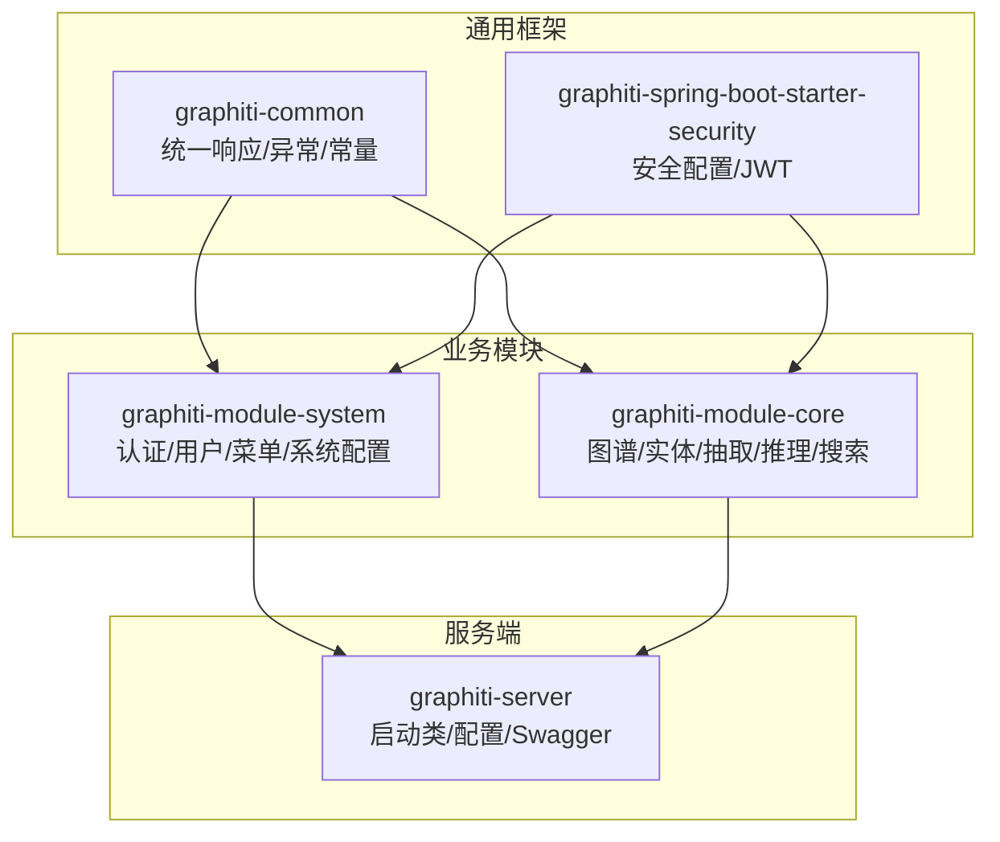
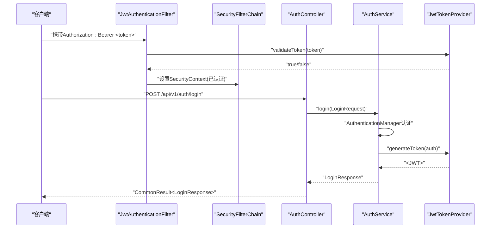
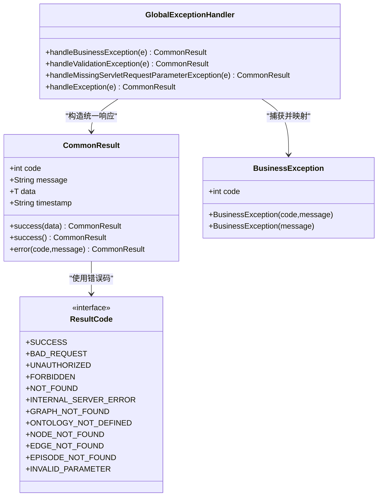
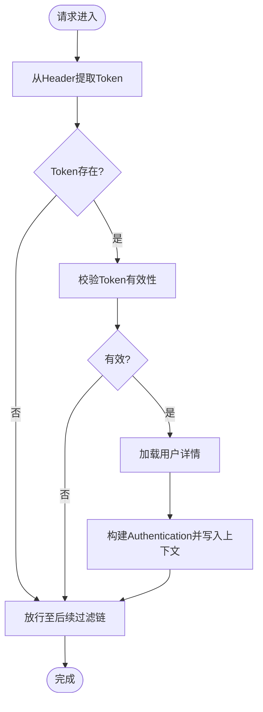
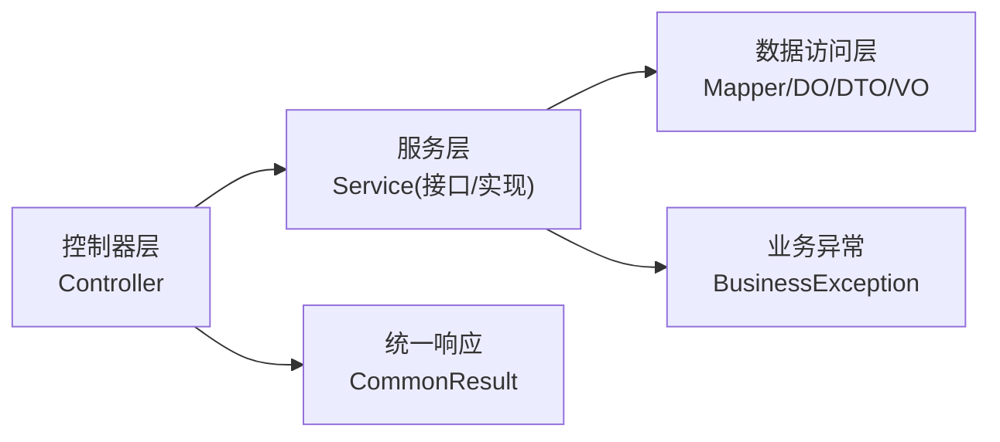
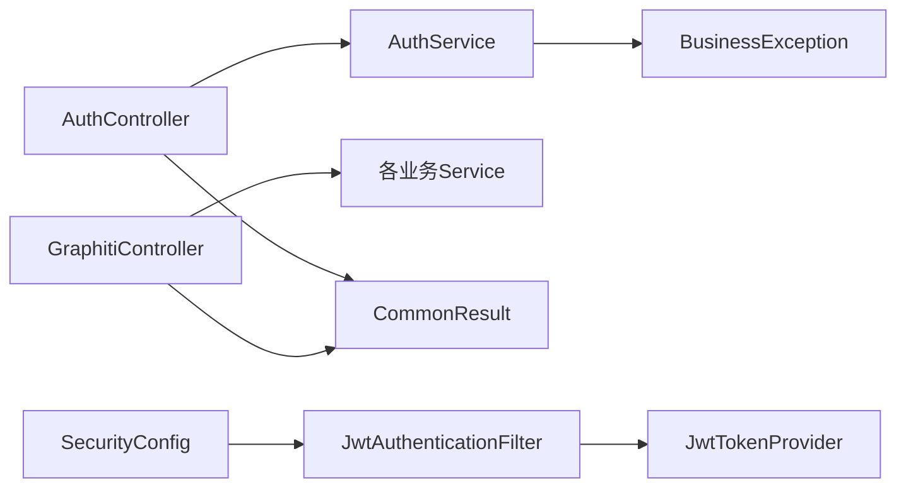

# 后端代码规范

<!--<cite>
**本文引用的文件**
- [ResultCode.java](file://graphiti-framework/graphiti-common/src/main/java/com/raphiti/common/constants/ResultCode.java)
- [CommonResult.java](file://graphiti-framework/graphiti-common/src/main/java/com/raphiti/common/response/CommonResult.java)
- [BusinessException.java](file://graphiti-framework/graphiti-common/src/main/java/com/raphiti/common/exception/BusinessException.java)
- [GlobalExceptionHandler.java](file://graphiti-framework/graphiti-common/src/main/java/com/raphiti/common/exception/GlobalExceptionHandler.java)
- [SecurityConfig.java](file://graphiti-framework/graphiti-spring-boot-starter-security/src/main/java/com/raphiti/framework/security/config/SecurityConfig.java)
- [JwtAuthenticationFilter.java](file://graphiti-framework/graphiti-spring-boot-starter-security/src/main/java/com/raphiti/framework/security/jwt/JwtAuthenticationFilter.java)
- [JwtTokenProvider.java](file://graphiti-framework/graphiti-spring-boot-starter-security/src/main/java/com/raphiti/framework/security/jwt/JwtTokenProvider.java)
- [AuthController.java](file://graphiti-module-system/src/main/java/com/raphiti/system/controller/AuthController.java)
- [LoginRequest.java](file://graphiti-module-system/src/main/java/com/raphiti/system/dto/LoginRequest.java)
- [LoginResponse.java](file://graphiti-module-system/src/main/java/com/raphiti/system/dto/LoginResponse.java)
- [AuthService.java](file://graphiti-module-system/src/main/java/com/raphiti/system/service/AuthService.java)
- [AuthServiceImpl.java](file://graphiti-module-system/src/main/java/com/raphiti/system/service/impl/AuthServiceImpl.java)
- [GraphitiController.java](file://graphiti-module-core/src/main/java/com/raphiti/module/graphiti/controller/admin/GraphitiController.java)
- [GraphInfoRespVO.java](file://graphiti-module-core/src/main/java/com/raphiti/module/graphiti/vo/graph/GraphInfoRespVO.java)
</cite>-->

## 目录
1. [引言](#引言)
2. [项目结构](#项目结构)
3. [核心组件](#核心组件)
4. [架构总览](#架构总览)
5. [详细组件分析](#详细组件分析)
6. [依赖分析](#依赖分析)
7. [性能考虑](#性能考虑)
8. [故障排查指南](#故障排查指南)
9. [结论](#结论)
10. [附录](#附录)

## 引言
本规范面向Graphiti Java后端工程，基于现有代码库总结出统一的Spring Boot代码组织与实现规范，覆盖包命名、类设计、控制器/服务/数据访问层职责划分、实体/DTO/VO命名与字段规范、异常与日志、事务管理、统一响应包装、全局异常处理、JWT认证与安全配置、单元测试与Mock实践、代码注释与接口文档、API设计原则等内容。目标是提升代码一致性、可维护性与协作效率。

## 项目结构
- 模块化组织：采用多模块Maven结构，核心功能拆分为通用框架、系统模块、核心业务模块与服务端应用模块。
- 分层清晰：遵循经典的三层架构（表现层/控制层、领域服务层、数据访问层），结合Spring Boot特性进行模块内聚与职责分离。
- 安全与通用能力：通过独立starter模块提供安全与通用工具（统一响应、异常处理、JWT等），便于跨模块复用。

**章节来源**
- [CommonResult.java:1-68](file://graphiti-framework/graphiti-common/src/main/java/com/raphiti/common/response/CommonResult.java#L1-L68)
- [SecurityConfig.java:1-138](file://graphiti-framework/graphiti-spring-boot-starter-security/src/main/java/com/raphiti/framework/security/config/SecurityConfig.java#L1-L138)

## 核心组件
- 统一响应包装：提供统一的响应结构与静态工厂方法，确保前后端交互一致。
- 全局异常处理：集中捕获业务异常、参数校验异常与未知异常，输出标准化错误响应。
- 业务异常模型：定义带错误码的业务异常类，便于前端识别与提示。
- 结果码常量：定义标准HTTP语义与业务语义错误码，避免魔法数字。

**章节来源**
- [CommonResult.java:1-68](file://graphiti-framework/graphiti-common/src/main/java/com/raphiti/common/response/CommonResult.java#L1-L68)
- [GlobalExceptionHandler.java:1-74](file://graphiti-framework/graphiti-common/src/main/java/com/raphiti/common/exception/GlobalExceptionHandler.java#L1-L74)
- [BusinessException.java:1-33](file://graphiti-framework/graphiti-common/src/main/java/com/raphiti/common/exception/BusinessException.java#L1-L33)
- [ResultCode.java:1-23](file://graphiti-framework/graphiti-common/src/main/java/com/raphiti/common/constants/ResultCode.java#L1-L23)

## 架构总览
下图展示从客户端到控制器、服务层、安全过滤链与JWT解析的整体调用路径与职责边界。

**图表来源**
- [JwtAuthenticationFilter.java:1-61](file://graphiti-framework/graphiti-spring-boot-starter-security/src/main/java/com/raphiti/framework/security/jwt/JwtAuthenticationFilter.java#L1-L61)
- [SecurityConfig.java:115-136](file://graphiti-framework/graphiti-spring-boot-starter-security/src/main/java/com/raphiti/framework/security/config/SecurityConfig.java#L115-L136)
- [AuthController.java:1-55](file://graphiti-module-system/src/main/java/com/raphiti/system/controller/AuthController.java#L1-L55)
- [AuthServiceImpl.java:1-67](file://graphiti-module-system/src/main/java/com/raphiti/system/service/impl/AuthServiceImpl.java#L1-L67)
- [JwtTokenProvider.java:1-87](file://graphiti-framework/graphiti-spring-boot-starter-security/src/main/java/com/raphiti/framework/security/jwt/JwtTokenProvider.java#L1-L87)

## 详细组件分析

### 统一响应与异常体系
- 统一响应：封装code/message/data/timestamp，提供success/error静态工厂，保证所有接口返回结构一致。
- 全局异常：集中处理业务异常、参数校验异常、缺失参数异常与未知异常，输出标准化JSON。
- 业务异常：携带业务错误码，便于前端区分“业务失败”与“系统错误”。

**图表来源**
- [CommonResult.java:1-68](file://graphiti-framework/graphiti-common/src/main/java/com/raphiti/common/response/CommonResult.java#L1-L68)
- [BusinessException.java:1-33](file://graphiti-framework/graphiti-common/src/main/java/com/raphiti/common/exception/BusinessException.java#L1-L33)
- [GlobalExceptionHandler.java:1-74](file://graphiti-framework/graphiti-common/src/main/java/com/raphiti/common/exception/GlobalExceptionHandler.java#L1-L74)
- [ResultCode.java:1-23](file://graphiti-framework/graphiti-common/src/main/java/com/raphiti/common/constants/ResultCode.java#L1-L23)

**章节来源**
- [CommonResult.java:1-68](file://graphiti-framework/graphiti-common/src/main/java/com/raphiti/common/response/CommonResult.java#L1-L68)
- [GlobalExceptionHandler.java:1-74](file://graphiti-framework/graphiti-common/src/main/java/com/raphiti/common/exception/GlobalExceptionHandler.java#L1-L74)
- [BusinessException.java:1-33](file://graphiti-framework/graphiti-common/src/main/java/com/raphiti/common/exception/BusinessException.java#L1-L33)
- [ResultCode.java:1-23](file://graphiti-framework/graphiti-common/src/main/java/com/raphiti/common/constants/ResultCode.java#L1-L23)

### 安全与JWT认证
- 安全配置：禁用CSRF、无状态会话、CORS策略、未认证/权限不足返回JSON。
- JWT过滤器：从Authorization头提取Bearer Token，验证后写入SecurityContext。
- Token提供器：生成/解析/校验JWT，支持过期时间与密钥配置。

**图表来源**
- [JwtAuthenticationFilter.java:1-61](file://graphiti-framework/graphiti-spring-boot-starter-security/src/main/java/com/raphiti/framework/security/jwt/JwtAuthenticationFilter.java#L1-L61)
- [JwtTokenProvider.java:1-87](file://graphiti-framework/graphiti-spring-boot-starter-security/src/main/java/com/raphiti/framework/security/jwt/JwtTokenProvider.java#L1-L87)
- [SecurityConfig.java:115-136](file://graphiti-framework/graphiti-spring-boot-starter-security/src/main/java/com/raphiti/framework/security/config/SecurityConfig.java#L115-L136)

**章节来源**
- [SecurityConfig.java:1-138](file://graphiti-framework/graphiti-spring-boot-starter-security/src/main/java/com/raphiti/framework/security/config/SecurityConfig.java#L1-L138)
- [JwtAuthenticationFilter.java:1-61](file://graphiti-framework/graphiti-spring-boot-starter-security/src/main/java/com/raphiti/framework/security/jwt/JwtAuthenticationFilter.java#L1-L61)
- [JwtTokenProvider.java:1-87](file://graphiti-framework/graphiti-spring-boot-starter-security/src/main/java/com/raphiti/framework/security/jwt/JwtTokenProvider.java#L1-L87)

### 控制器、服务层与数据访问层组织规范
- 控制器层：仅负责接收请求、参数校验、调用服务、返回统一响应；不直接操作数据库。
- 服务层：封装业务流程，声明接口，实现类使用注解标识；必要时开启事务。
- 数据访问层：DAO/Mapper负责数据读写；DO/DTO/VO严格区分职责。

**图表来源**
- [GraphitiController.java:1-235](file://graphiti-module-core/src/main/java/com/raphiti/module/graphiti/controller/admin/GraphitiController.java#L1-L235)
- [AuthController.java:1-55](file://graphiti-module-system/src/main/java/com/raphiti/system/controller/AuthController.java#L1-L55)
- [AuthService.java:1-26](file://graphiti-module-system/src/main/java/com/raphiti/system/service/AuthService.java#L1-L26)
- [AuthServiceImpl.java:1-67](file://graphiti-module-system/src/main/java/com/raphiti/system/service/impl/AuthServiceImpl.java#L1-L67)
- [CommonResult.java:1-68](file://graphiti-framework/graphiti-common/src/main/java/com/raphiti/common/response/CommonResult.java#L1-L68)
- [BusinessException.java:1-33](file://graphiti-framework/graphiti-common/src/main/java/com/raphiti/common/exception/BusinessException.java#L1-L33)

**章节来源**
- [GraphitiController.java:1-235](file://graphiti-module-core/src/main/java/com/raphiti/module/graphiti/controller/admin/GraphitiController.java#L1-L235)
- [AuthController.java:1-55](file://graphiti-module-system/src/main/java/com/raphiti/system/controller/AuthController.java#L1-L55)
- [AuthService.java:1-26](file://graphiti-module-system/src/main/java/com/raphiti/system/service/AuthService.java#L1-L26)
- [AuthServiceImpl.java:1-67](file://graphiti-module-system/src/main/java/com/raphiti/system/service/impl/AuthServiceImpl.java#L1-L67)

### 实体类、DTO、VO命名与字段规范
- DO（数据对象）：对应持久层表结构，字段与数据库列一致，命名采用驼峰。
- DTO（数据传输对象）：用于接口入参/出参的数据载体，字段按接口契约定义，使用校验注解。
- VO（视图对象）：面向前端展示的数据结构，字段简洁、语义明确，避免暴露敏感信息。

示例参考：
- 登录请求DTO：包含用户名与密码字段，并标注非空校验。
- 登录响应DTO：包含token、expiresIn与用户信息子结构。
- 图谱信息响应VO：包含图谱标识、名称、描述、计数与时点信息。

**章节来源**
- [LoginRequest.java:1-26](file://graphiti-module-system/src/main/java/com/raphiti/system/dto/LoginRequest.java#L1-L26)
- [LoginResponse.java:1-39](file://graphiti-module-system/src/main/java/com/raphiti/system/dto/LoginResponse.java#L1-L39)
- [GraphInfoRespVO.java:1-42](file://graphiti-module-core/src/main/java/com/raphiti/module/graphiti/vo/graph/GraphInfoRespVO.java#L1-L42)

### 异常处理与日志记录
- 使用全局异常处理器统一捕获业务异常与参数校验异常，输出统一响应。
- 日志记录：对业务异常与系统异常进行记录，便于问题追踪与审计。
- 建议：为关键业务流程增加必要的日志级别（info/warn/error），避免过度打印。

**章节来源**
- [GlobalExceptionHandler.java:1-74](file://graphiti-framework/graphiti-common/src/main/java/com/raphiti/common/exception/GlobalExceptionHandler.java#L1-L74)
- [BusinessException.java:1-33](file://graphiti-framework/graphiti-common/src/main/java/com/raphiti/common/exception/BusinessException.java#L1-L33)

### 事务管理
- 建议：在服务层方法上使用事务注解，确保业务原子性。
- 注意：事务作用域应覆盖完整的业务步骤，避免跨服务传播导致的复杂性。

（本节为通用指导，不直接分析具体文件）

### 统一响应包装与全局异常处理
- 所有控制器返回值统一使用统一响应包装，保持前后端契约一致。
- 全局异常处理器对不同异常类型进行分类处理，返回标准化错误信息。

**章节来源**
- [CommonResult.java:1-68](file://graphiti-framework/graphiti-common/src/main/java/com/raphiti/common/response/CommonResult.java#L1-L68)
- [GlobalExceptionHandler.java:1-74](file://graphiti-framework/graphiti-common/src/main/java/com/raphiti/common/exception/GlobalExceptionHandler.java#L1-L74)

### JWT认证与安全配置
- 安全配置：无状态会话、CORS、未认证/权限不足返回JSON。
- JWT过滤器：从请求头解析并验证Token，注入认证上下文。
- Token提供器：生成/解析/校验Token，支持密钥与过期时间配置。

**章节来源**
- [SecurityConfig.java:1-138](file://graphiti-framework/graphiti-spring-boot-starter-security/src/main/java/com/raphiti/framework/security/config/SecurityConfig.java#L1-L138)
- [JwtAuthenticationFilter.java:1-61](file://graphiti-framework/graphiti-spring-boot-starter-security/src/main/java/com/raphiti/framework/security/jwt/JwtAuthenticationFilter.java#L1-L61)
- [JwtTokenProvider.java:1-87](file://graphiti-framework/graphiti-spring-boot-starter-security/src/main/java/com/raphiti/framework/security/jwt/JwtTokenProvider.java#L1-L87)

### 单元测试编写规范与Mock使用标准
- 测试分层：控制器层使用@WebMvcTest或集成测试；服务层使用@TestInstance与Mockito；数据访问层使用嵌入式数据库或Mock。
- Mock策略：对依赖的服务与外部系统进行Mock，隔离被测单元。
- 断言建议：断言响应结构、状态码、日志与异常行为，覆盖正常与异常分支。

（本节为通用指导，不直接分析具体文件）

### 代码注释标准、接口文档规范与API设计原则
- 注释规范：类/方法/字段添加中文注释，说明用途、参数、返回值与注意事项。
- 接口文档：使用OpenAPI/Swagger注解标注接口含义、参数、安全要求与示例。
- API设计：REST风格、幂等性、版本化、错误码语义化、参数最小化与必填项明确。

**章节来源**
- [AuthController.java:1-55](file://graphiti-module-system/src/main/java/com/raphiti/system/controller/AuthController.java#L1-L55)
- [GraphitiController.java:1-235](file://graphiti-module-core/src/main/java/com/raphiti/module/graphiti/controller/admin/GraphitiController.java#L1-L235)

## 依赖分析
- 控制器依赖服务接口，服务实现依赖安全组件与工具类。
- 统一响应与异常处理作为横切关注点，被所有控制器共享。
- 安全配置贯穿整个过滤链，为所有受保护接口提供认证保障。

**图表来源**
- [AuthController.java:1-55](file://graphiti-module-system/src/main/java/com/raphiti/system/controller/AuthController.java#L1-L55)
- [GraphitiController.java:1-235](file://graphiti-module-core/src/main/java/com/raphiti/module/graphiti/controller/admin/GraphitiController.java#L1-L235)
- [CommonResult.java:1-68](file://graphiti-framework/graphiti-common/src/main/java/com/raphiti/common/response/CommonResult.java#L1-L68)
- [BusinessException.java:1-33](file://graphiti-framework/graphiti-common/src/main/java/com/raphiti/common/exception/BusinessException.java#L1-L33)
- [SecurityConfig.java:1-138](file://graphiti-framework/graphiti-spring-boot-starter-security/src/main/java/com/raphiti/framework/security/config/SecurityConfig.java#L1-L138)
- [JwtAuthenticationFilter.java:1-61](file://graphiti-framework/graphiti-spring-boot-starter-security/src/main/java/com/raphiti/framework/security/jwt/JwtAuthenticationFilter.java#L1-L61)
- [JwtTokenProvider.java:1-87](file://graphiti-framework/graphiti-spring-boot-starter-security/src/main/java/com/raphiti/framework/security/jwt/JwtTokenProvider.java#L1-L87)

**章节来源**
- [AuthController.java:1-55](file://graphiti-module-system/src/main/java/com/raphiti/system/controller/AuthController.java#L1-L55)
- [GraphitiController.java:1-235](file://graphiti-module-core/src/main/java/com/raphiti/module/graphiti/controller/admin/GraphitiController.java#L1-L235)
- [CommonResult.java:1-68](file://graphiti-framework/graphiti-common/src/main/java/com/raphiti/common/response/CommonResult.java#L1-L68)
- [BusinessException.java:1-33](file://graphiti-framework/graphiti-common/src/main/java/com/raphiti/common/exception/BusinessException.java#L1-L33)
- [SecurityConfig.java:1-138](file://graphiti-framework/graphiti-spring-boot-starter-security/src/main/java/com/raphiti/framework/security/config/SecurityConfig.java#L1-L138)
- [JwtAuthenticationFilter.java:1-61](file://graphiti-framework/graphiti-spring-boot-starter-security/src/main/java/com/raphiti/framework/security/jwt/JwtAuthenticationFilter.java#L1-L61)
- [JwtTokenProvider.java:1-87](file://graphiti-framework/graphiti-spring-boot-starter-security/src/main/java/com/raphiti/framework/security/jwt/JwtTokenProvider.java#L1-L87)

## 性能考虑
- 过滤链优化：禁用不必要的中间件，合理配置CORS与会话策略。
- 序列化开销：统一响应与异常序列化尽量避免大对象与循环引用。
- 缓存策略：对热点查询引入缓存，减少重复计算与数据库压力。
- 并发与线程：服务层并发场景下注意线程安全与锁粒度。

（本节为通用指导，不直接分析具体文件）

## 故障排查指南
- 未认证/权限不足：检查Security配置与JWT过滤器是否正确注入，确认请求头格式与Token有效性。
- 参数校验失败：查看全局异常处理器对MethodArgumentNotValidException的处理与字段错误拼接。
- 业务异常：定位业务异常抛出处，核对错误码与提示信息是否符合预期。

**章节来源**
- [SecurityConfig.java:1-138](file://graphiti-framework/graphiti-spring-boot-starter-security/src/main/java/com/raphiti/framework/security/config/SecurityConfig.java#L1-L138)
- [JwtAuthenticationFilter.java:1-61](file://graphiti-framework/graphiti-spring-boot-starter-security/src/main/java/com/raphiti/framework/security/jwt/JwtAuthenticationFilter.java#L1-L61)
- [GlobalExceptionHandler.java:1-74](file://graphiti-framework/graphiti-common/src/main/java/com/raphiti/common/exception/GlobalExceptionHandler.java#L1-L74)
- [BusinessException.java:1-33](file://graphiti-framework/graphiti-common/src/main/java/com/raphiti/common/exception/BusinessException.java#L1-L33)

## 结论
本规范以现有代码为基础，总结了统一响应、异常处理、安全认证与分层架构的最佳实践。建议在新功能开发中严格遵循命名与职责划分，确保代码一致性与可维护性；同时在测试与文档方面持续完善，提升团队协作效率与交付质量。

## 附录
- 包命名约定（建议）
  - 控制器：com.graphiti.{module}.controller
  - 服务接口与实现：com.graphiti.{module}.service & impl
  - 数据访问：com.graphiti.{module}.dal.mapper & dataobject
  - DTO/VO：com.graphiti.{module}.dto & vo
  - 异常与常量：com.graphiti.{module}.exception & constants
- 类设计原则（建议）
  - 单一职责、高内聚低耦合
  - 接口与实现分离，避免在接口中出现实现细节
  - 字段私有化，提供明确的getter/setter或不可变对象
- API设计原则（建议）
  - REST风格、幂等性、版本化、错误码语义化、参数最小化与必填项明确