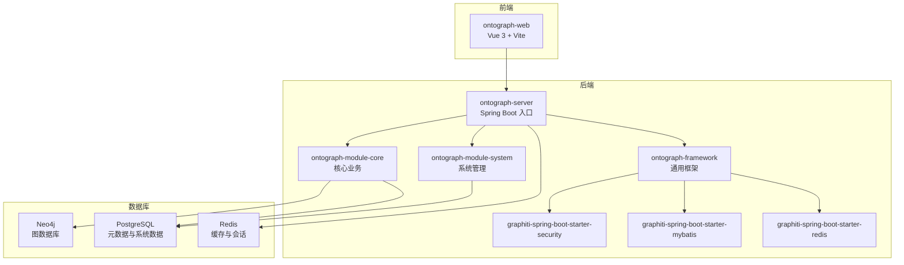
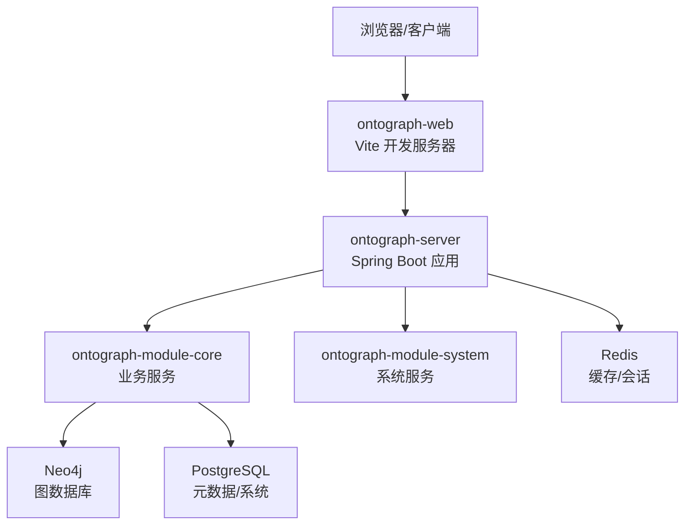
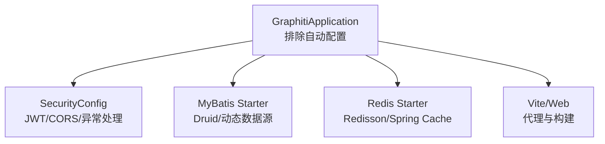
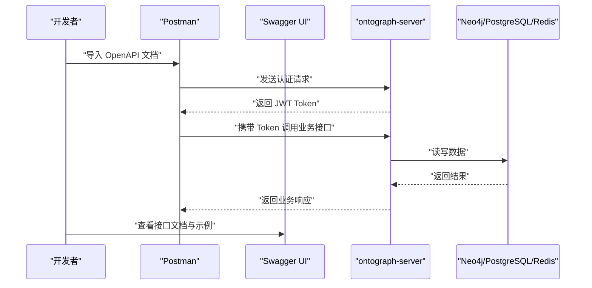
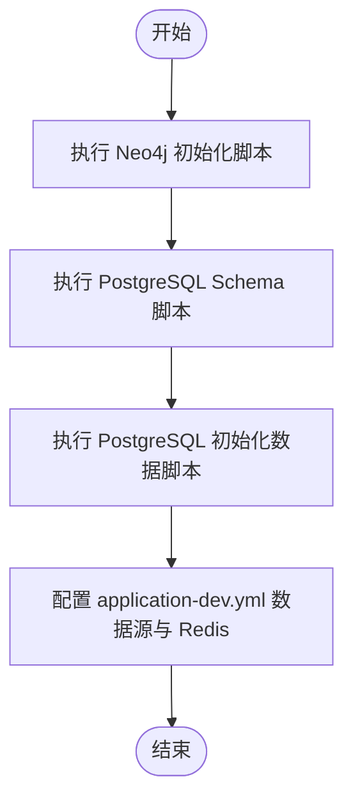

# 开发工具与配置

<!--<cite>
**本文引用的文件**
- [README.md](file://README.md)
- [DESIGN.md](file://DESIGN.md)
- [pom.xml](file://pom.xml)
- [ontograph-server/src/main/resources/application.yml](file://ontograph-server/src/main/resources/application.yml)
- [ontograph-server/src/main/resources/application-dev.yml](file://ontograph-server/src/main/resources/application-dev.yml)
- [ontograph-server/src/main/java/com/GraphitiApplication.java](file://ontograph-server/src/main/java/com/GraphitiApplication.java)
- [ontograph-framework/graphiti-spring-boot-starter-security/src/main/java/com/graphiti/framework/security/config/SecurityConfig.java](file://ontograph-framework/graphiti-spring-boot-starter-security/src/main/java/com/graphiti/framework/security/config/SecurityConfig.java)
- [ontograph-framework/graphiti-spring-boot-starter-mybatis/pom.xml](file://ontograph-framework/graphiti-spring-boot-starter-mybatis/pom.xml)
- [ontograph-framework/graphiti-spring-boot-starter-redis/pom.xml](file://ontograph-framework/graphiti-spring-boot-starter-redis/pom.xml)
- [ontograph-web/package.json](file://ontograph-web/package.json)
- [ontograph-web/vite.config.ts](file://ontograph-web/vite.config.ts)
- [ontograph-web/setup.bat](file://ontograph-web/setup.bat)
- [ontograph-web/install.bat](file://ontograph-web/install.bat)
- [sql/neo4j/init.cypher](file://sql/neo4j/init.cypher)
- [sql/postgresql/schema.sql](file://sql/postgresql/schema.sql)
- [docs/database-migration-guide.md](file://docs/database-migration-guide.md)
- [docs/pipeline.md](file://docs/pipeline.md)
</cite>-->

## 目录
1. [简介](#简介)
2. [项目结构](#项目结构)
3. [核心组件](#核心组件)
4. [架构总览](#架构总览)
5. [详细组件分析](#详细组件分析)
6. [依赖分析](#依赖分析)
7. [性能考虑](#性能考虑)
8. [故障排查指南](#故障排查指南)
9. [结论](#结论)
10. [附录](#附录)

## 简介
本指南面向 ontograph-java 项目的开发与配置管理，覆盖开发工具安装与配置（Postman、DBeaver、Neo4j Browser）、构建脚本与自动化任务、CI/CD 流水线建议、IDE 配置模板、代码格式化与静态分析工具、数据库管理与 API 测试工具、性能监控工具，以及开发与测试环境配置差异。文档同时结合项目实际的配置文件与脚本，提供可落地的操作步骤。

## 项目结构
项目采用多模块 Maven 结构，包含框架基础模块、业务模块、服务入口与前端工程，并配套数据库初始化脚本与运维文档。关键模块与职责如下：
- ontograph-framework：通用框架与基础设施（安全、MyBatis、Redis）
- ontograph-module-system：系统管理（用户、角色、菜单、权限）
- ontograph-module-core：核心业务（知识图谱、搜索、导入、本体、社区）
- ontograph-server：Spring Boot 启动入口与配置
- ontograph-web：Vue 3 前端工程
- sql：Neo4j 与 PostgreSQL 初始化脚本
- docs：技术文档与迁移指南

图表来源
- [pom.xml:15-20](file://pom.xml#L15-L20)
- [ontograph-server/src/main/java/com/GraphitiApplication.java:18-34](file://ontograph-server/src/main/java/com/GraphitiApplication.java#L18-L34)

章节来源
- [pom.xml:15-20](file://pom.xml#L15-L20)
- [README.md:110-166](file://README.md#L110-L166)

## 核心组件
- 安全与认证：基于 JWT 的 Spring Security 配置，统一 401/403 异常响应。
- 数据访问：MyBatis-Plus + 动态数据源 + Druid 连接池。
- 缓存：Redisson + Spring Cache。
- 前端：Vue 3 + Vite + Ant Design Vue，开发代理至后端 8080。
- 数据库：Neo4j（图谱与向量索引）、PostgreSQL（元数据与系统数据）、Redis（缓存）。

章节来源
- [ontograph-framework/graphiti-spring-boot-starter-security/src/main/java/com/graphiti/framework/security/config/SecurityConfig.java:115-136](file://ontograph-framework/graphiti-spring-boot-starter-security/src/main/java/com/graphiti/framework/security/config/SecurityConfig.java#L115-L136)
- [ontograph-framework/graphiti-spring-boot-starter-mybatis/pom.xml:19-41](file://ontograph-framework/graphiti-spring-boot-starter-mybatis/pom.xml#L19-L41)
- [ontograph-framework/graphiti-spring-boot-starter-redis/pom.xml:19-37](file://ontograph-framework/graphiti-spring-boot-starter-redis/pom.xml#L19-L37)
- [ontograph-web/vite.config.ts:18-26](file://ontograph-web/vite.config.ts#L18-L26)

## 架构总览
后端通过 Spring Boot 启动，加载安全、数据访问与缓存等基础能力；核心业务模块负责知识图谱的增删改查、本体校验、实体/关系抽取、向量检索与社区发现；前端通过 Vite 代理访问后端 API；数据层包括 Neo4j、PostgreSQL 与 Redis。

图表来源
- [README.md:71-108](file://README.md#L71-L108)
- [ontograph-web/vite.config.ts:18-26](file://ontograph-web/vite.config.ts#L18-L26)

## 详细组件分析

### 开发工具安装与配置
- Postman
  - 用途：API 接口调试与集成测试
  - 建议：导入项目 API 文档（Swagger/OpenAPI），设置全局变量（如基础 URL、JWT Token）
  - 参考：后端提供 Swagger UI 与 OpenAPI JSON 地址
- DBeaver
  - 用途：PostgreSQL/MySQL 数据库可视化与 SQL 调试
  - 建议：连接配置参考 application-dev.yml 中的数据源设置
- Neo4j Browser
  - 用途：图数据库查询与索引验证
  - 建议：执行初始化 Cypher 脚本，验证唯一性约束与索引

章节来源
- [README.md:408-414](file://README.md#L408-L414)
- [ontograph-server/src/main/resources/application-dev.yml:487-502](file://ontograph-server/src/main/resources/application-dev.yml#L487-L502)
- [sql/neo4j/init.cypher:1-33](file://sql/neo4j/init.cypher#L1-L33)

### 构建脚本与自动化任务
- Maven 多模块构建
  - 顶层 pom 管理版本与插件，各模块独立打包与发布
  - 建议：本地开发使用 `mvn clean install -DskipTests` 快速构建
- 前端自动化
  - npm scripts：dev、build、preview、type-check
  - Vite 开发服务器端口与代理配置
- 批处理脚本
  - ontograph-web 提供 install.bat 与 setup.bat，一键安装依赖并启动开发服务器

章节来源
- [pom.xml:199-236](file://pom.xml#L199-L236)
- [ontograph-web/package.json:5-10](file://ontograph-web/package.json#L5-L10)
- [ontograph-web/vite.config.ts:18-26](file://ontograph-web/vite.config.ts#L18-L26)
- [ontograph-web/install.bat:1-10](file://ontograph-web/install.bat#L1-L10)
- [ontograph-web/setup.bat:1-32](file://ontograph-web/setup.bat#L1-L32)

### CI/CD 流水线设置建议
- 触发方式：Push/PR 触发构建与测试
- 步骤建议：
  1) 环境准备：安装 JDK 21、Node.js 18、Maven、Docker（可选）
  2) 依赖安装：Maven 安装 Java 依赖；npm install 安装前端依赖
  3) 代码质量：静态分析与格式化检查（见“代码格式化与静态分析”）
  4) 单元测试：Maven 测试
  5) 构建产物：后端打包、前端构建
  6) 部署：容器化部署或直接部署到目标环境
- 参考：项目提供数据库迁移与初始化脚本，可在流水线中执行

章节来源
- [docs/database-migration-guide.md:64-77](file://docs/database-migration-guide.md#L64-L77)
- [docs/database-migration-guide.md:106-112](file://docs/database-migration-guide.md#L106-L112)

### IDE 配置模板与最佳实践
- Java 工程
  - JDK 21、Lombok、MapStruct 注解处理器
  - Maven 编译插件与参数（含 -parameters）
- 前端工程
  - TypeScript、Vue 3、ESLint（建议）、Prettier（建议）
  - Vite 配置与别名 @ 指向 src
- 设计规范
  - 前端主题色与组件样式参考 DESIGN.md 中的配色与排版令牌

章节来源
- [pom.xml:200-227](file://pom.xml#L200-L227)
- [ontograph-web/vite.config.ts:9-13](file://ontograph-web/vite.config.ts#L9-L13)
- [DESIGN.md:6-30](file://DESIGN.md#L6-L30)

### 代码格式化与静态分析工具
- Java
  - Lombok、MapStruct 注解处理器已在 Maven 插件中配置
  - 建议：引入 SpotBugs、Checkstyle、Spotless 或 Google Java Format
- 前端
  - TypeScript 类型检查：vue-tsc
  - 建议：ESLint + Prettier 统一风格
- Git Hooks
  - 建议：husky + lint-staged 在提交前执行格式化与类型检查

章节来源
- [pom.xml:214-225](file://pom.xml#L214-L225)
- [ontograph-web/package.json:9](file://ontograph-web/package.json#L9)

### 数据库管理工具与配置
- Neo4j
  - 初始化脚本：创建唯一性约束、索引与全文索引
  - 向量索引：通过启动时自动创建（参考 README 的向量索引配置）
- PostgreSQL
  - 初始化脚本：创建系统表、图谱元数据表与索引
  - 迁移指南：提供从 MySQL 到 PostgreSQL 的迁移步骤与注意事项
- Redis
  - 缓存与会话配置：application-dev.yml 中的 Redis 连接参数

章节来源
- [sql/neo4j/init.cypher:1-33](file://sql/neo4j/init.cypher#L1-L33)
- [README.md:477-491](file://README.md#L477-L491)
- [sql/postgresql/schema.sql:1-319](file://sql/postgresql/schema.sql#L1-L319)
- [docs/database-migration-guide.md:1-218](file://docs/database-migration-guide.md#L1-L218)
- [ontograph-server/src/main/resources/application-dev.yml:503-507](file://ontograph-server/src/main/resources/application-dev.yml#L503-L507)

### API 测试工具与使用
- Postman
  - 导入 Swagger/OpenAPI 文档，设置环境变量（基础 URL、Token）
  - 示例接口：创建图谱、添加数据、混合检索、本体检索等
- Swagger UI
  - 启动后访问：/swagger-ui.html 与 /v3/api-docs

章节来源
- [README.md:408-414](file://README.md#L408-L414)
- [README.md:315-403](file://README.md#L315-L403)

### 性能监控工具与指标
- Actuator
  - 暴露健康检查、指标与信息端点，开发环境可全部暴露
- Prometheus
  - 可在生产环境启用 Prometheus 导出（当前配置为关闭）

章节来源
- [ontograph-server/src/main/resources/application.yml:44-56](file://ontograph-server/src/main/resources/application.yml#L44-L56)
- [ontograph-server/src/main/resources/application-dev.yml:615-635](file://ontograph-server/src/main/resources/application-dev.yml#L615-L635)

### 开发环境与测试环境配置差异
- 开发环境（application-dev.yml）
  - 详细日志级别（DEBUG）
  - Actuator 暴露全部端点
  - 本地数据库与 Redis 连接
  - LLM Provider 与 Embedding Provider 的本地/私有部署配置模板
- 生产环境（application.yml）
  - 默认日志级别与安全配置
  - Prometheus 导出默认关闭
  - JWT 密钥与过期时间配置

章节来源
- [ontograph-server/src/main/resources/application.yml:36-67](file://ontograph-server/src/main/resources/application.yml#L36-L67)
- [ontograph-server/src/main/resources/application-dev.yml:609-676](file://ontograph-server/src/main/resources/application-dev.yml#L609-L676)

## 依赖分析
- 启动类排除：根据需要排除不必要的自动配置（如特定 LLM 提供商）
- 安全：JWT + BCrypt + CORS 配置
- 数据访问：MyBatis-Plus + Druid + 动态数据源
- 缓存：Redisson + Spring Cache
- 前端：Vite + Vue 3 + Ant Design Vue

图表来源
- [ontograph-server/src/main/java/com/GraphitiApplication.java:18-34](file://ontograph-server/src/main/java/com/GraphitiApplication.java#L18-L34)
- [ontograph-framework/graphiti-spring-boot-starter-security/src/main/java/com/graphiti/framework/security/config/SecurityConfig.java:115-136](file://ontograph-framework/graphiti-spring-boot-starter-security/src/main/java/com/graphiti/framework/security/config/SecurityConfig.java#L115-L136)
- [ontograph-framework/graphiti-spring-boot-starter-mybatis/pom.xml:19-41](file://ontograph-framework/graphiti-spring-boot-starter-mybatis/pom.xml#L19-L41)
- [ontograph-framework/graphiti-spring-boot-starter-redis/pom.xml:19-37](file://ontograph-framework/graphiti-spring-boot-starter-redis/pom.xml#L19-L37)
- [ontograph-web/vite.config.ts:18-26](file://ontograph-web/vite.config.ts#L18-L26)

章节来源
- [ontograph-server/src/main/java/com/GraphitiApplication.java:18-34](file://ontograph-server/src/main/java/com/GraphitiApplication.java#L18-L34)
- [ontograph-framework/graphiti-spring-boot-starter-security/src/main/java/com/graphiti/framework/security/config/SecurityConfig.java:68-79](file://ontograph-framework/graphiti-spring-boot-starter-security/src/main/java/com/graphiti/framework/security/config/SecurityConfig.java#L68-L79)

## 性能考虑
- 数据库
  - PostgreSQL：合理索引、连接池参数调优
  - Neo4j：向量索引与全文索引配置，避免全量扫描
- 缓存
  - Redisson 配置与序列化策略
- 应用
  - Actuator 指标采集与 Prometheus 导出（生产启用）
  - 前端静态资源与代理优化

章节来源
- [docs/database-migration-guide.md:163-191](file://docs/database-migration-guide.md#L163-L191)
- [README.md:477-491](file://README.md#L477-L491)
- [ontograph-server/src/main/resources/application.yml:54-56](file://ontograph-server/src/main/resources/application.yml#L54-L56)

## 故障排查指南
- 数据库连接
  - PostgreSQL：确认 JDBC URL、时区参数与 pg_hba.conf 配置
  - MySQL 到 PostgreSQL 迁移：关注 JSONB、自增列与触发器差异
- Neo4j
  - 初始化脚本执行失败：检查约束与索引是否已存在
- 前端
  - Vite 代理 404：确认 /api 代理目标与端口
- 安全
  - 401/403：检查 JWT Token、CORS 与认证入口点配置

章节来源
- [docs/database-migration-guide.md:139-162](file://docs/database-migration-guide.md#L139-L162)
- [sql/neo4j/init.cypher:1-33](file://sql/neo4j/init.cypher#L1-L33)
- [ontograph-web/vite.config.ts:20-25](file://ontograph-web/vite.config.ts#L20-L25)
- [ontograph-framework/graphiti-spring-boot-starter-security/src/main/java/com/graphiti/framework/security/config/SecurityConfig.java:84-113](file://ontograph-framework/graphiti-spring-boot-starter-security/src/main/java/com/graphiti/framework/security/config/SecurityConfig.java#L84-L113)

## 结论
本指南基于项目实际配置与脚本，提供了从开发工具到 CI/CD、从数据库到 API 测试与性能监控的完整配置路径。建议在团队内统一 IDE 与格式化工具配置，结合 CI/CD 自动化流水线，确保开发与发布的稳定性与一致性。

## 附录

### API 测试流程（序列图）

图表来源
- [README.md:408-414](file://README.md#L408-L414)
- [README.md:315-403](file://README.md#L315-L403)

### 数据库初始化流程（流程图）

图表来源
- [sql/neo4j/init.cypher:1-33](file://sql/neo4j/init.cypher#L1-L33)
- [sql/postgresql/schema.sql:1-319](file://sql/postgresql/schema.sql#L1-L319)
- [ontograph-server/src/main/resources/application-dev.yml:487-507](file://ontograph-server/src/main/resources/application-dev.yml#L487-L507)