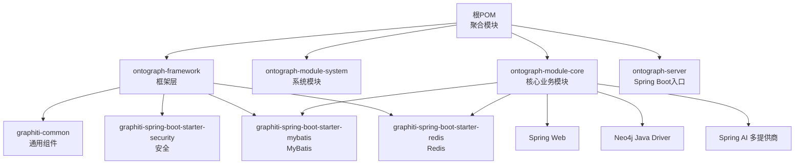
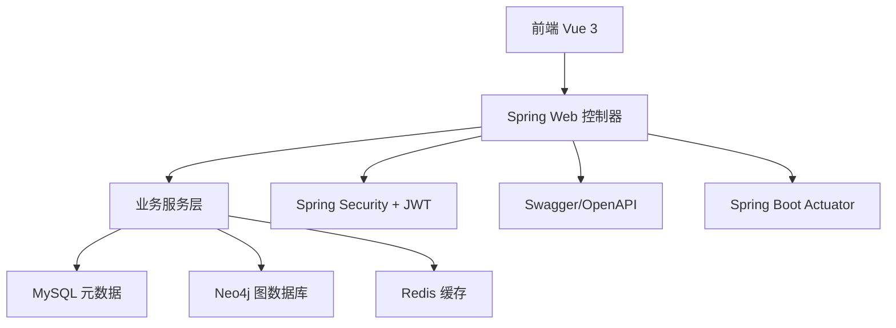
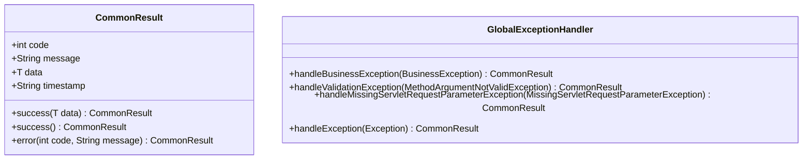
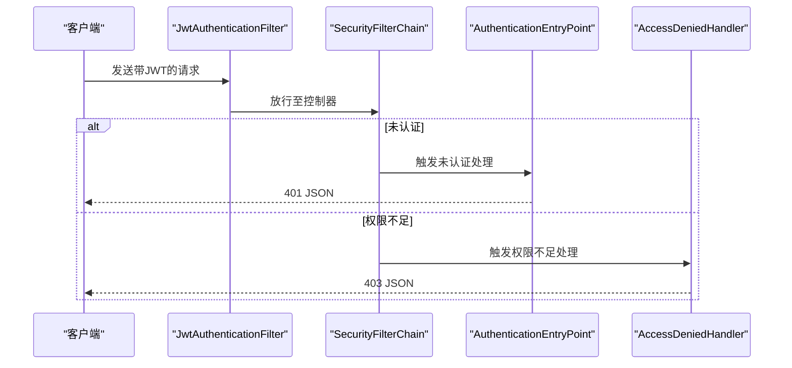
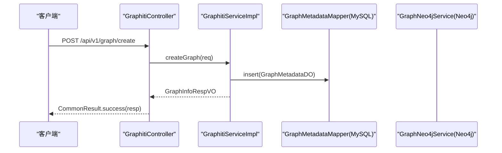
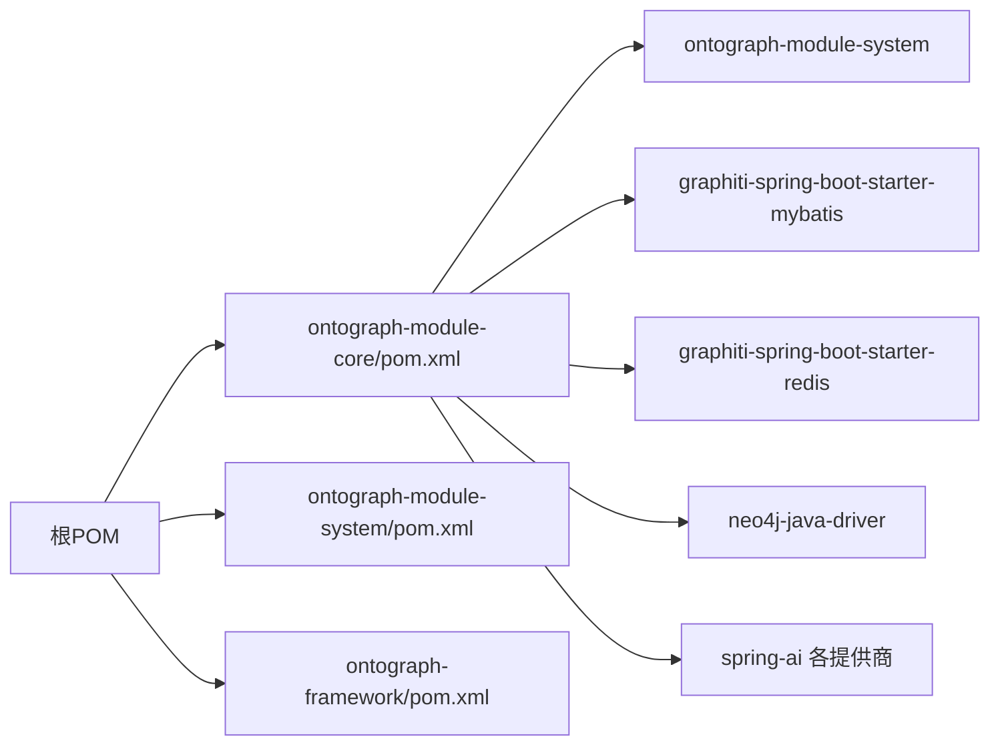

# 开发指南

<!--<cite>
**本文引用的文件**   
- [README.md](file://README.md)
- [DESIGN.md](file://DESIGN.md)
- [pom.xml](file://pom.xml)
- [ontograph-server/src/main/resources/application.yml](file://ontograph-server/src/main/resources/application.yml)
- [ontograph-framework/pom.xml](file://ontograph-framework/pom.xml)
- [ontograph-module-core/pom.xml](file://ontograph-module-core/pom.xml)
- [ontograph-module-system/pom.xml](file://ontograph-module-system/pom.xml)
- [ontograph-module-core/src/main/java/com/graphiti/module/graphiti/service/impl/GraphitiServiceImpl.java](file://ontograph-module-core/src/main/java/com/graphiti/module/graphiti/service/impl/GraphitiServiceImpl.java)
- [ontograph-module-core/src/main/java/com/graphiti/module/graphiti/controller/admin/GraphitiController.java](file://ontograph-module-core/src/main/java/com/graphiti/module/graphiti/controller/admin/GraphitiController.java)
- [ontograph-framework/graphiti-common/src/main/java/com/raphiti/common/response/CommonResult.java](file://ontograph-framework/graphiti-common/src/main/java/com/graphiti/common/response/CommonResult.java)
- [ontograph-framework/graphiti-common/src/main/java/com/graphiti/common/exception/GlobalExceptionHandler.java](file://ontograph-framework/graphiti-common/src/main/java/com/graphiti/common/exception/GlobalExceptionHandler.java)
- [ontograph-framework/graphiti-spring-boot-starter-security/src/main/java/com/graphiti/framework/security/config/SecurityConfig.java](file://ontograph-framework/graphiti-spring-boot-starter-security/src/main/java/com/graphiti/framework/security/config/SecurityConfig.java)
- [commit-msg.txt](file://commit-msg.txt)
</cite>-->

## 目录
1. [简介](#简介)
2. [项目结构](#项目结构)
3. [核心组件](#核心组件)
4. [架构总览](#架构总览)
5. [详细组件分析](#详细组件分析)
6. [依赖分析](#依赖分析)
7. [性能考虑](#性能考虑)
8. [故障排查指南](#故障排查指南)
9. [结论](#结论)
10. [附录](#附录)

## 简介
本指南面向新加入团队的开发者，提供OntoGraph项目的完整开发指南，涵盖开发环境搭建、代码规范、测试策略、IDE配置、调试设置、开发工具推荐、代码组织原则、命名约定、注释标准、Git工作流、分支管理、提交消息规范、持续集成与自动化部署、性能分析与并发最佳实践，以及常见问题的解决方案与调试技巧。

## 项目结构
OntoGraph采用多模块Maven聚合工程，分为框架层、系统模块、核心业务模块与服务入口模块，并配套统一的公共组件与安全、MyBatis、Redis等基础设施启动器。前端采用Vue 3 + Vite，后端基于Spring Boot 3.5.5与Spring AI，支持多种大模型提供商与向量索引。

图表来源
- [pom.xml:15-20](file://pom.xml#L15-L20)
- [ontograph-framework/pom.xml:22-27](file://ontograph-framework/pom.xml#L22-L27)
- [ontograph-module-core/pom.xml:24-45](file://ontograph-module-core/pom.xml#L24-L45)

章节来源
- [README.md:110-166](file://README.md#L110-L166)
- [pom.xml:15-20](file://pom.xml#L15-L20)

## 核心组件
- 统一响应与异常处理：通过CommonResult封装统一响应格式，GlobalExceptionHandler集中处理业务异常、参数校验异常与全局异常，确保前后端一致的错误语义。
- 安全与鉴权：基于Spring Security + JWT，SecurityConfig配置CORS、无状态会话、未认证与权限不足的JSON响应，开放认证、Swagger与Actuator相关路径。
- 业务服务：GraphitiServiceImpl负责图谱生命周期管理（创建、查询、更新、删除、克隆、导出、统计），调用Neo4j服务与MySQL元数据映射。
- 控制器：GraphitiController提供图谱管理、节点/边查询、社区构建与搜索、历史状态查询、搜索接口等REST API，统一使用CommonResult包装返回。

章节来源
- [ontograph-framework/graphiti-common/src/main/java/com/graphiti/common/response/CommonResult.java:13-67](file://ontograph-framework/graphiti-common/src/main/java/com/graphiti/common/response/CommonResult.java#L13-L67)
- [ontograph-framework/graphiti-common/src/main/java/com/graphiti/common/exception/GlobalExceptionHandler.java:17-73](file://ontograph-framework/graphiti-common/src/main/java/com/graphiti/common/exception/GlobalExceptionHandler.java#L17-L73)
- [ontograph-framework/graphiti-spring-boot-starter-security/src/main/java/com/graphiti/framework/security/config/SecurityConfig.java:32-137](file://ontograph-framework/graphiti-spring-boot-starter-security/src/main/java/com/graphiti/framework/security/config/SecurityConfig.java#L32-L137)
- [ontograph-module-core/src/main/java/com/graphiti/module/graphiti/service/impl/GraphitiServiceImpl.java:24-255](file://ontograph-module-core/src/main/java/com/graphiti/module/graphiti/service/impl/GraphitiServiceImpl.java#L24-L255)
- [ontograph-module-core/src/main/java/com/graphiti/module/graphiti/controller/admin/GraphitiController.java:37-234](file://ontograph-module-core/src/main/java/com/graphiti/module/graphiti/controller/admin/GraphitiController.java#L37-L234)

## 架构总览
后端采用分层架构：控制器层接收HTTP请求，服务层承载业务逻辑，数据访问层对接MySQL与Neo4j，统一通过公共响应与异常处理机制输出结果。安全层通过JWT拦截器与Spring Security配置保障接口安全。

图表来源
- [README.md:71-108](file://README.md#L71-L108)
- [ontograph-module-core/pom.xml:46-88](file://ontograph-module-core/pom.xml#L46-L88)
- [ontograph-server/src/main/resources/application.yml:25-67](file://ontograph-server/src/main/resources/application.yml#L25-L67)

## 详细组件分析

### 统一响应与异常处理
- 统一响应：CommonResult提供success(data)/success()/error(code,message)三类静态工厂方法，自动填充时间戳，便于前端统一解析。
- 异常处理：GlobalExceptionHandler针对业务异常、参数校验异常、缺少参数异常与未知异常分别返回标准化错误码与消息，避免泄露内部细节。

图表来源
- [ontograph-framework/graphiti-common/src/main/java/com/graphiti/common/response/CommonResult.java:13-67](file://ontograph-framework/graphiti-common/src/main/java/com/graphiti/common/response/CommonResult.java#L13-L67)
- [ontograph-framework/graphiti-common/src/main/java/com/graphiti/common/exception/GlobalExceptionHandler.java:17-73](file://ontograph-framework/graphiti-common/src/main/java/com/graphiti/common/exception/GlobalExceptionHandler.java#L17-L73)

章节来源
- [ontograph-framework/graphiti-common/src/main/java/com/graphiti/common/response/CommonResult.java:13-67](file://ontograph-framework/graphiti-common/src/main/java/com/graphiti/common/response/CommonResult.java#L13-L67)
- [ontograph-framework/graphiti-common/src/main/java/com/graphiti/common/exception/GlobalExceptionHandler.java:17-73](file://ontograph-framework/graphiti-common/src/main/java/com/graphiti/common/exception/GlobalExceptionHandler.java#L17-L73)

### 安全与鉴权
- 密码编码器：BCryptPasswordEncoder用于用户密码存储。
- 过滤链：无状态会话，开放认证、Swagger与Actuator路径，其余请求需认证。
- 未认证/权限不足：返回JSON格式的401/403响应，便于前端统一处理。

图表来源
- [ontograph-framework/graphiti-spring-boot-starter-security/src/main/java/com/graphiti/framework/security/config/SecurityConfig.java:84-136](file://ontograph-framework/graphiti-spring-boot-starter-security/src/main/java/com/graphiti/framework/security/config/SecurityConfig.java#L84-L136)

章节来源
- [ontograph-framework/graphiti-spring-boot-starter-security/src/main/java/com/graphiti/framework/security/config/SecurityConfig.java:32-137](file://ontograph-framework/graphiti-spring-boot-starter-security/src/main/java/com/graphiti/framework/security/config/SecurityConfig.java#L32-L137)

### 图谱管理服务与控制器
- 服务层：GraphitiServiceImpl实现图谱的创建、列表、详情、更新、删除、清空、统计、克隆与导出，涉及MySQL元数据与Neo4j数据的协同。
- 控制器层：GraphitiController提供REST接口，统一使用CommonResult包装响应，标注Swagger注解与安全要求。

图表来源
- [ontograph-module-core/src/main/java/com/graphiti/module/graphiti/controller/admin/GraphitiController.java:53-59](file://ontograph-module-core/src/main/java/com/graphiti/module/graphiti/controller/admin/GraphitiController.java#L53-L59)
- [ontograph-module-core/src/main/java/com/graphiti/module/graphiti/service/impl/GraphitiServiceImpl.java:30-47](file://ontograph-module-core/src/main/java/com/graphiti/module/graphiti/service/impl/GraphitiServiceImpl.java#L30-L47)

章节来源
- [ontograph-module-core/src/main/java/com/graphiti/module/graphiti/service/impl/GraphitiServiceImpl.java:24-255](file://ontograph-module-core/src/main/java/com/graphiti/module/graphiti/service/impl/GraphitiServiceImpl.java#L24-L255)
- [ontograph-module-core/src/main/java/com/graphiti/module/graphiti/controller/admin/GraphitiController.java:37-234](file://ontograph-module-core/src/main/java/com/graphiti/module/graphiti/controller/admin/GraphitiController.java#L37-L234)

### 代码组织与命名约定
- 包结构：按模块划分，如controller/admin、service、dal/dataobject、vo等；服务接口与实现分离，AI提供商实现位于impl/ai。
- 命名：接口以I前缀或Service结尾，实现类以Impl结尾；VO命名清晰表达用途，如GraphInfoRespVO、EdgeListRespVO等。
- 注释：使用Javadoc描述公共API，结合Swagger注解提升可读性与文档质量。

章节来源
- [README.md:507-531](file://README.md#L507-L531)
- [ontograph-module-core/src/main/java/com/graphiti/module/graphiti/controller/admin/GraphitiController.java:37-41](file://ontograph-module-core/src/main/java/com/graphiti/module/graphiti/controller/admin/GraphitiController.java#L37-L41)

## 依赖分析
- 版本与依赖管理：根POM通过dependencyManagement统一版本，框架层与业务模块继承父版本，确保一致性。
- 模块间依赖：核心模块依赖系统模块、MyBatis、Redis、Neo4j驱动与Spring AI；系统模块依赖安全、MyBatis与OpenAPI。

图表来源
- [pom.xml:45-196](file://pom.xml#L45-L196)
- [ontograph-module-core/pom.xml:17-144](file://ontograph-module-core/pom.xml#L17-L144)
- [ontograph-module-system/pom.xml:16-49](file://ontograph-module-system/pom.xml#L16-L49)

章节来源
- [pom.xml:22-43](file://pom.xml#L22-L43)
- [ontograph-module-core/pom.xml:17-144](file://ontograph-module-core/pom.xml#L17-L144)
- [ontograph-module-system/pom.xml:16-49](file://ontograph-module-system/pom.xml#L16-L49)

## 性能考虑
- 并发与线程模型：服务层使用无状态设计，配合Spring Security无状态会话，减少上下文切换开销。
- 缓存策略：Redisson作为缓存与分布式能力支撑，建议对热点查询与统计结果进行缓存。
- 数据库与索引：MySQL使用MyBatis-Plus，Neo4j使用向量索引与关系型查询，合理利用索引与LIMIT分页。
- LLM调用：通过Spring AI抽象不同提供商，建议在网关层或服务层增加超时与熔断策略，避免LLM延迟影响整体性能。
- 监控与可观测性：启用Actuator健康与指标，结合Prometheus或日志采集进行性能分析。

## 故障排查指南
- 统一错误响应：通过GlobalExceptionHandler返回标准化错误，前端可依据code与message快速定位问题。
- 参数校验：MethodArgumentNotValidException会返回字段级错误提示，便于前端即时反馈。
- 缺少参数：MissingServletRequestParameterException返回缺失参数名，帮助定位调用方问题。
- 未认证/权限不足：SecurityConfig自定义EntryPoint与AccessDeniedHandler，返回401/403 JSON，便于前端跳转登录或提示权限不足。

章节来源
- [ontograph-framework/graphiti-common/src/main/java/com/graphiti/common/exception/GlobalExceptionHandler.java:26-72](file://ontograph-framework/graphiti-common/src/main/java/com/graphiti/common/exception/GlobalExceptionHandler.java#L26-L72)
- [ontograph-framework/graphiti-spring-boot-starter-security/src/main/java/com/graphiti/framework/security/config/SecurityConfig.java:84-136](file://ontograph-framework/graphiti-spring-boot-starter-security/src/main/java/com/graphiti/framework/security/config/SecurityConfig.java#L84-L136)

## 结论
本指南提供了OntoGraph从环境搭建到开发规范、测试策略、Git工作流、性能与故障排查的全景式指引。建议新成员先完成环境搭建与基础API验证，再深入理解模块职责与依赖关系，逐步参与单元测试与集成测试编写，最终掌握CI/CD与监控告警流程。

## 附录

### 开发环境搭建
- 前置条件：JDK 21+、Maven 3.9+、Neo4j 5.26+、PostgreSQL 15+（或MySQL 8.0+）、Redis 6+、Node.js 18+。
- 步骤概览：克隆仓库、安装依赖、初始化数据库脚本、配置application-dev.yml、启动后端与前端。

章节来源
- [README.md:223-312](file://README.md#L223-L312)
- [ontograph-server/src/main/resources/application.yml:1-67](file://ontograph-server/src/main/resources/application.yml#L1-L67)

### IDE配置与调试
- 推荐插件：Lombok支持、MapStruct处理器、Spring Boot热部署、REST Client、YAML/JSON支持。
- 调试要点：在SecurityConfig与GlobalExceptionHandler处设置断点，验证JWT拦截与异常处理链路；在GraphitiController与GraphitiServiceImpl设置断点，验证图谱生命周期流程。

章节来源
- [ontograph-framework/graphiti-spring-boot-starter-security/src/main/java/com/graphiti/framework/security/config/SecurityConfig.java:32-137](file://ontograph-framework/graphiti-spring-boot-starter-security/src/main/java/com/graphiti/framework/security/config/SecurityConfig.java#L32-L137)
- [ontograph-framework/graphiti-common/src/main/java/com/graphiti/common/exception/GlobalExceptionHandler.java:17-73](file://ontograph-framework/graphiti-common/src/main/java/com/graphiti/common/exception/GlobalExceptionHandler.java#L17-L73)
- [ontograph-module-core/src/main/java/com/graphiti/module/graphiti/controller/admin/GraphitiController.java:37-234](file://ontograph-module-core/src/main/java/com/graphiti/module/graphiti/controller/admin/GraphitiController.java#L37-L234)
- [ontograph-module-core/src/main/java/com/graphiti/module/graphiti/service/impl/GraphitiServiceImpl.java:24-255](file://ontograph-module-core/src/main/java/com/graphiti/module/graphiti/service/impl/GraphitiServiceImpl.java#L24-L255)

### 测试策略
- 单元测试：针对服务层方法（如GraphitiServiceImpl）编写单元测试，覆盖正常路径与异常路径，使用Mock或嵌入式数据库。
- 集成测试：在容器化环境中运行，验证控制器与服务层协作、数据库与Neo4j交互、安全过滤链生效。
- 端到端测试：结合前端页面与后端API，验证图谱创建、导入、搜索、社区构建等完整流程。

章节来源
- [ontograph-module-core/pom.xml:99-109](file://ontograph-module-core/pom.xml#L99-L109)

### Git工作流与提交规范
- 分支策略：主分支保护，功能开发在feature/*分支，修复在fix/*分支，发布在release/*分支。
- 提交规范：参考commit-msg.txt中的示例风格，明确变更类型与影响范围，便于自动化审查与发布。

章节来源
- [README.md:499-523](file://README.md#L499-L523)
- [commit-msg.txt:1-27](file://commit-msg.txt#L1-L27)

### 持续集成与自动化部署
- CI目标：编译、测试、覆盖率检查、静态分析与打包。
- 部署建议：容器化镜像（JRE 21+），配置健康检查与资源限制，结合Kubernetes/容器编排平台进行滚动更新与回滚。

章节来源
- [ontograph-server/src/main/resources/application.yml:43-67](file://ontograph-server/src/main/resources/application.yml#L43-L67)

### 性能分析与并发最佳实践
- 性能分析：结合Actuator指标与APM工具，关注请求耗时、并发连接数、GC与堆内存使用。
- 并发最佳实践：无状态服务、连接池配置、异步任务与队列、缓存命中率优化、LLM调用超时与重试策略。

章节来源
- [ontograph-module-core/pom.xml:105-109](file://ontograph-module-core/pom.xml#L105-L109)

### 常见问题与调试技巧
- 401/403错误：确认JWT是否正确携带与未过期，检查SecurityConfig放行路径与认证入口。
- 参数校验失败：查看GlobalExceptionHandler返回的具体字段错误，修正请求体或查询参数。
- Neo4j/MySQL连接失败：核对application.yml中的连接串、账号密码与网络连通性。

章节来源
- [ontograph-framework/graphiti-spring-boot-starter-security/src/main/java/com/graphiti/framework/security/config/SecurityConfig.java:115-136](file://ontograph-framework/graphiti-spring-boot-starter-security/src/main/java/com/graphiti/framework/security/config/SecurityConfig.java#L115-L136)
- [ontograph-framework/graphiti-common/src/main/java/com/graphiti/common/exception/GlobalExceptionHandler.java:37-60](file://ontograph-framework/graphiti-common/src/main/java/com/graphiti/common/exception/GlobalExceptionHandler.java#L37-L60)