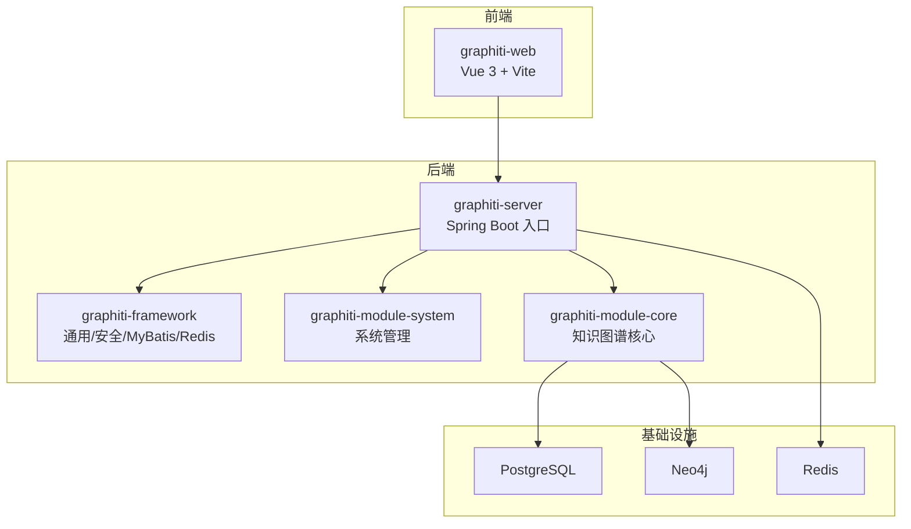
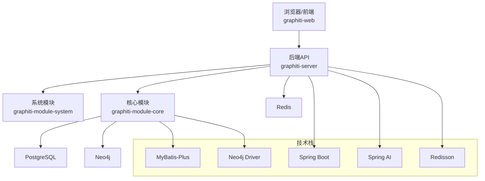
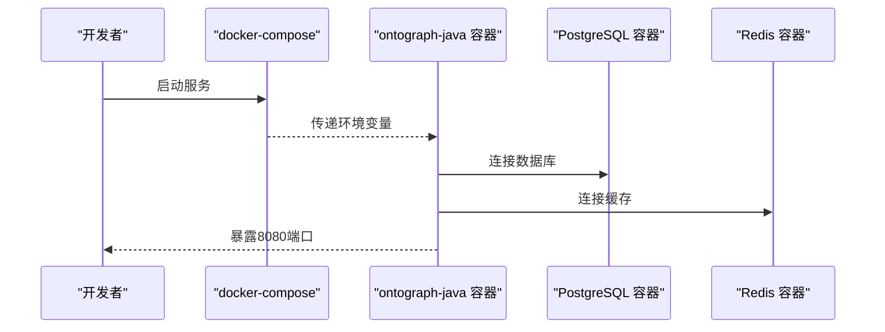
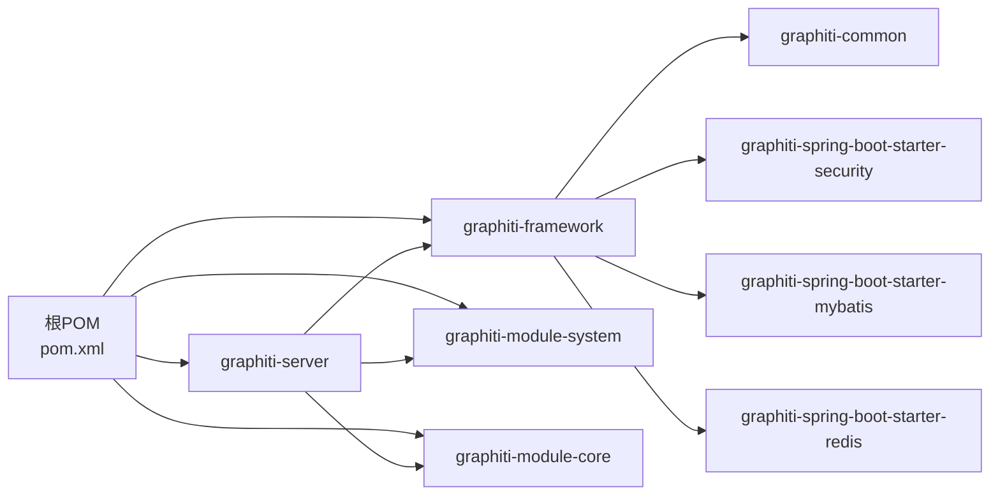

# 开发环境搭建

<!--<cite>
**本文引用的文件**
- [README.md](file://README.md)
- [pom.xml](file://pom.xml)
- [graphiti-server/src/main/resources/application.yml](file://graphiti-server/src/main/resources/application.yml)
- [graphiti-server/src/main/resources/application-dev.yml](file://graphiti-server/src/main/resources/application-dev.yml)
- [graphiti-server/src/main/java/com/graphiti/GraphitiApplication.java](file://graphiti-server/src/main/java/com/graphiti/GraphitiApplication.java)
- [graphiti-web/package.json](file://graphiti-web/package.json)
- [graphiti-web/vite.config.ts](file://graphiti-web/vite.config.ts)
- [sql/postgresql/schema.sql](file://sql/postgresql/schema.sql)
- [sql/neo4j/init.cypher](file://sql/neo4j/init.cypher)
- [docker-compose.yml](file://docker-compose.yml)
- [docker/Dockerfile](file://docker/dockerfile)
- [graphiti-framework/graphiti-common/src/main/java/com/graphiti/common/constants/ResultCode.java](file://graphiti-framework/graphiti-common/src/main/java/com/graphiti/common/constants/ResultCode.java)
- [graphiti-framework/graphiti-spring-boot-starter-security/src/main/java/com/graphiti/framework/security/config/SecurityConfig.java](file://graphiti-framework/graphiti-spring-boot-starter-security/src/main/java/com/graphiti/framework/security/config/SecurityConfig.java)
</cite>-->

## 目录
1. [简介](#简介)
2. [项目结构](#项目结构)
3. [核心组件](#核心组件)
4. [架构总览](#架构总览)
5. [详细组件分析](#详细组件分析)
6. [依赖分析](#依赖分析)
7. [性能考虑](#性能考虑)
8. [故障排查指南](#故障排查指南)
9. [结论](#结论)
10. [附录](#附录)

## 简介
本指南面向Graphiti-Java的开发者，提供从零开始的本地开发环境搭建步骤，涵盖JDK 21、Node.js、数据库（MySQL/PostgreSQL）与图数据库（Neo4j）、缓存（Redis）以及IDE（IntelliJ IDEA、VS Code）的配置要点；同时给出Maven多模块项目的导入与构建流程、Docker容器化本地开发环境配置、环境变量与数据库初始化、项目启动步骤及常见问题排查方案。

## 项目结构
Graphiti-Java采用多模块Maven工程组织，包含框架层、业务模块、服务入口与前端工程，并提供Docker一键编排开发环境。

图表来源
- [pom.xml:15-20](file://pom.xml#L15-L20)
- [graphiti-server/src/main/java/com/graphiti/GraphitiApplication.java:18-34](file://graphiti-server/src/main/java/com/graphiti/GraphitiApplication.java#L18-L34)

章节来源
- [pom.xml:15-20](file://pom.xml#L15-L20)
- [README.md:113-166](file://README.md#L113-L166)

## 核心组件
- 多模块Maven工程：统一版本与依赖管理，模块间解耦清晰。
- Spring Boot 3.5.5：应用入口与自动配置。
- Spring AI 1.1.2：多提供商LLM集成（OpenAI、Anthropic、Qwen、Ollama等）。
- MyBatis-Plus 3.5.12：数据库访问层。
- Neo4j Java Driver 5.26：图数据库交互。
- Redisson 3.37.0：缓存与分布式能力。
- 前端：Vue 3 + Vite + Ant Design Vue。

章节来源
- [README.md:170-218](file://README.md#L170-L218)
- [pom.xml:22-43](file://pom.xml#L22-L43)

## 架构总览
后端以Spring Boot为核心，通过多模块划分职责边界；前端通过Vite代理转发API至后端；数据层由PostgreSQL（系统与元数据）与Neo4j（知识图谱）组成，Redis提供缓存与会话。

图表来源
- [README.md:71-108](file://README.md#L71-L108)
- [graphiti-server/src/main/java/com/graphiti/GraphitiApplication.java:18-34](file://graphiti-server/src/main/java/com/graphiti/GraphitiApplication.java#L18-L34)

## 详细组件分析

### JDK 21 环境准备
- 必须安装JDK 21，确保Maven与IDE均指向该JDK。
- Maven属性中明确指定源/目标版本为21，保证编译一致性。

章节来源
- [pom.xml:24-26](file://pom.xml#L24-L26)
- [README.md:225](file://README.md#L225)

### Node.js 与前端构建
- 前端使用Vite + Vue 3，开发服务器默认端口可按需调整。
- 包管理器使用pnpm，开发脚本包含dev/build/preview/type-check。
- Vite配置了对后端8080端口的代理，便于前后端联调。

章节来源
- [graphiti-web/package.json:5-10](file://graphiti-web/package.json#L5-L10)
- [graphiti-web/package.json:22-30](file://graphiti-web/package.json#L22-L30)
- [graphiti-web/vite.config.ts:18-26](file://graphiti-web/vite.config.ts#L18-L26)

### 数据库与图数据库初始化

#### PostgreSQL（首选）
- 使用提供的SQL脚本初始化Schema与基础数据。
- 开发配置中默认连接本地PostgreSQL，账号密码可在环境变量或配置文件中覆盖。

章节来源
- [sql/postgresql/schema.sql:1-319](file://sql/postgresql/schema.sql#L1-L319)
- [graphiti-server/src/main/resources/application-dev.yml:488-502](file://graphiti-server/src/main/resources/application-dev.yml#L488-L502)

#### Neo4j（知识图谱）
- 执行Cypher初始化脚本，创建唯一性约束与全文索引，支撑实体检索与向量索引准备。

章节来源
- [sql/neo4j/init.cypher:1-33](file://sql/neo4j/init.cypher#L1-L33)
- [README.md:242-246](file://README.md#L242-L246)

#### MySQL（可选替代）
- 若选择MySQL作为元数据存储，可参考相应SQL脚本进行初始化。

章节来源
- [README.md:254-258](file://README.md#L254-L258)

### 缓存（Redis）
- 开发配置默认连接本地Redis，可按需调整host/port。
- 用于会话与缓存，提升系统并发与响应速度。

章节来源
- [graphiti-server/src/main/resources/application-dev.yml:503-506](file://graphiti-server/src/main/resources/application-dev.yml#L503-L506)

### LLM提供商配置
- application-dev.yml提供多提供商完整配置模板，包括OpenAI、Azure OpenAI、Qwen、Ollama、Mistral、Groq、Fireworks、Nebius、Hyperbolic、Together、SiliconFlow、Voyage等。
- 可通过环境变量或配置文件切换LLM与Embedding提供商。

章节来源
- [graphiti-server/src/main/resources/application-dev.yml:11-676](file://graphiti-server/src/main/resources/application-dev.yml#L11-L676)
- [README.md:436-476](file://README.md#L436-L476)

### 安全与认证
- 基于JWT的无状态认证，CORS放通，开放Swagger与Actuator端点。
- 未认证与权限不足时返回统一JSON格式错误码。

章节来源
- [graphiti-framework/graphiti-common/src/main/java/com/graphiti/common/constants/ResultCode.java:7-22](file://graphiti-framework/graphiti-common/src/main/java/com/graphiti/common/constants/ResultCode.java#L7-L22)
- [graphiti-framework/graphiti-spring-boot-starter-security/src/main/java/com/graphiti/framework/security/config/SecurityConfig.java:116-136](file://graphiti-framework/graphiti-spring-boot-starter-security/src/main/java/com/graphiti/framework/security/config/SecurityConfig.java#L116-L136)
- [graphiti-server/src/main/resources/application.yml:25-67](file://graphiti-server/src/main/resources/application.yml#L25-L67)

### Docker容器化本地开发环境
- docker-compose编排：graphiti-java应用、PostgreSQL、Redis。
- 多阶段Dockerfile：构建阶段预装Node.js与pnpm，先构建前端再打包后端，最终以最小JRE镜像运行。
- 健康检查与JVM参数优化，支持通过环境变量覆盖配置。

图表来源
- [docker-compose.yml:12-62](file://docker-compose.yml#L12-L62)
- [docker/Dockerfile:1-75](file://docker/Dockerfile#L1-L75)

章节来源
- [docker-compose.yml:12-112](file://docker-compose.yml#L12-L112)
- [docker/Dockerfile:1-75](file://docker/Dockerfile#L1-L75)

### IDE配置与插件推荐

#### IntelliJ IDEA
- 设置JDK 21为项目SDK与模块语言级别。
- Maven视图勾选“Use plugin registry”与“Skip tests”构建选项。
- 插件建议：Lombok、MapStruct、MyBatis Log、Rainbow Brackets、String Manipulation、Docker、PlantUML。
- 运行配置：为GraphitiApplication设置VM选项（如-Dspring.profiles.active=dev），并添加环境变量（如SPRING_PROFILES_ACTIVE=dev）。

章节来源
- [graphiti-server/src/main/java/com/graphiti/GraphitiApplication.java:18-34](file://graphiti-server/src/main/java/com/graphiti/GraphitiApplication.java#L18-L34)
- [README.md:225](file://README.md#L225)

#### VS Code
- 插件建议：Java Extension Pack、Spring Boot Extension Pack、Vue Language Features、ESLint、Prettier、Docker、GitHub Copilot。
- 前端开发：在graphiti-web目录打开终端，使用pnpm命令进行安装与开发。
- 后端调试：通过Launch配置或直接在IDE中运行GraphitiApplication。

章节来源
- [graphiti-web/package.json:5-10](file://graphiti-web/package.json#L5-L10)
- [README.md:230](file://README.md#L230)

### Maven多模块项目导入与构建
- 使用IDE导入根pom.xml，自动解析模块依赖。
- 构建命令：mvn clean install -DskipTests（跳过测试加速构建）。
- 模块顺序：framework → module-system → module-core → server。

章节来源
- [pom.xml:15-20](file://pom.xml#L15-L20)
- [README.md:234-238](file://README.md#L234-L238)

### 项目启动步骤

#### 方式一：本地原生启动
- 后端：在graphiti-server目录执行spring-boot:run或IDE运行GraphitiApplication。
- 前端：在graphiti-web目录执行pnpm dev，访问http://localhost:5173。
- Swagger：http://localhost:8080/swagger-ui.html

章节来源
- [README.md:293-312](file://README.md#L293-L312)
- [graphiti-server/src/main/resources/application.yml:58-67](file://graphiti-server/src/main/resources/application.yml#L58-L67)

#### 方式二：Docker容器启动
- 在仓库根目录执行docker-compose up -d，等待健康检查通过。
- 访问同上，容器内部已将前端构建产物复制到后端静态资源目录。

章节来源
- [docker-compose.yml:4-112](file://docker-compose.yml#L4-L112)
- [docker/Dockerfile:22-24](file://docker/Dockerfile#L22-L24)

## 依赖分析

图表来源
- [pom.xml:15-20](file://pom.xml#L15-L20)

章节来源
- [pom.xml:15-20](file://pom.xml#L15-L20)

## 性能考虑
- JVM容器化：Dockerfile中设置UseContainerSupport与MaxRAMPercentage，建议结合实际资源调优。
- 数据库连接池：HikariCP已在配置中设定最大连接数与超时，可根据并发场景调整。
- 前端代理：Vite代理仅用于开发联调，生产环境建议由Nginx统一反向代理。
- LLM调用：合理选择Embedding维度与rerank策略，避免不必要的高成本调用。

章节来源
- [docker/Dockerfile:68-74](file://docker/Dockerfile#L68-L74)
- [graphiti-server/src/main/resources/application-dev.yml:498-501](file://graphiti-server/src/main/resources/application-dev.yml#L498-L501)
- [graphiti-web/vite.config.ts:18-26](file://graphiti-web/vite.config.ts#L18-L26)

## 故障排查指南

### 数据库连接失败
- 检查PostgreSQL是否启动且端口5432可用。
- 确认application-dev.yml中的数据库URL、用户名、密码正确。
- 如使用Docker，确认容器网络与卷挂载正常。

章节来源
- [docker-compose.yml:66-84](file://docker-compose.yml#L66-L84)
- [graphiti-server/src/main/resources/application-dev.yml:488-502](file://graphiti-server/src/main/resources/application-dev.yml#L488-L502)

### Neo4j初始化异常
- 确保Neo4j服务可用，端口7687开放。
- 执行init.cypher脚本，检查约束与索引创建是否成功。

章节来源
- [sql/neo4j/init.cypher:1-33](file://sql/neo4j/init.cypher#L1-L33)
- [README.md:242-246](file://README.md#L242-L246)

### 前后端跨域与代理问题
- Vite代理配置将/api前缀转发至后端8080端口，确保后端已启动。
- 若使用Docker，确认容器端口映射与防火墙策略。

章节来源
- [graphiti-web/vite.config.ts:18-26](file://graphiti-web/vite.config.ts#L18-L26)
- [docker-compose.yml:21-23](file://docker-compose.yml#L21-L23)

### LLM提供商调用失败
- 检查对应提供商的API Key与Base URL配置。
- 对于本地推理（如Ollama/LM Studio），确认服务端口与模型已加载。

章节来源
- [graphiti-server/src/main/resources/application-dev.yml:11-676](file://graphiti-server/src/main/resources/application-dev.yml#L11-L676)
- [README.md:449-476](file://README.md#L449-L476)

### 权限与认证错误
- 未认证/权限不足时返回统一错误码，检查JWT密钥与过期时间配置。
- 确认Swagger与Actuator端点访问策略符合预期。

章节来源
- [graphiti-framework/graphiti-common/src/main/java/com/graphiti/common/constants/ResultCode.java:7-22](file://graphiti-framework/graphiti-common/src/main/java/com/graphiti/common/constants/ResultCode.java#L7-L22)
- [graphiti-framework/graphiti-spring-boot-starter-security/src/main/java/com/graphiti/framework/security/config/SecurityConfig.java:116-136](file://graphiti-framework/graphiti-spring-boot-starter-security/src/main/java/com/graphiti/framework/security/config/SecurityConfig.java#L116-L136)
- [graphiti-server/src/main/resources/application.yml:25-67](file://graphiti-server/src/main/resources/application.yml#L25-L67)

## 结论
通过本指南，您可以在本地快速搭建Graphiti-Java的开发与测试环境，完成数据库与图数据库初始化、LLM提供商配置、前后端联调与容器化部署。遇到问题时，可依据故障排查章节逐项定位并解决。

## 附录

### 环境变量清单（开发）
- SPRING_PROFILES_ACTIVE：激活dev配置
- SPRING_DATASOURCE_*：数据库连接信息
- SPRING_DATA_REDIS_*：Redis连接信息
- NEO4J_URI/USERNAME/PASSWORD：Neo4j连接信息
- SPRING_AI_*：各LLM提供商的API Key与Base URL
- GRAPHTI_AI_*：Graphiti侧LLM/Embedding/Rerank提供商选择
- GRAPHTI_SECURITY_JWT_*：JWT密钥与过期时间
- LOGGING_LEVEL_*：日志级别

章节来源
- [docker-compose.yml:23-54](file://docker-compose.yml#L23-L54)