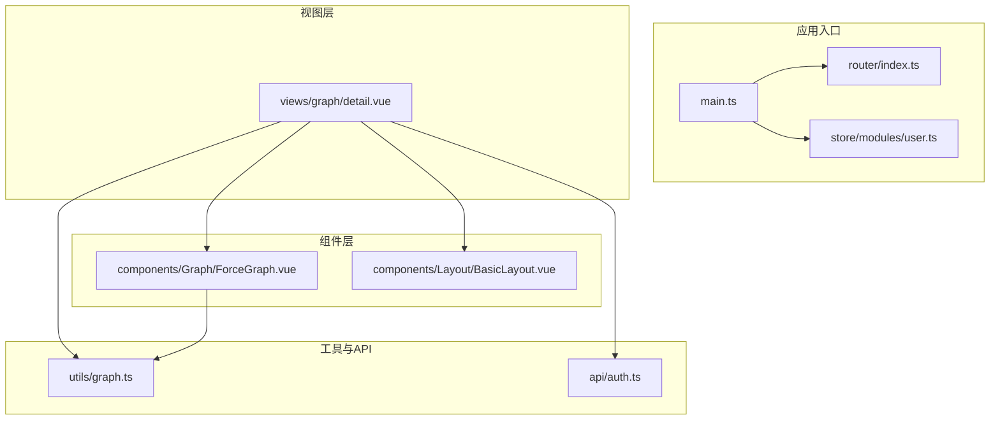
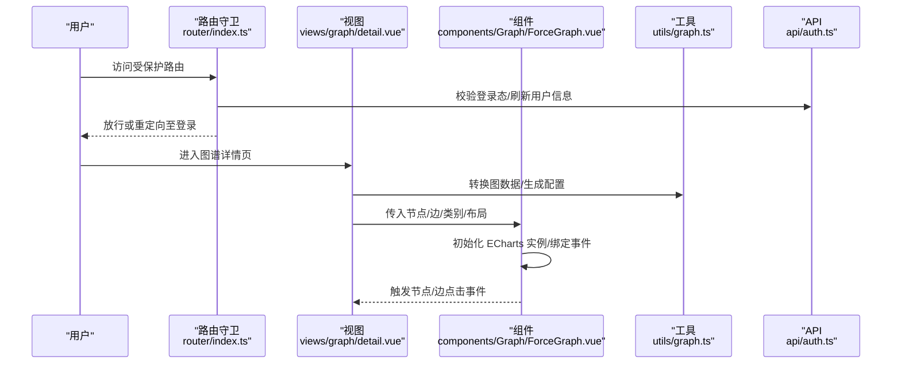
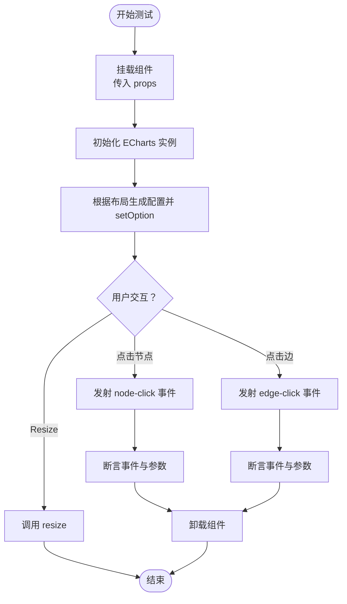
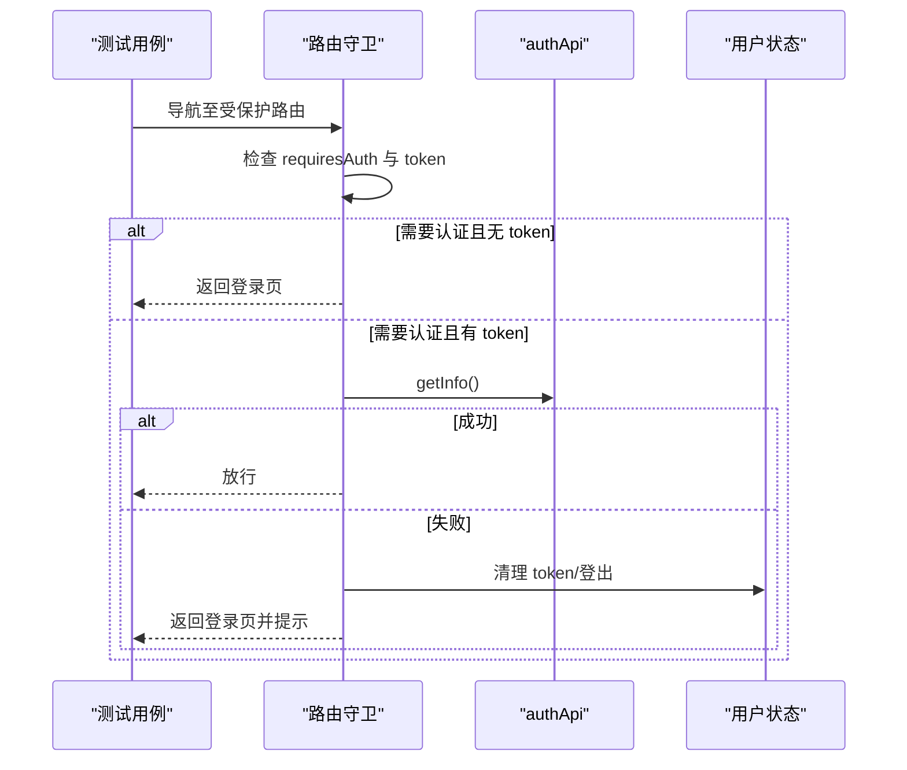
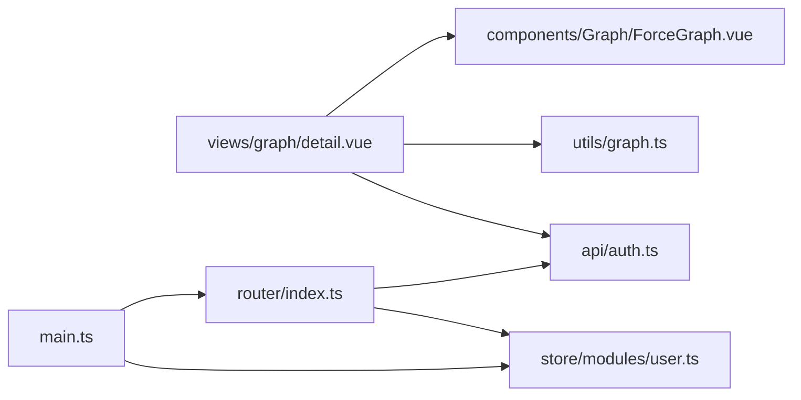

# 前端测试

<cite>
**本文引用的文件**
- [graphiti-web/package.json](file://graphiti-web/package.json)
- [graphiti-web/vite.config.ts](file://graphiti-web/vite.config.ts)
- [graphiti-web/tsconfig.json](file://graphiti-web/tsconfig.json)
- [graphiti-web/src/main.ts](file://graphiti-web/src/main.ts)
- [graphiti-web/src/router/index.ts](file://graphiti-web/src/router/index.ts)
- [graphiti-web/src/store/modules/user.ts](file://graphiti-web/src/store/modules/user.ts)
- [graphiti-web/src/api/auth.ts](file://graphiti-web/src/api/auth.ts)
- [graphiti-web/src/utils/graph.ts](file://graphiti-web/src/utils/graph.ts)
- [graphiti-web/src/components/Graph/ForceGraph.vue](file://graphiti-web/src/components/Graph/ForceGraph.vue)
- [graphiti-web/src/components/Layout/BasicLayout.vue](file://graphiti-web/src/components/Layout/BasicLayout.vue)
- [graphiti-web/src/views/graph/detail.vue](file://graphiti-web/src/views/graph/detail.vue)
- [graphiti-web/src/vite-env.d.ts](file://graphiti-web/src/vite-env.d.ts)
</cite>

## 目录
1. [引言](#引言)
2. [项目结构](#项目结构)
3. [核心组件](#核心组件)
4. [架构总览](#架构总览)
5. [详细组件分析](#详细组件分析)
6. [依赖分析](#依赖分析)
7. [性能考虑](#性能考虑)
8. [故障排查指南](#故障排查指南)
9. [结论](#结论)
10. [附录](#附录)

## 引言
本指南面向前端测试策略与实施，围绕 Vue.js 组件测试、单元测试与端到端测试展开，结合本项目的实际代码结构，给出可落地的 Vitest 使用方案、组件渲染与交互模拟、测试环境配置、Mock 服务与异步操作策略，并覆盖视觉回归、浏览器兼容性与性能测试方法，以及覆盖率与报告生成建议。同时，提供针对 Graph 组件、布局组件、路由与用户界面交互的完整测试实施方案。

## 项目结构
graphiti-web 采用 Vite + Vue 3 + TypeScript 技术栈，前端源码位于 graphiti-web/src，路由、状态管理、API 层与业务视图清晰分层；组件以功能域划分，如 Graph、Layout、StatsCard 等；工具函数集中在 utils 下，便于复用与测试。

**图表来源**
- [graphiti-web/src/main.ts:1-25](file://graphiti-web/src/main.ts#L1-L25)
- [graphiti-web/src/router/index.ts:1-233](file://graphiti-web/src/router/index.ts#L1-L233)
- [graphiti-web/src/store/modules/user.ts:1-67](file://graphiti-web/src/store/modules/user.ts#L1-L67)
- [graphiti-web/src/views/graph/detail.vue:1-426](file://graphiti-web/src/views/graph/detail.vue#L1-L426)
- [graphiti-web/src/components/Graph/ForceGraph.vue:1-133](file://graphiti-web/src/components/Graph/ForceGraph.vue#L1-L133)
- [graphiti-web/src/components/Layout/BasicLayout.vue:1-51](file://graphiti-web/src/components/Layout/BasicLayout.vue#L1-L51)
- [graphiti-web/src/utils/graph.ts:1-459](file://graphiti-web/src/utils/graph.ts#L1-L459)
- [graphiti-web/src/api/auth.ts:1-53](file://graphiti-web/src/api/auth.ts#L1-L53)

**章节来源**
- [graphiti-web/package.json:1-32](file://graphiti-web/package.json#L1-L32)
- [graphiti-web/vite.config.ts:1-41](file://graphiti-web/vite.config.ts#L1-L41)
- [graphiti-web/tsconfig.json:1-25](file://graphiti-web/tsconfig.json#L1-L25)
- [graphiti-web/src/main.ts:1-25](file://graphiti-web/src/main.ts#L1-L25)

## 核心组件
- 应用入口与运行时：main.ts 创建并挂载应用，注册路由、状态与 UI 组件库。
- 路由与鉴权：router/index.ts 定义路由与全局前置守卫，实现登录态校验与页面标题设置。
- 状态管理：store/modules/user.ts 管理用户登录态与用户信息，封装登录/登出/拉取信息等动作。
- 图谱工具：utils/graph.ts 提供图数据转换、力导向与树图配置生成，是 Graph 组件渲染的核心。
- 视图与组件：views/graph/detail.vue 聚合图谱展示、工具栏与详情面板；components/Graph/ForceGraph.vue 承载 ECharts 渲染与交互；components/Layout/BasicLayout.vue 提供布局骨架。

**章节来源**
- [graphiti-web/src/main.ts:1-25](file://graphiti-web/src/main.ts#L1-L25)
- [graphiti-web/src/router/index.ts:185-230](file://graphiti-web/src/router/index.ts#L185-L230)
- [graphiti-web/src/store/modules/user.ts:12-64](file://graphiti-web/src/store/modules/user.ts#L12-L64)
- [graphiti-web/src/utils/graph.ts:244-353](file://graphiti-web/src/utils/graph.ts#L244-L353)
- [graphiti-web/src/views/graph/detail.vue:127-316](file://graphiti-web/src/views/graph/detail.vue#L127-L316)
- [graphiti-web/src/components/Graph/ForceGraph.vue:1-133](file://graphiti-web/src/components/Graph/ForceGraph.vue#L1-L133)
- [graphiti-web/src/components/Layout/BasicLayout.vue:1-51](file://graphiti-web/src/components/Layout/BasicLayout.vue#L1-L51)

## 架构总览
下图展示从路由到视图、组件再到工具函数与 API 的调用链路，以及 ECharts 图表渲染的关键路径。

**图表来源**
- [graphiti-web/src/router/index.ts:185-230](file://graphiti-web/src/router/index.ts#L185-L230)
- [graphiti-web/src/views/graph/detail.vue:168-197](file://graphiti-web/src/views/graph/detail.vue#L168-L197)
- [graphiti-web/src/components/Graph/ForceGraph.vue:40-96](file://graphiti-web/src/components/Graph/ForceGraph.vue#L40-L96)
- [graphiti-web/src/utils/graph.ts:244-353](file://graphiti-web/src/utils/graph.ts#L244-L353)
- [graphiti-web/src/api/auth.ts:26-50](file://graphiti-web/src/api/auth.ts#L26-L50)

## 详细组件分析

### Graph 组件测试（ForceGraph）
目标
- 验证 props 输入对 ECharts 配置的影响（布局、标签、高亮）。
- 验证点击事件发射与参数正确性。
- 验证窗口 resize 与生命周期清理。

测试要点
- 渲染测试：传入不同 nodes/edges/categories/layout，断言 ECharts setOption 调用与选项结构。
- 交互测试：模拟点击节点/边，断言 emits 是否触发及回调参数。
- 生命周期：挂载/卸载时事件监听与实例销毁。
- 异步更新：watch 深度监听 props 变化后，nextTick 更新是否生效。

**图表来源**
- [graphiti-web/src/components/Graph/ForceGraph.vue:40-122](file://graphiti-web/src/components/Graph/ForceGraph.vue#L40-L122)

**章节来源**
- [graphiti-web/src/components/Graph/ForceGraph.vue:1-133](file://graphiti-web/src/components/Graph/ForceGraph.vue#L1-L133)
- [graphiti-web/src/utils/graph.ts:244-353](file://graphiti-web/src/utils/graph.ts#L244-L353)

### 布局组件测试（BasicLayout）
目标
- 验证布局结构与样式容器存在。
- 验证 Header 与 Sidebar 子组件正确渲染。
- 验证路由出口 router-view 正常显示子路由内容。

测试要点
- 结构断言：容器类名与布局层级。
- 子组件渲染：通过插槽与动态导入确认子组件挂载。
- 样式一致性：在暗色主题下布局元素可见性与对比度。

**章节来源**
- [graphiti-web/src/components/Layout/BasicLayout.vue:1-51](file://graphiti-web/src/components/Layout/BasicLayout.vue#L1-L51)

### 路由与鉴权测试
目标
- 验证受保护路由的访问控制与重定向逻辑。
- 验证登录态失效后的自动登出与提示。
- 验证页面标题设置与已登录用户访问登录页的重定向。

测试要点
- beforeEach 钩子：构造 token 存在/不存在、有效/无效场景。
- 异步校验：模拟 authApi.getInfo 成功/失败，断言守卫返回值与消息提示。
- 页面标题：断言 document.title 是否按 meta.title 设置。

**图表来源**
- [graphiti-web/src/router/index.ts:185-230](file://graphiti-web/src/router/index.ts#L185-L230)
- [graphiti-web/src/api/auth.ts:47-49](file://graphiti-web/src/api/auth.ts#L47-L49)
- [graphiti-web/src/store/modules/user.ts:35-44](file://graphiti-web/src/store/modules/user.ts#L35-L44)

**章节来源**
- [graphiti-web/src/router/index.ts:1-233](file://graphiti-web/src/router/index.ts#L1-L233)
- [graphiti-web/src/store/modules/user.ts:1-67](file://graphiti-web/src/store/modules/user.ts#L1-L67)
- [graphiti-web/src/api/auth.ts:1-53](file://graphiti-web/src/api/auth.ts#L1-L53)

### 用户界面交互测试（图谱详情页）
目标
- 验证图谱数据加载、过滤与导出/导入流程。
- 验证节点详情弹窗与快捷操作按钮行为。
- 验证布局切换与缩放适配提示。

测试要点
- 数据加载：Promise.all 并行请求节点/边，断言转换函数调用与状态更新。
- 过滤：按节点类型切换过滤器，断言节点/边集合变化。
- 交互：点击节点打开详情、点击按钮触发导出/导入/社区构建。
- 异步：使用 mock 与延迟断言消息提示与 UI 反馈。

**章节来源**
- [graphiti-web/src/views/graph/detail.vue:127-316](file://graphiti-web/src/views/graph/detail.vue#L127-L316)
- [graphiti-web/src/utils/graph.ts:215-239](file://graphiti-web/src/utils/graph.ts#L215-L239)

## 依赖分析
- 组件耦合：ForceGraph 依赖 utils/graph 的配置生成；视图层 detail.vue 依赖组件与工具函数；路由守卫依赖 API 与状态模块。
- 外部依赖：ECharts、Ant Design Vue、Axios、Less。
- 环境与构建：Vite 提供开发服务器与代理；TypeScript 编译与严格模式；Less 变量注入。

**图表来源**
- [graphiti-web/src/views/graph/detail.vue:132-138](file://graphiti-web/src/views/graph/detail.vue#L132-L138)
- [graphiti-web/src/components/Graph/ForceGraph.vue:1-133](file://graphiti-web/src/components/Graph/ForceGraph.vue#L1-L133)
- [graphiti-web/src/utils/graph.ts:1-459](file://graphiti-web/src/utils/graph.ts#L1-L459)
- [graphiti-web/src/api/auth.ts:1-53](file://graphiti-web/src/api/auth.ts#L1-L53)
- [graphiti-web/src/router/index.ts:1-233](file://graphiti-web/src/router/index.ts#L1-L233)
- [graphiti-web/src/store/modules/user.ts:1-67](file://graphiti-web/src/store/modules/user.ts#L1-L67)
- [graphiti-web/src/main.ts:1-25](file://graphiti-web/src/main.ts#L1-L25)

**章节来源**
- [graphiti-web/package.json:11-30](file://graphiti-web/package.json#L11-L30)
- [graphiti-web/vite.config.ts:1-41](file://graphiti-web/vite.config.ts#L1-L41)

## 性能考虑
- 图渲染性能：在大数据集场景下，优先使用树图或限制节点数量；避免频繁 setOption，合并更新。
- 交互优化：点击事件与 tooltip 在大数据下可能成为瓶颈，建议节流或降采样。
- 构建目标：Vite 配置目标为 es2015，CSS 目标 chrome61，确保兼容性与体积平衡。
- 资源懒加载：路由级动态导入已实现，可进一步拆分大组件以提升首屏性能。

**章节来源**
- [graphiti-web/vite.config.ts:14-17](file://graphiti-web/vite.config.ts#L14-L17)
- [graphiti-web/src/components/Graph/ForceGraph.vue:66-96](file://graphiti-web/src/components/Graph/ForceGraph.vue#L66-L96)

## 故障排查指南
- 路由守卫异常：若登录态校验失败，会清空 token 并提示“认证失败/登录已过期”，检查后端接口与 token 有效期。
- 图表空白：确认 nodes/edges 非空，检查 transformGraphData 与 ECharts 初始化是否执行。
- 样式问题：Less 变量注入与暗色主题需确保编译顺序与作用域正确。
- 环境变量：Vite 环境变量在编译期注入，注意区分 import.meta.env 与 process.env 的差异。

**章节来源**
- [graphiti-web/src/router/index.ts:194-217](file://graphiti-web/src/router/index.ts#L194-L217)
- [graphiti-web/src/components/Graph/ForceGraph.vue:40-57](file://graphiti-web/src/components/Graph/ForceGraph.vue#L40-L57)
- [graphiti-web/vite.config.ts:27-39](file://graphiti-web/vite.config.ts#L27-L39)
- [graphiti-web/src/vite-env.d.ts:3-11](file://graphiti-web/src/vite-env.d.ts#L3-L11)

## 结论
本项目前端测试应以 Vitest 为核心，结合组件渲染与交互模拟、路由守卫与状态管理测试、工具函数纯函数测试，形成完整的单元与集成测试体系。在此基础上扩展端到端测试，覆盖真实用户路径与关键业务流程。同时，结合构建目标与样式配置，完善浏览器兼容性与性能测试，最终通过覆盖率与报告工具闭环质量保障。

## 附录

### 测试环境配置与脚本
- 构建与类型检查：通过 package.json 中的 scripts 与 Vite/TypeScript 配置完成。
- 环境变量：在 Vite 环境中声明 import.meta.env，结合 .env 文件进行本地/CI 配置。
- 代理与后端联调：Vite dev server 代理 /api 到后端 8080，便于前端直连后端接口进行测试。

**章节来源**
- [graphiti-web/package.json:5-10](file://graphiti-web/package.json#L5-L10)
- [graphiti-web/vite.config.ts:18-26](file://graphiti-web/vite.config.ts#L18-L26)
- [graphiti-web/src/vite-env.d.ts:3-11](file://graphiti-web/src/vite-env.d.ts#L3-L11)

### Mock 服务与异步策略
- API Mock：使用 Vitest 的 mock 函数拦截 axios 请求，返回稳定数据集。
- 异步断言：对 Promise.all、setInterval、message 提示等异步行为使用 advanceTimers 或微任务断言。
- 事件模拟：使用 DOM 事件模拟库触发 click/touch 等交互，验证 emits 与 UI 反馈。

### 视觉回归与浏览器兼容性
- 视觉回归：在 CI 中使用无头浏览器截图对比，识别样式与布局偏差。
- 兼容性：基于 Vite 构建目标与 CSS 目标，选择代表性浏览器进行回归测试。

### 覆盖率与报告
- 覆盖率：开启 Vitest 覆盖率统计，重点关注 utils/graph、router/index.ts、store/modules/user.ts 与组件交互逻辑。
- 报告：生成 HTML/JSON 报告，结合 CI 平台进行趋势跟踪与阈值告警。